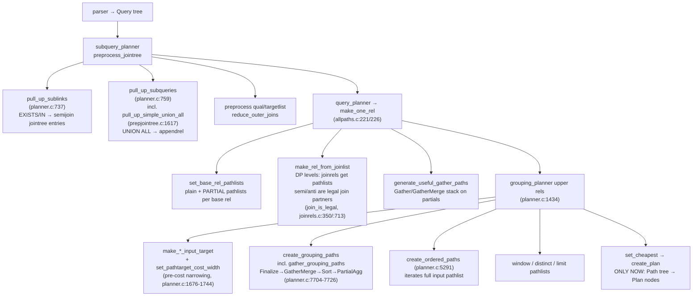
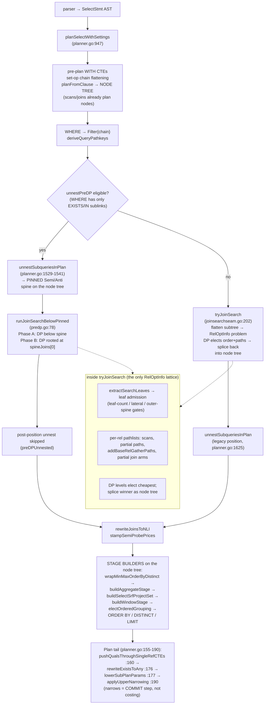

# Plan flow at medium abstraction — PG 18.3 vs goopg

**Filed:** 2026-09-20 (owner question). **Basis:** the commit series around
`c2c1d32` (`9463459a`…`c2c1d32`), M0144-0002/0003/0007 evidence, and direct
reads of `internal/optimizer/planner.go`, `joinsearchseam.go`, `predp.go`
vs `postgres/src/backend/optimizer/{plan,path}/`.

**Question answered:** reading recent commit messages one gets the
impression that, at a *medium* level of abstraction (the order in which
the planner transforms and elects things, not the fine detail of
`add_path`), goopg's flow differs from PG's. **Confirmed — the intuition
is correct, and the divergences are enumerable and localised.** The fine
level inside goopg's join-search seam is surprisingly PG-faithful
(pathlists, `add_path`-style election, DPPATH provenance); it is the
*medium* level — what data structure each phase operates on, and in which
order — that differs.

## The one-paragraph answer

PG keeps a **RelOptInfo/pathlist lattice** alive from jointree
preprocessing through base rels, join search, and every upper rel, and
only converts the winning path tree into plan nodes at the very end
(`create_plan`). goopg builds a **plan-node tree early**, runs the
PG-shaped lattice *inside a seam* for the FROM-clause join order only,
splices the winner back into the node tree, and then runs **node-tree
stage builders** (aggregate, window, SRF, sort, limit) plus a post-pass
narrowing. Every measured "landed but inert" mechanism traces to this
boundary: a PG transform that lives on the jointree or on pathlists has
no equivalent site in goopg's node-tree pipeline.

## PG 18.3 — medium flow

## goopg — medium flow

Two more medium-level routes the diagram does not draw:

- **Outer-link route.** The `unnestPreDP eligible?` diamond sits inside
  `s.Where != nil`. A *filterless* tree enters the seam only when it
  carries an outer link (`joinTreeHasOuterLink` → `tryJoinSearch`,
  planner.go:1611); a filterless inner/cross tree skips join search
  entirely. Phase B calls `tryPGShapedJoinSearch` directly
  (predp.go:197).
- **Single-table bypass.** `isSimpleSingle` routes single-table
  statements to a rule chooser (LIKE-range injection, NOT NULL
  reduction, alwaysFalse — planner.go:1425-1488) and never builds a
  RelOptInfo, unless `GOOPG_ONEREL_SEARCH` drops `minSearchRels` to 1
  (joinsearchseam.go:243). PG has no analog: `set_base_rel_pathlists`
  builds pathlists for every base rel before the joinlist is even
  examined.

## Phase mapping

| PG phase | goopg equivalent | same site? |
|---|---|---|
| `pull_up_sublinks` (jointree, pre-paths) | `unnestSubqueriesInPlan` (node tree, pre-DP when eligible) | **no** — operates on plan nodes, produces a *pinned spine*, not jointree members |
| `pull_up_subqueries` / `pull_up_simple_union_all` | UNION ALL stays a `*SetOp` node; `addPartialSetOpPath` produces at that level | **no** — no appendrel *join citizen* (`setOpBranchRel` attaches a carrier rel; the mixed arm files "where the SetOp stands in for an appendrel", windowsetoppaths.go:563-569) |
| `make_one_rel` (base + join pathlists, partials, gathers) | `tryJoinSearch` seam (RelOptInfo lattice exists, but only for the searched subtree) | **partially** — lattice inside a seam, not spanning the query |
| `create_grouping_paths`/`create_ordered_paths` (pathlists per upper rel) | `buildAggregateStage`/`electOrderedGrouping`/`upper.ordered.*` producers | **no** — node builders + local elections (ordered-input claims partially aligned by M0144-0011a) |
| pre-cost input targets / `set_pathtarget_cost_width` | **already pre-cost at three sites** (`narrowOrderedRelWidths`, `window_sort_narrow`, `aggInputWidth`); `applyUpperNarrowing` is the commit step | **yes** — premise corrected by M0144-0003c (`25757b4ce`); only the Sort-under-grouping reader was un-narrowed, now fixed |
| `inline_cte` + qual pushdown | `pushQualsThroughSingleRefCTEs` (refcount==1 only, body stays a boundary) | **partially** |
| `create_plan` (single conversion) | continuous — the tree is always plan nodes | n/a |

## The six divergences the recent commits actually measured

### D1 — Sublink rewriting: jointree member vs pinned spine

PG's `pull_up_sublinks` (planner.c:737) turns EXISTS/IN into semijoin
*jointree entries* before any path exists, so DP legality (`join_is_legal`,
joinrels.c:350/:713) treats them as ordinary searched partners.
goopg's pre-DP unnest builds `Semi/Anti` **plan nodes** pinned above the
searched chain; Phase B then re-searches rooted at the spine. The
node-tree substrate costs admission gates PG never needed: `leaf-count`
declines because the sunk conjunct arrives as a `*Project` over
already-planned composites (`*Gather`, `*CTEScan`, `*Join`, `*NLI`) —
one opaque leaf, not a base relation (`joinsearchseam.go:325` vs
`extractSearchLeaves` :1280); `lateral` declines (correctness,
`491aee2c7`); and `c2c1d32` measured the residual gap as unimplementable
*at Phase B* — because the shape itself (planned composites inside
Semi.Left) is a node-tree artefact with no jointree counterpart.

### D2 — UNION ALL: appendrel citizen vs SetOp boundary

PG flattens UNION ALL-in-FROM into an appendrel during jointree
preprocessing (`pull_up_simple_union_all`, prepjointree.c:1617 via
planner.c:759); `add_paths_to_append_rel` (allpaths.c:1321) files partial
paths per child, making Parallel Append an ordinary join input. goopg has
no flattening: `*SetOp` is a plan node and `addPartialSetOpPath` produces
at that level — corpus-measured **0/99 Parallel Append vs PG's 9 sites**
(M0144-0003 item (b) → M0144-0003b).

### D3 — Partial-path ecosystem: same plumbing, different substrate

goopg *does* have partial pathlists inside the seam
(`considerparallel.go`, `addBaseRelGatherPaths`, partial join arms in
`joinpathsparallel.go`) — the medium-level plumbing exists. The gap is
underneath: (a) `parallel_hash` is refused because no executor builds a
hash table from a partial inner (`joinpathsparallel.go:59-61`); (b)
Partial Aggregate emits **zero rows** — it publishes transition state
into a shared accumulator (`ctx.PartialAggStates`,
`internal/executor/context.go:326-336`,
`internal/executor/operators_join_agg.go:2176-2180`), so PG's
`Finalize → GatherMerge → Sort → PartialAgg` stack
(`gather_grouping_paths`, planner.c:7704-7726) is **inexpressible**
(`9463459a`: the arm is priced *correctly* — it loses Q1 at 1510695.91
vs the winning split arm's 67840.37 — and the shape cannot exist); (c)
partial-**nestloop** admission is a jointype
whitelist `{INNER, SEMI}` (`addPartialNestLoopPaths`' V1-nl-inner gate in
`joinpathsnli.go`; +SEMI as of `511b6d5c9`) where PG's nestloop dispatch
admits `{INNER, LEFT, SEMI, ANTI}` (joinpath.c:1842-1846).

### D4 — Upper rels: full pathlists vs stage builders + local elections (partially closed by M0144-0011a)

PG's `create_ordered_paths` (planner.c:5291) iterates the input rel's
*entire pathlist*; ordering eligibility flows from pathkeys attached to
every candidate, minimum one path (planner.c:5337). goopg elects among
named producers (`electOrderedGrouping`, `upper.ordered.*`), and the seam
between the node tree and the election is `inputNodePathkeys`
(`upperorderedinput.go:200`). The M0144-0007 census measured the
**pre-0011a** state: `nonemptykeys=0` at every `upper.ordered.seed` —
`*Aggregate` tops returned nil, so presorted input and Incremental Sort
were structurally unreachable (census Finding 1). **M0144-0011a closed
that arm**: `46fd2a8b0` derives a sorted aggregate's emission order
(`aggregateEmissionPathkeys`, upperorderedinput.go:332), `5bbcaf612`
crosses a positional-identity `*Project`, `2a0353614` dropped the
candidate minimum 2→1 ("PG's minimum is one path, not two",
upperorderedgrouping.go:237-239), and `electOrderedGrouping` now
populates `ordered.SearchCandidates` itself and elects `*IncrementalSort`
winners (:285-346). The residual divergences are still medium-level:

- node tops outside {searched root, `*Sort`, `*Filter`, `*Limit`,
  `*Aggregate`, positional-identity `*Project`} still hit `default: nil`
  (upperorderedinput.go:262) — `*MergeJoin`/`*GatherMerge`/
  `*IncrementalSort`/`*WindowAgg` tops carry no claim;
- `gate-precondition` decline when `node != agg.node`
  (upperorderedgrouping.go:219) — a HAVING `*Filter`, `*WindowAgg`,
  min-max wrap or `*ProjectSet` between ORDER BY and the aggregate skips
  the loop entirely, where PG iterates regardless;
- `electOrderedDistinct` still carries the `len(cands) < 2` gate
  (upperordereddistinct.go:140) — the surviving instance of the
  mechanism the census flagged.

### D5 — Narrowing: premise refuted by its own landing (M0144-0003c)

This was filed (route-order item (d)) as "goopg narrows only
post-tournament" — and the task's own landing (`25757b4ce`, design doc
`m0144-0003c-pre-cost-sort-width.md`) measured the premise **half
wrong**: goopg already narrows input width *pre-cost* at three sites —
the ORDERED rel's Sort (`narrowOrderedRelWidths`,
`ordered_input_narrow.go:128` via `upperordered.go:82`), WINDOW's
internal sort (`window_sort_narrow`), and the aggregate's entry sizing
(`aggInputWidth`, `groupingpaths.go:357`). `applyUpperNarrowing`
(planner.go:190) is the COMMIT step that inserts the narrowing Project,
not the costing step. The one genuine gap — the Sort *beneath* a
grouping candidate pricing through the input rel's full row while the
aggregate above it priced the narrow row — was fixed by handing both
sort sites a narrowed seed copy. Result: **inert** (TPC-H byte-identical
plans, SF0.25 same=99) — `costSortRunWithWidth` lets width reach the
price only through the spill branch, and no corpus grouping sort
spills. Lands anyway per R3 (PG-faithful; prerequisite for the spill
branch). So D5 is the one divergence that is *already closed* — and a
cautionary example that even a "flow-level" filing can misread which
side of the boundary a step sits on.

### D6 — CTE: `inline_cte` vs refcount-1 qual pushdown

PG inlines single-reference CTEs into the jointree (`inline_cte`,
subselect.c) where ordinary pushdown applies. goopg keeps the CTE a
planned boundary; `pushQualsThroughSingleRefCTEs` pushes the *qual* only
when refcount==1 (shared-body/cache correctness). The M0144-0007 census
prices the boundary: `PG Sort | goopg CTE ss/ssr/ws` records are all
`priced-structural` at +24..+264%.

## Consistency check against the census

M0144-0007 measured **~72% of first-divergence points as structural**
(`unexpressible` 50%, `dominated-noncost` 9%, `priced-structural` 13%)
and ~28% election-class with `input` nearly empty (1/210). The flow map
above is *why*: the divergences are generation/boundary gaps
(D1 spine shape, D2 no appendrel citizen, D3 executor substrate, D6 CTE
boundary) — none reachable by cost adjustment. D4's census-era arm is
closed (0011a); its residual gates are the same shape of problem. D5
turned out not to be a divergence at all: goopg already narrowed
pre-cost at three sites, and its one real gap landed inert.

## Implications for the M0144 campaign

- **M0144-0003's children are themselves evidence.** `M0144-0003a` was
  filed as "sunk-Filter leaf admission" and measurement showed it is
  **not implementable as a leaf-admission change** — the sunk node is a
  `*Project` over already-planned composites (`*Gather`, `*CTEScan`,
  `*Join`, `*NLI`), not a base-rel leaf. It joins M0142-0008a-3(i)/(ii)
  and `M0142-0008a-3i-lateral` on one blocker: Phase B must search
  **before** Phase A lowers anything — a fourth confirmation of the
  route-order thesis. `M0144-0003b` (jointree UNION ALL flattening) is
  `[!]`-superseded — its residual lives in M0145-0004's jointree-level
  appendrel (filed 2026-09-20); `M0144-0003c` landed `[x]` —
  correcting its own premise in the process (D5 above).
- **M0144-0011 vertical slices** must pick representatives whose first
  divergence is NOT floored by D3's executor model; the margin census's
  `unexpressible`/`dominated-noncost` columns already encode that filter.
- Ordering-claim propagation **landed** (M0144-0011a + 0011a-2/0011a-3:
  `46fd2a8b0`, `5bbcaf612`, `2a0353614`) — the census's largest
  `unexpressible` family (`Limit→{GroupAgg|IncrSort}` vs `Sort`) is now
  a priced election. The residual set is exactly the three gates in D4:
  unclaimed node tops, `gate-precondition`, and the distinct-side
  `cands<2`.

## File/line index

| site | PG | goopg |
|---|---|---|
| sublink pull-up | `planner.c:737` `pull_up_sublinks`; `prepjointree.c:468` | `planner.go:1529` `unnestSubqueriesInPlan`; `unnest.go:424` |
| UNION ALL flatten | `planner.c:759`→`prepjointree.c:1617` | none — `*SetOp` node; `windowsetoppaths.go:583` `addPartialSetOpPath` |
| base+join lattice | `allpaths.c:221/:226` `make_one_rel` | `joinsearchseam.go:202` `tryJoinSearch`; `joinsearchlevel.go:308` `joinSearch` |
| semi/anti legality | `joinrels.c:350` `join_is_legal` (SJInfo consulted at the ~:713 call site) | pinned spine + Phase B `predp.go:197`; gates at `joinsearchseam.go:325/:329` |
| partial paths | `allpaths.c:795` `create_plain_partial_paths`; jointype dispatch `joinpath.c:1842-1846` | `considerparallel.go`; `gatherpaths.go:782`; jointype whitelist `joinpathsnli.go`/`gatherpaths.go`/`parallel.go` |
| partial-agg gather | `planner.c:7704-7726` `gather_grouping_paths` | inexpressible — zero-row PartialAgg publishes to `ctx.PartialAggStates` (`internal/executor/context.go:326-336`, `operators_join_agg.go:2176-2180`) |
| ordered upper paths | `planner.c:5291` `create_ordered_paths` | `electOrderedGrouping` (call `planner.go:1979`, def `upperorderedgrouping.go:212`); `inputNodePathkeys` `upperorderedinput.go:200` — `*Aggregate` arm at :251 (0011a, `aggregateEmissionPathkeys` :332) |
| narrowing timing | `planner.c:1676-1744` + `costsize.c:6367` | already pre-cost: `ordered_input_narrow.go:128`, `window_sort_narrow`, `aggInputWidth` `groupingpaths.go:357`; `applyUpperNarrowing` `planner.go:190` = commit step (M0144-0003c, `25757b4ce`) |
| CTE inline | `subselect.c` `inline_cte` | `cte_inline_pushdown.go` (refcount==1 qual pushdown only) |
| path→plan | `create_plan` (single conversion) | continuous — the tree is always plan nodes |
