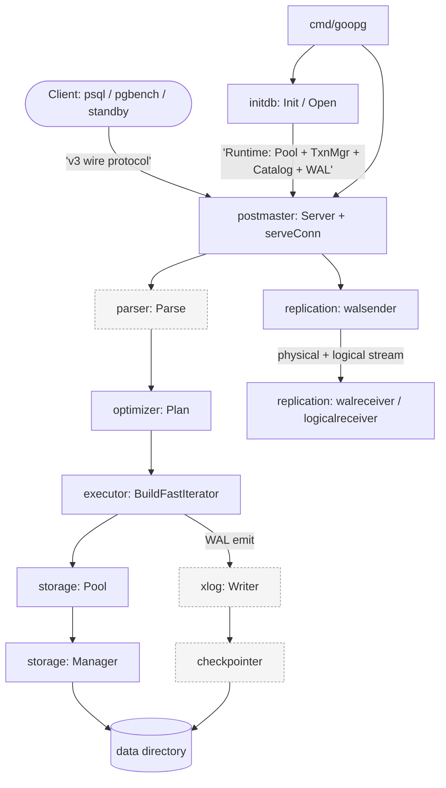

# Architecture

goopg is a single Go process (no fork-per-backend like PostgreSQL). The
`cmd/goopg` binary initializes and opens a data directory, then hands control to
`internal/postmaster`, which accepts TCP connections and runs **one goroutine
per client connection** — each goroutine is the analogue of one PostgreSQL
backend process, owning its own MVCC transaction, snapshot, pinned buffers, and
WAL inserts. SQL flows through four stages in turn: parse (`internal/parser`),
plan (`internal/optimizer`), execute (`internal/executor`),
and access storage through the buffer pool (`internal/storage`).

The data directory is the durable substrate. `internal/initdb` writes it from
scratch at `init` time and rebuilds the in-memory catalog from its on-disk
heaps at `open` time (after WAL replay). WAL is emitted by the executor, flushed
by the checkpointer, and streamed to standbys by `internal/replication`.

## Components

- **`cmd/goopg`** — process entry, CLI subcommands, storage/GUC wiring, standby
  orchestration. See [`modules/cmd-goopg.md`](modules/cmd-goopg.md).
- **`internal/postmaster`** — the server: listener, per-connection lifecycle,
  wire-protocol frame loop, simple + extended + COPY dispatch, control plane.
  See [`modules/postmaster.md`](modules/postmaster.md).
- **`internal/optimizer`** — the planner: statement dispatch, subquery
  unnesting, PG-shaped join search, cardinality, plan IR. See
  [`modules/optimizer.md`](modules/optimizer.md).
- **`internal/executor`** — the engine: operators, expression evaluation,
  DML/DDL, stored routines. See [`modules/executor.md`](modules/executor.md).
- **`internal/storage`** — buffer pool, storage manager, heap/tuple, FSM/VM,
  lock manager. See [`modules/storage.md`](modules/storage.md).
- **`internal/initdb`** — bootstrap + recovery + the `Runtime` composition
  root. See [`modules/initdb.md`](modules/initdb.md).
- **`internal/replication`** — streaming + logical replication. See
  [`modules/replication.md`](modules/replication.md).

## System Diagram

Solid boxes are in scope for this wiki; dashed boxes are adjacent packages
referenced for context.

> `parser`, `xlog`, and the checkpointer are documented at this architectural
> level but are documented in the [Module Map](README.md#module-map) of this wiki.

## Data Flow

1. **Connect** — `postmaster.Run` → `acceptLoop` → `serveConn` per connection
   (`internal/postmaster/server.go`).
2. **Parse** — `parser.Parse` (`internal/postmaster/dispatch.go:166`).
3. **Plan** — `optimizer.Plan(stmt, catalog)` (`internal/postmaster/dispatch.go:1161`).
4. **Execute** — `executor.BuildFastIterator(node)` → `Open`/`Next`/`Close`
   (`internal/postmaster/dispatch.go:3398`).
5. **Access storage** — operators pin pages through `storage.Pool.Pin` and read
   through `storage.Manager.ReadBlock`; heap writes go through
   `storage.PageAddHeapTuple`/`PageSetHeapTupleXmax`.
6. **Persist** — WAL records flush to disk via the checkpointer; heap pages flush
   on checkpoint/eviction.

## Key Design Decisions

- **Single process, goroutine-per-connection** — the client goroutine owns WAL
  insert + synchronous-commit flush; checkpointer/walwriter/autovacuum are
  separate goroutines.
- **Byte-level PG compatibility** — page layout, tuple headers, catalog heaps,
  and WAL are PG-18.3-identical so real PG can attach as a standby.
- **Two executor engines** — the legacy `Operator` tree is kept alongside the
  GC-free fast slab; both must stay behaviourally in sync.
- **Wire-level DDL bypass** — CREATE/ALTER/DROP DATABASE and ROLE lack parser
  grammar and are intercepted by string-prefix matching in `postmaster`.
- **Deliberately shallow cost model at `pathkeys`** — syntactic pathkeys, a
  false-negative on sort elimination but never a wrong plan.
