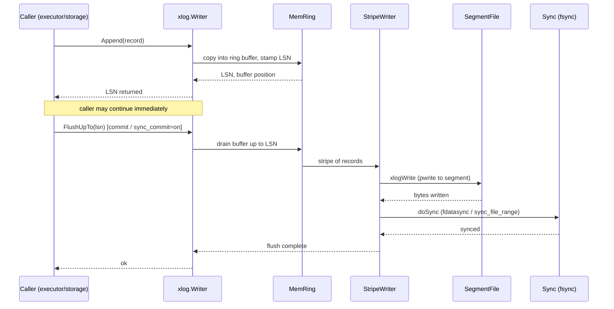
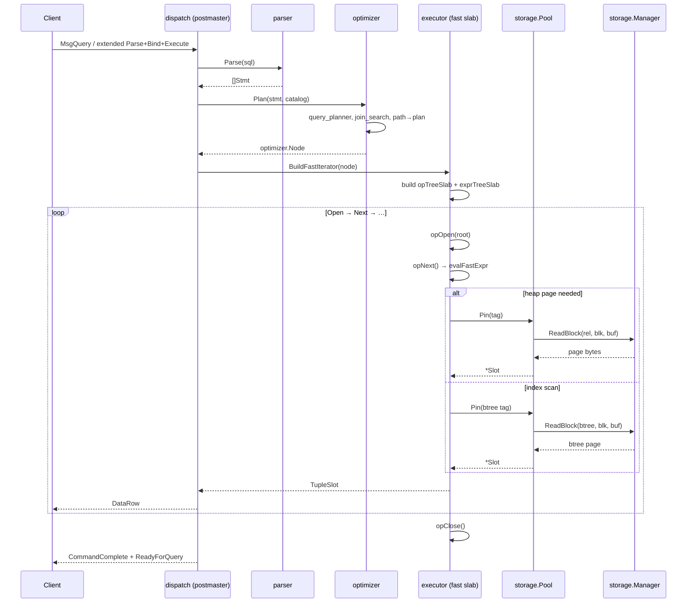
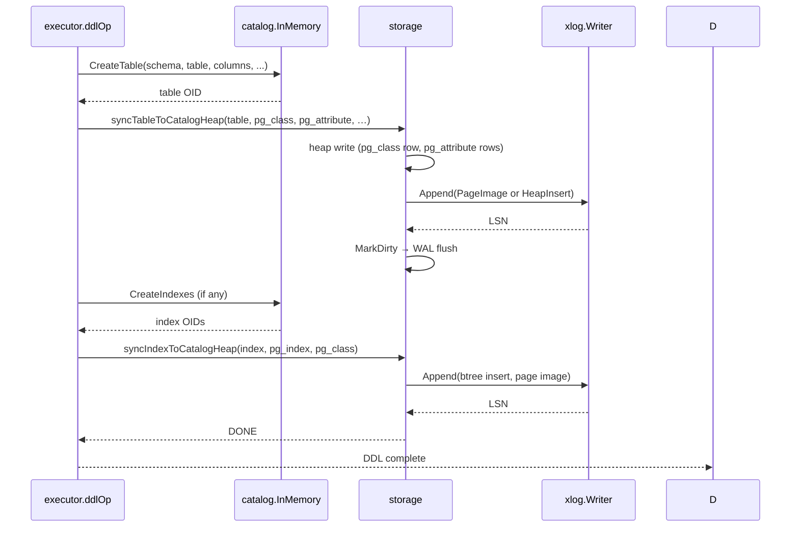

# Additional Diagrams

## WAL Append-and-Flush Flow

The path a record takes from the caller (`Append`) through the in-memory ring
buffer, the segment writer, and the commit-LSN flush barrier.

## Query Plan-to-Execution Flow

The path from `SELECT` text, through the optimizer's plan construction, to the
executor's fast-slab engine and the storage layer.

## DDL Catalog-Heap Sync Flow

How a DDL statement (e.g., `CREATE TABLE`) mutates the in-memory catalog and
persists the change to the on-disk catalog heaps.

## Notes

- **WAL append is asynchronous** — the caller's `Append` returns the LSN
  immediately; the flush is deferred to `FlushUpTo` (called at commit time or
  when the ring buffer is full). The `commit_delay` / `commit_siblings` GUCs
  throttle the flush to batch more records.
- **Fast-slab engine** — the executor builds flat `opTreeSlab` + `exprTreeSlab`
  arrays (int32-indexed, GC-pointer-free) instead of the legacy `Operator`
  interface tree. Non-migrated operators are wrapped in an `OpAdapter`.
- **Catalog-heap dual path** — the in-memory `InMemory` registry is the live
  truth; the on-disk heaps (`base/<dbOid>/1259`, `1247`, `1249`) are a
  persistence projection. Every DDL must update both (the in-memory side via
  `CreateTable` etc., the on-disk side via `syncTableToCatalogHeap`).
- **DDL undo** — on transaction ABORT, the in-memory changes are reverted
  (via `NewAutocommitUndoSession` / `DropTable` etc.), but the heap writes
  are not rolled back; the on-disk state is reconciled by the next startup's
  catalog reload.