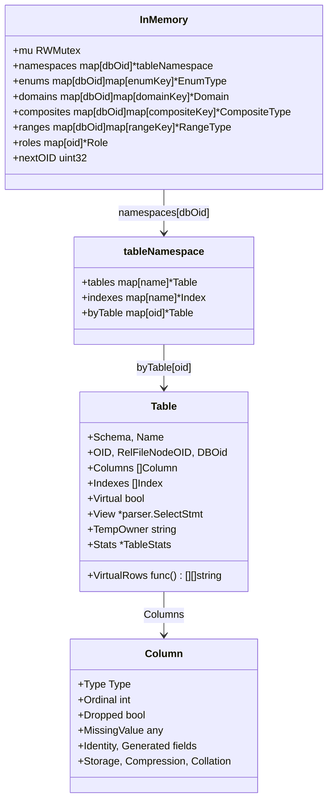
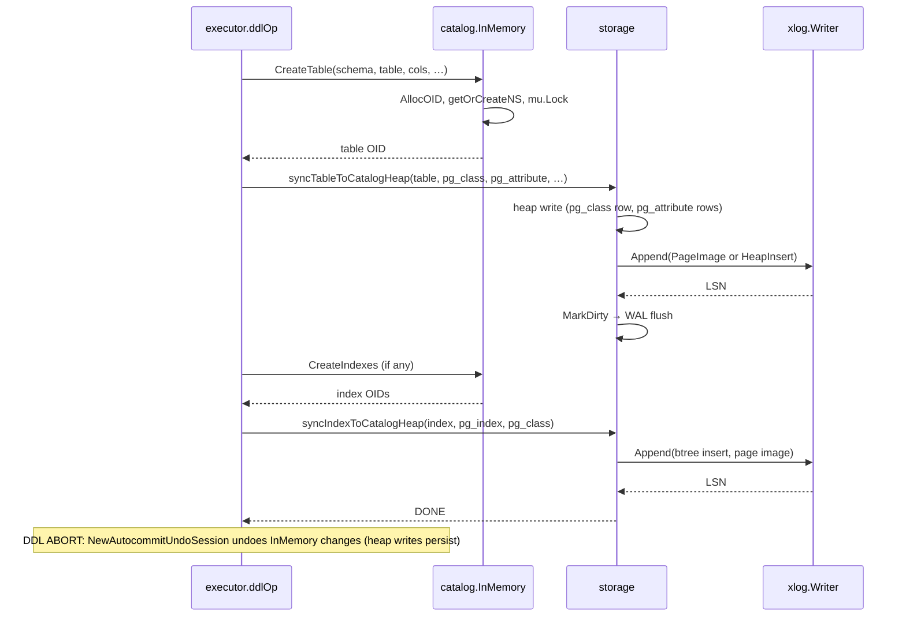

# Catalog Architecture

The in-memory `InMemory` registry structure, the virtual vs heap-backed
catalog split, and the DDL sync path to on-disk catalog heaps.

## InMemory Structure



## Virtual vs Heap-Backed Catalogs

```mermaid
flowchart TD
    CAT["catalog.InMemory"]

CAT --> Virtual["Virtual: true<br/>registerSystemTables']
    Virtual --> PGC["pg_class (1259)<br/>PGClassRowsForDBOid<br/>34-col PG18-canonical tupdesc"]
    Virtual --> PGD["pg_database, pg_namespace,<br/>pg_constraint, pg_depend,<br/>pg_stat_*, information_schema.*"]
    Virtual --> PGN["…all Go builders,<br/>no backing relfile"]

    CAT --> Heap["RegisterRealTable<br/>requires OID < FirstUserOID(16384)"]
    Heap --> PGT["pg_type (1247)<br/>heap-backed relfile"]
    Heap --> PGA["pg_attribute (1249)<br/>heap-backed relfile"]

    CAT --> Dual["pg_class also gets real heap image"]
    Dual --> Sync["syncTableToCatalogHeap<br/>writes 34-col pg_class + 25-col pg_attribute<br/>+ btree indexes + pg_attrdef + pg_inherits"]
Sync --> Reload["startup: loadUserTablesFromHeap<br/>→ reload*FromHeap passes<br/>→ rebuild InMemory from disk']

    note right of Dual: pg_class virtual rows serve live queries;<br/>heap image serves PG-standby / pg_dump parity
```

## DDL Sync to Catalog Heaps

