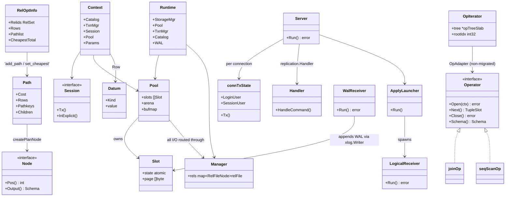

# Class Diagram

goopg is Go, so this models the central **structs and interfaces** and their
composition/ownership relationships rather than class inheritance. The diagram
spans the query path (optimizer → executor → storage) plus the postmaster and
replication lifecycles.

## Notes

- **Ownership** — `Context` is per-statement, created and torn down by
  `postmaster` dispatch; `Session` is per-connection and referenced (not owned)
  by `Context`.
- **Concurrency** — `Pool`/`Slot` pin/unpin are lock-free (atomic state word);
  `Manager` serializes AIO-vs-sync on the same block via `relFile.blockBusy`.
- **Two engines** — `Operator` (legacy tree) and `OpIterator`/`opTreeSlab` (fast
  slab) are siblings; non-migrated ops are wrapped in an `OpAdapter`.
- **Threading** — the postmaster runs one goroutine per connection; checkpointer,
  walwriter, autovacuum, and the replication receivers are separate goroutines.
