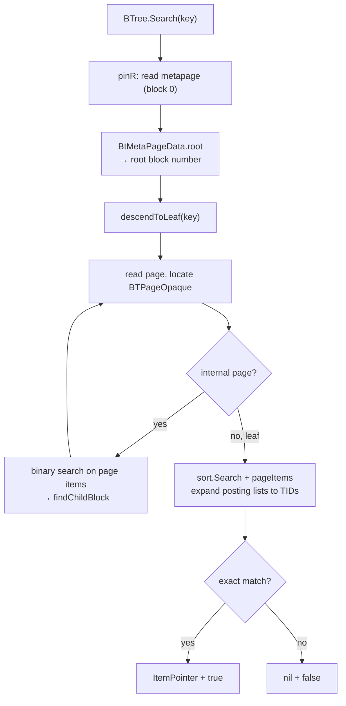
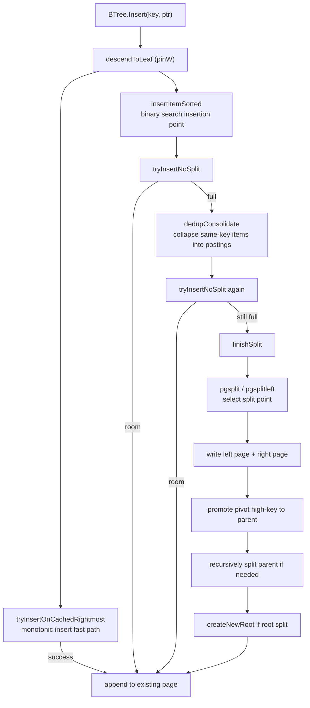
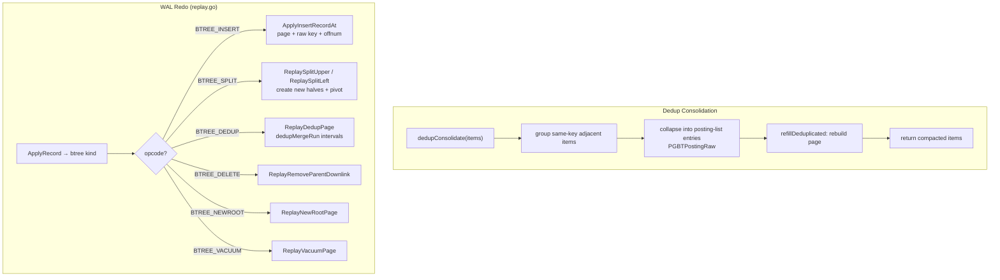

# B-Tree Operations

B-tree search descent, page split, dedup consolidation, and WAL redo.

## Search Descent

```mermaid
flowchart TD
S["BTree.Search(key)"] --> M["pinR: read metapage (block 0)"]
    M --> Root["BtMetaPageData.root<br/>→ root block number"]
    Root --> Desc["descendToLeaf(key)"]
    Desc --> Loop["read page, locate BTPageOpaque"]
    Loop --> Int{"internal page?"}
    Int -->|yes| BinSearch["binary search on page items<br/>→ findChildBlock"]
    BinSearch --> Loop
    Int -->|no, leaf| LeafScan["sort.Search + pageItems<br/>expand posting lists to TIDs"]
    LeafScan --> Found{"exact match?"}
    Found -->|yes| Return["ItemPointer + true"]
    Found -->|no| ReturnNull["nil + false"]
```

## Page Split

```mermaid
flowchart TD
    Ins["BTree.Insert(key, ptr)"] --> Desc["descendToLeaf (pinW)"]
    Desc --> TryFast["tryInsertOnCachedRightmost<br/>monotonic insert fast path"]
    TryFast -->|success| Done
    Desc --> InsSort["insertItemSorted<br/>binary search insertion point"]
    InsSort --> TryNoSplit["tryInsertNoSplit"]
    TryNoSplit -->|room| Done["append to existing page"]
    TryNoSplit -->|full| Dedup["dedupConsolidate<br/>collapse same-key items into postings"]
    Dedup --> TryNoSplit2["tryInsertNoSplit again"]
    TryNoSplit2 -->|room| Done
    TryNoSplit2 -->|still full| Split["finishSplit"]
    Split --> PGSplit["pgsplit / pgsplitleft<br/>select split point"]
    PGSplit --> Write["write left page + right page"]
    Write --> Promo["promote pivot high-key to parent"]
    Promo --> Rec["recursively split parent if needed"]
    Rec --> NewRoot["createNewRoot if root split"]
    NewRoot --> Done

    %% note right of Done: WAL-logged at each mutation step
```

## Dedup Consolidation + WAL Redo

```mermaid
flowchart TD
    subgraph Dedup Consolidation
        D1["dedupConsolidate(items)"] --> D2["group same-key adjacent items"]
        D2 --> D3["collapse into posting-list entries<br/>PGBTPostingRaw"]
D3 --> D4["refillDeduplicated: rebuild page"]
        D4 --> D5["return compacted items"]
    end

    subgraph "WAL Redo (replay.go)"
        R1["ApplyRecord → btree kind"] --> R2{"opcode?"}
        R2 -->|BTREE_INSERT| R3["ApplyInsertRecordAt<br/>page + raw key + offnum"]
        R2 -->|BTREE_SPLIT| R4["ReplaySplitUpper / ReplaySplitLeft<br/>create new halves + pivot"]
        R2 -->|BTREE_DEDUP| R5["ReplayDedupPage<br/>dedupMergeRun intervals"]
        R2 -->|BTREE_DELETE| R6["ReplayRemoveParentDownlink"]
        R2 -->|BTREE_NEWROOT| R7["ReplayNewRootPage"]
        R2 -->|BTREE_VACUUM| R8["ReplayVacuumPage"]
    end

    %% note right of D5: Opportunistic; runs before split<br/>so same-key items share a page
```