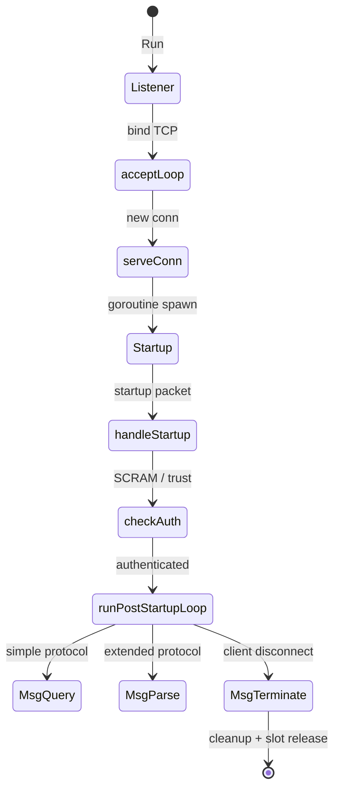
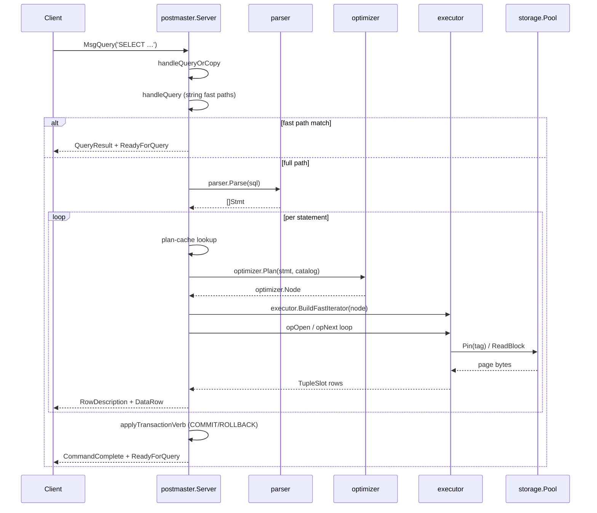
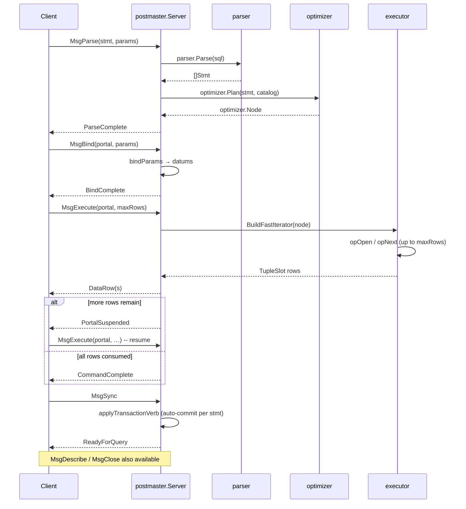

# Postmaster Flow

Connection lifecycle, simple-query protocol flow, and extended-query protocol
flow through the goopg server.

## Connection Lifecycle

## Simple-Query Protocol

## Extended-Query Protocol

