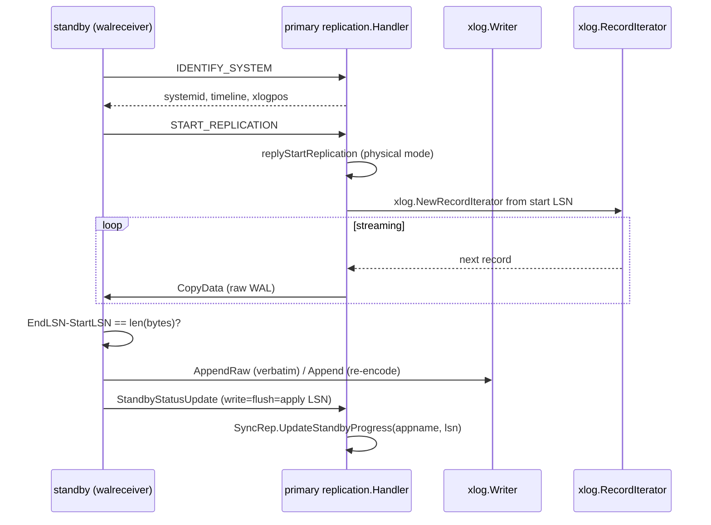
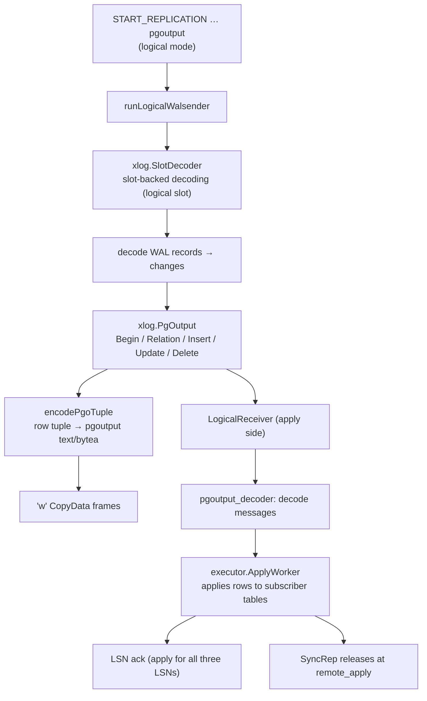
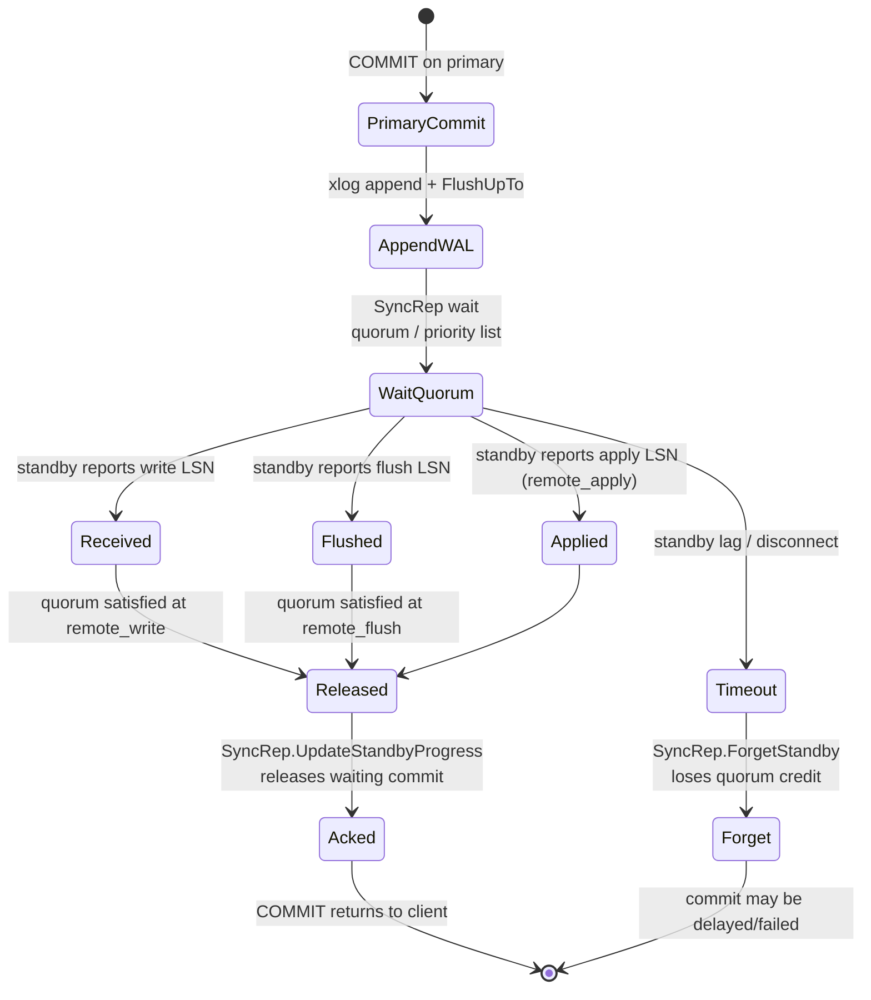

# Replication Flow

Physical streaming (walsender → walreceiver), logical decoding (pgoutput),
and synchronous replication.

## Physical Streaming

## Logical Decoding (pgoutput)

## Synchronous Replication

