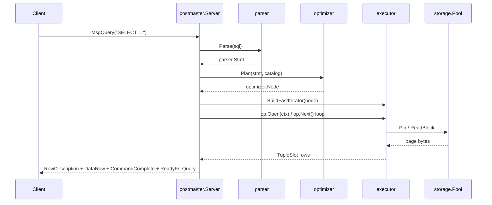
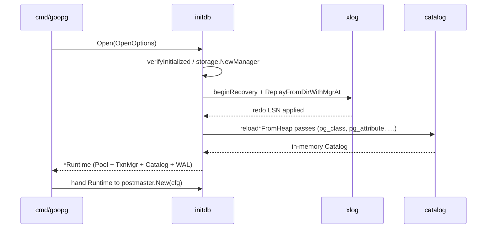
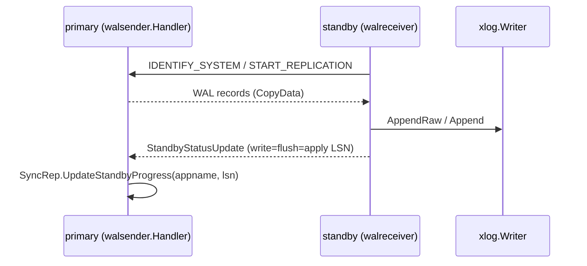

# Sequence Diagrams

Three core workflows, each traced through the real entry points.

## Workflow: Simple-query lifecycle

A client sends a `SELECT` via the simple protocol; the postmaster parses,
plans, executes, and streams rows back.

### Walkthrough

1. **Accept + handshake** — `postmaster.Run` → `acceptLoop` → `serveConn`
   (`internal/postmaster/server.go:855/886`), `handleStartup`, `checkAuth`.
2. **Dispatch** — `MsgQuery` → `handleQueryOrCopy` (`copy.go:51`) →
   `dispatchSimpleQueryViaExecutor` (`dispatch.go:139`).
3. **Parse** — `parser.Parse` (`dispatch.go:166`).
4. **Plan** — plan-cache miss → `optimizer.Plan` (`dispatch.go:1161`).
5. **Execute** — `executor.BuildFastIterator` (`dispatch.go:3398`) → `Open` /
   `Next` / `Close`.
6. **Respond** — `commandTagFor` → `WriteCommandComplete` → `ReadyForQuery`.

## Workflow: Startup recovery and catalog reload

`cmd/goopg start` opens an existing data directory, replays WAL, and rebuilds
the in-memory catalog from the on-disk catalog heaps.

### Walkthrough

1. **Open** — `initdb.Open` (`internal/initdb/open.go:278`) verifies the dir and
   builds the storage manager.
2. **Recovery** — `beginRecovery` stamps `DB_IN_CRASH_RECOVERY`; WAL replay via
   `xlog.ReplayFromDirWithMgrAt`.
3. **Catalog reload** — `runCatalogReloads` (`catalog_heap_reload.go:1204`)
   drives the per-catalog `reload*FromHeap` passes.
4. **Handoff** — the `Runtime` is returned and passed to `postmaster.New`.

## Workflow: Streaming replication

A standby continuously streams WAL from the primary and reports back its
write/flush/apply LSN.

### Walkthrough

1. **Send** — `replication.Handler.HandleCommand` → `replyStartReplication`
   (`internal/replication/walsender.go:524`) → physical iterator loop or
   `runLogicalWalsender`.
2. **Receive** — `replication.StartWalReceiver` (`walreceiver.go:542`) with
   exponential-backoff reconnect.
3. **Ack** — status frames feed `xlog.SyncRep.UpdateStandbyProgress` keyed by
   `application_name`; `ForgetStandby` on disconnect removes quorum credit.
