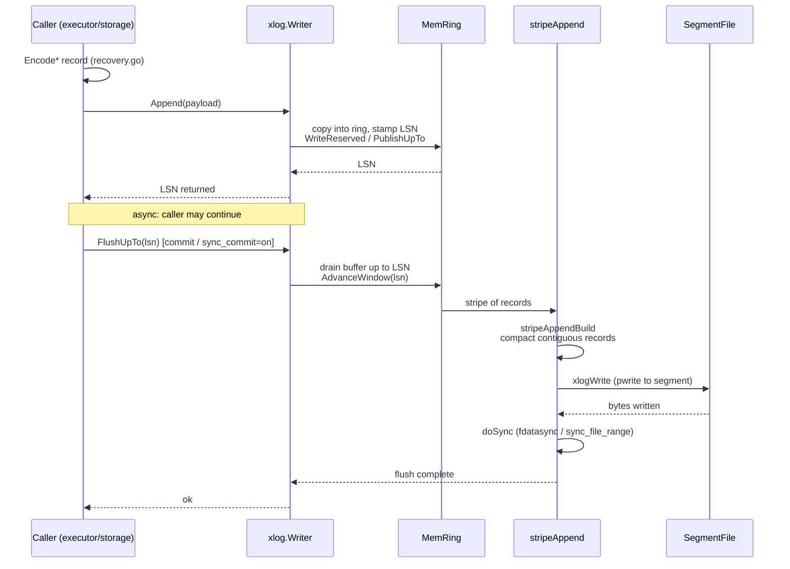

# WAL Append

WAL record encoding, ring buffer append, segment write, and checkpointing.

## WAL Record Encoding

```mermaid
classDiagram
    class Record {
        +RecordKind kind
        +flags
        +payloadLength
        +xl_prev uint64
        +body []byte
    }
    class XLogPageHeader {
        +xlp_magic
        +xlp_info
        +xlp_tli
        +xlp_pageaddr
    }
    class RecordKind {
        <<constants in recovery.go>>
        +HEAP_INSERT
        +HEAP_UPDATE
        +HEAP_DELETE
        +BTREE_INSERT
        +BTREE_SPLIT
        +BTREE_DEDUP
        +XACT_COMMIT
        +XACT_ABORT
        +CLOG_ZERO_PAGE
        +SMGR_CREATE
        +CHECKPOINT
    }
    class MemRing {
        +cap int64
        +Append(pos, data)
        +ReadAt(pos, out)
        +Range() (head, tail)
        +PublishUpTo(upTo)
    }

    Record --> RecordKind : kind byte
    Record --> XLogPageHeader : page framing (8 KiB pages)
    Record "many" --> MemRing : appended
    note right of Record: xl_prev backpointer chain; validated by reader / pg_waldump
```

## Ring Buffer Append



## Segment Write + Checkpoint

```mermaid
flowchart TD
    W["Writer"] --> Pre["preallocateSegment / recycleSegmentFile"]
    Pre --> Seg["append into pg_wal segment<br/>XLogSegSize"]
    Seg --> Pos["detectWritePos / scanLastSegmentEnd<br/>find real end (don't trust recycled)"]
    Pos --> Ret["RemoveOldSegments<br/>respects retention horizon + MinRestartLSN"]

    CP["Checkpointer goroutine"] --> Int["tick interval"]
    Int --> Flush["WriteDirtyPages / flush dirty buffers"]
    Flush --> Emit["append CHECKPOINT record<br/>embedding CheckPointFields"]
Emit --> Fields["CheckPointFields:<br/>redo LSN, nextXID, nextOid, timeline']
    Fields --> LSN["LastCheckpointLSN advances recovery horizon"]

    note right of Fields: records must be PG-canonical so a vanilla PG 18.3 standby<br/>can replay them (pg_assembled_emit.go)
```