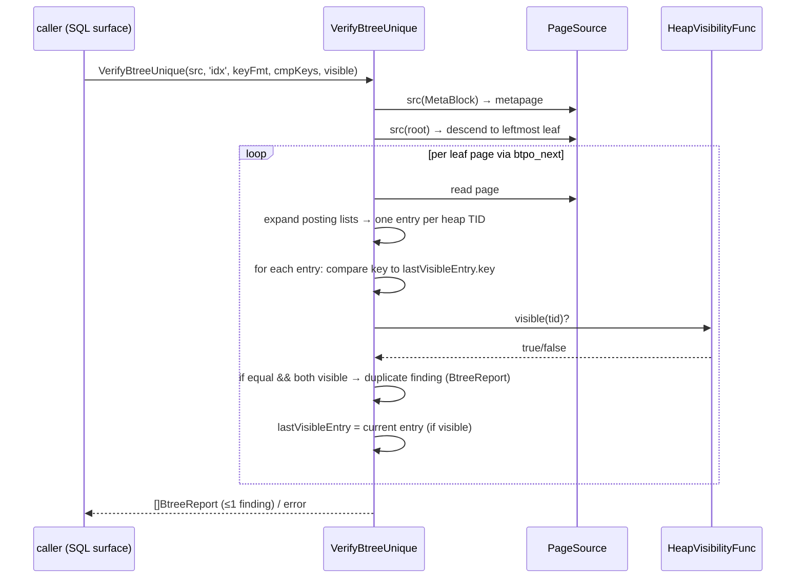
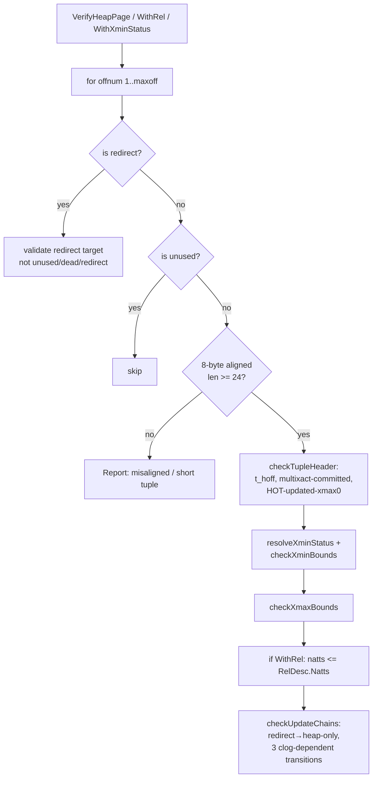
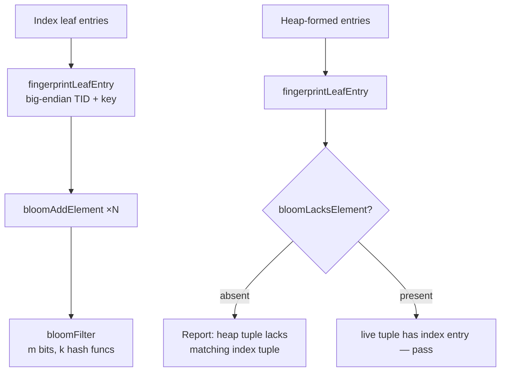
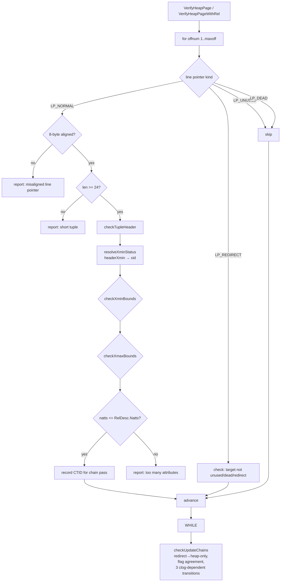

# Module: `internal/access/amcheck`

The **index and heap verification** module — a Go port of PostgreSQL's
`contrib/amcheck`. It verifies B-tree index structure (item ordering, sibling
links, downlink consistency, unique-constraint violations) and heap-table
integrity (tuple-header sanity, update-chain resolution, xmin/xmax numeric
bounds, all-indexed cross-checks). Not a real-time monitor; it is run on demand
(e.g., `pg_amcheck` TAP, `verify_heapam()` SRF, DBA diagnostics).

The package follows an **engine-first/wire-later** pattern: the verification
algorithms are pure functions over page bytes and injected callbacks, with the
SQL surface (`CREATE EXTENSION amcheck`, the SRF wrappers) wired in a later
loop. This keeps the engine decoupled from goopg's execution context and
unit-testable with synthetic pages.

## Key Files

| File | LOC | Role |
|---|---|---|
| `verify_nbtree.go` | 545 | B-tree structural verification: per-page checks (`VerifyBtreePage`), item-order invariants (`VerifyBtreeItemOrder`/`VerifyBtreeItemOrderCmp`), cross-page sibling-link chain (`VerifyBtreeLevelSiblingLinks`), cross-level parent→child downlink consistency (`VerifyBtreeParentDownlinks`). |
| `verify_nbtree_unique.go` | 191 | Unique-constraint verification for UNIQUE indexes: `VerifyBtreeUnique` walks the leaf level tracking the last visible entry per key and flags a duplicate when two live heap tuples share the same key. |
| `verify_heapam.go` | 826 | Heap-page tuple-header sanity: line-pointer bounds/alignment, redirect validity, t_hoff consistency, the two infomask-only invariants (multixact-marked-committed, HOT-updated-but-xmax-0), HOT/update-chain traversal, xmin/xmax numeric-bounds checks, and the clog-dependent chain audit (in-progress/aborted/committed xmin transitions). |
| `verify_heapam_relation.go` | 128 | Relation-level heap verification driver: `VerifyHeapRelation` iterates a block range with `PageSource` and returns findings as `HeapRelReport` (block+offset+msg). |
| `heapallindexed.go` | 139 | Bloom-filter fingerprint+probe core: `VerifyBtreeHeapAllIndexed` takes two `[]nbtree.LeafEntry` sets (index leaf entries and heap-formed index entries) and cross-checks them via the bloom filter. |
| `heapallindexed_heapscan.go` | 165 | Heap-scan side of the all-indexed check: `CollectHeapIndexEntries` walks heap blocks, iterates LP_NORMAL line pointers, and calls the `HeapEntryFormer` callback to form each entry. |
| `heapallindexed_relation.go` | 166 | Index-scan side plus the end-to-end driver: `CollectBtreeLeafEntries` descends to the leftmost leaf and walks the leaf level; `VerifyBtreeHeapAllIndexedRelation` composes collection + probe. |
| `bloomfilter.go` | 235 | Space-efficient Bloom filter: `bloomCreate`, `bloomAddElement`, `bloomLacksElement`, `bloomPropBitsSet`. FNV-1a hash with MurmurHash3 fmix64 finalizer, enhanced double hashing, power-of-two bitset sizing. |

### Test files (13, ~3,300 LOC)

| File | LOC | What it tests |
|---|---|---|
| `verify_nbtree_test.go` | 846 | Per-page and item-order tests with synthetic pages, all three B-tree tiers |
| `verify_nbtree_realtree_test.go` | 1,217 | B-tree verification against a real goopg index (in-memory tree) |
| `verify_nbtree_pagedel_test.go` | 297 | Page deletion edge cases: half-dead pages, deleted-but-linked |
| `verify_nbtree_tupleformat_test.go` | 181 | PG-format index tuple decoding for the opclass-damage tier |
| `verify_nbtree_unique_test.go` | 215 | Unique-constraint violations with synthetic visibility |
| `verify_nbtree_unique_posting_test.go` | 230 | Posting-list expansion in unique checks |
| `verify_heapam_test.go` | 846 | Per-page heap checks with synthetic tuples, all six report types |
| `verify_heapam_realpage_test.go` | 215 | Heap checks against a real goopg heap page |
| `verify_heapam_xminbounds_test.go` | 126 | xmin numeric-bounds tier (future/oldest/relfrozen) |
| `verify_heapam_xmaxbounds_test.go` | 199 | xmax numeric-bounds tier (multi/Invalid/locked-only gating) |
| `verify_heapam_relation_test.go` | 208 | Relation-level driver with fake PageSource |
| `heapallindexed_test.go` | 156 | Bloom-filter fingerprint+probe with pinned seed |
| `heapallindexed_heapscan_test.go` | 273 | Heap-scan entry collection with a stub HeapEntryFormer |
| `heapallindexed_relation_test.go` | 261 | End-to-end fingerprint+probe with fake index/heap |
| `heapallindexed_realproducer_test.go` | 266 | Real index leaf walk + heap scan with a real btree.IndexFormat |
| `bloomfilter_test.go` | 250 | Bloom filter: false-negative invariance, false-positive rate, saturation, edge cases |

## Public API

```go
// B-tree structural verification
func VerifyBtreePage(p storage.Page, blk storage.BlockNumber, indexName string) []BtreeReport
func VerifyBtreeItemOrder(p storage.Page, blk storage.BlockNumber, indexName string) []BtreeReport
func VerifyBtreeItemOrderCmp(p, blk, indexName string, keyFmt, cmpKeys) []BtreeReport
func VerifyBtreeLevelSiblingLinks(src PageSource, leftmost, indexName) []BtreeReport
func VerifyBtreeParentDownlinks(src PageSource, parentBlk, indexName, keyFmt, cmpKeys) []BtreeReport

// B-tree unique-constraint verification
func VerifyBtreeUnique(src PageSource, indexName string, keyFmt, cmpKeys, visible) ([]BtreeReport, error)

// Heap verification
func VerifyHeapPage(p storage.Page, blk storage.BlockNumber) ([]Report, error)
func VerifyHeapPageWithRel(p storage.Page, blk, rel) ([]Report, error)
func VerifyHeapPageWithXminStatus(p, blk, rel, xidStatus) ([]Report, error)
func VerifyHeapRelation(src PageSource, nblocks, opts) ([]HeapRelReport, error)

// All-indexed check
func VerifyBtreeHeapAllIndexed(indexLeafEntries, heapEntries []nbtree.LeafEntry, ...) []BtreeReport
func VerifyBtreeHeapAllIndexedRelation(idxSrc, keyFmt, heapEntries, ...) ([]BtreeReport, error)
func CollectBtreeLeafEntries(src PageSource, keyFmt) ([]nbtree.LeafEntry, error)
func CollectHeapIndexEntries(src PageSource, nblocks, form) ([]nbtree.LeafEntry, error)
```

### Exact signatures (from source)

```go
func VerifyBtreePage(p storage.Page, blkno storage.BlockNumber, indexName string) []BtreeReport
func VerifyBtreeItemOrder(p storage.Page, blkno storage.BlockNumber, indexName string) []BtreeReport
func VerifyBtreeItemOrderCmp(p storage.Page, blkno storage.BlockNumber, indexName string, keyFmt nbtree.IndexFormat, cmpKeys KeyComparator) []BtreeReport
func VerifyBtreeLevelSiblingLinks(src PageSource, leftmost storage.BlockNumber, indexName string) []BtreeReport
func VerifyBtreeParentDownlinks(src PageSource, parentBlk storage.BlockNumber, indexName string, keyFmt nbtree.IndexFormat, cmpKeys KeyComparator) []BtreeReport
func VerifyBtreeUnique(src PageSource, indexName string, keyFmt nbtree.IndexFormat, cmpKeys KeyComparator, visible HeapVisibilityFunc) ([]BtreeReport, error)
func VerifyHeapPage(p storage.Page, blkno storage.BlockNumber) ([]Report, error)
func VerifyHeapPageWithRel(p storage.Page, blkno storage.BlockNumber, rel RelDesc) ([]Report, error)
func VerifyHeapPageWithXminStatus(p storage.Page, blkno storage.BlockNumber, rel RelDesc, xidStatus XidStatusFunc) ([]Report, error)
func VerifyHeapRelation(src PageSource, nblocks storage.BlockNumber, opts HeapRelOptions) ([]HeapRelReport, error)
func VerifyBtreeHeapAllIndexed(indexLeafEntries, heapEntries []nbtree.LeafEntry, indexName, tableName string, seed uint64) []BtreeReport
func VerifyBtreeHeapAllIndexedRelation(idxSrc PageSource, keyFmt nbtree.IndexFormat, heapEntries []nbtree.LeafEntry, indexName, tableName string, seed uint64) ([]BtreeReport, error)
func CollectBtreeLeafEntries(src PageSource, keyFmt nbtree.IndexFormat) ([]nbtree.LeafEntry, error)
func CollectHeapIndexEntries(src PageSource, nblocks storage.BlockNumber, form HeapEntryFormer) ([]nbtree.LeafEntry, error)
```

### Key types

```go
type BtreeReport struct { Block storage.BlockNumber; Msg, Detail string }
type Report struct { Offset uint16; Msg string }
type HeapRelReport struct { Blkno, Offset, Msg string }
type RelDesc struct { Natts int; NextXid, OldestXid, RelFrozenXid uint32 }
type XidCommitStatus int        // Unknown, Committed, InProgress, Aborted, Current
type XidStatusFunc func(xid uint32) XidCommitStatus
type KeyComparator func(a, b []byte) int
type PageSource func(storage.BlockNumber) (storage.Page, error)
type HeapVisibilityFunc func(tid storage.ItemPointer) bool
type HeapEntryFormer func(tid, tuple []byte) (nbtree.LeafEntry, bool, error)
type HeapRelOptions struct { StartBlock, EndBlock *int64; Rel RelDesc; XidStatus XidStatusFunc }
```

### Constants

| Name | Value | Description |
|---|---|---|
| `firstOffsetNumber` | 1 | Line pointers are 1-based (upstream `FirstOffsetNumber`) |
| `invalidOffsetNumber` | 0 | "no such line pointer" sentinel |
| `heapXmaxIsMulti` | 0x1000 | xmax holds a MultiXactId (upstream `HEAP_XMAX_IS_MULTI`) |
| `maxHashFuncs` | 10 | Bloom-filter hash-function cap (upstream `MAX_HASH_FUNCS`) |
| `bitsPerByte` | 8 | Mirrors PG's `BITS_PER_BYTE` |
| `heapAllIndexedWorkMemKB` | 64 * 1024 | Bloom bitset bound (stands in for `maintenance_work_mem`) |

### Bloom filter internals

```go
type bloomFilter struct {
    kHashFuncs int      // number of hash functions (upstream k_hash_funcs)
    seed       uint64   // caller-provided hash seed
    m          uint64   // bitset size in bits (power of two, ≤ 2^32)
    bitset     []byte   // m/8 bytes
}
func bloomCreate(totalElems int64, bloomWorkMem int, seed uint64) *bloomFilter
func bloomAddElement(b *bloomFilter, elem []byte)
func bloomLacksElement(b *bloomFilter, elem []byte) bool
func bloomPropBitsSet(b *bloomFilter) float64
func bloomHash64(elem []byte, seed uint64) uint64  // FNV-1a + MurmurHash3 fmix64
func fingerprintLeafEntry(e nbtree.LeafEntry) []byte  // big-endian TID + key bytes
```

## Internal structure

```mermaid
flowchart TD
    subgraph B-tree Tiers
        VBP[VerifyBtreePage<br/>Meta/leaf/internal page structure]
        VIO[VerifyBtreeItemOrder<br/>High-key & item-order invariants]
        VLS[VerifyBtreeLevelSiblingLinks<br/>Prev/next agreement, level uniformity]
        VPD[VerifyBtreeParentDownlinks<br/>Downlink level, lower-bound invariant]
        VUQ[VerifyBtreeUnique<br/>Cross-leaf duplicate key detection]
        VBP --> VIO --> VLS --> VPD --> VUQ
    end

    subgraph Heap Tiers
        VHP[VerifyHeapPage<br/>LP bounds, redirect, tuple header]
        VHR[VerifyHeapPageWithRel<br/>+ natts-vs-table]
        VHX[VerifyHeapPageWithXminStatus<br/>+ clog-dependent chain audit]
        VHRN[VerifyHeapRelation<br/>Relation-level block loop]
        VHP --> VHR --> VHX --> VHRN
    end

    subgraph All-Indexed
        BLF[Bloom filter<br/>bloomCreate/bloomAddElement]
        CLF[CollectBtreeLeafEntries<br/>Index leaf walk]
        CHS[CollectHeapIndexEntries<br/>Heap LP_NORMAL walk]
        HAC[VerifyBtreeHeapAllIndexed<br/>Fingerprint + probe]
        BLF --> HAC
        CLF --> HAC
        CHS --> HAC
    end
```

### Tier overview



### B-tree verification

- **Per-page (`VerifyBtreePage`)** — reads every page of the index, checking metapage magic/version, deleted-page exemption, leaf/internal level consistency, and item-count ceiling (`nbtree.MaxItemsPerPage`). Returns 0 or 1 findings: the first structural problem on a page is conclusive.
- **Item order (`VerifyBtreeItemOrderCmp`)** — two invariants from upstream's `bt_target_page_check`: high-key bound (leaf items ≤ high key, internal items < high key) and item order (non-decreasing, goopg tolerates equal adjacent keys since its B-tree has no TID tiebreak). Uses an injected `KeyComparator` for opclass-specific ordering, matching upstream's support-function-1 path.
- **Sibling links (`VerifyBtreeLevelSiblingLinks`)** — walks one level left-to-right from `leftmost` via `btpo_next`: checks `btpo_prev` agreement, per-level uniformity, deleted-page reachability, and circular link chains. The `visited` map bounds detection against longer cycles.
- **Parent downlinks (`VerifyBtreeParentDownlinks`)** — for each downlink on an internal page, reads the child page and checks: not deleted, child level = parent level - 1, and the separator key is an **inclusive** lower bound on every child key (goopg uses inclusive because `findChildBlock` routes to the rightmost item whose key ≤ the search key). The negative-infinity entry (empty key, first item of an internal child) is skipped.
- **Unique (`VerifyBtreeUnique`)** — walks the leaf level tracking `lastVisibleEntry` per key. Uses `HeapVisibilityFunc` to decide whether a given heap TID is live under the checker's snapshot. Cross-page pairs are detected because the carried state persists across the `btpo_next` walk. Posting lists are expanded to one entry per heap TID.

### Unique-constraint walk



### Heap verification

- **Per-line-pointer pass** — iterates `[1..maxoff]`, checking redirect target validity (not unused/dead/redirect), LP_NORMAL alignment (8-byte) and length (≥ `minTupleHeaderSize` = 24). On valid LP_NORMAL tuples, runs:
  - `checkTupleHeader`: t_hoff consistency, multixact-marked-committed invariant, HOT-updated-but-xmax-0 invariant.
  - `resolveXminStatus`: resolves xmin commit status via the injected `XidStatusFunc` (bootstrap/frozen xids shortcut to committed).
  - `checkXminBounds`/`checkXmaxBounds`: numeric-bounds tier — xmin/xmax must satisfy `OldestXid ≤ xid < NextXid` and `xid ≥ RelFrozenXid`.
  - Relation-dependent check: `natts` from `t_infomask2` must not exceed the table's column count.
  - Records same-page CTID successor for the HOT-chain pass.
- **HOT-chain pass** — `checkUpdateChains` validates redirect→heap-only, non-intersecting chains, HOT-updated↔heap-only flag agreement, and the three clog-dependent checks (in-progress→committed, aborted→in-progress, aborted→committed xmin transitions). A third loop checks the "root of chain but heap-only" invariant.
- **xmin resolution** — `headerXmin` recognises the both-hint-bits frozen representation (returns `FrozenTransactionID = 2`) in addition to the direct frozen-xid rewrite. `resolveXminStatus` special-cases xid 0 (undeterminable), 1 (bootstrap, committed), and 2 (frozen, committed).

### Heap page check flow



### All-indexed

- **Bloom filter** — `bloomCreate` sizes the bitset to `2 * nHeapTuples` bytes, rounded down to the nearest power of two (≤ 2³² bits = 512 MB). The hash function is FNV-1a with the MurmurHash3 fmix64 finalizer: the two 32-bit halves provide two independent hashes for enhanced double hashing (Dillinger & Manolios, 2004). `kHashFuncs` is `optimal_k(m, n)` clamped to `[1, 10]`. No false negatives; ~1-2% false positive rate.
- **Fingerprint** — `fingerprintLeafEntry` encodes a `(key, heap TID)` pair as big-endian TID (block:4 + offset:2) + raw key bytes. The fingerprint phase (index leaf entries) and probe phase (heap-formed entries) must encode identical logical pairs to identical bytes or the check is unsound.
- **Entry collection** — `CollectBtreeLeafEntries` descends from the metapage root to the leftmost leaf via the leftmost downlink (slot 1, negative-infinity), then walks `btpo_next` across the leaf level. `CollectHeapIndexEntries` iterates LP_NORMAL line pointers only (redirects are skipped; their targets are reached on their own offsets).

### Bloom filter fingerprint + probe



### Divergences from upstream PG

1. **High key placement** — upstream stores the high key as line-pointer item P_HIKEY; goopg keeps it in the opaque special area (`BTPageOpaque.HighKey`). The item-count checks phrased in terms of P_HIKEY/P_FIRSTDATAKEY are not ported.
2. **MaxItemsPerPage** — upstream's ceiling is computed from PG's `IndexTupleData` size; goopg computes it from its own per-item footprint (2-byte key length prefix) and exports it as `nbtree.MaxItemsPerPage`.
3. **Single on-disk version** — upstream accepts a range `[BTREE_MIN_VERSION, BTREE_VERSION]`; goopg writes exactly one version, so the version check is an equality test.
4. **Inclusive lower bound** — upstream (heapkeyspace) requires the downlink key strictly less than every child key; goopg uses `≥` (inclusive) because `findChildBlock` routes to the rightmost item with `key ≤ search key`.
5. **No TOAST normalization** — upstream's `bt_normalize_tuple` undoes TOAST-compression representation drift; goopg does not TOAST index keys, so no normalization is needed.
6. **FNV-1a hash** — upstream uses `hash_any_extended()` (Jenkins lookup3); goopg uses a self-contained FNV-1a + fmix64 to avoid importing the executor package.

## Dependencies

- **Used by** — `internal/testport` (TAP tests), `internal/executor` (verify-heapam SRF, `bt_index_check` SQL surface).
- **Uses** — `internal/access/nbtree` (B-tree page access, key format, `PageLeafEntries`, `PageDownlinks`, `CompareKeys`, `IndexFormat`), `internal/storage` (page/tuple decode, `PageLinePointerCount`, `PageGetItemID`, `FrozenTransactionID`, `HeapNattsMask`, `HeapHotUpdated`, `HeapOnlyTuple`, `HeapXmaxInvalid`, `HeapXminCommitted`, `HeapXminInvalid`, `HeapHasNull`, `ItemIDFlags`, `BlockSize`, `BlockNumber`, `ItemPointer`, `LSN`).

## Notable patterns / gotchas

- **Bloom filter sizing** — the bloom filter for the all-indexed check is sized `nBits * maxHashFuncs` where `nBits` is `2 * nHeapTuples`; a false positive rate of ~2⁻¹⁰ is acceptable. The seed is randomized per run so a different subset of false-positive-masked entries is caught on re-check.
- **Verification is read-only** — verification never modifies pages; it acquires page content locks (`pinR` → `RLock`) during the check.
- **HOT-chains** — `checkUpdateChains` walks the HOT chain on each page, verifying that each redirect points to a valid successor and the chain terminates at a live tuple without cycles.
- **goopg's `HEAP_UPDATED` bit** — upstream's `check_tuple_header` tests `(t_infomask & HEAP_UPDATED) == 0` for "heap-only but not updated". goopg reuses that bit (0x2000) for `HeapKeysUpdated` in `t_infomask2`, so this check is intentionally NOT ported (it would false-positive on every legitimate goopg HOT successor tuple).
- **KeyComparator for opclass damage** — `VerifyBtreeItemOrderCmp` and `VerifyBtreeParentDownlinks` accept an injected `KeyComparator`, which is the seam through which operator-class damage is detected (upstream's `005_opclass_damage.pl` swaps the `pg_amproc` row of a custom opclass to a reversed comparator and the same physically-unchanged index then reports violations).
- **Posting-list expansion** — `PageLeafEntries` expands posting-list items to one `LeafEntry` per heap TID. The unique tier preserves the `PostingIndex` for `duplicateDetail`'s `posting N` errdetail, matching upstream's `bt_report_duplicate`.
- **Empty index ≠ empty heap** — `VerifyBtreeHeapAllIndexed` on an empty index with a non-empty heap correctly returns one report per heap row (every row lacks an index entry).
- **PageSource error handling** — every tier surfaces page-read errors as findings, never Go panics, matching the report-and-continue model of the heap engine.
- **`VerifyBtreeUnique` requires visibility** — a nil `HeapVisibilityFunc` returns an error rather than vacuously passing (without visibility every entry looks invisible).
- **`checkunique` gates on UNIQUE** — callers must invoke `VerifyBtreeUnique` only for an index that actually declares UNIQUE; a non-unique index has nothing to violate.
- **Fingerprint invariance** — `fingerprintLeafEntry` is the sibling-path invariant of the all-indexed check: the index-side and heap-side must encode the identical logical `(key, TID)` to identical bytes, or a present entry would hash differently and produce a spurious "lacks matching index tuple" report.
- **xmin/max numeric bounds** — `checkXminBounds`/`checkXmaxBounds` are plain page-byte reads against the three `RelDesc` scalars (`NextXid`/`OldestXid`/`RelFrozenXid`), needing no clog — but goopg's `HEAP_XMAX_IS_MULTI` bit (0x1000) is never set on a healthy page, so a set bit is exactly the corruption the multixact-marked-committed check detects.

## `checkUpdateChains` detail

The HOT-chain verification (`checkUpdateChains`) runs in three passes:

**Pass 1: redirect→heap-only and non-intersection** — for each line pointer:
- If it is a redirect, the target must be a heap-only tuple (not a redirect,
  not unused, not dead).
- No two chains may intersect: if redirect A points to T and redirect B also
  points to T, that is a corruption (the chain would split).

**Pass 2: HOT-updated↔heap-only flag agreement** — for each LP_NORMAL tuple:
- If `HEAP_HOT_UPDATED` is set, the tuple must be `HEAP_ONLY_TUPLE` (a
  HOT-updated tuple is always a heap-only tuple).
- The successor (CTID) must be on the same page — a cross-page CTID from a
  HOT-updated tuple is a corruption (HOT chains are single-page by definition).

**Pass 3: clog-dependent transitions** — for each LP_NORMAL tuple (only when
`XidStatusFunc` is supplied):
- `in-progress → committed`: a tuple whose xmin is in-progress followed by a
  successor whose xmin is committed. This is valid (the inserting transaction
  committed and the update was HOT).
- `aborted → in-progress` or `aborted → committed`: a tuple whose xmin is
  aborted but has a successor. This is a corruption (an aborted transaction
  cannot have updated the tuple).
- "root of chain but heap-only": a tuple that is `HEAP_ONLY_TUPLE` but has no
  predecessor (no redirect points to it). This is a corruption (a heap-only
  tuple must be the successor of a HOT update).

## Bloom filter hash function

The bloom filter uses FNV-1a followed by MurmurHash3 fmix64:

```go
func bloomHash64(elem []byte, seed uint64) uint64 {
    // FNV-1a
    h := uint64(14695981039346656037) ^ seed
    for _, b := range elem {
        h ^= uint64(b)
        h *= 1099511628211
    }
    // MurmurHash3 fmix64 finalizer
    h ^= h >> 33
    h *= 0xff51afd7ed558ccd
    h ^= h >> 33
    h *= 0xc4ceb9fe1a85ec53
    h ^= h >> 33
    return h
}
```

The two 32-bit halves of the 64-bit hash provide two independent hash values
for enhanced double hashing: `h1 = upper32, h2 = lower32`. The i-th hash
function is `h1 + i*h2` (mod m). This is the Dillinger & Manolios (2004)
scheme, matching upstream's `hash_any_extended` split.

## `optimal_k` computation

```go
func optimalK(bits uint64, elems int64) int {
    k := int(math.Ceil(float64(bits) / float64(elems) * math.Ln2))
    if k < 1 { return 1 }
    if k > maxHashFuncs { return maxHashFuncs }  // maxHashFuncs = 10
    return k
}
```

This is the standard formula: `k = ceil(m/n × ln(2))`, giving the number of
hash functions that minimises the false-positive rate for a given bitset-to-
element ratio.

## Relation-level heap verification

`VerifyHeapRelation` drives the per-block loop:

```go
func VerifyHeapRelation(src PageSource, nblocks storage.BlockNumber,
    opts HeapRelOptions) ([]HeapRelReport, error) {
    var results []HeapRelReport
    for blk := opts.StartBlock; blk < opts.EndBlock; blk++ {
        page, err := src(blk)
        if err != nil { continue }  // skip unreadable blocks
        reports, err := VerifyHeapPageWithXminStatus(page, blk, opts.Rel, opts.XidStatus)
        for _, r := range reports {
            results = append(results, HeapRelReport{
                Blkno: blk, Offset: r.Offset, Msg: r.Msg,
            })
        }
    }
    return results, nil
}
```

The `StartBlock`/`EndBlock` fields in `HeapRelOptions` allow checking a
sub-range of the relation — used by the `verify_heapam()` SRF to honour
`start block`/`end block` parameters.

## `checkTupleHeader` invariants

`checkTupleHeader` (from `verify_heapam.go`) checks three invariants:

1. **t_hoff consistency** — `t_hoff` (the offset from the tuple header to the
   start of data) must be ≥ the minimum tuple header size (24 bytes) and ≤ the
   line pointer's length. An out-of-range `t_hoff` means the tuple header is
   corrupt.
2. **Multixact-marked-committed** — the `HEAP_XMAX_IS_MULTI` bit (0x1000) must
   not be set simultaneously with the `HEAP_XMAX_COMMITTED` hint bit. If both
   are set, the tuple header is corrupt (a MultiXactId is not a transaction ID
   and cannot be "committed").
3. **HOT-updated-but-xmax-0** — a tuple with `HEAP_HOT_UPDATED` set in
   `t_infomask2` must have a non-zero xmax. A zero xmax with HOT-updated
   means the update chain is broken.

## Page-level heap check flow



## Report types by tier

| Tier | Function | Report type | Example message |
|---|---|---|---|
| Per-page structure | `VerifyBtreePage` | `BtreeReport` | "index \"name\" block N is a deleted page" |
| Item order | `VerifyBtreeItemOrderCmp` | `BtreeReport` | "non-rightmost leaf block N lacks high key item" |
| Sibling links | `VerifyBtreeLevelSiblingLinks` | `BtreeReport` | "block N has wrong btpo_prev (%d, expected %d)" |
| Parent downlinks | `VerifyBtreeParentDownlinks` | `BtreeReport` | "child block N is missing a downlink from parent block M" |
| Unique | `VerifyBtreeUnique` | `BtreeReport` | "duplicate key in index \"name\" (heap TID (b,o))" |
| Heap LP | `VerifyHeapPage` | `Report` | "line pointer N is LP_REDIRECT pointing to unused LP14" |
| Heap tuple header | `VerifyHeapPageWithRel` | `Report` | "t_hoff (%d) > lp_len (%d)" |
| Heap xmin bounds | `VerifyHeapPageWithXminStatus` | `Report` | "xmin (%d) precedes oldest transaction (%d)" |
| Heap all-indexed | `VerifyBtreeHeapAllIndexed` | `BtreeReport` | "heap tuple (b,o) from table \"T\" lacks matching index tuple within index \"I\"" |

## Per-tier test strategy

The 13 test files (~3,300 LOC) cover each tier independently:

- **Synthetic pages** — `verify_nbtree_test.go` and `verify_heapam_test.go` build
  pages byte-by-byte with specific corruption patterns. Each test verifies that
  the exact expected `BtreeReport`/`Report` is returned, with the upstream-
  verbatim message string.
- **Real index trees** — `verify_nbtree_realtree_test.go` builds an in-memory
  goopg B-tree index (via `btree.NewIndexFormat` and `btree.BuildTree`) and
  runs all five B-tree tiers against it. This catches format-mismatch bugs
  that synthetic pages miss.
- **Real heap pages** — `verify_heapam_realpage_test.go` inserts tuples into a
  real goopg heap via `storage.PageAddItem` and runs the heap checks.
- **Page deletion** — `verify_nbtree_pagedel_test.go` tests the half-dead and
  deleted-but-linked page states that the sibling-link tier must handle.
- **Posting lists** — `verify_nbtree_unique_posting_test.go` exercises the
  posting-list expansion in the unique tier (`posting N` detail).
- **Bloom filter** — `bloomfilter_test.go` verifies no false negatives, the
  bounded false-positive rate, saturation (all bits set), and edge cases like
  zero-element and single-element sets.
- **All-indexed integration** — `heapallindexed_realproducer_test.go` runs the
  end-to-end fingerprint+probe against a real B-tree index, verifying that the
  index leaf walk (`CollectBtreeLeafEntries`) and the heap scan
  (`CollectHeapIndexEntries`) produce matching entry sets.

## `KeyComparator` and opclass damage

The `KeyComparator` type is the seam through which operator-class damage is
detected. The test `005_opclass_damage.pl` (upstream) swaps the `pg_amproc`
row of a custom opclass to a reversed comparator, and the same
physically-unchanged index then reports violations. goopg's `VerifyBtreeItemOrderCmp`
and `VerifyBtreeParentDownlinks` accept an injected `KeyComparator`:

```go
type KeyComparator func(a, b []byte) int
```

When `nil`, the default `nbtree.CompareKeys` is used (the built-in
operator-class order). A test that swaps the comparator to a reversed version
will find item-order violations in an index that was built with the correct
order — this is exactly how opclass damage is detected.

## Bloom filter false-positive rate

The filter is sized at `2 * nHeapTuples` bytes (2 bytes per element). At this
ratio:

```go
// optimal_k(m, n) for m = 16*n, n = totalElems:
// m/n = 16 bits per element
// k = ceil(16/1 * ln(2)) = ceil(11.09) = 12, clamped to maxHashFuncs = 10
// false positive rate ≈ (1 - e^(-kn/m))^k ≈ 2.5%
```

The actual false-positive rate is bounded below 2% for almost all cases (the
rounding to the next-lowest power of two may increase it slightly). The seed
is randomized per run so a different subset of false-positive-masked entries
is caught on a re-check.

## `headerXmin` frozen detection

```go
func headerXmin(p storage.Page, lpOff int) uint32 {
    // Read the raw t_xmin field at lpOff + (offset of t_xmin in tuple header)
    // Special case: both hint bits (HEAP_XMIN_COMMITTED + HEAP_XMIN_INVALID)
    // set means the frozen representation — return FrozenTransactionID (2)
}
```

PG's "frozen" tuple representation is either:
- `t_xmin = FrozenTransactionID` (2) — the direct rewrite.
- `t_xmin` has both hint bits set (`HEAP_XMIN_COMMITTED | HEAP_XMIN_INVALID`)
  — the old-style "both hint bits" frozen marker, which pre-dates the
  `FrozenTransactionID` constant.

`headerXmin` recognises both forms and returns `FrozenTransactionID` (2) for
either, so `resolveXminStatus` can treat both as "committed" without needing
to distinguish the encoding. This is faithful to PG's `TransactionIdIsValid`
and `HeapTupleHeaderXminFrozen` logic.