# Module: `internal/access/amcheck`

The **index and heap verification** module — a Go port of PostgreSQL's
`contrib/amcheck`. It verifies B-tree index structure (item ordering, sibling
links, downlink consistency, unique-constraint violations) and heap-table
integrity (tuple-header sanity, update-chain resolution, xmin/xmax numeric
bounds, all-indexed cross-checks). Not a real-time monitor; it is run on demand
(e.g., `pg_amcheck` TAP, `verify_heapam()` SRF, DBA diagnostics).

The package follows an **engine-first/wire-later** pattern: the verification
algorithms are pure functions over page bytes and injected callbacks, with the
SQL surface (`CREATE EXTENSION amcheck`, the SRF wrappers) wired in a later
loop. This keeps the engine decoupled from goopg's execution context and
unit-testable with synthetic pages.

## Key Files

| File | LOC | Role |
|---|---|---|
| `verify_nbtree.go` | 545 | B-tree structural verification: per-page checks (`VerifyBtreePage`), item-order invariants (`VerifyBtreeItemOrder`/`VerifyBtreeItemOrderCmp`), cross-page sibling-link chain (`VerifyBtreeLevelSiblingLinks`), cross-level parent→child downlink consistency (`VerifyBtreeParentDownlinks`). |
| `verify_nbtree_unique.go` | 191 | Unique-constraint verification for UNIQUE indexes: `VerifyBtreeUnique` walks the leaf level tracking the last visible entry per key and flags a duplicate when two live heap tuples share the same key. |
| `verify_heapam.go` | 826 | Heap-page tuple-header sanity: line-pointer bounds/alignment, redirect validity, t_hoff consistency, the two infomask-only invariants (multixact-marked-committed, HOT-updated-but-xmax-0), HOT/update-chain traversal, xmin/xmax numeric-bounds checks, and the clog-dependent chain audit (in-progress/aborted/committed xmin transitions). |
| `verify_heapam_relation.go` | 128 | Relation-level heap verification driver: `VerifyHeapRelation` iterates a block range with `PageSource` and returns findings as `HeapRelReport` (block+offset+msg). |
| `heapallindexed.go` | 139 | Bloom-filter fingerprint+probe core: `VerifyBtreeHeapAllIndexed` takes two `[]nbtree.LeafEntry` sets (index leaf entries and heap-formed index entries) and cross-checks them via the bloom filter. |
| `heapallindexed_heapscan.go` | 165 | Heap-scan side of the all-indexed check: `CollectHeapIndexEntries` walks heap blocks, iterates LP_NORMAL line pointers, and calls the `HeapEntryFormer` callback to form each entry. |
| `heapallindexed_relation.go` | 166 | Index-scan side plus the end-to-end driver: `CollectBtreeLeafEntries` descends to the leftmost leaf and walks the leaf level; `VerifyBtreeHeapAllIndexedRelation` composes collection + probe. |
| `bloomfilter.go` | 235 | Space-efficient Bloom filter: `bloomCreate`, `bloomAddElement`, `bloomLacksElement`, `bloomPropBitsSet`. FNV-1a hash with MurmurHash3 fmix64 finalizer, enhanced double hashing, power-of-two bitset sizing. |

### Test files (13, ~3,300 LOC)

| File | LOC | What it tests |
|---|---|---|
| `verify_nbtree_test.go` | 846 | Per-page and item-order tests with synthetic pages, all three B-tree tiers |
| `verify_nbtree_realtree_test.go` | 1,217 | B-tree verification against a real goopg index (in-memory tree) |
| `verify_nbtree_pagedel_test.go` | 297 | Page deletion edge cases: half-dead pages, deleted-but-linked |
| `verify_nbtree_tupleformat_test.go` | 181 | PG-format index tuple decoding for the opclass-damage tier |
| `verify_nbtree_unique_test.go` | 215 | Unique-constraint violations with synthetic visibility |
| `verify_nbtree_unique_posting_test.go` | 230 | Posting-list expansion in unique checks |
| `verify_heapam_test.go` | 846 | Per-page heap checks with synthetic tuples, all six report types |
| `verify_heapam_realpage_test.go` | 215 | Heap checks against a real goopg heap page |
| `verify_heapam_xminbounds_test.go` | 126 | xmin numeric-bounds tier (future/oldest/relfrozen) |
| `verify_heapam_xmaxbounds_test.go` | 199 | xmax numeric-bounds tier (multi/Invalid/locked-only gating) |
| `verify_heapam_relation_test.go` | 208 | Relation-level driver with fake PageSource |
| `heapallindexed_test.go` | 156 | Bloom-filter fingerprint+probe with pinned seed |
| `heapallindexed_heapscan_test.go` | 273 | Heap-scan entry collection with a stub HeapEntryFormer |
| `heapallindexed_relation_test.go` | 261 | End-to-end fingerprint+probe with fake index/heap |
| `heapallindexed_realproducer_test.go` | 266 | Real index leaf walk + heap scan with a real btree.IndexFormat |
| `bloomfilter_test.go` | 250 | Bloom filter: false-negative invariance, false-positive rate, saturation, edge cases |

## Public API

```go
// B-tree structural verification
func VerifyBtreePage(p storage.Page, blk storage.BlockNumber, indexName string) []BtreeReport
func VerifyBtreeItemOrder(p storage.Page, blk storage.BlockNumber, indexName string) []BtreeReport
func VerifyBtreeItemOrderCmp(p, blk, indexName string, keyFmt, cmpKeys) []BtreeReport
func VerifyBtreeLevelSiblingLinks(src PageSource, leftmost, indexName) []BtreeReport
func VerifyBtreeParentDownlinks(src PageSource, parentBlk, indexName, keyFmt, cmpKeys) []BtreeReport

// B-tree unique-constraint verification
func VerifyBtreeUnique(src PageSource, indexName string, keyFmt, cmpKeys, visible) ([]BtreeReport, error)

// Heap verification
func VerifyHeapPage(p storage.Page, blk storage.BlockNumber) ([]Report, error)
func VerifyHeapPageWithRel(p storage.Page, blk, rel) ([]Report, error)
func VerifyHeapPageWithXminStatus(p, blk, rel, xidStatus) ([]Report, error)
func VerifyHeapRelation(src PageSource, nblocks, opts) ([]HeapRelReport, error)

// All-indexed check
func VerifyBtreeHeapAllIndexed(indexLeafEntries, heapEntries []nbtree.LeafEntry, ...) []BtreeReport
func VerifyBtreeHeapAllIndexedRelation(idxSrc, keyFmt, heapEntries, ...) ([]BtreeReport, error)
func CollectBtreeLeafEntries(src PageSource, keyFmt) ([]nbtree.LeafEntry, error)
func CollectHeapIndexEntries(src PageSource, nblocks, form) ([]nbtree.LeafEntry, error)
```

### Key types

```go
type BtreeReport struct { Block storage.BlockNumber; Msg, Detail string }
type Report struct { Offset uint16; Msg string }
type HeapRelReport struct { Blkno, Offset, Msg string }
type RelDesc struct { Natts int; NextXid, OldestXid, RelFrozenXid uint32 }
type XidCommitStatus int        // Unknown, Committed, InProgress, Aborted, Current
type XidStatusFunc func(xid uint32) XidCommitStatus
type KeyComparator func(a, b []byte) int
type PageSource func(storage.BlockNumber) (storage.Page, error)
type HeapVisibilityFunc func(tid storage.ItemPointer) bool
type HeapEntryFormer func(tid, tuple []byte) (nbtree.LeafEntry, bool, error)
type HeapRelOptions struct { StartBlock, EndBlock *int64; Rel RelDesc; XidStatus XidStatusFunc }
```

## Internal structure

```mermaid
flowchart TD
    subgraph B-tree Tiers
        VBP[VerifyBtreePage<br/>Meta/leaf/internal page structure]
        VIO[VerifyBtreeItemOrder<br/>High-key & item-order invariants]
        VLS[VerifyBtreeLevelSiblingLinks<br/>Prev/next agreement, level uniformity]
        VPD[VerifyBtreeParentDownlinks<br/>Downlink level, lower-bound invariant]
        VUQ[VerifyBtreeUnique<br/>Cross-leaf duplicate key detection]
        VBP --> VIO --> VLS --> VPD --> VUQ
    end

    subgraph Heap Tiers
        VHP[VerifyHeapPage<br/>LP bounds, redirect, tuple header]
        VHR[VerifyHeapPageWithRel<br/>+ natts-vs-table]
        VHX[VerifyHeapPageWithXminStatus<br/>+ clog-dependent chain audit]
        VHRN[VerifyHeapRelation<br/>Relation-level block loop]
        VHP --> VHR --> VHX --> VHRN
    end

    subgraph All-Indexed
        BLF[Bloom filter<br/>bloomCreate/bloomAddElement]
        CLF[CollectBtreeLeafEntries<br/>Index leaf walk]
        CHS[CollectHeapIndexEntries<br/>Heap LP_NORMAL walk]
        HAC[VerifyBtreeHeapAllIndexed<br/>Fingerprint + probe]
        BLF --> HAC
        CLF --> HAC
        CHS --> HAC
    end
```



### B-tree verification

- **Per-page (`VerifyBtreePage`)** — reads every page of the index, checking
  metapage magic/version, deleted-page exemption, leaf/internal level
  consistency, and item-count ceiling (`nbtree.MaxItemsPerPage`). Returns 0 or 1
  findings: the first structural problem on a page is conclusive.
- **Item order (`VerifyBtreeItemOrderCmp`)** — two invariants from upstream's
  `bt_target_page_check`: high-key bound (leaf items ≤ high key, internal items
  < high key) and item order (non-decreasing, goopg tolerates equal adjacent
  keys since its B-tree has no TID tiebreak). Uses an injected `KeyComparator`
  for opclass-specific ordering, matching upstream's support-function-1 path.
- **Sibling links (`VerifyBtreeLevelSiblingLinks`)** — walks one level
  left-to-right from `leftmost` via `btpo_next`: checks `btpo_prev` agreement,
  per-level uniformity, deleted-page reachability, and circular link chains. The
  `visited` map bounds detection against longer cycles.
- **Parent downlinks (`VerifyBtreeParentDownlinks`)** — for each downlink on an
  internal page, reads the child page and checks: not deleted, child level = parent
  level - 1, and the separator key is an **inclusive** lower bound on every child
  key (goopg uses inclusive because `findChildBlock` routes to the rightmost item
  whose key ≤ the search key). The negative-infinity entry (empty key, first item
  of an internal child) is skipped.
- **Unique (`VerifyBtreeUnique`)** — walks the leaf level tracking
  `lastVisibleEntry` per key. Uses `HeapVisibilityFunc` to decide whether a given
  heap TID is live under the checker's snapshot. Cross-page pairs are detected
  because the carried state persists across the `btpo_next` walk. Posting lists
  are expanded to one entry per heap TID.

### Heap verification

- **Per-line-pointer pass** — iterates `[1..maxoff]`, checking redirect target
  validity (not unused/dead/redirect), LP_NORMAL alignment (8-byte) and length
  (≥ `minTupleHeaderSize` = 24). On valid LP_NORMAL tuples, runs:
  - `checkTupleHeader`: t_hoff consistency, multixact-marked-committed invariant,
    HOT-updated-but-xmax-0 invariant.
  - `resolveXminStatus`: resolves xmin commit status via the injected
    `XidStatusFunc` (bootstrap/frozen xids shortcut to committed).
  - `checkXminBounds`/`checkXmaxBounds`: numeric-bounds tier — xmin/xmax must
    satisfy `OldestXid ≤ xid < NextXid` and `xid ≥ RelFrozenXid`.
  - Relation-dependent check: `natts` from `t_infomask2` must not exceed the
    table's column count.
  - Records same-page CTID successor for the HOT-chain pass.
- **HOT-chain pass** — `checkUpdateChains` validates redirect→heap-only,
  non-intersecting chains, HOT-updated↔heap-only flag agreement, and the three
  clog-dependent checks (in-progress→committed, aborted→in-progress,
  aborted→committed xmin transitions). A third loop checks the "root of chain but
  heap-only" invariant.
- **xmin resolution** — `headerXmin` recognises the both-hint-bits frozen
  representation (returns `FrozenTransactionID = 2`) in addition to the direct
  frozen-xid rewrite. `resolveXminStatus` special-cases xid 0 (undeterminable),
  1 (bootstrap, committed), and 2 (frozen, committed).

### All-indexed

- **Bloom filter** — `bloomCreate` sizes the bitset to `2 * nHeapTuples` bytes,
  rounded down to the nearest power of two (≤ 2³² bits = 512 MB). The hash
  function is FNV-1a with the MurmurHash3 fmix64 finalizer: the two 32-bit halves
  provide two independent hashes for enhanced double hashing (Dillinger &
  Manolios, 2004). `kHashFuncs` is `optimal_k(m, n)` clamped to `[1, 10]`. No
  false negatives; ~1-2% false positive rate.
- **Fingerprint** — `fingerprintLeafEntry` encodes a `(key, heap TID)` pair as
  big-endian TID (block:4 + offset:2) + raw key bytes. The fingerprint phase
  (index leaf entries) and probe phase (heap-formed entries) must encode identical
  logical pairs to identical bytes or the check is unsound.
- **Entry collection** — `CollectBtreeLeafEntries` descends from the metapage root
  to the leftmost leaf via the leftmost downlink (slot 1, negative-infinity), then
  walks `btpo_next` across the leaf level. `CollectHeapIndexEntries` iterates
  LP_NORMAL line pointers only (redirects are skipped; their targets are reached
  on their own offsets).

### Divergences from upstream PG

1. **High key placement** — upstream stores the high key as line-pointer item
   P_HIKEY; goopg keeps it in the opaque special area (`BTPageOpaque.HighKey`).
   The item-count checks phrased in terms of P_HIKEY/P_FIRSTDATAKEY are not
   ported.
2. **MaxItemsPerPage** — upstream's ceiling is computed from PG's `IndexTupleData`
   size; goopg computes it from its own per-item footprint (2-byte key length
   prefix) and exports it as `nbtree.MaxItemsPerPage`.
3. **Single on-disk version** — upstream accepts a range `[BTREE_MIN_VERSION,
   BTREE_VERSION]`; goopg writes exactly one version, so the version check is an
   equality test.
4. **Inclusive lower bound** — upstream (heapkeyspace) requires the downlink key
   strictly less than every child key; goopg uses `≥` (inclusive) because
   `findChildBlock` routes to the rightmost item with `key ≤ search key`.
5. **No TOAST normalization** — upstream's `bt_normalize_tuple` undoes
   TOAST-compression representation drift; goopg does not TOAST index keys, so no
   normalization is needed.
6. **FNV-1a hash** — upstream uses `hash_any_extended()` (Jenkins lookup3); goopg
   uses a self-contained FNV-1a + fmix64 to avoid importing the executor package.

## Dependencies

- **Used by** — `internal/testport` (TAP tests), `internal/executor`
  (verify-heapam SRF, `bt_index_check` SQL surface).
- **Uses** — `internal/access/nbtree` (B-tree page access, key format,
  `PageLeafEntries`, `PageDownlinks`, `CompareKeys`, `IndexFormat`),
  `internal/storage` (page/tuple decode, `PageLinePointerCount`, `PageGetItemID`,
  `FrozenTransactionID`, `HeapNattsMask`, `HeapHotUpdated`, `HeapOnlyTuple`,
  `HeapXmaxInvalid`, `HeapXminCommitted`, `HeapXminInvalid`, `HeapHasNull`,
  `ItemIDFlags`, `BlockSize`, `BlockNumber`, `ItemPointer`, `LSN`).

## Notable patterns / gotchas

- **Bloom filter sizing** — the bloom filter for the all-indexed check is sized
  `nBits * maxHashFuncs` where `nBits` is `2 * nHeapTuples`; a false positive
  rate of ~2⁻¹⁰ is acceptable. The seed is randomized per run so a different
  subset of false-positive-masked entries is caught on re-check.
- **Verification is read-only** — verification never modifies pages; it acquires
  page content locks (`pinR` → `RLock`) during the check.
- **HOT-chains** — `checkUpdateChains` walks the HOT chain on each page,
  verifying that each redirect points to a valid successor and the chain
  terminates at a live tuple without cycles.
- **goopg's `HEAP_UPDATED` bit** — upstream's `check_tuple_header` tests
  `(t_infomask & HEAP_UPDATED) == 0` for "heap-only but not updated". goopg
  reuses that bit (0x2000) for `HeapKeysUpdated` in `t_infomask2`, so this check
  is intentionally NOT ported (it would false-positive on every legitimate goopg
  HOT successor tuple).
- **KeyComparator for opclass damage** — `VerifyBtreeItemOrderCmp` and
  `VerifyBtreeParentDownlinks` accept an injected `KeyComparator`, which is the
  seam through which operator-class damage is detected (upstream's
  `005_opclass_damage.pl` swaps the `pg_amproc` row of a custom opclass to a
  reversed comparator and the same physically-unchanged index then reports
  violations).
- **Posting-list expansion** — `PageLeafEntries` expands posting-list items to one
  `LeafEntry` per heap TID. The unique tier preserves the `PostingIndex` for
  `duplicateDetail`'s `posting N` errdetail, matching upstream's
  `bt_report_duplicate`.
- **Empty index ≠ empty heap** — `VerifyBtreeHeapAllIndexed` on an empty index
  with a non-empty heap correctly returns one report per heap row (every row
  lacks an index entry).
- **PageSource error handling** — every tier surfaces page-read errors as
  findings, never Go panics, matching the report-and-continue model of the heap
  engine.