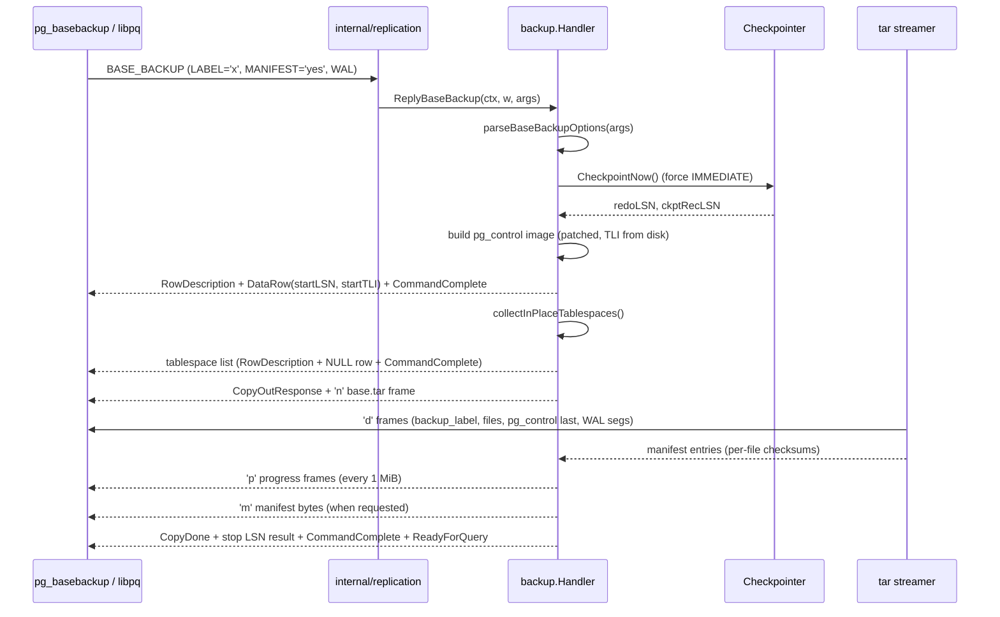
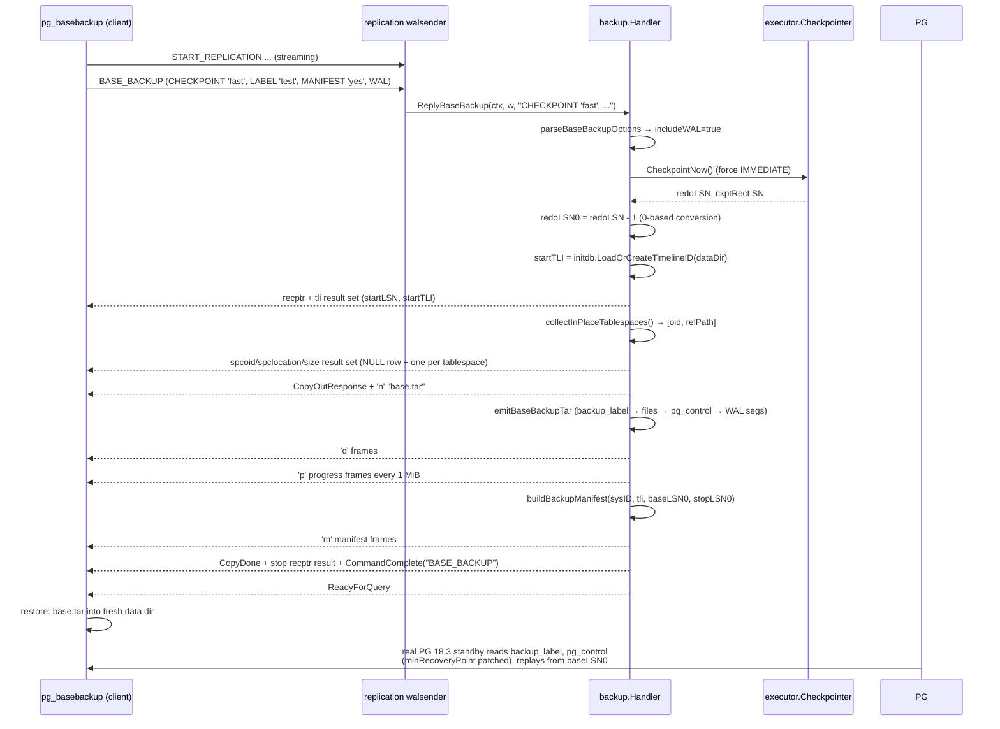
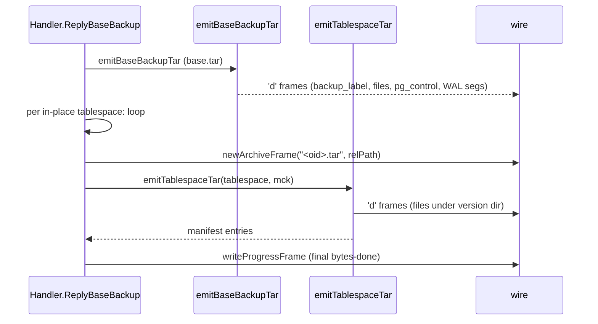

# Module: `internal/backup`

Physical backup — the `pg_basebackup`-compatible streaming backup handler.
Serves the `BASE_BACKUP` protocol command (the same one `pg_basebackup` issues)
by streaming the data directory as a **PG-compatible tar archive** (with
manifest), WAL segments, and tablespace handling — a real PG 18.3 standby can
restore the resulting tar.

The package is a **LEAF of `internal/replication`**: it mirrors
`postgres/src/backend/backup/` (reached from `walsender.c` without calling back
into `replication/`), so the dependency direction is
`postmaster → replication → backup`. Importing `internal/replication` or
`internal/postmaster` from here is an immediate import cycle; the two helpers
borrowed from `walsender.go` (`writeStreamingError`, `formatLSN`) are therefore
carried locally.

## Key Files

| File | LOC | Role |
|---|---|---|
| `basebackup.go` | 1,438 | The entire backup engine: wire handler, tar emission, manifest building, option parsing, tablespace handling, WAL segment appending. |
| `basebackup_wire_test.go` | 570 | Drives a server through `BASE_BACKUP` via the in-process protocol harness; asserts the tar parses cleanly with `archive/tar` and contains `backup_label` + `global/pg_control` + at least one `base/<oid>/` file. |
| `basebackup_control_test.go` | 196 | Tests the pg_control image patching (`BackupControlImage` path, minRecoveryPoint/TLI). |
| `basebackup_options_test.go` | 64 | Tests the `BASE_BACKUP (...)` option grammar, both PG17+ list and legacy keyword forms. |

## Constants

| Name | Value | Description |
|---|---|---|
| `oidText` | 25 | pg_type.dat text OID, for the recptr / spclocation result-set columns |
| `oidInt8` | 20 | int8 OID, for the start/stop TLI result-set columns |
| `baseBackupArchive` | `"base.tar"` | Single archive name in the `CopyData 'n'` frame |
| `baseBackupChunkBytes` | 64 KiB | Max size of each `CopyData 'd'` payload (matches upstream `bbsink_copystream`'s `bbs_buffer_length`) |
| `baseBackupProgressInterval` | 1 MiB | Emit a `'p'` progress frame every 1 MiB (upstream `PROGRESS_REPORT_BYTE_INTERVAL`) |

## Public API

```go
type Handler struct{ cfg Config; werr WriteQueryErrorFunc }
func NewHandler(cfg Config, werr WriteQueryErrorFunc) *Handler
func (h *Handler) ReplyBaseBackup(ctx context.Context, w *libpq.FrameWriter, args string) error

type Config struct{ DataDir string; WAL *xlog.Writer; WALSegmentSize int64; Checkpointer executor.Checkpointer }
type WriteQueryErrorFunc func(w *libpq.FrameWriter, code errcodes.Code, msg string, extra ...libpq.ErrorField) error
```

### Internal helpers

```go
func (s *Handler) writeQueryError(w *libpq.FrameWriter, code errcodes.Code, msg string, extra ...libpq.ErrorField) error
func (s *Handler) writeStreamingError(w *libpq.FrameWriter, code errcodes.Code, msg string) error
func formatLSN(lsn uint64) string                        // X/X hex form (third copy in the tree)
func isExcludedFile(base string) bool                    // exclusion table lookup (prefix-aware)
func writeRecPtrResult(w *libpq.FrameWriter, lsn uint64, tli uint32) error
func writeTablespaceList(w *libpq.FrameWriter, tblspcs []inPlaceTablespace) error
func newArchiveFrame(w *libpq.FrameWriter, name, path string) error
func writeProgressFrame(w *libpq.FrameWriter, bytesDone uint64) error
func (s *baseBackupStreamer) Write(p []byte) (int, error)  // tar adapter → CopyData 'd' frames
func (k manifestChecksumKind) checksumFile(data []byte) (string, bool)
func parseManifestChecksumKind(s string) (manifestChecksumKind, bool)
func (k manifestChecksumKind) algoName() string
func emitBaseBackupTar(ctx, out, dataDir, label string, startLSN, ckptLSN uint64, tli uint32,
    segSize int64, mck manifestChecksumKind, includeWAL bool, walStartSeg, walEndSeg uint64,
    pgControlImage []byte) ([]manifestEntry, error)
func appendWALSegments(tw *tar.Writer, dataDir string, tli uint32, segSize int64, startSeg, endSeg uint64) error
func collectInPlaceTablespaces(dataDir string) ([]inPlaceTablespace, error)
func emitTablespaceTar(ctx, out, ts inPlaceTablespace, mck manifestChecksumKind) ([]manifestEntry, error)
func writeTarFile(tw *tar.Writer, name string, content []byte, mtime time.Time) error
func writeTarFileWithMode(tw *tar.Writer, name string, content []byte, mtime time.Time, mode os.FileMode) error
func writeTarDir(tw *tar.Writer, name string, mtime time.Time, mode os.FileMode) error
func buildBackupLabel(label string, startLSN, ckptLSN uint64, tli uint32, segSize int64) []byte
func buildBackupManifest(entries []manifestEntry, sysID uint64, tli uint32, startLSN, endLSN uint64, forceEncode bool) []byte
func encodeJSONString(s string) string
func streamBackupManifest(w *libpq.FrameWriter, manifest []byte) error
func parseBaseBackupOptions(raw string) (baseBackupOptions, error)
func parseBaseBackupOptionList(body string) (baseBackupOptions, error)
func parseBaseBackupLegacyKeywords(raw string) (baseBackupOptions, error)
func parseOptionBool(val string, defaultWhenEmpty bool) bool
func splitOptionsCSV(body string) []string
func splitOptionKV(p string) (string, string)
func trimSingleQuotes(s string) string
func tokenizeLegacyOptions(raw string) []string
```

### Types

```go
type manifestEntry struct {
    path  string    // slash path relative to the data directory
    size  int64     // byte length as shipped
    mtime time.Time // tar-header mtime
    algo  string    // "Checksum-Algorithm" value; "" if mckNone
    cksum string    // lowercase-hex digest; "" if mckNone
}
type baseBackupOptions struct {
    Label, Manifest, ManifestChecksums, Target string
    Progress, IncludeWAL bool
    Wait int
}
type inPlaceTablespace struct{ oid int; relPath string }  // pg_tblspc/<oid> subdir
```

### Exclusion tables

```go
var excludeFiles = []struct{ name string; prefix bool }{
    {"postmaster.pid", false}, {"postmaster.opts", false},
    {".goopg.ctl.sock", false}, {"postgresql.auto.conf.tmp", false},
    {"current_logfiles.tmp", false}, {"backup_label", false},
    {"tablespace_map", false}, {"backup_manifest", false},
    {"pg_internal.init", true}, // prefix match
    {"pg_xact", false},         // legacy goopg flat file in global/
}
var excludeDirContents = map[string]struct{}{
    "pg_replslot": {}, "pg_stat_tmp": {}, "pg_dynshmem": {},
    "pg_notify": {}, "pg_serial": {}, "pg_snapshots": {}, "pg_subtrans": {},
}
```

## Internal structure

### Backup flow



### Tar emission walkthrough

`emitBaseBackupTar` walks the data directory in four ordered phases:

1. **Synthetic `backup_label`** — written first (`buildBackupLabel`): START WAL LOCATION, CHECKPOINT LOCATION, BACKUP METHOD: streamed, BACKUP FROM: primary, START TIME, LABEL, START TIMELINE.
2. **Directory walk** — `filepath.Walk` collects entries. `pg_wal` is never walked (shipped as an empty dir + `archive_status`/`summaries` empty subdirs). `pg_tblspc/<oid>` numeric dirs ship only as placeholder directory entries (`filepath.SkipDir` — their contents stream as separate `<oid>.tar` archives). Excluded dirs ship as empty dirs; excluded files are skipped. `global/pg_control` is deferred to phase 3.
3. **pg_control last** — the patched `pgControlImage` (when non-nil) or the on-disk bytes are written last with mode 0600, so a recovering standby sees a consistent control file.
4. **WAL inclusion** (`-X fetch`) — `appendWALSegments` scans `pg_wal/` for segments in `[walStartSeg, walEndSeg]`, sorts oldest-first, and validates contiguity (a gap is an error). Timeline `.history` files are always shipped.

### The `baseBackupStreamer` adapter

```mermaid
flowchart TD
    TW[archive/tar Writer] -->|Write(p)| BSS[baseBackupStreamer.Write]
    BSS --> CHK{ctx.Err()?}
    CHK -- cancelled --> ERR[return ctx.Err()]
    CHK -- ok --> LOOP[for len(p) > 0]
    LOOP --> CHUNK{len(p) > baseBackupChunkBytes?}
    CHUNK -- yes --> C1[chunk = 64 KiB]
    CHUNK -- no --> C2[chunk = len(p)]
    C1 --> FRAME['d' type byte + chunk → WriteCopyData]
    C2 --> FRAME
    FRAME --> DONE2[bytesDone += n]
    DONE2 --> PROG{bytesDone >= nextProgressMark?}
    PROG -- yes --> PF[writeProgressFrame + advance mark]
    PROG -- no --> LOOP2
    PF --> LOOP2
```

### Manifest construction

```mermaid
flowchart LR
    REC[record() closure] --> CHK2{path is pg_wal/?}
    CHK2 -- yes --> SKIP[skip: WAL tracked via WAL-Ranges, never Files]
    CHK2 -- no --> ALGO{mck.checksumFile(data)}
    ALGO --> CRC[CRC32C via castagnoliTable<br/>little-endian byte image]
    ALGO --> SHA[SHA224/256/384/512 via crypto/sha*]
    ALGO --> NONE[mckNone → no checksum fields]
    CRC --> E[manifestEntry appended]
    SHA --> E
    NONE --> E
    E --> BUILD[buildBackupManifest:<br/>Version-2 JSON, Files[], WAL-Ranges,<br/>SHA-256 Manifest-Checksum]
    BUILD --> STREAM[streamBackupManifest:<br/>'m' marker + 'd' frames]
```

### Checksums

- The manifest computes per-file checksums; the CRC32C implementation uses the Castagnoli polynomial table (matching PG's `crc32c` / `pg_checksum`). CRC32C is the default; the value is the little-endian byte image (Go's `crc32.Checksum` matches PG's INIT/FIN convention).
- `buildBackupManifest` renders a PG version-2 manifest with byte-for-byte field ordering and whitespace so the trailing SHA-256 `Manifest-Checksum` (always SHA-256 regardless of the per-file algorithm) matches upstream.
- `forceEncode` (the `MANIFEST='force-encode'` option) hex-encodes every path; otherwise only non-UTF-8 paths use `Encoded-Path`.
- WAL segments are tracked via `WAL-Ranges`, never as `Files[]` entries.

## Key flow: `pg_basebackup` against a goopg primary



## Dependencies

- **Used by** — `internal/replication` (walsender serves BASE_BACKUP), `internal/postmaster`, `internal/testport` (backup TAP).
- **Uses** — `internal/storage` (page read), `internal/access/transam/xlog` (LSN/WAL segment access: `XLogFileName`, `ParseXLogFileName`, `DefaultSegmentSize`), `internal/initdb` (control-image, timeline/system ID), `internal/executor` (the `Checkpointer` interface), `internal/libpq` (wire framing), `internal/utils/misc` (GUCs, `TablespaceVersionDirectory`), `internal/utils/errcodes` (error codes).

## Notable patterns / gotchas

- **PG-compatible tar** — the tar entries (headers, ordering, modes) must match what `pg_basebackup`/PG's restore expects; `pg_control` is written last so a real PG can start the restored directory.
- **Do not mutate the live control file** — the backup must ship a *patched copy* of `pg_control`; writing the patched image over the live file is a data-loss bug (S29/M0131). A promoted (TLI ≥ 2) primary that had its control file rewritten would FATAL "requested timeline %u does not contain minimum recovery point" if it crashed before the next checkpoint.
- **Timeline resolved before the patch** — `startTLI` comes from `initdb.LoadOrCreateTimelineID` BEFORE `BackupControlImage` so the shipped pg_control TLI matches the backup's segment names and the `START_TIMELINE` reply. Hardcoding 1 only happened to be right on a never-promoted cluster.
- **Streaming** — the tar is streamed incrementally; `Write`/`ReplyBaseBackup` emit chunks bounded by `baseBackupChunkBytes` (64 KiB, matching upstream's `bbsink_copystream` buffer) to avoid buffering the whole directory in memory. `baseBackupStreamer` adapts `archive/tar`'s `io.Writer` to `CopyData 'd'` frames and emits `'p'` progress frames every `baseBackupProgressInterval` (1 MiB).
- **Manifest checksums** — the manifest's per-file checksums must be computed over the *shipped* bytes (the same buffer fed to `record()`), so `pg_verifybackup` agrees with the streamed tar.
- **`WriteQueryErrorFunc` nil contract** — a nil error writer MUST NOT yield a nil error: the dispatch loop reads nil as "handled cleanly, keep reading frames", which would leave the client waiting on a reply that never comes.
- **`CommandComplete("BASE_BACKUP")`** — omitting the final `EndReplicationCommand` parity frame surfaces as "final receive failed: " (empty error) once the stop-LSN row has been parsed.
- **Option grammar** — both PG17+ list form (`BASE_BACKUP (LABEL 'x', MANIFEST 'yes', WAL)`) and the legacy keyword form (`BASE_BACKUP LABEL 'x' PROGRESS ...`) are accepted; unknown keys and no-op options (CHECKPOINT, COMPRESSION, INCREMENTAL, etc.) are tolerated so vanilla `pg_basebackup` invocations don't fail.
- **goopg 1-based LSNs** — forgetting the `-1` on `backup_label`'s CHECKPOINT LOCATION or the manifest's WAL-Ranges makes a real PG standby reject the backup or replay from the wrong position.
- **WAL contiguity is mandatory** — `appendWALSegments` errors if the range `[startSeg, endSeg]` is not fully covered (`could not find WAL file %q`); a backup that requested WAL but cannot supply the consistency range is unusable.
- **`pg_xact` flat file exclusion** — the legacy goopg `global/pg_xact` flat file is dropped from the payload (M0106-0010); PG standbys read commit status from the PG-canonical `pg_xact/` SLRU directory at the data-dir root, which IS shipped.
- **`MANIFEST='force-encode'`** — hex-encodes every path so paths that would not survive a non-UTF-8 round-trip are representable in the JSON manifest.
- **Result-set ordering** — result-set 2 (tablespace list) writes the default NULL/NULL/NULL row LAST, matching upstream's row order even though goopg streams base.tar first.

## Manifest JSON example

```json
{
  "PostgreSQL-Backup-Manifest-Version": 2,
  "System-Identifier": 7312345678901234567,
  "Files": [
    { "Path": "backup_label", "Size": 142,
      "Last-Modified": "2026-08-15 10:30:00 GMT",
      "Checksum-Algorithm": "CRC32C", "Checksum": "a1b2c3d4" },
    { "Path": "global/pg_control", "Size": 8192,
      "Last-Modified": "2026-08-15 10:30:01 GMT",
      "Checksum-Algorithm": "CRC32C", "Checksum": "e5f6g7h8" }
  ],
  "WAL-Ranges": [
    { "Timeline": 1, "Start-LSN": "0/3000000", "End-LSN": "0/3000128" }
  ],
  "Manifest-Checksum": "sha256hex..."
}
```

## Wire frame types

| Marker byte | Frame type | Payload |
|---|---|---|
| `'n'` | New archive | `archive-name\0 tablespace-path\0` |
| `'d'` | Data | raw tar bytes (chunked to `baseBackupChunkBytes` = 64 KiB) |
| `'p'` | Progress | `int64be` bytes-done (every 1 MiB) |
| `'m'` | Begin manifest | no payload — the `'m'` byte alone (the manifest bytes follow as `'d'` frames) |

## Option grammar summary

| Option | Spelling | Type | Default | Effect |
|---|---|---|---|---|
| LABEL | `LABEL 'text'` | string | `"goopg base backup"` | Labels the backup |
| PROGRESS | `PROGRESS` | boolean | off | Emit `'p'` progress frames |
| MANIFEST | `MANIFEST 'yes'`/`'no'`/`'force-encode'` | string | `"no"` | Emit backup manifest |
| MANIFEST_CHECKSUMS | `MANIFEST_CHECKSUMS 'CRC32C'`/`'SHA256'` etc. | string | `"CRC32C"` | Per-file checksum algorithm |
| WAL | `WAL [true/false]` | boolean | off | Append WAL segments to tar (`-X fetch`) |
| TARGET | `TARGET 'client'` | string | `"client"` | Ignored (v0 only supports client) |
| WAIT | `WAIT N` | int | 0 | Ignored (v0 always streams immediately) |
| COMPRESSION | `COMPRESSION 'gzip'` | — | — | Accepted but ignored |
| CHECKPOINT | `CHECKPOINT 'fast'`/`'spread'` | — | — | Accepted but ignored (goopg always does IMMEDIATE) |
| INCREMENTAL | `INCREMENTAL` | — | — | Accepted but ignored |

## Tablespace streaming



Each in-place tablespace (`pg_tblspc/<oid>`) is streamed as a separate
`<oid>.tar` archive. The directory entry in `base.tar` is a placeholder (empty
dir). The tablespace's version directory contents (e.g. `PG_18_202503271/`)
are streamed into the per-oid tar. Manifest entries accumulate across all
archives into a single list.

## Exclusion list rationale

The excluded directories are all directories whose contents are ephemeral or
primary-owned:

- **`pg_replslot`** — slot files are primary-owned; a standby rebuilds them from
  `pg_replication_slots` state.
- **`pg_stat_tmp`** — per-process statistics, recreated on standby start.
- **`pg_dynshmem`** — dynamic shared memory segments, cleared by
  `dsm_cleanup_for_mmap`.
- **`pg_notify`** — listen/notify queue, cleared by `AsyncShmemInit`.
- **`pg_serial`** — serializable snapshot state, not required for replay.
- **`pg_snapshots`** — exported snapshot files, cleared by
  `DeleteAllExportedSnapshotFiles`.
- **`pg_subtrans`** — subtransaction tracking, zeroed by `StartupSUBTRANS`.

The directory entries themselves ARE shipped as empty tar entries so a
standby's startup code can stat the path without error.

## `backup_label` format

```
START WAL LOCATION: X/Y (file 000000010000000000000001)
CHECKPOINT LOCATION: X/Y
BACKUP METHOD: streamed
BACKUP FROM: primary
START TIME: 2026-08-15 10:30:00 UTC
LABEL: goopg base backup
START TIMELINE: 1
```

- `START WAL LOCATION` is `formatLSN(startLSN)` with the segment file name
  derived from `tli` and `startLSN/segSize`.
- `CHECKPOINT LOCATION` is the checkpoint **record** LSN (not the redo LSN) —
  since the A9 checkpoint-opcode change, the checkpoint record no longer sits
  at the redo point (an ONLINE checkpoint's record is preceded by
  `XLOG_RUNNING_XACTS`), so `backup_label`'s CHECKPOINT LOCATION and
  pg_control's CheckPoint must name the record's own start.
- `START TIMELINE` is resolved from disk via `LoadOrCreateTimelineID` BEFORE
  the pg_control patch so it matches the segment names and the
  `START_TIMELINE` reply.
- All LSNs are 0-based (goopg's internal 1-based LSNs have 1 subtracted).

## The `record()` closure and WAL-Ranges

`emitBaseBackupTar` maintains a per-file manifest via the `record` closure:

```go
record := func(name string, data []byte, mtime time.Time) {
    slash := filepath.ToSlash(name)
    // WAL segments are manifest-tracked via WAL-Ranges, not Files[]
    if slash == "pg_wal" || strings.HasPrefix(slash, "pg_wal/") {
        return
    }
    algo, cksum := "", ""
    if name, ok := mck.checksumFile(data); ok {
        algo, cksum = mck.algoName(), name
    }
    manifest = append(manifest, manifestEntry{...})
}
```

The WAL exclusion is deliberate: PG tracks needed WAL via the `WAL-Ranges`
section, never as `Files[]` entries, and a concurrent `-X stream` rewrites
those segments on the client side, which would break checksum verification.

## Checksum algorithm details

| Algorithm | Function | Byte image |
|---|---|---|
| CRC32C | `crc32.Checksum(data, castagnoliTable)` | little-endian 4 bytes (matches PG's `crc32c` INIT/FIN) |
| SHA224 | `sha256.Sum224` | 28-byte digest |
| SHA256 | `sha256.Sum256` | 32-byte digest |
| SHA384 | `sha512.Sum384` | 48-byte digest |
| SHA512 | `sha512.Sum512` | 64-byte digest |
| NONE | — | no checksum fields emitted |

The `Manifest-Checksum` at the end of the manifest is **always SHA-256**,
regardless of the per-file algorithm — computed over every byte up to but not
including that field.

## `collectInPlaceTablespaces`

```go
type inPlaceTablespace struct {
    oid     int    // pg_tblspc/<oid> directory name
    relPath string // PGDATA-relative path (for the spclocation result-set column)
}

func collectInPlaceTablespaces(dataDir string) ([]inPlaceTablespace, error) {
    // read pg_tblspc/, keep only numeric subdirs
    // (parse base name as uint32; non-numeric entries are skipped)
    // resolve the relpath for each via misc.TablespaceVersionDirectory
}
```

The enumeration reads `pg_tblspc/`, keeping only directories whose base name
parses as an unsigned integer (the `pg_tblspc/<oid>` convention). Each becomes
a `<oid>.tar` archive streamed after base.tar.

## Backward-compat option grammar

The legacy keyword form (`BASE_BACKUP LABEL 'x' PROGRESS ...`) is accepted for
older clients:

```go
func parseBaseBackupLegacyKeywords(raw string) (baseBackupOptions, error) {
    // tokenizeLegacyOptions: whitespace-split, keeping single-quoted strings
    // switch on each token: LABEL <val>, PROGRESS, WAL, MANIFEST <val>, WAIT <n>
}
```

Both forms map onto the same `baseBackupOptions` struct. Unknown keys are
tolerated for forward compatibility with upstream additions.

## Tablespace-list row ordering

Result-set 2 writes the default tablespace's NULL/NULL/NULL row LAST, matching
upstream's row order (tablespaces first, default last) even though goopg
streams base.tar first. The tablespace-list ordering is informational for
tar-format clients, but keeping upstream parity costs nothing and avoids
surprises in tools that compare result shapes.