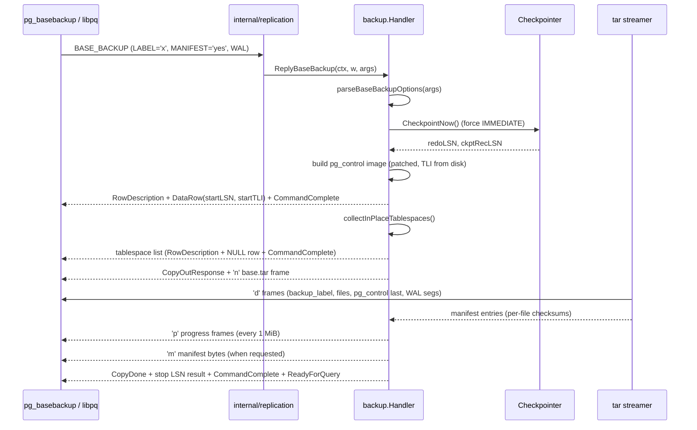

# Module: `internal/backup`

Physical backup — the `pg_basebackup`-compatible streaming backup handler.
Serves the `BASE_BACKUP` protocol command (the same one `pg_basebackup` issues)
by streaming the data directory as a **PG-compatible tar archive** (with
manifest), WAL segments, and tablespace handling — a real PG 18.3 standby can
restore the resulting tar.

The package is a **LEAF of `internal/replication`**: it mirrors
`postgres/src/backend/backup/` (reached from `walsender.c` without calling back
into `replication/`), so the dependency direction is
`postmaster → replication → backup`. Importing `internal/replication` or
`internal/postmaster` from here is an immediate import cycle; the two helpers
borrowed from `walsender.go` (`writeStreamingError`, `formatLSN`) are therefore
carried locally.

## Key Files

| File | LOC | Role |
|---|---|---|
| `basebackup.go` | 1,438 | The entire backup engine: wire handler, tar emission, manifest building, option parsing, tablespace handling, WAL segment appending. |
| `basebackup_wire_test.go` | 570 | Drives a server through `BASE_BACKUP` via the in-process protocol harness; asserts the tar parses cleanly with `archive/tar` and contains `backup_label` + `global/pg_control` + at least one `base/<oid>/` file. |
| `basebackup_control_test.go` | 196 | Tests the pg_control image patching (`BackupControlImage` path, minRecoveryPoint/TLI). |
| `basebackup_options_test.go` | 64 | Tests the `BASE_BACKUP (...)` option grammar, both PG17+ list and legacy keyword forms. |

### Functions in `basebackup.go`

- `ReplyBaseBackup` — the top-level wire handler, invoked from
  `internal/replication`'s `HandleCommand` (upstream: `SendBaseBackup`).
- `emitBaseBackupTar` — streams the data directory as tar (backup_label first,
  pg_control last, lexical order otherwise).
- `emitTablespaceTar` — streams one in-place tablespace as its own `<oid>.tar`.
- `writeTarFile` / `writeTarFileWithMode` / `writeTarDir` — tar entry emission
  (uid/gid 0, POSIX ustar, mode preservation, 0600 for pg_control/WAL).
- `writeRecPtrResult` / `writeTablespaceList` / `newArchiveFrame` /
  `writeProgressFrame` — wire result-set and CopyData frame writers.
- `buildBackupLabel` / `buildBackupManifest` / `streamBackupManifest` —
  the `backup_label` and `backup_manifest` (checksums:
  none/CRC32C/SHA224/SHA256/SHA384/SHA512).
- `collectInPlaceTablespaces` — enumerates `pg_tblspc/<oid>` numeric subdirs.
- `appendWALSegments` — appends the in-range WAL segments (`-X fetch`) plus
  timeline history files, with a contiguity sanity check.
- `parseBaseBackupOptions` / `parseBaseBackupOptionList` /
  `parseBaseBackupLegacyKeywords` / `parseOptionBool` — option grammar.
- `isExcludedFile` / `excludeDirContents` — exclusion tables.

## Public API

```go
type Handler struct{ ... }
func NewHandler(cfg Config, werr WriteQueryErrorFunc) *Handler
func (h *Handler) ReplyBaseBackup(ctx context.Context, w *libpq.FrameWriter, args string) error

type Config struct{ ... }    // server, storage, WAL access, checksum kind
type WriteQueryErrorFunc func(w *libpq.FrameWriter, code errcodes.Code, msg string, extra ...libpq.ErrorField) error
```

### Wire protocol shape

```
S → C  RowDescription("recptr", "tli")
S → C  DataRow(startLSN, startTLI)
S → C  CommandComplete("SELECT")
S → C  RowDescription("spcoid","spclocation","size")
S → C  DataRow(NULL, NULL, NULL)            -- single default tablespace
S → C  CommandComplete("SELECT")
S → C  CopyOutResponse(format=0, natts=0)
S → C  CopyData('n' archive-name "base.tar"\0 tablespace-path ""\0)
S → C  CopyData('d' <tar bytes>)+           -- many frames
S → C  CopyData('p' int8be bytes-done)*     -- progress reports
S → C  CopyData('m' <manifest bytes>)       -- manifest (when requested)
S → C  CopyDone
S → C  RowDescription("recptr","tli")
S → C  DataRow(stopLSN, stopTLI)
S → C  CommandComplete("SELECT")
S → C  CommandComplete("BASE_BACKUP")
S → C  ReadyForQuery
```

## Internal structure



### Backup flow

A `BASE_BACKUP` request is answered with: the backup LSN/checkpoint (result-set
1), the tablespace list (result-set 2), the `CopyOutResponse` opening the archive
stream, then the data-directory tar stream (backup_label first, main tablespace
files, `pg_control` last, then any requested WAL segments), then a trailing
`CopyDone`, the stop-LSN result-set, a final `CommandComplete("BASE_BACKUP")`,
and `ReadyForQuery`.

### pg_control handling

`BackupControlImage` (from `internal/initdb`) produces a modified control-image
(patched `minRecoveryPoint`/TLI) without mutating the live file; the tar ships
that image at its pg_control-last step, and the manifest records the shipped
bytes. The timeline is resolved BEFORE the patch (via
`initdb.LoadOrCreateTimelineID`) so the TLI matches the backup's segment names
and the `START_TIMELINE` reply — hardcoding 1 only happened to be right on a
never-promoted cluster.

### Tar formatting details

- **POSIX ustar** via `archive/tar`, `Format: tar.FormatUSTAR`, uid/gid 0.
- **pg_control last** — upstream invariant: a recovering standby sees a
  consistent control file.
- **pg_wal** is shipped as an empty directory (plus `archive_status`/`summaries`
  empty subdirs) — WAL segments are only appended when the client requested them
  (`-X fetch` / `WAL` option).
- **pg_tblspc/<oid>** in-place tablespace dirs are shipped as empty directory
  entries in base.tar; their contents stream as separate `<oid>.tar` archives.
- **Excluded dirs** — `pg_replslot`, `pg_stat_tmp`, `pg_dynshmem`, `pg_notify`,
  `pg_serial`, `pg_snapshots`, `pg_subtrans` ship as empty dirs with contents
  omitted.
- **Excluded files** — `postmaster.pid`, `postmaster.opts`, `.goopg.ctl.sock`,
  `postgresql.auto.conf.tmp`, `current_logfiles.tmp`, `backup_label`,
  `tablespace_map`, `backup_manifest`, `pg_internal.init*` (prefix match), and
  the legacy goopg `global/pg_xact` flat file.

### Checksums and manifest

- The manifest computes per-file checksums; the CRC32C implementation uses the
  Castagnoli polynomial table (matching PG's `crc32c` / `pg_checksum`). CRC32C is
  the default; the value is the little-endian byte image (Go's `crc32.Checksum`
  matches PG's INIT/FIN convention).
- `buildBackupManifest` renders a PG version-2 manifest with byte-for-byte field
  ordering and whitespace so the trailing SHA-256 `Manifest-Checksum` (always
  SHA-256 regardless of the per-file algorithm) matches upstream.
- `forceEncode` (the `MANIFEST='force-encode'` option) hex-encodes every path;
  otherwise only non-UTF-8 paths use `Encoded-Path`.
- WAL segments are tracked via `WAL-Ranges`, never as `Files[]` entries.

### WAL segment appending (`-X fetch`)

The inclusive segment range `[baseLSN0/segSize .. (endLSN0-1)/segSize]` is
scanned in `pg_wal/`, sorted oldest-first, and validated for contiguity (a gap is
an error — a backup that requested WAL but cannot supply the consistency range is
unusable). Timeline history files are always shipped (goopg single-timeline
clusters usually have none). Appended WAL is NOT recorded in the manifest
`Files[]`.

### LSN arithmetic

goopg uses 1-based LSNs internally; PG expects 0-based in `pg_control` and
`backup_label` — the code subtracts 1 (`baseLSN0 = redoLSN - 1`,
`ckptLSN0 = ckptRecLSN - 1`) for those artefacts. `startLSN` must be the
checkpoint REDO LSN (not `WrittenLSN`) so the WAL sender streams from the
consistency point.

## Dependencies

- **Used by** — `internal/replication` (walsender serves BASE_BACKUP),
  `internal/postmaster`, `internal/testport` (backup TAP).
- **Uses** — `internal/storage` (page read), `internal/access/transam/xlog`
  (LSN/WAL segment access: `XLogFileName`, `ParseXLogFileName`,
  `DefaultSegmentSize`), `internal/initdb` (control-image, timeline/system ID),
  `internal/executor` (the `Checkpointer` interface), `internal/libpq` (wire
  framing), `internal/utils/misc` (GUCs, `TablespaceVersionDirectory`),
  `internal/utils/errcodes` (error codes).

## Notable patterns / gotchas

- **PG-compatible tar** — the tar entries (headers, ordering, modes) must match
  what `pg_basebackup`/PG's restore expects; `pg_control` is written last so a
  real PG can start the restored directory.
- **Do not mutate the live control file** — the backup must ship a *patched
  copy* of `pg_control`; writing the patched image over the live file is a
  data-loss bug (S29/M0131). A promoted (TLI ≥ 2) primary that had its control
  file rewritten would FATAL "requested timeline %u does not contain minimum
  recovery point" if it crashed before the next checkpoint.
- **Streaming** — the tar is streamed incrementally; `Write`/`ReplyBaseBackup`
  emit chunks bounded by `baseBackupChunkBytes` (64 KiB, matching upstream's
  `bbsink_copystream` buffer) to avoid buffering the whole directory in memory.
  `baseBackupStreamer` adapts `archive/tar`'s `io.Writer` to `CopyData 'd'`
  frames and emits `'p'` progress frames every `baseBackupProgressInterval`
  (1 MiB).
- **Manifest checksums** — the manifest's per-file checksums must be computed
  over the *shipped* bytes (the same buffer fed to `record()`), so
  `pg_verifybackup` agrees with the streamed tar.
- **`WriteQueryErrorFunc` nil contract** — a nil error writer MUST NOT yield a
  nil error: the dispatch loop reads nil as "handled cleanly, keep reading
  frames", which would leave the client waiting on a reply that never comes.
- **`CommandComplete("BASE_BACKUP")`** — omitting the final
  `EndReplicationCommand` parity frame surfaces as "final receive failed: "
  (empty error) once the stop-LSN row has been parsed.
- **Option grammar** — both PG17+ list form (`BASE_BACKUP (LABEL 'x',
  MANIFEST 'yes', WAL)`) and the legacy keyword form (`BASE_BACKUP LABEL 'x'
  PROGRESS ...`) are accepted; unknown keys and no-op options (CHECKPOINT,
  COMPRESSION, INCREMENTAL, etc.) are tolerated so vanilla `pg_basebackup`
  invocations don't fail.
- **goopg 1-based LSNs** — forgetting the `-1` on `backup_label`'s CHECKPOINT
  LOCATION or the manifest's WAL-Ranges makes a real PG standby reject the backup
  or replay from the wrong position.