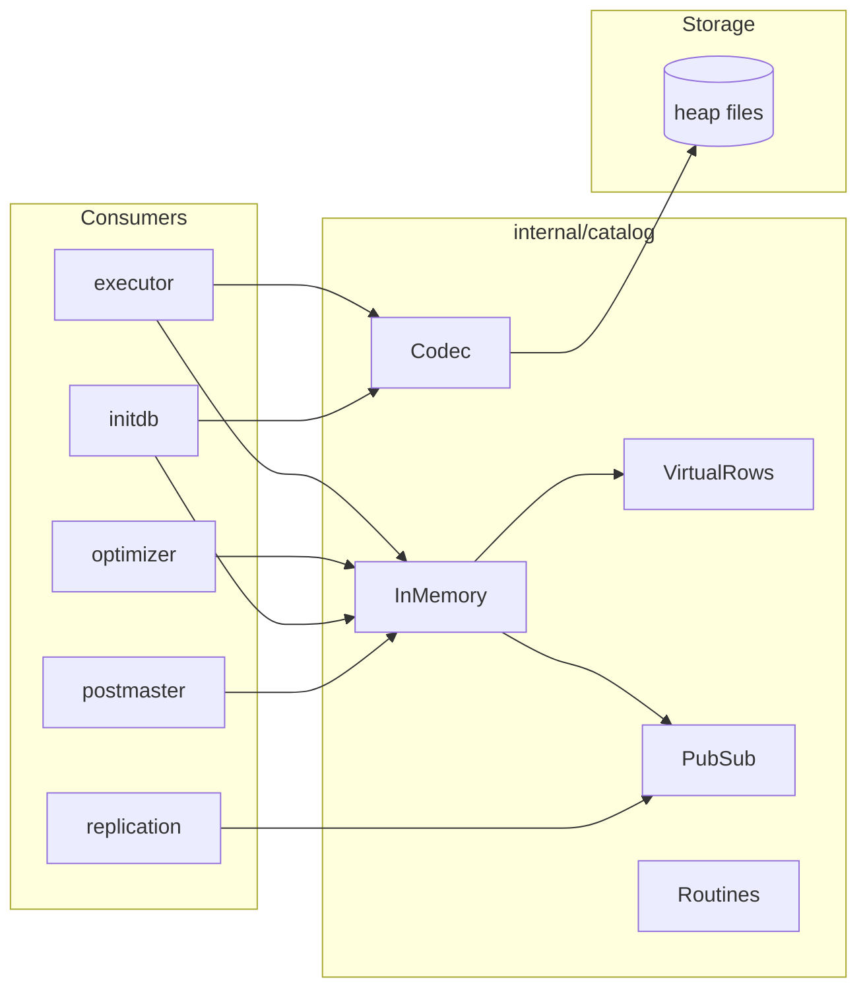
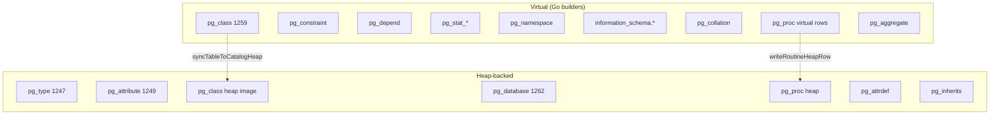
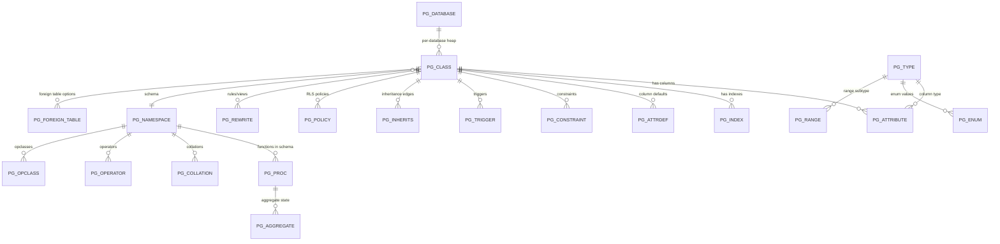
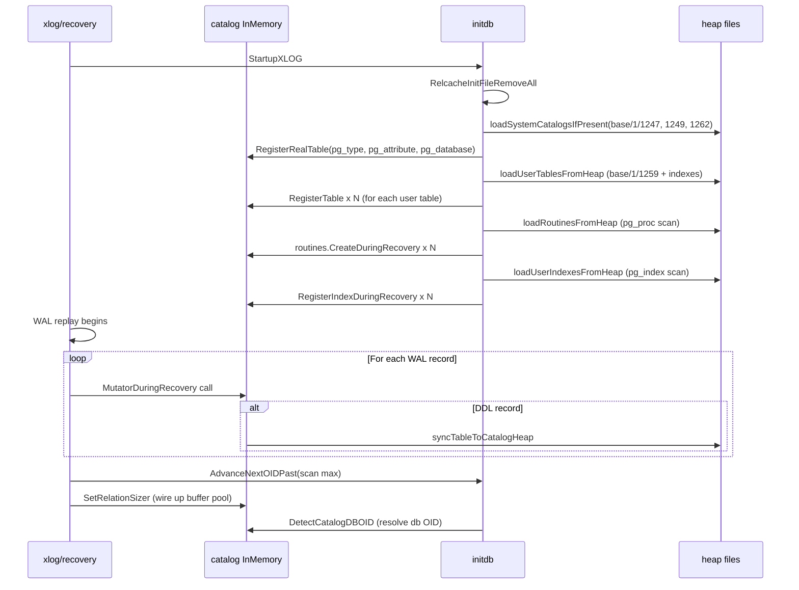

# Module: `internal/catalog`

The system-catalog layer. One process-wide `InMemory` registry holds every
relation/index/role/type/ACL/FDW/publication/extension/event-trigger object;
Go builders synthesize each `pg_catalog.*` / `information_schema.*` row set on
demand (`VirtualRows`); a binary codec encodes the three heap-backed catalogs
(pg_class, pg_attribute, pg_type). It serves five masters at once: the planner
(table/column/index lookup, stats), the executor DDL paths (create/alter/drop
registries), pg_dump fidelity (every PG18 column rendered, because pg_dump's
resolver SQL runs server-side on goopg), PG-standby compatibility (canonical
on-disk catalog rows a real PG 18.3 can consume), and WAL-replay (the
`*DuringRecovery` twin methods). Consumers by file count: executor 101,
optimizer 39, initdb 29, postmaster 7, replication 5.



## Key Files

| File | LOC | Role |
|---|---|---|
| `catalog.go` | 24,969 | Everything core: structs, `InMemory`, all registries, all virtual row builders, ACL store, reloptions, partition routing, OID allocation, the `Catalog` interface, `SearchPathCatalog` wrapper |
| `pg_proc_names_generated.go` | 13,623 | Generated OID→(proname,argtypes) reverse map; `pgProcNamesByOID`, `pgProcArgTypeNamesByOID`, `pgProcRetTypeByOID` — the full PG18 built-in-procedure index |
| `codec.go` | 2,049 | `PGClassRow`/`PGAttributeRow`/`PGTypeRow` heap encode/decode; fixed-offset layout constants (144-byte pg_class rows, 100-byte pg_attribute rows); all built-in type OID constants (16–4072) |
| `routines.go` | 1,081 | User-defined routine (function/procedure) registry: `Routine` struct (35 fields), `Routines` process-wide registry, `Create`/`Lookup`/`Drop`/`ResolveByName`/`ResolveBySig`, per-db scoping, overload resolution, pg_proc heap TID cache |
| `pg_operator_seed_data.go` | 807 | Full PG18 pg_operator seed, 799 rows, returned by `PGOperatorAllEntries()` |
| `pubsub.go` | 746 | Publication/subscription registry: `Publication` (9 fields), `Subscription` (8 fields), `SubscriptionRel`, `PubSub` struct, `CreatePublication`/`CreateSubscription`/`DropPublication`/`DropSubscription`, recovered-via-`*DuringRecovery` twins, per-db scoping |
| `default_acl.go` | 294 | ALTER DEFAULT PRIVILEGES: DEFACLOBJ_* letter constants (`'r'`/`'S'`/`'f'`/`'T'`/`'n'`/`'L'`), `DefaultACLEntry`, `DefaultACLNormalizePriv`, `GrantDefaultACLPrivilege`, `RevokeDefaultACLPrivilege`, `DefaultACLText` |
| `encoding.go` | 166 | Encoding-ID↔name mapping: `EncodingIDToName` (pg_encoding_to_char), `EncodingNameToID` (pg_char_to_encoding), `ValidServerEncodingName`, 43 canonical encoding names, ~60 cleaned aliases |
| `relcache_inval.go` | 151 | `pg_internal.init` sweep: `RelcacheInitFileUnlink` (single-db), `RelcacheInitFileRemoveAll` (cluster-wide), `WithRelCacheInitLock`, plus `allDigits`/`removeInitFilesInDir` helpers |
| `pgstats.go` | 117 | `PGStatsRowsForDBOid` — Go builder replicating the `pg_stats` SQL view projection (MCV, histogram, null_frac, n_distinct, avg_width) |
| `pg_node_oid_lookup.go` | 120 | Forward OID indexes for canonical pg_node_tree resolver: `LookupOperatorForNode` (name+leftOID+rightOID → OperatorEntry), `LookupProcForNode` (name+argOIDs → funcid), `ProcResultType` (funcid → prorettype) |
| `bpchar.go` | 55 | `PadBpchar` — blank-pads bpchar values to declared width for DataRow/COPY/pgoutput boundaries |
| `pg_database_schema.go` | 54 | `PgDatabaseColumnsPG18` canonical column schema, `SharedCatalogRelFileNode` for cluster-wide catalogs, `PgDatabaseRelationOID` (1262) |
| `pg_operator_data.go` | 27 | `OperatorEntry` struct (15 fields) — single pg_operator row representation |

## Core data structures

### `Table` (`catalog.go:418`)

The central relation record with ~60 fields:

- **Identity**: `Schema`, `Name`, `Columns []Column`, `OID`, `RelFileNodeOID`, `DBOid`
- **Virtual dispatch**: `Virtual bool` + `VirtualRows func()[][]string` — catalogs served by builders instead of heaps
- **View support**: `View *parser.SelectStmt` / `ViewColumnAliases` / `ViewDef` (raw SQL), `CheckOption` ("cascaded"/"local"/""), `SecurityBarrier`/`SecurityInvoker`, `OfTypeOID` (composite-typed tables)
- **Constraints**: `NamedChecks []NamedCheckConstraint`, `NotNullConstraints []NamedNotNullConstraint`, `CheckConstraints []string`, `ForeignKeys []ForeignKey`
- **Partition support**: `PartitionKey []string`, `PartitionMethod` ("LIST"/"RANGE"/"HASH"), `PartitionParentOID`, `PartitionBounds []PartitionBound`, `DetachPendingEpoch uint64`, `PartitionKeyOpClasses`, `PartitionKeyExprs`, `PartitionKeyCollations`
- **Storage attributes**: `Unlogged`/`Temp`, `TempOwner string`, `Tablespace uint32`, `ReplicaIdentity string`, `Fillfactor`, `RelFrozenXID storage.TransactionID`
- **Security**: `RowSecurity`, `ForceRowSecurity`, `Policies []PolicyInfo`, `Rules []RuleInfo`, `Owner string`
- **Stats**: `Stats *TableStats` (nil before ANALYZE)
- **Dump-only**: `ForeignServerName`, `ForeignOptions`, `Policies`, `Rules`, `Compression`, `StatTarget`, `Collation`, `ParallelWorkers` — goopg does not act on these

The `Owner` field drives VACUUM privilege checks (a table can only be vacuumed
by its owner or a superuser); `RelFrozenXID` mirrors pg_class.relfrozenxid for
anti-wraparound autovacuum decisions; `RelFileNodeOID` overrides the on-disk
relfile identity when it differs from the catalog OID (physical backup
compatibility). `DBOid` is read by `RelFileNode` to stamp
`storage.RelFileNode.DBOid` per-table instead of using the single process-wide
`InMemory.dbOid`, so physical storage separates per database (M0122-0007).

### `Column` (`catalog.go:194`)

- `Type` (`Type{Name, Args, IsArray}` where `Name` is the *element* type name for arrays)
- `Ordinal`, `Dropped` (slot retained), `MissingValue any` (attmissingval, typed `any` to dodge import cycle)
- Identity: `IdentityGen` ("a"/"d"/""), `IdentityStart`, `IdentityIncrement`, `IdentityMin`, `IdentityMax`, `IdentityCache`, `IdentityCycle`
- `GeneratedExpr string` (STORED generated columns), `GeneratedVirtual` (note: still materialized STORED)
- ~15 dump-only fidelity fields: `Storage`, `Compression`, `StatTarget`, `Options`, `Collation`, `FDWOptions`, `Local`, `InhCount`, `IsLocal`

### `Index` (`catalog.go:1898`)

- `Schema`, `Name`, `Table *Table`, `Columns []string`, `Unique`, `Method`, `Primary`, `OID`, `DBOid`, `Tablespace`
- Expression indexes: `ColExprs []*parser.Expr`, `ColExprStrings []string`
- Ordering: `ColDescending []bool`, `ColNullsFirst []bool`, `ColOpClasses []string`, `ColCollations []string`
- Partial indexes: `HasPredicate bool`, `Predicate parser.Expr`, `PredicateString string`
- Covering: `IncludeColumns []string`
- Constraint: `IsConstraint`, `IsExclusion`, `ExclusionOp string`, `Deferrable`, `InitiallyDeferred`, `NullsNotDistinct`
- Storage options: `Fillfactor int`, `DeduplicateItems *bool`, `FastUpdate *bool`, `GinPendingListLimit int`
- Partition: `PartitionParentOID`, `DeclaredHash`

### `InMemory` (`catalog.go:2459`)

The live truth: ~40 maps and slices behind an `RWMutex`:

```go
type InMemory struct {
    mu              sync.RWMutex
    relSizer        atomic.Pointer[func(RelFileNode) (int64, bool)]
    namespaces      map[uint32]*tableNamespace   // dbOid → tables/indexes
    routines        *Routines
    databases       map[string]bool
    databaseConnLimit map[string]int32
    databaseEncoding  map[string]int32
    databaseOwner     map[string]uint32
    databaseOid       map[string]uint32          // real distinct OIDs
    dbRoleSettings    map[uint32][]string
    roleSettings      map[roleSettingKey][]string
    roleMembers       map[roleMembershipKey]*RoleMembership
    partitionChildren     map[uint32][]uint32
    pendingAttachXID      map[uint32]uint32
    indexPartitionChildren map[uint32][]uint32
    toastRenames          map[uint32]string
    inheritanceChildren   map[uint32][]uint32
    pendingPartitionDetachCount int
    pendingInheritanceChangeCount int
    enumTypes       map[string]*EnumType
    domains         map[string]*Domain
    compositeTypeNames map[string]bool
    compositeTypeFields map[string][]CompositeField
    compositeTypes  map[string]*CompositeType
    rangeTypes      map[string]*RangeType
    constraintViewDeps map[string][]string
    opClassHashFuncs map[string]string
    opClassSchemas  map[string]string
    userAggregates  map[string]*UserAggregate
    userCollations  []*UserCollation
    userConversions []*UserConversion
    userTSDicts     []*UserTSDict
    userTSConfigs   []*UserTSConfig
    schemas         map[string]uint32
    schemaOwners    map[string]uint32
    schemaHeapTIDs  map[string]SchemaHeapTID
    typeHeapTIDs    map[uint32]SchemaHeapTID
    // ... operatorHeapTIDs, collationHeapTIDs, conversionHeapTIDs, etc.
    tempNamespaces  map[string]uint32
    roles           map[string]uint32
    predefinedRoles map[string]uint32
    roleAttrs       map[string]*RoleAttrs
    tableACLs       map[uint32]map[string]map[string]bool
    tableACLGrantor map[uint32]map[string]string
    tableACLOrder   map[uint32][]string
    roleACLDisplay  map[string]string
    relACLEmptied   map[uint32]bool
    relACLOwnerRevoked map[uint32]bool
    attrACLs        map[attrACLKey]map[string]map[string]bool
    attrACLOrder    map[attrACLKey][]string
    attrACLGrantor  map[attrACLKey]map[string]string
    parameterACLOIDs map[string]uint32
    parameterACLNames map[uint32]string
    defaultACLOIDs   map[defaultACLKey]uint32
    defaultACLKeys   map[uint32]defaultACLKey
    defaultACLGlobal map[uint32]bool
    compatObjects   map[string]map[string]struct{}
    fdws            map[string]*ForeignDataWrapper
    accessMethods   map[string]*AccessMethod
    eventTriggers   map[string]*EventTrigger
    foreignServers  map[string]*ForeignServer
    userMappings    map[string]*UserMapping
    // ... tablespaces, extensions, casts, transforms, userOperators, userOpFamilies, userOpClasses, amOpMembers, amProcMembers, udts
}
```

### `tableNamespace` (`catalog.go:2445`)

```go
type tableNamespace struct {
    tables  map[string]*Table           // key: "schema.name"
    indexes map[string]*Index           // key: "schema.name"
    byTable map[uint32]map[string]*Index // table OID → index name → *Index
}
```

### `Catalog` interface (`catalog.go:2136`)

~85 methods covering lookup, DDL, statistics, extensions, tablespaces, roles, privileges, indexes, routines, enum/domain/composite/range types, operators, and search-path resolution. Every method has a concrete `*InMemory` receiver plus a `SearchPathCatalog` wrapper.

### `SearchPathCatalog` (`catalog.go:24824`)

Wraps a `Catalog` with search-path resolution, temp-owner filtering, per-db OID routing, and partition-detach epoch tracking. `LookupTable` tries schemas in order for unqualified names; `LookupIndex` and `IndexesOnTable` follow the same pattern.

### Type-side registry structs

| Type | Fields | Key |
|---|---|---|
| `EnumType` | `OID, Name, Values []EnumValue, Owner, DBOid` | `enumKey(dbOid, name)` |
| `Domain` | `OID, Name, Base Type, NotNull, Default, Checks []DomainCheck, Owner, DBOid` | `domainKey(dbOid, name)` |
| `CompositeType` | `OID, Name, Fields []CompositeField, Owner, DBOid` | `compositeKey(dbOid, name)` |
| `RangeType` | `OID, Name, Subtype, SubtypeOpclass, Collation, CanonicalFunc, SubtypeDiff, MultirangeName, Owner, DBOid` | `rangeKey(dbOid, name)` |
| `UserOperator` | `OID, Name, LeftType, RightType, NamespaceOID, FuncOID, Owner` | `userOperatorKey(schema, name, left, right)` |
| `UserOperatorFamily` | `OID, Name, Method, NamespaceOID, Owner, DBOid` | `userOpFamilyKey(dbOid, schema, name, method)` |
| `UserOperatorClass` | `OID, Name, Method, FamilyOID, KeyType, InType, IsDefault, NamespaceOID, Owner, DBOid` | `userOpClassKey(dbOid, schema, name, method)` |
| `ForeignDataWrapper` | `OID, Name, Options, Handler, Validator` | — |
| `ForeignServer` | `OID, Name, FDWName, Type, Version, Options, DBOid` | `foreignServerKey(dbOid, name)` |
| `UserMapping` | `OID, User, Server, Options, DBOid` | `userMappingKey(dbOid, user, server)` |
| `Cast` | `OID, Source, Target, Context, Method, FuncOID` | `castKey(source, target)` |
| `Transform` | `OID, TypeName, Lang, FromFuncOID, ToFuncOID` | — |
| `AccessMethod` | `OID, Name, Type, HandlerOID` | `accessMethodKey(dbOid, name)` |
| `EventTrigger` | `OID, Name, Event, Owner, FuncOID, Tags` | — |
| `StatisticsObject` | `OID, Schema, Name, TableOID, Kinds, Columns, Exprs, HasExpr, Owner` | — |
| `UserAggregate` | `OID, Name, ArgTypes, ReturnType, SFunc, SType, InitCond, SortOp, ...` | — |
| `UserCollation` | `OID, Name, Locale, Provider, Deterministic, ...` | — |
| `UserConversion` | `OID, Name, ForEncoding, ToEncoding, FuncOID, Default` | — |
| `UserTSDict` | `OID, Name, Template, InitOption, Options, DBOid` | — |
| `UserTSConfig` | `OID, Name, Parser, Mappings []TSConfigMapping, DBOid` | — |

### `RoleAttrs` (`catalog.go:16491`)

```go
type RoleAttrs struct {
    Super       bool
    Login       bool
    Inherit     bool
    CreateRole  bool
    CreateDB    bool
    Replication bool
    BypassRLS   bool
    ConnLimit   int32  // -1 = unlimited (PG default), 0 = "no new connections"
    Password    string // SCRAM-SHA-256 verifier
    ValidUntil  string
}
```

## Virtual vs heap-backed catalogs

The split is deliberate and asymmetric:

- **pg_class (1259) is virtual** — registered in `(*InMemory).registerSystemTables()`
  (`catalog.go:8418`) with `Virtual: true` and a PG18-canonical 34-column
  tupdesc; rows come from `PGClassRowsForDBOid`. The executor's values operator
  special-cases it (`internal/executor/operators.go:165` swaps in `ctx.PgClassRows()`;
  hook declared `executor/context.go:689–694`).
- **pg_type (1247) and pg_attribute (1249) are heap-backed** — when
  `base/<dbOid>/1247|1249` exist, startup registers them via
  `RegisterRealTable` (`catalog.go:12467`, rejects Virtual tables, requires a
  preset OID < FirstUserOID) so a SeqScan reads the relfile directly
  (`internal/initdb/open.go:2795 loadSystemCatalogsIfPresent`).
- **…but pg_class also gets a real heap image** for PG-standby/dump parity:
  `syncTableToCatalogHeap` (`internal/executor/operators_ddl.go:18036`) emits
  PG18-canonical 34-column pg_class + 25-column pg_attribute rows, the three
  pg_class/pg_attribute btree index files, pg_attrdef rows, and pg_inherits
  rows. Called from CREATE TABLE and ~12 ALTER sites.
- **pg_database (1262) is shared-catalog heap-backed** — stored at
  `global/1262` (not per-database). `SharedCatalogRelFileNode` routes it.
  Startup reload in `loadSystemCatalogsIfPresent` reads it.
- **pg_proc heap** — user-defined routines write physical pg_proc/pg_aggregate
  heap rows via `writeRoutineHeapRowWithIndexes` (initdb recovery path) and
  `applyRoutineHeapRow` (runtime CREATE/ALTER). The `Routines` registry carries
  `heapTIDs map[uint32]SchemaHeapTID` for O(1) heap UPDATE.
- Everything else — pg_namespace, pg_constraint, pg_depend, pg_stat_*,
  information_schema.* — is a virtual builder.



## Lifecycle

- **CREATE/ALTER/DROP** — the executor calls interface methods (`CreateTable`:12355,
  `CreateIndex`:12414, `AddColumn`:12446, `RenameTable`:12469, `CreateView`:12592,
  `DropTable`:20506, `DropIndex`:20585…) which mutate the in-memory namespace
  under `c.mu`; the same executor statement then persists via
  `syncTableToCatalogHeap`. `RegisterRealTable`:12147 /
  `RegisterVirtualTable`:12183 are the two install paths.
- **OID allocation** — one cluster-wide `nextOID` counter: `AllocOID`:6468,
  `allocOIDLocked`:6475; `AdvanceNextOIDPast`:6457 is fed at startup from the
  heap scan and the checkpointed counter embedded in WAL/pg_control.
  `FirstUserOID = 16384` floors dynamic OIDs; `BootstrapSuperuserOID = 10`.
  `FirstRoutineOID = 1<<17` leaves room for built-in pg_proc rows.
  Roles share the counter (`RegisterRole`:15944); `RegisterRoleWithOID`:15909
  preserves role OIDs across restarts.
- **Recovery twins** — nearly every mutator has a `*DuringRecovery` sibling
  (e.g. `RegisterIndexDuringRecovery`:6164, `DropCollationDuringRecovery`:13488,
  `RegisterRangeTypeDuringRecovery`:22837, `RegisterDomainDuringRecovery`:23908)
  that skips collision checks/OID mints during WAL replay — a second path that
  must stay in sync with the primary.
- **Dependency recording** — deliberately **no general pg_depend store**:
  `PGDependRowsForDBOid`:14990 synthesizes only sequence-ownership ('a') rows.
  The one first-class edge type is `constraintViewDeps`:2489 enforcing DROP
  CONSTRAINT RESTRICT for functional-dependency views.
- **Transactional semantics** — most catalog mutations are immediate, not
  MVCC-versioned. Sidecar markers emulate PG behaviour:
  `SetTablePendingDropXID`/`TablePendingDropXID` (deferred DROP TABLE visibility),
  `PgClassRowMark`s (:2949/:21379, row-lock marks on pg_class tuples),
  `pendingAttachXID` (:2417, in-flight ATTACH PARTITION blocks FK deletes),
  `DetachPendingEpoch` on children with `VisiblePartitionChildren`:4834,
  `pendingInheritanceChangeCount` (:2457, forces plan-cache bypass),
  `PendingPartitionDetachCount` for O(1) DETACH CONCURRENTLY detection.
- **relcache init file invalidation** — `RelcacheInitFileUnlink` removes
  `pg_internal.init` for a single database; `RelcacheInitFileRemoveAll` sweeps
  the entire cluster at startup (including pg_tblspc/ paths). Both are guarded
  by `WithRelCacheInitLock` to prevent TOCTOU races with concurrent readers.

## Scoping

- **Per-database namespaces** — `namespaces map[dbOid]*tableNamespace` despite
  one shared process-wide registry; unknown dbs get an `emptyTableNamespace`
  (`ns(dbOid)`:3774); only CreateTable/CreateIndex/RegisterRealTable/
  TryRegisterUserTable create one (`getOrCreateNS`:3789). Every accessor takes
  trailing `dbOid ...uint32`, defaulted via `resolveDBOid`:3811 to
  `DefaultDBOid = 1`. Type-family maps key dbOid into the name
  (`domainKey`:3821, `enumKey`:3829, `compositeKey`:4007, `rangeKey`:4015).
- **The postgres-is-default quirk** — `NamespaceDBOid(connDBOid)` maps
  0 **and `PostgresDBOid = 5`** back to DefaultDBOid(1), because write paths
  still persist under 1; only genuinely new CREATE DATABASE OIDs get their own
  namespace. Do not "fix" this — making postgres connections use their own
  namespace makes every existing table vanish.
- **Schemas/search_path** — schema registry (`RegisterSchema`:12991,
  `SchemaOID`:12708) with heap-TID sidecars (`SchemaHeapTID`:12742 family).
  `SearchPathCatalog.LookupTable`:23984 tries schemas in order for unqualified
  names; it also carries `TempOwnerToken`, `SnapshotPartitionDetachEpoch`,
  `DisableSeqScan`, `DBOid`.
- **Temp tables** — `Table.TempOwner` records the owning session token;
  per-owner temp namespaces (`EnsureTempNamespace`/`tempNamespaceName`,
  `tempNamespaceOID`); `DropSessionTempObjects`:20534 cleans up at disconnect;
  `AccessibleInheritanceChildren`:4578 hides other-session temp children.
  Empty `TempOwner` on a temp relation means visible-to-all-sessions
  (single-session legacy compat).
- **Per-db registry scoping** — `Publication.DBOid`, `Subscription.DBOid`,
  `Routine.DBOid`, `UserTSDict.DBOid`, `UserTSConfig.DBOid`, `EnumType.DBOid`,
  `Domain.DBOid`, `CompositeType.DBOid`, `RangeType.DBOid` — all carry the
  real physical database OID so two distinct databases may each create a
  same-named object without colliding.
- **Postgres-db mirror** — `base/5` is mirrored from `base/1` by
  `internal/executor/sys_catalog_postgres_db_mirror.go` so a connection to
  `postgres` sees the same catalog heap images.

## Relationship map of the catalogs



## System views

- **Nailed views** — `cmd/gen-nailed-view-tables/main.go` renders
  `internal/initdb/nailed_view_manifest.tsv` (captured from a throwaway real
  PG18.3 by `scripts/capture-ev-action.sh`) into
  `internal/initdb/nailed_view_seed_data.go`: bootstrap pg_class/pg_attribute
  heap rows for **80 on-disk system views**, plus `nailedViewRewriteEntries()`
  `_RETURN` pg_rewrite seed rows. View reltype is goopg's RECORDOID (2249),
  diverging from upstream per-view composite types.
- **pg_stat_*** — Go builders, not SQL views: `PGStatTablesRowsForDBOid`:7704,
  xact/indexes/statio variants–8076, scoped by `StatTableScope{All,User,Sys}`:7671;
  counters are faithful zeros/NULLs; n_live_tup comes from ANALYZE reltuples.
- **pg_stats** — `PGStatsRowsForDBOid` (pgstats.go) replicates the SQL view
  projection directly from `ColumnStats` (MCV/histogram/null_frac/n_distinct).
  Only MCV (kind 1) and equi-depth histogram (kind 2) are collected; correlation,
  most-common-elements, and range-type stats are always NULL.
- **pg_proc/pg_aggregate** — virtual rows built from `Routines` registry, plus
  embedded built-in proc rows from `pg_proc_names_generated.go`.
- **information_schema** — virtual tables registered in-package
  (`registerInformationSchemaTables`:11812) plus generated view seed data
  (`cmd/gen-information-schema-views`, `cmd/gen-information-schema-procs`).

## Public API

Grouped highlights (all in `catalog.go` unless noted):

```go
// ── Lookup ──────────────────────────────────────────────────────────
LookupTable / LookupColumn / LookupIndex          // interface; impls:12299/12311/12631
LookupTableByOID / LookupTableByOIDAllDBs         //:6360/6617
LookupIndexByOID                                  //:5070
TablesInSchema / AllTables / AllUserViews/MatViews //:21375/22127/22389/22407
UserTableHandles / AllIndexes                      //:22152/21865
IndexesOnTable / HasPrimaryKey                     //:21537/22026
SchemaExists / SchemaOID / SchemaNameForOID        //:13020/13028/13041
LookupEnum / LookupEnumByOID / LookupEnumByArrayOID //:22603/22641/22656
LookupDomain / LookupDomainByOID / LookupDomainByArrayOID //:24044/24078/24093
LookupCompositeType / LookupCompositeTypeByOID / LookupCompositeTypeByArrayOID //:23044/23076/23091
LookupRangeType / LookupRangeTypeByOID / LookupRangeTypeByMultirangeOID //:23642/23693/23708
LookupStatistics / StatisticsByOID                  //:4187/4322
LookupBuiltinProc / LookupBuiltinProcByOID          //:20810/20818
LookupBuiltinOperator / LookupBuiltinOperatorByOID  //:20882/20896
LookupUserOperator / LookupUserOperatorByOID        //:19631/19676
LookupUserOperatorFamily / LookupUserOperatorClass  //:19957/20102
LookupForeignDataWrapper / LookupForeignServer      //:18128/18930
LookupUserMapping / LookupTablespaceOID             //:21295/16239
LookupEventTrigger / LookupTrigger / LookupToastRel //:18376/1241
LookupUserAggregateByName / LookupUserAggregateByOID //:4519/4530
Routines().Lookup / Routines().LookupByName         // routines.go:441/480
Routines().LookupByOID / Routines().ResolveBySig    // routines.go:778/674

// ── DDL ─────────────────────────────────────────────────────────────
CreateTable / CreateIndex / CreateView / CreateMatView //:12675/12734/12912
AddColumn / RenameTable / RenameIndex / RenameSchema   //:12766/12789/12850/13378
DropTable / DropView / DropIndex / DropMatView         //:21409/12994/21517
DropSessionTempObjects / SessionTempTableNames         //:21466/21501
TryRegisterUserTable / RegisterRealTable / RegisterVirtualTable //:12432/12467/12503
RegisterSchema / UnregisterSchema / RenameSchema       //:13311/13322/13378
CreateDatabase / DropDatabase / RenameDatabase         //:5349/5365/5388
CreateExtension / DropExtension                        //:13544/13571
CreateTablespace / DropTablespace / RenameTablespace   //:16092/16112/16163
CreateCollation / DropCollation / RenameCollation      //:13617/13665/13689
CreateConversion / DropConversion / RenameConversion   //:13848/13905/13976
CreateTSDict / DropTSDict / RenameTSDict               //:14198/14260/14616
CreateTSConfig / DropTSConfig / RenameTSConfig         //:14690/14754/14844
Routines().Create / Routines().Drop / Routines().DropByName // routines.go:279/508/555
Routines().RenameRoutine / Routines().SetSchema         // routines.go:800/842
RegisterEnum / DropEnum / AddEnumValue / RenameEnum    //:22545/22977/22848/22721
RegisterDomain / DropDomain / RenameDomain             //:23877/24610/24107
RegisterCompositeTypeWithFields / DropCompositeType    //:23018/23859
RegisterRangeType / DropRangeType / RenameRangeType    //:23602/23764/22807
RegisterUserOperator / DropUserOperator                //:19486/19520
RegisterUserOperatorFamily / DropUserOperatorFamily    //:19801/19863
RegisterUserOperatorClass / DropUserOperatorClass      //:20027/20112
RegisterAmOpMember / RegisterAmProcMember              //:20241/20262
RegisterForeignDataWrapper / DropForeignDataWrapper    //:18032/18051
RegisterForeignServer / DropForeignServer              //:18968/18999
RegisterUserMapping / DropUserMapping                  //:21270/21305
RegisterAccessMethod / DropAccessMethod                //:18156/18190
RegisterEventTrigger / DropEventTrigger                //:18319/18343
RegisterStatistics / DropStatistics                    //:4114/4161
RegisterUserAggregate / DropUserAggregate              //:4508/4559
RegisterRole / UnregisterRole / RenameRole             //:16451/16579/16610
RegisterSchemaDuringRecovery / UnregisterSchemaDuringRecovery //:13459/13471

// ── Row builders (virtual catalogs) ─────────────────────────────────
PGClassRowsForDBOid       PGAttrdefRowsForDBOid
PGConstraintRowsForDBOid  PGDependRowsForDBOid
PGInheritsRowsForDBOid    PGIndexesRowsForDBOid
PGIndexRowsForDBOid       PGTablesRowsForDBOid
PGPolicyRowsForDBOid      PGTriggerRowsForDBOid
PGSequenceRowsForDBOid    PGRewriteRowsForDBOid
PGForeignTableRowsForDBOid PGForeignServerRowsForDBOid
PGUserMappingsRowsForDBOid PGConversionRowsForDBOid
PGTSDictRowsForDBOid      PGTSConfigRowsForDBOid
PGStatTables/ Xact/ Indexes / StatioTables / StatioIndexes / StatioSequences
PGStatsRowsForDBOid       PGInitPrivsRowsForDBOid
PGStatDatabaseRows        PGStatDatabaseConflictsRows
PGStatUserFunctionsRows   PGDatabasesRows
PGCollationRowsForDBOid   //:15211

// ── Types ───────────────────────────────────────────────────────────
RegisterEnum / AddEnumValueResult / RemoveEnumValue / DropEnum
RegisterDomain / AddDomainCheck / DropDomain / DropDomainConstraint
RegisterCompositeTypeWithFields / RegisterCompositeType
RegisterRangeType / LookupRangeType / ListRangeTypes
ResolveColumnType / IsSerialTypeName / TablesWithColumnOfType
FindColumnUsingDomainTransitively

// ── Privileges / roles ─────────────────────────────────────────────
GrantTablePrivilege / GrantTablePrivilegeWithGrantOption / GrantTablePrivilegeAs
RevokeTablePrivilege / HasTablePrivilege
GrantColumnPrivilege / GrantColumnPrivilegeAs / RevokeColumnPrivilege / AttrACLText
MaterializeOwnerACL / IsOwnerACLRevoked / HasOwnerPrivilege
DropTableACL / RelaclText / ProcACLText / TypeACLText / NamespaceACLText
ParameterACLText / ForeignServerACLText / ForeignDataWrapperACLText / DatabaseACLText
IsSuperuser / RoleIsMemberOf / IsAdminOfRole / HasPrivsOfRole / SelectBestAdmin
RoleOID / RoleNameForOID / RoleNameAtOID / RoleNameForOIDOrUnknown
GrantRoleMembership / RevokeRoleMembership / LookupRoleMembership
AllRoleStates / AllRoleMemberships / RoleConfigEntries / DatabaseConfigEntries

// ── Default ACLs (default_acl.go) ───────────────────────────────────
DefaultACLOID / HasDefaultACL / GrantDefaultACLPrivilege / RevokeDefaultACLPrivilege
DefaultACLText / DefaultACLEntries
DefaultACLObjTypeFromParserObjType / DefaultACLNormalizePriv

// ── Publications / Subscriptions (pubsub.go) ────────────────────────
CreatePublication / CreatePublicationAsOwner / DropPublication / SetPublicationOwner
LookupPublication / Publications / PublicationsForDBOid
CreateSubscription / CreateSubscriptionAsOwner / DropSubscription / SetSubscriptionOwner
LookupSubscription / Subscriptions / SubscriptionsForDBOid
AddSubscriptionRel / AdvanceSubscriptionRel / LookupSubscriptionRel / SubscriptionRels

// ── Codec (codec.go + small files) ──────────────────────────────────
PGClassRow / PGAttributeRow / PGTypeRow encode+decode
PadBpchar (bpchar.go) / EncodingIDToName (encoding.go)
SerializeTSDictOptions / DeserializeTSDictOptions
FormatExprForAttrdef / BuildTableReloptions / BuildIndexReloptions / ApplyTableReloptions
FormatPartitionBound / ArrayTextLiteral / ReloptionsElements

// ── Partition routing ──────────────────────────────────────────────
FindPartitionForValue       FindRangePartitionForValue
FindRangePartitionForDatums FindHashPartitionForValue
FindHashPartitionByHash     PartitionChildren / IndexPartitionChildren
RegisterPartitionChild / UnregisterPartitionChild
MarkPartitionDetachPending / ClearPartitionDetachPending
VisiblePartitionChildren / InheritanceChildren / AccessibleInheritanceChildren

// ── Cross-package hooks (import-cycle breakers) ────────────────────
SequenceParamsFunc / FindSequenceOwnedByFunc
SetRelationSizer / RelationBlocks / RelAllVisibleFunc
RelNBlocksFunc / RelationLockRowsFunc / AdvisoryLockRowsFunc
VirtualSpecLockRowsFunc / UserTableTriggerStatsFunc
RegprocName / RegprocedureName / RegprocedureNameParts
RegoperatorName / RegoperatorNameAndSchema
IndexRealPages / ResolveIndexColumnOpclassOID / ResolveIndexColumnCollationOID

// ── OID / metadata ─────────────────────────────────────────────────
AllocOID / AdvanceNextOIDPast / NextOID
RelFileNode / IndexRelFileNode / ToastRelFileNode / ToastRelFileNodeByOID
RelAllVisible / DatFrozenXID / SetDatabaseACLChangeXID / TableACLChangeXID
SetTablePendingDropXID / TablePendingDropXID / ClearTablePendingDropXID
AddPgClassRowMark / PgClassRowMarks / ClearPgClassRowMark / ClearPgClassRowMarksForXID
SetComment / GetComment / AllComments
RegisterCompatObject / DropCompatObject / ListCompatObjects

// ── Node-tree forward OID resolution (pg_node_oid_lookup.go) ───────
LookupOperatorForNode / LookupProcForNode / ProcResultType

// ── index AM metadata ──────────────────────────────────────────────
IndexAMCapabilityByName / AccessMethodOIDByName / AccessMethodNameByOID
LanguageNameToOID / LookupOpClassSupportProcOID / DefaultBtreeOpclassForSubtype
```

## Codec format (`codec.go`)

The on-disk binary format matches `executor.EncodeRow` / `executor.DecodeRowInto`
so a standard SeqScan on pg_class / pg_attribute / pg_type sees correct values
without special-casing the system catalogs:

- **1 null-flag byte** per column (0 = present, 1 = NULL)
- **int4** → 4 bytes, big-endian uint32
- **bool** → 1 byte (1 = true, 0 = false)
- **text** → 4-byte big-endian uint32 length + raw UTF-8 bytes

Fixed-size layout constants guarantee that the codec can decode any column
without walking null-bitmaps:

- **pg_class**: 144 bytes fixed part, with offsets `pgClassOffOID=0`,
  `pgClassOffRelName=4`, `pgClassOffRelNamespace=68`, `pgClassOffRelFileNode=88`,
  `pgClassOffRelTablespace=92`, `pgClassOffRelIsShared=117`,
  `pgClassOffRelPersistence=118`, `pgClassOffRelKind=119`,
  `pgClassOffRelNAtts=120`, `pgClassOffRelIsPopulated=129`
- **pg_attribute**: 100 bytes fixed part, with offsets `pgAttributeOffRelID=0`,
  `pgAttributeOffName=4`, `pgAttributeOffTypID=68`, `pgAttributeOffNum=74`,
  `pgAttributeOffTypMod=76`, `pgAttributeOffNotNull=86`,
  `pgAttributeOffIdentity=89`, `pgAttributeOffIsDropped=91`
- `pgNameDataLen = 64` bytes for `name`-type columns (padded with \0)

The 34-column pg_class alignment exists precisely so `scanMatching` can decode
physical pg_class heap tuples for statements like `UPDATE pg_class SET reltuples…`
(`catalog.go:8423–8142`).

## `pg_proc_names_generated.go` structure

This 13,623-line generated file provides three maps:

- **`pgProcNamesByOID map[uint32]string`** — OID → proname (all PG18 built-in procs)
- **`pgProcArgTypeNamesByOID map[uint32][]string`** — OID → argument type names (parallel to proargtypes)
- **`pgProcRetTypeByOID map[uint32]uint32`** — OID → prorettype OID

These are consumed by:
- `pg_node_oid_lookup.go` — builds forward indexes `LookupProcForNode`/`LookupOperatorForNode`
- `regproc.go` — `RegprocName`, `RegprocedureName`, `RegprocNameAndSchema`
- `initdb` — pg_proc heap row bootstrap
- pg_proc virtual row builder — `PGProcRows` family

## `Routines` registry details (`routines.go`)

The `Routines` struct owns three maps guarded by a single `RWMutex`:

```go
type Routines struct {
    mu      sync.RWMutex
    byKey   map[string]*Routine   // routineKey(dbOid, schema, name, signature) → *Routine
    byName  map[string][]string   // nameKey(dbOid, schema, name) → []overloadKeys
    nextOID uint32
    heapTIDs map[uint32]SchemaHeapTID  // OID → live pg_proc heap TID
}
```

Key format: `routineKey` = `dbPrefix:lower(schema).lower(name)(type1,type2,…)`;
`nameKey` = `dbPrefix:lower(schema).lower(name)`. The `dbPrefix` is `"dbN:"`
where N is the database OID, or `""` for DefaultDBOid.

Overload resolution: `LookupByName` returns ALL routines matching a bare name
(one per signature). `Lookup` with explicit arg types returns exactly one.
`ResolveByName` returns an error if the name is ambiguous (multiple overloads).
`ResolveBySig` resolves by name + arg types, returning an error if not found.

The `Routine` struct carries 35 fields including `ArgTypeSchemas` (for regprocedure
output), `ArgTypeOIDs` (for the `char` ambiguity), `SequenceDeps`/`RoutineCallOIDs`/
`TableDeps`/`ColumnDeps` (dependency tracking), `Config` (proconfig SET clauses),
and `Aggregate *UserAggregate` (prokind='a' routines).

## `PubSub` API details (`pubsub.go`)

The `PubSub` struct wraps a `sync.RWMutex` and three maps:

```go
type PubSub struct {
    mu              sync.RWMutex
    publications    map[string]*Publication   // pubMapKey(dbOid, name) → *Publication
    subscriptions   map[string]*Subscription  // subMapKey(dbOid, name) → *Subscription
    subscriptionRels []*SubscriptionRel       // in creation order
}
```

Key format: `pubMapKey`/`subMapKey` = `"dbN:name"` where N is the database OID.
`PublicationsForDBOid`/`SubscriptionsForDBOid` filter by database.

`SubscriptionRel` tracks per-relation replication progress:
```go
type SubscriptionRel struct {
    SubName     string
    RelOID      uint32
    State       string  // 'i' = init, 'r' = ready, 's' = syncing, ...
    LSN         uint64
}
```

`AdvanceSubscriptionRel` updates the LSN and state of a subscription relation,
used by the apply worker to track which WAL position it has consumed.

## Dependencies

- **Used by** — executor (101 files), optimizer (39), initdb (29), postmaster (7),
  replication (5), backup, nbtree, server/grant_ddl.go, server/role_ddl.go.
- **Uses** — `internal/parser` (view ASTs, expression types), `internal/storage`
  (RelFileNode, TransactionID), `internal/utils/*`, and injected function hooks
  instead of imports wherever executor behaviour would be needed
  (`SequenceParamsFunc`, `PgClassRows` wiring, `SetRelationSizer`) — the layering
  rule is that catalog must stay below executor.

## Recovery flow



## Notable patterns / gotchas

- **Sibling renderers** — the virtual pg_class builder and the heap-written
  pg_class row are two renderers of the same object; changes must land in both
  or pg_dump/PG-standby and `\d` disagree. Same for pg_proc (virtual rows from
  `Routines` registry + heap rows from `writeRoutineHeapRowWithIndexes`).
- **Do not "fix" the db 5→1 mapping** — making postgres connections use their
  own namespace makes every existing table vanish (`catalog.go:24910–23961`).
- **The live "postgres" database's displayed OID must stay the 16384 placeholder** —
  CREATE SUBSCRIPTION subdbid and datacl heap resync depend on it (:2361–2368).
- **`RoleAttrs.ConnLimit == 0` is a *valid PG setting* ("no new connections")**;
  "no attributes" constructions must set −1 explicitly (:15986–15989).
- **~15 `Table`/`Column` fields exist for pg_dump round-trip fidelity only**
  (Compression, StatTarget, Collation, ReplicaIdentity, RowSecurity, Policies,
  Rules, ParallelWorkers, Tablespace…) — goopg does not act on them.
- **`GeneratedVirtual` does not change storage**: every generated column is
  materialized STORED (:120–127).
- **`SmallDimension` is retired** (M0125-0043): nothing sets it; the planner derives
  smallness at plan time from `internal/planner/small_dimension.go`.
- **Empty `TempOwner` on a temp relation means visible-to-all-sessions**
  (single-session legacy compat, `:629`).
- **Recovery twin drift hazard** — every `*DuringRecovery` method is a second
  path that must stay in sync with the primary. If a new field is added to a
  struct and the primary mutator sets it, the recovery twin must too.
- **`IsImmediate()` on Index** — `Deferrable` alone determines pg_index.indimmediate,
  NOT `InitiallyDeferred`. Use `idx.IsImmediate()` (`!idx.Deferrable`), not
  a manual check of both fields.
- **`Index.DeclaredHash`** — goopg has no native hash access method; a hash index
  is built on the B-tree substrate (Method stays "btree") but the flag gates
  SERIALIZABLE predicate locking at page grain vs relation grain. Not persisted
  to WAL, so it resets after restart.
- **`relSizer` is atomic, not under `c.mu`** — the planner reads it once per
  FROM item and must not contend on the catalog lock (`:2467–2470`).
- **`SchemaHeapTID` family** — ~10 parallel `*HeapTID` maps (schema, type, operator,
  collation, conversion, event_trigger, publication, ts_dict, ts_config) enable
  O(1) heap UPDATE of catalog rows. They are seeded at CREATE and at startup
  reload, refreshed by every ALTER heap UPDATE, and deleted with the object.
  The B1.x/B2.x/B3.x numbering in doc 02a §3.3 tracks which TID-carrying cache
  contract applies to each catalog.
- **`pendingAttachXID` vs `pendingPartitionDetachCount`** — two different
  partition concurrency mechanisms. `pendingAttachXID` defers FK registration
  to COMMIT (avoids deadlock with concurrent RI checks). `DetachPendingEpoch`
  makes a partition invisible to snapshots taken after the detach began. Both
  are zero in the steady state.
- **`tableACLOrder` and `attrACLOrder` preserve grant order** — PostgreSQL
  appends a new grantee's aclitem to the end of the array. goopg must follow
  this list (not alphabetical) or pg_dump emits GRANT lines in the wrong order.
- **`roleACLDisplay` preserves original-case spelling** — PostgreSQL role names
  are case-significant when double-quoted. Without this, a lower-cased store
  would render `mixedcase` and pg_dump would emit `TO mixedcase` (a different,
  nonexistent role).
- **`relACLEmptied` vs `relACLOwnerRevoked`** — `REVOKE ALL FROM <owner>` on a
  table leaves `{}` (non-NULL empty array), which pg_dump emits as `REVOKE ALL
  … FROM <owner>;`. On a function, the same revoke may leave a surviving PUBLIC
  aclitem — `relACLOwnerRevoked` captures that case.
- **`defaultACLGlobal`** — a global default entry (no IN SCHEMA) inherits the
  target role's full acldefault() rights; a schema-scoped entry's baseline is
  empty. Real PostgreSQL seeds `old_acl` from `acldefault()` only when `nspid`
  is invalid.
- **`Publication.Owner` and `Subscription.Owner` must be non-zero** — pg_dump's
  `getRoleName()` calls `pg_fatal()` with "role with OID %u does not exist" if
  the OID doesn't resolve. Both default to `BootstrapSuperuserOID (10)`, but
  `CreatePublicationAsOwner`/`CreateSubscriptionAsOwner` set the session's
  currently-effective role.
- **`PadBpchar` lives in catalog, not executor or WAL** — because both
  `internal/executor` and `internal/wal` must apply the identical rule and
  neither may import the other. The package that owns `Type` is the natural home.
- **`pgConvEncNames` is duplicated from initdb** — initdb cannot be imported
  from catalog without a cycle, and the encoding-ID↔name mapping is an immutable
  PostgreSQL constant.
- **`allDigits` in relcache_inval.go** — the sweep that removes `pg_internal.init`
  from every database directory under `base/`, `pg_tblspc/`, and `global/` must
  not descend into names like `pgsql_tmp`. The `allDigits` guard is what keeps
  it safe.
- **`NamespaceDBOid` maps 0 and 5 back to 1** — but only the DISPLAYED oid.
  Write paths still persist under 1. The `databaseOid` map tracks the REAL
  distinct OID for genuinely new databases, while the bootstrap databases
  keep the legacy 16384 placeholder.