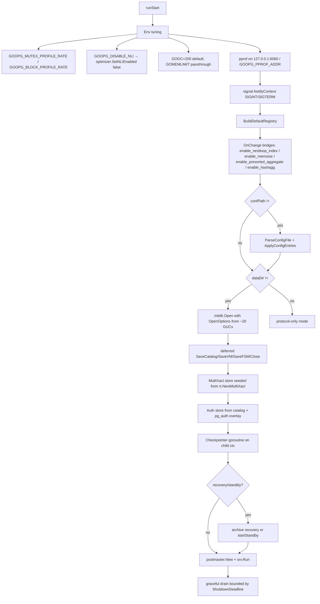
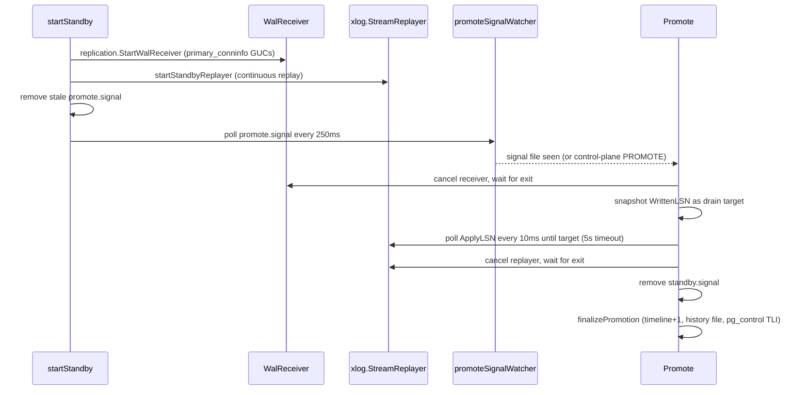

# Module: `cmd/goopg`

The goopg server binary — a single-process amalgam of what PostgreSQL splits
across `initdb`, `postmaster`, and `pg_ctl`. It exposes nine subcommands that
initialize a data directory, run the server in the foreground, drive an operator
control plane over a Unix socket, and run a streaming standby. Total package:
**2,916 LOC** across `main.go`, `standby.go`, and their two test files.

## Responsibilities

- **`init`** — bootstrap a data directory, mirroring upstream `initdb`
  flag-for-flag (locale, auth, checksums, `-c` GUC overrides).
- **`start`** — build the GUC registry from `postgresql.conf`, open the storage
  runtime, wire WAL/checkpointer/standby machinery, then hand off to
  `internal/postmaster`.
- **`stop` / `reload` / `checkpoint` / `promote` / `status`** — operator control
  plane: read the pidfile and send a one-line command over the control socket.
- **Standby** — walreceiver + WAL replay goroutines, promotion, `promote.signal`
  watcher.

## Key Files

| File                | LOC  | Role |
|---------------------|------|------|
| `main.go`           | 1,388 | CLI dispatch + subcommand implementations; `runStart` (`main.go:252`) is the server startup path. |
| `standby.go`        | 497   | Streaming-standby lifecycle and promotion: `standbyController`, `startStandby`, `Promote`, `finalizePromotion`, `promoteSignalWatcher`. |
| `main_test.go`      | 645   | CLI tests (`runRestart` is factored as `runRestartWithStarter` at `main.go:1154` so tests can inject a fake starter). |
| `standby_test.go`   | 386   | Promotion / drain / signal-watcher tests. |

## Public API / CLI surface

Dispatch: `main` → `run(args, stdout, stderr) int` (`main.go:82`), matching the
`subcommands` table (`main.go:66`). Exit 2 on unknown command, 0 on bare
invocation. Each subcommand uses its own `flag.FlagSet`; `-h` works per-subcommand.

```
goopg <command> [arguments]
  init       Initialize a data directory.
  start      Run the server in the foreground.
  stop       Request a graceful shutdown of a running server.
  restart    Stop the server and start it again.
  reload     Reload configuration without restarting.
  checkpoint Trigger a synchronous IMMEDIATE-speed checkpoint.
  promote    Promote a running standby to primary.
  status     Report whether a server is running and its high-level state.
  version    Print the goopg version and exit.
```

- **`init`** (`runInit`, `main.go:138`) — `-D`, `-U/--username`,
  `-X/--waldir`, `-N/--no-sync`, `--sync-only`, `--sync-method`,
  `--no-sync-data-files`, `-k/--data-checksums` (default ON, PG 18 parity),
  `-A/--auth` + `--auth-host/--auth-local/--pwfile`, the full locale family
  (`--locale-provider`, `--locale`, `--lc-*`, `--icu-locale`, `--icu-rules`,
  `--builtin-locale`), encoding, text-search config, and repeatable
  `-c/--set NAME=VALUE` (collected as `initdb.GUCSetting`).
- **`start`** (`runStart`, `main.go:252`) — `-D` (data dir; empty =
  protocol-only mode), `-config` / `-hba` (auto-discover
  `<datadir>/postgresql.conf` and `<datadir>/pg_hba.conf` when omitted),
  `-listen host:port` (default `127.0.0.1:5432`).
- **Control-plane commands** — `stop/reload/checkpoint/promote/status` take `-D`
  and an optional `-t` timeout; they parse the pidfile (`control.ParsePIDFile`)
  and send `STOP`, `STOPIMMEDIATE`, `RELOAD`, `CHECKPOINT`, `PROMOTE`, or `PING`
  over the socket (`control.Send`).
- **`stop`** — `-mode smart|fast|immediate` (default fast). `smart`/`fast` →
  graceful `STOP` (final checkpoint); `immediate` → `STOPIMMEDIATE` (skips the
  shutdown checkpoint).
- **`status`** — exit 0 running, **3** not running / stale pidfile, **4** alive
  but control socket unresponsive, 1 other error (pg_ctl parity).
- **`restart`** (`runRestart`) — stops then re-enters `runStart` in-process,
  injected via `runRestartWithStarter` for tests.

## Internal structure

### `runStart` startup sequence (`main.go:252-896`)



1. **Env tuning** — `GOOPG_MUTEX_PROFILE_RATE`/`GOOPG_BLOCK_PROFILE_RATE`
   activate pprof mutex/block sampling (off by default, ~1-2% overhead);
   `GOOPG_DISABLE_NLI=1|true` flips the planner's NLI kill-switch;
   `GOGC=200` is forced when unset (GC was ~20% of CPU at pgbench -c 100,
   GOGC=200 targets <10%); `GOMEMLIMIT` is passed through to the runtime.
2. **pprof HTTP endpoint** on `127.0.0.1:6060` (override `GOOPG_PPROF_ADDR`):
   `/debug/pprof/profile?seconds=30`, `/heap`, `/goroutine`, `/mutex`,
   `/block`.
3. **Signal handling** via `signal.NotifyContext(ctx, os.Interrupt, SIGTERM)`.
4. **GUC registry** — `misc.BuildDefaultRegistry()`; an `OnChange` bridge
   connects SQL `SET enable_*` to planner process-global switches:
   `enable_nestloop_index`→`SetNLIEnabled`, `enable_memoize`→`SetMemoizeEnabled`,
   `enable_presorted_aggregate`→`SetPresortedAggEnabled`, `enable_hashagg`→
   `SetHashAggEnabled`. `misc.ParseConfigFile` + `ApplyConfigEntries` when a
   config exists.
5. **Storage open** — `initdb.Open(...)` returns `*initdb.Runtime`, reading
   ~20 GUCs into `OpenOptions`: `pool_slots`, `wal_init_zero`,
   `wal_sender_memory_buffer`, `wal_buffers`, `wal_sync_method`, `fsync`,
   `min_wal_size`/`max_wal_size` (MB→bytes), `wal_writer_delay`,
   `bgwriter_delay`/`bgwriter_lru_maxpages`, `checkpoint_flush_after`,
   `bgwriter_flush_after`/`backend_flush_after`, `io_method`/`io_workers`/
   `io_max_concurrency`, `track_io_timing`, `transaction_buffers`,
   `commit_delay`/`commit_siblings`.
6. **Runtime wiring** — deferred `SaveCatalog`/`SaveVM`/`SaveFSM`/`Close`;
   AIO engine (with `io_uring` fallback detection logged as
   `event=aio_method_fallback`); WAL mem-ring / WAL-buffer capacity logs;
   MultiXact store seeded from `rt.NextMultiXact` (`multixact.NewStoreAt`) so
   the counter stays monotonic across restarts; `OnStopImmediate`;
   `SystemID`/`Timeline`; SyncRep priming.
7. **Auth/user store** — `auth.NewMapUserStore()` seeded from
   `catalog.InMemory.AllRoleStates()` + the optional `<datadir>/pg_auth` overlay.
8. **Checkpointer goroutine** on a child context (cancelled on exit).
9. **Recovery/standby branch** — archive recovery, or `startStandby`.
10. **Handoff** — `postmaster.New(cfg)` → `srv.Run(ctx)`; graceful drain bounded
    by `ShutdownDeadline`.

### Standby (`standby.go`)



`startStandby` (standby.go:92) launches the `xlog.StreamReplayer` via
`startStandbyReplayer` and `replication.StartWalReceiver` (with
`ApplyLSNFunc: standbyApplyLSNFunc(replayer)`). It clears any stale
`promote.signal` left by a previous run — a residual file would otherwise cause
an immediate promote on next start. `promoteSignalWatcher` polls
`promote.signal` every 250 ms (`promoteSignalPollInterval`).

`Promote` (standby.go:168) is the guarded promotion sequence:
1. Cancel the walreceiver so no new WAL records arrive.
2. Wait for the receiver goroutine to exit (no more Append calls into `rt.WAL`).
3. Snapshot the current `WrittenLSN` — the drain target.
4. Poll the replayer's `ApplyLSN` until it reaches the target (or `drainTimeout`
   = 5 s elapses; `drainPollInterval` = 10 ms).
5. Cancel the replayer and wait for it to exit.
6. Remove `<DataDir>/standby.signal` so a future restart comes up primary.

Promotion concurrency: `promoting` (atomic bool, CAS-guarded) rejects
concurrent PROMOTE with "already in progress"; `promoted` makes a second call a
no-op returning nil; a FAILED promote clears `promoting` so retry works
(promote.signal's "re-create the file to retry" contract). `finalizePromotion`
(standby.go:276) bumps the timeline, writes a history file, updates pg_control
TLI, and removes `standby.signal`. `promoteAfterRecovery` (standby.go:432) is a
near-identical promotion sequence for archive-recovery mode.

## Dependencies

- **Uses** `internal/initdb` (bootstrap + storage runtime), `internal/postmaster`
  (accept loop + control plane), `internal/utils/misc` (GUC registry),
  `internal/access/transam/{control,xlog,multixact}`, `internal/replication`
  (walreceiver), `internal/storage`, `internal/catalog`, `internal/libpq/auth`,
  `internal/optimizer` (planner flag bridges).
- **Used by** nothing — this is the process entrypoint; everything below it
  feeds in.

## Notable patterns / gotchas

- **`-D` empty on `start` = protocol-only mode** — no storage handles; the
  protocol-only paths of the postmaster are all that is reachable (embedded /
  test harnesses).
- **`-data-checksums` defaults ON** — PG 18 parity (commit 04bec894); there is
  no `-k`-to-disable unless explicitly passed.
- **Config auto-discovery is explicit** — `-config`/`-hba` fall back to
  `<datadir>/…` before built-in defaults (motivated by a silent-ignore bug: a
  `primary_conninfo` in postgresql.conf was silently ignored, the worst kind of
  "it just doesn't work").
- **Foreground-only model** — no daemonize/fork; `restart` re-enters `runStart`
  in-process; the CLI process becomes the server. Signals (SIGINT/SIGTERM)
  translate into the internal shutdown path.
- **Shutdown ladder** — graceful drain bounded by `ShutdownDeadline`; `stop
  immediate` bypasses it; `runStop` waits for process exit so a follow-up `start`
  doesn't race.
- **Cross-file sibling twins** — `standbyController.finalizePromotion`
  (`standby.go:276`) and `promoteAfterRecovery` (`standby.go:432`) are
  near-identical promotion sequences and must stay in sync.
- **Promote drain ordering is load-bearing** — steps 1+2 (cancel + wait on
  receiver) are mandatory BEFORE reading `WrittenLSN` as the drain target;
  otherwise a record that lands during step 3 would be counted but not waited
  for. Steps 1-2 are idempotent (receiver context stays cancelled, done channel
  stays closed) so retried promotion is safe.
- **AIO fallback is silent** — `io_uring` on a kernel that cannot honour it
  (sysctl-disabled, ENOSYS, EPERM under seccomp) drops to worker silently inside
  `aio.NewEngine`; the startup line logs `event=aio_method_fallback` so an
  operator can verify.
- **`min_wal_size`/`max_wal_size` unit mismatch** — stored in MB (matching
  upstream) but `wal.Config` wants bytes, so `runStart` multiplies by 1024².
- **GUC→planner bridges are process-wide** — `SET enable_nestloop_index` etc.
  from any session flips the package-level `atomic.Bool`; the most-recent SET
  wins process-wide (matches the flag design).
- **`gucFlag` defers `-c` errors** — a `-c` value lacking `=` records an error
  and surfaces it after parsing, matching initdb's "-c %s requires a value"
  wording rather than aborting flag parsing mid-stream.