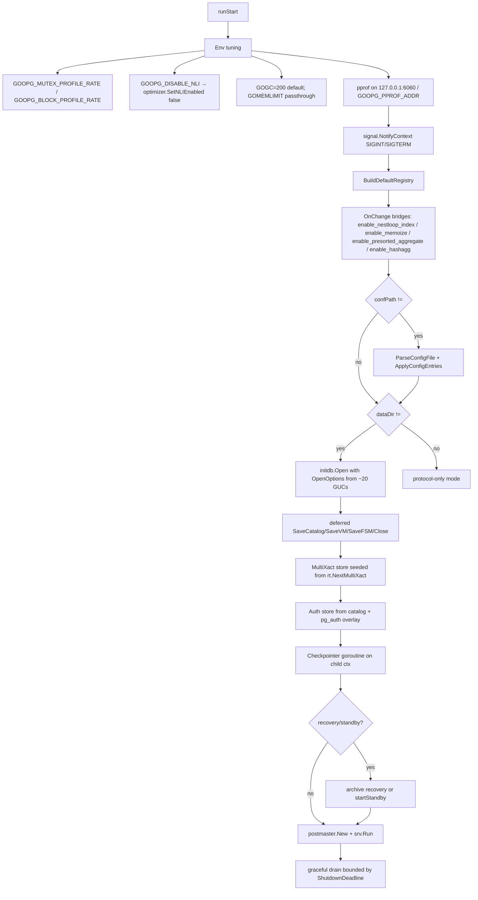
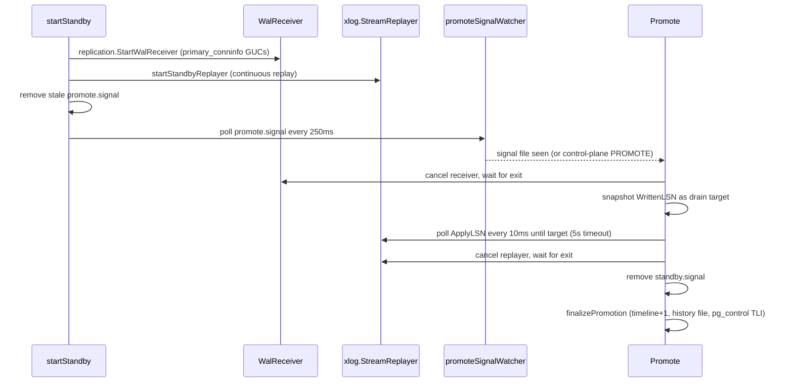
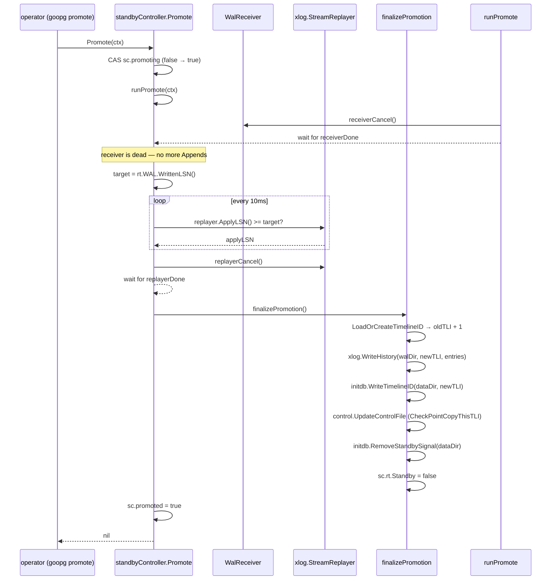
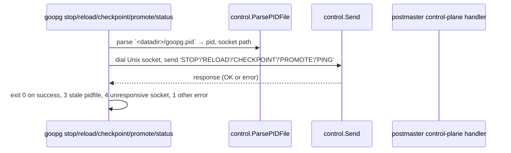

# Module: `cmd/goopg`

The goopg server binary — a single-process amalgam of what PostgreSQL splits
across `initdb`, `postmaster`, and `pg_ctl`. It exposes nine subcommands that
initialize a data directory, run the server in the foreground, drive an operator
control plane over a Unix socket, and run a streaming standby. Total package:
**2,916 LOC** across `main.go`, `standby.go`, and their two test files.

## Responsibilities

- **`init`** — bootstrap a data directory, mirroring upstream `initdb`
  flag-for-flag (locale, auth, checksums, `-c` GUC overrides).
- **`start`** — build the GUC registry from `postgresql.conf`, open the storage
  runtime, wire WAL/checkpointer/standby machinery, then hand off to
  `internal/postmaster`.
- **`stop` / `reload` / `checkpoint` / `promote` / `status`** — operator control
  plane: read the pidfile and send a one-line command over the control socket.
- **Standby** — walreceiver + WAL replay goroutines, promotion, `promote.signal`
  watcher.

## Key Files

| File                | LOC  | Role |
|---------------------|------|------|
| `main.go`           | 1,388 | CLI dispatch + subcommand implementations; `runStart` (`main.go:252`) is the server startup path. |
| `standby.go`        | 497   | Streaming-standby lifecycle and promotion: `standbyController`, `startStandby`, `Promote`, `finalizePromotion`, `promoteSignalWatcher`. |
| `main_test.go`      | 645   | CLI tests (`runRestart` is factored as `runRestartWithStarter` at `main.go:1154` so tests can inject a fake starter). |
| `standby_test.go`   | 386   | Promotion / drain / signal-watcher tests. |

## Constants

| Name | Value | Description |
|---|---|---|
| `drainPollInterval` | 10 ms | How often `Promote` checks the replayer's `ApplyLSN` during drain |
| `drainTimeout` | 5 s | Max wait for the replayer to catch up during promotion |
| `promoteSignalPollInterval` | 250 ms | How often the standby polls for `promote.signal` |

## Public API / CLI surface

Dispatch: `main` → `run(args, stdout, stderr) int` (`main.go:82`), matching the
`subcommands` table (`main.go:66`). Exit 2 on unknown command, 0 on bare
invocation. Each subcommand uses its own `flag.FlagSet`; `-h` works per-subcommand.

```
goopg <command> [arguments]
  init       Initialize a data directory.
  start      Run the server in the foreground.
  stop       Request a graceful shutdown of a running server.
  restart    Stop the server and start it again.
  reload     Reload configuration without restarting.
  checkpoint Trigger a synchronous IMMEDIATE-speed checkpoint.
  promote    Promote a running standby to primary.
  status     Report whether a server is running and its high-level state.
  version    Print the goopg version and exit.
```

### Subcommand function signatures

```go
// CLI dispatch
func run(args []string, stdout, stderr io.Writer) int
func notImplemented(name string, fs *flag.FlagSet, args []string, stderr io.Writer) int

// Subcommand implementations
func runInit(args []string, stdout, stderr io.Writer) int
func runStart(args []string, stdout, stderr io.Writer) int
func runStop(args []string, stdout, stderr io.Writer) int
func runRestart(args []string, stdout, stderr io.Writer) int
func runRestartWithStarter(args []string, stdout, stderr io.Writer, start func([]string, io.Writer, io.Writer) int) int
func runReload(args []string, stdout, stderr io.Writer) int
func runCheckpoint(args []string, stdout, stderr io.Writer) int
func runPromote(args []string, stdout, stderr io.Writer) int
func runStatus(args []string, stdout, stderr io.Writer) int
func runVersion(args []string, stdout, stderr io.Writer) int

// GUC helpers
func boolGUC(registry *misc.Registry, name string, fallback bool) bool
func stringGUC(registry *misc.Registry, name string, fallback string) string
func intGUC(registry *misc.Registry, name string, fallback int) int
func poolSlotsFromGUC(registry *misc.Registry) int

// Standby functions
func startStandbyReplayer(ctx context.Context, done chan struct{}, rt *initdb.Runtime, logger *slog.Logger) *xlog.StreamReplayer
func startStandby(parent context.Context, rt *initdb.Runtime, registry *misc.Registry, logger *slog.Logger) *standbyController
func standbyApplyLSNFunc(replayer *xlog.StreamReplayer) func() uint64
func boundPromoteToServer(sc *standbyController) func() error
func walDirFor(rt *initdb.Runtime) string
func promoteAfterRecovery(rt *initdb.Runtime, logger *slog.Logger) error
```

### Types

```go
type subcommand struct {
    name string
    run  func(args []string, stdout, stderr io.Writer) int
}

type gucFlag struct {
    settings []initdb.GUCSetting
    err      string
}
func (g *gucFlag) String() string
func (g *gucFlag) Set(v string) error  // NAME=VALUE, defers error for "no '='"

type standbyController struct {
    rt             *initdb.Runtime
    logger         *slog.Logger
    receiverCancel context.CancelFunc
    receiverDone   chan struct{}
    replayerCancel context.CancelFunc
    replayerDone   chan struct{}
    replayer       *xlog.StreamReplayer
    signalCancel   context.CancelFunc
    signalDone     chan struct{}
    promoting      atomic.Bool
    promoteErr     atomic.Pointer[error]
    promoted       atomic.Bool
}
func (sc *standbyController) Promote(ctx context.Context) error
func (sc *standbyController) runPromote(ctx context.Context) error
func (sc *standbyController) finalizePromotion() error
func (sc *standbyController) Close()
func (sc *standbyController) promoteSignalWatcher(ctx context.Context)
```

## Internal structure

### `runStart` startup sequence



### The GUC-to-planner bridges

`runStart` registers four `registry.OnChange` callbacks that bridge SQL `SET`
commands to process-global atomic switches:

| GUC | Bridge target | Default |
|---|---|---|
| `enable_nestloop_index` | `optimizer.SetNLIEnabled` | on |
| `enable_memoize` | `optimizer.SetMemoizeEnabled` | on |
| `enable_presorted_aggregate` | `optimizer.SetPresortedAggEnabled` | on |
| `enable_hashagg` | `optimizer.SetHashAggEnabled` | on |

The most-recent SET wins process-wide, matching the `atomic.Bool` design.

### Storage OpenOptions derived from GUCs

The ~20 GUC-to-`OpenOptions` mappings:

| GUC | `OpenOptions` field | Default |
|---|---|---|
| `shared_buffers` → `poolSlotsFromGUC` | `PoolSlots` | 16384 |
| `wal_init_zero` | `WALInitZero` | true |
| `wal_sender_memory_buffer` | `WALSenderMemoryBuffer` | 16 MiB |
| `wal_buffers` | `WALBuffers` | 16 MiB |
| `wal_sync_method` | `WALSyncMethod` | `"fdatasync"` |
| `fsync` | `FsyncDisabled` | true (enabled) |
| `min_wal_size` (MB→bytes) | `WALMinSize` | 80 MB |
| `max_wal_size` (MB→bytes) | `WALMaxSize` | 1024 MB |
| `wal_writer_delay` | `WalWriterDelay` | 200 ms |
| `bgwriter_delay` | `BgwriterDelay` | 200 ms |
| `bgwriter_lru_maxpages` | `BgwriterMaxPages` | 100 |
| `checkpoint_flush_after` | `CheckpointFlushAfter` | 32 |
| `bgwriter_flush_after` | `BgwriterFlushAfter` | 64 |
| `backend_flush_after` | `BackendFlushAfter` | 0 |
| `io_method` | `AIOMethod` | `""` |
| `io_workers` | `AIOWorkers` | 0 |
| `io_max_concurrency` | `AIOMaxConcurrency` | 0 |
| `track_io_timing` | `TrackIOTiming` | false |
| `transaction_buffers` | `TransactionBuffers` | 0 |
| `commit_delay` | `CommitDelayUs` | 0 |
| `commit_siblings` | `CommitSiblings` | 5 |

### Standby mode



### Promotion drain sequence



### Control-plane command sequence



## Key flow: `goopg stop -mode fast`

1. `runStop` parses `-D` and `-t timeout` (default 60 s), `-mode` (default `fast`).
2. `control.ParsePIDFile(dataDir)` reads the pidfile, returns the socket path and the server PID.
3. For `fast`/`smart` mode, sends `STOP` over the Unix socket. For `immediate`, sends `STOPIMMEDIATE`.
4. Waits for the process to exit (poll every 250 ms up to the timeout).
5. Returns 0 on clean exit, non-zero if the process did not exit in time.

## Dependencies

- **Uses** `internal/initdb` (bootstrap + storage runtime), `internal/postmaster` (accept loop + control plane), `internal/utils/misc` (GUC registry), `internal/access/transam/{control,xlog,multixact}`, `internal/replication` (walreceiver), `internal/storage`, `internal/catalog`, `internal/libpq/auth`, `internal/optimizer` (planner flag bridges).
- **Used by** nothing — this is the process entrypoint; everything below it feeds in.

## Notable patterns / gotchas

- **`-D` empty on `start` = protocol-only mode** — no storage handles; the protocol-only paths of the postmaster are all that is reachable (embedded / test harnesses).
- **`-data-checksums` defaults ON** — PG 18 parity (commit 04bec894); there is no `-k`-to-disable unless explicitly passed.
- **Config auto-discovery is explicit** — `-config`/`-hba` fall back to `<datadir>/…` before built-in defaults (motivated by a silent-ignore bug: a `primary_conninfo` in postgresql.conf was silently ignored, the worst kind of "it just doesn't work").
- **Foreground-only model** — no daemonize/fork; `restart` re-enters `runStart` in-process; the CLI process becomes the server. Signals (SIGINT/SIGTERM) translate into the internal shutdown path.
- **Shutdown ladder** — graceful drain bounded by `ShutdownDeadline`; `stop immediate` bypasses it; `runStop` waits for process exit so a follow-up `start` doesn't race.
- **Cross-file sibling twins** — `standbyController.finalizePromotion` (`standby.go:276`) and `promoteAfterRecovery` (`standby.go:432`) are near-identical promotion sequences and must stay in sync.
- **Promote drain ordering is load-bearing** — steps 1+2 (cancel + wait on receiver) are mandatory BEFORE reading `WrittenLSN` as the drain target; otherwise a record that lands during step 3 would be counted but not waited for. Steps 1-2 are idempotent (receiver context stays cancelled, done channel stays closed) so retried promotion is safe.
- **AIO fallback is silent** — `io_uring` on a kernel that cannot honour it (sysctl-disabled, ENOSYS, EPERM under seccomp) drops to worker silently inside `aio.NewEngine`; the startup line logs `event=aio_method_fallback` so an operator can verify.
- **`min_wal_size`/`max_wal_size` unit mismatch** — stored in MB (matching upstream) but `wal.Config` wants bytes, so `runStart` multiplies by 1024².
- **GUC→planner bridges are process-wide** — `SET enable_nestloop_index` etc. from any session flips the package-level `atomic.Bool`; the most-recent SET wins process-wide (matches the flag design).
- **`gucFlag` defers `-c` errors** — a `-c` value lacking `=` records an error and surfaces it after parsing, matching initdb's "-c %s requires a value" wording rather than aborting flag parsing mid-stream.
- **Stale `promote.signal` is cleared at standby startup** — `startStandby` removes any residual `promote.signal` before the watcher starts; a leftover file from a previous run would otherwise cause an immediate promote on the next start.
- **Promote retry after failure** — `Promote` uses `CAS(promoting, false, true)` as a guard. On failure, `promoting` is cleared (deferred `Store(false)`) so the operator can retry. On success, `promoted` is set to `true` and subsequent calls return nil (no-op).
- **`startStandbyReplayer` anchors at WrittenLSN+1** — the `RecordIterator` start position is `writtenLSN + 1` because `WrittenLSN` is the last byte written, and the iterator expects the next record's first byte.

## runInit flag reference

| Flag | Short | Default | Description |
|---|---|---|---|
| `-D` | — | (required) | Data directory path |
| `-U` / `--username` | `-U` | `"postgres"` | Bootstrap superuser name |
| `-X` / `--waldir` | `-X` | `""` | External WAL directory (absolute path) |
| `-N` / `--no-sync` | `-N` | false | Skip final fsync |
| `-S` / `--sync-only` | `-S` | false | Only sync an existing directory |
| `--sync-method` | — | `"fsync"` | `"fsync"` or `"syncfs"` |
| `--no-sync-data-files` | — | false | Don't sync per-database files |
| `-T` / `--text-search-config` | `-T` | `""` | Default text search config |
| `-E` / `--encoding` | `-E` | `""` (UTF8) | Default database encoding |
| `-g` / `--allow-group-access` | `-g` | false | Relax permissions to 0750/0640 |
| `-k` / `--data-checksums` | `-k` | true | Enable data page checksums (PG 18 default) |
| `--no-data-checksums` | — | false | Override `-k` to disable checksums |
| `-A` / `--auth` | `-A` | `"trust"` | Auth method for both host and local |
| `--auth-host` | — | `"trust"` | Auth method for host connections |
| `--auth-local` | — | `"trust"` | Auth method for local connections |
| `--pwfile` | — | `""` | Read superuser password from file |
| `--locale-provider` | — | `"libc"` | Locale provider (`libc`/`builtin`) |
| `--locale` | — | `""` | Default locale |
| `--lc-*` | — | `""` | Per-category locale overrides |
| `--builtin-locale` | — | `""` | Builtin provider locale |
| `--icu-locale` / `--icu-rules` | — | `""` | ICU locale (rejected — not supported) |
| `-c` / `--set` | `-c` | `""` | NAME=VALUE GUC override (repeatable) |

## runStart flag reference

| Flag | Default | Description |
|---|---|---|
| `-D` | `""` | Data directory (empty = protocol-only mode) |
| `--config` | `""` | Path to postgresql.conf (auto-discovered from `-D`) |
| `--listen` | `127.0.0.1:5432` | TCP listen address |
| `--hba` | `""` | Path to pg_hba.conf (auto-discovered from `-D`) |

## `runStatus` exit codes

| Exit code | Meaning |
|---|---|
| 0 | Server is running and responding |
| 3 | Not running (stale pidfile / no pidfile) |
| 4 | Alive but control socket unresponsive |
| 1 | Other error (socket dial, pidfile parse) |

## Control-plane socket protocol

The control socket (`<datadir>/.goopg.ctl.sock`) is a Unix datagram socket.
Commands are one-line strings:

| Command | Effect |
|---|---|
| `STOP` | Graceful shutdown (smart/fast — final checkpoint) |
| `STOPIMMEDIATE` | Immediate shutdown (skip final checkpoint) |
| `RELOAD` | SIGHUP-equivalent: reload config |
| `CHECKPOINT` | Trigger synchronous IMMEDIATE checkpoint |
| `PROMOTE` | Promote standby to primary |
| `PING` | Health check — server responds with `OK` |

The `control.Send` function (from `internal/access/transam/control`) dials the
socket, sends the command, and reads the response. The timeout is controlled
by `-t` (default 60 s).

## Signal handling in runStart

`runStart` registers a `signal.NotifyContext` for `SIGINT` and `SIGTERM`:

```go
ctx, cancel := signal.NotifyContext(context.Background(), os.Interrupt, syscall.SIGTERM)
```

Both signals translate into the same internal shutdown path (the context is
cancelled, which propagates to the postmaster's `Run(ctx)`, which drains
connections and shuts down). There is no distinction between SIGINT and SIGTERM
in goopg — unlike upstream PG where SIGINT cancels the current query and SIGTERM
shuts down. The `stop immediate` command via the control socket produces the
same effect as SIGQUIT upstream (skip the shutdown checkpoint), which is how
`STOPIMMEDIATE` is dispatched.

## The `runStop` sequence

1. `control.ParsePIDFile(dataDir)` reads the pidfile, extracting the PID and
   the control socket path. The pidfile format is `cat > $PGDATA/goopg.pid
   <<EOF\n<PID>\n<socket-path>\n<start-time>\nEOF`.
2. If the parsed PID is the current process, `runStop` exits with an error
   ("cannot stop self").
3. Sends the command string over the control socket (`control.Send`).
4. Waits for the process to exit: polls `os.FindProcess(pid).Signal(0)` every
    250 ms up to the `-t` timeout (default 60 s).

## The `runRestart` sequence

`runRestart` (main.go:1143) stops then re-enters `runStart` in-process:

1. Sends `STOP` (or `STOPIMMEDIATE` for `-mode immediate`) over the control socket via `control.Send` to stop the running server.
2. If the stop succeeded (exit 0), calls `runStart` with the same arguments
   (minus the `restart` subcommand).
3. The `runStart` calls `initdb.Open`, which is safe because the previous
   stop performed a clean shutdown checkpoint.

For testing, `runRestartWithStarter` (main.go:1154) injects a fake starter
function so tests can verify the stop→start sequence without actually running
a server.

## The `runCheckpoint` sequence

`runCheckpoint` (main.go:1261) sends `CHECKPOINT` over the control socket:

1. `control.ParsePIDFile(dataDir)` — reads the pidfile.
2. `control.Send(socketPath, "CHECKPOINT")` — sends the command and waits
   for the response.
3. Returns 0 on success, 1 on error.

The checkpoint is synchronous: the server calls `Checkpointer.CheckpointNow()`
with IMMEDIATE speed, writes the checkpoint record to WAL, and responds with
`OK` when done.

## The `runPromote` sequence

`runPromote` (main.go:1302) sends `PROMOTE` over the control socket:

1. `control.ParsePIDFile(dataDir)` — reads the pidfile.
2. `control.Send(socketPath, "PROMOTE")` — sends the command and waits for
   the response.
3. The server's `standbyController.Promote(ctx)` runs the drain sequence
   (cancel receiver, wait for replay drain, bump timeline, remove
   standby.signal).
4. Returns 0 on success, 1 on error ("standby promotion failed").

## The `runReload` sequence

`runReload` (main.go:1222) sends `RELOAD` over the control socket:

1. `control.ParsePIDFile(dataDir)` — reads the pidfile.
2. `control.Send(socketPath, "RELOAD")` — sends the command.
3. The server re-reads `postgresql.conf` (`misc.ParseConfigFile` +
   `registry.ApplyConfigEntries`) and applies changes live.
4. Returns 0 on success, 1 on error.

## Env-var reference

| Env var | Effect |
|---|---|
| `GOOPG_MUTEX_PROFILE_RATE` | Enable pprof mutex sampling (1 = every contention event) |
| `GOOPG_BLOCK_PROFILE_RATE` | Enable pprof block sampling |
| `GOOPG_DISABLE_NLI` | `1`/`true` disables the nestloop-index-join promotion |
| `GOOPG_PPROF_ADDR` | Override pprof listen address (default `127.0.0.1:6060`) |
| `GOOPG_LOG_STATEMENT` | Per-statement query logging (`none`/`ddl`/`mod`/`all`) |
| `GOGC` | GC target (default 200 when unset) |
| `GOMEMLIMIT` | Passed through to the Go runtime |

## `boolGUC`/`stringGUC`/`intGUC` helpers

```go
func boolGUC(registry *misc.Registry, name string, fallback bool) bool {
    if registry == nil {
        return fallback
    }
    return registry.Get(name).Bool()
}
```

The three typed GUC accessors read a value from the registry with a fallback
for a missing GUC or a nil registry (protocol-only mode). They are used to
derive the ~20 `OpenOptions` fields from `postgresql.conf` GUCs. A nil
registry returns the fallback, keeping protocol-only mode fully functional.

## `poolSlotsFromGUC`

```go
func poolSlotsFromGUC(registry *misc.Registry) int {
    // shared_buffers GUC is in MB; convert to slots at 8 KB per page.
    // Default 128 MB → 16384 slots.
}
```

`shared_buffers` is stored in MB (matching upstream); `OpenOptions.PoolSlots`
is in buffer-pool slots (each 8 KB). The conversion multiplies by
`1024*1024 / 8192`. A nil registry or unset GUC returns the 16384-slot
default. This is one of the two unit-conversion sites in `runStart` (the
other is `min_wal_size`/`max_wal_size` MB→bytes).
5. Returns 0 on clean exit, 1 on timeout.