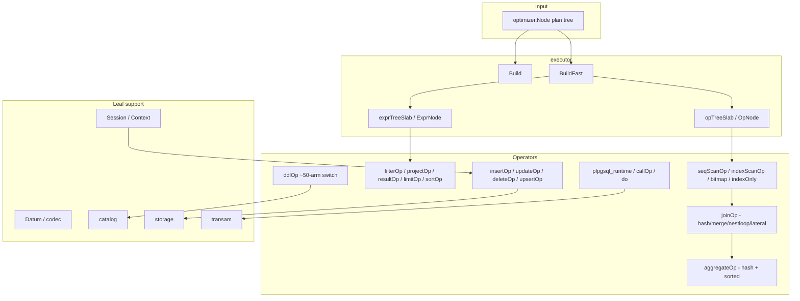
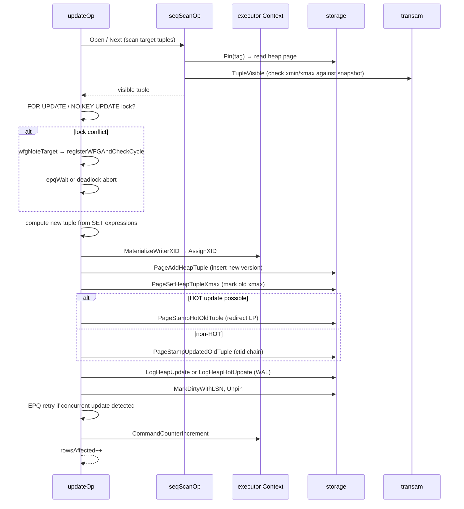
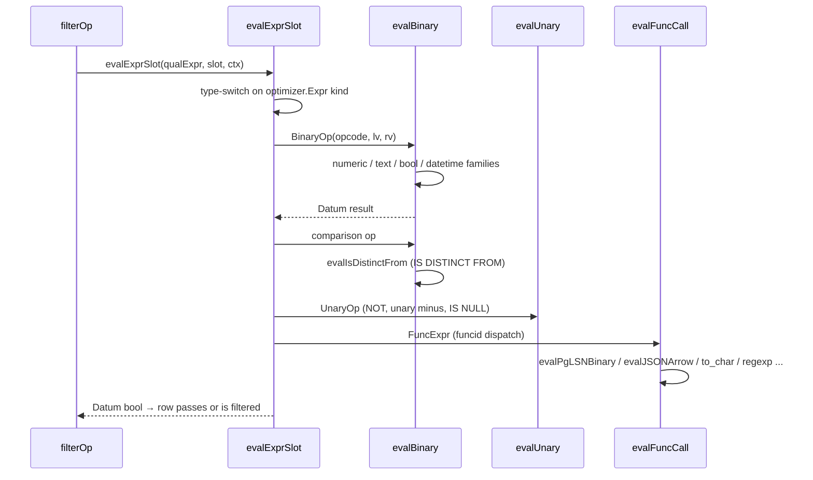

# Module: `internal/executor`

The execution engine. Runs goopg's plan trees (`optimizer.Node`) with a
PostgreSQL-style Volcano iterator model (`Open → Next → EOF → Close`). It
compiles plan nodes into operators (seq/index scan, filter, project, join, agg,
sort, limit, DML, DDL, utility), evaluates expressions over per-row `Datum`
values, drives the MVCC heap-write/stamp machinery for INSERT/UPDATE/DELETE, and
executes stored routines (PL/pgSQL, SQL-language, C-stub, `internal`), `CALL` /
`DO`, triggers, and the VACUUM/ANALYZE/checkpoint/transaction verbs.

There are **two sibling engines**: a legacy `Build`/`Run` producing an
`Operator` tree, and a GC-pointer-free fast path `BuildFast`/`BuildFastIterator`
over flat int32-indexed slabs. The fast path is the live server entry point
(`postmaster/dispatch.go:3398`).



## Key Files

| File | LOC | Role |
|---|---|---|
| `operators_ddl.go` | 27,132 | `ddlOp`, one ~50-arm `Next` switch over every parser DDL statement; catalog heap sync, physical-file relocation |
| `expr.go` | 21,177 | Interpreted evaluator `evalExprSlot` + every SQL builtin body (to_char, regexp, extract, casts, interval/time arithmetic, subqueries, geometric/network types) |
| `operators_storage.go` | 9,999 | `seqScanOp`/`insertOp`/`updateOp`/`deleteOp`: heap writes, HOT updates, xmax stamping, EPQ retry chains, unique/exclusion checks, WFG (wait-for-graph) |
| `operators_join_agg.go` | 4,987 | `joinOp` (lazy hash / merge / nested-loop / lateral), `aggregateOp` (hash + sorted grouping, user sfunc dispatch) |
| `plpgsql_runtime.go` | 3,752 | Stored-routine dispatch by language + PL/pgSQL statement interpreter (`executePLpgSQLStmt`) |
| `operators_explain.go` | 2,526 | `explainOp` — EXPLAIN output |
| `codec.go` | 2,510 | Row encode/decode (`EncodeRowPG`, `DecodeRowInto`), datum serialization |
| `operators_lockrows.go` | 2,416 | `lockRowsOp` — SELECT … FOR UPDATE/SHARE |
| `operators_fk.go` | 2,045 | Foreign-key enforcement (RI checks, deferred FK) |
| `context.go` | 1,930 | The per-statement `Context` struct, `NewContext`, `CommitTransaction`, lock helpers |
| `operators_upsert.go` | 1,797 | `upsertOp` — INSERT … ON CONFLICT |
| `copy_text.go` | 1,676 | COPY text/CSV/binary parse+emit |
| `operators_ddl_partition.go` | 1,364 | Partition DDL (`execAlterTablePartition*`) |
| `operators.go` | 1,337 | `valuesOp`, `projectOp`, `resultOp`, `filterOp`, `limitOp`, `sortOp` |
| `operators_window.go` | 1,224 | `windowOp` — window functions |
| `operators_sequence.go` | 1,151 | Sequence ops (`nextval`, `setval`, virtual sequence tables) |
| `session.go` | 1,092 | `Session` interface (`BasicSession`, `NewAutocommitUndoSession`): txn state, savepoints, DDL undo, deferred checks |
| `operators_merge.go` | 1,067 | `mergeOp` — MERGE |
| `operators_analyze.go` | 1,044 | `analyzeOp` — ANALYZE, stats collection |
| `operators_indexonly.go` | 1,020 | `indexOnlyScanOp` |
| `operators_bitmap.go` | 1,012 | `bitmapIndexScanOp`, `bitmapHeapScanOp`, `bitmapAndOp`, `bitmapOrOp` |
| `applyworker.go` | 963 | Logical replication apply worker |
| `opnode.go` | 927 | Fast-path operator tree `OpNode`/`opTreeSlab`, `Slot`, `OpIterator`, `opOpen`/`opNext` dispatch |
| `datum.go` | 890 | 48-byte `Datum` value carrier, `DatumKind`/`TimeSubtype` |
| `executor.go` | 680 | `Build`/`BuildFast` dispatch (`optimizer.Node` → operator/slab) |
| `exprnode.go` | 592 | Compiled expression tree `ExprNode`/`exprTreeSlab` + `evalFastExpr` |
| `hashsize/` | — | Leaf package: hash-join geometry (`nbuckets`/`nbatch`), shared by planner and executor |
| `kvcache/` | — | Leaf package: byte-budgeted LRU backing correlated-subquery caches |

Other operator files: `operators_cluster.go` (CLUSTER), `operators_reindex.go`
(REINDEX), `operators_vacuum.go` (VACUUM), `operators_tx.go` (BEGIN/COMMIT/
ROLLBACK/savepoints, `transactionOp`, `setTransactionOp`, `setConstraintsOp`),
`operators_call.go` (CALL), `operators_gather.go`/`operators_gather_merge.go`
(parallel query), `operators_nljoin.go` (`nestedLoopIndexJoinOp`),
`operators_recursive_cte.go` (recursive UNION, `recursiveUnionOp`,
`workTableScanOp`), `operators_cte_dml.go` (DML CTEs), `operators_setop.go`
(UNION/INTERSECT/EXCEPT), `operators_distinct.go` (DISTINCT/DISTINCT ON),
`operators_material.go`, `operators_memoize.go`, `operators_project_set.go`,
`operators_ordinality.go`, `operators_rowsfrom`, `operators_generate_series.go`,
`operators_ts_token_type.go`, `operators_pg_*` (many system-function operators),
`instrument.go` (EXPLAIN ANALYZE instrumentation).

## Public API

Entry points (`executor.go`, `opnode.go`):

```go
func Build(plan optimizer.Node) (Operator, error)          // legacy builder
func BuildWorker(plan optimizer.Node) (Operator, error)    // parallel worker path
func BuildFast(plan optimizer.Node) (*opTreeSlab, int32, error)
func BuildFastIterator(plan optimizer.Node) (*OpIterator, error) // live dispatch path
func Run(op Operator, ctx *Context) ([]Row, error)         // test/drain helper
func RunFast(tree *opTreeSlab, rootIdx int32, ctx *Context) ([]Row, error)
```

Interfaces and core types:

```go
type Operator interface { Open(ctx *Context) error; Next() (TupleSlot, error);
                          Close() error; Schema() optimizer.Schema }
type RowCounter interface { RowsAffected() int64 }         // feeds "INSERT 0 N" tags
var EOF, ErrSelfTerminate
type Context struct{ /* per-statement state */ }           // NewContext() *Context
type Datum struct{ /* 48-byte value carrier */ }
type Row []Datum
type ExecError struct { Code, Message, Detail, Hint, Context string; Pos int;
                        ConditionName string }              // SQLSTATE carrier
type Session interface{ /* isolation, savepoints, DDL undo, deferred checks */ }
type OpKind uint8 // OpInvalid, OpSeqScan, OpFilter, OpProject, OpLimit, OpUpdate,
                  // OpDelete, OpSort, OpInsert, OpJoin, OpBitmap*, OpAdapter
type Slot struct{ Cells []Datum; schema optimizer.Schema; ... }
type OpIterator struct{ /* fast path iterator handle */ }
type OpNode struct{ Kind OpKind; State unsafe.Pointer; Children [2]int32; ... }
```

Key `Context` methods: `CommandCounterIncrement`, `SetCmdCounter`,
`GetCurrentCommandId`, `CommitTransaction`, `AddNotice`/`TakeNotices`,
`AddWarning`/`TakeWarnings`, `acquireRelLock`, `acquireTupleLock`,
`tryAcquireRelLock`, `acquireDDLLockTxn`, `acquireScanReadLockTxn`,
`acquireWriteLockTxn`, `waitForRelationLockers`, `MaterializeWriterXID`,
`DidWrite`, `SetParamExec`, `ResetCommandCounter`, `comboStore`,
`SessionUserName`, `EffectiveUserName`, `deadlockTimeout`.

`Datum` kind constants (`datum.go`): `KindNull`, `KindBool`, `KindInt`,
`KindString`, `KindBytes`, `KindTime`, `KindInterval`, `KindNumeric`,
`KindToastPointer`, `KindEnum`. `TimeSubtype` distinguishes `TimeSubtypeDate`,
`TimeSubtypeTime`, `TimeSubtypeTimetz`, `TimeSubtypeTimestamp`,
`TimeSubtypeTimestamptz` within the `KindTime` carrier.

## Internal structure

### Two engines

- **`Build`** recursively constructs an `Operator` tree (`buildNode`) for every
  plan node type; each `new<PlanType>Op` returns an unexported `<lower>Op`
  struct implementing the `Operator` interface.
- **`BuildFast`** builds an `opTreeSlab` (flat `[]OpNode` with int32 child
  indices) plus a parallel `exprTreeSlab`. Non-migrated ops are wrapped in an
  `OpAdapter` forwarding the legacy interface. `BuildFastIterator` is what
  dispatch actually calls.

### Operator inventory

Scan/project/sort core (`operators.go`):

```go
type valuesOp struct{}     // VALUES rows
type projectOp struct{}    // projection list
type resultOp struct{}     // zero-row source (e.g. SELECT without FROM)
type filterOp struct{}     // WHERE
type limitOp struct{}      // LIMIT/OFFSET
type sortOp struct{}       // ORDER BY
```

Storage DML (`operators_storage.go`):

```go
type seqScanOp struct{}    // sequential scan (heap, virtual catalogs, sequences)
type insertOp struct{}     // INSERT
type updateOp struct{}     // UPDATE (HOT / non-HOT, xmax stamping)
type deleteOp struct{}     // DELETE
```

Joins & aggregates (`operators_join_agg.go`):

```go
type joinOp struct{}       // join strategies: merge, lazy hash, nested loop, lateral
type aggregateOp struct{}  // hash + sorted grouping, user sfunc dispatch
type groupRuntime struct{} // per-group execution state
type aggRuntime struct{}   // per-aggregate accumulator
```

DDL (`operators_ddl.go`):

```go
type ddlOp struct{ plan *optimizer.DDL }
func (o *ddlOp) Next() (TupleSlot, error)  // ~50-arm switch over DDL statement types
// arms: execCreateTable, execCreateIndex, execCreateView, execCreateSchema,
// execCreateExtension, execCreateTablespace, execCreateCollation,
// execCreatePublication, execCreateSubscription, execCreateEventTrigger,
// execCreateAccessMethod, execDoBlock, execAlter* … each an exec* method
```

### Expression evaluation (`expr.go`, `exprnode.go`)

```go
func evalExpr(e optimizer.Expr, row Row, ctx *Context) (Datum, error)
func evalExprSlot(e optimizer.Expr, slot SlotView, ctx *Context) (Datum, error)
func evalBinary(op parser.OpCode, left, right Datum, pos int, ctx *Context) (Datum, error)
func evalUnary(op parser.OpCode, d Datum, pos int) (Datum, error)
func evalIsDistinctFrom(lv, rv Datum, negated bool) (Datum, error)
// builtins: evalPgLSNBinary, evalJSONArrow, evalJSONPathGet, evalLikeEscapePattern,
// matchSQLLike, parse*Literal/CanonicalText for point/box/circle/line/lseg/path/
// polygon/macaddr/macaddr8, plus to_char/regexp/extract families
```

### DDL dispatch

The `ddlOp.Next()` switch handles every parser DDL statement, routing each to
an `exec*` method that:
1. Validates/resolves arguments (owners, handlers, collations, opclasses) via
   `catalog` + `Routines` lookups (`resolveNewOwnerOID`, `resolveAccessMethodHandlerFunc`,
   `resolveFDWHandlerFunc`, `resolveEventTriggerFunc`).
2. Mutates the in-memory catalog (`CreateTable`, `CreateIndex`, `Register*`,
   `Drop*`, `Rename*`).
3. Persists via `syncTableToCatalogHeap` (the sibling renderer).
4. Handles physical-file work where needed (`relocateRelationPhysicalFile`,
   `swapRelationPhysicalFile` for `ALTER TABLE SET TABLESPACE`).

### EPQ (EvalPlanQual)

Concurrently-updated tuples trigger EvalPlanQual retries:

```go
func epqRetryLimit(iso transam.IsolationLevel) int
func epqWait(ctx *Context, xmax storage.TransactionID) (deadlock bool, timeout *ExecError)
func epqRecheckVisible(ctx *Context, rel, blk, slot) (bool, error)
func epqXmaxSettled(ctx *Context, xmax) (aborted, committed bool)
func epqSerializationErr(ctx *Context, rel, blk, slot, pos) *ExecError
func epqFollowHOT(ctx *Context, rel, blk, slot) …
func epqFollowChain(ctx *Context, rel, blk, slot) …
func epqFollowChainFull(ctx *Context, rel, blk, slot) …
func epqChainPendingWriter(ctx *Context, rel, blk, slot) …
func epqRefreshSnapForRetry(ctx *Context)
func epqSlotMovedToAnotherPartition(ctx *Context, rel, blk, slot) …
func epqChainCheckMovedPartition(ctx *Context, rel, blk, slot) …
func epqChainTailLiveButUnseen(ctx *Context, rel, blk, slot) …
func stampOldCtid(ctx *Context, rel, blk, slot, ctid) …
```

The retry follows HOT chains and CTID chains across concurrent writers,
refreshing the snapshot (`epqRefreshSnapForRetry`) and re-checking visibility.
Serializable conflicts surface as `epqSerializationErr` (40001). The chain walk
supports cross-partition moves (`epqSlotMovedToAnotherPartition`) and tail
detection (`epqChainTailLiveButUnseen`).

### Wait-for-graph (WFG)

`operators_storage.go` also owns the cross-session wait-for-graph for tuple
lock conflicts:

```go
func wfgNoteTarget(xid, rel, blk, slot, hdr)
func registerWFGAndCheckCycle(myXID, blockingXID) bool
func dumpWFGCycle(myXID, blockingXID)
func deregisterWFG(myXID)
func waitPgClassInplaceXID(ctx, blockingXID) (deadlock bool, timeout *ExecError)
```

`registerWFGAndCheckCycle` returns true on a detected cycle (deadlock) so the
caller aborts; `dumpWFGCycle` prints the edge chain for diagnostics.

### Session / transaction state (`session.go`)

`Session` interface:

```go
type Session interface {
    SetIsolationLevel(l transam.IsolationLevel) error
    IsolationLevel() transam.IsolationLevel
    InExplicitTransaction() bool
    TracksDDLUndo() bool
    IsReadOnlyTxn() bool / SetReadOnlyTxn(v bool)
    BeginExplicitTransaction(tx, snap)
    EndExplicitTransaction()
    CmdCounter() *CommandCounter
    AddDeferredFKCheck(check DeferredFKCheck) / TakeDeferredFKChecks()
    AddDeferredUniqueCheck(check DeferredUniqueCheck) / TakeDeferredUniqueChecks()
    AddDeferredExclusionCheck(check DeferredExclusionCheck) / TakeDeferredExclusionChecks()
    PushSavepoint(name, snap, subXid) / ReleaseSavepoint(name) / RollbackToSavepoint(name, …)
    RegisterOnCommitAction(relOID, action) / OnCommitActions()
    EffectiveWriterXID() storage.TransactionID
    IsTransactionFailed() bool
}
```

DDL undo structures: `DDLUndoEntry`, `DDLDropUndoEntry`, `PendingIndexDrop`,
`PendingPartitionAttach`, `PendingInheritanceChange`, `PendingTableDrop`,
`DeferredRoutineDrop`, `TruncateUndoEntry`, `SeqRestoreEntry`, `OnCommitAction`.
`NewAutocommitUndoSession` enables undo tracking even outside explicit
transactions (used by the standalone statement path).

### Deferred constraint checks

The session accumulates deferred FK/unique/exclusion checks and replays them at
COMMIT (`TakeDeferredFKChecks`, `TakeDeferredUniqueChecksStmtEnd`,
`TakeDeferredExclusionChecksMatching`). `SetConstraintsAll`/`SetConstraintsNamed`
mirror `SET CONSTRAINTS`. NOT NULL deferred checks (`DeferredNNDKeyCol`) are
also tracked.

### Datum type system

`Datum` is a 48-byte value carrier with an inline int64 (`Int`), int16 (`Scale`),
uint16 flags (`Flags`), and a pointer/generic union (`Buf`/`Ptr`). The `DatumKind`
discriminates the SQL type. Time values use `TimeSubtype` to distinguish the five
PG temporal types within a single `KindTime` carrier. `KindNumeric` has two modes:
fast-path (int64 mantissa + scale) and big-mantissa (arbitrary precision via mctx
arena). `KindEnum` stores both the sort-order float64 and the display label.

## Key flow: UPDATE execution



## Dependencies

- **Used by** `internal/postmaster` (wire protocol), `internal/replication`,
  `internal/backup`, `internal/initdb`, `internal/access/nbtree`,
  `internal/catalog`, `internal/storage`, `internal/parser/analyzer`.
- **Uses** `internal/optimizer` (plan node types — direction is executor →
  optimizer), `internal/parser`, `internal/catalog`, `internal/storage`,
  `internal/access/{nbtree,transam,common/pglz,amcheck}`,
  `internal/utils/{mmgr,misc,activity,adt/*}`, `internal/pl/plpgsql`,
  `internal/commands/vacuum`, `internal/nodes`, plus leaf `hashsize`/`kvcache`.

## Notable patterns / gotchas

- **Sibling evaluators must agree** — `evalExprSlot` and `evalFastExpr` are
  documented twins with past divergences (float arithmetic, AND/OR short-circuit
  gated on `Kind == KindBool`, int2/int4 overflow). Same for `Build` vs
  `BuildFast.buildRec`.
- **Slot lifetime contract** — producer slots are stable only until the next
  `Next`; consumers that retain must call `Materialize()`.
- **`hashsize` import invariant is load-bearing** — violating it introduces an
  `optimizer → executor` cycle.
- **Context copied by value** at FK/partition-DDL sites — hence `tempFiles` must
  be a pointer.
- **Command counter** — per-statement `CmdID`; `CommandCounterIncrement` before
  execution mirrors PG's per-statement CCI.
- **`Datum` subtype discipline** — `KindTime` carries five SQL types via
  `TimeSubtype`; forgetting it in a serializer silently degrades `date` → `timestamp`.
- **EPQ** — concurrently-updated tuples trigger EvalPlanQual retries
  (`maxEPQRetries`, `epqWait`, `epqFollowChain`); the chain walk must follow
  HOT pointers AND cross-partition moves (`epqSlotMovedToAnotherPartition`).
- **PL/pgSQL is interpreted here** over `internal/pl/plpgsql` ASTs; language
  dispatch is `dispatchStoredRoutineByLanguage` (plpgsql → interpreter, sql →
  recursive executor, c → stub, internal → builtin map, else 42704).
- **`insertOp` RowsAffected** — every DML operator implements `RowCounter` so
  the `INSERT 0 N` / `UPDATE N` command tags round-trip through the wire
  protocol; forgetting it silently emits `INSERT 0 0`.
- **SeqScan is polymorphic** — the same `seqScanOp` handles heap files,
  virtual catalogs (`ctx.PgClassRows()` swap for pg_class), and sequence
  virtual tables; `decodeScanRow`/`decodeScanRowRange` interpret the raw tuple.
- **Prefetch window** — `seqScanOp.refillPrefetchWindow` issues async
  prefetches ahead of the scan position (`scan_ring` in storage), critical for
  TPC-H-style sequential scans.
- **`canonicalTypeClass`** — DDL validation compares a column's declared type
  against the inherited parent's via the canonical type name, not the raw text;
  a `varchar` vs `character varying` mismatch breaks inheritance type checks.
- **Geometry/network builtins are hand-ported** — point/box/circle/line/lseg/
  path/polygon/macaddr text parsing lives in `expr.go` and must match PG's
  canonical output byte-for-byte (`pointCanonicalText`, `boxCanonicalText`, …)
  for pg_dump round-trips and `format_type` fidelity.
- **`OpKind` migration is incremental** — new operators are added to the
  `OpKind` enum and `opNext` dispatch; unmigrated ops use `OpAdapter` wrapping
  the legacy interface. Adding a new operator requires both the `OpKind` entry
  and the concrete `*OpNext` dispatch function.
- **`DatumKind` count is load-bearing** — `datumKindCount` exists so
  `TestSpillDatumRoundTripCoversEveryKind` can assert that the spill codec has
  an arm for EVERY declared kind. Adding a new `DatumKind` without a matching
  spill arm silently corrupts hash-join batch spills.
- **`KindEnum` has no `TimeSubtype`** — enum values store both sort-order and
  display label in the same Datum. The sort-order is `Float64bits(Datum.Int)`,
  not the ordinal position in the enum definition. A `Datum` comparison on enum
  columns must use the sort-order, not the label.
- **`KindToastPointer` is an unresolved reference** — the Datum carries the
  12-byte on-disk TOAST pointer. Before the value can be used in expressions,
  it must be resolved to the actual datum via TOAST table lookup. The executor
  resolves it at the `Codec` boundary, not at the `Datum` level.

## Operator details

### `seqScanOp` (`operators_storage.go`)

`newSeqScanOp` builds a scan operator for heap files, virtual catalogs, and
sequence virtual tables. `Open` resolves the target relation (real or
virtual), sets up the visibility snapshot, and pins the first page. `Next`:
1. Walks the block range from `o.block` via `advanceBlock`.
2. For each page, `decodeScanRow`/`decodeScanRowRange` parse the raw tuple
   bytes (with null bitmap) into a `Row`.
3. `TupleVisible` filters invisible tuples.
4. When a virtual catalog is scanned, `ctx.PgClassRows()` swaps in the
   virtual row set for pg_class; other virtual catalogs use their builder.

`refillPrefetchWindow` issues async prefetches (`scan_ring`) ahead of the scan
position. `rewind` resets the scan for re-execution (used by `EXPLAIN ANALYZE`
and nested-loop rescans).

### `insertOp` (`operators_storage.go`)

`Next` consumes the child's row, computes missing column values (DEFAULT,
identity, generated), routes to a partition if needed (`routeToPartition`),
then writes the heap tuple. The write path:
1. `lockHeapExtend` if the relation needs extension.
2. `PageAddHeapTuple` appends the tuple to the page.
3. `HeapInsertTargetFreeSpace` computes the target free space for the
   fillfactor.
4. Unique/exclusion checks run first (via index probes).
5. `LogHeapInsert` + `MarkDirtyWithLSN` complete the WAL cycle.

`RowsAffected` returns the count for the `INSERT 0 N` command tag.

### `updateOp` / `deleteOp`

Both follow the EPQ/WFG pattern described above. `updateOp` additionally
handles:
- **HOT update**: when no indexed column changes, `PageStampHotOldTuple`
  redirects the old LP to the new tuple (HOT chain).
- **Non-HOT update**: `PageStampUpdatedOldTuple` sets the old ctid to point
  to the new tuple.
- **Lock strength**: `FOR UPDATE`/`FOR NO KEY UPDATE` differences determine
  whether the update conflicts with concurrent `SELECT FOR SHARE` locks.
- **Partition move**: `PageSetHeapTupleMovedPartition` marks the old tuple
  as moved-to-another-partition.

### `joinOp` (`operators_join_agg.go`)

`newJoinOp` dispatches on the join algorithm:

- **Hash join**: `hashJoinState` builds a hash table on the inner side keyed
  by the join key, then probes with each outer row. Spill to disk via the
  `hashsize`-computed `nbuckets`/`nbatch`.
- **Merge join**: `mergeJoinState` merges two sorted inputs by advancing both
  cursors; ties produce the joined rows.
- **Nested loop**: `nestLoopState` drives the outer, re-opens the inner per
  outer row.
- **Lateral**: inner rows can reference outer columns via PARAM_EXEC.

`groupRuntime`/`aggRuntime` carry per-group and per-aggregate state for the
`aggregateOp`.

### `nestedLoopIndexJoinOp` (`operators_nljoin.go`)

Converts a nested loop over a parameterized inner index scan into a
NLI operator: for each outer row, the inner index probe is executed with the
outer column values bound as scan keys. `Memoize` wraps the inner when the
outer key distinct count is low, caching inner results by key.

### Window / setop / distinct operators

- `windowOp`: partitions, orders, and computes window functions per frame.
- `recursiveUnionOp` + `workTableScanOp`: recursive CTE execution.
- `unionOp`/`intersectOp`/`exceptOp` (`operators_setop.go`): set operations
  with dedup or ALL semantics.
- `distinctOp`: `DISTINCT`/`DISTINCT ON` dedup.
- `limitOp`: LIMIT/OFFSET with `maxRows`-style suspension.

### `instrument` (`instrument.go`)

`EXPLAIN ANALYZE` instrumentation uses `instrumentedOp` (M0018-0003) — a
wrapper operator that delegates to an inner `Operator` and tracks
per-`Node` statistics:

```go
type instrumentedOp struct {
    inner Operator
    plan  optimizer.Node
    stats *nodeStats
    pool  *storage.Pool  // captured from ctx.Pool in Open (BUFFERS)
    sctx  *mmgr.Context  // captured from ctx.Mctx in Open (MEMORY)
}
```

`Open` increments `stats.loops`, snapshots the start time, and seeds the
BUFFERS counters (`BufferCounters`/`ReadTimeNanos`/`WriteTimeNanos`) and
WAL counters (`WalCounters`) and MEMORY usage (`mmgr.Context.Usage`) on the
first call. `underlying()` lets `setChildBorrow` (M0054-0005a) reach the
wrapped operator so the borrow contract still works. The wrap is a pure
counter sidecar — it never changes the executed plan's output schema.
Each node in the tree gets its own `instrumentedOp`, so per-node
rows/loops/timing are surfaced in EXPLAIN ANALYZE output.

## Key flow: expression evaluation dispatch



## Context locking helpers (`context.go`)

`Context` provides the lock management surface used by every operator:

- `acquireRelLock(rel, mode)` — heavyweight relation lock via `lmgr`.
- `acquireTupleLock(rel, blk, slot, mode)` — tuple-level lock with WFG.
- `tryAcquireRelLock` — non-blocking variant (used by `SELECT FOR UPDATE
  SKIP LOCKED`).
- `acquireDDLLockTxn` — `AccessExclusiveLock` for the transaction's DDL.
- `acquireScanReadLockTxn` — `AccessShareLock` for a scan.
- `waitForRelationLockers` — waits for concurrent lock holders to release.
- `MaterializeWriterXID` — assigns the writer XID (calls `AssignXID`).
- `DidWrite` — marks the transaction as having written (drives
  `read-only` transaction detection).

## Codec (`codec.go`)

`EncodeRowPG` serializes a `Row` of `Datum`s into the physical heap tuple
format: null bitmap + datum bytes. `DecodeRowInto` reverses it. The codec is
shared by:
- `seqScanOp` reading heap pages,
- `insertOp` writing heap pages,
- the catalog codec (`PGClassRow` etc.) via `executor.EncodeRow`,
- COPY binary I/O,
- TOAST de/referencing.

The codec handles `KindNumeric` (both fast-path int64 mantissa and big
mantissa), `KindTime` (all five `TimeSubtype` variants), `KindEnum`,
`KindToastPointer`, and by-reference strings. `TestSpillDatumRoundTripCoversEveryKind`
ensures every `DatumKind` round-trips through the spill codec.

## TupleSlot and SlotView

`TupleSlot` is the producer's row container:

```go
type TupleSlot interface {
    Cells() []Datum
    Schema() optimizer.Schema
    TID() (block uint32, off uint16, ok bool)
    Materialize() *MaterializedSlot
    Release()
}
```

`SlotView` is a read-only view over a `TupleSlot` used by expression
evaluation (`evalExprSlot`). `MaterializedSlot` is the durable copy returned
by `Materialize()` — safe to retain across `Next()` calls.

The fast-path `Slot` (opnode.go:62) implements `TupleSlot` with `Cells []Datum`
and a schema. `fillFromTupleSlot` copies a producer slot's cells into the fast
path slot.

## Sort operator internals (`operators.go`)

`sortOp` implements ORDER BY:

1. On `Open`, drain the child fully into a `[]Row` (or spill to disk for
  large inputs).
2. Sort using the configured sort keys (column indices + descending/nullsf
  flags).
3. On `Next`, serve rows from the sorted slice.

The sort comparison uses `compareDatums` (in expr.go, named in the interval
sentinel ordering comments) with the column's type discipline — ints compare
numerically, strings lexicographically, times by TimeSubtype, numerics by
mantissa/scale, enums by sort-order float. A wrong comparison here silently
produces a mis-ordered result — the classic "wrong answer, no crash" bug class.

## Limit operator (`operators.go`)

`limitOp` implements LIMIT/OFFSET:

1. Skip `offset` rows from the child.
2. Return up to `limit` rows.
3. If `limit` is NULL (dynamic LIMIT via a parameter), apply it as a
   `Count` state that can be updated between executions.

`limitOp` supports `WithTies` (from `FETCH FIRST ... WITH TIES`): after
reaching the limit, it keeps returning rows that compare equal to the last
returned row on the ORDER BY keys.

## Result and project operators (`operators.go`)

`resultOp` is the zero-row source (e.g. `SELECT 1+1` without FROM): it emits
a single row computed from its target list, then EOF.

`projectOp` computes a projection list from its child's row: it evaluates
each target expression over the child's slot and produces the output row.
The projection may rearrange, drop, or compute columns.

## FK enforcement (`operators_fk.go`)

`operators_fk.go` implements foreign-key checks:

- On INSERT: probe the referenced table's unique index for each FK column
  value. Missing → `ForeignKeyViolation` (23503).
- On UPDATE: if the FK columns changed, probe both the old value (against
  the referenced table, to allow the update) and the new value (to check it
  exists).
- On DELETE: if any FK references this row, check `ON DELETE` action —
  RESTRICT (23503), CASCADE (delete referencing rows), SET NULL, SET DEFAULT,
  or NO ACTION (deferred).
- Deferred FKs (`Deferrable`/`InitiallyDeferred`) accumulate checks and run
  at COMMIT via `TakeDeferredFKChecks`.

The RI checks follow PG's `ri_*` functions, including the `ON UPDATE` /
`ON DELETE` action matrix.

## UPSERT (`operators_upsert.go`)

`upsertOp` implements `INSERT ... ON CONFLICT`:

1. On the first attempt, insert normally.
2. If the insert hits a unique violation, determine whether the conflict
   matches the arbiter index (the `ON CONFLICT` target).
3. If it matches and `DO UPDATE` was specified, run the UPDATE action on the
   conflicting row.
4. If `DO NOTHING`, skip the row.

The conflict detection is delegated to the arbiter index probe
(`BTree.Search`). The `excluded` pseudo-table is materialized from the
inserted row.

## Parallel query operators

`operators_gather.go` / `operators_gather_merge.go` implement Gather and
GatherMerge:

- `gatherOp` launches worker goroutines (`BuildWorker`), each running a copy
  of the plan subtree over a shard of the data, and merges their outputs.
- `gatherMergeOp` requires the input to be sorted and merges the sorted
  streams.

`BuildWorker` (executor.go:32) constructs an operator tree in a worker
goroutine — it reuses `Build` (the legacy builder) rather than `BuildFast`
because the parallel path predates the fast-path migration.

## VACUUM/ANALYZE operators

`operators_vacuum.go` (VACUUM), `operators_analyze.go` (ANALYZE), and
`operators_cluster.go` (CLUSTER) drive the maintenance commands:

- `vacuumOp` scans the table, prunes pages (`PageVacuumPrune`), freezes old
  tuples, updates the FSM/VM, and collects statistics.
- `analyzeOp` samples rows and builds `TableStats` (MCV, histogram,
  n_distinct, null_frac) for the catalog's `ColumnStats`.
- `clusterOp` re-sorts the table by the cluster index and rebuilds it.

## Sequence operators (`operators_sequence.go`)

`nextval`/`setval`/`currval`/`lastval` operate on sequence virtual tables:

- `nextval`: reads the current value, increments by `increment`, and WAL-logs
  the change (`seq_log.go` in xlog).
- `setval`: sets the value (optionally with `is_called`).
- `currval`: returns the last value from the session cache.

The sequence state lives in the catalog's virtual sequence table, persisted
via WAL so it survives crash recovery.

## Error classification (`ExecError`)

`ExecError` is the executor's SQLSTATE carrier:

```go
type ExecError struct {
    Code          string  // SQLSTATE, e.g. "23505"
    Message       string
    Detail        string
    Hint          string
    Context       string
    Pos           int
    ConditionName string  // errcodes.Code string, e.g. "unique_violation"
}
```

Errors are constructed with struct literals (`&ExecError{Code: "23505", ...}`)
— there is no `NewExecError` constructor; the struct is built directly at
each site. `errTupleAlreadyModified(verb, pos)` and
`errMovedToAnotherPartition(pos)` are the shared EPQ error helpers
(operators_storage.go:80/914). `(e *ExecError) Error()` renders the message;
the postmaster maps it to the `E`/`N` frame via the `Code`/`Detail`/`Hint`/
`Context` fields.