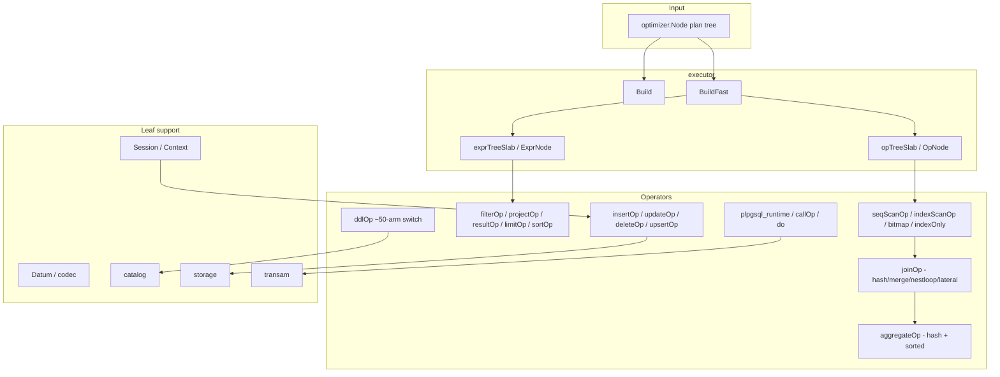

# Module: `internal/executor`

The execution engine. Runs goopg's plan trees (`optimizer.Node`) with a
PostgreSQL-style Volcano iterator model (`Open → Next → EOF → Close`). It
compiles plan nodes into operators (seq/index scan, filter, project, join, agg,
sort, limit, DML, DDL, utility), evaluates expressions over per-row `Datum`
values, drives the MVCC heap-write/stamp machinery for INSERT/UPDATE/DELETE, and
executes stored routines (PL/pgSQL, SQL-language, C-stub, `internal`), `CALL` /
`DO`, triggers, and the VACUUM/ANALYZE/checkpoint/transaction verbs.

There are **two sibling engines**: a legacy `Build`/`Run` producing an
`Operator` tree, and a GC-pointer-free fast path `BuildFast`/`BuildFastIterator`
over flat int32-indexed slabs. The fast path is the live server entry point
(`postmaster/dispatch.go:3398`).



## Key Files

| File | LOC | Role |
|---|---|---|
| `operators_ddl.go` | 27,132 | `ddlOp`, one ~50-arm `Next` switch over every parser DDL statement; catalog heap sync, physical-file relocation |
| `expr.go` | 21,177 | Interpreted evaluator `evalExprSlot` + every SQL builtin body (to_char, regexp, extract, casts, interval/time arithmetic, subqueries, geometric/network types) |
| `operators_storage.go` | 9,999 | `seqScanOp`/`insertOp`/`updateOp`/`deleteOp`: heap writes, HOT updates, xmax stamping, EPQ retry chains, unique/exclusion checks, WFG (wait-for-graph) |
| `operators_join_agg.go` | 4,987 | `joinOp` (lazy hash / merge / nested-loop / lateral), `aggregateOp` (hash + sorted grouping, user sfunc dispatch) |
| `operators_explain.go` | 2,526 | `explainOp` — EXPLAIN output |
| `codec.go` | 2,510 | Row encode/decode (`EncodeRowPG`, `DecodeRowInto`), datum serialization |
| `operators_lockrows.go` | 2,416 | `lockRowsOp` — SELECT … FOR UPDATE/SHARE |
| `operators_fk.go` | 2,045 | Foreign-key enforcement (RI checks, deferred FK) |
| `context.go` | 1,930 | The per-statement `Context` struct, `NewContext`, `CommitTransaction`, lock helpers |
| `operators_upsert.go` | 1,797 | `upsertOp` — INSERT … ON CONFLICT |
| `copy_text.go` | 1,676 | COPY text/CSV/binary parse+emit |
| `operators_ddl_partition.go` | 1,364 | Partition DDL (`execAlterTablePartition*`) |
| `operators.go` | 1,337 | `valuesOp`, `projectOp`, `resultOp`, `filterOp`, `limitOp`, `sortOp` |
| `operators_window.go` | 1,224 | `windowOp` — window functions |
| `operators_sequence.go` | 1,151 | Sequence ops (`nextval`, `setval`, virtual sequence tables) |
| `session.go` | 1,092 | `Session` interface (`BasicSession`, `NewAutocommitUndoSession`): txn state, savepoints, DDL undo, deferred checks |
| `operators_merge.go` | 1,067 | `mergeOp` — MERGE |
| `operators_analyze.go` | 1,044 | `analyzeOp` — ANALYZE, stats collection |
| `operators_indexonly.go` | 1,020 | `indexOnlyScanOp` |
| `operators_bitmap.go` | 1,012 | `bitmapIndexScanOp`, `bitmapHeapScanOp`, `bitmapAndOp`, `bitmapOrOp` |
| `applyworker.go` | 963 | Logical replication apply worker |
| `opnode.go` | 927 | Fast-path operator tree `OpNode`/`opTreeSlab`, `Slot`, `OpIterator`, `opOpen`/`opNext` dispatch |
| `datum.go` | 890 | 48-byte `Datum` value carrier, `DatumKind`/`TimeSubtype` |
| `plpgsql_runtime.go` | 3,752 | Stored-routine dispatch by language + PL/pgSQL statement interpreter (`executePLpgSQLStmt`) |
| `executor.go` | 647 | `Build`/`BuildFast` dispatch (`optimizer.Node` → operator/slab) |
| `exprnode.go` | 592 | Compiled expression tree `ExprNode`/`exprTreeSlab` + `evalFastExpr` |
| `hashsize/` | — | Leaf package: hash-join geometry (`nbuckets`/`nbatch`), shared by planner and executor |
| `kvcache/` | — | Leaf package: byte-budgeted LRU backing correlated-subquery caches |

Other operator files: `operators_cluster.go` (CLUSTER), `operators_reindex.go`
(REINDEX), `operators_vacuum.go` (VACUUM), `operators_tx.go` (BEGIN/COMMIT/
ROLLBACK/savepoints, `transactionOp`, `setTransactionOp`, `setConstraintsOp`),
`operators_call.go` (CALL), `operators_gather.go`/`operators_gather_merge.go`
(parallel query), `operators_nljoin.go` (`nestedLoopIndexJoinOp`),
`operators_recursive_cte.go` (recursive UNION, `recursiveUnionOp`,
`workTableScanOp`), `operators_cte_dml.go` (DML CTEs), `operators_setop.go`
(UNION/INTERSECT/EXCEPT), `operators_distinct.go` (DISTINCT/DISTINCT ON),
`operators_material.go`, `operators_memoize.go`, `operators_project_set.go`,
`operators_ordinality.go`, `operators_rowsfrom`, `operators_generate_series.go`,
`operators_ts_token_type.go`, `operators_pg_*` (many system-function operators),
`instrument.go` (EXPLAIN ANALYZE instrumentation).

## Public API

Entry points (`executor.go`, `opnode.go`):

```go
func Build(plan optimizer.Node) (Operator, error)          // legacy builder
func BuildWorker(plan optimizer.Node) (Operator, error)    // parallel worker path
func BuildFast(plan optimizer.Node) (*opTreeSlab, int32, error)
func BuildFastIterator(plan optimizer.Node) (*OpIterator, error) // live dispatch path
func Run(op Operator, ctx *Context) ([]Row, error)         // test/drain helper
func RunFast(tree *opTreeSlab, rootIdx int32, ctx *Context) ([]Row, error)
```

Interfaces and core types:

```go
type Operator interface { Open(ctx *Context) error; Next() (TupleSlot, error);
                          Close() error; Schema() optimizer.Schema }
type RowCounter interface { RowsAffected() int64 }         // feeds "INSERT 0 N" tags
var EOF, ErrSelfTerminate
type Context struct{ /* per-statement state */ }           // NewContext() *Context
type Datum struct{ /* 48-byte value carrier */ }
type Row = []Datum
type ExecError struct { Code, Message, Detail, Hint, Context string; Pos int;
                        ConditionName string }              // SQLSTATE carrier
type Session interface{ /* isolation, savepoints, DDL undo, deferred checks */ }
```

Key `Context` methods: `CommandCounterIncrement`, `SetCmdCounter`,
`GetCurrentCommandId`, `CommitTransaction`, `AddNotice`/`TakeNotices`,
`AddWarning`/`TakeWarnings`, `acquireRelLock`, `acquireTupleLock`,
`tryAcquireRelLock`, `acquireDDLLockTxn`, `acquireScanReadLockTxn`,
`acquireWriteLockTxn`, `waitForRelationLockers`, `MaterializeWriterXID`,
`DidWrite`, `SetParamExec`, `ResetCommandCounter`, `comboStore`,
`SessionUserName`, `EffectiveUserName`, `deadlockTimeout`.

## Internal structure

### Two engines

- **`Build`** recursively constructs an `Operator` tree (`buildNode`) for every
  plan node type; each `new<PlanType>Op` returns an unexported `<lower>Op`
  struct implementing the `Operator` interface.
- **`BuildFast`** builds an `opTreeSlab` (flat `[]OpNode` with int32 child
  indices) plus a parallel `exprTreeSlab`. Non-migrated ops are wrapped in an
  `OpAdapter` forwarding the legacy interface. `BuildFastIterator` is what
  dispatch actually calls.

### Operator inventory

Scan/project/sort core (`operators.go`):

```go
type valuesOp struct{}     // VALUES rows
type projectOp struct{}    // projection list
type resultOp struct{}     // zero-row source (e.g. SELECT without FROM)
type filterOp struct{}     // WHERE
type limitOp struct{}      // LIMIT/OFFSET
type sortOp struct{}       // ORDER BY
```

Storage DML (`operators_storage.go`):

```go
type seqScanOp struct{}    // sequential scan (heap, virtual catalogs, sequences)
type insertOp struct{}     // INSERT
type updateOp struct{}     // UPDATE (HOT / non-HOT, xmax stamping)
type deleteOp struct{}     // DELETE
```

Joins & aggregates (`operators_join_agg.go`):

```go
type joinOp struct{}       // join strategies: merge, lazy hash, nested loop, lateral
type aggregateOp struct{}  // hash + sorted grouping, user sfunc dispatch
type groupRuntime struct{} // per-group execution state
type aggRuntime struct{}   // per-aggregate accumulator
```

DDL (`operators_ddl.go`):

```go
type ddlOp struct{ plan *optimizer.DDL }
func (o *ddlOp) Next() (TupleSlot, error)  // ~50-arm switch over DDL statement types
// arms: execCreateTable, execCreateIndex, execCreateView, execCreateSchema,
// execCreateExtension, execCreateTablespace, execCreateCollation,
// execCreatePublication, execCreateSubscription, execCreateEventTrigger,
// execCreateAccessMethod, execDoBlock, execAlter* … each an exec* method
```

Expression evaluation (`expr.go`, `exprnode.go`):

```go
func evalExpr(e optimizer.Expr, row Row, ctx *Context) (Datum, error)
func evalExprSlot(e optimizer.Expr, slot SlotView, ctx *Context) (Datum, error)
func evalBinary(op parser.OpCode, left, right Datum, pos int, ctx *Context) (Datum, error)
func evalUnary(op parser.OpCode, d Datum, pos int) (Datum, error)
func evalIsDistinctFrom(lv, rv Datum, negated bool) (Datum, error)
// builtins: evalPgLSNBinary, evalJSONArrow, evalJSONPathGet, evalLikeEscapePattern,
// matchSQLLike, parse*Literal/CanonicalText for point/box/circle/line/lseg/path/
// polygon/macaddr/macaddr8, plus to_char/regexp/extract families
```

### DDL dispatch

The `ddlOp.Next()` switch handles every parser DDL statement, routing each to
an `exec*` method that:
1. Validates/resolves arguments (owners, handlers, collations, opclasses) via
   `catalog` + `Routines` lookups (`resolveNewOwnerOID`, `resolveAccessMethodHandlerFunc`,
   `resolveFDWHandlerFunc`, `resolveEventTriggerFunc`).
2. Mutates the in-memory catalog (`CreateTable`, `CreateIndex`, `Register*`,
   `Drop*`, `Rename*`).
3. Persists via `syncTableToCatalogHeap` (the sibling renderer).
4. Handles physical-file work where needed (`relocateRelationPhysicalFile`,
   `swapRelationPhysicalFile` for `ALTER TABLE SET TABLESPACE`).

### EPQ (EvalPlanQual)

Concurrently-updated tuples trigger EvalPlanQual retries:

```go
func epqRetryLimit(iso transam.IsolationLevel) int
func epqWait(ctx *Context, xmax storage.TransactionID) (deadlock bool, timeout *ExecError)
func epqRecheckVisible(ctx *Context, rel, blk, slot) (bool, error)
func epqXmaxSettled(ctx *Context, xmax) (aborted, committed bool)
func epqSerializationErr(ctx *Context, rel, blk, slot, pos) *ExecError
func epqFollowHOT(ctx *Context, rel, blk, slot) …
func epqFollowChain(ctx *Context, rel, blk, slot) …
func epqFollowChainFull(ctx *Context, rel, blk, slot) …
func epqChainPendingWriter(ctx *Context, rel, blk, slot) …
func epqRefreshSnapForRetry(ctx *Context)
```

The retry follows HOT chains and CTID chains across concurrent writers,
refreshing the snapshot (`epqRefreshSnapForRetry`) and re-checking visibility.
Serializable conflicts surface as `epqSerializationErr` (40001).

### Wait-for-graph (WFG)

`operators_storage.go` also owns the cross-session wait-for-graph for tuple
lock conflicts:

```go
func wfgNoteTarget(xid, rel, blk, slot, hdr)
func registerWFGAndCheckCycle(myXID, blockingXID) bool
func dumpWFGCycle(myXID, blockingXID)
func deregisterWFG(myXID)
func waitPgClassInplaceXID(ctx, blockingXID) (deadlock bool, timeout *ExecError)
```

`registerWFGAndCheckCycle` returns true on a detected cycle (deadlock) so the
caller aborts; `dumpWFGCycle` prints the edge chain for diagnostics.

### Session / transaction state (`session.go`)

`Session` interface:

```go
type Session interface {
    SetIsolationLevel(l transam.IsolationLevel) error
    IsolationLevel() transam.IsolationLevel
    InExplicitTransaction() bool
    TracksDDLUndo() bool
    IsReadOnlyTxn() bool / SetReadOnlyTxn(v bool)
    BeginExplicitTransaction(tx, snap)
    EndExplicitTransaction()
    CmdCounter() *CommandCounter
    AddDeferredFKCheck(check DeferredFKCheck) / TakeDeferredFKChecks()
    AddDeferredUniqueCheck(check DeferredUniqueCheck) / TakeDeferredUniqueChecks()
    AddDeferredExclusionCheck(check DeferredExclusionCheck) / TakeDeferredExclusionChecks()
    PushSavepoint(name, snap, subXid) / ReleaseSavepoint(name) / RollbackToSavepoint(name, …)
    RegisterOnCommitAction(relOID, action) / OnCommitActions()
    EffectiveWriterXID() storage.TransactionID
    IsTransactionFailed() bool
}
```

DDL undo structures: `DDLUndoEntry`, `DDLDropUndoEntry`, `PendingIndexDrop`,
`PendingPartitionAttach`, `PendingInheritanceChange`, `PendingTableDrop`,
`DeferredRoutineDrop`, `TruncateUndoEntry`, `SeqRestoreEntry`, `OnCommitAction`.
`NewAutocommitUndoSession` enables undo tracking even outside explicit
transactions (used by the standalone statement path).

### Deferred constraint checks

The session accumulates deferred FK/unique/exclusion checks and replays them at
COMMIT (`TakeDeferredFKChecks`, `TakeDeferredUniqueChecksStmtEnd`,
`TakeDeferredExclusionChecksMatching`). `SetConstraintsAll`/`SetConstraintsNamed`
mirror `SET CONSTRAINTS`. NOT NULL deferred checks (`DeferredNNDKeyCol`) are
also tracked.

## Dependencies

- **Used by** `internal/postmaster` (wire protocol), `internal/replication`,
  `internal/backup`, `internal/initdb`, `internal/access/nbtree`,
  `internal/catalog`, `internal/storage`, `internal/parser/analyzer`.
- **Uses** `internal/optimizer` (plan node types — direction is executor →
  optimizer), `internal/parser`, `internal/catalog`, `internal/storage`,
  `internal/access/{nbtree,transam,common/pglz,amcheck}`,
  `internal/utils/{mmgr,misc,activity,adt/*}`, `internal/pl/plpgsql`,
  `internal/commands/vacuum`, `internal/nodes`, plus leaf `hashsize`/`kvcache`.

## Notable patterns / gotchas

- **Sibling evaluators must agree** — `evalExprSlot` and `evalFastExpr` are
  documented twins with past divergences (float arithmetic, AND/OR short-circuit
  gated on `Kind == KindBool`, int2/int4 overflow). Same for `Build` vs
  `BuildFast.buildRec`.
- **Slot lifetime contract** — producer slots are stable only until the next
  `Next`; consumers that retain must call `Materialize()`.
- **`hashsize` import invariant is load-bearing** — violating it introduces an
  `optimizer → executor` cycle.
- **Context copied by value** at FK/partition-DDL sites — hence `tempFiles` must
  be a pointer.
- **Command counter** — per-statement `CmdID`; `CommandCounterIncrement` before
  execution mirrors PG's per-statement CCI.
- **`Datum` subtype discipline** — `KindTime` carries five SQL types via
  `TimeSubtype`; forgetting it in a serializer silently degrades `date` → `timestamp`.
- **EPQ** — concurrently-updated tuples trigger EvalPlanQual retries
  (`maxEPQRetries`, `epqWait`, `epqFollowChain`); the chain walk must follow
  HOT pointers AND cross-partition moves (`epqSlotMovedToAnotherPartition`).
- **PL/pgSQL is interpreted here** over `internal/pl/plpgsql` ASTs; language
  dispatch is `dispatchStoredRoutineByLanguage` (plpgsql → interpreter, sql →
  recursive executor, c → stub, internal → builtin map, else 42704).
- **`insertOp` RowsAffected** — every DML operator implements `RowCounter` so
  the `INSERT 0 N` / `UPDATE N` command tags round-trip through the wire
  protocol; forgetting it silently emits `INSERT 0 0`.
- **SeqScan is polymorphic** — the same `seqScanOp` handles heap files,
  virtual catalogs (`ctx.PgClassRows()` swap for pg_class), and sequence
  virtual tables; `decodeScanRow`/`decodeScanRowRange` interpret the raw tuple.
- **Prefetch window** — `seqScanOp.refillPrefetchWindow` issues async
  prefetches ahead of the scan position (`scan_ring` in storage), critical for
  TPC-H-style sequential scans.
- **`canonicalTypeClass`** — DDL validation compares a column's declared type
  against the inherited parent's via the canonical type name, not the raw text;
  a `varchar` vs `character varying` mismatch breaks inheritance type checks.
- **Geometry/network builtins are hand-ported** — point/box/circle/line/lseg/
  path/polygon/macaddr text parsing lives in `expr.go` and must match PG's
  canonical output byte-for-byte (`pointCanonicalText`, `boxCanonicalText`, …)
  for pg_dump round-trips and `format_type` fidelity.
