# Module: `internal/initdb`

The cluster bootstrap + startup-recovery layer. `Init` creates a
**byte-compatible PostgreSQL 18.3 data directory** (config files, PG-canonical
system-catalog heap rows, btree index files, relcache init files, pg_control,
bootstrap WAL segment) that works for goopg's own runtime *and* for a real
PG 18.3 attached as a standby. `Open` turns an existing data dir into the
long-lived `Runtime` bundle by first replaying WAL for crash recovery, then
reconstructing the in-memory catalog from the on-disk catalog heaps.



## Key Files

| File | LOC | Role |
|---|---|---|
| `initdb.go` | 6,795 | `Init`: dir layout, config seeding, per-catalog heap writers, shared/CLOG/SLRU placeholders, template0 refresh, fsync |
| `open.go` | 4,016 | `Open`: verify dir, WAL replay, construct `Runtime`, the ordered catalog-reload passes, runtime-view registration, save/close |
| `relcache_init.go` | 3,580 | PG-binary `pg_internal.init` writer; `nailedRel`/`nailedAttr` descriptors and per-catalog column schemas (30+ attrs functions) |
| `pg_proc_seed_data.go` | 3,405 | Generated mirror of PG18 `pg_proc.dat` (3,397 rows) |
| `catalog_heap_reload.go` | 2,733 | Generic heap-scan reload framework: `scanCatalogHeapRows`, `catalogRowLive`, `runCatalogReloads`, ~40 `reload*FromHeap` passes |
| `btree_index_bootstrap.go` | 3,000 | PG-conformant btree index file builders for every system catalog |
| `nailed_view_seed_data.go` | 2,456 | Seed tables for 80 pg_catalog views (captured from PG18.3) |
| `information_schema_view_seed_data.go` | 2,000 | Seed tables for 65 information_schema views |
| `pg_aggregate_bootstrap.go` | 1,946 | pg_aggregate/pg_proc heap row generation for built-in aggregates |
| `pg_amproc_entries.go` | 792 | pg_amproc/pg_amop seed entries |
| `pg_type_bootstrap.go` | 792 | pg_type heap row bootstrap for all built-in types |
| `replication_views.go` | 747 | Replication-related pg_catalog view seed rows |
| `pg_proc_view.go` | 629 | `pg_proc` virtual row helpers |
| `pgcontrol.go` | 337 | pg_control write (`writePgControl`, `BackupControlImage`, `buildPgControl`) |
| `xact_recovery.go` | 290 | Transaction recovery: `TransactionIdIsInProgress`, `TransactionIdDidCommit`, abort sweep |
| `pg_type_seed_data.go` | 403 | Seed data constants for pg_type (type OID map) |
| `system_view_oid_pins.go` | 437 | Fixed OID assignments for system views (12000–16383 band) |
| `pg_cast_bootstrap.go` | 293 | pg_cast bootstrap rows |
| `pg_conversion_bootstrap.go` | 268 | pg_conversion bootstrap rows |
| `pg_constraint_bootstrap.go` | 234 | pg_constraint bootstrap rows |
| `pg_rewrite_toast_bootstrap.go` | 293 | TOAST for oversized pg_rewrite ev_action blobs |
| `pg_rewrite_toast_writer.go` | 262 | writer for TOAST pairs |
| `pg_collation_bootstrap.go` | 231 | pg_collation bootstrap rows |
| `pg_extension_bootstrap.go` | 213 | pg_extension bootstrap rows |
| `pologistat_bootstrap.go` | 202 | pg_statistic bootstrap rows |
| `locale.go` | 245 | Locale resolution (`DetectLocale`, `localeSetings`) |
| `catalog_cache.go` | — | M0114 fast-start JSON snapshot |
| `timeline.go` | — | Timeline ID management (`LoadOrCreateTimelineID`) |
| `wal_bootstrap.go` | — | Bootstrap WA segment (`WriteBootstrapWAL`) |
| `standby.go` | — | Standby signal files (`IsStandby`, `CreateStandbySignal`, etc.) |
| `recovery_state.go` | — | Recovery state persistence |

## Public API

### Cluster creation

```go
func Init(opts Options) error
type Options struct{ DataDir, SuperuserName, WALDir, NoSync, SyncOnly,
    SyncMethod, AuthMethodHost/Local, PwFile, Encoding, Locale*, DataChecksums, … }
func SampleFiles() []FileSpec
func LoadOrCreateSystemID(dataDir string) (uint64, error)
func CreatePerDatabaseScaffolding(dataDir string, dbOID uint32) error
func RemovePerDatabaseScaffolding(dataDir string, dbOID uint32) error
const CatalogVersion = misc.MajorVersion
```

### Server open

```go
func Open(opts OpenOptions) (*Runtime, error)
type Runtime struct{ StorageMgr, Pool, TxnMgr, Catalog, FSM, VM, WAL *xlog.Writer,
    Checkpointer, Slots, SyncRep, PubSub, AIO, Activity, / Standby/Recovery flags */ }
type OpenOptions struct{ PoolSlots, WALBuffers, FsyncDisabled, CommitDelayUs/CommitSiblings, /* … */ }
func (r *Runtime) SetImmediateShutdown()
func (r *Runtime) SaveCatalog() / SaveVM() / SaveFSM() / Close()
```

### PG-compat artifacts

```go
func WriteBootstrapWAL(dataDir string, sysID uint64, now time.Time) error
func BackupControlImage(dataDir string, redoLSN, ckptRecordLSN uint64, tli uint32) ([]byte, error)
func LoadOrCreateTimelineID(dataDir string) (uint32, error)
func IsStandby / IsRecovery / CreateStandbySignal / RemoveStandbySignal / RemoveRecoverySignal
```

## Internal structure

```mermaid
flowchart TD
    subgraph Init["Init (bootstrap)"]
        DIR[create subdirs]
        CFG[write config files]
        SYS[bootstrapSystemCatalogs<br/>pg_type/pg_class/pg_attribute]
        CATS[bootstrapPgClassTuples<br/>bootstrapPgAttributeTuples<br/>bootstrapPgNamespaceTuples<br/>bootstrapPgProcTuples<br/>bootstrapPgAmTuples<br/>... 30+ catalog passes]
        BTREE[bootstrap btree indexes<br/>btree_index_bootstrap.go]
        REWRITE[bootstrap pg_rewrite + TOAST]
        CLOG[bootstrap SLRU placeholders]
        RELCACHE[bootstrapRelcacheInitFiles]
        TEMPLATE[refreshTemplate0Image]
        WAL[WriteBootstrapWAL]
        CTL[writePgControl]
        FSYNC[syncDataDir]
    end
    subgraph Open["Open (startup)"]
        VERIFY[verify directory]
        OPEN_SMGR[NewManager]
        RECOVERY[beginRecovery<br/>find redo LSN]
        WAL_REPLAY[ReplayFromDirWithMgr]
        CLOG_REPLAY[CLOG replay + abort sweep]
        RELOAD[catalog heap reloads<br/>~40 reload*FromHeap passes]
        RELCACHE_R[regen pg_internal.init]
        VIEWS[register runtime views]
        PROD[stampInProduction]
    end
    DIR --> CFG --> SYS --> CATS --> BTREE
    BTREE --> REWRITE --> CLOG --> RELCACHE
    RELCACHE --> TEMPLATE --> WAL --> CTL --> FSYNC
    VERIFY --> OPEN_SMGR --> RECOVERY --> WAL_REPLAY
    WAL_REPLAY --> CLOG_REPLAY --> RELOAD
    RELOAD --> RELCACHE_R --> VIEWS --> PROD
```

### Bootstrap (`Init`)

Validate options → create subdirs → write config → `bootstrapSystemCatalogs`
(seeds pg_type/pg_class/pg_attribute, XID=1) → a long
chain of per-catalog `bootstrap*Tuples` calls writing PGcanonical heap rows +
matching btree index files → pg_rewrite + TOAST → CLOG/SLRU placeholders →
`bootstrapRelcacheInitFiles` → `refreshTemplate0Image` → `WriteBootstrapWAL` →
`writePgControl` → optional checksums → `syncDataDir`.

The bootstrap chain in detil:

1. `bootstrapPgAmTuples` — access methods (7 rows: heap, btree, hash, gin, gist, spgist, brin)
2. `bootstrapPgNamespaceTules` — pg_namespace (14 rows: pg_catalog, public, information_schema, + pg_temp helpers)
3. `bootstrapPgProcTuples` — pg_proc (3,397 rows from PG18 seed data)
4. `bootstrapPgClassTuples` — pg_class (all system relations + indexes)
5. `bootstrapPgAttributeTuples` — pg_attribute (all columns for system relations)
6. `bootstrapPgTypeTuples` — pg_type (all builtin types)
7. `bootstrapPgOpclassTuples` — pg_opclass
8. `bootstrapPgOpfamilyTuples` — pg_opfamily
9. `bootstrapPgAmopTuples` / `bootstrapPgAmprocTuples` — access method operators/functions
10. `bootstrapPgOperatorTuples` — pg_operator
11. `bootstrapPgCollationTuples` — pg_collation
12. `bootstrapPgStatisticTuples` — pg_statistic
13. `bootstrapPgConstraintTuples` — pg_constraint
14. `bootstrapPgCastTuples` — pg_cast
15. `bootstrapPgConversionTuples` — pg_conversion
16. `bootstrapPgExtentionTuples` — pg_extension
17. `bootstrapPgRewiteTuples` — pg_rewrite (+ TOAST pair for ev_action)
18. `bootstrapPgDatabaseTuples` — pg_database (postgres, template1, template0)
19. `bootstrapPgAuthidTuples` — pg_authid (superuser role)
20+ Nailed view seed data (80 views) + information_schema view seed (65 views)

Each `bootstrap*Tuple` call:
1. Builds heap rows with `executor.EncodeRowPG`
2. Writes them via `appendCatalogRows` (multi-page heap insert)
3. Builds the matching btree index file via `btree_index_bootstrap.go`:
   `scanRelationBlocks` → `writeCatalogIndex` → `buildPage`/`buildRoot`

### Open (`Open`)

Verify → `storage.NewManager` → `beginRecovery` (redo LSN) →
WAL replay (`xlog.ReplayFromDirWithMgrAt`) → system ID/TLI → WAL writer wiring →
CLOG replay + abort sweep → **catalog heap reloads** → regen `pg_internal.init`
→ register runtime views → `stampInProduction`.

The ordered reload passes (captured in `runCatalogReloads`):

1. `loadSystemCatalogsIfPresent` — pg_type, pg_attribute, pg_database (heap-backed catalogs)
2. `reloadUserSchemasFromHeap` — pg_namespace
3. `reloadUserTablespacesFromHeap` — pg_tablespace
4. `reloadUserTransformsFromHeap` — pg_transform
5. Per-database loop:
   - `loadUserTablesFromHeapForDB` — pg_class, pg_attribute scan → catalog.InMemory registration
   - `reloadDatabasesFromHeap` — pg_database
   - `loadStatisticsFromHeapForDB` — pg_statistic
   - `loadUserIndexesFromHeapForDB` — pg_index
   - `loadColumnDefaultsFromHeapForDB` — pg_attrdef
   - `loadInheritanceFromHeapForDB` — pg_inherits
   - `loadViewsFromHeapForDB` — pg_rewrite (view definitions)
   - `reloadSequencesFromHeap` — pg_sequence
   - `reloadUserEnumsFromHeap` — pg_enum
   - `reloadUserDomainsFromHeap` — pg_type (domains) + pg_constraint (domain checks)
   - `reloadUserRangeTypesFromHeap` — pg_range + pg_type
   - `reloadUserCollationsFromHeap` — pg_collation
   - `reloadUserConversionsFromHeap` — pg_conversion
   - `reloadUserRoutinesFromHeap` — pg_proc (user-defined functions)
   - `reloadUserAggregatesFromHeap` — pg_aggregate + pg_proc
   - `reloadUserOperatorsFromHeap` — pg_operator
   - `reloadOpClassFamilyFromHeap` / `reloadOpFamiliesFromHeap` / `reloadOpClassesFromHeap` / `reloadAmOpMembersFromHeap` / `reloadAmProcMembersFromHeap`
   - `reloadUserCastsFromHeap` — pg_cast
   - `reloadUserTSDictsFromHeap` / `reloadUserTSConfigsFromHeap` — text search
   - `reloadUserEventTriggersFromHeap` — pg_event_trigger
   - `reloadUserPublicationsFromHeap` / `reloadSubscriptionsFromHeap` — pg_publication/pg_subscription
   - `reloadRolesFromAuthidHeap` — pg_authid
   - `reloadRoleMembershipsFromHeap` — pg_auth_members
   - `reloadUserMappingsFromHeap` — pg_user_mapping
   - `reloadForeignDataFromHeap` / `reloadFdwsFromHeap` / `reloadForeignServersFromHeap`
   - `reloadUserExtensionsFromHeap` — pg_extension
   - `reloadUserAccessMethodsFromHeap` — pg_am
   - `reloadStatisticsExtFromHeapForDB` — pg_statistic_ext
   - `reloadDbRoleSettingsFromHeap` — pg_db_role_setting

### Reload framework

One shared scan loop `scanCatalogHeapRows` + liveness filter `catalogRowLive`
(xmin≠Invalid, xmax==Invalid, xmin not aborted) + per-catalog `catalogReloadDesc`
sorted by `Slot`. `catalogRowLive` implements PG's tuple-visibility rules for
system catalogs: xmin must be committed (or bootstrap XID 1), xmax must be
invalid (catalog mutations are delete+reinsert), and the xmin must not be
aborted (no `requireCommittedXmin` bypass). `rebuildViewFromEvAction` re-parses
the canonical pg_node_tree ev_action blob into a `parser.SelectStmt` for view
registration.

### Bootstrap WAL and pg_control

- `WriteBootstrapWAL` emits a single WAL segment with an initial CHECKPOINT
  record (XID=1, nextOid=FirstUserOID=16384), so the startup recovery finds a
  valid redo point even on a fresh cluster.
- `writePgControl` writes PG18-format pg_control with system-ID, checkpoint LSN,
  nextXID (3: bootstrap XID=1 + two consumed by the template databases), TLI,
  state (DB_SHUTDOWNED) and data-checksum flag.
- `BackupControlImage` captures the current pg_control for backup labeling.

## Dependencies

- **Uses** `internal/catalog`, `internal/executor` (EncodeRowPG, PG column
  schemas), `internal/storage` (+`aio`), `internal/access/transam` (+`xlog`,
  `control`), `internal/utils/misc`, `internal/parser`, `internal/nodes`,
  `internal/optimizer`, `internal/access/nbtree`, `internal/libpq/auth`.
- **Used by** `cmd/goopg`, `internal/postmaster`, `internal/executor`,
  `internal/optimizer`, `internal/backup/basebackup`,
  `internal/postmaster/autovacuum`. Import direction trap: `executor` cannot
  import `initdb` leaf constants (cycle) — version constants live in `utils/misc`.

## Notable patterns / gotchas

- **Dual-purpose seed data** — every catalog is written both as PG-canonical
  heap rows + btree index files (for PG standby/syscache) *and* reloadable into
  the in-memory catalog. A `pg_attribute`/`pg_internal.init` mismatch PANICs a
  hosted PG.
- **Generated corpus, captured oracle** — the seed-data files are generated by
  `cmd/gen-pg-proc-data` et al. from PG 18.3 dat files; system-view OIDs are
  pinned to upstream initdb's assignments (12000–16383 band) so captured
  `ev_action` blobs need no rewriting.
- **`ev_action` blobs are verbatim** — captured from a live PG; large blobs go
  out-of-line into the pg_rewrite TOAST pair (2838/2839).
- **pg_control is initdb-time + runtime-patched** — written at initdb and
  updated at runtime (crash-recovery state, nextOid, checkpoints).
- **Bootstrap XID = 1** — all seed rows carry xid=1, always visible.
- **Reload liveness rules** — xmin==Invalid dead; any non-zero xmax dead
  (catalog mutations are delete+reinsert); aborted xmin dead.
- **M0114 catalog cache** — clean-shutdown JSON snapshot skips the
  pg_class/pg_attribute heap scan on next start.
- **Sibling-path discipline** — bootstrap-seed ↔ runtime-reload
  (`writeMultiPageHeap*` ↔ `load*FromHeap`), `EncodeRowPG` ↔ `DecodeRowIntoMctxPGTuple`.
- **Heap TID tracking** — every `bootstrapPg*Tuple` pass returns `heapTID` maps
  so the btree index builder can point index entries at the correct physical
  tuple locations (critical for PG-identical index images).
- **Btree index bootstrap must complete after ALL catalog rows are written** —
  `btree_index_bootstrap.go` scans the written heap files to build index entries;
  an index built before all its referenced rows are inserted produces a corrupt
  index.
- **Template0 is a pg_class/pg_attribute snapshot copy** — `refreshTemplate0Image`
  copies the written bootstrap catalog images into template0's directory
  (base/4/) so a CREATE DATABASE TEMPLATE template0 works.
- **`detectCatalogDBOID`** — at startup, open scans `pg_database` heap to find
  the "live" database OID (the one goopg is configured to serve), detecting
  whether it was imported from a real PG backup (per-db layout) or freshly
  created (default layout).
- **pg_hba.conf is seeded with trust or password** — `AuthMethodHost`/`AuthMethodLocal`
  control the initial pg_hba.conf entries; `PwFile` seeds SCRAM-SHA-256
  credentials for the bootstrap superuser.