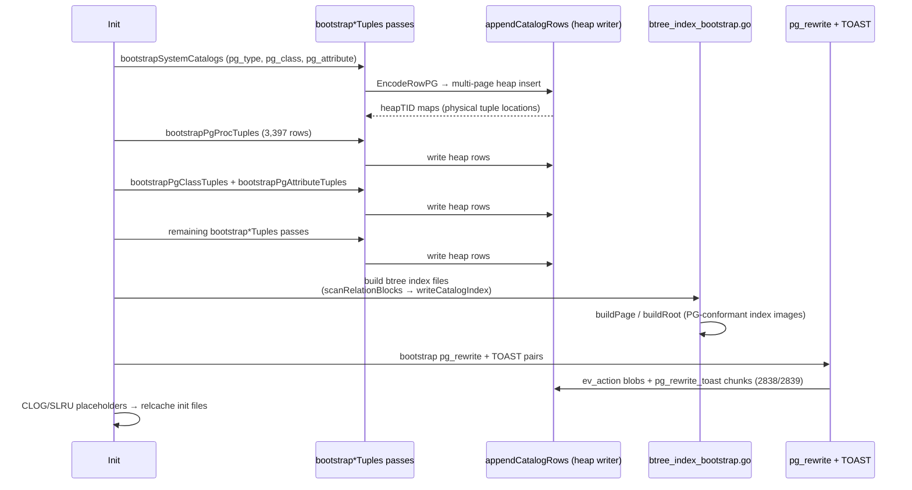
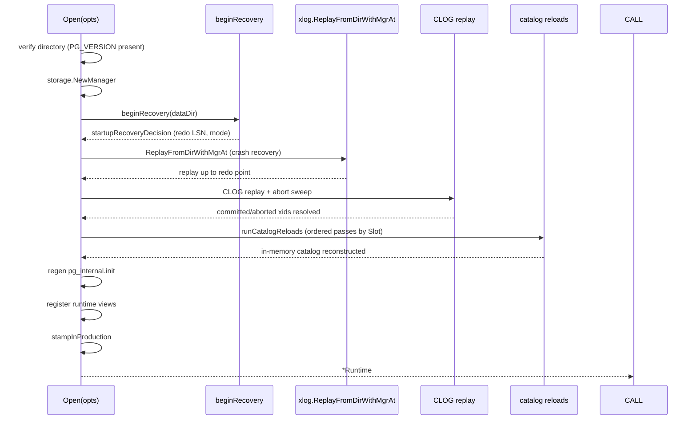

# Module: `internal/initdb`

The cluster bootstrap + startup-recovery layer. `Init` creates a
**byte-compatible PostgreSQL 18.3 data directory** (config files, PG-canonical
system-catalog heap rows, btree index files, relcache init files, pg_control,
bootstrap WAL segment) that works for goopg's own runtime *and* for a real
PG 18.3 attached as a standby. `Open` turns an existing data dir into the
long-lived `Runtime` bundle by first replaying WAL for crash recovery, then
reconstructing the in-memory catalog from the on-disk catalog heaps.

## Public API

### Cluster creation

```go
func Init(opts Options) error
type Options struct{ DataDir, SuperuserName, WALDir, NoSync, SyncOnly,
    SyncMethod, AuthMethodHost/Local, PwFile, Encoding, Locale*, DataChecksums, … }
func SampleFiles() []FileSpec
func LoadOrCreateSystemID(dataDir string) (uint64, error)
func CreatePerDatabaseScaffolding(dataDir string, dbOID uint32) error
func RemovePerDatabaseScaffolding(dataDir string, dbOID uint32) error
const CatalogVersion = misc.MajorVersion
```

### Server open

```go
func Open(opts OpenOptions) (*Runtime, error)
type Runtime struct{ StorageMgr, Pool, TxnMgr, Catalog, FSM, VM, WAL *xlog.Writer,
    Checkpointer, Slots, SyncRep, PubSub, AIO, Activity, / Standby/Recovery flags */ }
type OpenOptions struct{ PoolSlots, WALBuffers, FsyncDisabled, CommitDelayUs/CommitSiblings, /* … */ }
func (r *Runtime) SetImmediateShutdown()
func (r *Runtime) SaveCatalog() / SaveVM() / SaveFSM() / Close()
```

### PG-compat artifacts

```go
func WriteBootstrapWAL(dataDir string, sysID uint64, now time.Time) error
func BackupControlImage(dataDir string, redoLSN, ckptRecordLSN uint64, tli uint32) ([]byte, error)
func LoadOrCreateTimelineID(dataDir string) (uint32, error)
func IsStandby / IsRecovery / CreateStandbySignal / RemoveStandbySignal / RemoveRecoverySignal
func beginRecovery(dataDir string) (startupRecoveryDecision, error)
func stampInProduction(dataDir string) error
func writePgControl(dataDir string, systemID uint64, cfg *misc.Registry, dataChecksums bool) error
func buildPgControl(systemID uint64, now time.Time, cfg *misc.Registry, dataChecksums bool) []byte
```

## Key Files

| File | LOC | Role |
|---|---|---|
| `initdb.go` | 6,795 | `Init`: dir layout, config seeding, per-catalog heap writers, shared/CLOG/SLRU placeholders, template0 refresh, fsync |
| `open.go` | 4,016 | `Open`: verify dir, WAL replay, construct `Runtime`, the ordered catalog-reload passes, runtime-view registration, save/close |
| `relcache_init.go` | 3,580 | PG-binary `pg_internal.init` writer; `nailedRel`/`nailedAttr` descriptors and per-catalog column schemas (30+ attrs functions) |
| `pg_proc_seed_data.go` | 3,405 | Generated mirror of PG18 `pg_proc.dat` (3,397 rows) |
| `catalog_heap_reload.go` | 2,733 | Generic heap-scan reload framework: `scanCatalogHeapRows`, `catalogRowLive`, `runCatalogReloads`, ~40 `reload*FromHeap` passes |
| `btree_index_bootstrap.go` | 3,000 | PG-conformant btree index file builders for every system catalog |
| `nailed_view_seed_data.go` | 2,456 | Seed tables for 80 pg_catalog views (captured from PG18.3) |
| `information_schema_view_seed_data.go` | 2,000 | Seed tables for 65 information_schema views |
| `pg_aggregate_bootstrap.go` | 1,946 | pg_aggregate/pg_proc heap row generation for built-in aggregates |
| `pg_amproc_entries.go` | 1018 | pg_amproc/pg_amop seed entries |
| `pg_type_bootstrap.go` | 792 | pg_type heap row bootstrap for all built-in types |
| `replication_views.go` | 747 | Replication-related pg_catalog view seed rows |
| `pg_proc_view.go` | 629 | `pg_proc` virtual row helpers |
| `pgcontrol.go` | 337 | pg_control write (`writePgControl`, `BackupControlImage`, `buildPgControl`) |
| `xact_recovery.go` | 290 | Transaction recovery: `TransactionIdIsInProgress`, `TransactionIdDidCommit`, abort sweep |
| `pg_type_seed_data.go` | 403 | Seed data constants for pg_type (type OID map) |
| `system_view_oid_pins.go` | 437 | Fixed OID assignments for system views (12000–16383 band) |
| `pg_cast_bootstrap.go` | 307 | pg_cast bootstrap rows |
| `pg_conversion_bootstrap.go` | 268 | pg_conversion bootstrap rows |
| `pg_constraint_bootstrap.go` | 234 | pg_constraint bootstrap rows |
| `pg_rewrite_toast_bootstrap.go` | 293 | TOAST for oversized pg_rewrite ev_action blobs |
| `pg_rewrite_toast_writer.go` | 262 | writer for TOAST pairs |
| `pg_collation_bootstrap.go` | 120 | pg_collation bootstrap rows |
| `locale.go` | 245 | Locale resolution (`DetectLocale`, `localeSetings`) |
| `catalog_cache.go` | — | M0114 fast-start JSON snapshot |
| `timeline.go` | — | Timeline ID management (`LoadOrCreateTimelineID`) |
| `wal_bootstrap.go` | — | Bootstrap WA segment (`WriteBootstrapWAL`) |
| `standby.go` | — | Standby signal files (`IsStandby`, `CreateStandbySignal`, etc.) |
| `recovery_state.go` | — | Recovery state persistence |

## Internal structure

### Bootstrap overview

```mermaid
flowchart TD
    subgraph Init["Init (bootstrap)"]
        DIR[create subdirs]
        CFG[write config files]
        SYS[bootstrapSystemCatalogs<br/>pg_type/pg_class/pg_attribute]
        CATS[bootstrapPgClassTuples<br/>bootstrapPgAttributeTuples<br/>bootstrapPgNamespaceTuples<br/>bootstrapPgProcTuples<br/>bootstrapPgAmTuples<br/>... 30+ catalog passes]
        BTREE[bootstrap btree indexes<br/>btree_index_bootstrap.go]
        REWRITE[bootstrap pg_rewrite + TOAST]
        CLOG[bootstrap SLRU placeholders]
        RELCACHE[bootstrapRelcacheInitFiles]
        TEMPLATE[refreshTemplate0Image]
        WAL[WriteBootstrapWAL]
        CTL[writePgControl]
        FSYNC[syncDataDir]
    end
    subgraph Open["Open (startup)"]
        VERIFY[verify directory]
        OPEN_SMGR[NewManager]
        RECOVERY[beginRecovery<br/>find redo LSN]
        WAL_REPLAY[ReplayFromDirWithMgr]
        CLOG_REPLAY[CLOG replay + abort sweep]
        RELOAD[catalog heap reloads<br/>~40 reload*FromHeap passes]
        RELCACHE_R[regen pg_internal.init]
        VIEWS[register runtime views]
        PROD[stampInProduction]
    end
    DIR --> CFG --> SYS --> CATS --> BTREE
    BTREE --> REWRITE --> CLOG --> RELCACHE
    RELCACHE --> TEMPLATE --> WAL --> CTL --> FSYNC
    VERIFY --> OPEN_SMGR --> RECOVERY --> WAL_REPLAY
    WAL_REPLAY --> CLOG_REPLAY --> RELOAD
    RELOAD --> RELCACHE_R --> VIEWS --> PROD
```



### Bootstrap (`Init`)

Validate options → create subdirs → write config → `bootstrapSystemCatalogs`
(seeds pg_type/pg_class/pg_attribute, XID=1) → a long
chain of per-catalog `bootstrap*Tuples` calls writing PGcanonical heap rows +
matching btree index files → pg_rewrite + TOAST → CLOG/SLRU placeholders →
`bootstrapRelcacheInitFiles` → `refreshTemplate0Image` → `WriteBootstrapWAL` →
`writePgControl` → optional checksums → `syncDataDir`.

The bootstrap chain in detail:

1. `bootstrapPgAmTuples` — access methods (7 rows: heap, btree, hash, gin, gist, spgist, brin)
2. `bootstrapPgNamespaceTuples` — pg_namespace (14 rows: pg_catalog, public, information_schema, + pg_temp helpers)
3. `bootstrapPgProcTuples` — pg_proc (3,397 rows from PG18 seed data)
4. `bootstrapPgClassTuples` — pg_class (all system relations + indexes)
5. `bootstrapPgAttributeTuples` — pg_attribute (all columns for system relations)
6. `bootstrapPgTypeTuples` — pg_type (all builtin types)
7. `bootstrapPgOpclassTuples` — pg_opclass
8. `bootstrapPgOpfamilyTuples` — pg_opfamily
9. `bootstrapPgAmopTuples` / `bootstrapPgAmprocTuples` — access method operators/functions
10. `bootstrapPgOperatorTuples` — pg_operator
11. `bootstrapPgCollationTuples` — pg_collation
12. `bootstrapPgStatisticTuples` — pg_statistic
13. `bootstrapPgConstraintTuples` — pg_constraint
14. `bootstrapPgCastTuples` — pg_cast
15. `bootstrapPgConversionTuples` — pg_conversion
16. `bootstrapPgExtentionTuples` — pg_extension
17. `bootstrapPgRewiteTuples` — pg_rewrite (+ TOAST pair for ev_action)
18. `bootstrapPgDatabaseTuples` — pg_database (postgres, template1, template0)
19. `bootstrapPgAuthidTuples` — pg_authid (superuser role)
20+ Nailed view seed data (80 views) + information_schema view seed (65 views)

Each `bootstrap*Tuple` call:
1. Builds heap rows with `executor.EncodeRowPG`
2. Writes them via `appendCatalogRows` (multi-page heap insert)
3. Builds the matching btree index file via `btree_index_bootstrap.go`:
   `scanRelationBlocks` → `writeCatalogIndex` → `buildPage`/`buildRoot`

### The catalog-pass chain



### Open (`Open`)

Verify → `storage.NewManager` → `beginRecovery` (redo LSN) →
WAL replay (`xlog.ReplayFromDirWithMgrAt`) → system ID/TLI → WAL writer wiring →
CLOG replay + abort sweep → **catalog heap reloads** → regen `pg_internal.init`
→ register runtime views → `stampInProduction`.

The ordered reload passes (captured in `runCatalogReloads`):

1. `loadSystemCatalogsIfPresent` — pg_type, pg_attribute, pg_database (heap-backed catalogs)
2. `reloadUserSchemasFromHeap` — pg_namespace
3. `reloadUserTablespacesFromHeap` — pg_tablespace
4. `reloadUserTransformsFromHeap` — pg_transform
5. Per-database loop:
   - `loadUserTablesFromHeapForDB` — pg_class, pg_attribute scan → catalog.InMemory registration
   - `reloadDatabasesFromHeap` — pg_database
   - `loadStatisticsFromHeapForDB` — pg_statistic
   - `loadUserIndexesFromHeapForDB` — pg_index
   - `loadColumnDefaultsFromHeapForDB` — pg_attrdef
   - `loadInheritanceFromHeapForDB` — pg_inherits
   - `loadViewsFromHeapForDB` — pg_rewrite (view definitions)
   - `reloadSequencesFromHeap` — pg_sequence
   - `reloadUserEnumsFromHeap` — pg_enum
   - `reloadUserDomainsFromHeap` — pg_type (domains) + pg_constraint (domain checks)
   - `reloadUserRangeTypesFromHeap` — pg_range + pg_type
   - `reloadUserCollationsFromHeap` — pg_collation
   - `reloadUserConversionsFromHeap` — pg_conversion
   - `reloadUserRoutinesFromHeap` — pg_proc (user-defined functions)
   - `reloadUserAggregatesFromHeap` — pg_aggregate + pg_proc
   - `reloadUserOperatorsFromHeap` — pg_operator
   - `reloadOpClassFamilyFromHeap` / `reloadOpFamiliesFromHeap` / `reloadOpClassesFromHeap` / `reloadAmOpMembersFromHeap` / `reloadAmProcMembersFromHeap`
   - `reloadUserCastsFromHeap` — pg_cast
   - `reloadUserTSDictsFromHeap` / `reloadUserTSConfigsFromHeap` — text search
   - `reloadUserEventTriggersFromHeap` — pg_event_trigger
   - `reloadUserPublicationsFromHeap` / `reloadSubscriptionsFromHeap` — pg_publication/pg_subscription
   - `reloadRolesFromAuthidHeap` — pg_authid
   - `reloadRoleMembershipsFromHeap` — pg_auth_members
   - `reloadUserMappingsFromHeap` — pg_user_mapping
   - `reloadForeignDataFromHeap` / `reloadFdwsFromHeap` / `reloadForeignServersFromHeap`
   - `reloadUserExtensionsFromHeap` — pg_extension
   - `reloadUserAccessMethodsFromHeap` — pg_am
   - `reloadStatisticsExtFromHeapForDB` — pg_statistic_ext
   - `reloadDbRoleSettingsFromHeap` — pg_db_role_setting

### Startup recovery flow



### Reload framework

One shared scan loop `scanCatalogHeapRows` + liveness filter `catalogRowLive`
(xmin≠Invalid, xmax==Invalid, xmin not aborted) + per-catalog `catalogReloadDesc`
sorted by `Slot`. `catalogRowLive` implements PG's tuple-visibility rules for
system catalogs: xmin must be committed (or bootstrap XID 1), xmax must be
invalid (catalog mutations are delete+reinsert), and the xmin must not be
aborted (no `requireCommittedXmin` bypass). `rebuildViewFromEvAction` re-parses
the canonical pg_node_tree ev_action blob into a `parser.SelectStmt` for view
registration.

```go
type catalogReloadDesc struct {
    Name   string                                // "pg_namespace" — log/error labels only
    Slot   int                                   // recovery-pass slot; lower runs first
    Fatal  bool
    Reload func(mgr *storage.Manager, cat *catalog.InMemory, clog *transam.CLog,
              heapDBOid, nsDBOid uint32) error
}
```

### Bootstrap WAL and pg_control

- `WriteBootstrapWAL` emits a single WAL segment with an initial CHECKPOINT record (XID=1, nextOid=FirstUserOID=16384), so the startup recovery finds a valid redo point even on a fresh cluster.
- `writePgControl` writes PG18-format pg_control with system-ID, checkpoint LSN, nextXID (3: bootstrap XID=1 + two consumed by the template databases), TLI, state (DB_SHUTDOWNED) and data-checksum flag.
- `BackupControlImage` captures the current pg_control for backup labeling.
- `LoadOrCreateSystemID` reads or generates the 64-bit system identifier persisted in `global/pg_control`.
- `LoadOrCreateTimelineID` reads or defaults the current timeline from `global/timeline_id` (falling back to pg_control precedence on restart).

### `Options` validation order (from `Init`)

`Init` validates every option up front, mirroring upstream initdb's
fail-before-filesystem order:

1. `resolveSyncMethod` — reject a bad `--sync-method` before touching the filesystem.
2. `SyncOnly` branch — fsync an already-initialized directory and exit (rejects a missing directory).
3. Superuser name — default `"postgres"`; reject a `pg_` prefix (reserved namespace).
4. `resolveEncoding` — reject unknown/client-only encodings (SJIS, BIG5, GBK, …) before filesystem work.
5. `resolveLocale` — validate provider/locale/encoding combination (ICU is recognized but rejected).
6. `resolveAuthMethods` — validate `-A/--auth-*`; reject a password method without `--pwfile`.
7. `readSuperuserPasswordFile` + `encodeSuperuserPassword` — build the SCRAM-SHA-256 verifier.
8. WAL dir — `--waldir` must be an absolute path.
9. `ensureEmptyDir` — the target must be empty (or created), mirroring initdb's "directory not empty" guard.

### Data-directory layout

```go
var Subdirs = []string{
    "base", "global", "pg_wal", "pg_wal/archive_status", "pg_wal/summaries",
    "pg_commit_ts", "pg_dynshmem", "pg_logical", "pg_multixact",
    "pg_notify", "pg_replslot", "pg_serial", "pg_snapshots", "pg_stat",
    "pg_stat_tmp", "pg_subtrans", "pg_tblspc", "pg_twophase", "PG_VERSION",
    // + base/1, base/4, base/5 for postgres, template1, template0
}
```

### `Runtime` struct (from `Open`)

```go
type Runtime struct {
    StorageMgr   *storage.Manager
    Pool         *storage.Pool
    TxnMgr       *transam.Manager
    Catalog      catalog.Catalog
    FSM          *storage.FSM        // free-space map (M0046-0003)
    VM           *storage.VisibilityMap
    WAL          *xlog.Writer
    Checkpointer *xlog.Checkpointer
    Slots        *xlog.Slots
    SyncRep      *xlog.SyncRep       // synchronous-replication wait primitive
    WalSenders   *xlog.Senders
    WalReceivers *xlog.Receivers
    WalSubscribers *xlog.Subscribers
    PubSub       *catalog.PubSub
    AIO          *aio.Engine
    DataDir      string
    Activity     *activity.Registry  // pg_stat_activity backing
    Standby      bool                // <datadir>/standby.signal present
    Recovery     bool                // <datadir>/recovery.signal present
    NextMultiXact uint32             // MultiXactId the previous run handed out next
}
```

### `OpenOptions` fields

```go
type OpenOptions struct {
    DataDir string
    PoolSlots int                      // default 16384 (128 MB @ 8 KB)
    WALInitZero bool                   // wal_init_zero GUC
    WALSenderMemoryBuffer int64        // wal_sender_memory_buffer GUC (16 MiB default)
    WALBuffers int64                   // wal_buffers GUC
    WALSyncMethod string               // wal_sync_method GUC ("fdatasync" default)
    FsyncDisabled bool                 // fsync = off (inverted zero value)
    CommitDelayUs int64; CommitSiblings int   // commit_delay / commit_siblings GUCs
    WALMinSize int64; WALMaxSize int64        // min/max_wal_size GUCs (bytes)
    AIOMethod string; AIOWorkers int; AIOMaxConcurrency int
    WALSegmentSize int64               // wal segment size (0 = 16 MiB default)
    WalWriterDelay time.Duration       // wal_writer_delay GUC (200 ms default)
    WalWriterFlushAfter int64          // wal_writer_flush_after GUC (1 MB default)
    BgwriterDelay time.Duration        // bgwriter_delay GUC
    BgwriterMaxPages int               // bgwriter_lru_maxpages GUC
    CheckpointFlushAfter, BgwriterFlushAfter, BackendFlushAfter int
    TrackIOTiming bool                 // track_io_timing GUC
    TransactionBuffers int             // transaction_buffers GUC (0 = auto-tune)
}
```

## Dependencies

- **Uses** `internal/catalog`, `internal/executor` (EncodeRowPG, PG column schemas), `internal/storage` (+`aio`), `internal/access/transam` (+`xlog`, `control`), `internal/utils/misc`, `internal/parser`, `internal/nodes`, `internal/optimizer`, `internal/access/nbtree`, `internal/libpq/auth`.
- **Used by** `cmd/goopg`, `internal/postmaster`, `internal/executor`, `internal/optimizer`, `internal/backup/basebackup`, `internal/postmaster/autovacuum`. Import direction trap: `executor` cannot import `initdb` leaf constants (cycle) — version constants live in `utils/misc`.

## Notable patterns / gotchas

- **Dual-purpose seed data** — every catalog is written both as PG-canonical heap rows + btree index files (for PG standby/syscache) *and* reloadable into the in-memory catalog. A `pg_attribute`/`pg_internal.init` mismatch PANICs a hosted PG.
- **Generated corpus, captured oracle** — the seed-data files are generated by `cmd/gen-pg-proc-data` et al. from PG 18.3 dat files; system-view OIDs are pinned to upstream initdb's assignments (12000–16383 band) so captured `ev_action` blobs need no rewriting.
- **`ev_action` blobs are verbatim** — captured from a live PG; large blobs go out-of-line into the pg_rewrite TOAST pair (2838/2839).
- **pg_control is initdb-time + runtime-patched** — written at initdb and updated at runtime (crash-recovery state, nextOid, checkpoints).
- **Bootstrap XID = 1** — all seed rows carry xid=1, always visible.
- **Reload liveness rules** — xmin==Invalid dead; any non-zero xmax dead (catalog mutations are delete+reinsert); aborted xmin dead.
- **M0114 catalog cache** — clean-shutdown JSON snapshot skips the pg_class/pg_attribute heap scan on next start.
- **Sibling-path discipline** — bootstrap-seed ↔ runtime-reload (`writeMultiPageHeap*` ↔ `load*FromHeap`), `EncodeRowPG` ↔ `DecodeRowIntoMctxPGTuple`.
- **Heap TID tracking** — every `bootstrapPg*Tuple` pass returns `heapTID` maps so the btree index builder can point index entries at the correct physical tuple locations (critical for PG-identical index images).
- **Btree index bootstrap must complete after ALL catalog rows are written** — `btree_index_bootstrap.go` scans the written heap files to build index entries; an index built before all its referenced rows are inserted produces a corrupt index.
- **Template0 is a pg_class/pg_attribute snapshot copy** — `refreshTemplate0Image` copies the written bootstrap catalog images into template0's directory (base/4/) so a CREATE DATABASE TEMPLATE template0 works.
- **`detectCatalogDBOID`** — at startup, open scans `pg_database` heap to find the "live" database OID (the one goopg is configured to serve), detecting whether it was imported from a real PG backup (per-db layout) or freshly created (default layout).
- **pg_hba.conf is seeded with trust or password** — `AuthMethodHost`/`AuthMethodLocal` control the initial pg_hba.conf entries; `PwFile` seeds SCRAM-SHA-256 credentials for the bootstrap superuser.
- **Data checksums default OFF in goopg** — PG 18 defaults `-k` ON, but goopg keeps it off until recovery/replication validation precedes flipping the default (M0102-0010); `stampClusterChecksums` does the offline stamping pass when enabled.
- **`-waldir` symlink** — an external WAL dir makes `<DataDir>/pg_wal` a symlink; the subdir loop skips the literal `pg_wal` entry but still creates `archive_status`/`summaries` through the symlink.
- **Immediate shutdown skips the final checkpoint** — `SetImmediateShutdown` makes `Close()` leave pg_control State at DB_IN_PRODUCTION (an unclean cluster), mirroring upstream SIGQUIT; the cluster is then recovered via WAL replay on the next start.

## Subdir layout

`Subdirs` (from `initdb.go`) defines the fixed directory skeleton created at
`Init`:

| Path | Purpose |
|---|---|
| `base/` | Per-database directories (`base/1` postgres, `base/4` template1, `base/5` template0) |
| `global/` | Cluster-wide catalogs (pg_database, pg_authid, pg_control) |
| `pg_wal/` | WAL segments (+ `archive_status`/`summaries`) — symlink to `-X/--waldir` when set |
| `pg_commit_ts/` | Commit timestamp SLRU |
| `pg_dynshmem/` | Dynamic shared memory |
| `pg_logical/` | Logical decoding state |
| `pg_multixact/` | Multixact SLRU |
| `pg_notify/` | Async notification queue |
| `pg_replslot/` | Replication slots |
| `pg_serial/` | Serializable snapshot state |
| `pg_snapshots/` | Exported snapshots |
| `pg_stat/` `pg_stat_tmp/` | Statistics + temp |
| `pg_subtrans/` | Subtransaction SLRU |
| `pg_tblspc/` | Tablespace symlinks |
| `pg_twophase/` | Prepared-transaction state |
| `PG_VERSION` | Version file (e.g. `18.3`) |

## Per-database scaffolding

`CreatePerDatabaseScaffolding(dataDir, dbOID)` / `RemovePerDatabaseScaffolding`
manage the `base/<dbOID>/` directory:

- **Create** — mkdir `base/<dbOID>/`, write the relcache init file stub for the
  new database.
- **Remove** — remove `base/<dbOID>/` and its contents.

These are called by the executor's `CREATE DATABASE`/`DROP DATABASE` operators
so the on-disk layout stays in sync with the catalog `pg_database` entries.
The per-db catalog work (M0113) means goopg now persists `CREATE DATABASE`:
the tables live in a durable `tpch` database and `tpch@tpch` works across
restarts.

## System view OID pins

`system_view_oid_pins.go` assigns fixed OIDs to the system views in the
12000–16383 band (upstream initdb's `FirstNormalObjectId` is 16384, so
view OIDs live below it). Each entry:

```go
type pinnedViewOID struct {
    UpstreamRelType uint32  // PG 18.3's reltype OID for the view
    // ...
}
```

Pinning view OIDs to upstream initdb's assignments means captured `ev_action`
blobs and system-catalog references to those views need no rewriting — a PG
standby reading goopg's catalog sees the same OID mapping it expects.

## `catalog_cache.go` (M0114 fast-start)

The clean-shutdown JSON snapshot:

```go
type catalogCache struct {
    Version      int    // cache format version
    // per-catalog relfilenode OIDs, small-dimension flags, ...
}
```

On a clean shutdown, `SaveCatalog` writes a JSON snapshot of the
pg_class/pg_attribute in-memory state. On the next `Open`, if the snapshot is
present and valid, `loadCatalogCache` restores the catalog without scanning
the pg_class/pg_attribute heaps — a material startup win for benchmark
restart cycles. The cache is invalidated on any non-clean shutdown (the
`DB_IN_PRODUCTION` state test in pg_control).

## Relcache init file format

`relcache_init.go` writes `pg_internal.init` in PG's on-disk binary format:

```go
type nailedRel struct {
    RelOID      uint32
    RelNatts    int16   // number of attributes
    IsShared    bool
    // ...
}
type nailedAttr struct {
    AttRelID  uint32
    AttNum    int16
    Collation uint32
    IsDropped bool
    // ...
}
```

The nailed relations (pg_class, pg_attribute, pg_database, pg_authid,
pg_proc, etc.) are the ones PG's relcache loads without reading the catalog.
A `pg_attribute`/`pg_internal.init` mismatch PANICs a hosted PG, so the
writer must produce byte-identical output to upstream's `relcache.c`
`write_relcache_init_file`.

## pg_proc seed data

`pg_proc_seed_data.go` is a generated mirror of PG 18.3's `pg_proc.dat` —
3,397 rows describing every built-in function (prosrc, pronargs, prorettype,
provolatile, etc.). It is generated by `cmd/gen-pg-proc-data` from the PG
dat files, so updating the PG baseline regenerates the Go constants. The rows
feed `bootstrapPgProcTuples` (the pg_proc heap writer) and are also used at
runtime to resolve function OIDs.

## bootstrap pg_authid

`bootstrapPgAuthidTuples` writes the superuser role (pg_authid OID 10) plus
any roles from a `pg_auth` overlay file. The bootstrap superuser:
- Default name `postgres` (or `-U`).
- `rolsuper = true`, `rolcreaterole = true`, `rolcreatedb = true`,
  `rolcanlogin = true`, `rolreplication = true`.
- `rolpassword` = SCRAM-SHA-256 verifier when `--pwfile` is given; otherwise
  empty (trust auth).

## Startup recovery decision

`beginRecovery(dataDir)` reads pg_control and decides the startup mode:

```go
type startupRecoveryDecision struct {
    redoLSN   uint64  // the redo point to start replay from
    // mode flags
}
```

- **Clean shutdown** (State == DB_SHUTDOWNED) → no recovery needed; the
  redo point is the last checkpoint.
- **Crash** (State == DB_IN_PRODUCTION or SHUTDOWNING) → WAL replay from the
  last checkpoint redo point.
- **Standby** (`standby.signal` present) → open in standby mode, no local
  replay; a `StreamReplayer` applies WAL as it arrives.
- **Archive recovery** (`recovery.signal` present) → fetch WAL segments via
  `restore_command`, replay, then promote on completion.