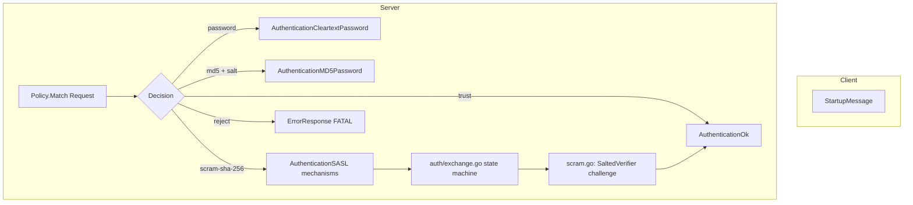

# Module: `internal/libpq`

The PostgreSQL **v3 wire protocol** implementation — the framing layer, message
types, and connection startup/authentication handshake. It is a faithful Go
port of PG's `src/backend/libpq` plus the `src/interfaces/libpq` message
constants, and it is what makes goopg a drop-in wire-compatible server for any
`psql`/JDBC/`pgx` client.

It is deliberately a **leaf protocol layer**: it knows nothing about SQL,
catalogs, or execution. Higher layers (`internal/postmaster`) drive the
connection lifecycle; the executor writes result rows through
`FrameWriter.DataRow*`; the replication streams use `replication.go`.
Package total: **4,093 LOC** across 10 production files (4 parent + 6 `auth/`).

## Key Files

| File | LOC | Role |
|------|-----|------|
| `messages.go` | 559 | Server→client message writers (`Write*` family: `WriteAuthenticationOk`, `WriteParameterStatus`, `WriteRowDescription`, `WriteDataRow`, `WriteCommandComplete`, `WriteReadyForQuery`, `WriteErrorResponse`, …). `FieldDescription`/`ErrorField` structs, `ShouldOutputToClient` filter. |
| `frame.go` | 331 | `FrameReader`/`FrameWriter`: the low-level framing (4-byte length prefix + type byte), startup packet, bounded message reading/writing, `DataRowScratch` pre-sizing. |
| `replication.go` | 250 | Replication-protocol framing helpers: `EncodeWALData`, `EncodeKeepalive`, `EncodeStandbyStatusUpdate`, `DecodeReplicationMessage`, `WALDataMessage`/`KeepaliveMessage`/`StandbyStatusUpdate` structs, pgTimestamp conversion. |
| `protocol.go` | 122 | Protocol constants: `ProtocolVersion3_0`, message type bytes (`MsgQuery`, `MsgParse`, `MsgBind`, `MsgExecute`, `MsgDataRow`, …), authentication codes (`AuthenticationOK`, `AuthenticationSASL`, …), transaction-status enums, `CancelRequestCode`, `MaxStartupPacketLength`/`MaxRegularMessageLength`. |
| `auth/auth.go` | 330 | `Policy` interface, `RuleSet`/`Rule`/`Request`/`Decision` structs; `DefaultPolicy`; pg_hba-style rule matching (`connTypeMatches`, `nameListMatches`, `addressMatches`); `Method*` constants. |
| `auth/exchange.go` | 320 | The auth exchange driver — decides which method to run and drives the challenge/response state machine. |
| `auth/scram.go` | 510 | SCRAM-SHA-256 server implementation (RFC 5802) — nonce/verifier exchange, `SaltedVerifier`, channel binding. |
| `auth/saslprep.go` | 145 | SASLprep string normalization (RFC 4013) — high-level API. |
| `auth/saslprep_tables.go` | 862 | SASLprep Unicode tables (prohibited characters, mapping categories). |
| `auth/parser.go` | 348 | pg_hba.conf parser — reads rules from file, builds `RuleSet`. |
| `auth/userstore.go` | 316 | Password/user store lookup (cleartext, MD5, SCRAM verifier) keyed by user/role. |

## Public API

### Framing (`frame.go`)

```go
func NewFrameReader(r io.Reader) *FrameReader
func NewFrameReaderWithLimit(r io.Reader, maxPayload int) *FrameReader
func (fr *FrameReader) ReadStartupPacket() (version uint32, payload []byte, err error)
func (fr *FrameReader) ReadFrame() (Frame, error)          // type byte + payload
func (fw *FrameWriter) WriteFrame(typ byte, payload []byte) error
func (fw *FrameWriter) WriteRaw(buf []byte) error
func (fw *FrameWriter) Flush() error
func (fw *FrameWriter) DataRowScratch(ncols int) (cells [][]byte, valueBuf []byte)
func (fw *FrameWriter) PutDataRowScratch(cells [][]byte)
func ParseStartupParameters(buf []byte) (map[string]string, error)
```

`FrameReader` exposes `OnBeforeRead`/`OnAfterRead` hooks wired by the postmaster
for `activity.ClientRead` wait-event tracking. `Frame` carries a `Payload` slice
borrowed from the reader's internal buffer — valid only until the next
`ReadFrame` call; callers that need it to outlive the next read must copy.

### Message writers (`messages.go`)

```go
func (fw *FrameWriter) WriteStartupMessage(params map[string]string) error
func (fw *FrameWriter) WriteQuery(sql string) error
func (fw *FrameWriter) WriteAuthenticationOk() error
func (fw *FrameWriter) WriteAuthenticationCleartextPassword() error
func (fw *FrameWriter) WriteAuthenticationMD5Password(salt [4]byte) error
func (fw *FrameWriter) WriteAuthenticationSASL(mechanisms []string) error
func (fw *FrameWriter) WriteAuthenticationSASLContinue(serverFirstMsg string) error
func (fw *FrameWriter) WriteAuthenticationSASLFinal(serverFinalMsg string) error
func (fw *FrameWriter) WriteParameterStatus(name, value string) error
func (fw *FrameWriter) WriteBackendKeyData(pid int32, secretKey int32) error
func (fw *FrameWriter) WriteReadyForQuery(status byte) error
func (fw *FrameWriter) ReadyForQuery() error
func (fw *FrameWriter) ReadyForQueryAfterError() error
func (fw *FrameWriter) WriteParseComplete()
func (fw *FrameWriter) WriteBindComplete()
func (fw *FrameWriter) WriteCloseComplete()
func (fw *FrameWriter) WritePortalSuspended()
func (fw *FrameWriter) WriteParameterDescription(paramOIDs []uint32)
func (fw *FrameWriter) WriteNoData()
func (fw *FrameWriter) WriteCopyInResponse(cols []FieldDescription, format byte)
func (fw *FrameWriter) WriteCopyOutResponse(cols []FieldDescription, format byte)
func (fw *FrameWriter) WriteCopyData(data []byte)
func (fw *FrameWriter) WriteCopyDone()
func (fw *FrameWriter) WriteErrorResponse(fields []ErrorField) error
func (fw *FrameWriter) WriteNoticeResponse(fields []ErrorField) error
func (fw *FrameWriter) WriteRowDescription(cols []FieldDescription) error
func (fw *FrameWriter) WriteDataRow(cells [][]byte) error
func (fw *FrameWriter) WriteDataRowReuse(cells [][]byte) error
func (fw *FrameWriter) WriteCommandComplete(tag string) error
func (fw *FrameWriter) WriteEmptyQueryResponse() error
func (fw *FrameWriter) WriteNotificationResponse(pid uint32, channel, payload string) error
func (fw *FrameWriter) WriteCopyBothResponse(cols []FieldDescription, format byte) error
```

### Auth policy (`auth/auth.go`)

```go
type Policy interface { MatchRequest(Request) Decision }
type Request struct{ ConnType; User, Database string; Remote net.IP }
type Decision struct{ Method Method; Options map[string]string; Rule Rule }
type RuleSet struct { rules []Rule }
func DefaultPolicy() *RuleSet
func (rs *RuleSet) Match(req Request) Decision
type Method int  // MethodTrust, MethodPassword, MethodMD5, MethodSCRAMSHA256, MethodReject, …
type ConnType int  // ConnLocal, ConnHost, ConnHostSSL, ConnHostNoSSL, ConnHostGSSEnc, …
```

### Replication (`replication.go`)

```go
const ReplMsgWALData byte = 'w' / ReplMsgKeepalive = 'k' / ReplMsgStandbyStatus = 'r' / ReplMsgHotStandbyFeedback = 'h'
func PgTimestampMicros(t time.Time) int64
func PgTimestampToTime(micros int64) time.Time
func EncodeWALData(startLSN, endLSN uint64, sendTime time.Time, walBytes []byte) []byte
func EncodeKeepalive(walEnd uint64, sendTime time.Time, replyRequested bool) []byte
func EncodeStandbyStatusUpdate(writeLSN, flushLSN, applyLSN uint64, sendTime time.Time, replyRequested bool) []byte
func DecodeReplicationMessage(payload []byte) (typ byte, msg any, err error)
type WALDataMessage struct{ StartLSN, EndLSN uint64; SendTime time.Time; Payload []byte }
type KeepaliveMessage struct{ WalEnd uint64; SendTime time.Time; ReplyRequested bool }
type StandbyStatusUpdate struct{ WriteLSN, FlushLSN, ApplyLSN uint64; SendTime time.Time; ReplyRequested bool }
```

## Internal structure

### Framing (`frame.go`)

```mermaid
flowchart TD
    subgraph Client
        CQ[WriteQuery / WriteStartupMessage]
    end
    subgraph Server
        FR[FrameReader]
        FR --> RSP[ReadStartupPacket → version + payload]
        FR --> RF[ReadFrame → Frame{Type, Payload}]
        FW[FrameWriter]
        FW --> WF[WriteFrame(type, payload)]
        FW --> DRS[DataRowScratch → pre-sized cells + valueBuf]
        FW --> F[Flush]
    end
```

Every v3 message is `[type byte][4-byte big-endian length including type][body]`.
The startup packet has NO leading type byte: `[4-byte length][4-byte
version][key-NUL-value-NUL]*[NUL]`. `FrameReader` enforces `maxStart`
(10,000 — `MaxStartupPacketLength`) and `maxRegul` (64 MB —
`MaxRegularMessageLength`) so an over-long message is rejected with
`ErrFrameTooLarge` instead of OOM'ing the process. `FrameWriter` buffers
through `bufio.Writer` and flushes on demand.

`DataRowScratch(ncols)` pre-sizes the row buffer so the common `SELECT` path
does not re-append per cell — returns `cells [][]byte` (pointers into
`valueBuf`) and `valueBuf []byte` (the contiguous scratch space). Callers
write column values into `valueBuf` and set `cells[i]` slices; `PutDataRowScratch`
reclaims the scratch for reuse.

### Message types (`protocol.go`)

Client→Server:

| Byte | Message | Payload |
|------|---------|---------|
| `Q` | MsgQuery | SQL string + NUL |
| `P` | MsgParse | prepared stmt name + SQL + param OIDs |
| `B` | MsgBind | portal name + stmt name + param formats + params + result formats |
| `D` | MsgDescribe | 'S'/'P' + name |
| `E` | MsgExecute | portal name + maxRows |
| `H` | MsgFlush | — |
| `S` | MsgSync | — |
| `C` | MsgClose | 'S'/'P' + name |
| `X` | MsgTerminate | — |
| `d` | MsgCopyData | raw bytes |
| `c` | MsgCopyDone | — |
| `f` | MsgCopyFail | error message + NUL |
| `p` | MsgPasswordMessage | password + NUL |

Server→Client:

| Byte | Message | Payload |
|------|---------|---------|
| `R` | MsgAuthentication | int32 method code + method-specific bytes |
| `S` | MsgParameterStatus | name NUL value NUL |
| `K` | MsgBackendKeyData | int32 PID + int32 secret key |
| `Z` | MsgReadyForQuery | byte txStatus (I/T/E) |
| `1` | MsgParseComplete | — |
| `2` | MsgBindComplete | — |
| `3` | MsgCloseComplete | — |
| `E` | MsgErrorResponse | field-set (S/V/C/M/D/H/P/W/…) |
| `N` | MsgNoticeResponse | field-set (same format as ErrorResponse) |
| `G` | MsgCopyInResponse | format + col count + per-col formats |
| `H` | MsgCopyOutResponse | format + col count + per-col formats |
| `W` | MsgCopyBothResponse | format + col count + per-col formats |
| `T` | MsgRowDescription | col count + per-col FieldDescriptions |
| `t` | MsgParameterDescription | param OID count + OIDs |
| `D` | MsgDataRow | col count + per-col length+value pairs |
| `d` | MsgCopyData | raw bytes (in CopyBoth) |
| `c` | MsgCopyDone | — |
| `C` | MsgCommandComplete | tag string + NUL |
| `s` | MsgPortalSuspended | — |
| `n` | MsgNoData | — |
| `I` | MsgEmptyQueryResponse | — |
| `A` | MsgNotificationResponse | int32 PID + channel NUL + payload NUL |

### Error fields (`messages.go`)

`ErrorField` maps to the protocol's field bytes: `FieldSeverity` (`S`),
`FieldSeverityNonLocal` (`V`), `FieldSQLState` (`C`), `FieldMessage` (`M`),
`FieldDetail` (`D`), `FieldHint` (`H`), `FieldPosition` (`P`),
`FieldWhere` (`W`), `FieldSchema` (`s`), `FieldTable` (`t`),
`FieldColumn` (`c`), `FieldFile` (`F`), `FieldLine` (`L`),
`FieldRoutine` (`R`). `ShouldOutputToClient` reproduces PG's
`should_output_to_client` filtering on `client_min_messages` (elevel ceiling):
ERROR/FATAL/PANIC always send, INFO always sends, and the `error` ceiling (21)
is cleared unconditionally (the single-emitter pattern from `elog.c`).

### Replication framing (`replication.go`)

Inside CopyData frames during streaming replication:

```
Server→Client: 'w' | startLSN(8) | endLSN(8) | sendTime(8) | walBytes...
Server→Client: 'k' | walEnd(8) | sendTime(8) | replyRequested(1)
Client→Server: 'r' | writeLSN(8) | flushLSN(8) | applyLSN(8) | sendTime(8) | replyRequested(1)
Client→Server: 'h' | applyLSN(8) | applyTime(8) | catalogXmin(4) | epoch(4)   (deferred)
```

`s`endTime` is microseconds since 2000-01-01 UTC (`pgEpoch`), matching
upstream's `TimestampTz`. `DecodeReplicationMessage` dispatches on the inner
type byte and returns the decoded struct. `EncodeWALData`/`EncodeKeepalive`/
`EncodeStandbyStatusUpdate` build the raw payload bytes.

### Auth subsystem (`auth/`)



`auth/auth.go` implements the policy/RuleSet model: a `Request{ConnType, User,
Database, Address}` is matched against pg_hba-style rules (host/local + address +
user/database lists + method), producing a `Decision` naming the auth method.
`auth/exchange.go` drives the wire exchange; `auth/scram.go` implements
SCRAM-SHA-256 (RFC 5802) with `SaltedVerifier`, nonce, and channel binding;
`auth/saslprep.go` normalizes SASLprep (RFC 4013); `auth/parser.go` parses
`pg_hba.conf`; `auth/userstore.go` looks up stored credentials (cleartext, MD5
hash, SCRAM verifier) keyed by user/role.

## Dependencies

- **Used by** — `internal/postmaster` (connection accept + protocol loop),
  `internal/replication` (walsender framing), `internal/executor`
  (`client_min_messages` filtering hook).
- **Uses** — `internal/utils/misc` (GUC values), `internal/utils/errcodes`
  (SQLSTATE constants). `auth/` uses `internal/crypto`-style primitives only if
  needed for SCRAM/MD5; it avoids importing higher layers.

## Notable patterns / gotchas

- **Length-prefix discipline** — every v3 message is `[type][4-byte len][body]`.
  `WriteFrame` computes the length from the payload; `DataRowScratch` pre-sizes
  the row buffer so the common `SELECT` path does not re-append per cell.

- **`maxPayload` guard** — `NewFrameReaderWithLimit` bounds message size; a
  client sending a multi-GB message is rejected with `ErrFrameTooLarge` rather
  than exhausting memory. Startup packets are limited to 10,000 bytes; regular
  messages to 64 MB.

- **Auth order matters** — the startup packet is read *before* the connection
  is fully accepted; `ReadStartupPacket` returns the protocol version so
  `postmaster` can reject pre-v3 clients and answer `CancelRequestCode`.

- **`Frame.Payload` is borrowed** — the payload slice points into the reader's
  internal buffer and is only valid until the next `ReadFrame`. Callers must
  copy if they need it to outlive the next read — this is the #1 source of
  data-corruption bugs in new protocol handlers.

- **Client-min-messages** — `WriteNoticeResponse` consults
  `ShouldOutputToClient` through a per-connection hook, not at every call site;
  ERROR/FATAL/PANIC always send, INFO always sends, and the `error` ceiling
  (21) is cleared unconditionally (the single-emitter pattern from `elog.c`).

- **`WriteQuery` appends trailing NUL** — the simple-query 'Q' frame requires
  the SQL string to be NUL-terminated. `WriteQuery` adds it automatically,
  matching upstream's protocol.

- **`WriteStartupMessage` vs `WriteFrame`** — startup packets have no leading
  type byte and use a different framing (length includes the 4-byte version,
  not a type byte). `WriteStartupMessage` handles this separately from the
  regular `WriteFrame` path.

- **pgEpoch is 2000-01-01 UTC** — replication timestamps are microseconds since
  this epoch, not Go's standard epoch (1970). `PgTimestampMicros`/`PgTimestampToTime`
  provide the conversion.

- **Replication inner-message type bytes** — the first byte of a CopyData
  payload during streaming replication is NOT a protocol message type byte but
  an inner replication type (`'w'`/`'k'`/`'r'`/`'h'`). `DecodeReplicationMessage`
  dispatches on these.

- **`WriteDataRowReuse`** — reuses the `[numCols][4-byte-len][value]…` format
  but with caller-supplied slices; used by the executor's batch path to avoid
  allocating per-row metadata while the row data is already in the value buffer.

- **`ErrFrameTooLarge` is a sentinel** — returned by `ReadFrame` when the
  payload exceeds the configured limit. The postmaster drains the oversized
  frame to resync the stream, then emits `08P01`.