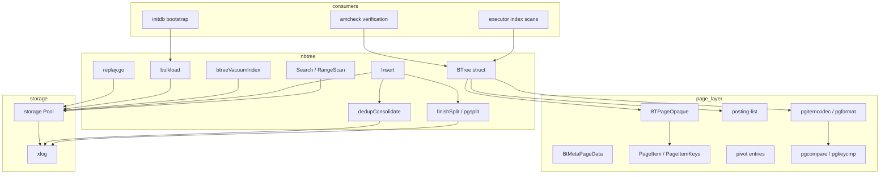
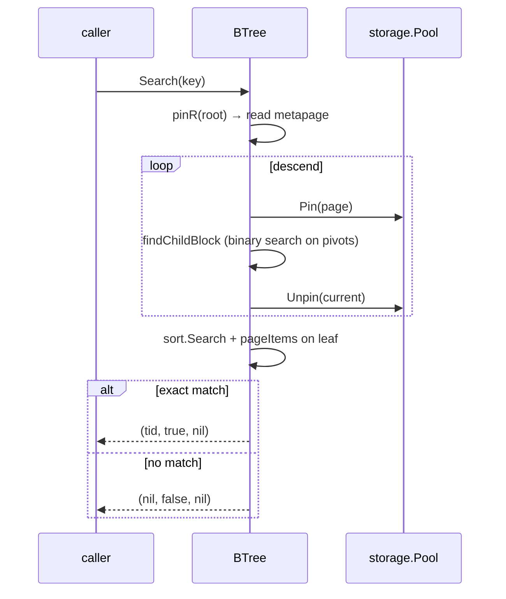
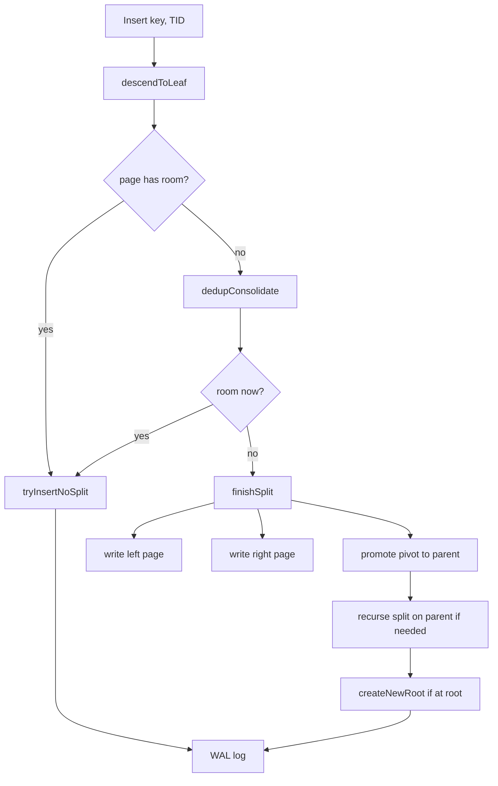

# Module: `internal/access/nbtree`

The **B-tree index access method** — a faithful port of PostgreSQL's
`nbtree` (`src/backend/access/nbtree/`). It implements search, insert, page
split, deduplication, posting-list compression, and WAL-logged mutations, all
in a **PG-18 byte-identical on-disk format** (8 KiB pages, BTPageOpaque layout,
pivot / posting-list items, `BtMetaPageData`).

This is the index layer that `CREATE INDEX` builds, `SELECT`/`UPDATE`/`DELETE`
scans, and VACUUM purges dead entries from. All operator-facing code paths
(`indexScanOp`, `indexOnlyScanOp`, UPSERT arbiter, FK probes) route through
`BTree.Search` / `RangeScan`.



## Key Files

| File | LOC | Role |
|---|---|---|
| `btree.go` | 4,227 | `BTree` struct: `Open`/`OpenWithOptions`/`Create`/`Search`/`Insert`/`RangeScan`/`RangeScanWithPos`, page pinning (`pinR`/`pinW`), descent (`descendToLeaf`), split (`finishSplit`/`createNewRoot`/`refillDeduplicated`), dedup (`dedupConsolidate`), page-item iteration (`pageItems`/`PageItemKeys`) |
| `btree_vacuum.go` | 1,508 | Index vacuum: `btreeVacuumIndex`, `readInternalFirstChildBlock`, dead-item cleanup |
| `bulkload.go` | 835 | Bulk-load construction (`bulkload` / `buildBulkLoadTree`) for `CREATE INDEX` and sorted inserts |
| `pgtuple.go` | 748 | Tuple encoding/decoding: `PGBTItemRaw`/`PGBTPivotRaw`, key-at-prefix, posting-list entry marshal |
| `replay.go` | 601 | WAL redo replay for btree opcodes (insert, split, dedup, delete, newroot, mark-page-halfdead, unlink-page, vacuum, meta-cleanup, reuse-page) |
| `pgcompare_types.go` | 568 | Per-type key comparison functions (int4, int8, int128, numeric, varchar, char, timestamp, float8, oid, uuid, inet, enum, text, bpchar, bytea, date, time, timetz) |
| `posting.go` | 396 | Posting-list helpers: `SwapPosting`, `PGBTPostingRaw`, `PostingLen`, `PostingDecode`, `PostingEncode` |
| `pgsplitleft.go` | 374 | Left split page construction (`pgsplitleft`, posting-aware refill) |
| `pgpage.go` | 343 | B-tree page opaque data (`BTPageOpaque`), line-pointer helpers, `PageItemID`/`PGBTCycleId` |
| `pgcompare.go` | 332 | Key comparison dispatch: `CompareKeys`, `indexFormat.compare` |
| `pgitemcodec.go` | 278 | Item codec: `encodeItem`/`decodeItem`, `itemEncodedSize`, key-datum flattener, suffix truncation |
| `pgformat.go` | 265 | Index format descriptors: `indexFormat` with `pageItems`/`parse`/`compare`/`encode`/`decode` by type family |
| `pgkeycmp.go` | 262 | Key-at-prefix comparison for dedup and split |
| `pgtruncate.go` | 216 | Tree truncation (`pgtruncate`) |
| `pgdelete.go` | 207 | LP_DEAD deletion pass (`pgdelete`) |
| `pgpagedel.go` | 148 | Page deletion (`pgpagedel`) |
| `pgnewroot.go` | 144 | New-root creation (`pgnewroot`) |
| `pgsplit.go` | 108 | Split-point selection (`pgsplit`) |
| `dead_purge.go` | 103 | Dead-item purge |
| `lpdead_kill.go` | 80 | `killTID` / `killRange` for LP_DEAD entry reuse |
| `latch_release.go` | 79 | Latch-based page-lock release for concurrent access |
| `parse_err_dump.go` | 79 | Page-dump helper for corrupt-page diagnostics |

## Public API

```go
func Open(pool *storage.Pool, rel storage.RelFileNode) (*BTree, error)
func OpenWithOptions(pool *storage.Pool, rel storage.RelFileNode, opts Options) (*BTree, error)
func Create(pool *storage.Pool, rel storage.RelFileNode) (*BTree, error)   // CREATE INDEX
func (bt *BTree) Search(key []byte) (storage.ItemPointer, bool, error)   // point lookup
func (bt *BTree) Insert(key []byte, ptr storage.ItemPointer) error
func (bt *BTree) RangeScan(lo, hi []byte, fn func(key, ptr) bool) error
func (bt *BTree) RangeScanWithPos(lo, hi []byte, loExclusive, hiExclusive bool, ...) error
func (bt *BTree) BtreeVacuumIndex(pool, vis, ctx) error
func (bt *BTree) Bulkload(sortedKeys []BulkloadEntry) error
type Options struct{ FillFactor int; DeduplicateItems *bool; FastUpdate *bool; ... }
```

## Internal structure

### Page layout

Each page is 8 KiB with a `BTPageOpaque` at `SizeOfPageHeaderData` (24 bytes)
carrying:

- `btpo_flags` (leaf/root/meta/half-dead/deleted/has-garbage) — `BTPageOpaque` 
  uses bit flags: `BTP_LEAF` (0x01), `BTP_ROOT` (0x02), `BTP_META` (0x04),
  `BTP_HALF_DEAD` (0x08), `BTP_DELETED` (0x10), `BTP_HAS_GARBAGE` (0x20)
- `btpo_prev`/`btpo_next` — sibling links at the same level (left/right)
- `btpo_level` — 0 for leaf, 1+ for internal
- `btpo_cycleid` — vacuum cycle id for concurrent page deletion safety

The metapage (block 0) carries:

```go
type BtMetaPageData struct {
    magic     uint32 // BTreeMagic = 0x0539
    version   uint32 // BTreeVersion = 4
    root      BlockNumber
    level     uint32
    fastroot  BlockNumber // search fast root hint
    fastlevel uint32
}
```

`SizeOfBTPageOpaque = 16` bytes. `pageItems` iterates the line-pointer array
starting after the opaque, returning `PageItem` (key + TID or posting list).

### Search

`Search` descends from the root by `findChildBlock` (binary search on the
internal page's high-key/pivot items) to a leaf, then `sort.Search` +
`pageItems` to find the exact entry. Posting-list entries are expanded into
individual `(key, TID)` pairs by `pageItems`. `RangeScan` walks the leaf chain
left-to-right via `btpo_next` siblings, calling the callback for each entry.



### Insert

`Insert` descends to a leaf, `insertItemSorted` binary-searches the insertion
point, and calls `tryInsertNoSplit` (append to existing page) or `finishSplit`
(split the page, promote the pivot). `dedupConsolidate` runs opportunistic
deduplication before splitting. The insert-with-unique-check path (used by
UPSERT arbiter and FK) calls `Search` first to detect duplicates, then
`Insert` only if the key is unique.



### Split

A page split produces a left page, right page, and a high-key pivot promoted to
the parent. `pgsplit`/`pgsplitleft` select the split point (`compactSplitLoc`)
by examining the leaf items and choosing a pivot that evenly distributes keys.
`finishSplit` writes the new halves and recurses up the tree. Posting-list
items are refilled by `refillDeduplicated` during the split.

### Posting lists

A posting list packs multiple heap TIDs under one key (`PGBTPostingRaw`).
`appendSorted` appends TIDs; `SwapPosting` exchanges TIDs during
insert-into-posting. Dedup (`dedupConsolidate`) collapses same-key items into
postings. `PostingEncode`/`PostingDecode` handle the binary format.

### Key encoding

`pgformat.go` dispatches per-type encoders/decoders (`EncodeInt4`,
`EncodeVarchar`, `EncodeNumericKey`, `EncodeTimestamp`, `EncodeUUID`,
`EncodeInet`, `EncodeEnum`, etc.). The key format is PG-identical (4-byte
prefix + datum bytes). `pgitemcodec.go` handles the item encoding:
`encodeItem` takes a `(key, TID)` pair and produces the on-disk bytes;
`decodeItem` reverses it. Suffix truncation (`encodeItem` with allowTrunc)
shortens pivot keys on internal pages.

### Comparators

`CompareKeys` uses the `indexFormat.compare` function, which delegates to
per-type comparators in `pgcompare_types.go` (family-ordered: int4, int8,
int128, numeric, varchar, …). `pgkeycmp.go` implements key-at-prefix
comparison for dedup (where the key is a prefix of the full key) and for
split-point selection.

### Bulk load

`bulkload.go` constructs a sorted B-tree from sorted input, building pages
bottom-up during `CREATE INDEX` and `B-tree bulk inserts` (e.g., CREATE INDEX
on a populated table). `buildBulkLoadTree` allocates leaf pages, fills them
with sorted entries, then constructs internal pages from the leaf high-keys.

### Vacuum

`btreeVacuumIndex` walks the entire index tree, identifies dead entries
(leaf items whose TIDs point to dead heap tuples, per the visibility map),
and marks them LP_DEAD. `pgdelete` performs the actual deletion of LP_DEAD
items within a page. `dead_purge.go` removes dead entries from the page's
line-pointer array. `lpdead_kill.go` reuses the freed slot for future inserts.

### WAL redo

`replay.go` handles all btree WAL opcodes: insert, split upper, split left,
dedup, delete, newroot, mark-page-halfdead, unlink-page, vacuum, meta-cleanup,
reuse-page. Each `replay*` function re-creates the exact page state the primary
wrote, including pd_lsn stamping.

## Dependencies

- **Used by** — `internal/executor` (index scans, DML, UPSERT, FK),
  `internal/initdb` (bootstrap index construction), `internal/access/amcheck`
  (verification), `internal/storage` (buffer-pool integration).
- **Uses** — `internal/storage` (buffer pool, pages, page I/O), `internal/access/transam`
  (visibility, xid), `internal/catalog` (type/opclass lookup for key encoding),
  `internal/utils/misc` (GUCs).

## Notable patterns / gotchas

- **PG-identical format** — the page/tuple/opaque format matches PG 18.3
  byte-for-byte (block 0 = metapage `BTreeMagic=0x0539`, `BTreeVersion=4`,
  `SizeOfBTPageOpaque=16`). A vanilla PG standby can read a goopg-authored
  btree index (and vice versa).
- **Posting-list expansion** — `pageItems` expands posting lists into individual
  `(key, TID)` pairs; `PageItemKeys` returns the raw keys (one per posting).
  Callers expecting per-TID entries must handle expansion; callers verifying
  key order must use `PageItemKeys`.
- **Dedup** — dedup is triggered before a split (`dedupConsolidate`); it is
  opportunistic and non-blocking. The dedup-on-write ordering: first try the
  page, then dedup, then split.
- **Key-at-prefix** — `pgkeycmp.go` supports suffix-truncated keys (the
  "key-at-prefix" optimization) for internal pages, where the high key is a
  prefix of the full key.
- **WAL redo** — `replay.go` handles all btree WAL opcodes (insert, split upper,
  split left, dedup, delete, newroot, mark-page-halfdead, unlink-page, vacuum,
  meta-cleanup, reuse-page). The redo path must be byte-identical to the
  primary's mutation — the S21b milestone closed the opcode coverage gap.
- **Bulk load** — `bulkload.go` constructs a sorted B-tree from sorted input,
  building pages bottom-up during `CREATE INDEX` and `B-tree bulk inserts`.
  The bulk-load path does NOT WAL-log individual page mutations; it logs the
  whole index creation as a single smgr-create record.
- **Fast-path** — `tryInsertOnCachedRightmost` caches the rightmost leaf for
  monotonic insert sequences (e.g., `INSERT INTO t VALUES (generate_series(1,N))`),
  skipping the root-to-leaf descent.
- **`pinR`/`pinW`** — read pins (`pinR`) are shared; write pins (`pinW`) are
  exclusive. The descent holds read pins on ancestors and releases them as it
  descends (no lock coupling). The split path holds write pins on the splitting
  page and its parent simultaneously.
- **Vacuum dead-item safety** — `btreeVacuumIndex` uses the visible map and
  `oldestXmin` to determine which TIDs are definitely dead; `dead_purge.go`
  removes only those entries. The `btpo_cycleid` field prevents concurrent
  vacuums from deleting the same page.
- **`pgnewroot` vs `createNewRoot`** — `pgnewroot` is the WAL redo replay
  function; `createNewRoot` is the primary path. Both produce the same page
  state, but `createNewRoot` also handles the metapage update.
- **Btree-vacuum WAL** — `EncodeBtreeVacuum` writes the kept items (not the
  deleted ones) plus the opaque flags, so the redo path can reconstruct the
  post-vacuum page state without knowing what was deleted.