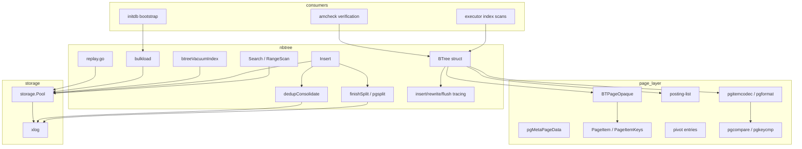
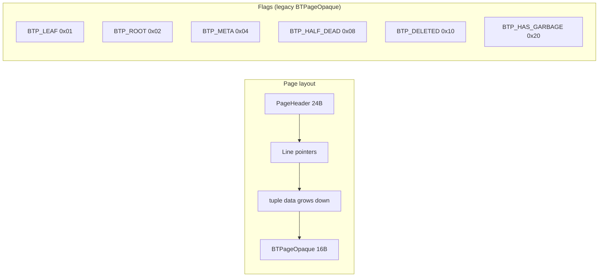
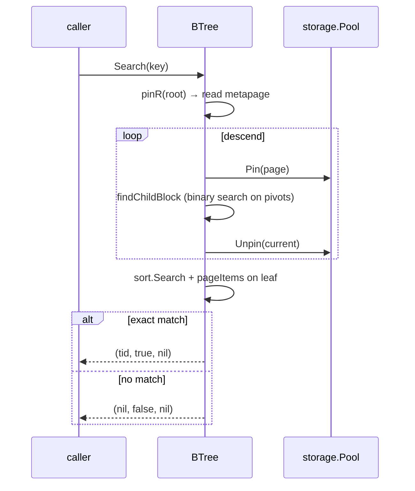
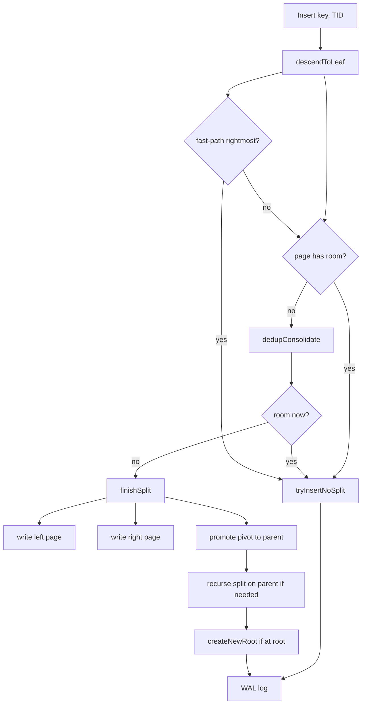
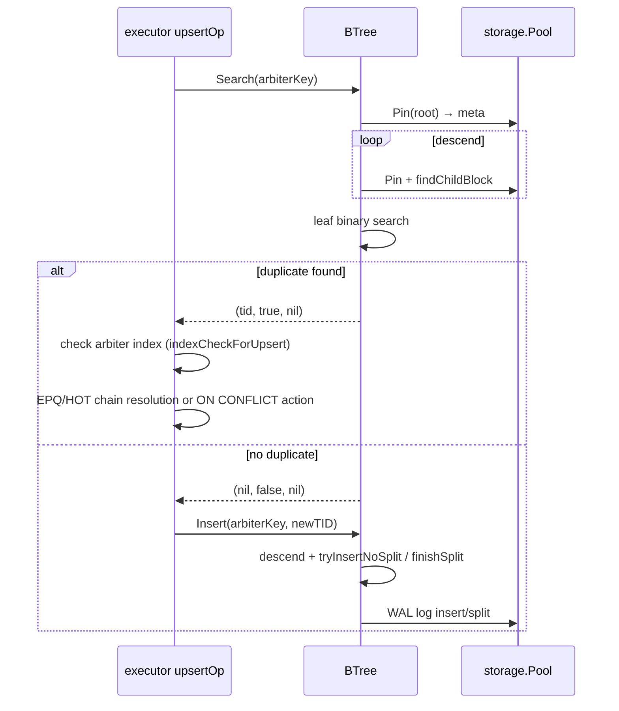
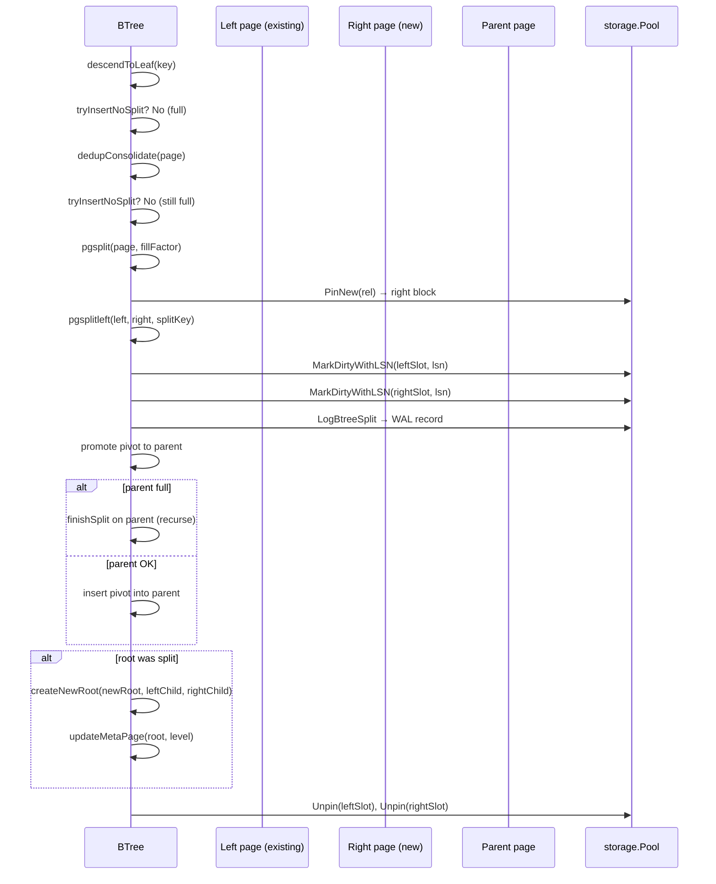

# Module: `internal/access/nbtree`

The **B-tree index access method** — a faithful port of PostgreSQL's
`nbtree` (`src/backend/access/nbtree/`). It implements search, insert, page
split, deduplication, posting-list compression, and WAL-logged mutations, all
in a **PG-18 byte-identical on-disk format** (8 KiB pages, BTPageOpaque layout,
pivot / posting-list items, `pgMetaPageData`).

This is the index layer that `CREATE INDEX` builds, `SELECT`/`UPDATE`/`DELETE`
scans, and VACUUM purges dead entries from. All operator-facing code paths
(`indexScanOp`, `indexOnlyScanOp`, UPSERT arbiter, FK probes) route through
`BTree.Search` / `RangeScan`.



## Key Files

| File | LOC | Role |
|---|---|---|
| `btree.go` | 4,227 | `BTree` struct: `Open`/`OpenWithOptions`/`Create`/`Search`/`Insert`/`RangeScan`/`RangeScanWithPos`, page pinning (`pinR`/`pinW`), descent (`descendToLeaf`), split (`finishSplit`/`createNewRoot`/`refillDeduplicated`), dedup (`dedupConsolidate`), page-item iteration (`pageItems`/`PageItemKeys`), block recycling (`pinNewOrRecycled`/`recycleBlock`/`popRecycledBlock`), `Options` |
| `btree_vacuum.go` | 1,508 | Index vacuum: `btreeVacuumIndex`, `readInternalFirstChildBlock`, dead-item cleanup |
| `bulkload.go` | 835 | Bulk-load construction (`bulkload` / `bulk-load tree built`) for `CREATE INDEX` and sorted inserts |
| `pgtuple.go` | 748 | Tuple encoding/decoding: `PGBTItemRaw`/`PGBTPivotRaw`, key-at-prefix, posting-list entry marshal |
| `replay.go` | 601 | WAL redo replay for btree opcodes (insert, split, dedup, delete, newroot, mark-page-halfdead, unlink-page, vacuum, meta-cleanup, reuse-page) |
| `pgcompare_types.go` | 568 | Per-type key comparison functions (int4, int8, int128, numeric, varchar, char, timestamp, float8, oid, uuid, inet, enum, text, bpchar, bytea, date, time, timetz) |
| `posting.go` | 396 | Posting-list helpers: `SwapPosting`, `PGBTPostingRaw`, `postingBounds`, `parsePostingRaw`, `marshalPosting` |
| `pgsplitleft.go` | 374 | Left split page construction (`pgsplitleft`, posting-aware refill) |
| `pgpage.go` | 343 | B-tree page opaque data (`BTPageOpaque`), line-pointer helpers, `item pointer / line pointer`/`btpo_cycleid field` |
| `pgcompare.go` | 332 | Key comparison dispatch: `CompareKeys`, `indexFormat.compare` |
| `pgitemcodec.go` | 278 | Item codec: `encodeItem`/`decodeItem`, `itemEncodedSize`, key-datum flattener, suffix truncation |
| `pgformat.go` | 265 | Index format descriptors: `indexFormat` with `pageItems`/`parse`/`compare`/`encode`/`decode` by type family |
| `pgkeycmp.go` | 262 | Key-at-prefix comparison for dedup and split |
| `pgtruncate.go` | 216 | Tree truncation (`pgtruncate`) |
| `pgdelete.go` | 207 | LP_DEAD deletion pass (`pgdelete`) |
| `pgpagedel.go` | 148 | Page deletion (`pgpagedel`) |
| `pgnewroot.go` | 144 | New-root creation (`pgnewroot`) |
| `pgsplit.go` | 108 | Split-point selection (`pgsplit`) |
| `dead_purge.go` | 103 | Dead-item purge |
| `lpdead_kill.go` | 80 | `KillItems` / `KillItems` for LP_DEAD entry reuse |
| `latch_release.go` | 79 | Latch-based page-lock release for concurrent access |
| `parse_err_dump.go` | 79 | Page-dump helper for corrupt-page diagnostics |

## Public API

```go
func Open(pool *storage.Pool, rel storage.RelFileNode) (*BTree, error)
func OpenWithOptions(pool *storage.Pool, rel storage.RelFileNode, opts Options) (*BTree, error)
func Create(pool *storage.Pool, rel storage.RelFileNode) (*BTree, error)   // CREATE INDEX
func (bt *BTree) Search(key []byte) (storage.ItemPointer, bool, error)   // point lookup
func (bt *BTree) Insert(key []byte, ptr storage.ItemPointer) error
func (bt *BTree) RangeScan(lo, hi []byte, fn func(key, ptr) bool) error
func (bt *BTree) RangeScanWithPos(lo, hi []byte, loExclusive, hiExclusive bool, ...) error
func (bt *BTree) VacuumIndexPages(pool, vis, ctx) error
func (bt *BTree) BulkCreate(sortedKeys []BulkCreateEntry) error
type Options struct{ FillFactor int; DeduplicateItems *bool; FastUpdate *bool; ... }
func (bt *BTree) Format() IndexFormat
func (bt *BTree) Stats() BTreeStats / ResetStats() / RecycledPageCount() int
func (bt *BTree) FastPathViolations() []FastPathViolation

// Key/type encoders (btree.go, pgcompare_types.go)
func EncodeInt4(key int32) []byte / DecodeInt4(b []byte) (int32, error)
func EncodeInt8(key int64) []byte / DecodeInt8(b []byte) (int64, error)
func EncodeInt128(hi int64, lo uint64) []byte
func EncodeNumericKey(mantissa *big.Int, scale int16) []byte
func DecodeNumericKey(b []byte) (mantissa *big.Int, scale int16, n int, error)
func EncodeVarchar(payload []byte) []byte / DecodeVarchar(b []byte) ([]byte, error)
func EncodeChar(payload []byte) []byte
func EncodeTimestamp(microsSince2000 int64) []byte / DecodeTimestamp(b) (int64, error)
func EncodeFloat8(key float64) []byte / DecodeFloat8(b []byte) (float64, error)
func CompareKeys(a, b []byte) int

// PG-format item/opaque helpers (pgformat.go, pgpage.go, pgtuple.go)
const SizeOfBTPageOpaquePG = 16
const SizeOfBTMetaPageDataPG = 48
func ReadPGOpaque(p storage.Page) PGBTPageOpaque / WritePGOpaque(p, o)
func InitPGBTPage(p storage.Page) error
func ReadPGMetaPage(p storage.Page) PGBTMetaPage / WritePGMetaPage(p, m)
func InitPGMetaPage(p storage.Page, root BlockNumber, level uint32, allEqualImage bool) error
func CheckPGBTPage(p storage.Page, block BlockNumber) error
func PGBTItemRaw(key []byte, tid storage.ItemPointer) []byte
func PGBTPivotRaw(key []byte, child BlockNumber) []byte
func PGFirstDataKey(op PGBTPageOpaque) uint16
func PGDataItemCount(p storage.Page) (int, error)
func PGHighKeyRaw(p storage.Page) ([]byte, bool, error)
func pgSlideLeft(p storage.Page) error
func pgWriteNextSibling(p storage.Page, op, newNext BlockNumber) error
func MaxAlign(n int) int / MaxAlignDown(n int) int

// PG-format tuple comparison (pgcompare.go)
type PGAttrComparator func(a, b []byte) int
type PGKeyAttr struct{ ... }
type PGIndexKeyDesc struct{ ... }
func (d *PGIndexKeyDesc) NKeyAtts() int / Physical() []PGIndexAttr
func ComparePGIndexTuples(desc *PGIndexKeyDesc, a, b []byte) (int, error)
func ComparePGIndexTupleKeyAttrs(desc *PGIndexKeyDesc, a, b []byte) (int, error)
func PGCompareBytewise(a, b []byte) int
func compareItemPointers(a, b storage.ItemPointer) int

// Posting lists (posting.go, pgitemcodec.go)
func SwapPosting(p []byte, i, j int)
func PGBTPostingRaw(key []byte, tids []storage.ItemPointer) []byte
func postingBounds(raw []byte) int / parsePostingRaw(raw) / marshalPosting(...)
type LeafEntry struct{ Key []byte; Tid storage.ItemPointer }
type LeafItem struct{ ... }
type Downlink struct{ ... }
```

## Internal structure

### Page layout

Each page is 8 KiB with a `BTPageOpaque` at `SizeOfPageHeaderData` (24 bytes)
carrying:

- `btpo_flags` (leaf/root/meta/half-dead/deleted/has-garbage) — `BTPageOpaque` 
  uses bit flags: `BTP_LEAF` (0x01), `BTP_ROOT` (0x02), `BTP_META` (0x04),
  `BTP_HALF_DEAD` (0x08), `BTP_DELETED` (0x10), `BTP_HAS_GARBAGE` (0x20)
- `btpo_prev`/`btpo_next` — sibling links at the same level (left/right)
- `btpo_level` — 0 for leaf, 1+ for internal
- `btpo_cycleid` — vacuum cycle id for concurrent page deletion safety

The PG-format opaque (`PGBTPageOpaque`) spells its flags differently — a
field named `Flags` carries the upstream `BTP_*` set: `BTPLeaf=1<<0`,
`BTPRoot=1<<1`, `BTPDeleted=1<<2`, `BTPMeta=1<<3`, `BTPHalfDead=1<<4`,
`BTPSplitEnd=1<<5`, `BTPHasGarbage=1<<6`, `BTPIncompleteSplit=1<<7`,
`BTPHasFullXID=1<<8`. **These two flag sets are NOT interchangeable**:
the legacy `BTHasHighKey` (0x0008) collides with upstream `BTP_META`, and
`BTIncompleteSplit`/`BTHalfDead` are swapped relative to `BTP_HALF_DEAD`/
`BTP_SPLIT_END`. Only `BTP_LEAF`/`BTP_ROOT`/`BTP_DELETED`/`BTP_HAS_GARBAGE`
happen to agree. Sibling links use `PNone = 0` (not
`InvalidBlockNumber`) because block 0 is the metapage and can never be a
sibling.

The metapage (block 0) carries:

```go
type pgMetaPageData struct {
    magic     uint32 // BTreeMagic = 0x0539
    version   uint32 // BTreeVersion = 4
    root      BlockNumber
    level     uint32
    fastroot  BlockNumber // search fast root hint
    fastlevel uint32
}
```

`SizeOfBTPageOpaque = 16` bytes. `pageItems` iterates the line-pointer array
starting after the opaque, returning `PageItem` (key + TID or posting list).
`MaxItemsPerPage = (BlockSize - 24) / (4 + SizeOfIndexTupleData)` bounds the
line-pointer array.



### Search

`Search` descends from the root by `findChildBlock` (binary search on the
internal page's high-key/pivot items) to a leaf, then `sort.Search` +
`pageItems` to find the exact entry. Posting-list entries are expanded into
individual `(key, TID)` pairs by `pageItems`. `RangeScan` walks the leaf chain
left-to-right via `btpo_next` siblings, calling the callback for each entry.



### Insert

`Insert` descends to a leaf, `insertItemSorted` binary-searches the insertion
point, and calls `tryInsertNoSplit` (append to existing page) or `finishSplit`
(split the page, promote the pivot). `dedupConsolidate` runs opportunistic
deduplication before splitting. The insert-with-unique-check path (used by
UPSERT arbiter and FK) calls `Search` first to detect duplicates, then
`Insert` only if the key is unique.

Block allocation is recycling-aware: `pinNewOrRecycled` prefers a block from
the `recycleHorizon` pool (`popRecycledBlock`), falling back to `pinNewLocked`
for a fresh extension. `recycleHorizon` reads `nextSafeXid` and the oldest
visible XID so a recycled block can never resurrect a tuple a concurrent
snapshot might still see.



### Split

A page split produces a left page, right page, and a high-key pivot promoted to
the parent. `pgsplit`/`pgsplitleft` select the split point (`compactSplitLoc`)
by examining the leaf items and choosing a pivot that evenly distributes keys.
`finishSplit` writes the new halves and recurses up the tree. Posting-list
items are refilled by `refillDeduplicated` during the split.

The split writes the left half first, then the right half with the sibling
link rewired (`pgWriteNextSibling`), then a WAL split record carrying both
halves plus the promoted item. The leftmost page's high key is reserved by
`pgReserveHiKeySlot`; `pgPromoteToNonRightmost` converts a rightmost page's
layout when it gains a right sibling.

### Posting lists

A posting list packs multiple heap TIDs under one key (`PGBTPostingRaw`).
`appendSorted` appends TIDs; `SwapPosting` exchanges TIDs during
insert-into-posting. Dedup (`dedupConsolidate`) collapses same-key items into
postings. `marshalPosting`/`parsePostingRaw` handle the binary format.

The posting-list binary layout: `[4-byte total size][key length varint][key
bytes][4-byte TID count][TIDs × 6 bytes]`. `postingBounds` reads the total size
without decoding the whole body; `SwapPosting` reorders TIDs in place when a
new TID must be inserted mid-list.

### Key encoding

`pgformat.go` dispatches per-type encoders/decoders (`EncodeInt4`,
`EncodeVarchar`, `EncodeNumericKey`, `EncodeTimestamp`, `UUID key encode`,
`inet key encode`, `enum key encode`, etc.). The key format is PG-identical (4-byte
prefix + datum bytes). `pgitemcodec.go` handles the item encoding:
`encodeItem` takes a `(key, TID)` pair and produces the on-disk bytes;
`decodeItem` reverses it. Suffix truncation (`encodeItem` with allowTrunc)
shortens pivot keys on internal pages.

The numeric key format (`EncodeNumericKey`) serializes a `big.Int` mantissa +
int16 scale into PG's `numeric_key` btree representation so key ordering by
bytes.Compare matches PG's numeric ordering exactly. Timestamps are encoded
as int64 microseconds since the 2000-01-01 epoch (same convention as
replication timestamps).

### Comparators

`CompareKeys` uses the `indexFormat.compare` function, which delegates to
per-type comparators in `pgcompare_types.go` (family-ordered: int4, int8,
int128, numeric, varchar, …). `pgkeycmp.go` implements key-at-prefix
comparison for dedup (where the key is a prefix of the full key) and for
split-point selection.

The PG-format tuple comparator lives in `pgcompare.go`: `PGIndexKeyDesc`
holds the per-attribute `PGKeyAttr` descriptors (comparator + null ordering),
and `ComparePGIndexTuples` compares two marshaled index tuples
attribute-by-attribute, treating heap TIDs as the tiebreaker.
`compareItemPointers` is the final comparison on equal keys.

### Bulk load

`bulkload.go` constructs a sorted B-tree from sorted input, building pages
bottom-up during `CREATE INDEX` and `B-tree bulk inserts` (e.g., CREATE INDEX
on a populated table). `bulk-load tree built` allocates leaf pages, fills them
with sorted entries, then constructs internal pages from the leaf high-keys.
The bulk-load path does NOT WAL-log individual page mutations; it logs the
whole index creation as a single smgr-create record.

### Vacuum

`btreeVacuumIndex` walks the entire index tree, identifies dead entries
(leaf items whose TIDs point to dead heap tuples, per the visibility map),
and marks them LP_DEAD. `pgdelete` performs the actual deletion of LP_DEAD
items within a page. `dead_purge.go` removes dead entries from the page's
line-pointer array. `lpdead_kill.go` reuses the freed slot for future inserts.
`pgpagedel.go` handles whole-page deletion (the half-dead → deleted
transition guarded by `btpo_cycleid`).

### WAL redo

`replay.go` handles all btree WAL opcodes: insert, split upper, split left,
dedup, delete, newroot, mark-page-halfdead, unlink-page, vacuum, meta-cleanup,
reuse-page. Each `replay*` function re-creates the exact page state the primary
wrote, including pd_lsn stamping.

### Tracing / diagnostics

`btree.go` carries a lightweight tracing system for concurrency debugging:
`InsertLogRecord`, `RewriteLogEvent`, `FlushSnapshotEvent`, `ReloadSnapshotEvent`,
`BufmapEvent`, and `ContentMuEvent` record per-block lifecycle events. Methods
like `InsertLogRecordsForBlockAfter`, `FlushSnapshotRecordsForBlock`,
`CheckBufmapExclusivity`, and `FastPathViolations` expose them so a stress-test
harness can replay and verify that no two goroutines contended on the same page
with stale content.

## Key flow: UPSERT arbiter duplicate check



## Dependencies

- **Used by** — `internal/executor` (index scans, DML, UPSERT, FK),
  `internal/initdb` (bootstrap index construction), `internal/access/amcheck`
  (verification), `internal/storage` (buffer-pool integration).
- **Uses** — `internal/storage` (buffer pool, pages, page I/O), `internal/access/transam`
  (visibility, xid), `internal/catalog` (type/opclass lookup for key encoding),
  `internal/utils/misc` (GUCs).

## Notable patterns / gotchas

- **PG-identical format** — the page/tuple/opaque format matches PG 18.3
  byte-for-byte (block 0 = metapage `BTreeMagic=0x0539`, `BTreeVersion=4`,
  `SizeOfBTPageOpaque=16`). A vanilla PG standby can read a goopg-authored
  btree index (and vice versa).
- **Two flag sets never mix** — the legacy `BT*` flags and the upstream `BTP_*`
  flags disagree on half their bits (`BTHasHighKey`=0x08 collides with
  `BTP_META`). The migrating slices translate via `pgFlags`/`legacyFlags`; a
  hand-written check that assumes they match reads the wrong bit.
- **`PNone` vs `InvalidBlockNumber`** — upstream sibling links use 0 for "no
  sibling" (block 0 is the metapage). goopg's legacy opaque used
  `InvalidBlockNumber` (0xFFFFFFFF). Translation is mandatory at the opaque
  boundary (`pgSibling`/`legacySibling`).
- **Posting-list expansion** — `pageItems` expands posting lists into individual
  `(key, TID)` pairs; `PageItemKeys` returns the raw keys (one per posting).
  Callers expecting per-TID entries must handle expansion; callers verifying
  key order must use `PageItemKeys`.
- **Dedup** — dedup is triggered before a split (`dedupConsolidate`); it is
  opportunistic and non-blocking. The dedup-on-write ordering: first try the
  page, then dedup, then split.
- **Key-at-prefix** — `pgkeycmp.go` supports suffix-truncated keys (the
  "key-at-prefix" optimization) for internal pages, where the high key is a
  prefix of the full key.
- **WAL redo** — `replay.go` handles all btree WAL opcodes (insert, split upper,
  split left, dedup, delete, newroot, mark-page-halfdead, unlink-page, vacuum,
  meta-cleanup, reuse-page). The redo path must be byte-identical to the
  primary's mutation — the S21b milestone closed the opcode coverage gap.
- **Bulk load** — `bulkload.go` constructs a sorted B-tree from sorted input,
  building pages bottom-up during `CREATE INDEX` and `B-tree bulk inserts`.
  The bulk-load path does NOT WAL-log individual page mutations; it logs the
  whole index creation as a single smgr-create record.
- **Fast-path** — `tryInsertOnCachedRightmost` caches the rightmost leaf for
  monotonic insert sequences (e.g., `INSERT INTO t VALUES (generate_series(1,N))`),
  skipping the root-to-leaf descent.
- **`pinR`/`pinW`** — read pins (`pinR`) are shared; write pins (`pinW`) are
  exclusive. The descent holds read pins on ancestors and releases them as it
  descends (no lock coupling). The split path holds write pins on the splitting
  page and its parent simultaneously.
- **Recycled-block safety** — `popRecycledBlock` only hands back blocks past
  `recycleHorizon` (which reads `nextSafeXid` + oldest visible XID). A recycled
  block reused too eagerly could resurrect a deleted tuple for an old snapshot.
- **Vacuum dead-item safety** — `btreeVacuumIndex` uses the visible map and
  `oldestXmin` to determine which TIDs are definitely dead; `dead_purge.go`
  removes only those entries. The `btpo_cycleid` field prevents concurrent
  vacuums from deleting the same page.
- **`pgnewroot` vs `createNewRoot`** — `pgnewroot` is the WAL redo replay
  function; `createNewRoot` is the primary path. Both produce the same page
  state, but `createNewRoot` also handles the metapage update.
- **Btree-vacuum WAL** — `EncodeBtreeVacuum` writes the kept items (not the
  deleted ones) plus the opaque flags, so the redo path can reconstruct the
  post-vacuum page state without knowing what was deleted.
- **`initPage` vs `InitPGMetaPage`** — the metapage is initialized by
  `InitPGMetaPage` (which also writes the "all equal" image when the root is a
  single empty page); regular pages go through `initPage`. A metapage written
  by the wrong path produces an `B-tree metadata page` on first read.
- **Numeric-key ordering is byte-comparison** — `EncodeNumericKey` must
  preserve PG's numeric ordering under `bytes.Compare`. A sign or exponent
  encoding change that keeps numeric equality but breaks byte ordering
  silently corrupts index scans.

## B-tree page item format

Each item on a B-tree page is either a leaf item (key + TID) or a pivot item
(key + child block number). The wire format:

```
Leaf item: [4-byte total size][key length varint][key bytes][6-byte TID]
Pivot item: [4-byte total size][key length varint][key bytes][4-byte child blk]
Posting list: [4-byte total size][key length varint][key bytes][4-byte TID count][TIDs × 6]
```

The `item` struct (btree.go:288) is the internal representation:

```go
type item struct {
    key  []byte
    ptr  storage.ItemPointer  // leaf TID
    blk  storage.BlockNumber  // pivot child block
    isPivot bool
    isPosting bool
}
```

`marshal` serializes the item to the on-disk format; `parseItem`/`parseItemNoCopy`
deserialize it. `parseItemBody` extracts the TID from a raw item without
full parsing.

## B-tree page helper functions (`pgpage.go`)

The `pgpage.go` functions operate on the PG-format page layout:

- `PGFirstDataKey(op)`: returns the first data slot index (after the high key
  slot, if present).
- `pgFirstDataSlot(p)`: returns the first data slot from the page's `pd_lower`.
- `PGDataItemCount(p)`: returns the number of data items on the page.
- `pgGetItemRaw(p, slot)`: reads the raw item bytes at a slot.
- `pgItemIsDead(p, slot)`: checks if the line pointer is `LP_DEAD`.
- `pgSetItemIDDead(p, slot)`: marks a line pointer as `LP_DEAD`.
- `pgReplaceItemRaw(p, slot, raw)`: replaces an item in-place.
- `pgInsertItemRawAt(p, slot, raw)`: inserts a new item at a slot, shifting
  existing items right.
- `pgAddItemRaw(p, raw)`: appends a new item to the end of the line pointer
  array.
- `pgSlideLeft(p)`: compacts the line pointer array by removing gaps.
- `pgReserveHiKeySlot(p)`: reserves a slot for the high key (the rightmost
  page's high key is the first data item).
- `pgPromoteToNonRightmost(p, raw)`: converts a rightmost page's layout to
  a non-rightmost layout (adds a high key slot).
- `pgWriteNextSibling(p, op, newNext)`: updates the page's `btpo_next` sibling link.

## Page split algorithm (`pgsplit.go` / `pgsplitleft.go`)

`pgsplit` selects the split point. The algorithm:

1. Walk the page's items left-to-right, accumulating a running total of
   bytes used.
2. Find the item that brings the total past `splitLoc` (usually 50% of the
   page's usable space, but can be adjusted for posting lists).
3. The split point is the item at that index. The left page gets items
   before the split point; the right page gets items after.
4. The left page's high key is the split point item's key.
5. `compactSplitLoc` adjusts the split point when the page has posting
   lists: it avoids splitting a posting list across two pages.

`pgsplitleft` builds the left page after a split: it copies the left-side
items, writes the high key, and sets the `btpo_prev`/`btpo_next` links.

`finishSplit` (btree.go) orchestrates the full split:
1. Write the left page (via `pgsplitleft`).
2. Write the right page (the new right sibling).
3. Promote the high key to the parent as a pivot item.
4. If the parent also needs splitting, recurse.
5. If the root is reached, `createNewRoot` writes the new root page.

## Rightmost-page optimization

`tryInsertOnCachedRightmost` caches the rightmost leaf page for monotonic
insert sequences. When an insert key is larger than all existing keys, the
insert goes directly to the cached rightmost leaf without descending the
tree. This is the fast-path for `INSERT INTO t VALUES (generate_series(1,N))`.

The rightmost page is cached in `BTree.rightmost` and updated after every
split. The cache is invalidated on any non-monotonic insert.

## BTreeStats counters

`BTreeStats` is intentionally minimal — the write-path counters are the only
instrumented metrics (btree.go:1777):

```go
type BTreeStats struct {
    Inserts uint64 // total Insert calls
    Splits  uint64 // total leaf+internal page splits
}
```

The counters are plain `atomic.Uint64` per-tree (NOT per-P sharded): a per-P
`stats.Counter` scheme was reverted (M0107-0008 loop 7) because `BTree.Open`
is called per-statement — each call allocates a fresh `BTree` struct, so
sharding gave zero cross-goroutine contention benefit while growing
`sizeof(BTree)` by 32 KiB, which exhausted WSL2's virtual address space under
pgbench SU workloads. `Stats()` returns a best-effort snapshot (concurrent
inserts may make the numbers stale); `ResetStats()` clears both counters.

Other statistics (searches, dedup counts, lock contention) are deliberately
NOT tracked here — the `BTree` struct is re-created per statement, so any
long-lived counter must live in the `storage.Pool` or the executor's
instrumentation instead.

## Key flow: B-tree page split walkthrough

