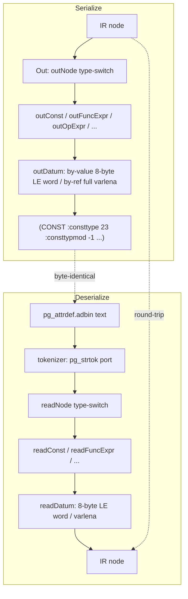
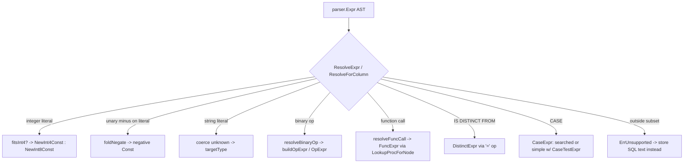

# Module: `internal/nodes`

The plan/expression node representation shared across the parser → optimizer →
executor pipeline, plus its serializer/deserializer pair and a resolver that
mirrors PostgreSQL's `parse_expr.c` name/type resolution over the IR. It is the
Go analogue of PG's `src/backend/nodes/{nodes,outfuncs,readfuncs}` plus the
planner-side part of `parse_node.c`. Package total: **7,423 LOC** across 13
production files.

Two node families live here:

1. **The parser AST** (`ir.go`, `ir_query.go`) — the `Node` interface and the
   concrete expression nodes (`Const`, `FuncExpr`, `OpExpr`, `BoolExpr`,
   `CaseExpr`, `NullTest`, `BooleanTest`, `RelabelType`, `CoerceViaIO`,
   `SQLValueFunction`, `DistinctExpr`, …) plus the query-tree nodes (`Query`,
   `Var`, `RangeTblEntry`, `TargetEntry`, `FromExpr`, …). These are the same
   types `internal/parser` builds.
2. **The optimizer IR** (`rebuild.go`, `rebuild_query.go`) — the plan-node tree
   (`optimizer.Node`) the planner emits and the executor consumes.

The package's reason to exist as its own boundary: the parser cannot import the
optimizer (layer rule), so the serializable/analyzable expression layer lives in
`nodes`, shared by both.

The serializer output is **byte-identical** to PostgreSQL's `nodeToString` — a
real PG 18.3 must be able to `stringToNode` goopg's output (stored as
`pg_attrdef.adbin`, `pg_rewrite.ev_action`, `pg_statistic_ext.stxexprs`) and
vice versa, so a PG standby can EVALUATE goopg's stored defaults and view rules.

## Key Files (by LOC)

| File                   | LOC | Role |
|------------------------|-----|------|
| `resolver_expr.go`     | 1,813 | `ResolveExpr` + every `resolve*` helper: the PG `transformExpr` analogue turning a parsed expression into a typed IR node (function-call resolution, operator resolution, cast coercion, type-mod length wrapping, literal typing/folding). The package's most active file. |
| `datum.go`             | 1,615 | `Datum` value representation helpers used across nodes: by-value/by-reference encoding, type-OID constants, numeric/datetime/bit varlena encoders (`NewNumericConst`, `NewTimestamptzConst`, `NewDateConst`, …), PG's numeric on-disk NumericData format helpers. |
| `rebuild.go`           | 884   | Plan-node cloning/rebuilding (`Clone`, deep-copy helpers) for the optimizer IR. |
| `readfuncs.go`         | 586   | `Read`: text-mode deserializer (the `readNode`/`read*` family), the inverse of `outfuncs`; `tokenizer` (a `pg_strtok` port). |
| `resolver_query.go`    | 485   | Query-level resolution (`ResolveViewQuery` / query statement transform). |
| `readfuncs_query.go`   | 485   | Query-node deserialization (the inverse of `outfuncs_query.go`). |
| `outfuncs.go`          | 358   | `Out`: text-mode serializer producing PG-compatible `(node …)` S-expression strings for the scalar IR. |
| `numeric_storage.go`   | 356   | Numeric (decimal) node storage/serialization: `NumericBodyFromText`, `NumericTextFromBody`, `NumericTextFromStoredPayload` (PG NumericData body ↔ text, incl. legacy-text discrimination). |
| `outfuncs_query.go`    | 250   | Query-tree serializer (the `Query`/`Var`/`RangeTblEntry`/`TargetEntry` tags). |
| `ir.go`                | 242   | The `Node` interface + scalar expression node structs (`Const`, `FuncExpr`, `OpExpr`, `BoolExpr`, `CaseExpr`, `NullTest`, `BooleanTest`, `RelabelType`, `CoerceViaIO`, `SQLValueFunction`, `DistinctExpr`, `CaseTestExpr`). |
| `rebuild_query.go`     | 196   | Query-node cloning for the optimizer IR. |
| `ir_query.go`          | 131   | Query node structs (`Query`, `Var`, `RangeTblRef`, `FromExpr`, `TargetEntry`, `RangeTblEntry`, `RTEPermissionInfo`, `Alias`, `Bitmapset`). |
| `unsupported.go`       | 22    | `ErrUnsupported` marker for unresolvable constructs. |

## Public API

### Serialization pair (PG `nodeToString` / `stringToNode`)

```go
func Out(n Node) string                     // -> "(SELECT ...)" S-expression
func Read(s string) (Node, error)           // <- parse it back
func OutList(nodes []Node) string
func ReadRuleAction(s string) ([]Node, error) // query-flavored variant
```

### Resolution (PG `transformExpr` analogue)

```go
func ResolveExpr(e parser.Expr, targetType uint32) (Node, error)
func ResolveForColumn(e parser.Expr, targetType uint32) (Node, bool)     // typed column
func ResolveForColumnTypmod(e parser.Expr, targetType uint32, targetTypmod int32) (Node, bool)
func ResolveViewQuery(sel *parser.SelectStmt, r RelationResolver) (*Query, error)
```

### Numeric storage (`numeric_storage.go`)

```go
func NumericBodyFromText(text string) ([]byte, error)          // decimal/scientific/NaN/Inf -> NumericData body
func NumericTextFromBody(body []byte) (string, error)          // NumericData body -> numeric_out text
func NumericTextFromStoredPayload(body []byte) (string, error) // accepts BOTH NumericData and legacy decimal-string payloads
```

### Datum constructors (`datum.go`)

```go
func NewInt4Const(v int32) Node / NewInt2Const / NewInt8Const / NewBoolConst / NewOidConst
func NewFloat8Const / NewFloat4Const / NewTextConst / NewVarcharConst / NewBpcharConst
func NewBitConst / NewVarBitConst / NewNumericConst / NewDateConst
func NewTimestamptzConst / NewTimestampConst / NewTimeConst / NewTimeTZConst
func newNullConst(e parser.Expr) *Const
func ParseStartupParameters(...) // (startup params; in frame.go of libpq, not here)
```

## Internal structure

### Two node families, one package


The scalar IR (`ir.go`) mirrors `primnodes.h`; the query IR (`ir_query.go`)
mirrors `nodes.h`/`parsenodes.h`. `DistinctExpr` is a **defined type over
`OpExpr`** — PG relies on "DistinctExpr and OpExpr being same struct"
(`make_distinct_op` just `NodeSetTag`s an OpExpr), so the codec is byte-identical
and only the `DISTINCTEXPR` token differs. `IS NOT DISTINCT FROM` is that
DistinctExpr wrapped in a `NOT` BoolExpr, exactly as `transformAExprDistinct`
does.

### Serializer / deserializer round-trip (`outfuncs.go` / `readfuncs.go`)



- **Serializer** (`outfuncs.go`) — walks each node struct and emits the PG
  `{tagname field1 field2 …}` text format. Field order and naming must match
  what PG's `nodeToString`/`stringToNode` expect so the output is
  interchangeable (goopg writes `adbin`/`ev_action` bodies a real PG can read
  back, and reads `pg_get_expr`/`pg_rewrite` bodies PG wrote). Helper writers:
  `wInt`, `wOid`, `wBool`, `wLoc`, `wNode`, `wNodeList`, `outDatum`.
  A nil node prints as `<>` (mirroring `outNode()`). `OutList` emits the bare
  List shape used by `pg_proc.proargdefaults` (a `<>` for an empty list).
- **Deserializer** (`readfuncs.go`) — a small tokenizer over that S-expression
  grammar with per-field readers (`readUint32`, `readInt32`, `readBool`,
  `readDatum`, `readDatumField`, `readNodeField`, `readNodeListField`,
  `skipField`). `tokenizer.next`/`peek` implement `pg_strtok` (whitespace
  separates; `{}()` are single-char tokens; `<>` is the empty token; backslash
  escapes handled for fidelity). `Read` rejects trailing tokens.
- **`outDatum` / `readDatum`** — for by-value types, the datum is always the
  **8-byte little-endian word** PG emits regardless of `constlen`; for
  by-reference types it is the full in-memory varlena (4-byte header + data).
  `Datum` is ignored when `ConstIsNull` is true.

### Resolver (`resolver_expr.go`)



`ResolveExpr` (resolver_expr.go:50) converts a column-DEFAULT (or
statistics-expression) AST into the canonical pg_node_tree scalar IR.
`ResolveForColumn` adds an **exact-match guard**: the top-level result type OID
must equal `targetType` exactly (PG's `build_column_default` returns the stored
expression already coerced to the attribute type). `ResolveForColumnTypmod`
additionally threads a target typmod for length coercion.

Key sub-resolution paths:
- **Literal typing** — `resolveIntLiteral` (PG `make_const`: int4 if
  `fitsInt4`, else int8), `resolveNumericLiteral` (via `NewNumericConst`),
  `foldStringLiteralConst`. `foldNegate` folds unary minus into a negative
  Const (`doNegate`).
- **Operator resolution** — `resolveBinaryOp`, `buildOpExpr` with operand
  types forward-resolved via S0's `catalog.LookupOperatorForNode`.
- **Function resolution** — `resolveFuncCall` with funcid via
  `catalog.LookupProcForNode`, result type from the generated `pg_proc`
  return-type map (`catalog.ProcResultType`).
- **Cast coercion** — `resolveCastExpr` + the `wrap*LengthCoercion` family
  (typmod wrapping), numeric-family cast helpers.
- **Special forms** — Boolean/CASE/DISTINCT/NULL-test, each with a `…With`
  sibling that threads a destination type for better inference.
- **Graceful degradation** — anything outside the canonical subset returns
  `ErrUnsupported`; callers fall back to storing SQL text (all-or-nothing, never
  partial-emit).

### Query resolution (`resolver_query.go` / `ir_query.go`)

`ResolveViewQuery` transforms a parsed `SELECT` into a `*Query` node for
`pg_rewrite.ev_action`. Scope is the single-base-relation SELECT view shape only
(one RTE_RELATION, optional WHERE, flat target list of Vars/scalar
expressions). `Read` doubles as the "is this a supported canonical view?" gate —
the many Query fields that must stay at view-default values are validated on
Read, and any deviation (aggregates, sublinks, joins) is an error → caller
falls back to SQL text.

### Numeric storage (`numeric_storage.go`)

`parseNumericVar`/`varlena` and `decodeNumericVar`/`text` are a complete port of
`numeric_in`/`numeric_out`'s serialization, first written for `pg_node_tree` (a
numeric Const's constvalue, dumped byte-for-byte) and reused by the heap.
`NumericBodyFromText` encodes a decimal/scientific/NaN/±Infinity literal as the
NumericData body (uint16 n_header short form or n_sign_dscale + n_weight long
form, then base-10000 digits little-endian). `NumericTextFromStoredPayload`
accepts BOTH the PG-faithful NumericData body and the pre-M0119-0006 legacy form
(the decimal string itself) — the flip has no on-disk migration, so TPC-H/DS
clusters hold text payloads, and a charset test discriminates (a payload whose
every byte is in the decimal-literal set is ALWAYS legacy text).

## Dependencies

- **Used by** — `internal/parser` (AST), `internal/optimizer` (IR),
  `internal/executor` (evaluates IR; serializes `adbin`/`ev_action`),
  `internal/catalog` (`pg_node_oid_lookup`), `internal/initdb` (bootstrap seeds),
  `internal/wal` (pgoutput reads numeric payloads via
  `NumericTextFromStoredPayload`).
- **Uses** — `internal/utils/mmgr` (allocation), `internal/utils/adt/*`
  (numeric/bit/datetime type helpers in the resolver), `internal/parser`
  (expression/AST types, for the resolver's input), `internal/catalog`
  (operator/proc OID lookups).

## Notable patterns / gotchas

- **`Out`/`Read` must round-trip** — a serializer change without the matching
  deserializer change corrupts every persisted `pg_node_tree` (attrdef defaults,
  view rules, index expressions). Treat the pair as one unit (Hard-won Rule #2).

- **PG-compat is byte-level** — `Out` emits field names and numbers in PG's
  exact order; a real PG 18.3 must be able to `stringToNode` goopg's output and
  vice versa. `numeric_storage.go` keeps the numeric node's serialized shape
  PG-compatible. `BoolExpr` writes `:boolop` as bare tokens `and`/`or`/`not`
  (a do-it-yourself enum), while `BooleanTest`'s `:booltesttype` is a plain
  integer ordinal (`WRITE_ENUM_FIELD`) — getting these two mixed up corrupts
  bytes.

- **Resolver twin search** — the `resolve*`/`resolve*With` pairs exist because
  expression resolution needs to thread a known destination type when the parent
  supplies one (e.g. a cast target or a column type). Forgetting the sibling in
  a refactor silently degrades type inference (the M0134 class of bugs).

- **Two node families, one package** — the parser AST and the optimizer IR both
  live here; do not "move" expression nodes to the parser without breaking the
  layer rule (parser cannot import optimizer).

- **`ErrUnsupported`** — the resolver declines constructs it cannot type
  (`unsupported.go`); callers must fall back rather than panic. The degradation
  is all-or-nothing — never partial-emit.

- **`DistinctExpr` is `OpExpr`** — a defined type, not a separate struct. Its
  codec is byte-identical; only the node tag differs. Changing OpExpr fields
  changes DistinctExpr's serialization without an explicit edit there.

- **Simple-form CASE uses `CaseTestExpr`** — the operand is substituted for the
  placeholder at evaluation time; the deparse inverse recognizes that shape and
  prints just the RHS of each `operand = val` OpExpr. The placeholder never
  stands alone.

- **`CASE` common type must be non-collatable** — the scalar subset only emits
  canonical bytes when all WHEN results + ELSE resolve to the SAME type, so
  `casecollid` is always 0. Omitted ELSE synthesizes a typed NULL Const of
  `casetype` (matching `transformCaseExpr`).

- **`<>` is the nil/empty token** — outNode prints `<>` for a nil node, and
  OutList prints `<>` for an empty List; Read recognizes it verbatim. A nil
  child and an empty list are both valid states, not errors.

- **`Read` validates fixed fields** — for the query subset, every Query field
  outside the modeled set must be at its view-default value; deviation is an
  error, not a silent re-parse. This is the "supported canonical view?" gate.

- **Numeric legacy-text discrimination is exact** — a payload whose every byte
  lies in the decimal-literal set is ALWAYS legacy text (no NumericData body can
  be spelled entirely from that set). This charset rule is shared by the two
  heap readers (executor's `decodePhysicalPGValueMctx` and wal's pgoutput) so
  it cannot drift between them.

- **`Out` on a NULL node vs null field** — the `wNode`/`wNodeList` helpers
  prefix `:fieldname`; `outNode` (bare) does not. `OutList` reimplements the
  List body precisely because `wNodeList` always prefixes a field name. Use the
  right writer for the context or the bytes shift.