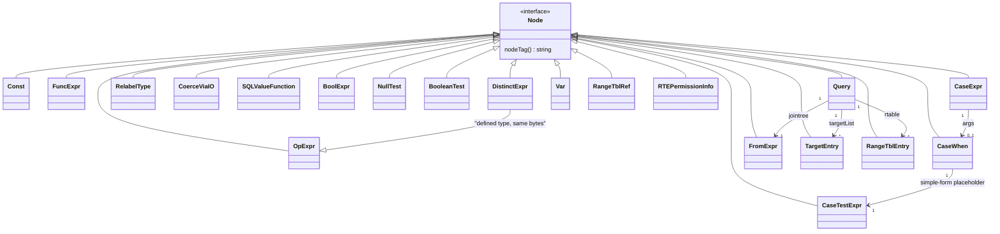
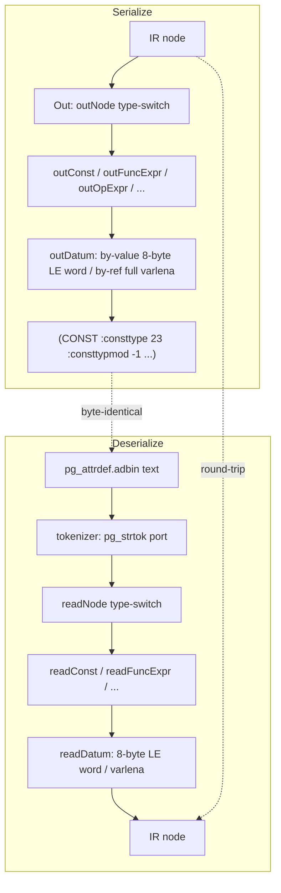
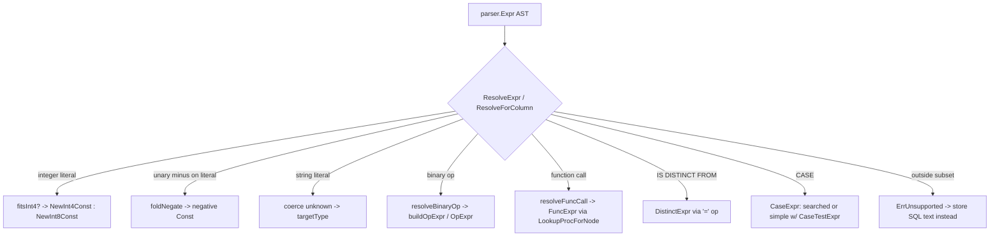
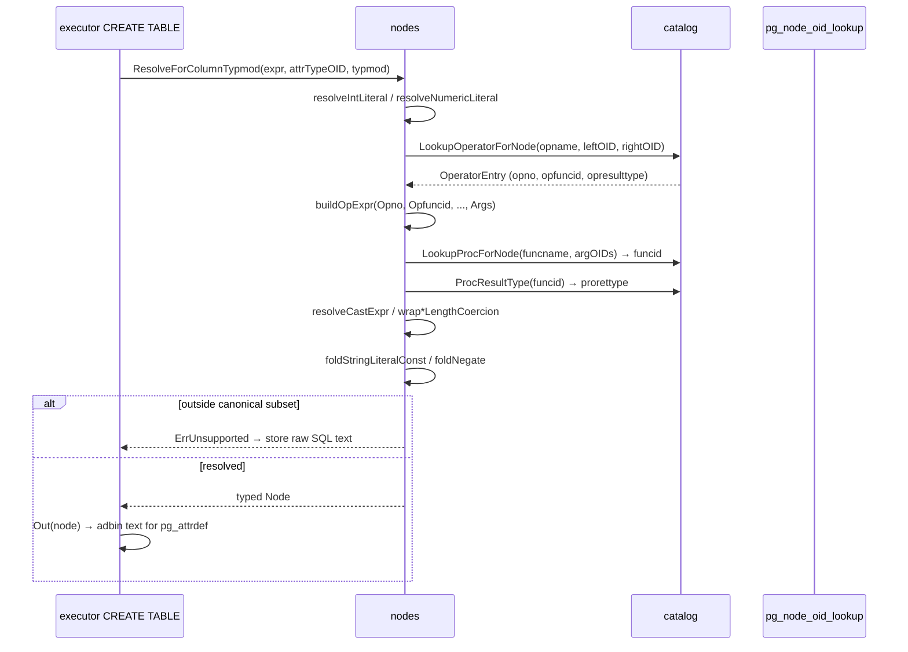
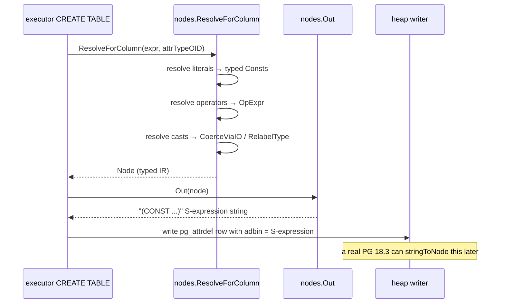

# Module: `internal/nodes`

The plan/expression node representation shared across the parser → optimizer →
executor pipeline, plus its serializer/deserializer pair and a resolver that
mirrors PostgreSQL's `parse_expr.c` name/type resolution over the IR. It is the
Go analogue of PG's `src/backend/nodes/{nodes,outfuncs,readfuncs}` plus the
planner-side part of `parse_node.c`. Package total: **7,423 LOC** across 13
production files.

Two node families live here:

1. **The parser AST** (`ir.go`, `ir_query.go`) — the `Node` interface and the
   concrete expression nodes (`Const`, `FuncExpr`, `OpExpr`, `BoolExpr`,
   `CaseExpr`, `NullTest`, `BooleanTest`, `RelabelType`, `CoerceViaIO`,
   `SQLValueFunction`, `DistinctExpr`, …) plus the query-tree nodes (`Query`,
   `Var`, `RangeTblEntry`, `TargetEntry`, `FromExpr`, …). These are the same
   types `internal/parser` builds.
2. **The optimizer IR** (`rebuild.go`, `rebuild_query.go`) — the plan-node tree
   (`optimizer.Node`) the planner emits and the executor consumes.

The package's reason to exist as its own boundary: the parser cannot import the
optimizer (layer rule), so the serializable/analyzable expression layer lives in
`nodes`, shared by both.

The serializer output is **byte-identical** to PostgreSQL's `nodeToString` — a
real PG 18.3 must be able to `stringToNode` goopg's output (stored as
`pg_attrdef.adbin`, `pg_rewrite.ev_action`, `pg_statistic_ext.stxexprs`) and
vice versa, so a PG standby can EVALUATE goopg's stored defaults and view rules.

## Key Files (by LOC)

| File                   | LOC | Role |
|------------------------|-----|------|
| `resolver_expr.go`     | 1,813 | `ResolveExpr` + every `resolve*` helper: the PG `transformExpr` analogue turning a parsed expression into a typed IR node (function-call resolution, operator resolution, cast coercion, type-mod length wrapping, literal typing/folding). The package's most active file. |
| `datum.go`             | 1,615 | `Datum` value representation helpers used across nodes: by-value/by-reference encoding, type-OID constants, numeric/datetime/bit varlena encoders (`NewNumericConst`, `NewTimestamptzConst`, `NewDateConst`, …), PG's numeric on-disk NumericData format helpers. |
| `rebuild.go`           | 884   | IR → parser.Expr rebuilding (`Rebuild` + `rebuild*` helpers, with `*With` variants): the inverse of the resolver, used by EXPLAIN VERBOSE deparse and `pg_get_expr`. |
| `readfuncs.go`         | 586   | `Read`: text-mode deserializer (the `readNode`/`read*` family), the inverse of `outfuncs`; `tokenizer` (a `pg_strtok` port). |
| `resolver_query.go`    | 485   | Query-level resolution (`ResolveViewQuery` / query statement transform). |
| `readfuncs_query.go`   | 485   | Query-node deserialization (the inverse of `outfuncs_query.go`). |
| `outfuncs.go`          | 358   | `Out`: text-mode serializer producing PG-compatible `(node …)` S-expression strings for the scalar IR. |
| `numeric_storage.go`   | 356   | Numeric (decimal) node storage/serialization: `NumericBodyFromText`, `NumericTextFromBody`, `NumericTextFromStoredPayload` (PG NumericData body ↔ text, incl. legacy-text discrimination). |
| `outfuncs_query.go`    | 250   | Query-tree serializer (the `Query`/`Var`/`RangeTblEntry`/`TargetEntry` tags). |
| `ir.go`                | 242   | The `Node` interface + scalar expression node structs (`Const`, `FuncExpr`, `OpExpr`, `BoolExpr`, `CaseExpr`, `NullTest`, `BooleanTest`, `RelabelType`, `CoerceViaIO`, `SQLValueFunction`, `DistinctExpr`, `CaseTestExpr`). |
| `rebuild_query.go`     | 196   | Query-node cloning for the optimizer IR. |
| `ir_query.go`          | 131   | Query node structs (`Query`, `Var`, `RangeTblRef`, `FromExpr`, `TargetEntry`, `RangeTblEntry`, `RTEPermissionInfo`, `Alias`, `Bitmapset`). |
| `unsupported.go`       | 22    | `ErrUnsupported` marker for unresolvable constructs. |

## Public API

### Serialization pair (PG `nodeToString` / `stringToNode`)

```go
func Out(n Node) string                     // -> "(SELECT ...)" S-expression
func Read(s string) (Node, error)           // <- parse it back
func OutList(nodes []Node) string
func ReadRuleAction(s string) ([]Node, error) // query-flavored variant
```

### Resolution (PG `transformExpr` analogue)

```go
func ResolveExpr(e parser.Expr, targetType uint32) (Node, error)
func ResolveForColumn(e parser.Expr, targetType uint32) (Node, bool)     // typed column
func ResolveForColumnTypmod(e parser.Expr, targetType uint32, targetTypmod int32) (Node, bool)
func ResolveViewQuery(sel *parser.SelectStmt, r RelationResolver) (*Query, error)
```

### Numeric storage (`numeric_storage.go`)

```go
func NumericBodyFromText(text string) ([]byte, error)          // decimal/scientific/NaN/Inf -> NumericData body
func NumericTextFromBody(body []byte) (string, error)          // NumericData body -> numeric_out text
func NumericTextFromStoredPayload(body []byte) (string, error) // accepts BOTH NumericData and legacy decimal-string payloads
```

### Datum constructors (`datum.go`)

```go
func NewInt4Const(v int32) Node / NewInt2Const / NewInt8Const / NewBoolConst / NewOidConst
func NewFloat8Const / NewFloat4Const / NewTextConst / NewVarcharConst / NewBpcharConst
func NewBitConst / NewVarBitConst / NewNumericConst / NewDateConst
func NewTimestamptzConst / NewTimestampConst / NewTimeConst / NewTimeTZConst
func newNullConst(e parser.Expr) *Const
func ParseStartupParameters(...) // (startup params; in frame.go of libpq, not here)
```

## Internal structure

### Two node families, one package



The scalar IR (`ir.go`) mirrors `primnodes.h`; the query IR (`ir_query.go`)
mirrors `nodes.h`/`parsenodes.h`. `DistinctExpr` is a **defined type over
`OpExpr`** — PG relies on "DistinctExpr and OpExpr being same struct"
(`make_distinct_op` just `NodeSetTag`s an OpExpr), so the codec is byte-identical
and only the `DISTINCTEXPR` token differs. `IS NOT DISTINCT FROM` is that
DistinctExpr wrapped in a `NOT` BoolExpr, exactly as `transformAExprDistinct`
does.

Each node's field list is annotated with its upstream `_out*` provenance, e.g.
`OpExpr{Opno, Opfuncid, Opresulttype, Opretset, Opcollid, Inputcollid, Args,
Location}` mirrors `_outOpExpr` field order byte-for-byte. Adding a field in a
non-upstream position silently shifts every persisted `pg_node_tree`.

### Serializer / deserializer round-trip (`outfuncs.go` / `readfuncs.go`)



- **Serializer** (`outfuncs.go`) — walks each node struct and emits the PG
  `{tagname field1 field2 …}` text format. Field order and naming must match
  what PG's `nodeToString`/`stringToNode` expect so the output is
  interchangeable (goopg writes `adbin`/`ev_action` bodies a real PG can read
  back, and reads `pg_get_expr`/`pg_rewrite` bodies PG wrote). Helper writers:
  `wInt`, `wOid`, `wBool`, `wLoc`, `wNode`, `wNodeList`, `outDatum`.
  A nil node prints as `<>` (mirroring `outNode()`). `OutList` emits the bare
  List shape used by `pg_proc.proargdefaults` (a `<>` for an empty list).
- **Deserializer** (`readfuncs.go`) — a small tokenizer over that S-expression
  grammar with per-field readers (`readUint32`, `readInt32`, `readBool`,
  `readDatum`, `readDatumField`, `readNodeField`, `readNodeListField`,
  `skipField`). `tokenizer.next`/`peek` implement `pg_strtok` (whitespace
  separates; `{}()` are single-char tokens; `<>` is the empty token; backslash
  escapes handled for fidelity). `Read` rejects trailing tokens.
- **`outDatum` / `readDatum`** — for by-value types, the datum is always the
  **8-byte little-endian word** PG emits regardless of `constlen`; for
  by-reference types it is the full in-memory varlena (4-byte header + data).
  `Datum` is ignored when `ConstIsNull` is true.

The `BoolExpr` writer is a special case: `boolopToken` maps the internal enum
to bare tokens `and`/`or`/`not` (a do-it-yourself enum), while `BooleanTest`'s
`:booltesttype` uses `WRITE_ENUM_FIELD` (a plain integer ordinal). The two
styles must not be swapped — `Out` emits them differently on purpose.

### Resolver (`resolver_expr.go`)



`ResolveExpr` (resolver_expr.go:50) converts a column-DEFAULT (or
statistics-expression) AST into the canonical pg_node_tree scalar IR.
`ResolveForColumn` adds an **exact-match guard**: the top-level result type OID
must equal `targetType` exactly (PG's `build_column_default` returns the stored
expression already coerced to the attribute type). `ResolveForColumnTypmod`
additionally threads a target typmod for length coercion.

Key sub-resolution paths:
- **Literal typing** — `resolveIntLiteral` (PG `make_const`: int4 if
  `fitsInt4`, else int8), `resolveNumericLiteral` (via `NewNumericConst`),
  `foldStringLiteralConst`. `foldNegate` folds unary minus into a negative
  Const (`doNegate`).
- **Operator resolution** — `resolveBinaryOp`, `buildOpExpr` with operand
  types forward-resolved via S0's `catalog.LookupOperatorForNode`.
- **Function resolution** — `resolveFuncCall` with funcid via
  `catalog.LookupProcForNode`, result type from the generated `pg_proc`
  return-type map (`catalog.ProcResultType`).
- **Cast coercion** — `resolveCastExpr` + the `wrap*LengthCoercion` family
  (typmod wrapping), numeric-family cast helpers.
- **Special forms** — Boolean/CASE/DISTINCT/NULL-test, each with a `…With`
  sibling that threads a destination type for better inference.
- **Graceful degradation** — anything outside the canonical subset returns
  `ErrUnsupported`; callers fall back to storing SQL text (all-or-nothing, never
  partial-emit).

### Query resolution (`resolver_query.go` / `ir_query.go`)

`ResolveViewQuery` transforms a parsed `SELECT` into a `*Query` node for
`pg_rewrite.ev_action`. Scope is the single-base-relation SELECT view shape only
(one RTE_RELATION, optional WHERE, flat target list of Vars/scalar
expressions). `Read` doubles as the "is this a supported canonical view?" gate —
the many Query fields that must stay at view-default values are validated on
Read, and any deviation (aggregates, sublinks, joins) is an error → caller
falls back to SQL text.

The `Query` node (`ir_query.go`) is a faithful subset of PG's `Query`:
`commandType`, `querySource`, `canSetTag`, `utilityStmt`, `resultRelation`,
`hasAggs`/`hasWindowFuncs`/`hasSubLinks`/`hasDistinctOn`, `jointree`,
`targetList`, `rtable`, `rtablePermissions`, `cteList`, and `returningList`.
Every modeled field is emitted and validated; fields outside the subset must
stay at their zero values.

### Numeric storage (`numeric_storage.go`)

`parseNumericVar`/`varlena` and `decodeNumericVar`/`text` are a complete port of
`numeric_in`/`numeric_out`'s serialization, first written for `pg_node_tree` (a
numeric Const's constvalue, dumped byte-for-byte) and reused by the heap.
`NumericBodyFromText` encodes a decimal/scientific/NaN/±Infinity literal as the
NumericData body (uint16 n_header short form or n_sign_dscale + n_weight long
form, then base-10000 digits little-endian). `NumericTextFromStoredPayload`
accepts BOTH the PG-faithful NumericData body and the pre-M0119-0006 legacy form
(the decimal string itself) — the flip has no on-disk migration, so TPC-H/DS
clusters hold text payloads, and a charset test discriminates (a payload whose
every byte is in the decimal-literal set is ALWAYS legacy text).

## Key flow: resolving a column default



## Dependencies

- **Used by** — `internal/parser` (AST), `internal/optimizer` (IR),
  `internal/executor` (evaluates IR; serializes `adbin`/`ev_action`),
  `internal/catalog` (`pg_node_oid_lookup`), `internal/initdb` (bootstrap seeds),
  `internal/wal` (pgoutput reads numeric payloads via
  `NumericTextFromStoredPayload`).
- **Uses** — `internal/utils/mmgr` (allocation), `internal/utils/adt/*`
  (numeric/bit/datetime type helpers in the resolver), `internal/parser`
  (expression/AST types, for the resolver's input), `internal/catalog`
  (operator/proc OID lookups).

## Notable patterns / gotchas

- **`Out`/`Read` must round-trip** — a serializer change without the matching
  deserializer change corrupts every persisted `pg_node_tree` (attrdef defaults,
  view rules, index expressions). Treat the pair as one unit (Hard-won Rule #2).

- **PG-compat is byte-level** — `Out` emits field names and numbers in PG's
  exact order; a real PG 18.3 must be able to `stringToNode` goopg's output and
  vice versa. `numeric_storage.go` keeps the numeric node's serialized shape
  PG-compatible. `BoolExpr` writes `:boolop` as bare tokens `and`/`or`/`not`
  (a do-it-yourself enum), while `BooleanTest`'s `:booltesttype` is a plain
  integer ordinal (`WRITE_ENUM_FIELD`) — getting these two mixed up corrupts
  bytes.

- **Resolver twin search** — the `resolve*`/`resolve*With` pairs exist because
  expression resolution needs to thread a known destination type when the parent
  supplies one (e.g. a cast target or a column type). Forgetting the sibling in
  a refactor silently degrades type inference (the M0134 class of bugs).

- **Two node families, one package** — the parser AST and the optimizer IR both
  live here; do not "move" expression nodes to the parser without breaking the
  layer rule (parser cannot import optimizer).

- **`ErrUnsupported`** — the resolver declines constructs it cannot type
  (`unsupported.go`); callers must fall back rather than panic. The degradation
  is all-or-nothing — never partial-emit.

- **`DistinctExpr` is `OpExpr`** — a defined type, not a separate struct. Its
  codec is byte-identical; only the node tag differs. Changing OpExpr fields
  changes DistinctExpr's serialization without an explicit edit there.

- **Simple-form CASE uses `CaseTestExpr`** — the operand is substituted for the
  placeholder at evaluation time; the deparse inverse recognizes that shape and
  prints just the RHS of each `operand = val` OpExpr. The placeholder never
  stands alone.

- **`CASE` common type must be non-collatable** — the scalar subset only emits
  canonical bytes when all WHEN results + ELSE resolve to the SAME type, so
  `casecollid` is always 0. Omitted ELSE synthesizes a typed NULL Const of
  `casetype` (matching `transformCaseExpr`).

- **`<>` is the nil/empty token** — outNode prints `<>` for a nil node, and
  OutList prints `<>` for an empty List; Read recognizes it verbatim. A nil
  child and an empty list are both valid states, not errors.

- **`Read` validates fixed fields** — for the query subset, every Query field
  outside the modeled set must be at its view-default value; deviation is an
  error, not a silent re-parse. This is the "supported canonical view?" gate.

- **Numeric legacy-text discrimination is exact** — a payload whose every byte
  lies in the decimal-literal set is ALWAYS legacy text (no NumericData body can
  be spelled entirely from that set). This charset rule is shared by the two
  heap readers (executor's `decodePhysicalPGValueMctx` and wal's pgoutput) so
  it cannot drift between them.

- **`Out` on a NULL node vs null field** — the `wNode`/`wNodeList` helpers
  prefix `:fieldname`; `outNode` (bare) does not. `OutList` reimplements the
  List body precisely because `wNodeList` always prefixes a field name. Use the
  right writer for the context or the bytes shift.

- **`nodeTag()` is the discriminator** — every concrete node returns a string
  tag (`"CONST"`, `"FUNCEXPR"`, …). The deserializer's `readNode` switches on
  this token; a tag typo produces a parse error on the wire rather than a wrong
  node, but an unknown tag is silently treated as `ErrUnsupported`-adjacent
  input — callers must not assume a node round-trips through a tag it never
  emitted.

- **Const typmod** — a `Const` with `consttypmod != -1` is a length-coerced
  literal (e.g. `'abc'::varchar(2)`), distinct from a bare literal. The
  resolver emits the length coercion explicitly; relying on the typmod to
  re-apply length truncation at read time is wrong — truncation is a resolver
  (write) side concern.

- **Var numbering is 1-based** — `Var.varattno` follows PG's 1-based
  attribute-numbering; 0 means "whole row", negative means system column.
  Off-by-one here silently reads a neighbor column.

## Scalar IR node field reference (`ir.go`)

Each scalar expression node mirrors its PG `primnodes.h` counterpart with
annotated field names:

- **`Const`** — `{xprtype, consttype, consttypmod, constcollid, constlen,
  constvalue, constisnull, location}`. `constlen` is the by-value size (−1 for
  by-reference); `constvalue` is the serialized datum (8-byte LE word for
  by-value, varlena for by-reference). A `constisnull` Const still emits the
  `:consttype`/`:consttypmod` fields (PG does this), but the datum is skipped.
- **`FuncExpr`** — `{funcid, funcresulttype, funcretset, funcvariadic,
  funcformat, funccollid, inputcollid, args, location}`. `funcformat` is the
  `CoercionForm` enum ordinal (COERCE_EXPLICIT_CALL=0, COERCE_IMPLICIT_CAST=1,
  COERCE_EXPLICIT_CAST=2, COERCE_SQL_SYNTAX=3). `funcvariadic` marks a
  variadic call — PG serializes it as a bare int (0/1).
- **`OpExpr`** — `{opno, opfuncid, opresulttype, opretset, opcollid,
  inputcollid, args, location}`. Byte-identical to `DistinctExpr`.
- **`RelabelType`** — `{arg, resulttype, resulttypmod, resultcollid,
  relabelformat, location}`. A pure type-coercion marker with no runtime work.
- **`CoerceViaIO`** — `{arg, resulttype, resultcollid, coerceformat,
  location}`. Applies the type's I/O functions to convert representation.
- **`SQLValueFunction`** — `{op, type, typmod, location}`. Renders
  `CURRENT_DATE`, `CURRENT_TIMESTAMP`, `CURRENT_USER`, `LOCALTIME`, etc. at
  execution time.
- **`BoolExpr`** — `{boolop, args, location}`. `boolop` serializes as the bare
  tokens `and`/`or`/`not` (NOT BoolExpr has a single arg).
- **`NullTest`** — `{arg, nulltesttype, argisrow, location}`. `nulltesttype`
  is `IS_NULL=0` / `IS_NOT_NULL=1` (serialized as int).
- **`BooleanTest`** — `{arg, booltesttype, location}`. `booltesttype` is
  `IS_TRUE=0`, `IS_NOT_TRUE=1`, `IS_FALSE=2`, `IS_NOT_FALSE=3`, `IS_UNKNOWN=4`,
  `IS_NOT_UNKNOWN=5` (serialized via `WRITE_ENUM_FIELD` as a bare int ordinal).
- **`CaseExpr`** — `{casetype, casecollid, arg, args, defresult, location}`.
  The `args` list holds `CaseWhen` nodes; `defresult` is the ELSE expression
  (a typed NULL Const when ELSE is omitted). `arg` is non-nil only for the
  simple form, where it is a `CaseTestExpr`.
- **`CaseWhen`** — `{expr, result, location}`. The WHEN condition and result.
- **`CaseTestExpr`** — `{type_id, type_mod, collation, location}`. The
  simple-form CASE operand placeholder, substituted at evaluation.

### Query IR node fields (`ir_query.go`)

- **`Var`** — `{varno, varattno, vartype, vartypmod, varcollid, varlevelsup,
  varnoold, varoattno, location}`. `varlevelsup` counts query nesting levels.
- **`RangeTblRef`** — `{rtindex}`. References the jointree's rtable position.
- **`FromExpr`** — `{fromlist, quals}`. The JOIN-tree root.
- **`TargetEntry`** — `{expr, resno, resname, ressortgroupref, resorigtbl,
  resorigcol, resjunk}`.
- **`RangeTblEntry`** — `{rtekind, relid, relkind, rellockmode, tablesample,
  subquery, jointype, alias, eref, perminfoindex, ...}`.
- **`Query`** — the view-rule subset: `{commandType, querySource, canSetTag,
  utilityStmt, resultRelation, hasAggs, hasWindowFuncs, hasSubLinks,
  hasDistinctOn, hasRecursive, hasModifyingCTE, hasForUpdate, cteList,
  targetList, returningList, jointree, rtable, rtablePermissions}`.

## Tokenizer grammar (`readfuncs.go`)

The `tokenizer` implements `pg_strtok`:

```
whitespace  := ' ' | '\n' | '\t'
special     := '{' | '}' | '(' | ')' | ':' | '=' | ','
empty token := "<>"
```

`next()` skips whitespace and returns the next token; `peek()` looks ahead one
token without consuming. `readNode` reads `(TAG field1 field2 …)`; nested lists
use `{}` braces. A nil node or empty list prints as `<>`.

The tokenizer handles backslash escapes inside string tokens for fidelity with
PG's `pg_strtok` (which treats `\\` as an escaped backslash).

## Serializer field-order table

The `Out` output for each node type follows PG's `outfuncs.c` exactly. The
field order is significant because PG's `readNode` reads fields by position,
not by name. A field added or reordered in goopg's `Out` without a matching
change in PG's reader breaks byte-compatibility.

Example of the exact output shape:

```
(CONST :consttype 23 :consttypmod -1 :constcollid 0 :constlen 4
 :constvalue 4294967295 :constisnull 0 :location 7)
```

Note that `:constvalue` for a by-value int4 is the 8-byte LE word, NOT the
4-byte int. This matches PG's `outDatum` behavior where the datum is always
8 bytes when `constlen` is positive.

## Key flow: storing a column default



## Resolver internal structure (`resolver_expr.go`)

The `ResolveExpr` entry point walks a parsed `parser.Expr` and produces a
typed IR node. The walk is recursive with a `resolveContext` threading the
known destination type. Key sub-resolvers:

- `resolveIntLiteral` / `resolveNumericLiteral` — integer and numeric literal
  typing via `make_const` semantics (`fitsInt4` → int4, else int8).
- `foldStringLiteralConst` — folds a string literal to a Const of the
  unknown type.
- `foldNegate` — unary minus on a literal folds into a negative Const
  (`doNegate`), matching PG's `eval_const_expressions`.
- `resolveBinaryOp` — resolves a binary operator by name + operand types via
  `catalog.LookupOperatorForNode`.
- `buildOpExpr` — constructs the `OpExpr` with opno/opfuncid/opresulttype.
- `resolveFuncCall` — resolves a function call by name + arg OIDs via
  `catalog.LookupProcForNode`; sets `funcresulttype` from
  `catalog.ProcResultType`.
- `resolveCastExpr` — resolves a `::type` cast to the target type; chooses
  `RelabelType` for binary-compatible or `CoerceViaIO` for I/O-based
  conversions.
- `wrap*LengthCoercion` family — threads the target typmod for length
  coercion (e.g., `'abc'::varchar(2)`).
- `resolveCaseExpr` — searched form (list of `CaseWhen` + ELSE) or simple
  form (an `arg` + `CaseTestExpr` placeholder).
- `resolveBoolExpr` — AND/OR/NOT.
- `resolveNullTest` — `IS NULL`/`IS NOT NULL`.
- `resolveBooleanTest` — `IS TRUE`/`IS NOT TRUE`/`IS FALSE`/`IS NOT FALSE`/
  `IS UNKNOWN`/`IS NOT UNKNOWN`.
- `resolveDistinctExpr` — `IS [NOT] DISTINCT FROM` via the `=` operator,
  tagged `DISTINCTEXPR`.

Each resolver has a `…With` sibling that takes a destination type parameter
used for better inference when the parent knows the expected type. The
`ResolveForColumn`/`ResolveForColumnTypmod` exports are the column-default
entry points; `ResolveExpr` is the general (unconstrained) entry.

### Type resolution for casts and coercions

The resolver's coercion logic mirrors PG's `coerce_type`:

1. If the source and target types are the same OID → no coercion node.
2. If the target is `unknown` → leave as-is (literal).
3. If there's an implicit cast function → `FuncExpr` with the cast function.
4. If the types are binary-compatible → `RelabelType`.
5. Otherwise → `CoerceViaIO` (I/O-based conversion).

The `CoercionForm` ordinal is threaded through the IR nodes so the serializer
can emit the correct `:coerceformat`/`:funcformat` values.

## `readfuncs` validation rules

The `Read` deserializer enforces several invariants:

- `Read` rejects trailing tokens after the top-level node (a corrupt or
  padded `pg_node_tree` string is an error, not a silent re-parse).
- `readConst` validates `consttype` is a known built-in OID (or a user
  type with a registered varlena). Unknown types are an error.
- `readOpExpr` validates `opfuncid` is non-zero (PG emits it; a zero here
  means the serializer dropped the field).
- `readBoolExpr` validates `boolop` is one of `and`/`or`/`not`.
- `readNullTest`/`readBooleanTest` validate the enum ordinal is in range.
- `readCaseExpr` validates `casetype` matches the common type of the WHEN
  results.

`ReadRuleAction` is the query-flavored variant used by `pg_rewrite.ev_action`:
it returns a `[]Node` (the rule action list) rather than a single node.

## Serialization size budget

The `Out` output is bounded in practice by the underlying `pg_node_tree`
storage (`pg_attrdef.adbin`, `pg_rewrite.ev_action`). A deeply nested
expression (e.g., a 10,000-element IN list) produces a large S-expression
but still fits in a 1 GB varlena. The deserializer has no explicit depth
limit — it recurses with the Go stack, so a maliciously deep node tree
could overflow the stack. This matches upstream PG (which uses recursion
too), but the tree depth is bounded in practice by the parser's recursion
limit.

## Numeric data format (`numeric_storage.go` / `datum.go`)

The `NumericData` on-disk body format, matching PG's `numeric.h`:

```
Short form (n_header < 0x8000):
  [uint16 n_header]         // ndigits, with NUMERIC_SHORT flag bit 0x8000
  [uint16 digits...]        // base-10000, little-endian (least significant first)

Long form (n_header >= 0x8000):
  [uint16 n_header]         // 0x8000 | sign (0x0000 pos, 0x4000 neg, 0xC000 NaN)
  [uint16 n_weight]         // weight of the first digit
  [uint16 n_sign_dscale]    // sign (high 2 bits) | display scale (low 14 bits)
  [uint16 digits...]        // base-10000 digits
```

The short form packs the digit count into the header's low 14 bits with the
`NUMERIC_SHORT` flag set, saving 4 bytes per value. `NewNumericConst` uses
the long form for NaN/Infinity and the short form for finite values when the
scale fits.

`NumericTextFromStoredPayload`'s legacy discrimination rule: a payload whose
EVERY byte is in the decimal-literal set (`0-9`, `-`, `+`, `.`, `e`, `E`,
spaces) is always legacy text. No valid `NumericData` body can be spelled
entirely from that set (the header bytes are never all decimal chars).

## Const by-value encoding

`outDatum`/`readDatum` handle the two datum classes:

- **By-value** (`constlen > 0`): the datum is always the 8-byte
  little-endian word PG emits, regardless of `constlen`. For int4 (len 4),
  the value is sign-extended into the 8-byte word. For bool, it's 0/1.
- **By-reference** (`constlen == -1`): the datum is the full varlena
  (4-byte header + data), emitted byte-for-byte.

`Datum` is ignored when `ConstIsNull` is true (the `:constvalue` field is
emitted as `0` but read as absent — the reader keys off `:constisnull`).

## Coercion forms and serialization

The `CoercionForm` enum (used by `RelabelType.relabelformat`,
`CoerceViaIO.coerceformat`, and `FuncExpr.funcformat`):

| Value | Name | Meaning |
|---|---:|---|
| 0 | `COERCE_EXPLICIT_CALL` | explicit function call syntax |
| 1 | `COERCE_IMPLICIT_CAST` | implicit cast |
| 2 | `COERCE_EXPLICIT_CAST` | `::type` cast |
| 3 | `COERCE_SQL_SYNTAX` | SQL syntax coercion (e.g. `CAST(x AS t)`) |

`Out` emits these as integer ordinals; `Read` validates them in range. The
executor uses `relabelformat`/`coerceformat` to decide whether to print
`::type` in deparse output.

## Node tag table

The complete set of `nodeTag()` strings emitted by `Out`:

| Tag | Node | Family |
|---|---|---:|
| `CONST` | `Const` | scalar |
| `FUNCEXPR` | `FuncExpr` | scalar |
| `OPEXPR` | `OpExpr` | scalar |
| `DISTINCTEXPR` | `DistinctExpr` | scalar |
| `RELABELTYPE` | `RelabelType` | scalar |
| `COERCEVIAIO` | `CoerceViaIO` | scalar |
| `SQLVALUEFUNCTION` | `SQLValueFunction` | scalar |
| `BOOLEXPR` | `BoolExpr` | scalar |
| `NULLTEST` | `NullTest` | scalar |
| `BOOLEANTEST` | `BooleanTest` | scalar |
| `CASEEXPR` | `CaseExpr` | scalar |
| `CASEWHEN` | `CaseWhen` | scalar |
| `CASETESTEXPR` | `CaseTestExpr` | scalar |
| `VAR` | `Var` | query |
| `RANGETBLREF` | `RangeTblRef` | query |
| `FROMEXPR` | `FromExpr` | query |
| `TARGETENTRY` | `TargetEntry` | query |
| `RANGETBLENTRY` | `RangeTblEntry` | query |
| `RTEPERMISSIONINFO` | `RTEPermissionInfo` | query |
| `QUERY` | `Query` | query |
| `ALIAS` | `Alias` | query |

Each tag is emitted as `(TAG ...)`. The `readNode` type-switch maps the tag
back to the reader function.

## Rebuild/clone (`rebuild.go` / `rebuild_query.go`)

`rebuild.go` provides the inverse of the resolver: it converts typed IR nodes
back to `parser.Expr` AST. This is used by the `EXPLAIN (VERBOSE)` deparse
path and by the `pg_get_expr` function that reconstructs SQL text from stored
`pg_node_tree`:

```go
func Rebuild(n Node) (parser.Expr, error)
```

`Rebuild` dispatches on the node type: `RebuildBoolExpr`,
`RebuildNullTest`, `RebuildBooleanTest`, `RebuildCaseExpr`,
`RebuildFuncExpr`, `RebuildRelabelType`, etc. Each `*With` variant takes a
custom `rec` function so the caller can intercept sub-expression
reconstruction.

`rebuild_query.go` provides `RebuildViewQuery(q *Query) (*parser.SelectStmt, error)`
— the inverse of `ResolveViewQuery`, reconstructing a `SELECT` parse tree
from a stored `pg_rewrite.ev_action` `Query` node. This is used by pg_dump
and `pg_get_viewdef`.