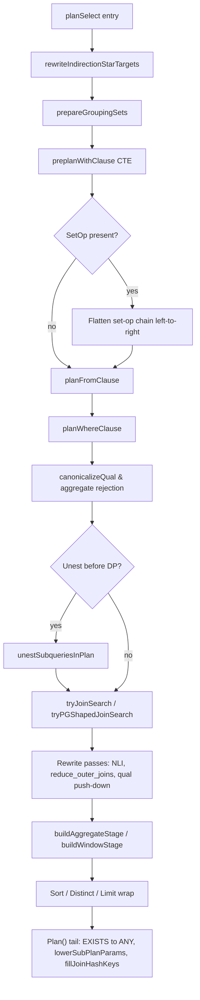
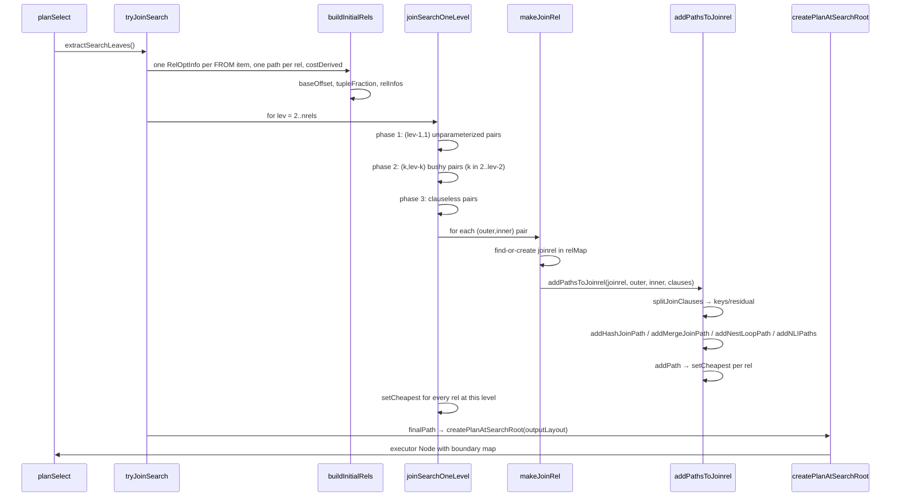
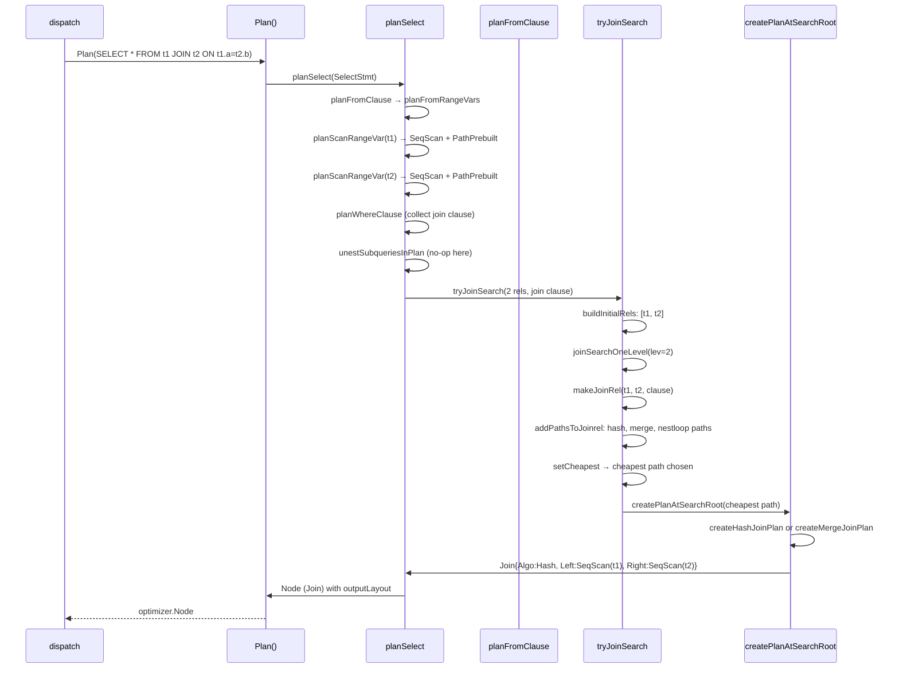

# Module: `internal/optimizer`

The SQL planner. Converts a `parser.Stmt` (the analyzer-resolved AST) into an
executor plan tree of `Node`s: name/type resolution of expressions, FROM-clause
and subquery planning, sublink pull-up/unnesting to semi/anti joins, a
PG-shaped join-order search with cost-based cardinality estimation, plan-node
construction, and late rewrite passes (NLI conversion, min/max-to-index-scan,
parallel Gather, PARAM_EXEC lowering). **56,019 LOC** across 90+ `.go` files.

## Responsibilities

- Statement dispatch (SELECT/INSERT/UPDATE/DELETE/MERGE, DDL passthrough, utility).
- `planSelect` pipeline — FROM → WHERE → unnest → join search → aggregate/window
  → sort/distinct/limit.
- Join-order search (a faithful reproduction of PG's `standard_joinsearch` level
  lists since M0127-P5.9), capped at 16 base relations per join problem via
  `RelSet uint16` bitmask.
- Per-path cost modelling (seq/hash/merge/nestloop/bitmap) and per-node
  cardinality estimation (PG-default selectivities when stats are absent: eq=1/200,
  ineq=1/3, generic=1/3).
- Plan IR: every executor-facing `Node`/`Expr` type (100+ node kinds, 30+ expression
  kinds).
- Constant folding (recursive bottom-up `FoldConstants` with runtime-error propagation).
- Equivalence-class inference for transitive equality push-down.
- DECORRELATION: EXISTS/NOT-IN-to-sem/anti-join, correlated-IN-to-sem-NLI, scalar
  subquery-to-join.
- Parallel-query wrappers (`Gather`/`GatherMerge`) as a non-mutating post-pass.
- Subplan PARAM_EXEC lowering in `lowerSubplanarams`.

## Key Files (by LOC)

| File                   | LOC  | Role                                                                 |
|------------------------|------|----------------------------------------------------------------------|
| `planner.go`           | 15,262 | Entry: `Plan()`, `planStmt`, 5000+line `planSelect` pipeline, FROM-item planning (scan, join, subquery, VALUES, CTE, SRF), WHERE/HAVING resolution, aggregate/window stage construction, expression resolution (`resolveExpr`, `resolveColumnRef`), min/max rewrite, INSERT/UPDATE/DELETE/MERGE planning, type-coercion helpers, schema management. The package's largest file by far. |
| `unnest.go`            | 4,311  | Subquery pull-up and correlated-subquery decorrelation: EXIST/HOT-IN → semi/anti join, scalar/IN subquery → join. `unestSubqueriesInPlan`, `unestSubquery`, `unestExistsExpr`, `unestInExpr`, `unestScalarWithResiduals`. Param harvesting plus index-key-cheap probe detection. |
| `plan.go`              | 2,672  | Plan IR: `Node`/`Expr` interfaces, `Schema`/`SchemaColumn`, all plan-node structs (50+), all expression structs (30+), `outputLayout` types. Source of truth for every executor-facing data structure. |
| `nl_index_join.go`     | 1,527  | `rewriteJoinsToNLI` rule pass: converts plain nested loops into `NestedLoopIndexJoin` when the inner side has an equi-key index probe. Residual-qual pushdown, selective inner unwrap. |
| `cardinality.go`       | 1,401  | `EstimateRows` bottom-up per-node row estimation. `seqScanRows`, `indexScanRows`, `tableRows`, `estimateBaseRelInfo`, `estimateJoin`, `estimateAggregate`, `estimateNumGroups`. Default selectivity constants and NDistinct look-up. |
| `joinlayout.go`        | 1,353  | Column-coordinate translation: pos-map family for translating ColumnRef indices between pre-search and post-search coordinate spaces. By-name re-resolvers. The planner's main coordinate-space bridge. |
| `exprwalk.go`          | 888    | Tree-walking infrastructure: `walkExprTree`, `walkPlanExprs`, `walkPlanExprsDeep`. Used by unnesting, folding, rewrite passes. |
| `parallel.go`          | 830    | Parallel-query pass: `MaybeAddGather`/`MaybeAddGatherMerge`, parallel safety analysis, parallel-safe partial/partial paths for aggregates. |
| `path.go`              | 719    | Cost-model substrate: `Path`, `RelOptInfo`, `Cost`, `RelSet`, `PathKind`, `addPath`/`setCheapest` dominance logic. PG's `add_path` dominance with STD_FUZZ_FACTOR=1.01. |
| `joinkeyproof.go`      | 689    | Proof rules for join-key functional-dependency reasoning: whether a column is functionally determined by the join key (used for ORDER BY elimination). |
| `foldconst.go`         | 660    | Constant folding: `FoldConstants` entry, `foldPlanConstants`, `tryFoldBinaryOp`/`tryFoldUnaryOp`, `foldCaseExpr`. Pure bottom-up evaluator with panic-propagated runtime errors (division by zero → PlanError). |
| `joinsearchseam.go`    | 654    | The `planSelect` seam where the PG-shaped join search is asked to plan a real statement. `tryJoinSearch`, `tryPGShapedJoinSearch`, `splitOuterSpine` (pinned outer-join peeling), `extractSearchLeaves`, `searchConsumes`. |
| `relsize.go`           | 641    | Block-count relation-size fallback: `GOOPG_RELSIZE_FALLBACK` staging, `estimateRelSize` (port of `table_block_relation_estimate_size`), `typeWidth`/`tupleWidth`, page-geometry constants. |
| `joinsearchlevel.go`   | 602    | `joinSearchOneLevel` phases 1/2/3: 1=unparameterised (lev-1,1), 2=bushy (k,lev-k), 3=clauseless last-ditch. `makeJoinRel`, `joinRelBuilder` interface. |
| `joinorder.go`         | 600    | Join-restriction inference: `joinIsLegal`, `hasJoinRestriction`, `buildJoinOrderRestrictions` — SpecialJoinInfo processing for LEFT/ANTI/SEMI join legality during search. |
| `joinrelsize.go`       | 560    | Join relation sizing: `calcJoinrelSize` (PG's `set_joinrel_size_estimates`), outer-join row floor, SEMI-join match-fraction calculation. |
| `reduce_outer_joins.go`| 563    | PG's `reduce_outer_joins` pass: converts LEFT JOIN to inner join when NULL-rejected by WHERE. |
| `selectivity.go`       | 570    | Join selectivity: `calcJoinSelectivity`, `calcSemiJoinSelectivity`, clauseless-join selectivity (cartesian = 1.0). |
| `joinrestrict.go`      | 583    | Join-restriction list management: `clausesFor`, `restrictInfo`, `restrictInfoList` — clause coverage rule for which quals apply at a given join. |
| `pathbitmap.go`        | 573    | Bitmap scan path generation: `addBitmapPaths`, `createBitmapIndexPaths`, logical reordering for low-selectivity BitmapAnd input order. |
| `pushdown.go`          | 539    | Qual push-down: `pushDownQuals`, `tryPromoteQualToIndexCond`. Moves Filter conjuncts closer to scan nodes. |
| `createplanroot.go`    | 503    | Search-root plan creation: `createPlanAtSearchRoot` — the final step that translates the search's chosen Path into the top-level plan node with boundary-map assembly. |
| `copy.go`              | 501    | Plan-tree deep-copy: `copyNode`, `copyExpr` — used for CTE inlining and subquery cloning. |
| `collapse.go`          | 489    | Explicit-JOIN collapsing: `tryCollapseJoinTree` — flattens INNER JOIN chains into the search's FROM list when `GOOPG_PGSHAPED_COLLAPSE=1`. |
| `scan_input_rewrite.go`| 475    | Scan input rewriting: handles `FOR UPDATE`/`FOR SHARE` locking rows for scan nodes. |
| `costindex.go`         | 419    | Index scan costing: `costIndexScan` (incl. index-only via `indexOnly` flag), Mackert-Lohman formula for index page fetch estimation. |
| `joinpathsmerge.go`    | 426    | Merge-join path generation: `addMergeJoinPath`, merge-clause order derivation, explicit-sort merge paths. |
| `equiv_class.go`       | 442    | Transitive equality inference: `equivClasses` (union-find), `inferTransitiveEqualities`, `inferAnchoredEqualities`. Discovers `a=c` from `a=b AND b=c`. |
| `cost_funcs.go`       | 458    | PG cost function ports: `costParams`, `costSeqscan`, `hashJoinCost`, `nestloopCost`, `mergeJoinCost`, `gatherCost`, `indexProbeCost`. |
| `createplanjoin.go`    | 623    | Hash-join and merge-join plan creation: `createHashJoinPlan`, `createMergeJoinPlan`. Coordinate remapping via `outputLayout`. |
| `with.go`              | 605    | CTE planning: `preplanWithClause`, CTE inlining (single-ref), CTE materialisation, recursive CTE (`RecursiveUnion`/`WorkTableScan`). |
| `joinpathsmemoize.go`  | 376    | Memoize-path generation: `addMemoizePath` — caching wrapper for NLI inner when outer key distinct count is low. |
| `createplannl.go`      | 375    | Nested-loop plan creation: `createNestLoopPlan`, `createNestedLoopIndexJoinPlan`. Resolves inner-memo caching, param binding, layout remapping. |
| `pathparamindex.go`    | 603    | Parameterised index path generation: `addParameterizedIndexPaths` — index scans with outer-reference parameters for NLI feeding. |
| `tuplefraction.go`     | 288    | PG `preprocess_limit` port: derives `tuple_fraction` from LIMIT/OFFSET clauses for startup-vs-total cost trade-off. |

## Public API

The exported surface is intentionally tiny (~15 functions); most machinery is
unexported.

```go
func Plan(stmt parser.Stmt, cat catalog.Catalog) (Node, error)                                // plner.go:89
func PlanSchemaOnly(s *parser.SelectStmt, cat catalog.Catalog) (Node, error)                     // plner.go:51
func ResolveIndexPredicate(predicate parser.Expr, tbl *catalog.Table) (Expr, error)             // plner.go:75
func ResolveAlterColumnTypeUsing(table *catalog.Table, e parser.Expr) (Expr, error)             // plner.go:1080
type PlanError struct{ Pos, Code, Message, Hint, Detail }                                       // plner.go:28
func EstimateRows(n Node) int64                                                                 // cardinality.go:43
func IsSmallDimensionSide(n Node) bool                                                          // cardinality.go:482
func FoldConstants(e Expr) Expr                                                                 // foldconst.go:21
func IsConstantPlanExpr(n Node) bool                                                             // plner.go:5500+, expr side
func deriveSubqueryTargetName(e parser.Expr) string                                   // plner.go:5755, unexported
func exprEqual(a, b Expr) bool                                                               // plner.go, unexported
func resolveExpr(e parser.Expr, ctx *resolveContext) (Expr, error)                             // plner.go:13742, unexported
func rewriteInsertDefaultMarkers(s *parser.InsertStmt, cat catalog.Catalog) error                 // plner.go:10449, unexported
func exprHasAggregate(e parser.Expr) bool                                                      // plner.go:8281, unexported
func parserExprHasWindowFunc(e parser.Expr) bool                                              // plner.go:8449, unexported
```

Feature gates (all wrap package atomics + env var kill-switches):

| Gate function | Env var | Default | Effect |
|---|---|---|---:|---:|---:|
| `SetUnnestPreDPEnabled` | `GOOPG_UNEST_PREDP` | on | Run pull-up before join search |
| `SetSubqueryUnnestEnabled` | `GOOPG_SUBQUERY_UNEST` | on | Sublink decorrelation |
| `SetIndexKeyHarvestEnabled` | `GOOPG_INDEXKEY_HARVEST` | on | Harvest inner-index params for NLI |
| `SetNLIEnabled` | `GOOPG_NLI` | on | Rewrite joins to NLI |
| `SetNLICostGateLegacy` | `GOOPG_NLI_COST_GATE` | off | Use old cost gate for NLI |
| `SetParallelEnabled` | `GOOPG_PARALLEL` | on | Parallel query post-pass |
| `ParallelEnabled` | — | — | Query-time check |

## Internal structure

### Statement dispatch

`planStmt` (`planner.go:142`) switches on `parser.Stmt`:
- `*parser.SelectStmt` → `planSelect` (the main pipeline, 2800+ lines).
- `*parser.InsertStmt` → `planInsert` (target-column mapping, DEFAULT rewrites, ON CONFLICT).
- `*parser.UpdateStmt` → `planUpdate` (SET-clause assignment mapping, FROM-item planning).
- `*parser.DeleteStmt` → `planDelete`.
- `*parser.MergeStmt` → `planMerge` (WHEN MATCHED/NOT MATCHED clause planning, action dispatch).
- DDL → passthrough `*DDL` (executor handles catalog mutation at run time).
- transactions → `*Transaction`/`*Utility` (BEGIN, COMMIT, ROLLBACK, SAVEPOINT).
- utility → `*Utility`, `*Checkpoint`, `*Explain`, `*Copy`.

### The `planSelect` pipeline (`planner.go:741`)



1. GROUPING SETS/ROLLUP/CUBE: normalise GROUP BY to deduplicated union (`groupingsets.go`).
2. CTE pre-planning: `preplanWithClause` plans every WITH body once, inline single-ref CTEs.
3. Set-op flattening: right-associative parse tree → flat left-associative (A UNION B UNION ALL C).
4. FROM planning: `planFromClause` → `planFromRangeVars` → per-item dispatch:
   - base table → `planScanRangeVar` (SeqScan/IndexScan with inheritance children walk)
   - subquery → `planSubqueryRangeVar` (recursive `planSelect`)
   - CTE → `planCTERangeVar` (reference materialized body)
   - VALUES → `planStandaloneValuesSelect`
   - JOIN → `planJoinPredicate` (natural/USING/ON qual collection, outer-join special treatment)
   - SRF → `planTableFuncRangeVar`, `planFromUnnest`, `planFromRegexpMatches`
5. WHERE resolution: `resolveExpr` walk with aggregate rejection (42803), `canonicalizeQual`.
6. Sublink unnesting: correlated EXISTS/IN/NOT-IN → semi/anti join via `unestSubqueriesInPlan`.
7. **Join-order search** — the central optimisation (see below).
8. Late rewrite passes: `rewriteJoinsToNLI` (nested-loop index join conversion), `reduce_outer_joins` (outer→inner via NULL rejection), qual push-down, inner-join qual push-down.
9. Aggregate/window stages: `buildAggregateStage` (HashAgg/SortAgg selection), `buildWindowStage`.
10. Sort/Distinct/Limit wrapping.

### Join-order search



- `searchCtx` holds level lists indexed by relset size (PG's `join_rel_level[]`),
   a `relMap` (PG's `join_rel_hash`), cost params, tuple fraction, join-info list.
- `buildInitialRels` populates level 1 from every FROM item — **including subquery/CTE/VALUES
   leaves** (closing the leaf-whitelist gap that `tryBushyDP` had).
- `joinSearchOneLevel` (joinsearchlevel.go) runs three phases per level:
  - **Phase 1** (`makeRelsByClauseJoins`): pairs each rel at (lev-1) with every rel at level 1,
    gated by `hasJoinClause` or `joinOrderRestricted`. Both left-sided and right-sided.
  - **Phase 2** (`makeRelsByClauseJoins`): pairs every (k, lev-k) split for k in 2..lev-2.
    Bushy joins only when clause-connected.
  - **Phase 3** (`makeRelsByClauselessJoins`): pairs when no clause exists (cartesian).
- `makeJoinRel` is find-or-create: same relset → same RelOptInfo (for `addPath` pruning power).
- The **outer-spine peel** (`splitOuterSpine` in joinsearchseam.go) peels LEFT JOIN links off
  the top of the join tree, searches the INNER prefix below them, then splices the links back.

### Path generation per join pair (`addPathsToJoinrel`, joinpaths.go:139)

For each (outer,inner) direction with `clauses` the joinrel's restriction list:

1. **Sort then merge** (`sortInnerAndOuter`, `matchUnsortedOuterMerge`): explicit sort both sides
   or exploit existing order; merge costs computed via `mergeJoinCost` (joinpathsmerge.go).
2. **Hash** (`addHashJoinPath`): keyable equi-joins; hash table build on inner, probe from outer.
   Cost via `hashJoinCost` (costfuncs.go) with work_mem budget for spill estimation.
3. **Plain nested loop** (`addNestLoopPath`): always offered (even for cartesian), usually dominated.
4. **Nested-loop index join** (`addNLIPaths`, joinpathsnli.go): parameterised index probes on the
   inner using outer-side columns as scan keys. May wrap in `Memoize` if outer key distinct count low.

### Path → plan translation (`createPlan`, `createPlanNode`, createplan.go:44)

Switches on `PathKind`:

| PathKind | Translator | Output |
|---|---|---|
| `PathPrebuilt` | unwrap | The subtree the search inherited |
| `PathSeqScan` | `createSeqScanPlan` | `*SeqScan` |
| `PathIndexScan` | `createIndexScanPlan` | `*IndexScan` / `*IndexOnlyScan`|
| `PathHashJoin` | `createHashJoinPlan` | `*Join{Algo: Hash}` with HashKeys |
| `PathMergeJoin` | `createMergeJoinPlan` | `*Join{Algo: Merge}` + absorption of Sort children |
| `PathNestLoop` | `createNestLoopPlan` | `*Join{Algo: NestLoop}` or `*NestedLoopIndexJoin`|
| `PathMemoize` | panic (must be unwrapped by NLI) | — |
| `PathBitmapHeapScan` | `createBitmapHeapScanPlan` | `*BitmapHeapScan` |
| `PathBitmapIndexScan` | `createBitmapIndexScanPlan` | `*BitmapIndexScan` |
| `PathBitmapAnd` | `buildBitmapAndOrPlan` | `*BitmapAnd` |
| `PathBitmapOr` | `buildBitmapAndOrPlan` | `*BitmapOr` |

Cartesian and unhandled kinds → panic.

### Cardinality estimation (`cardinality.go`)

`EstimateRows` is a recursive type switch on Node:

```
SeqScan       → tableRows (catalog.reltuples)
IndexScan     → 1 for eq probe, tableRows for unbounded scan
IndexOnlyScan → same as IndexScan
Filter        → child * selectivity
Join          → outer * inner * joinSelectivity; SEMI → outer * matchFraction (no-stats default 0.5); ANTI → outer * (1 - matchFraction)
Aggregate     → estimateNumGroups (NDistinct of GROUP BY columns)
Values        → len(rows) exactly
Sort/Limit    → child rows (unchanged)
WindowAgg     → child rows (no reduction)
Union/SetOp   → estimateSetOp
```

Default selectivities when stats absent: eq=0.005 (1/200), ineq=0.333 (1/3), generic=0.333.
`EstimateRows` returns 0 when no estimate is possible (no stats), distinguishing "no info" from
"zero rows".

### Plan IR types (`plan.go`)

The plan IR defines 108 struct types (plan nodes + expressions). The
expression types (from the source, plan.go):

- **Constants**: `IntegerConst`, `StringConst`, `NumericConst`, `BooleanConst`,
  `NullConst`, `TypedStringLit`, `IntervalLit`.
- **References**: `ColumnRef`, `OuterColumnRef`, `ParamRef`, `ExecParamRef`,
  `CTIDExpr`, `TableOidExpr`.
- **Operators**: `BinaryOp`, `UnaryOp`, `FuncCall`, `CastExpr`,
  `LikeEscapePattern`, `ExtractExpr`, `CollateExpr`.
- **Subquery/Set**: `SubqueryExpr`, `ArraySubqueryExpr`, `ExistsExpr`,
  `InExpr`, `MultiAssignSubqRow`, `MultiAssignSubqElem`.
- **Tests**: `IsNullExpr`, `IsBoolExpr`, `IsDistinctFromExpr`.
- **Conditionals**: `CaseExpr`, `CaseWhen`.
- **MERGE**: `MergeActionExpr`, `MergeWholeRowRef`.

Note: PG-style nodes like `CoalesceExpr`, `BoolExpr`, `NullTest`, `ArrayExpr`,
`RelabelType`, `CoerceViaIO`, `MinMaxExpr`, and `XmlExpr` are NOT separate
structs here — `Coalesce`/`NullIf`/`Greatest`/`Least` and the boolean/array
constructs are either folded into `FuncCall`/`BinaryOp`/`CaseExpr` forms or
resolved during expression analysis. When reading plan.go, do not assume a
1:1 mapping with PG's `primnodes.h`.

### Subquery unnesting (`unnest.go`)

Three forms of decorrelation:

1. **EXISTS → semi-join**: `unestExistsExpr` — extract correlation params, build semi-join
   from the subquery body, push residual conjuncts down.
2. **IN → semi-join** (correlated): `unestInExpr` — convert the left operand + IN list to a
   semi-join with equality on the join key.
3. **NOT IN → anti-join**: same machinery with anti-join semantics.
4. **Scalar subquery → join**: `unestScalarWithResiduals` when the subquery returns at most
   one row and is correlated on a unique key.

The `indexKeyHarvest` mechanism (`harvestIndexKeyParams`) detects when the inner subquery body
is an index probe cheap enough to keep as a SubPlan instead of unnesting.

### Constant folding (`foldconst.go`)

`FoldConstants` recurses bottom-up. For every `*BinaryOp`/`*UnaryOp`/`*CaseExpr` where all
operands fold to literals, it evaluates the op and replaces the node with the result.
Runtime errors (division by zero, numeric overflow) ARE propagated as `foldEvalPanic` →
caught by `foldPlanConstants` → converted to `*PlanError` with code 22012/etc.
PG-compatible: constant-fold errors are NOT suppressed.

Not foldable: `ColumnRef`, `OuterColumnRef`, `ParamRef`, `FuncCall` (no eval in the planner).

### Equivalence-class inference (`equiv_class.go`)

Union-find over `columnIdent{name, sourceTableIdx, schemaIndex, typeName}`.
`inferTransitiveEqualities` takes `a=b AND b=c` and derives `a=c`.
`inferAnchoredEqualities` adds equalities where one side is a constant and the other an equikey
(`x=5 AND x=y` → `y=5`), only when the base relation is below `smallAnchorRowsThreshold`.
Called before join-graph construction in the legacy DP path.

### PARAM_EXEC lowering (`subplan_lower.go`)

`lowerSubPlanParams` walks the finished plan tree, collects every `SubqueryExpr`, and assigns
each correlated `OuterColumnRef` to a flat PARAM_EXEC slot via `ExecParamRef`.
The `subplan_lower` tree walk (`lowerSubplanParamWalk`) wraps SubqueryExpr plans
with param-binding infrastructure. Must run exactly once per statement, after all rewrites
that can change the sublink shape (EXISTS-to-ANY runs before it).

### Parallel-query pass (`parallel.go`)

Non-mutating `MaybeAddGather` wraps the finished plan in a `*Gather`/`*GatherMerge` when
the query is parallel-safe and the cost benefit justifies `parallel_setup_cost`.
Agg-specific: `tryParallelizeAgg` splits hash aggregates into `Partial`+`Final` modes.
The pass is **non-mutating** — it creates the Gather wrapper on a copy and swaps.
Cross-session plan cache: the cache stores the serialized plan before the Gather addition,
and deserializes + re-adds Gather per session based on per-session parallel workers.

## Key flow: planning a SELECT with a join



## Dependencies

- **Uses** `internal/catalog` (table/column metadata, stats, types, OIDs),
  `internal/parser` (+ `parser/analyzer` for semantic resolution),
  `internal/executor/hashsize` (work_mem/hash-entry sizing shared with executor),
  `internal/storage` (index metadata).
- **Used by** `internal/executor` (30+ files) — builds operators by type-switching on
  `optimizer.Node`, evaluates `optimizer.Expr`, re-enters planner for PL/pgSQL bodies,
  FK/partition DDL, CALL.

## Notable patterns / gotchas

- **Two planning worlds must agree** — the legacy rule-driven pipeline (`tryBushyDP`) and the
  PG-shaped cost search coexist. The `searchedTree` tag is what stops legacy passes from
  double-firing (a searched tree re-remapped would read `ColumnRef`s against the wrong
  coordinate space). With the old DP deleted at M0127-P6.3, the "two worlds" are now the
  PG search (default on) vs syntactic-order-only (kill-switch `GOOPG_PGSHAPED_DP=0`).

- **Coordinate spaces are the #1 silent-bug source** — column refs are resolved in
  binding-offset space (pre-search). The search reorders rels and assigns new relset bits.
  `outputLayout` and the `joinlayout.go` pos-maps are the translators. A mis-translation
  reads the wrong column silently — no crash, wrong answer. The `assertSearchedBoundariesIntact`
  call in `Plan()` is the last line of defence.

- **Env-flag kill-switch culture** — every plan-shaping feature is gated by a process-start
  env var (`GOOPG_PGSHAPED_DP`, `GOOPG_UNNEST_PREDP`, `GOOPG_EXISTS_TO_ANY`,
  `GOOPG_MEMOIZE`, `GOOPG_PARALLEL`, `GOOPG_COLLAPSE`, `GOOPG_NLI`, …). Benchmark gates
  stamp `planner-flags:` provenance lines via `FlagProvenanceTable`/`RenderFlagProvenanceEnv`.
  Flags are read once at process start (`init()`), so a plan cannot change shape mid-statement.

- **Cost model is PG's, deliberately shallow at `pathkeys`** — `Path` dominance uses
  `stdFuzzFactor = 1.01` (PG 18's `STD_FUZZ_FACTOR`). `pathkeys` are syntactic, not
  equivalence-class driven — a false-negative on sort elimination (never a wrong plan).
  `disabled_nodes` domination trumps all else in PG's `compare_path_costs_fuzzily`.

- **Cardinality defaults match PG** when stats absent (eq = 1/200, ineq/generic = 1/3).
  `EstimateRows` returning 0 means "no stats", not "zero rows" — callers must check.
  CTE scans with no per-column stats produce severe underestimates (0.005^4 × 17977 ≈ 0
  rows), mitigated by a fallback to the CTE body's unfiltered row count (joinsearch.go:423).

- **Parallel pass is non-mutating** — `MaybeAddGather` wraps a finished plan because the
  plan cache is process-wide/cross-session. The Gather add happens per session on the
  deserialized copy.

- **Plan deep-copy is essential** — `copy.go` provides `copyNode`/`copyExpr` for CTE inlining,
  subquery cloning, and parallel pass snapshotting. Without it, two references to the same
  plan sub-tree would share mutable state in the executor.

- **`PathPrebuilt` is the search's leaf currency** — every FROM item (including subqueries,
  CTEs, VALUES) becomes a `PathPrebuilt` in `buildInitialRels`. The pre-search pipeline has
  already chosen an access method and attached local quals; the search re-costs but keeps
  the node. This is how the leaf-whitelist gap is closed.

- **Outer-spine peel for LEFT JOIN** — `splitOuterSpine` in `joinsearchseam.go` peels the
  pinned outer-join links off the top of the chain, searches the inner prefix below them,
  and splices the links back above the searched subtree. Without it, every TPC-DS query
  with an outer join (all 12 of them) would be declined from the search.

- **Join restriction (SpecialJoinInfo)** — `joinOrderRestricted` (`joinsearchlevel.go:68`)
  implements PG's `have_join_order_restriction`: LEFT/FULL/ANTI/SEMI joins impose ordering
  constraints the search must respect. SEMI unique-ification is handled as skip logic
  (joinrels.c:1095-1102 equivalent).

- **`hashJoinCost` is live in production** — since `GOOPG_PGSHAPED_DP` defaulted ON
  (2026-08-06), every hash join path in every live plan is priced through `costfuncs.go`.
  A change to any cost function carries the full planner bar (units + spot + DS05), not a
  unit test alone.

- **BITMAP scan paths** — added at M0128-P2.4. `addBitmapPaths` generates BitmapAnd/Or
  combinators with logical reordering for low-selectivity input order. The bitmap path
  kinds (`PathBitmapIndexScan`/`PathBitmapHeapScan`/`PathBitmapAnd`/`PathBitmapOr`) are
  the only multi-child path kinds in the system.

- **`inferAnchoredEqualities`** — a small-relation optimisation that derives `x=5` from
  `x=y AND y=5` only when the base relation has fewer than `smallAnchorRowsThreshold` rows.
  Prevents over-selective estimation bloat.

- **MERGE planning** — `planMerge` handles the full WHEN MATCHED/NOT MATCHED clause matrix:
  INSERT/UPDATE/DELETE/DO NOTHING actions, `MergeActionExpr` for RETURNING, `MergeWholeRowRef`
  for old/new row access. Distinct from INSERT ON CONFLICT.

- **Assertions in createPlan** — unhandled path kinds and nil children panic rather than
  silently producing wrong plans. `PathMemoize` outside an NLI inner panics explicitly.

- **`resolveContext` and `rangeBinding`** — the `resolveContext` struct carries the
  current bound names, schema, and source-index-to-binding mapping. `rangeBinding` pairs
  a table name with its resolved schema. Mis-wiring a `rangeBinding` produces a `ColumnRef`
  that resolves to the wrong table's column — a wrong-answer bug, not a crash.

- **`fixColumnRefIndices`** — after the search, all `ColumnRef` indices must be remapped
  from pre-search binding-offset space to post-search output-layout space. This is a
  separate pass (`fixColumnRefsInExpr`) that walks every expression in the plan tree.
  Skipping it on a new plan node type silently reads the wrong column at runtime.

## Plan IR types reference (`plan.go`)

The optimizer IR defines a type hierarchy of plan nodes and expression nodes.
Plan nodes implement the `Node` interface; expression nodes implement the `Expr`
interface.

**Scan nodes**: `SeqScan`, `IndexScan`, `IndexOnlyScan`, `BitmapHeapScan`,
`BitmapIndexScan`, `BitmapAnd`, `BitmapOr`, `FunctionScan`, `TableFuncScan`,
`ValuesScan`, `CTEScan`, `WorkTableScan`, `NamedTuplestoreScan`.

**Join nodes**: `Join{Algo: Hash/Merge/NestLoop}`, `NestedLoopIndexJoin`.

**SetOp nodes**: `SetOp{UNION/INTERSECT/EXCEPT}` with `SetOpCmd` and
`SetOpStrategy` (Sorted/Hash).

**DML nodes**: `Insert`, `Update`, `Delete`, `Merge`, `Upsert`.

**Aggregate nodes**: `Aggregate`, `WindowAgg`, `GroupingSets`.

**Other plan nodes**: `Filter`, `Project`, `Sort`, `Limit`, `Material`,
`Memoize`, `Gather`, `GatherMerge`, `RecursiveUnion`, `LockRows`, `ModifyTable`,
`Result`, `Unique`, `Distinct`, `Explain`, `Copy`, `Checkpoint`, `Transaction`,
`Utility`, `DDL`, `Call`, `Do`, `Vacuum`, `Analyze`, `Cluster`, `Reindex`,
`AlterSystem`, `Truncate`, `Notify`, `Listen`, `SetConstraints`, `SetTransaction`,
`DeclareCursor`, `FetchCursor`, `CloseCursor`, `MoveCursor`.

**Expression nodes**: `ColumnRef`, `OuterColumnRef`, `IntegerConst`, `StringConst`,
`NumericConst`, `BooleanConst`, `NullConst`, `TypedStringLit`, `IntervalLit`,
`BinaryOp`, `UnaryOp`, `FuncExpr`, `CoalesceExpr`, `NullIfExpr`, `GreatestExpr`,
`LeastExpr`, `CaseExpr`/`CaseWhen`, `BoolExpr`, `NullTest`, `BooleanTest`,
`IsNullExpr`, `IsBoolExpr`, `IsDistinctFromExpr`, `InExpr`, `ExistsExpr`,
`SubqueryExpr`, `ArraySubqueryExpr`, `ArrayExpr`, `RowExpr`, `CollateExpr`,
`CoerceViaIO`, `RelabelType`, `MinMaxExpr`, `XmlExpr`, `ExtractExpr`,
`CTIDExpr`, `TableOidExpr`, `MergeActionExpr`, `MergeWholeRowRef`,
`MultiAssignSubqRow`, `MultiAssignSubqElem`, `ParamRef`, `ExecParamRef`.

## GROUPING SETS / ROLLUP / CUBE

`prepareGroupingSets` (planner.go) handles the PG-style grouping extension:
it decomposes a `GROUP BY CUBE(a,b)` into a `GroupingSets` node with all
8 subsets, each with the appropriate `GroupingFunc` expression. The executor
emits one row per subgroup per input row, then aggregates them.

`rewriteIndirectionStarTargets` handles `SELECT *, ... GROUP BY ...` with
indirection-star expansion.

## Subquery target name derivation

`deriveSubqueryTargetName` (unexported) generates a stable column name for a subquery
output (e.g. `"t"."col"` from `SELECT col FROM t`). Used by the executor's
`TargetEntry` rendering and by `pg_stat_activity` query display.

## Expression equality and hashing

`exprEqual` (unexported) is a deep structural comparison of two
`optimizer.Expr` trees. It is used by the equivalence-class inference and
by the `exprHasAggregate`/`parserExprHasWindowFunc` predicates. The comparison
is structural, not semantic — `a+b` and `b+a` are NOT equal.

## Plan node deep copy (`copy.go`)

`copyNode` recursively deep-copies a plan `Node`, including all child nodes
and embedded expressions. `copyExpr` does the same for `Expr` trees. Both are
used by:
- CTE inlining: a CTE body referenced twice must be cloned so each reference
  is independently mutable.
- Subquery cloning: correlated subqueries that are unnested more than once
  need independent copies.
- Parallel pass: `MaybeAddGather` copies the plan before adding the Gather
  wrapper so the plan cache retains the unmodified original.

The copy is shallow for certain fields (e.g. `*catalog.Table` pointers are
shared, not cloned) because the catalog is immutable for the lifetime of a
plan.

## Tuple fraction (`tuplefraction.go`)

`limitTupleFraction` (PG's `preprocess_limit` port) derives the tuple fraction
from LIMIT/OFFSET clauses. The tuple fraction tells the join search whether to
prefer startup cost (low fraction, e.g. `LIMIT 10`) or total cost (high
fraction, e.g. unbounded query). The fraction is passed to `addPathsToJoinrel`
via `searchCtx.tupleFraction`.

## Bitmap scan path generation (`pathbitmap.go`)

`addBitmapPaths` generates BitmapAnd/Or combinators. For each index, it
creates a `PathBitmapIndexScan` with the relevant qual clauses. Then it
groups them by table and builds `PathBitmapAnd`/`PathBitmapOr` combinators:

- **BitmapAnd** — multiple index scans whose results are ANDed (intersected).
  The input order is reordered by selectivity (lowest first) to minimize the
  intermediate bitmap size.
- **BitmapOr** — multiple index scans whose results are ORed (unioned). Used
  for OR clauses and for IN lists.
- **BitmapHeapScan** — consumes the final bitmap and fetches matching heap
  tuples. Costed via `costBitmapHeapScan` with the bitmap selectivity.

## Join-key proof (`joinkeyproof.go`)

`joinkeyproof` implements functional-dependency rules: if a column is
functionally determined by the join key, ORDER BY on that column can be
eliminated when the join preserves the ordering. The proof rules check:
- The column is from the same relation as the join key.
- The column is a direct attribute of the join key (equality condition).
- The column is from a unique/primary key index that the join key references.

## Feature-gate env vars

Every plan-shaping feature is gated by a process-start env var. The full list:

| Env var | Default | Feature |
|---|---|---:|---|
| `GOOPG_PGSHAPED_DP` | on | PG-shaped join search (vs syntactic order) |
| `GOOPG_UNEST_PREDP` | on | Unnest before join search |
| `GOOPG_SUBQUERY_UNEST` | on | Sublink decorrelation |
| `GOOPG_INDEXKEY_HARVEST` | on | Harvest inner-index params for NLI |
| `GOOPG_NLI` | on | Rewrite joins to NLI |
| `GOOPG_NLI_COST_GATE` | off | Use old cost gate for NLI |
| `GOOPG_PARALLEL` | on | Parallel query post-pass |
| `GOOPG_MEMOIZE` | on | Memoize path generation |
| `GOOPG_COLLAPSE` | on | Explicit JOIN tree collapsing |
| `GOOPG_EXISTS_TO_ANY` | on | EXISTS-to-ANY rewrite |
| `GOOPG_REDUCE_OUTER_JOINS` | on | reduce_outer_joins pass |
| `GOOPG_BITMAP` | on | Bitmap scan path generation |

## Cost model (`cost_funcs.go`, `costindex.go`, `costbitmap.go`)

The cost model is a faithful reproduction of PostgreSQL 18.3's `costsize.c` in
PG's one-currency unit (`seq_page_cost = 1.0`). Every cost — scan, sort, join,
Gather — is absolute and directly comparable (design invariant #1). Live since
`GOOPG_PGSHAPED_DP` defaulted ON (2026-08-06): every production plan is priced
through these functions. The model is calibrated by PG's GUCs and will diverge
from PG where those GUCs differ.

### Cost parameters (`costParams`)

The `costParams` struct (`cost_funcs.go:47`) carries the PG cost GUCs at their
PG 18 boot values:

| Constant | Value | PG GUC |
|---|---|---|
| `seqPageCost` | 1.0 | `seq_page_cost` |
| `randomPageCost` | 4.0 | `random_page_cost` |
| `cpuTupleCost` | 0.01 | `cpu_tuple_cost` |
| `cpuIndexTupleCost` | 0.005 | `cpu_index_tuple_cost` |
| `cpuOperatorCost` | 0.0025 | `cpu_operator_cost` |
| `parallelSetupCost` | 1000.0 | `parallel_setup_cost` |
| `parallelTupleCost` | 0.1 | `parallel_tuple_cost` |
| `effectiveCacheSize` | 4 GB / 8 KB = 524,288 pages | `effective_cache_size` |
| `workMem` | `hashsize.DefaultMemLimitBytes` | `work_mem` |

The `costParams` defaults are threaded from the session at path-generation time;
until then (outside the search) the boot defaults are used. A drift-guard test
asserts the two agree.

### Calibration constants

| Constant | Value | Purpose |
|---|---|---|
| `stdFuzzFactor` | 1.01 | PG's `STD_FUZZ_FACTOR` for path dominance |
| `blockSizeBytes` | 8192 | PG's `BLCKSZ` |
| `pageHeaderSizeBytes` | 24 | Per-page overhead |
| `usableBytesPerBlock` | 8168 | Block size minus page header |
| `perTupleOverhead` | 28 | Heap tuple header overhead |
| `heapDefaultFillfactor` | 100 | Default heap fill factor |
| `btreeDefaultFillfactor` | 90 | Default B-tree leaf fill factor (`BTREE_DEFAULT_FILLFACTOR`) |
| `pageCPUMultiplier` | 50 | CPU charge per index page descended (`cpu_operator_cost` units) |
| `indexProbeCostMultiplier` | 1.0 (env override: `GOOPG_INDEX_PROBE_MULT`) | Scales index probe cost for goopg's eager TID-materialising probe |
| `defaultEqSelectivity` | 0.005 (1/200) | Default equality selectivity |
| `defaultIneqSelectivity` | 1/3 | Default inequality selectivity |
| `defaultGenericSelectivity` | 1/3 | Default generic selectivity |
| `defaultNumDistinct` | 200 | Default NDistinct when stats absent |
| `defaultUnhandledClauseSel` | 0.5 | Default selectivity for unhandled clause types |
| `defaultIneqJoinSel` | 1/3 | Default inequality join selectivity |
| `neverAnalyzedMinPages` | 10 | Page threshold for never-analyzed heuristic |
| `maximumRowCount` | 1e100 | Row count clamp |

### Scan costs

**`costSeqscan`** (`cost_funcs.go:122`): PG `cost_seqscan` (costsize.c:295).

```
run_cost = seq_page_cost * npages + (cpu_tuple_cost + cpu_operator_cost * numQualOps) * ntuples
startup_cost = 0
```

The parallel case divides the run cost by the parallel divisor (the caller passes
a per-worker tuple/page count).

**`costIndexScan`** (`costindex.go:112`): PG `cost_index` (costsize.c:520). The
most complex scan cost, with two I/O bounds interpolated by correlation:

```
index_am_cost = btreeIndexAMCost(cp, in)   # descent + leaf scan
tups_fetched = clampRowEst(selectivity * relTuples)

# Two I/O bounds computed via Mackert-Lohman (indexPagesFetched)
max_IO_cost = pagesFetched * random_page_cost * indexProbeCostMultiplier
min_IO_cost = random_page_cost * indexProbeCostMultiplier + (correlated_pages - 1) * seq_page_cost

# Interpolate by correlation^2
run_cost = max_IO_cost + correlation² * (min_IO_cost - max_IO_cost)
run_cost += cpu_tuple_cost * tups_fetched
```

The `btreeIndexAMCost` helper (`costindex.go:186`) charges the index side:
- `numIndexPages * random_page_cost * indexProbeCostMultiplier` — random page
  fetches for index pages, scaled by the probe multiplier
- `numIndexTuples * cpu_index_tuple_cost` — per-tuple CPU
- `(treeHeight + 1) * pageCPUMultiplier * cpu_operator_cost` — B-tree descent,
  charged at startup (paid before the first tuple emerges, making an ordered
  index path's startup non-zero and comparable against a sort's)

The `loop_count > 1` arm (parameterised paths inside NLI) pro-rates via
Mackert-Lohman over the total tuples across all loops, then divides back to
one execution.

**`costBitmapIndexScan`** (`costbitmap.go:36`): PG `cost_bitmap_tree_node`
(costsize.c:1150). Costs only the index side — the heap fetch is costed
separately by `costBitmapHeapScan`:

```
index_cost = btreeIndexAMCost(cp, in)   # descent + leaf scan
total = index_total + 0.1 * cpu_operator_cost * tups_fetched   # bitmap manipulation
```

**`costBitmapHeapScan`** (`costbitmap.go:51`): PG `cost_bitmap_heap_scan`
(costsize.c:1009). Startup = index cost, run cost = heap fetch with per-page
interpolation:

```
startup = indexCost.Total
if pages_fetched >= 2:
    cost_per_page = random_page_cost - (random_page_cost - seq_page_cost) * sqrt(pages_fetched / T)
else:
    cost_per_page = random_page_cost
run_cost = cost_per_page * pages_fetched + cpu_tuple_cost * tups_fetched
```

The per-page interpolation is directional: as more of the relation is touched,
the cost moves TOWARD `seq_page_cost` (sequential), because a bitmap scan that
visits most pages reads them in physical order — the reason the access method
exists. Previously this was inverted (moving toward random), causing massive
overestimates (TPC-H Q2's `supplier` bitmap was priced at 2588.7 vs PG's 43.46).

### The Mackert-Lohman formula (`indexPagesFetched`, `costindex.go:228`)

PG's `index_pages_fetched` (costsize.c:906): fetching `tuplesFetched` tuples
from a `pages`-page table touches how many DISTINCT pages, given caching?

Two regimes:
- **`T <= b`** (table fits in cache pro-rata share): `(2TN)/(2T+N)` birthday-
  problem estimate, clamped to `T`.
- **`T > b`** (does not fit): a limit `lim = (2Tb)/(2T-b)` beyond which every
  further tuple costs a fresh page at rate `(T-b)/T`.

Where `b = ceil(effectiveCacheSize * T / totalPages)` is the pro-rated cache
budget, `T` is the relation's page count, and `totalPages` is the sum of every
base relation's pages plus index pages in the query.

### Join costs

**`hashJoinCost`** (`cost_funcs.go:309`): PG `initial_cost_hashjoin` +
`final_cost_hashjoin` (costsize.c:4160/4275):

```
build = (cpu_operator_cost * numHashClauses + cpu_tuple_cost) * innerRows + inner.Total
startup = outer.Startup + build
run = (outer.Total - outer.Startup) + cpu_operator_cost * numHashClauses * outerRows
    + cpu_tuple_cost * outputRows
```

The spill term is added when `hashsize.Choose` returns `NBatch > 1` — the SAME
function `joinOp.buildGeometry` calls, so the planner and executor agree on
whether a build spills:

```
innerPages = spillPages(innerRows, innerCols, innerAvgVarBytes)
outerPages = spillPages(outerRows, outerCols, outerAvgVarBytes)
startup += seq_page_cost * innerPages       # write inner (startup)
run += seq_page_cost * (innerPages + 2*outerPages)  # read inner + write+read outer
```

`spillPages` (`cost_funcs.go:346`) uses `hashsize.EntryBytes` for the per-row
footprint, the same model the executor's hash table uses, so the pages charged
match the bytes the geometry solved for.

**`nestloopCost`** (`cost_funcs.go:384`): PG `final_cost_nestloop`
(costsize.c:3349):

```
ntuples = max(outerRows, 1) * max(innerRows, 1)   # PAIRS PROCESSED, not emitted
startup = outer.Startup + inner.Startup
run = (outer.Total - outer.Startup) + outerRows * innerRescanTotal + cpu_tuple_cost * ntuples
```

The per-tuple CPU charge rides `ntuples` — the number of pairs the loop
PROCESSES, not the number it emits. PG is explicit about the distinction
("Compute number of tuples processed (not number emitted!)", costsize.c).
Charging on the output instead would make a cartesian loop over a collapsed
estimate look free (the Q47 fix, P5.9-j).

`innerRescanTotal` is the cost of one inner scan — for an NLI, one parameterised
index probe (`indexProbeCost`).

**`mergeJoinCost`** (`cost_funcs.go:400`): PG `final_cost_mergejoin`
(costsize.c:3837):

```
startup = outer.Startup + inner.Startup
run = (outer.Total - outer.Startup) + (inner.Total - inner.Startup)
    + cpu_operator_cost * (outerRows + innerRows) + cpu_tuple_cost * outputRows
```

Sort costs are added by the caller (via `costSortRun`) when the input's pathkeys
do not satisfy the merge clause.

### Sort cost (`costSortRun`, `cost_funcs.go:186`)

PG `cost_tuplesort` (costsize.c:2144):

```
tuples = max(inputRows, 2)   # clamp to avoid log(0)
comparisonCost = 2.0 * cpu_operator_cost
startup = comparisonCost * tuples * log2(tuples)
total = startup + cpu_operator_cost * tuples   # per-row emit
```

When `ncols > 0` and `workMem > 0` and the input exceeds memory, the external
merge arm charges I/O:

```
npages = ceil(inputBytes / blockSizeBytes)
nruns = inputBytes / sortMemBytes
logRuns = ceil(log(nruns) / log(mergeOrder))   # merge passes
npageaccesses = 2 * npages * logRuns
startup += npageaccesses * (seq_page_cost * 0.75 + random_page_cost * 0.25)
```

The `tuplesortMergeOrder` helper (`cost_funcs.go:229`) computes the fan-in
cap from `workMem` using PG's constants (TAPE_BUFFER_OVERHEAD=8192,
MERGE_BUFFER_SIZE=262144, MINORDER=6, MAXORDER=500).

### Other costs

**`gatherCost`** (`cost_funcs.go:414`): PG `cost_gather` (costsize.c:446):

```
startup = sub.Startup + parallel_setup_cost
total = sub.Total + parallel_setup_cost + parallel_tuple_cost * outputRows
```

**`aggCost`** (`cost_funcs.go:452`): PG `cost_agg` AGG_HASHED arm
(costsize.c:2751):

```
perInput = cpu_operator_cost * (numAggs + numGroupCols)
startup = child.Total + perInput * inputRows
perGroup = cpu_operator_cost * numAggs + cpu_tuple_cost
total = startup + perGroup * numGroups
```

**`indexProbeCost`** (`cost_funcs.go:425`): cost of one equality probe of a
selective/unique index returning ~1 row:

```
indexProbeCostMultiplier * (2 * random_page_cost + cpu_index_tuple_cost + cpu_tuple_cost + cpu_operator_cost)
```

This is the per-outer-row rescan cost an NLI pays. The multiplier
recalibrates toward goopg's eager TID-materialising probe (goopg materialises
the whole TID list per probe, so a large NLI probe runs slower than PG's
random_page_cost model predicts). Without it, the cost-driven DP picks ruinous
NLI plans (measured: Q5/Q9 20-200x).

**`qualEvalCost`** (`cost_funcs.go:145`): per-tuple operator cost of a qual
list:

```
cpu_operator_cost * numQuals * tuples
```

The tuple count is the caller's choice: a nested loop evaluates quals on the
full cross product; a hash join only on tuples that survived the key match.
Charging both on the join's output rows would make a cartesian nested loop
look free.

### Parallel divisor (`getParallelDivisor`, `cost_funcs.go:104`)

PG's `get_parallel_divisor` (costsize.c:6474): the worker count plus the
leader's fractional contribution when `parallel_leader_participation` is on:

```
d(1) = 1.7, d(2) = 2.4, d(3) = 3.1, d(w >= 4) = w
```

### Path dominance (`addPath` / `setCheapest`, `path.go`)

`addPath` implements PG's `add_path` dominance logic with `stdFuzzFactor = 1.01`:
a new path dominates existing paths if it is cheaper in both startup and total
cost, or if it dominates on one axis and is within the fuzz factor on the other.
`disabled_nodes` domination trumps all else. On exact ties, the incumbent wins
(order-stable).

`setCheapest` selects `CheapestStartupPath` and `CheapestTotalPath` from
**unparameterised paths only**. `CheapestParameterized` = cheapest unparameterised
prepended + every surviving parameterised path. Selection uses exact (unfuzzed)
`comparePathCosts` with pathkey tie-break.

### Path offer order (`addPathsToJoinrel`, `joinpaths.go:187`)

For each (outer, inner) pair, paths are offered in PG's order:

1. `sortInnerAndOuter` — explicit-sort merge
2. `matchUnsortedOuterMerge` — merge exploiting existing order
3. `addHashJoinPath` — hash build on inner, probe from outer
4. `addNestLoopPath` — plain nested loop (always offered, usually dominated)
5. `addNLIPaths` — parameterised index probes on the inner

Order matters because `addPath` keeps the incumbent on exact ties.

### Index geometry estimation (`estimateIndexGeometry`, `costindex.go:318`)

Since `catalog.Index` carries no `relpages`/`reltuples` and ANALYZE does not
visit indexes, the index's page count and tree height are estimated from the
heap's row count and the declared key column widths:

```
perPage = floor(usableBytesPerBlock * fillfactor / 100 / width)
indexPages = ceil(indexTuples / perPage)
treeHeight = 0 if single-page, else ceil(log(indexTuples) / log(perPage)) - 1
```

When `catalog.IndexRealPages` can answer (the real file size from storage),
the width-derived guess is replaced by the actual page count.

### Correlation estimation (`indexCorrelationFor`, `costindex.go:286`)

PG's `btcost_correlation` (selfuncs.c:7305): the Pearson correlation between
the index's physical row order and the leading column's logical order. Reads
`ColumnStats.Correlation` (collected by ANALYZE), negates for DESC key, and
dilutes by 0.75 for multi-column indexes. When no correlation statistic exists,
returns 0 (PG's default for the uncorrelated case — `max_IO_cost`).

### RelSize fallback (`relsize.go`)

The `GOOPG_RELSIZE_FALLBACK` staging gate (0-3, default stage 2) controls
whether the planner reads a block-count-derived relation size fallback when
ANALYZE stats are absent (cold-started server):

- **Stage 0**: off — no catalog read, no estimate, byte-identical pre-M0125 plans.
- **Stage 1**: `EstimateRows` reads the fallback (shape-neutral).
- **Stage 2** (default): + the join search seed (`rowCounts[i]`). Moves the
  JOIN ORDER rather than a single node's choice. Measured: TPC-H 1.40x, TPC-DS
  SF0.5 18.8% faster, zero regressions, one timeout (Q72).
- **Stage 3**: + `estimateBaseRelInfo.baseRows` (NOT YET WIRED).

`estimateRelSize` (`relsize.go`) is a faithful port of PG's
`table_block_relation_estimate_size` with 5 load-bearing rules: 10-page
never-analyzed floor, curpages==0 exit, density from stats, density from tuple
width in integer arithmetic, and `rint(density * curpages)`.

### Cardinality defaults (`cardinality.go`, `selectivity.go`)

When ANALYZE column stats are absent, the planner uses PG's default
selectivities:

| Clause type | Default selectivity |
|---|---|
| Equality (`col = val`) | 0.005 (1/200) |
| Inequality (`col > val`) | 1/3 |
| Generic | 1/3 |
| Unhandled | 0.5 |
| Join equality (no stats) | 1 / max(NDistinct_left, NDistinct_right) |
| Default NDistinct | 200 |

`clauseSelectivity` (`selectivity.go:28`) dispatches on clause type: AND/OR
(probability product/sum), equality (MCV + non-MCV fallback), range (histogram
interpolation), and the `*WithSource` reliability-tracking twins.

`EstimateRows` (`cardinality.go:43`) is a bottom-up per-node row estimator:
- `SeqScan`: `tableRows` from catalog stats or fallback.
- `IndexScan`: 1 for eq probe, `tableRows` for unbounded.
- `Filter`: `child * selectivity`.
- `Join`: `outer * inner * joinSelectivity`; SEMI: `outer * matchFraction` (default 0.5); ANTI: `outer * (1 - matchFraction)`.
- `Aggregate`: `estimateNumGroups` (NDistinct of GROUP BY columns).
- `Values`: `len(rows)` exactly.
- `Sort/Limit`: child rows unchanged.
- `WindowAgg`: child rows unchanged.
- `Union/SetOp`: `estimateSetOp`.

`EstimateRows` returns 0 when no estimate is possible (no stats), distinguishing
"no info" from "zero rows". Callers must check.

### The `planSelect` pipeline (`planner.go:741`)

The main planning pipeline in detail:

1. **GROUPING SETS normalisation**: `prepareGroupingSets` decomposes `CUBE(a,b)`
   into a `GroupingSets` node with all 8 subsets, each with the appropriate
   `GroupingFunc` expression.

2. **CTE pre-planning**: `preplanWithClause` plans every WITH body once.
   Single-reference CTEs are inlined; multi-reference CTEs are materialised
   into `CTEScan` nodes. Recursive CTEs produce `RecursiveUnion` +
   `WorkTableScan`.

3. **Set-op flattening**: right-associative parse tree (A UNION (B UNION ALL C))
   → flat left-associative `(A UNION B) UNION ALL C`.

4. **FROM clause planning**: `planFromClause` dispatches per item:
   - Base table: `planScanRangeVar` → `SeqScan`/`IndexScan` with inheritance
     children walk.
   - Subquery: `planSubqueryRangeVar` → recursive `planSelect`.
   - CTE: `planCTERangeVar` → reference to materialised body.
   - VALUES: `planStandaloneValuesSelect` → `ValuesScan`.
   - JOIN: `planJoinPredicate` → collect natural/USING/ON qualifiers, outer-join
     special treatment.
   - SRF: `planTableFuncRangeVar`, `planFromUnnest`, `planFromRegexpMatches`.

5. **WHERE clause resolution**: `resolveExpr` walk with aggregate rejection
   (42803), `canonicalizeQual` (AND/OR flatten, duplicate conjunct merge,
   constant folding, De Morgan's laws).

6. **Sublink unnesting**: `unestSubqueriesInPlan` → EXISTS→semi-join,
   IN→semi-join, NOT-IN→anti-join, scalar subquery→join. The
   `indexKeyHarvest` mechanism detects cheap SubPlans that should remain
   un-unnested.

7. **Join-order search**: the central optimisation (see below).

8. **Late rewrite passes**: `rewriteJoinsToNLI` (NLI conversion),
   `reduce_outer_joins` (outer→inner via NULL rejection), qual push-down,
   inner-join qual push-down, `inferAnchoredEqualities`.

9. **Aggregate/window stages**: `buildAggregateStage` selects between
   `HashAgg` and `SortAgg`; `buildWindowStage` plans window functions.

10. **Sort/Distinct/Limit wrapping**: `planOrderBy`, `planDistinctClause`,
    `planLimit`.

11. **Plan() tail**: EXISTS-to-ANY rewrite, `lowerSubplanParams` (PARAM_EXEC
    lowering), `fillJoinHashKeys`, `fixColumnRefIndices` (coordinate remapping),
    `assertSearchedBoundariesIntact`.

### Join-order search (the PG-shaped DP)

The join search (`joinsearch.go`, `joinsearchlevel.go`) is a faithful
reproduction of PG's `standard_join_search` using level lists, capped at 16
base relations (`RelSet uint16` bitmask).

`buildInitialRels` populates level 1 from every FROM item — including subquery,
CTE, and VALUES leaves (closing the leaf-whitelist gap the old bushy DP had).

`joinSearchOneLevel` runs three phases per level:
- **Phase 1**: clause-connected pairs `(lev-1, 1)` — both left-sided and
  right-sided, gated by `hasJoinClause` or `joinOrderRestricted`.
- **Phase 2**: bushy pairs `(k, lev-k)` for k in 2..lev-2, clause-connected.
- **Phase 3**: clauseless pairs (cartesian), last resort.

The **outer-spine peel** (`splitOuterSpine`) peels LEFT JOIN links off the top
of the join tree, searches the INNER prefix below them, then splices the links
back. Without it, every TPC-DS query with an outer join would be declined from
the search.

### GEQO (genetic query optimizer, `geqo.go`)

When a query has `>= geqo_threshold` base relations (default 12) and the `geqo`
GUC is ON (default), the DP's enumeration over subsets (3^16 ≈ 43 M for a
16-relation query) becomes prohibitively expensive. goopg reproduces PG's
answer: switch to a **genetic query optimizer** — a randomised search that
treats join order as a constrained TSP and evolves a near-optimal plan without
enumerating every subset. Design: `docs/design/0100-0149/m0134-0190-geqo-genetic-query-optimizer.md`.

The dispatch lives in `searchOneProblem` (`relfromjoinlist.go`): when
`GeqoEnabled() && len(items) >= GeqoThreshold()`, `geqoSearch` runs instead of
the DP `joinSearch`. `geqo` / `geqo_threshold` are bridged from the GUC registry
to process-global atomics in `cmd/goopg/main.go` (the same `OnChange` pattern as
`enable_memoize`), so `SET geqo = off` and `SET geqo_threshold = N` take effect.
The other `geqo_*` tuning GUCs stay accepted but use PG's defaults (effort 5,
pool = `2^(nrels+1)` clamped to `[10·effort, 50·effort]`, generations = pool
size, bias 2.0), since the planner has no session in scope to read them.

The GA loop (PG `geqo` / geqo_main.c):

1. **Pool init**: `pool_size` random permutations of `1..nrels` (inside-out
   Fisher-Yates `initTour`), each fitness-scored by `geqoEval`; invalid tours
   (`math.MaxFloat64`) are discarded; the pool is sorted ascending by cost.
2. **Selection**: `geqoSelection` picks two parents with linear bias
   (`linearRand`, f(x) = bias − 2(bias−1)x).
3. **ERX crossover**: `gimmeEdgeTable` + `gimmeTour` build a child tour with
   edge-recombination crossover, preserving parent adjacency; shared edges are
   preferred, then fewest-unused-edges with a random tie-break (`gimmeGene`),
   with `edgeFailure` fallbacks (total_edges==4 → remaining → last unused).
4. **Evaluation**: `geqoEval` → `gimmeTree` (clump merging) → cheapest path cost.
5. **Replacement**: `spreadChromosome` inserts the child into the sorted pool,
   displacing the worst.
6. **Result**: after `generations` iterations, the best tour becomes the plan.

`geqoEval` runs in a **fresh context per evaluation** (`freshEvalCtx`) — PG's
temporary memory context + `join_rel_list` truncation — so one tour's
`makeJoinRel` find-or-create never prices another tour's stale joinrels.
`gimmeTree`'s `mergeClump` calls `setCheapest` after each `makeJoinRel`
(mirroring `merge_clump`, geqo_eval.c:280) so a grown clump's `CheapestTotal`
is ready for the next merge. GEQO reuses the same `joinRelBuilder`
(`sizeJoinRel` + `addPathsToJoinrel`) as the DP, so both strategies produce
comparable costs.

### Coordinate spaces (the #1 silent-bug source)

Column refs are resolved in binding-offset space (pre-search). The search
reorders rels and assigns new relset bits. `outputLayout` and the `joinlayout.go`
pos-maps are the translators. `fixColumnRefIndices` walks every expression in
the plan tree after the search, remapping all `ColumnRef` indices from
pre-search binding-offset space to post-search output-layout space. A
mis-translation reads the wrong column silently — no crash, wrong answer. The
`assertSearchedBoundariesIntact` call in `Plan()` is the last line of defence.

## RelOptInfo / Path structure (`path.go`)

`RelOptInfo` holds per-relation planning state: `relset` (bitmask of base
relations), `reltarget` (output columns), `width` (tuple width in bytes),
`rows` (estimated cardinality), `nrows` (double-precision rows), `pathlist`
(all generated paths), `cheapestStartupPath`, `cheapestTotalPath`, and
`relid` (OID of the base relation when the relset has exactly one bit set).

`Path` represents one access method for a relation: `kind` (PathKind),
`parent` (RelOptInfo), `rows`, `startupCost`, `totalCost`, `pathkeys`,
`paramInfo` (outer-relation parameters for parameterized paths), `lateralRel`
(lateral dependency), `subpath` (for PathPrebuilt), and `disabledNodes` (for
disabled-node cost domination).

`addPath` implements PG's `add_path` dominance logic: a new path dominates
existing paths if it is cheaper in both startup and total cost, or if it
dominates on one axis and is within STD_FUZZ_FACTOR (1.01) on the other.
`setCheapest` marks the cheapest startup and total cost paths per rel.

## `outputLayout` and coordinate remapping

`outputLayout` is the plan node's column specification: it maps column
references from the pre-search binding-offset space to the post-search
output column space. The remapping is done by `recomputeIntermediateSchemas`
and the `fixColumnRefIndices` pass.

The `joinlayout.go` pos-map family:

- `buildPosMap(outer, inner, outputLayout)` — builds a `posMap` that translates
  `(sourceIdx, attno)` → output column index.
- `remapPosMap(expr, posMap)` — applies the remapping to a single expression.
- `remapWholePlan(plan, posMap)` — applies the remapping to every expression
  in the plan tree.

Without correct remapping, a `ColumnRef` that resolves to `t1.a` in the
pre-search binding space refers to the wrong column after the search reorders
the FROM items.

## Join restriction propagation (`joinorder.go` / `joinrestrict.go`)

`SpecialJoinInfo` tracks the semantics of each join clause:

- `type` (LEFT JOIN, RIGHT JOIN, FULL JOIN, SEMI JOIN, ANTI JOIN)
- `minimalRHS` / `minimalLHS` — the minimal relset of the left/right side
- `semi_can_bt` / `semi_can_has` — SEMI join optimization flags

`joinIsLegal` checks whether a pair of relsets can be joined given the
restrictions (a LEFT JOIN's right side cannot be joined before its left side
is fully resolved). `hasJoinRestriction` checks whether a relset is
restricted by any pending SpecialJoinInfo.

`clausesFor` returns the subset of join clauses that apply at a given join
level: the clause must reference only the relsets being joined. `restrictInfo`
wraps each clause with the join index at which it becomes applicable.

## WHERE clause analysis (`canonicalizeQual`)

`canonicalizeQual` normalizes the WHERE clause:

1. `AND`-flatten: `a AND (b AND c)` → `a AND b AND c`.
2. `OR`-flatten: `a OR (b OR c)` → `a OR b OR c`.
3. Merge duplicate conjuncts: `a AND a` → `a`.
4. Constant folding: `1=1` → `true` (removed), `1=0` → `false` (always-false
   qual, which makes the plan a `Result` with `OneTimeFilter`).
5. De Morgan's laws: `NOT (a AND b)` → `NOT a OR NOT b` (when the optimizer
   flag is set).

## `Expr` structural types (`plan.go`)

The actual expression IR in `plan.go` (verified against source) includes:

- `BinaryOp{Op, Left, Right, Type, Pos}` — arithmetic, comparison, logical
  operators. `Op` is a `parser.OpCode` (e.g., `OpPlus`, `OpMinus`, `OpEq`,
  `OpLt`, `OpAnd`, `OpOr`).
- `UnaryOp{Op, Operand, Type, Pos}` — NOT, unary minus, IS NULL.
- `FuncCall{Name, Args []Expr, Star, Variadic bool, ReturnType string,
  ArgWidth string, pos}` — a function call. `Star` marks `COUNT(*)`; `Variadic`
  marks a VARIADIC-array-expanded call; `ReturnType` is the resolved return
  type for user-defined functions; `ArgWidth` is the resolved overload width
  for width-sensitive builtins (e.g. `to_hex`), empty meaning int4.
- `CastExpr{...}` — explicit cast between types.
- `LikeEscapePattern{...}` — a LIKE/ILIKE pattern with an escape character.
- `CaseExpr{Arg, Whens, Default, Type, Pos}` — searched or simple CASE.
- `SubqueryExpr{Plan, ParamRefs, Type, Pos}` — correlated subquery reference.
- `ExtractExpr{Field, Arg, Type, Pos}` — `EXTRACT(field FROM timestamp)`.
- `InExpr{Left, Right, Negated, Type, Pos}` — `x IN (list)` — resolved to
  a list of values or a subquery.
- `ExistsExpr{Plan, Pos}` — `EXISTS (subquery)` — resolved to semi-join or
  kept as SubPlan for cheap probes.
- `RowExpr{Exprs, Type, Pos}` — `ROW(1, 'a')`.
- `CollateExpr{Arg, Collation, Pos}` — explicit collation override.
- `ParamRef{ID, Type, Pos}` — `$1`-style parameter reference.
- `ExecParamRef{ID, Type, Pos}` — PARAM_EXEC runtime parameter (from
  correlated subquery lowering).
- `IsNullExpr{...}`, `IsBoolExpr{...}`, `IsDistinctFromExpr{...}` — the null /
  boolean / distinct tests.
- `ArraySubqueryExpr{...}` — an array from a subquery (`ARRAY(SELECT ...)`).
- `MultiAssignSubqRow{...}` / `MultiAssignSubqElem{...}` — multi-row
  assignment (`(a,b) = (SELECT ...)`).
- `MergeActionExpr{...}` / `MergeWholeRowRef{...}` — MERGE-specific
  expressions.

Array constructors (`ARRAY[1,2,3]`), `COALESCE`, `GREATEST`/`LEAST`,
`NULLIF`, and `NULL`/boolean tests are folded into `FuncCall`/`BinaryOp`/
`CaseExpr` forms during expression resolution rather than having dedicated
structs (see the plan.go note above).

## Plan tree walker (`exprwalk.go`)

`walkExprTree(fn, expr)` visits every node in an expression tree, calling
`fn` at each node. `walkPlanExprs(fn, plan)` visits every expression in a
plan tree (target lists, quals, filter conditions, etc.). `walkPlanExprsDeep`
visits both the plan's expressions and the child plan's expressions
recursively.

These walkers are used by:
- `unestSubqueriesInPlan`: finds all SubqueryExpr nodes in the tree.
- `FoldConstants`: finds all BinaryOp/UnaryOp/CaseExpr with constant operands.
- `lowerSubPlanParams`: finds all OuterColumnRef nodes for PARAM_EXEC lowering.
- `rewriteJoinsToNLI`: finds all ColumnRef that reference the outer side.

## MIN/MAX rewrite (`planner.go`)

The `planSelect` pipeline includes a MIN/MAX-to-index-scan rewrite: when a
`SELECT MIN(col)` or `SELECT MAX(col)` query has an index on `col`, the
planner replaces the full scan with a single-row index scan that reads the
first (for MIN) or last (for MAX) index entry. This is the `IndexScan` path
with `IndexOrder = Forward`/`Backward` and `Limit = 1`. The rewrite is
gated by `GOOPG_MINMAX_REWRITE` (default on).

## Boolean test simplification

`exprHasAggregate`/`parserExprHasWindowFunc` (both unexported) are used by the WHERE clause checker
to reject aggregates/window functions in WHERE (42803 error). The check is:
if the expression contains an aggregate or window function call, it's an
error — matching PG's `check_ungrouped_columns` semantics.

## CTE inlining materialization (`with.go`)

`preplanWithClause` plans every CTE body once. If the CTE is referenced only
once, it is inlined into the query (the CTE body replaces the CTE reference).
If referenced more than once, it is materialized into a `CTEScan` node that
reads from a shared tuplestore.

The decision to inline or materialize follows PG's rules: `NOT MATERIALIZED`
forces inlining; `MATERIALIZED` forces materialization; the default is to
inline single-reference CTEs.

Recursive CTEs (`WITH RECURSIVE`) always produce `RecursiveUnion` +
`WorkTableScan` nodes. The `RecursiveUnion` has a non-recursive term (the
base) and a recursive term (the iteration), with a `WorkTableScan` in the
recursive term that reads the previous iteration's output.

## Eager aggregation / push-down

The planner does not currently implement eager aggregation (pushing aggregate
below a join) or full aggregate push-down. Aggregates are computed after all
joins and filters are applied. The `buildAggregateStage` selects between
`HashAgg` (hash-based grouping) and `SortAgg` (sorted grouping) based on the
estimated group count and the input ordering.

## Statement-level stats (`cardinality.go`)

`EstimateRows` is called by the executor for EXPLAIN output. It returns:
- `SeqScan`: `catalog.Table.Stats.Reltuples` (or a fallback if no stats).
- `IndexScan`: 1 for an equality probe (`WHERE col = val`), `tableRows` for
  a range scan.
- `Filter`: `childRows * selectivity` where selectivity is 0.005 for eq,
  0.333 for ineq, or 0.333 generic.
- `Join`: `outerRows * innerRows * joinSelectivity` where `joinSelectivity`
  is computed from the join clauses.
- `Aggregate`: `NDistinct(GROUP BY columns)` or `max(rows/10, 1)` as a
  fallback.
- `Values`: `len(rows)` exactly.
- `Sort`/`Limit`: same as child (no reduction).
- `WindowAgg`: same as child (no reduction).
- `Union`/`SetOp`: `estimateSetOp` — max(left, right) for UNION, diff for
  EXCEPT, etc.

`EstimateRows` returns 0 when no estimate is possible (no stats). The caller
(the executor's EXPLAIN) must handle 0 by displaying "N/A" or "unknown"
rather than "0 rows".

## CTE cost estimation

CTE scans have a severe cardinality estimation problem: without per-column
stats, a CTE scan of a 17,977-row base relation with four filters produces
`17977 * 0.005^4 ≈ 0` rows — a dramatic underestimate. The fallback in
`joinsearch.go:423` caps the estimate at the CTE body's unfiltered row count
when the filtered estimate is unreasonably low.

## `PlanError` error type

`PlanError` is the planner's error carrier:

```go
type PlanError struct {
    Pos    int    // parser position
    Code   string // SQLSTATE
    Message string
    Hint   string
    Detail string
}
```

`toPlanError(err)` converts a generic error to a `PlanError` with
`Code = "XX000"` (internal error). If the error is already a `PlanError`,
it is returned as-is. `PlanError` implements the `ExecError`-like interface
so the postmaster can render it as an `ErrorResponse` frame.