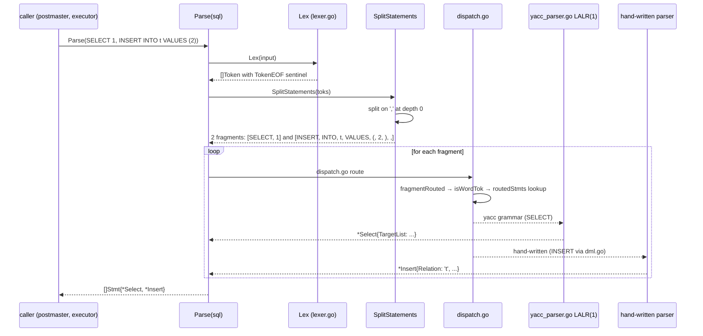
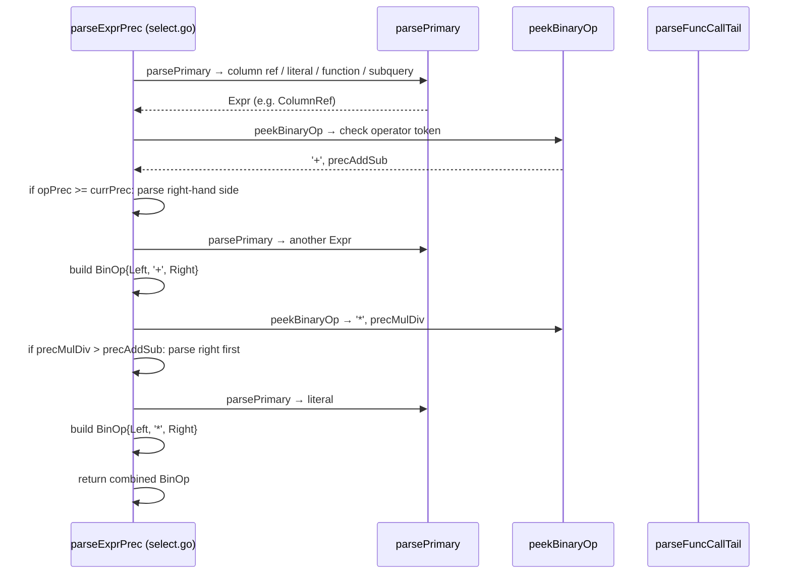

# Module: `internal/parser`

The SQL parser and lexical analyzer — a goyacc-generated LALR(1) parser with a
hand-written lexer, AST, and analyzer. The grammar lives in `grammar/*.y` and is
compiled into `yacc_parser.go` by `make gen-parser`. It is a port of
PostgreSQL's `gram.y`, not a copy: it carries synthetic terminals (`TYPEDLIT`,
`CHECKBODY`, `*_LA`), its own position primitive (`$<p>N`), and ~1.7% of
statement classes deliberately left on hand-written token scanners.

The parser is dual-engine: a **yacc grammar** for the bulk of SQL syntax and a
set of **hand-written recursive-descent parsers** for DML expressions, DDL
statements, and PL/pgSQL bodies. The analyzer (`internal/parser/analyzer/`)
resolves names, types, and coerce expressions after parsing. Main package:
**61,192 LOC** across 22+ production files.

## Key Files (by LOC)

| File                   | LOC    | Role |
|------------------------|--------|------|
| `yacc_parser.go`       | 23,210 | The generated LALR(1) parser (goyacc output). |
| `ddl.go`               | 11,411 | Hand-written recursive-descent parser for DDL statements (CREATE TABLE, ALTER, DROP, GRANT, etc.). |
| `select.go`            | 5,304  | SELECT/INSERT/UPDATE/DELETE statement tree builder — the hand-written expression and query parser (`parseExprPrec` precedence ladder, window frames, set ops, GROUPING SETS). |
| `support.go`           | 4,170  | Parser utilities: keyword matching, position tracking, dotted-name splitting (`qname`), privilege/object-name parsing, `foldNegate` (unary-minus folding). |
| `ast.go`               | 4,064  | AST node types: 150+ statement structs (`Stmt` interface), `Expr` types, `ObjectName`, `RangeVar`, `JoinExpr`, `AlterTableAction`, and the enum classes (`JoinType`, `SetOpType`, `AlterTableActionKind`, …). |
| `parser.go`            | 2,629  | `Parse`/`ParseExpr` entry points, `SyntaxError` (42601 with Pos/Code/Hint), `tokenSlicePool`. |
| `interval.go`          | 1,284  | Interval-literal grammar (SQL-standard vs PG-abbreviated typmod packing). |
| `lexer.go`             | 1,236  | Tokenizer: keyword recognition, string/identifier scanning, operator lexing, positional tracking, unicode escapes, bit/hex strings. |
| `function.go`          | 1,089  | Function-call expression parsing (ordinary, aggregate, window, ordered-set, VARIADIC, named args). |
| `dispatch.go`          | 967    | Top-level `parseStatement` routing: classifies the first token and dispatches to the yacc grammar or hand-written DDL/PL/pgSQL parsers (`routeBatch`, `routeExpr`, `fragmentRouted`). |
| `expr.go`              | 750    | Expression parsing for the hand-written path (operators, casts, subqueries, lists, COLLATE, subscript). |
| `adapter.go`           | 644    | Adapter layer bridging the yacc parser's output to the hand-written code path (token mapping, error position). |
| `dml.go`               | 602    | INSERT/UPDATE/DELETE parsing for the hand-written path. |
| `copy.go`              | 383    | COPY statement parsing (direction, endpoint, options). |
| `op.go`                | 283    | Operator parsing and maximal-munch operator scanning. |
| `keywords.go` / `keywords_gen.go` | 223/539 | Keyword registry + generated keyword table. |
| `yacc_ctors.go`        | 1,053  | AST constructor functions invoked by yacc parser actions. |
| `token.go`             | 431    | Token type definitions (`TokenKind`), keyword constants, precedence table. |
| `tokennums_gen.go`     | 534    | Generated token-number table (token → terminal). |
| `with.go` / `tables.go`| 187/82 | WITH/CTE parsing; table-listing helpers. |
| `base_yylex.go`        | 74     | goyacc lexer glue (`yyLexer` adapter). |
| `parser_pool.go`       | 43     | `sync.Pool` for token slices, reducing allocation in the lexer. |
| `analyzer/analyzer.go` | —      | Post-parse name resolution, type inference, coerce insertion. |
| `analyzer/coerce.go`   | —      | Type coercion rules (implicit casts, binary coercion). |
| `sqlkeywords/keywords.go` | —    | SQL keyword registry (unreserved, reserved, type_func_name). |

## Public API

```go
// Entry points
func Parse(input string, mc ...*mmgr.Context) ([]Stmt, error)     // parse SQL
func ParseExpr(input string, mc ...*mmgr.Context) (Expr, error)   // parse a single expression
func SplitStatements(input string) ([]string, error)              // split on statement boundaries
```

### Parser error type

```go
type SyntaxError struct {
    Pos     int    // 0-based byte offset
    Message string // "syntax error at or near "TOKEN""
    Raw     string // suppress the wrapper — used for semantic errors
    Code    string // non-42601 SQLSTATE override (e.g. "22023", "22025")
    Hint    string // e.g. SIMILAR TO's escape-string error
}
```

### Token types

```go
type TokenKind int
const (
    TokenEOF            TokenKind = iota
    TokenIdent
    TokenQuotedIdent
    TokenIntLit
    TokenNumericLit    // decimal + scientific: 1.5, 1e10, 0.5e-3
    TokenStringLit
    TokenBitStringLit  // B'…'/X'…' with marker byte 'b'/'x'
    TokenParam         // $N
    TokenSymbol
    TokenOperator
    TokenKeyword
)
```

### Statement routing

```go
func SplitStatements(toks []Token) [][]Token
func isWordTok(t Token) bool
func fragmentRouted(toks []Token) (bool, string)
func routeBatch(toks []Token) ([]Stmt, error)
func routeExpr(toks []Token) (Expr, error)
func explainInnerRouted(toks []Token) bool
func withFollowerRouted(toks []Token) bool
func isCTENameFollower(toks []Token, i int) bool
func secondKeywordRouted(toks []Token) bool
func commentRouted(toks []Token) bool
func alterDomainRouted(toks []Token) bool
func copyRouted(toks []Token) bool
func alterIndexRouted, alterViewRouted, alterMatviewRouted bool
func createRoutineRouted(toks []Token) bool
func alterTableActionsRouted(toks []Token) bool
func splitTopLevelCommas(toks []Token) [][]Token
```

### Expression parsing (from `select.go`)

```go
func parseExprPrec(p *parser, prec int) (Expr, error)
func parsePrimary(p *parser) (Expr, error)
func parseColumnOrCall(p *parser) (Expr, error)
func parseExpr(p *parser) (Expr, error)
func parseUnary(p *parser) (Expr, error)
func peekBinaryOp(p *parser) (string, bool)
func peekQualifiedOp(p *parser) (string, bool)
func parseAnyTail(p *parser) (Expr, error)
func parseInTail(p *parser, lhs Expr) (Expr, error)
func parseBetweenTail(p *parser, lhs Expr) (Expr, error)
func parseCaseExpr(p *parser) (Expr, error)
func parseExistsExpr(p *parser) (Expr, error)
func parseCastTail(p *parser) (Expr, error)
func parseFuncCallTail(p *parser) (Expr, error)
func maybeWindowTail(p *parser) error
func parseWindowDef(p *parser) (*WindowDef, error)
func parseFrameClause(p *parser) (*WindowFrameClause, error)
func parseFrameBound(p *parser) (*WindowFrameBound, error)
func parseFrameExclusion(p *parser) (WindowFrameExclusion, error)
func parseGroupingCallExpr(p *parser) (Expr, error)
func parseExtractExpr(p *parser) (Expr, error)
func parseSubstringFuncCall(p *parser) (Expr, error)
func parseOverlayFuncCall(p *parser) (Expr, error)
func parsePositionFuncCall(p *parser) (Expr, error)
func parseTrimFuncCall(p *parser) (Expr, error)
func parseSelect(p *parser) (Stmt, error)
func parseTargetList(p *parser) ([]SelectTarget, error)
func parseTargetEntry(p *parser) (SelectTarget, error)
func parseFromList(p *parser) ([]FromItem, error)
func parseJoinClause(p *parser, lhs FromItem) (FromItem, error)
func parseSetOpClause(p *parser) (Stmt, error)
func parseGroupByElems(p *parser) ([]Expr, error)
func parseSortList(p *parser) ([]SortBy, error)
func parseSelectLimitClauses(p *parser) (Expr, Expr, error)
func parseLockingClause(p *parser) ([]LockingClause, error)
func tryTypedLiteral(p *parser) (Expr, bool)
func tryIntervalTypmodQualifier(p *parser) (string, bool)
func tryConsumeIntervalPrecParen(p *parser) (int32, bool)
func decodeBitStringLit(val string) ([]byte, error)
```

### Precedence ladder constants

```
precOr, precAnd, precNot, precIs, precCompare
precBitOr, precBitXor, precBitAnd, precBitShift
precConcat, precJSON, precAddSub, precMulDiv
precPow, precUnary
```

## Internal structure

### Two-phase parsing

```mermaid
flowchart TD
    A[SQL text] --> B[lexer.go Lex]
    B --> C[Token stream via tokenSlicePool]
    C --> D{dispatch.go first-token routing}
    D -->|yacc grammar| E[yacc_parser.go LALR(1) state machine]
    D -->|hand-written DDL| F[ddl.go recursive descent]
    D -->|SELECT/DML| G[select.go / dml.go]
    D -->|PL/pgSQL body| H[pl/pgSQL parser]
    E --> I[AST via yacc_ctors.go]
    F --> I
    G --> I
    H --> I
    I --> J[analyzer.Analyze → name/type resolution]
    J --> K[optimizer.Node]
```

### Statement routing decisions

The `routedStmts` map in `dispatch.go` determines which leading keywords
go to the hand-written parser vs the yacc grammar:

```go
var routedStmts = map[string]bool{
    "explain": true, "select": true, "insert": true, "update": true,
    "delete": true, "truncate": true, "begin": true, "start": true,
    "commit": true, "rollback": true, "abort": true, "end": true,
    "set": true, "show": true, "reset": true, "refresh": true,
    "call": true, "savepoint": true, "release": true, "checkpoint": true,
    "discard": true, "deallocate": true, "prepare": true, "execute": true,
    "close": true, "declare": true, "fetch": true, "move": true,
    "analyze": true, "analyse": true, "vacuum": true, "reindex": true,
    "cluster": true, "lock": true, "merge": true, "do": true,
    // ... more
}
```

### Statement splitting

`SplitStatements` splits a token slice at top-level `;` symbols, tracking
parenthesis depth and `BEGIN ATOMIC` bodies to avoid splitting inside function
definitions:

```go
func SplitStatements(toks []Token) [][]Token {
    // tracks: depth (parentheses), atomic (inside BEGIN ATOMIC), caseDepth
    // splits on ';' when depth == 0 and !atomic
    // preserves the ';' in the fragment (so yacc sees the terminator)
}
```

### 1. Lexing (`lexer.go`)

`Lex` reads the input string and produces a `Token` stream. `lexer` methods:
- `skipWhitespaceAndComments` (incl. `--` and `/* … */`, nested block comments).
- `next` — the main token scanner, switching on the first rune.
- String scanning: `scanPlainQuoteInto`, `tryQuoteContinuation` (newline continuation), `scanEscapeQuoteInto` (E'' escapes), `lexEscapeString`, `lexUnicodeEscapeQuote` + `decodeUnicodeEscapes` (U&'' escapes), `lexBitOrHexString` (B''/X'').
- Identifier/operator rune classifiers: `isIdentStart`, `isIdentCont`, `isOpRunChar`, `isDollarTagCont` ($tag$), `isDigit`, `isHexDigit`.
- Unicode surrogate pair handling (`isUTF16SurrogateFirst/Second`, `surrogatePairToCodepoint`) for U& escapes.

Token kinds (`token.go`): `TokenEOF`, `TokenIdent`, `TokenQuotedIdent`, `TokenIntLit`, `TokenNumericLit` (decimal + scientific `1.5`, `1e10`, `0.5e-3`), `TokenStringLit`, `TokenBitStringLit` (B'…'/X'…' with marker byte `'b'`/`'x'`), `TokenParam` (`$N`), `TokenSymbol`, `TokenOperator`, `TokenKeyword`.

The lexer recycles `[]Token` backing arrays through `tokenSlicePool` (pre-sized to 64 — typical pgbench queries produce 10-20 tokens).

### 2. Parsing (`dispatch.go`)

`dispatch.go` probes the first token and routes to either the **yacc grammar** (`yacc_parser.go`) or a **hand-written sub-parser** for DDL (`ddl.go`), SELECT/DML (`select.go`/`dml.go`).

`routeBatch`/`routeExpr` classify fragments; helper predicates decide whether a fragment goes to the yacc path or a hand-written one: `isWordTok`, `fragmentRouted`, `withFollowerRouted`, `isCTENameFollower`, `explainInnerRouted`, `secondKeywordRouted`, `commentRouted`, `alterDomainRouted`, `copyRouted`, `alterIndexRouted`, `alterViewRouted`, `alterMatviewRouted`, `createRoutineRouted`, `alterTableActionsRouted`. `splitTopLevelCommas` splits ALTER action lists respecting nesting.

### 3. Expression engine (`select.go`)

`parseExprPrec` is the precedence ladder (precedence constants in `select.go`): `precOr`, `precAnd`, `precNot`, `precIs`, `precCompare`, `precBitOr`, `precBitXor`, `precBitAnd`, `precBitShift`, `precConcat`, `precJSON`, `precAddSub`, `precMulDiv`, `precPow`, `precUnary`.

### 4. DDL (`ddl.go`)

Hand-written recursive descent over CREATE TABLE (column defs, constraints, partitioning, inheritance), ALTER TABLE action lists (`AlterTableActionKind` enum), CREATE INDEX, sequences, extensions, collations, tablespaces, views, matviews, types, domains, functions/procedures, triggers, rules, policies, publications/subscriptions, event triggers, access methods, statistics, default privileges (ACL), comments, and more. `splitTopLevelCommas` feeds `alterActionRouted`-style action dispatch.

### 5. Interval grammar (`interval.go`)

SQL-standard (`INTERVAL '1 day'`) vs PG-abbreviated (`INTERVAL '1' DAY`) syntax. `splitEmbeddedInterval`, `intervalRangeLowField`, `packIntervalCastTypmod`/`packIntervalColumnTypmod`, `intervalRangeMask`, `DecodeIntervalCastTypmod` handle the typmod packing (precision + field range).

### 6. Analyzer (`analyzer/`)

Post-parse pass resolving column references, inferring types, inserting implicit coercion, and checking semantic constraints (e.g. `ON CONFLICT` arbiter index match). `NumericCoercePrecedence` ranks numeric types for coercion.

## Key flow: parsing a batch



## Key flow: expression parsing with precedence



## Dependencies

- **Used by** — `internal/optimizer` (planner consumes AST), `internal/executor` (DDL operators call `Parse` for SQL bodies), `internal/nodes` (serialization), `internal/postmaster` (SQL dispatch), `internal/pl/plpgsql` (SQL parsing in PL/pgSQL bodies), `internal/initdb` (bootstrap seeds).
- **Uses** — `internal/utils/mmgr` (memory-context allocation), `internal/nodes` (AST node types), `internal/parser/analyzer` (post-parse analysis), `internal/utils/adt/similarto` (SIMILAR TO folding).

## Notable patterns / gotchas

- **Dual-engine parser** — the yacc grammar and hand-written parsers are sibling paths; a statement class must be handled by exactly one (yacc → `yacc_parser.go`, hand-written → `ddl.go` / `select.go` / `dml.go`). The dispatch at `dispatch.go:parseStatement` decides which path to take.
- **Synthetic terminals** — `TYPEDLIT`, `CHECKBODY`, `*_LA` (e.g., `SELECT_LA`, `FOR_LA`) are goopg-specific additions to the grammar. They have no upstream counterpart in `gram.y` and exist to resolve LALR conflicts.
- **Position tracking** — `$<p>N` is goopg's stand-in for yacc's `@n`. The `lastConsumedPos()` helper silently returns the wrong token in specific reduce states — the `parser_pool.go` fixture and `ErrorResponse.Position` tests exercise this.
- **`make gen-parser`** — always build with `make gen-parser`, never `go build` alone, which compiles a stale generated parser. The oracle is `internal/parser/testdata/parity_goldens.txt`; regenerate with `GOOPG_UPDATE_GOLDENS=1 go test ./internal/parser/`.
- **analyzer.go** — the analyzer is a separate pass that walks the parser AST and produces the optimizer IR. It resolves column references, infers types, inserts implicit casts, and checks semantic constraints (e.g., `ON CONFLICT` arbiter index match).
- **Conflict pin** — `grammar/goopg_ext.y` carries a conflict pin document (currently 60 shift/reduce, 0 reduce/reduce). Changes that add new conflicts must be justified and the pin updated.
- **`foldNegate` diverges from legacy** — unary minus on a numeric literal FOLDS into the constant (`SELECT -1` → `IntegerConst{-1}`), whereas the legacy hand-written parser built `UnaryOp{UnaryNeg, IntegerConst{1}}`. The divergence is deliberate and pinned by `TestKnownDiffUnaryMinusFold`; BETWEEN's signed bounds inherit the folding consistently.
- **`qname` 4-part degradation** — `columnRefFromParts`/`rangeVarFromName` interpret 1..3 parts; a 4-part name degrades to its last three parts instead of upstream's "improper qualified name" error (no differential fixture exercises it).
- **`tokenSlicePool` is heap-backed** — the earlier mctx token-arena fast path was retired as fundamentally GC-unsafe (doc 0107-0003d); steady-state lexing is allocation-free via the pool.
- **`TokenBitStringLit` carries a marker byte** — the value is `'b'`/`'x'` + raw unvalidated digits (mirroring scan.l's `addlitchar` convention); decoding happens later in `select.go`'s `decodeBitStringLit`.
- **Non-42601 SQLSTATEs from the grammar** — `SyntaxError.Code` lets a handful of parse-time errors report their real code (22023 for precision checks, 22025 for SIMILAR TO escapes) instead of a generic syntax error, keeping `internal/parser` free of an sqlstate import.
- **`ParseExpr` rejects trailing tokens** — a caller passing `1 + 2; garbage` gets a clean syntax error so PL/pgSQL body parsing cannot silently ignore garbage.
- **British spelling alias** — `ANALYSE` is accepted as `ANALYZE` and `ABORT`/`END` alias `ROLLBACK`/`COMMIT`, matching upstream keyword tables.
- **`BEGIN ATOMIC` body splitting** — `SplitStatements` tracks `BEGIN ATOMIC` ... `END` blocks to avoid splitting on `;` inside function bodies; `caseDepth` handles nested `CASE ... END` inside the atomic body.
- **`;` inside parentheses is not a separator** — `CREATE RULE r AS ON INSERT TO t DO INSTEAD (DELETE FROM t; DELETE FROM t)` is one statement; `SplitStatements` tracks parenthesis depth to avoid splitting on the inner `;`.

## Lexer detail: token scanning

The lexer in `lexer.go` processes the input rune-by-rune in its `next` method:

- **Identifiers and keywords** — start with a letter/underscore (`isIdentStart`),
  continue with letters/digits/`$` (`isIdentCont`). Matched against the keyword
  table; if found, the token kind is `TokenKeyword`. Otherwise `TokenIdent`.
- **Numeric literals** — `0x` prefix → hex integer; leading digit → scan digits,
  then optional `.`, `e`/`E`, sign → `TokenIntLit` or `TokenNumericLit`. The
  marker byte distinguishes them.
- **String literals** — `'...'` → `scanPlainQuoteInto` with `tryQuoteContinuation`
  for multi-line strings; `E'...'` → `scanEscapeQuoteInto` with `lexEscapeString`
  for C-style escapes; `U&'...'` → `lexUnicodeEscapeQuote` + `decodeUnicodeEscapes`
  for Unicode escapes with optional `UESCAPE`.
- **Bit/hex strings** — `B'...'` / `X'...'` → `lexBitOrHexString`. The marker
  byte `'b'`/`'x'` is prepended to the raw unvalidated digits.
- **Operators** — `isOpRunChar` identifies operator-starting characters (`+`, `-`,
  `*`, `/`, `<`, `>`, `=`, `~`, `!`, `@`, `#`, `%`, `^`, `&`, `|`, `` ` ``).
  Maximal-munch scanning (`op.go`) merges multi-character operators (`<>`, `<=`,
  `>=`, `->`, `->>`, `#>>`, `@>`).
- **Dollar quoting** — `$tag$...$tag$` → `isDollarTagCont` matches tag
  characters; the body is consumed as a single `TokenStringLit`.
- **Comments** — `--` to end-of-line and `/* ... */` (nested, counted via
  `depth` in `skipWhitespaceAndComments`).

## Token pool recycling

```go
var tokenSlicePool = sync.Pool{
    New: func() any {
        s := make([]Token, 0, 64)  // pre-sized to 64
        return &s
    },
}
```

The lexer borrows a `*[]Token` from the pool, appends tokens, and returns it
to the pool after parsing. Typical pgbench queries produce 10-20 tokens, so
the 64-slot pre-size avoids reallocation for the vast majority of statements.
The pool is the reason the earlier mctx token-arena fast path was retired
(doc 0107-0003d — the arena was fundamentally GC-unsafe).

## `foldNegate` walkthrough

The expression `SELECT -1 + -2` with `foldNegate`:

1. Lexer produces: `SELECT`, `-`, `1`, `+`, `-`, `2`.
2. The parser's expression engine parses unary `-` as `UnaryOp` with operator
   `UnaryNeg` and operand `IntegerConst{1}` for the first `-1`.
3. `foldNegate` checks: is this a `UnaryOp{UnaryNeg, IntegerConst{n}}`? Yes.
   → Replace with `IntegerConst{-1}`.
4. Same for the second `-2` → `IntegerConst{-2}`.
5. The `+` operator sees `IntegerConst{-1}` and `IntegerConst{-2}`, producing
   either a `BinOp` or (if the hand-written path folds it) `IntegerConst{-3}`.

The legacy parser did NOT fold: `SELECT -1` produced `UnaryOp{UnaryNeg,
IntegerConst{1}}`. The divergence is deliberate and pinned by
`TestKnownDiffUnaryMinusFold`. BETWEEN's signed bounds inherit the folding
consistently.

## DDL parser structure

`ddl.go` (11,411 LOC) is organized by statement class:

- **CREATE TABLE** (core) — column definitions, constraints (PRIMARY KEY,
  UNIQUE, CHECK, FOREIGN KEY, NOT NULL, EXCLUDE), inheritance (`INHERITS`),
  partitioning (`PARTITION BY` `PARTITION OF` + subcommands), storage
  parameters (`WITH (fillfactor=100)`), `ON COMMIT`, `TABLESPACE`.
- **ALTER TABLE** — action dispatch via `AlterTableActionKind` enum: `SET
  DEFAULT`, `DROP DEFAULT`, `SET NOT NULL`, `DROP NOT NULL`, `ADD COLUMN`,
  `DROP COLUMN`, `ALTER COLUMN TYPE`, `RENAME COLUMN`, `SET STATISTICS`,
  `SET STORAGE`, `ADD CONSTRAINT`, `VALIDATE CONSTRAINT`, `DROP CONSTRAINT`,
  `RENAME CONSTRAINT`, `ENABLE/DISABLE TRIGGER`, `SET WITHOUT CLUSTER`,
  `SET WITH OIDS`, `CLUSTER ON`, `SET TABLESPACE`, `SET LOGGED/UNLOGGED`,
  `ALTER COLUMN SET/ADD/DROP ...`, `OWNER TO`, etc.
- **CREATE INDEX** — `CONCURRENTLY`, `UNIQUE`, `USING` method, `INCLUDE`,
  `NULLS [NOT] DISTINCT`, `WITH` storage params, `TABLESPACE`, `WHERE` predicate.
- **CREATE FUNCTION/PROCEDURE** — `OR REPLACE`, argument mode (`IN`/`OUT`/
  `INOUT`/`VARIADIC`), argument types with typmod, `RETURNS TABLE`, language,
  `AS` body, `WINDOW`, `PARALLEL`, `COST`, `ROWS`, `SET` clauses, `CALL` statement
  parsing (in `function.go`).
- **CREATE VIEW/MATVIEW** — `OR REPLACE`, `WITH (security_barrier)`,
  `WITH NO DATA`, `TABLESPACE`.
- **GRANT/REVOKE** — privilege types, object classes, `GRANT OPTION`, `CASCADE`
  /`RESTRICT`.
- **CREATE PUBLICATION/SUBSCRIPTION** — `FOR TABLE/ALL TABLES`, `WITH
  (publish)`, `CONNECTION`, `PUBLICATION` list, `COPY DATA`, `ENABLE/DISABLE`.
- **COMMENT** — `COMMENT ON {TABLE|COLUMN|...} name IS 'text'`.
- **Security labels, policies, event triggers, access methods, statistics
  objects, casts, conversions, collations, domains, extensions, foreign data
  wrappers, servers, user mappings, text search** — each has its own entry path.

## Yacc grammar structure

`yacc_parser.go` (23,210 LOC, goyacc-generated from `grammar/*.y`):

- The LALR(1) state machine covers SQL statements not handled by the
  hand-written path: `SELECT` (most forms), `INSERT`, `UPDATE`, `DELETE`,
  `MERGE`, `TRUNCATE`, transaction commands (`BEGIN`, `COMMIT`, `ROLLBACK`,
  `SAVEPOINT`, `RELEASE`, `PREPARE TRANSACTION`), cursor operations, `LOCK`,
  `EXPLAIN`, `CALL`, `DO`, `SET`/`SHOW`/`RESET`, `VACUUM`/`ANALYZE`/`REINDEX`/
  `CLUSTER`, `PREPARE`/`EXECUTE`/`DEALLOCATE`, `DISCARD`, `CHECKPOINT`, and
  others.
- AST constructors are factored into `yacc_ctors.go` (~1,050 LOC), kept short
  so the `.y` stays diffable against upstream. Anything >10 lines lives
  out-of-line in `support.go` (porting-guide rule 3).
- The `grammar/goopg_ext.y` file carries 60 shift/reduce conflicts (pinned).
  Changes that add new conflicts must be justified.

## The `Analyze` post-parse pass

`internal/parser/analyzer/analyzer.go` walks the parser AST and produces the
optimizer IR:

1. **Name resolution** — `SELECT t.a FROM tab t` → `ColumnRef{a}` →
   `ResolvedColumn{rel=tab, attr=a}`.
2. **Type inference** — `1 + 1.5` → determine that `int4 + numeric` needs
   coercion → `numeric + numeric`.
3. **Coercion insertion** — add `CoercionExpr` nodes for implicit casts
   (e.g. `text → unknown` for string literals `'foo'`).
4. **Semantic constraints** — `ON CONFLICT (col) DO UPDATE SET col = 1` →
   verify that `col` is covered by a unique index.

```go
func Analyze(stmt parser.Stmt, cat catalog.Catalog) error
func NumericCoercePrecedence(typeName string) int
```

## Window-function parsing

`select.go`'s `maybeWindowTail` → `parseWindowDef` handles `OVER (...)`:

1. After a function call, `maybeWindowTail` peeks for `OVER`.
2. `parseWindowDef` parses either a named window reference (`OVER w`) or an
   inline window definition (`OVER (PARTITION BY ... ORDER BY ... FRAME)`).
3. `parseWindowSpecBody` parses the `PARTITION BY` list, `ORDER BY` list
   (`parseSortList`), and the frame clause.
4. `parseFrameClause` parses `ROWS`/`RANGE`/`GROUPS` + `BETWEEN ... AND ...` +
   `EXCLUDE` (via `parseFrameBound` and `parseFrameExclusion`).

Window-frame grammar support (from `window_test.go`):
- `ROWS BETWEEN 1 PRECEDING AND CURRENT ROW`
- `RANGE UNBOUNDED PRECEDING`
- `GROUPS BETWEEN 2 PRECEDING AND 2 FOLLOWING`
- `EXCLUDE CURRENT ROW` / `EXCLUDE GROUP` / `EXCLUDE TIES` / `EXCLUDE NO OTHERS`
- Named windows combined with inline frames (`OVER w ROWS BETWEEN ...`)

## Typed literals

`tryTypedLiteral` parses `DATE '2026-01-01'`, `TIME '...'`,
`TIMESTAMP '...'`, `TIMESTAMPTZ '...'`, `INTERVAL '...'`, etc. The
type keyword + string-literal pair is normalized so the yacc grammar and the
hand-written path agree:

- `tryIntervalTypmodQualifier` / `tryConsumeIntervalPrecParen` handle
  `INTERVAL '1' DAY` and `INTERVAL '1 day' (3)` forms.
- `synthesizeBareCharTypmod` handles `CHAR(n)`/`VARCHAR(n)` without a type
  name.

## LIKE / SIMILAR TO handling

- `wrapLikeEscape` / `parseOptionalEscape` parse `LIKE 'x' ESCAPE 'y'` and the
  shorthand `ILIKE`.
- `buildSimilarTo` + `foldSubstringSimilar` convert `SIMILAR TO` patterns into
  a regexp-based AST, matching PG's `SIMILAR TO` semantics. The escape-string
  error raises SQLSTATE 22025 (via `SyntaxError.Hint`).

## CTE / WITH parsing (`with.go`)

- `parseWithClause` parses `WITH [RECURSIVE] cte, cte...`.
- `parseCTE` parses one `name [(col, ...)] AS [NOT] MATERIALIZED (query)`.
- `parseSelectWithCTE` / `parseInsertWithCTE` / `parseUpdateWithCTE` /
  `parseDeleteWithCTE` wire the CTE list into the statement.

## COPY statement parsing (`copy.go`)

Parses `COPY table [(cols)] FROM/TO 'file'|PROGRAM 'cmd'|STDIN/STDOUT
[WITH (options)]`. Handles direction (FROM/TO), endpoint (file/program/
stdin/stdout), CSV/BINARY/HEADER/DELIMITER/QUOTE options, and the legacy
`COPY ... WITH CSV` form. The `copyRouted` predicate in `dispatch.go` sends
COPY to the hand-written path.

## `op.go` operator scanning

Maximal-munch operator scanning: given an operator-starting rune, consume the
longest valid operator from the operator table. This is how `->>` is
distinguished from `->` + `>`, and how `#>>` and `@>` are recognised. The
operator table in `token.go` includes the precedence for each operator,
which `parseExprPrec` consults for the precedence ladder.