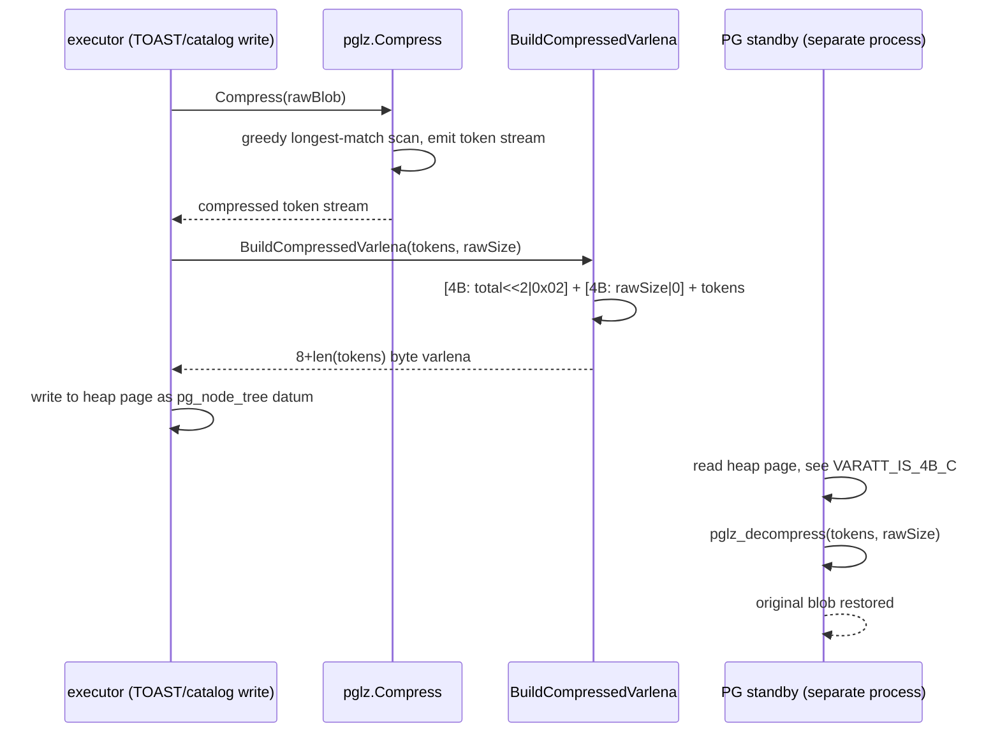
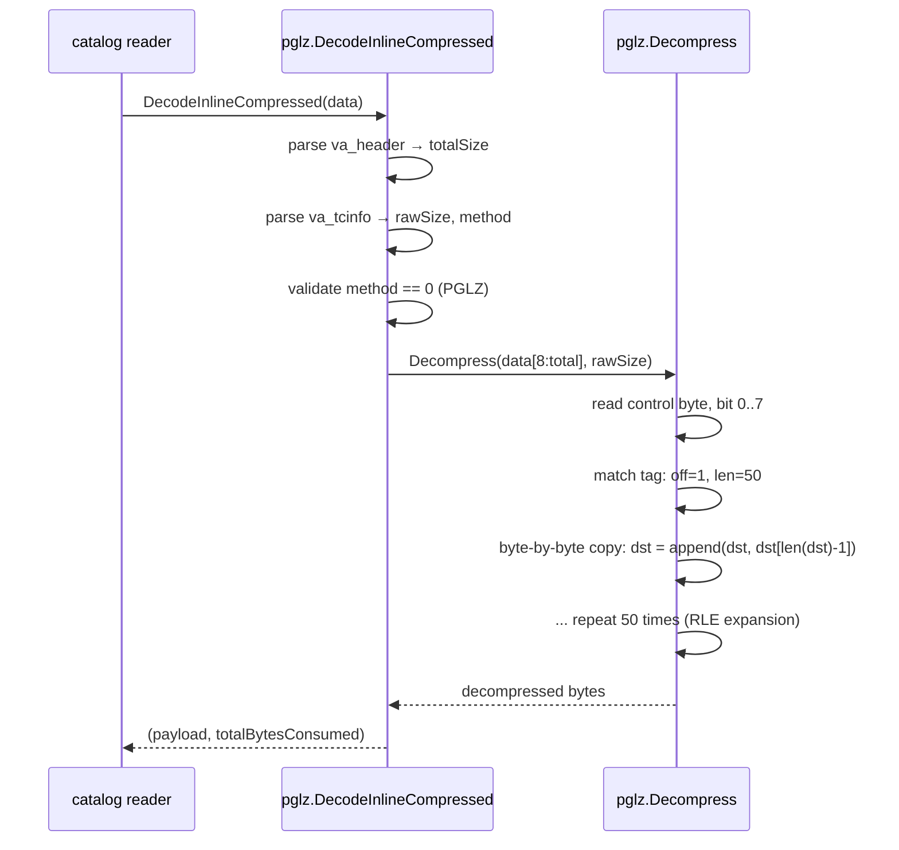
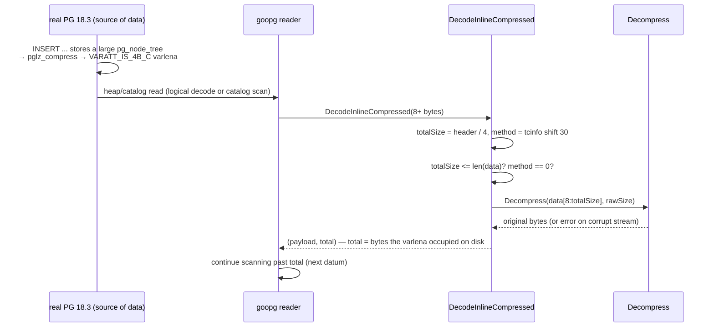
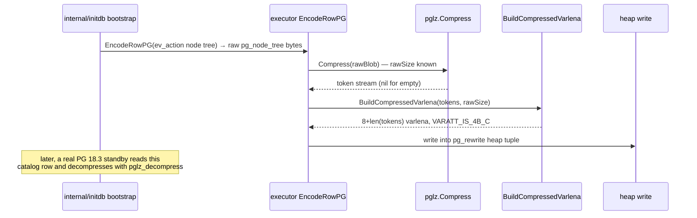

# Module: `internal/access/common/pglz`

PostgreSQL's **PGLZ (Lempel-Ziv) compression** — a faithful port of
`src/common/pg_lzcompress.c` / `src/include/varatt.h`, used for
inline-compressed varlena values (`VARATT_IS_4B_C`). This is the codec that
keeps goopg's compressed catalog blobs (e.g. bootstrap `pg_rewrite.ev_action`
`pg_node_tree`) readable by a real PG 18.3, and that lets goopg decompress
inline-compressed varlena values a real PG wrote (heap/catalog reads, logical
replication decode).

## Key Files

| File | LOC | Role |
|---|---|---|
| `pglz.go` | 220 | The whole codec: `Compress`, `Decompress`, `BuildCompressedVarlena`, `DecodeInlineCompressed`, and the PGLZ token-stream constants. |
| `pglz_test.go` | 181 | Round-trip tests spanning empty/single/short/long/repetitive/mixed inputs, PG-spec token-stream decode, high offset, corrupt-stream rejection, varlena framing, LZ4 rejection. |

## Constants

| Name | Value | Description |
|---|---|---|
| `CompressionMethodPGLZ` | 0 | `ToastCompressionId_PGLZ`, stored in top 2 bits of `va_tcinfo` |
| `minMatchLen` | 3 | Shortest back-reference PGLZ encodes; shorter runs are literals |
| `maxMatchLen` | 273 | Maximum encoded run length: `18 + 255` (nibble saturates at 0x0f → base 18, extension byte adds 0..255) |
| `maxOffset` | 4095 | Largest back-reference distance the 12-bit offset field can encode |
| `extSizeMask` | `(1<<30)-1` | Low 30 bits of `va_tcinfo` = original (decompressed) size; top 2 bits = compression method |

## Public API

```go
func Compress(data []byte) []byte                    // raw PGLZ token stream (no varlena header)
func Decompress(src []byte, rawSize int) ([]byte, error)  // raw stream → original bytes
func BuildCompressedVarlena(compressed []byte, rawSize int) []byte  // full on-disk VARATT_IS_4B_C value
func DecodeInlineCompressed(data []byte) ([]byte, int, error)      // parse + decompress inline-compressed varlena
```

## Internal structure

### Compressor control-byte framing

```mermaid
flowchart TD
    subgraph Compress
        IN[raw bytes]
        LOOP["for i < len(data)"]
        CTRL[emit control-byte placeholder]
        BIT[for 8 bits per control byte]
        SEARCH["scan history window i-maxOff..i-1<br/>for longest match ≥ 3 bytes"]
        MATCH{"bestLen ≥ minMatchLen?"}
        MATCH -- yes --> TAG["emit match tag: 2 bytes<br/>(len nibble + off high nibble + off low byte)<br/>+ optional extension byte"]
        MATCH -- no --> LIT[emit literal byte]
        TAG --> ADV["i += bestLen"]
        LIT --> ADV[i++]
        ADV --> BIT
        BIT --> CTRL2["fill control byte<br/>(LSB-first match/literal bits)"]
        CTRL2 --> LOOP
        LOOP --> OUT[token stream]
    end

    subgraph Decompress
        SRC[token stream]
        RAW[rawSize known upfront]
        CTRL_READ[read control byte]
        BIT_READ[for 8 bits]
        TST{"ctrl bit == 1?"}
        TST -- match --> DECODE_TAG["read 2 bytes + optional ext byte<br/>length = nibble+3, off = hi<<4|lo"]
        TST -- literal --> DECODE_LIT[copy one byte verbatim]
        DECODE_TAG --> COPY["byte-by-byte copy<br/>start = len(dst)-off<br/>for k in 0..length:<br/>dst = append(dst, dst[start+k])"]
        DECODE_LIT --> COPY
        COPY --> BIT_READ
        BIT_READ --> CTRL_READ
        CTRL_READ --> DST_CHECK{"len(dst) == rawSize?"}
        DST_CHECK -- yes --> DST[dst bytes]
    end
```



### Compression: greedy longest-match walkthrough

The compressor iterates the input byte-by-byte, grouping output into chunks of 8 events per control byte:

1. **Control byte reservation** — at `ctrlIdx = len(out)`, reserve one byte; after 8 events, write `ctrl` back to `out[ctrlIdx]`.
2. **Window scan** — for current position `i`, scan history window `[i-maxOff, i-1]` bounded by `maxOff = min(i, maxOffset)`. For each offset, compare bytes; track the longest run at least `minMatchLen` (3) bytes long, up to `maxMatchLen` (273).
3. **Match emission** — when `bestLen ≥ minMatchLen`, set the control bit (1). Compute `lenCode = bestLen - minMatchLen` (0..270). If `lenCode < 0x0f`, emit 2 bytes: `byte(lenCode|offHi), byte(bestOff&0xFF)`. If `lenCode ≥ 0x0f`, emit 3 bytes: `0x0f|offHi, byte(bestOff&0xFF), byte(bestLen-18)`. Advance `i += bestLen`.
4. **Literal emission** — when no match found, clear the control bit (0) and emit one literal byte. Advance `i += 1`.
5. **Control byte finalization** — after 8 bits or end of input, write the completed control byte to the reserved slot.

### Decompressor: bit-by-bit walkthrough

```
For each control byte at src[sp]:
  for bit 0..7 (while sp < len(src) and len(dst) < rawSize):
    if ctrl bit == 1 (match):
      read b0, b1 from src[sp..sp+2]
      length = (b0 & 0x0f) + 3
      off = ((b0 & 0xf0) << 4) | b1
      if length == 18: read extension byte, length += extension
      validate off > 0 && off <= len(dst)
      clamp length to remaining = rawSize - len(dst)
      byte-by-byte copy: for k in 0..length: dst = append(dst, dst[len(dst)-off+k])
    else (literal):
      dst = append(dst, src[sp]); sp++
After loop: if len(dst) != rawSize → error
```

### Format

A compressed varlena is:

```
[4 B va_header  = (totalSize * 4) | 0x02]    VARATT_IS_4B_C
[4 B va_tcinfo  = rawSize | (method << 30)]
[compressed PGLZ token stream]
```

- `va_header` low 2 bits = `0b10` (the `VARATT_IS_4B_C` tag); the high 30 bits = total byte count of the entire compressed datum (header + token stream).
- `va_tcinfo` low 30 bits = original (decompressed) size; top 2 bits = `ToastCompressionId` (PGLZ = 0, LZ4 = 1 — only PGLZ is implemented).
- `BuildCompressedVarlena` produces the full 8+-byte on-disk value: `buf[0:4] = varatt header`, `buf[4:8] = va_tcinfo`, `buf[8:] = token stream`.
- `DecodeInlineCompressed` parses the header, validates `method == PGLZ`, validates `total <= len(data)`, calls `Decompress(data[8:total], rawSize)`, and returns the decompressed payload plus the total bytes consumed.

### Token format

A match tag is 2 bytes, with an optional third extension byte:

```
  b0: [off_hi:4][len:4]
  b1: [off_lo:8]
  b2: [ext_byte]   -- only when len nibble == 0x0f
```

- **Length**: 4-bit nibble in the low part of b0. `lenCode = matchLen - 3`; values `0..0x0e` encode lengths 3..17 directly. `0x0f` is a sentinel: base length = 18, and an extension byte (b2) adds 0..255 more, so maximum encodable length = 18 + 255 = **273**.
- **Offset**: 12 bits, split across the high nibble of b0 (upper 4 bits) and b1 (lower 8 bits). Maximum offset = 4095. A zero offset or one that reaches before the output start is corrupt (rejected by `Decompress`).
- **Overlapping copies**: when `offset < length`, the decompressor must perform a byte-by-byte copy from the already-expanded output (this is how single-byte RLE is encoded: off=1, any length up to 273). `Decompress` uses a per-byte `append` loop, not a `copy()`, because dst is pre-sized to `rawSize` and the append never reallocates.

### Error messages from the source

| Condition | Error string |
|---|---|
| Negative rawSize | `"pglz: negative rawSize %d"` |
| Truncated match tag | `"pglz: truncated match tag"` |
| Truncated extension byte | `"pglz: truncated extension byte"` |
| Invalid offset | `"pglz: invalid offset %d at output pos %d"` |
| Size mismatch | `"pglz: decompressed %d bytes, want %d"` |
| Truncated varlena header | `"pglz: truncated compressed varlena header"` |
| Total size inconsistency | `"pglz: truncated compressed varlena (total=%d, have=%d)"` |
| Unsupported method | `"pglz: unsupported varlena compression method %d"` |

## Key flow: compression round-trip for a catalog blob



## Key flow: decompression with overlapping RLE



## Test coverage

| Test function | What it covers |
|---|---|
| `TestRoundTrip` | Empty/single/short/long/repetitive/mixed inputs |
| `TestCompressActuallyShrinks` | Compress produces smaller output for compressible data |
| `TestDecompressPGSpecTokens` | Token stream built by hand matches PG's format |
| `TestDecompressHighOffset` | Offsets up to 4095 are decoded correctly |
| `TestDecompressCorrupt` | Truncated/zero-offset/bad-size streams are rejected |
| `TestVarlenaFraming` | `BuildCompressedVarlena` + `DecodeInlineCompressed` round-trip |
| `TestDecodeInlineCompressedRejectsLZ4` | Method byte 1 raises "unsupported" error |

## Dependencies

- **Used by** — `internal/executor` (TOAST / catalog blob writes), `internal/initdb` (bootstrap `ev_action` compression), `internal/catalog` (heap varlena reads).
- **Uses** — nothing inside `internal/` (leaf package); only the standard library (`encoding/binary`, `fmt`).

## Notable patterns / gotchas

- **`maxMatchLen` off-by-one** — the length nibble saturates at `0x0f` giving a base of 18, and the extension byte adds up to 255 more (so the max encodable run is 273, not 272); compressing a run longer than this requires emitting multiple matches. Decompress must accept exactly the lengths `Compress` can produce.
- **Window** — `maxOffset = 4095` means matches can only reference the last 4095 bytes; a match that would reach further back must be split or emitted as literals.
- **Round-trip by contract** — goopg's encoder need not byte-match PG's, but its stream must be decodable by PG's `pglz_decompress`, and goopg's `Decompress` must decode any PG stream. Do not "optimize" the format.
- **Overlapping RLE** — when `offset < length`, a naive `copy(dst[start:], dst[:len])` would read from unexpanded bytes. The byte-by-byte append loop correctly handles this by always reading from already-expanded positions.
- **`DecodeInlineCompressed` vs raw `Decompress`** — the former parses the 8-byte varlena header, validates the compression method, and validates the total size; the latter is the raw token-stream decoder used when the caller already knows `rawSize` (e.g. from a `varlena` header they parsed themselves).
- **Compression method encoding** — the top 2 bits of `va_tcinfo` distinguish PGLZ (0) from LZ4 (1) and future methods (2, 3). `DecodeInlineCompressed` rejects any method ≠ 0 with a specific error rather than attempting to "decompress" bytes that are not PGLZ tokens.
- **LZ4 is unimplemented** — PG 18 added LZ4 as an alternative compression method; goopg decompresses LZ4 values from a real PG's catalog by rejecting them. The constant `CompressionMethodPGLZ = 0` and the method bits in `va_tcinfo` are prepared for a future LZ4 port.
- **Empty input returns nil** — `Compress(nil)` returns `nil`, not an empty slice; callers must handle nil as "no compression needed".
- **Negative rawSize** — `Decompress` checks `rawSize < 0` upfront and returns an error before allocating any buffer.
- **Control byte = 0xff** — a control byte with all 8 bits set (8 matches) is valid; the compressor emits this when 8 consecutive positions find matches.
- **`Decompress` dst is pre-sized** — `make([]byte, 0, rawSize)` ensures the per-byte `append` never reallocates, making the byte-by-byte copy safe even for overlapping RLE.

## Worked example: byte-level encoding

Consider the input `aaaaaaaaaaaaaaaaaaaa` (20 `a` bytes). The compressor:

1. `i=0`: scans the (empty) window — no match, so emits literal `'a'` (control bit 0).
2. `i=1`: window is `[0,0]` = `a`; matches 1 byte, below `minMatchLen`, so emits literal `'a'`.
3. `i=2`: window `[1,1]` and `[0,0]` — offset 1 matches 18 bytes (`a` at positions 1..18 == positions 2..19), but `maxMatchLen` is 273 so 18 is encodable directly: `lenCode = 18-3 = 15 = 0x0f`, so this needs the extension byte form: `b0 = 0x0f | 0`, `b1 = 0x01` (offset 1), `b2 = 18-18 = 0`. Control bit set. `i += 18`.
4. Input consumed; the control byte had 3 events set (bits 0,1,2), remaining bits 0.

Output token stream (with control byte `0b00000111` = `0x07`):
```
0x07   'a'   'a'   0x0f   0x01   0x00
[ctrl] [lit] [lit] [tag b0] [tag b1] [ext]
```

`Decompress` reads `ctrl=0x07`, bit 0 → literal `'a'`; bit 1 → literal `'a'`; bit 2 → match with `off=1`, `length = 15+3 = 18`, extension byte `0` → `length = 18`. It then appends `dst[len(dst)-1]` eighteen times, expanding the RLE run. Result: 20 `a` bytes.

## Key flow: reading an inline-compressed varlena from a real PG catalog



## Key flow: compressing a bootstrap catalog blob for a PG standby



## Compression effectiveness heuristics

PGLZ is a **byte-oriented** LZ77 variant, not entropy coding. Its compression
ratio is modest on typical SQL text but extremely effective on:

- **Repeated runs** (`pg_rewrite` ev_action blobs contain lots of repeated
  sub-expressions like `"SELECT"` `"FROM"` tokens) — encoded as RLE with
  offset 1.
- **Catalog tuples with many common prefixes** — long matches in the 4095-byte
  window.
- It is **ineffective** on already-compressed or high-entropy data (the
  compressor falls back to mostly literals, and the 8-byte header + control
  bytes may even inflate tiny inputs — which is why `Compress` returns `nil`
  for empty input and callers are expected to keep very small datums
  uncompressed).

## Relationship to PG's encoder

PG's `pglz_compress` uses a **hash-chain matcher** (a 1024-entry hash table of
`hist_entries`) plus the `good_match` heuristic: once a match of at least 32
bytes is found, it stops scanning and emits it. goopg's encoder is a **brute-force
greedy scan** over the whole 4095-byte window. Consequences:

- Output **differs byte-for-byte** between the two encoders for the same input.
- Both are valid PGLZ streams, so each round-trips through the other's
  decompressor — this is the round-trip-by-contract guarantee the package
  relies on.
- goopg's scan is O(n × window) worst case but n is bounded by `maxOffset`
  (4095) per position, so it stays practical for the bootstrap-sized blobs it
  is used on.

## Interactions with TOAST and catalog readers

- **`VARATT_IS_4B_C` is only one varlena form** — PG also has `VARATT_IS_4B_U`
  (uncompressed, 4-byte length) and short/1-byte forms. `DecodeInlineCompressed`
  handles exactly the 4B_C compressed form; callers dispatch on the header tag
  before calling it.
- **Method bits are future-proofed** — LZ4 is method 1; methods 2 and 3 are
  reserved for PG's future `ToastCompressionId` values. goopg's method check is
  `!= 0 → error`, so any non-PGLZ method fails loudly rather than corrupting.
- **The `rawSize` and `total` fields are both validated independently** —
  `DecodeInlineCompressed` checks `total` against the buffer length and
  `Decompress` checks the produced length against `rawSize`, so a truncated or
  internally-inconsistent varlena cannot silently produce partial output.

## Decompress: per-bit example

Take the token stream `0x03 0x41 0x42 0x43` with `rawSize = 3`:

1. `ctrl = 0x03` (`0b00000011`): bit 0 set → match tag.
   - `b0 = 0x41` → `length = (0x41 & 0x0f) + 3 = 1 + 3 = 4`; `off = ((0x41 & 0xf0) << 4) | 0x42 = 0x10 | 0x42 = 0x52`? No — wait: `0x41 & 0xf0 = 0x40`, `0x40 << 4 = 0x400`, `| 0x42 = 0x442`. But `len(dst) = 0`, so `off > len(dst)` → **error: invalid offset**. A match tag cannot reference the empty output.
   - Realistic: a stream starting with a literal. If `ctrl = 0x02` (bit 1 set, bit 0 clear): bit 0 → literal `0x41`; bit 1 → match tag from `0x42 0x43`, `length = (0x42 & 0x0f)+3 = 2+3 = 5` (not 18, no extension byte), `off = ((0x42 & 0xf0)<<4) | 0x43`. With `len(dst)=1`, `off` must be ≤ 1, which `0x443` is not → error again. The point: the first event after the control byte must be a literal (or a match with offset ≤ the already-expanded output), and the decoder's `off == 0 || off > len(dst)` guard catches streams that try to reference before the start.

## Compressor capacity trade-off

The compressor pre-sizes its output buffer to `n/2 + 64` bytes (`make([]byte, 0, n/2+64)`), a heuristic assuming roughly 2:1 compression. A worst-case input (high-entropy, no matches) produces about `n + n/8` bytes (one control byte per 8 literals) plus a 64-byte safety margin. Because `append` grows the slice dynamically, an incompressible input still compresses correctly — it just exceeds the pre-size and reallocates. `BuildCompressedVarlena` then adds the 8-byte header. Callers that care about payload size should compare `len(Compress(data)) + 8 < len(data)` before choosing the compressed form (matching PG's `toast` heuristic which keeps small datums uncompressed).

## Zero-length and single-byte inputs

- `Compress([]byte{})` → `nil` (callers treat as "no compression needed").
- `Compress([]byte{'x'})` → control byte `0x01` (bit 0 set) + literal `'x'` — 2 bytes for 1 byte of input. This is why compression is only a win past a small threshold.
- `Decompress([]byte{0x01, 'x'}, 1)` → `[]byte{'x'}`; `Decompress(empty, 0)` → `[]byte{}` (the loop body never runs, and `len(dst) == 0 == rawSize` passes).
- `Decompress(anything, 0)` with non-empty input: the inner loop condition `len(dst) < rawSize` is false immediately, so control bytes are never consumed — but the final `len(dst) != rawSize` check still passes, silently ignoring the input. Callers should treat `rawSize == 0` with non-empty `src` as suspicious (PG never produces it).