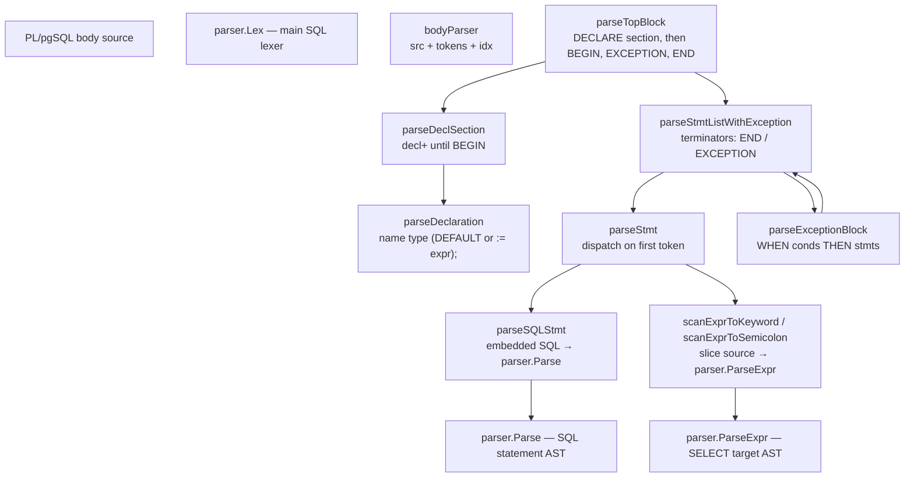
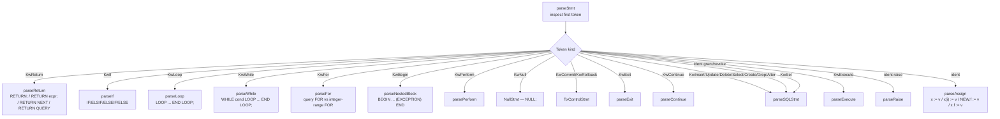
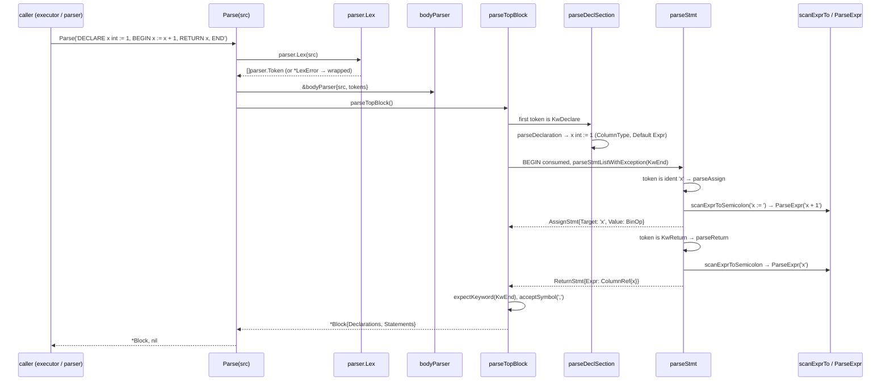
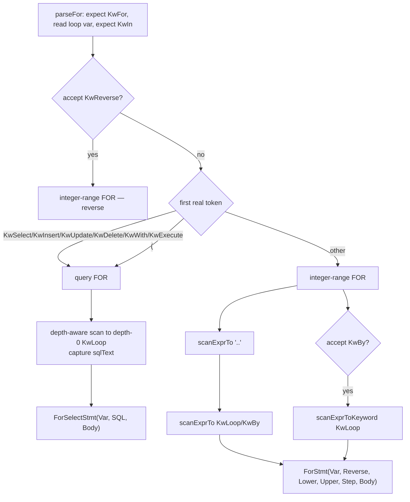
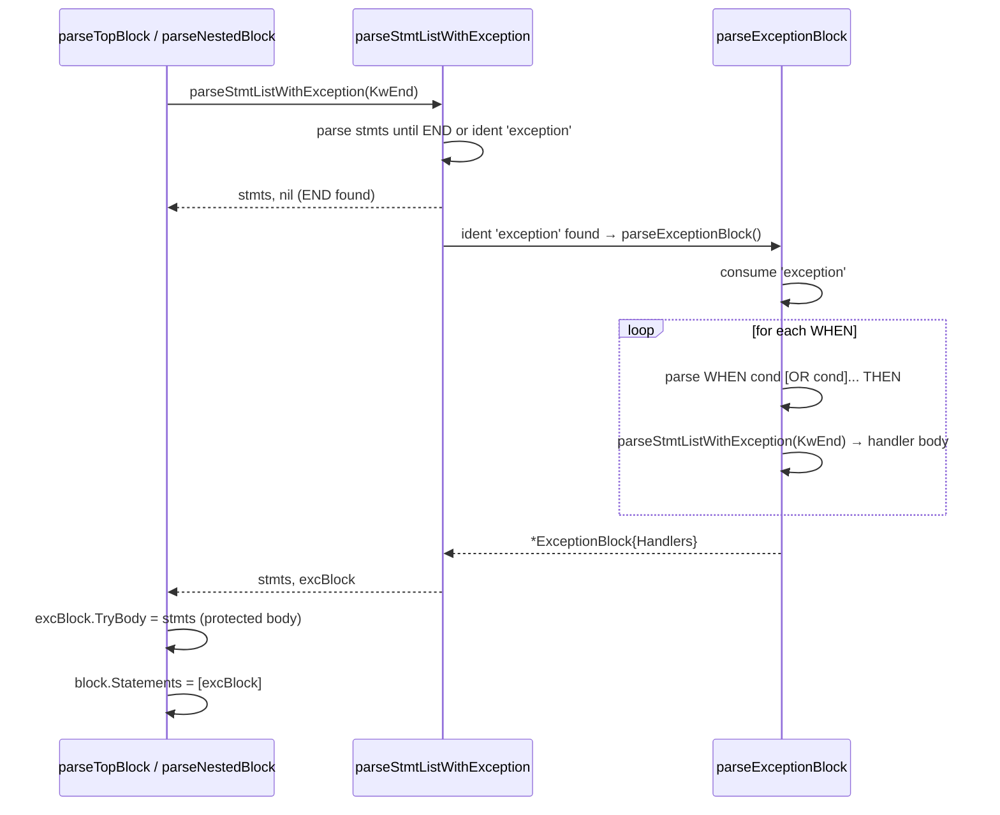
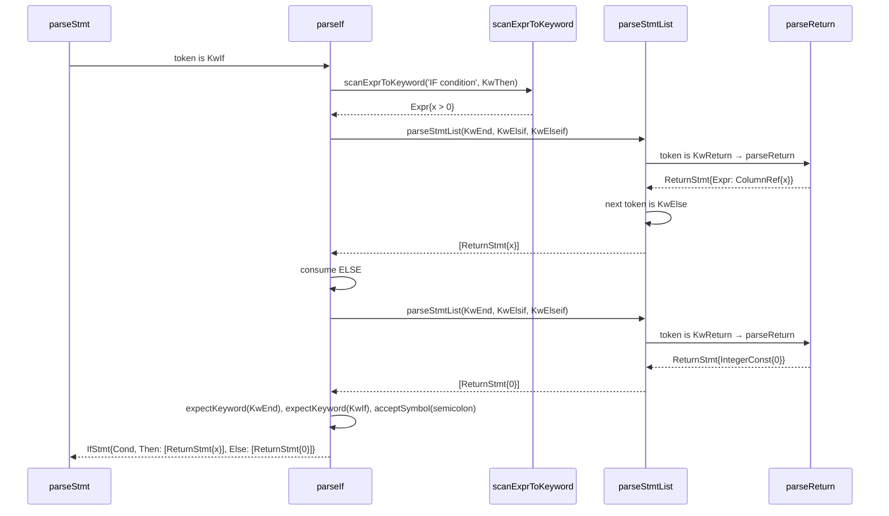
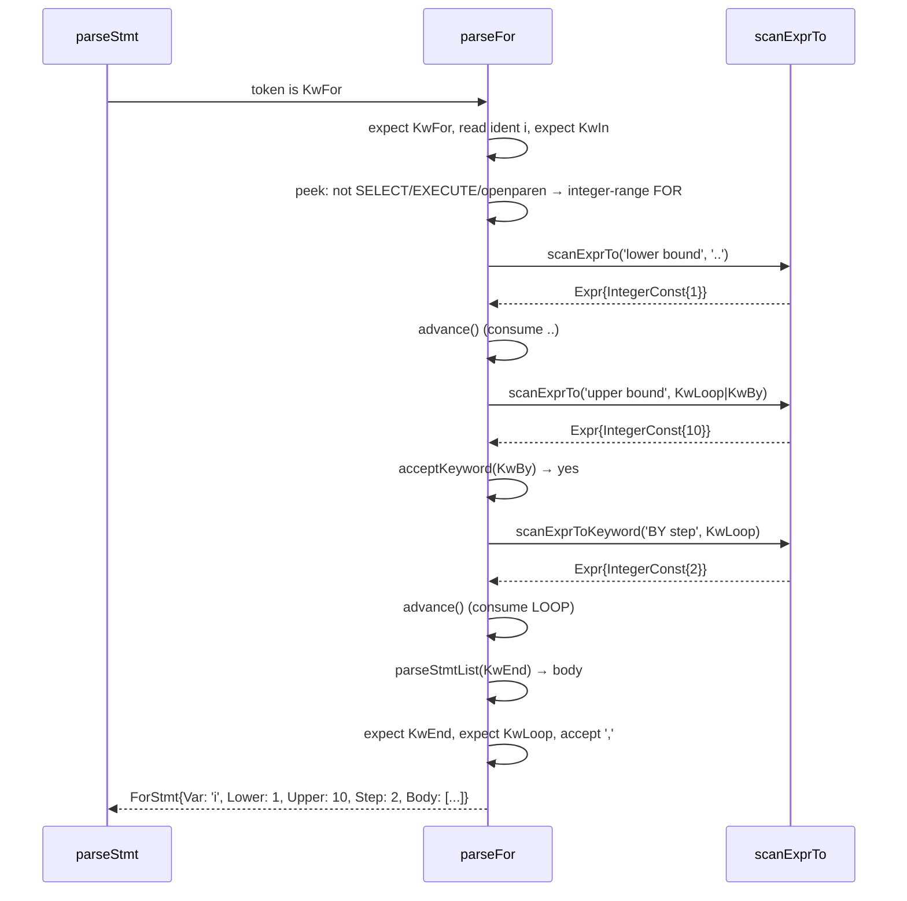

# Module: `internal/pl/plpgsql`

The **PL/pgSQL** language parser and AST — the frontend of the PL/pgSQL
interpreter. This package provides the `Parse` function that turns a
PL/pgSQL function-body string into a typed AST; the executor
(`internal/executor/plpgsql_runtime.go`) interprets the AST at function-call
time.

The language is a Go port of PostgreSQL's `src/pl/plpgsql/src/pl_gram.y`
and `pl_scanner.c`. It supports blocks, declarations, variable assignments,
`SELECT INTO`, `EXECUTE`, `FOR`/`WHILE`/`LOOP` loops, `IF`/`CASE` conditionals,
`RETURN`/`RETURN NEXT`/`RETURN QUERY`, `RAISE`, `PERFORM`, `EXIT`/`CONTINUE`,
exception blocks, transaction control (`COMMIT`/`ROLLBACK`), array-subscript
assignment, record-field assignment, and nested sub-blocks.

The parser reuses goopg's main SQL lexer (`parser.Lex`) for tokenisation;
PL/pgSQL keywords are declared in `internal/parser/token.go`. Inline SQL
expressions parse via the public `parser.ParseExpr` so type-checking/planning/
execution reuse the same AST machinery as top-level SELECT targets. Types are
parsed by serialising the matched tokens into a string and feeding them through
`parser.Parse("CREATE TABLE _ (_ <type>)")` — a single source of truth for type
parsing.

## Key Files

| File | LOC | Role |
|---|---|---|
| `parser.go` | 1,345 | The hand-written recursive-descent parser: `bodyParser`, `Parse`, `parseTopBlock`, `parseStmtList`, `parseStmt`, `parseNestedBlock`, `parseFor`, `parseWhile`, `parseLoop`, `parseIf`, `parseReturn`, `parseRaise`, `parsePerform`, `parseSQLStmt`, `parseExecute`, `parseDeclSection`, `parseDeclaration`, `parseAssign`, `parseDottedExprStmt`, `parseArraySubscriptAssign`, `parseTypeRef`, `scanExprToKeyword`, `scanExprTo`, `scanExprToSemicolon`, `parseExceptionBlock`, `parseExprFromTokens`. |
| `ast.go` | 323 | The AST node types: `Block`, `Stmt`, `StmtList`, `Declaration`, `Assign`, `If`, `Case`, `Loop`, `While`, `For`, `ForSelect`, `Exit`, `Continue`, `Return`, `ReturnNext`, `ReturnQuery`, `Raise`, `Perform`, `Execute`, `SQLStmt`, `SelectInto`, `ArraySubscriptAssign`, `NullStmt`, `TxControlStmt`, `Open`, `Fetch`, `Close`, `GetDiag`, `ExceptionBlock`, `ExceptionHandler`. |
| `parser_test.go` | 688 | Grammar tests: blocks, declarations, all statement forms, exception blocks, `FOR` variants, array subscripts, dotted targets, embedded SQL, `EXECUTE`/`USING`, malformed-input errors. |

## Public API

```go
func Parse(input string) (*Block, error)   // parse a PL/pgSQL body
type SyntaxError struct { Pos int; Message string }
func (e *SyntaxError) Error() string
// Stmt interface: every node implements Pos() int + plpgsqlStmtNode()
```

`Parse` returns `nil, error` on malformed input, with a `*SyntaxError` whose
`Pos` is the 0-based byte offset within the body source. A `*parser.LexError`
from the lexer is wrapped into a `*SyntaxError` so callers always see the typed
envelope without losing the location.

## Internal structure

### Body parser entry



### Statement dispatch tree



### Token handling primitives

```go
func (p *bodyParser) cur() parser.Token                    // peek (TokenEOF past end)
func (p *bodyParser) advance() parser.Token                // consume + return
func (p *bodyParser) errAt(pos int, format string, args ...interface{}) error
func (p *bodyParser) errAtCur(format string, args ...interface{}) error
func (p *bodyParser) acceptKeyword(kw parser.Keyword) bool
func (p *bodyParser) expectKeyword(kw parser.Keyword) (parser.Token, error)
func (p *bodyParser) acceptSymbol(sym string) bool
```

### Statement parsers

```go
func (p *bodyParser) parseTopBlock() (*Block, error)
func (p *bodyParser) parseStmtListWithException(terminators ...parser.Keyword) ([]Stmt, *ExceptionBlock, error)
func (p *bodyParser) parseStmtList(terminators ...parser.Keyword) ([]Stmt, error)
func (p *bodyParser) parseStmt() (Stmt, error)
func (p *bodyParser) parseNestedBlock() (*Block, error)
func (p *bodyParser) parseLoop() (*LoopStmt, error)
func (p *bodyParser) parseWhile() (*WhileStmt, error)
func (p *bodyParser) parseFor() (Stmt, error)
func (p *bodyParser) parseIf() (*IfStmt, error)
func (p *bodyParser) parseReturn() (Stmt, error)
func (p *bodyParser) parseExit() (*ExitStmt, error)
func (p *bodyParser) parseContinue() (*ContinueStmt, error)
func (p *bodyParser) parsePerform() (*PerformStmt, error)
func (p *bodyParser) parseExecute() (*ExecuteStmt, error)
func (p *bodyParser) parseRaise() (*RaiseStmt, error)
func extractRaiseUsingMessage(s string) string
func (p *bodyParser) parseSQLStmt() (Stmt, error)
func (p *bodyParser) parseExceptionBlock() (*ExceptionBlock, error)
```

### Declaration and expression scanning

```go
func (p *bodyParser) parseDeclSection() ([]*Declaration, error)
func (p *bodyParser) parseDeclaration() (*Declaration, error)
func (p *bodyParser) parseAssign() (Stmt, error)
func (p *bodyParser) parseDottedExprStmt(nameTok parser.Token) (*AssignStmt, error)
func (p *bodyParser) parseArraySubscriptAssign(nameTok parser.Token) (*ArraySubscriptAssignStmt, error)
func (p *bodyParser) parseTypeRef() (parser.ColumnType, error)
func (p *bodyParser) scanExprToKeyword(ctx string, term parser.Keyword) (parser.Expr, error)
func (p *bodyParser) scanExprTo(ctx string, stop func(parser.Token) bool) (parser.Expr, error)
func (p *bodyParser) scanExprToSemicolon(ctx string) (parser.Expr, error)
func (p *bodyParser) scanToMatchingBracket() ([]parser.Token, error)
func parseExprFromTokens(toks []parser.Token) (parser.Expr, error)
```

### AST node types

```go
type Stmt interface { Pos() int; plpgsqlStmtNode() }

type Block struct { Declarations []*Declaration; Statements []Stmt }
type Declaration struct { Name string; Type parser.ColumnType; Default parser.Expr }
type AssignStmt struct { Target string; Value parser.Expr }
type ArraySubscriptAssignStmt struct { VarName string; Subscript parser.Expr; Value parser.Expr }
type IfStmt struct { Cond parser.Expr; Then []Stmt; Elsifs []*Elsif; Else []Stmt }
type Elsif struct { Cond parser.Expr; Then []Stmt }
type LoopStmt struct { Body []Stmt }
type WhileStmt struct { Cond parser.Expr; Body []Stmt }
type ForStmt struct { Var string; Reverse bool; Lower, Upper, Step parser.Expr; Body []Stmt }
type ForSelectStmt struct { Var string; SQL string; Body []Stmt }
type ExitStmt struct{ Cond parser.Expr }
type ContinueStmt struct{ Cond parser.Expr }
type PerformStmt struct { Expr parser.Expr; Query string }
type NullStmt struct{}
type TxControlStmt struct{ Rollback bool }
type ReturnStmt struct{ Expr parser.Expr }
type ReturnNextStmt struct{ Expr parser.Expr }
type ReturnQueryStmt struct{ QuerySrc string }
type SQLStmt struct{ SQL string }
type SelectIntoStmt struct { SQL string; Targets []string; Strict bool }
type ExceptionHandler struct { Conditions []string; Body []Stmt }
type ExceptionBlock struct { TryBody []Stmt; Handlers []*ExceptionHandler }
type ExecuteStmt struct { Query parser.Expr; IntoVar string; Strict bool; Using []parser.Expr }
type RaiseStmt struct { Level string; Msg string; ConditionName string }
```

### Lexer

The parser has its own token scan over the input string, recognizing PL/pgSQL
keywords (`DECLARE`, `BEGIN`, `EXCEPTION`, `RETURN`, `RAISE`, `PERFORM`,
`EXECUTE`, `FOR`, `WHILE`, `LOOP`, `IF`, `CASE`, …) and delegating embedded SQL
fragments to the main SQL parser. The SQL lexer tokenises PL/pgSQL keyword
spellings into distinct `parser.Keyword` tokens (`KwLoop`, `KwEnd`, `KwWhen`,
`KwThen`, `KwElsif`, `KwElseif`, `KwExecute`, `KwPerform`, …), which the
recursive-descent parser dispatches on.

### Parser

A hand-written recursive-descent parser (not yacc). The entry is `Parse`, which
lexes the body, wraps the tokens in a `bodyParser`, and calls `parseTopBlock`.
A `Block` is declarations + statements (+ exception block). Statements are
parsed by `parseStmt`, which examines the first token and dispatches.

### SQL statements

`parseSQLStmt` captures a SQL statement between the current position and the
next PL/pgSQL delimiter (top-level `;`), then sends it to the main SQL parser
(`parser.Parse`) for semantic analysis. A leading `SELECT` is special-cased:
PL/pgSQL reinterprets a top-level `INTO [STRICT] target[, target...]` clause as
variable assignment rather than SQL's CREATE-TABLE-AS spelling. When found, the
INTO clause is stripped from the query text and a `SelectIntoStmt` is returned
so the executor binds the first result row to the named variable(s). Dotted
targets (`r.b`) are captured in the target list.

### Expression scanning

`scanExprToKeyword`/`scanExprTo`/`scanExprToSemicolon` scan tokens until a
predicate (keyword or top-level `;`), slice the original source over those
bytes, and feed the slice through `parser.ParseExpr` — used for inline
expressions in assignments, `IF` conditions, `RETURN` values, declaration
initializers, `WHILE` conditions, `EXECUTE` queries/USING arguments, and loop
bounds/steps.

## Key flow: parsing a full routine body



## Key flow: FOR-loop disambiguation



## Key flow: exception block wrapping

`parseStmtListWithException` terminates at `END` or an `exception` identifier;
when `EXCEPTION` is found, `parseExceptionBlock` parses `WHEN cond [OR cond]...
THEN stmts` handlers. The statements preceding EXCEPTION become the
`ExceptionBlock.TryBody` (so a runtime error in any of them is caught by the
WHEN handlers). Conditions are matched against `SQLSTATE`, `SQLEXCEPTION`, and
`OTHERS` at runtime.



## Statement-specific detail

- **`FOR` loops** — `parseFor` peeks ahead: if the first real token is `SELECT`/`INSERT`/`UPDATE`/`DELETE`/`WITH`/`EXECUTE` or a `(`, it is a query-based `FOR rec IN query LOOP` (query text captured with a depth-aware scan for the depth-0 `KwLoop`); otherwise it is an integer-range `FOR var IN [REVERSE] lo..hi [BY step] LOOP`.
- **`PERFORM`** — captures the raw source up to the terminating `;` and, when it happens to parse as a plain expression (the common `PERFORM foo()` case), keeps the parsed `Expr` for a scalar fast path; a query form (`FROM`/`WHERE`) executes as SQL via `Query` at runtime. `FOUND` is set from whether any row was produced.
- **`RAISE`** — `parseRaise` recognizes level keywords (`notice`, `warning`, `info`, `log`, `debug`, `error`, `exception`; default `exception`) and condition names (`RAISE condition_name [USING MESSAGE = 'text']`); `extractRaiseUsingMessage` pulls the message out of a `USING MESSAGE = '…'` clause, unescaping `''`.
- **`EXECUTE`** — `parseExecute` parses `EXECUTE expr [INTO [STRICT] var] [USING expr, ...]`; the query expression scans up to `INTO`, `USING`, or `;`.
- **`parseTypeRef`** — re-uses the SQL parser's type machinery by serialising the matched tokens into `"CREATE TABLE _t (_c <type>)"` and extracting the column type; handles `schema.name`, `name(N [, N ...])` arg lists, the `varname%TYPE` shorthand (maps to `text`), and consumes (but excludes from the SQL parse) `[]` array suffixes.
- **`parseAssign`** — handles `:=` and `=` spellings; dotted targets (`ident.field = expr`) route to `parseDottedExprStmt`, which emits a real assignment targeting the injected `_new_<field>`/`_old_<field>` frame variable for `NEW`/`OLD` (BEFORE triggers can rewrite NEW.*), a `varname\x00fieldname` target for composite fields, and a `_plpgsql_noop` sentinel otherwise. Array subscripts (`x[idx] := v;`) route to `parseArraySubscriptAssign`, which re-parses the bracket tokens into a subscript expression via `parseExprFromTokens`.

## Dependencies

- **Used by** — `internal/executor` (`plpgsql_runtime.go` interprets the AST), `internal/parser` (function-body parsing).
- **Uses** — `internal/parser` (SQL parsing for `parseSQLStmt`, `parser.ParseExpr`, `parser.Lex`, `parser.Token`, `parser.Keyword`, `parser.Expr`, `parser.ColumnType`, `parser.LexError`, `parser.IntegerConst`), `internal/nodes` (expression types).

## Notable patterns / gotchas

- **Keyword scanning trap** — `parseFor`'s `FOR rec IN <query> LOOP` scan stops at the first depth-0 `KwLoop` token, but `loop` is a registered keyword (`KwLoop`), so a `loop` identifier used as a column alias inside the SELECT truncates the query (M0134-0110).
- **SQL vs PL/pgSQL boundary** — the PL/pgSQL parser must find the boundary between PL control flow (`LOOP`, `END`, `IF`, …) and embedded SQL (`SELECT`, `INSERT`, …). `parseSQLStmt` captures the SQL text and delegates to the main parser; the captured SQL may include `loop`/`begin`/`end` as identifiers (not keywords), which is why the keyword scan must be depth-aware.
- **Exception blocks** — `parseExceptionBlock` handles `EXCEPTION WHEN … THEN …` with a list of exception handlers, each matching a condition name (`SQLSTATE`, `SQLEXCEPTION`, `OTHERS`). `TryBody` wrapping (M0118-0009) is what makes `BEGIN ... EXCEPTION` actually catch errors from the protected statements — previously they were appended as siblings with `TryBody` empty.
- **`SELECT ... INTO` is variable assignment** — a top-level `INTO [STRICT]` inside a SELECT is stripped and bound to named variables at runtime, not CREATE TABLE AS; this is the single biggest semantic divergence from embedded SQL.
- **`NEW`/`OLD` field writes** — `NEW.field := expr` compiles to an assignment to `_new_<field>` (feed INSERT/UPDATE row routing); `OLD.field := expr` compiles to `_old_<field>` (feed BEFORE DELETE trigger bodies that subsequently read OLD.* in embedded SQL). Other dotted refs swallow to `;` and emit the `_plpgsql_noop` sentinel.
- **`SET` is embedded SQL** — PL/pgSQL has no special-cased SET statement (pl_gram.y treats it as ordinary `stmt_execsql`), so `SET [LOCAL|SESSION] name = value;` routes through the same embedded-SQL path as GRANT/REVOKE (which are plain identifiers in the main lexer and would otherwise fall through to `parseAssign` and fail).
- **`GRANT`/`REVOKE` are not keywords** — the main SQL lexer keeps them as plain identifiers, so a bare `REVOKE SELECT ON t FROM PUBLIC;` needs an explicit ident-dispatch to `parseSQLStmt` (M0118-0009 perm 9).
- **`varname%TYPE`** maps to `text` as a stand-in — the type is resolved lazily by the runtime; this is a Stage-A simplification, not a full `%TYPE` implementation.
- **`COMMIT`/`ROLLBACK`** are parsed but only legal in non-atomic contexts (top-level DO block or a procedure outside an explicit transaction block); in an atomic context the runtime raises SQLSTATE 2D000.
- **CONSTANT / NOT NULL** surface "Stage A 4b" diagnostics rather than parsing — handwritten PL/pgSQL using them gets a specific message instead of a generic syntax error.
- **`EXIT`/`CONTINUE` only target the innermost loop** — Stage A 4d `parseExit`/`parseContinue` accept only the `[WHEN cond]` form; a loop label or a named `EXIT <label>` is not yet supported.
- **Trailing `;` after `END` is optional** — `parseTopBlock` and `parseNestedBlock` both call `acceptSymbol(";")`, matching upstream where both `END` and `END;` are legal.
- **Unterminated loops error at EOF** — `parseStmtList` returns "unexpected EOF (expected one of %v)" if a loop body runs past the end of input instead of finding its `END` terminator.

## `parseIf` detail

`parseIf` parses the full IF/ELSIF/ELSE/END IF chain:

```go
func (p *bodyParser) parseIf() (*IfStmt, error) {
    startTok, _ := p.expectKeyword(parser.KwIf)         // consume IF
    cond, _ := p.scanExprToKeyword("IF condition", parser.KwThen)
    p.advance()                                          // consume THEN
    body, _ := p.parseStmtList(parser.KwEnd, parser.KwElsif, parser.KwElseif)
    stmt := &IfStmt{pos: startTok.Pos, Cond: cond, Then: body}
    for p.cur().Keyword == parser.KwElsif || p.cur().Keyword == parser.KwElseif {
        // parse ELSIF condition THEN body
    }
    if p.cur().Keyword == parser.KwElse {
        // parse ELSE body
    }
    p.expectKeyword(parser.KwEnd)
    p.expectKeyword(parser.KwIf)
    p.acceptSymbol(";")
    return stmt, nil
}
```

The `parseStmtList` call for the THEN body terminates at `KwEnd`, `KwElsif`,
or `KwElseif` (the `pl_gram.y` permits `ELSEIF` as an alternative spelling
of `ELSIF`, and both are accepted). The loop body is parsed with the same
terminator set, so ELSIF chains nest correctly.

## `parseReturn` detail

`parseReturn` handles four forms:

```go
func (p *bodyParser) parseReturn() (Stmt, error) {
    tok, _ := p.expectKeyword(parser.KwReturn)
    if p.cur().Kind == parser.TokenSymbol && p.cur().Value == ";" {
        p.advance()
        return &ReturnStmt{pos: tok.Pos}, nil          // bare RETURN;
    }
    // RETURN NEXT expr; — M0097-0073
    if p.cur().Kind == parser.TokenKeyword && p.cur().Keyword == parser.KwNext {
        p.advance()
        expr, _ := p.scanExprToSemicolon("RETURN NEXT expression")
        return &ReturnNextStmt{pos: tok.Pos, Expr: expr}, nil
    }
    // RETURN QUERY <select>; — M0097-0024
    if p.cur().Kind == parser.TokenKeyword && p.cur().Keyword == parser.KwQuery {
        p.advance()
        // capture raw SQL up to ';'
        ...
        return &ReturnQueryStmt{pos: tok.Pos, QuerySrc: sqlText}, nil
    }
    // RETURN expr;
    expr, _ := p.scanExprToSemicolon("RETURN expression")
    return &ReturnStmt{pos: tok.Pos, Expr: expr}, nil
}
```

The dispatch order is important: `NEXT` and `QUERY` are checked as keywords
before falling through to the expression path, so `RETURN NEXT foo()` is
parsed as a `ReturnNextStmt`, not as `RETURN (NEXT foo())`.

## parseExecute detail

`parseExecute` parses `EXECUTE expr [INTO [STRICT] var] [USING expr, ...]`:

```go
func (p *bodyParser) parseExecute() (*ExecuteStmt, error) {
    tok, _ := p.expectKeyword(parser.KwExecute)
    // Scan the query expression up to INTO, USING, or ';'
    query, _ := p.scanExprTo("EXECUTE query", func(t parser.Token) bool {
        return (t.Kind == parser.TokenKeyword && t.Keyword == parser.KwInto) ||
               (t.Kind == parser.TokenKeyword && t.Keyword == parser.KwUsing) ||
               (t.Kind == parser.TokenSymbol && t.Value == ";")
    })
    stmt := &ExecuteStmt{pos: tok.Pos, Query: query}
    // Parse optional INTO [STRICT] var
    if p.cur().Keyword == parser.KwInto {
        // ...
    }
    // Parse optional USING expr, ...
    if p.cur().Keyword == parser.KwUsing {
        // ...
    }
    p.acceptSymbol(";")
    return stmt, nil
}
```

## Key flow: parsing `IF x > 0 THEN RETURN x; ELSE RETURN 0; END IF;`



## Key flow: parsing `FOR i IN 1..10 BY 2 LOOP ... END LOOP;`



## Array subscript assignment walkthrough

`parseArraySubscriptAssign` parses `x[idx] := value;`:

1. `nameTok` is the ident `x` (already consumed by `parseAssign`).
2. The parser consumes `[` via `acceptSymbol`, then calls `scanToMatchingBracket`
   to capture the tokens between `[` and `]`.
3. `parseExprFromTokens` re-parses the captured tokens into a `parser.Expr`
   (the subscript expression).
4. `expectSymbol(":=")` or `acceptSymbol("=")` for the assignment operator.
5. `scanExprToSemicolon` captures the value expression.
6. Returns `ArraySubscriptAssignStmt{VarName: "x", Subscript: idxExpr, Value: valExpr}`.