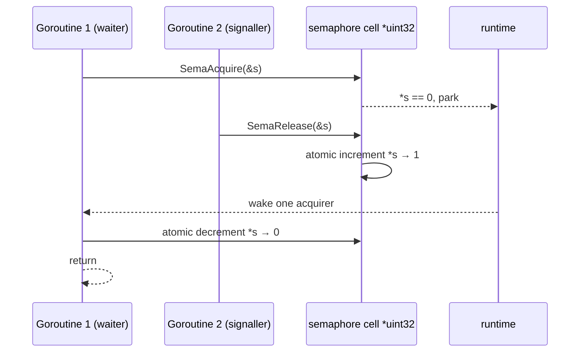
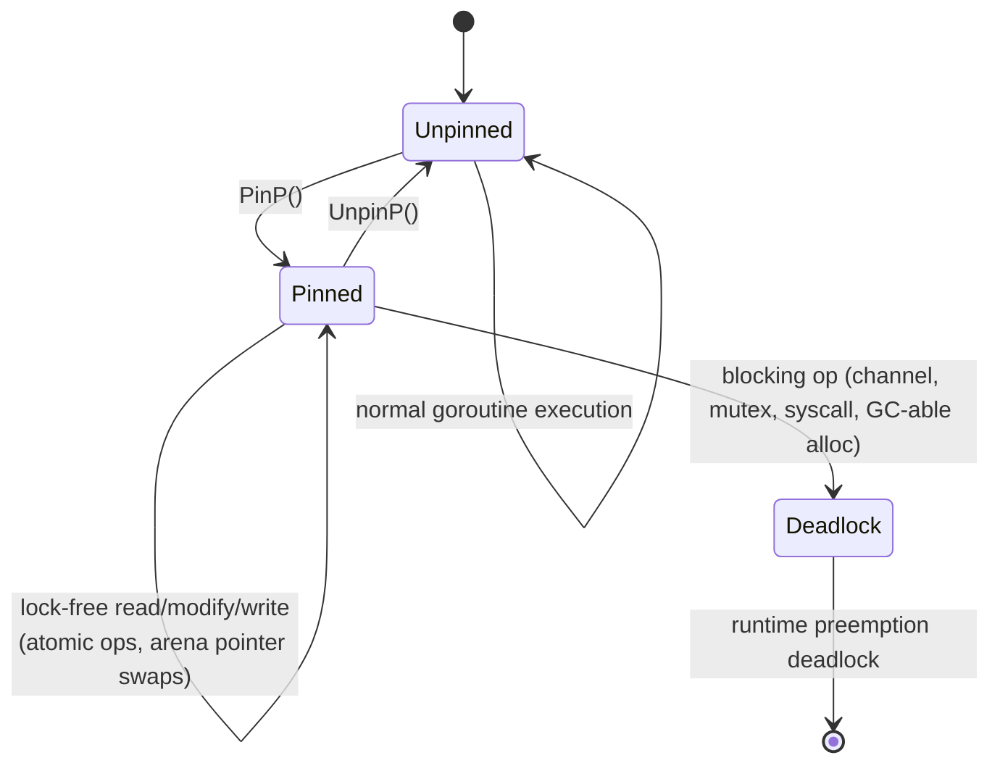
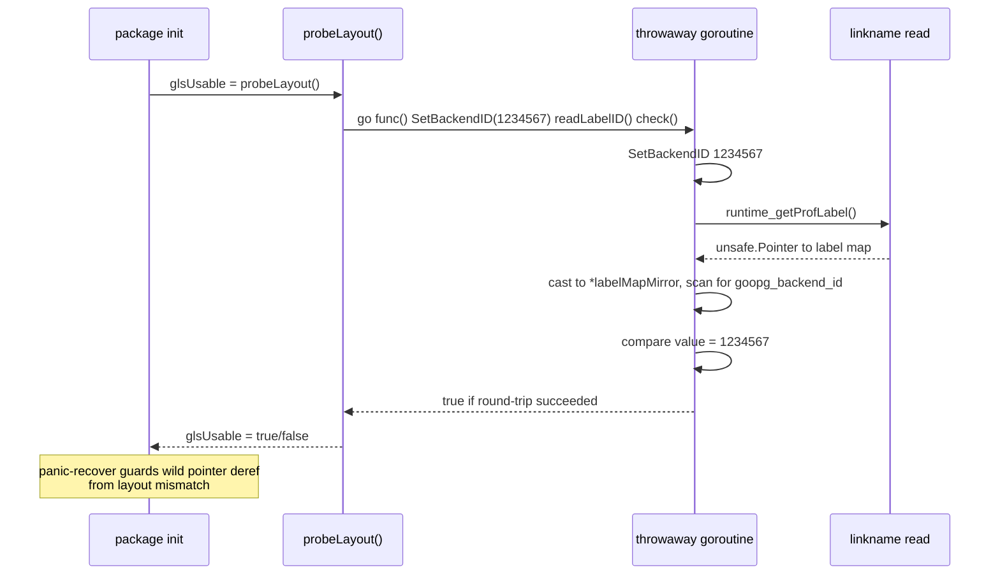
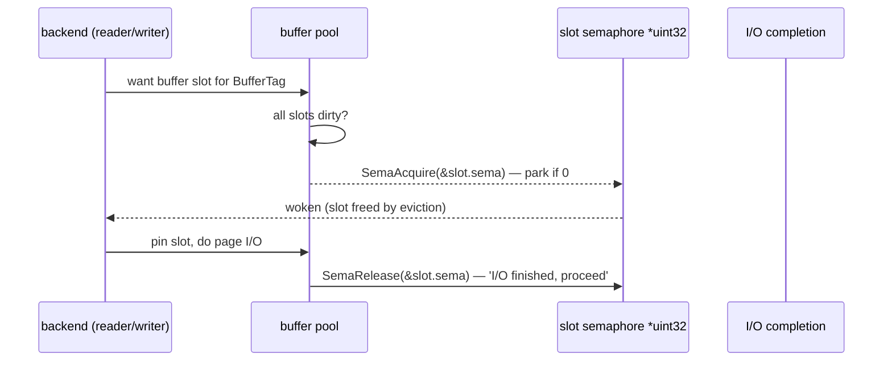
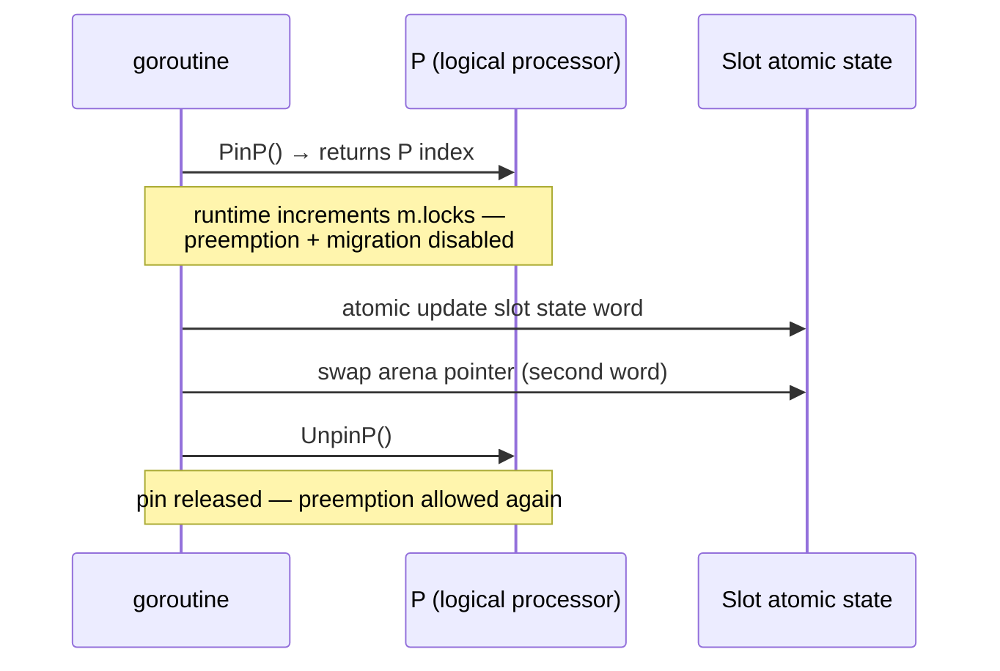

# Module: `internal/port`

The **platform/runtime portability layer** — a small collection of packages that
reach into Go runtime internals (via `//go:linkname`) to recover the
RDBMS-grade primitives goopg's hot paths need, each paired with a pure-Go
fallback for unsupported toolchains. It is the Go analogue of PG's
`src/port/` and `src/include/port/`.

## Sub-packages

### `internal/port/runtimeshim` — runtime-internal primitives

The bounded set of `//go:linkname` accesses into Go runtime internals, each
paired with a tag-inverse fallback using public APIs.

| File | LOC | Role |
|---|---|---|
| `doc.go` | 28 | Package discipline statement (design `08-runtime-internals.md`). |
| `nanotime_linkname.go` | 24 | `Nanotime()` → `runtime.nanotime` (build-tagged `go1.24 && !go1.27 && !noLinkname`). |
| `nanotime_fallback.go` | 11 | `Nanotime()` → `time.Now().UnixNano()` (inverse tag). |
| `sema_linkname.go` | 46 | `SemaAcquire`/`SemaRelease` → `sync.runtime_Semacquire`/`sync.runtime_Semrelease`. |
| `sema_fallback.go` | 58 | Fallback via a single global mutex + per-cell `sync.Cond` map. |
| `pinp_linkname.go` | 40 | `PinP`/`UnpinP` → `runtime.procPin`/`runtime.procUnpin`; `PinP` returns the P index. |
| `pinp_fallback.go` | 36 | Fallback via a global mutex, always returns P index 0. |
| `nanotime_test.go` | 66 | Monotonicity/non-decreasing, fallback parity. |
| `sema_test.go` | 177 | Acquire/release ordering, wake-one semantics, zero-value cell, stress. |
| `pinp_test.go` | 124 | Pin/unpin balance, P-index stability. |
| `pinp_recursive_test.go` | 30 | Nested PinP regression (linkname-tag-gated; the fallback's non-reentrant contract differs). |

### `internal/port/gls` — goroutine-local storage

Cheap per-goroutine backend-id storage used to pick a WAL insert-lock stripe.

| File | LOC | Role |
|---|---|---|
| `gls.go` | 45 | `SetBackendID` via `runtime/pprof.SetGoroutineLabels`; package doc with the motivation. |
| `gls_linkname.go` | 96 | `BackendID` via a linkname mirror of `runtime/pprof.runtime_getProfLabel`, plus the layout mirror and runtime self-check probe. |
| `gls_fallback.go` | 14 | `BackendID` always `(0, false)` on unsupported runtimes. |
| `gls_test.go` | 66 | Round-trip, stripe selection, fallback phrasing via `usableForTest`. |

## Public API

```go
// runtimeshim — the linkname'd primitives (with pure-Go fallbacks)
func Nanotime() int64                       // monotonic clock (runtime.nanotime)
func SemaAcquire(s *uint32)                 // block until *s > 0, then decrement
func SemaRelease(s *uint32)                 // increment *s, wake one acquirer
func PinP() int                             // pin goroutine to current P, return P index
func UnpinP()                               // unpin from P

// gls — goroutine-local backend id
func SetBackendID(id int32)                 // stamp pprof label (cold path)
func BackendID() (int32, bool)              // read back (WAL hot path)
```

### Internal helpers

```go
// runtimeshim internal
func runtime_Semacquire(s *uint32)          // linkname to sync.runtime_Semacquire
func runtime_Semrelease(s *uint32, handoff bool, skipframes int) // linkname to sync.runtime_Semrelease
func runtime_procPin() int                  // linkname to runtime.procPin
func runtime_procUnpin()                    // linkname to runtime.procUnpin
func nanotimeRuntime() int64                // linkname to runtime.nanotime1

// gls internal
func runtime_getProfLabel() unsafe.Pointer  // linkname to runtime/pprof.runtime_getProfLabel
func probeLayout() bool                     // runtime self-check, runs once at init
func readLabelID() (int32, bool)            // read backend id from the mirrored label map
func usableForTest() bool                   // reports whether linkname read is active
```

## Internal structures

### gls label mirror

```go
type labelMirror struct {
    key   string
    value string
}

type labelMapMirror struct {
    list []labelMirror
}
```

This mirrors `runtime/pprof.labelMap` (`struct{ label.Set }`) → `label.Set` (`struct{ List []Label }`) → `Label` (`struct{ Key, Value string }`). The runtime self-check `probeLayout` validates the layout on a throwaway goroutine before any hot-path read trusts it.

### runtimeshim fallback semaphore

The fallback uses a single global `sync.Mutex` + a `map[*uint32]*sync.Cond` pool. Cells are never GC'd — the linkname path has no cleanup either, and the set of distinct cells is bounded by the buffer pool size.

## Internal structure

```mermaid
flowchart TD
    subgraph runtimeshim
        subgraph "linkname build (go1.24 && !go1.27 && !noLinkname)"
            NL[Nanotime → runtime.nanotime]
            SA[SemaAcquire → sync.runtime_Semacquire]
            SR[SemaRelease → sync.runtime_Semrelease]
            PP[PinP → runtime.procPin]
            PU[UnpinP → runtime.procUnpin]
        end
        subgraph "fallback build (inverse tag / noLinkname)"
            NFL[Nanotime → time.Now().UnixNano]
            SFL[Sema via global mutex + sync.Cond map]
            PFL[PinP/UnpinP via global mutex, P index 0]
        end
    end

    subgraph gls
        SET[SetBackendID → pprof.SetGoroutineLabels]
        PROBE[glsUsable = probeLayout<br/>recovered round-trip on throwaway goroutine]
        READ[BackendID → linkname runtime_getProfLabel<br/>+ labelMapMirror scan]
        SET --> PROBE
        PROBE -->|usable| READ
        PROBE -->|mismatch| FB2[(0,false) → stripe 0]
    end
```

### Semaphore acquire/release sequence



### PinP/UnpinP window constraints



## Key flow: WAL stripe selection via GLS

The WAL append hot path uses `gls.BackendID()` to select an insert-lock stripe:

1. **Connection start** — `SetBackendID(processID)` stamps the backend goroutine with its process number via `pprof.SetGoroutineLabels`. Labels are inherited by spawned goroutines, so any helper goroutine the backend spawns carries the same ID.
2. **WAL append** — on every `xlog.Writer.Append` call, the goroutine calls `BackendID()`. The linkname path reads the current goroutine's pprof label map via `runtime_getProfLabel`, walks the `labelMapMirror.list` looking for key `"goopg_backend_id"`, and returns the integer value.
3. **Stripe selection** — `stripe = int(backendID) % numStripes`. Different backends land on different stripes, reducing contention.
4. **Fallback** — on unsupported runtimes or layout mismatch, `BackendID()` returns `(0, false)`, and the caller uses stripe 0 (always valid, just less striping).

## Key flow: runtime self-check probe



## Dependencies

- **Used by** — `internal/storage` (buffer pool slot waits, pin/unpin), `internal/access/transam/xlog` (WAL append stripe, commit-delay timing, lock-free tail update), `internal/utils/activity` (event timing).
- **Uses** — Go runtime internals only (via linkname); no imports into other `internal/` packages (`gls` imports `context`, `runtime/pprof`, `strconv`, `unsafe`; `runtimeshim` imports only `sync`/`time`/`unsafe` in fallbacks).

## Test coverage

| Test function | What it covers |
|---|---|
| `TestNanotime_Monotonic` | Non-decreasing over repeated calls |
| `TestNanotime_ApproximatesWallElapsed` | Within 10% of wall-clock sleep |
| `TestNanotime_NonZero` | Never returns 0 |
| `TestSema_PreReleasedAcquireReturns` | Acquire on a pre-incremented cell returns immediately |
| `TestSema_BlocksUntilRelease` | Concurrent goroutine unblocks on release |
| `TestSema_BalancedManyProducersConsumers` | Stress test under contention |
| `TestSema_DistinctCellsIndependent` | Different cells do not interact |
| `TestPinP_ReturnsValidIndex` | P index in [0, GOMAXPROCS) |
| `TestPinP_BalancedAcrossGoroutines` | Multiple goroutines see different P indices |
| `TestPinP_PerPCounterCorrectness` | Pin/unpin counts match |
| `TestPinP_StableWithinWindow` | Nested PinP returns same index |
| `TestBackendIDRoundTrip` | Set then read returns the same ID |
| `TestBackendIDUnsetIsZeroFalse` | No label → (0, false) |
| `TestBackendIDInherited` | Spawned goroutine inherits the label |

## Notable patterns / gotchas

- **`SemaAcquire` may park** — it is NOT safe to call inside a `PinP`/`UnpinP` window; the two primitives are complementary, not nestable.
- **`PinP` may not block** — between `PinP` and `UnpinP` the goroutine MUST NOT do anything that can block (channel, mutex, syscall, allocation that might trigger STW) or the runtime's preemption logic can deadlock. Deferring `UnpinP` costs ~20 ns, so hot paths inline it.
- **Runtime version window** — a linkname target's symbol shape may change in a future Go minor; the build tags confine each site to the tested window (`go1.24..go1.26`), and the fallback file covers everything outside it. Bumping the window requires re-verifying each linkname against the new toolchain (`make race-gate` + the `-tags noLinkname` smoke).
- **`Nanotime` ≠ wall clock** — `Nanotime` returns monotonic time; do not use it where PG semantics require `clock_timestamp()`/wall time. It is also NOT comparable across processes or after suspend/resume.
- **pprof labels are reserved** — the WAL backend-id stripe depends on the goroutine's pprof labels being exclusively goopg's; setting other labels on the same goroutine would corrupt `BackendID`.
- **Fallback contract differences** — the fallback semaphore serializes every operation under one global mutex (correct, slower); the fallback `PinP` is non-reentrant (a nested call deadlocks) whereas the linkname path supports nesting via `m.locks` — `pinp_recursive_test.go` covers the linkname shape.
- **`gls` self-check** — `probeLayout` runs once at init on a throwaway goroutine and panic-recover guards a wild pointer deref from a layout mismatch, so a bad runtime degrades to stripe 0 instead of crashing the process.
- **Do not promote the window casually** — moving the upper bound past `go1.26` requires re-verifying every linkname target (including the pprof `labelMap` layout mirrored by `gls_linkname.go`) on the new toolchain before bumping the tags.
- **Semaphore cell address stability** — the `*uint32` cell is identified by address, never by value. The caller must keep the cell at a stable memory location for the lifetime of any concurrent acquirer or releaser. Moving the cell (e.g. by reallocating a containing struct) while acquirers are parked on it produces undefined behaviour.
- **`SemaRelease` handoff=false** — matches `sync.Mutex.Unlock`'s call site; non-handoff release is the right default for buffer-pool-style "I/O finished; anybody waiting on this slot can proceed" notifications, where any pending acquirer is equally well-suited to take ownership.
- **`Nanotime` is a single-MOV read** — on Linux/amd64 it reads the per-OS monotonic counter in ~5 ns vs ~50 ns for `time.Now()` (VDSO + wall-clock conversion). The difference matters on the commit-delay measurement path in the WAL writer.

## Build-tag mechanics

Every linkname site is a triad of files:

| File | Build tag | What it holds |
|---|---|---|
| `nanotime_linkname.go` | `go1.24 && !go1.27 && !noLinkname` | `//go:linkname nanotimeRuntime runtime.nanotime` + `Nanotime()` |
| `nanotime_fallback.go` | `!go1.24 || go1.27 || noLinkname` | `Nanotime()` → `time.Now().UnixNano()` |
| `sema_linkname.go` | `go1.24 && !go1.27 && !noLinkname` | `sync.runtime_Semacquire` / `sync.runtime_Semrelease` aliases |
| `sema_fallback.go` | `!go1.24 || go1.27 || noLinkname` | global-mutex semaphore |
| `pinp_linkname.go` | `go1.24 && !go1.27 && !noLinkname` | `runtime.procPin` / `runtime.procUnpin` |
| `pinp_fallback.go` | `!go1.24 || go1.27 || noLinkname` | global-mutex pin, index 0 |

The tag pattern `go1.24 && !go1.27` pins each site to the tested window; the
`!go1.24 || go1.27` inverse selects the fallback everywhere else. The
`noLinkname` tag is an additional operator escape hatch that forces the
fallback on a supported toolchain — `go test -tags noLinkname ./...` smokes the
fallback without needing an unsupported Go.

## Linkname target table

| goopg alias | Linked symbol | Stdlib user |
|---|---|---|
| `nanotimeRuntime` | `runtime.nanotime` | `time.Now` internals |
| `runtime_Semacquire` | `sync.runtime_Semacquire` | `sync.Mutex`, `sync.WaitGroup`, `sync.Cond` |
| `runtime_Semrelease` | `sync.runtime_Semrelease` | `sync.Mutex.Unlock` |
| `runtime_procPin` | `runtime.procPin` | `sync.Pool` |
| `runtime_procUnpin` | `runtime.procUnpin` | `sync.Pool` |
| `runtime_getProfLabel` | `runtime/pprof.runtime_getProfLabel` | (no public reader) |

## Key flow: buffer-pool slot wait via the raw semaphore

The buffer pool uses `SemaAcquire`/`SemaRelease` instead of `sync.Cond` so that
a slot wait parks directly on the runtime's goroutine-park machinery with no
internal mutex:



The semaphore is one `uint32` per slot, identified by address. `SemaRelease`
uses `handoff=false, skipframes=0` — matching `sync.Mutex.Unlock` — so any
waiter is equally eligible to take ownership.

## Key flow: `PinP`-protected two-word lock-free update



Because the goroutine cannot be preempted between the two word updates, no
reader of the pair can observe a torn state — this is what makes per-P sharded
data safe to mutate without locks for the pinned window.

## Fallback semaphore internals

```go
var (
    fallbackSemaMu    sync.Mutex
    fallbackSemaConds = map[*uint32]*sync.Cond{}
)

func fallbackCondFor(s *uint32) *sync.Cond {
    // create-on-first-use under fallbackSemaMu
}

func SemaAcquire(s *uint32) {
    fallbackSemaMu.Lock()
    c := fallbackCondFor(s)
    for *s == 0 { c.Wait() }   // tolerates spurious wake-ups
    *s--
    fallbackSemaMu.Unlock()
}

func SemaRelease(s *uint32) {
    fallbackSemaMu.Lock()
    *s++
    if c, ok := fallbackSemaConds[s]; ok { c.Signal() }
    fallbackSemaMu.Unlock()
}
```

The fallback collapses every distinct `*uint32` cell onto one global mutex +
`sync.Cond` pool. The map grows monotonically; cells are never GC'd from it
because the linkname path has no equivalent cleanup either (the runtime's wait
list is keyed by address with no destruction hook), and keeping the
externally-observable contract identical is the fallback's whole purpose.

## gls probe round-trip detail

`probeLayout` runs once at package init on a **throwaway goroutine**:

1. Spawn a goroutine; inside it, set a `recover()` deferred to catch a wild
   pointer deref from a layout mismatch.
2. `SetBackendID(1234567)` — stamps the probe ID.
3. `readLabelID()` — the linkname read + `labelMapMirror` scan.
4. `ok = got && v == probeID` — a full round-trip must succeed.
5. The result is delivered on a buffered channel; `probeLayout` blocks until it
   arrives.

On success `glsUsable = true` and `BackendID` uses the linkname path forever
after. On any failure or panic-recover, `glsUsable = false` and `BackendID`
permanently returns `(0, false)` — callers fall back to stripe 0, always valid.

## Why the `sync.`-prefixed aliases?

The semaphore linknames target `sync.runtime_Semacquire`/`sync.runtime_Semrelease`,
not the raw `runtime.semacquire`/`runtime.semrelease`. The `sync.runtime_*`
symbols are the de facto stable external API that the standard library itself
depends on: `sync.Mutex`, `sync.WaitGroup`, and `sync.Cond` all build on them,
so Go's maintainers keep their shape stable across the internal renames that
`runtime.semacquire` has undergone. Linking against the stable alias means the
build tag window (`go1.24 && !go1.27`) can be wider than one patch release.

```go
//go:linkname runtime_Semacquire sync.runtime_Semacquire
func runtime_Semacquire(s *uint32)

//go:linkname runtime_Semrelease sync.runtime_Semrelease
func runtime_Semrelease(s *uint32, handoff bool, skipframes int)

func SemaAcquire(s *uint32) { runtime_Semacquire(s) }
func SemaRelease(s *uint32) { runtime_Semrelease(s, false, 0) }
```

Note the `//go:linkname` comment on the *alias* (`runtime_Semacquire`),
referencing the *target* (`sync.runtime_Semacquire`). The `skipframes`
parameter on `SemaRelease` matters for the `sync.Mutex` profiling path (it
offsets the stack walk); goopg passes `0` like `sync.Mutex.Unlock` does,
so any future mutex-profile frames attributed to these calls look normal.

## PinP nesting and `m.locks`

The linkname `PinP` path supports nesting: each `runtime_procPin()` call
increments `m.locks`, so a nested pin/unpin pair keeps the goroutine pinned
until the outermost `UnpinP`. `TestPinP_StableWithinWindow` exercises exactly
this — a nested `PinP` returns the same P index as the enclosing one.

The fallback `PinP` does **not** support nesting: it takes a single global
mutex and returns index 0 unconditionally. A nested fallback call would
deadlock on the non-reentrant mutex. That is why the recursive test is
linkname-tag-gated (`pinp_recursive_test.go`) — the fallback's contract
legitimately differs.

## Per-P sharding and the P index

`PinP()` returns the current logical processor index in `[0, GOMAXPROCS)`.
goopg uses it to index per-P sharded data (e.g. per-P lock-free lists or
arena pointer slots) without atomic contention. Because the P index is only
stable *while pinned*, any code that stores the index for later use must
re-pin to re-read it. Two goroutines that both read their P index while
pinned may see different values — that is the point (spreading load across
Ps) and is what `TestPinP_BalancedAcrossGoroutines` verifies.

## Activity registry timing use of Nanotime

`internal/utils/activity/registry.go` records per-backend event timings (query
start, wait events, state transitions). It calls `Nanotime()` on every event
boundary — eight distinct call sites in the current codebase. The monotonic
clock is essential here: wall-clock adjustments (NTP step, suspend/resume) would
otherwise corrupt duration deltas. Because `Nanotime` is process-local, the
activity registry never compares timestamps across processes. The `monoEpoch`
is captured once at startup and serves as the anchor for all subsequent
monotonic-to-wall-clock conversions (`monoToWall`).

## Per-P sharded counter usage of PinP

`internal/utils/activity/stats/counter.go` uses `PinP`/`UnpinP` to index into
per-P sharded counter arrays, eliminating atomic contention on hot-path
statistics:

```go
pid := runtimeshim.PinP()
// increment per-P counter at index pid
PerPCounter[pid]++
runtimeshim.UnpinP()
```

No mutex, no atomic — each goroutine writes to its own P's slot. The P index
guarantees that no two goroutines concurrently writing to the same slot execute
on the same P (barring migration, which is disabled while pinned).