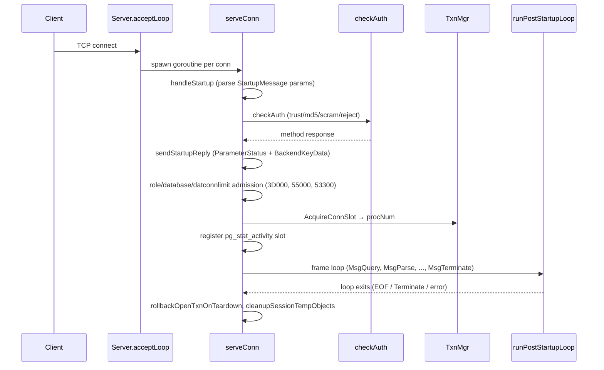
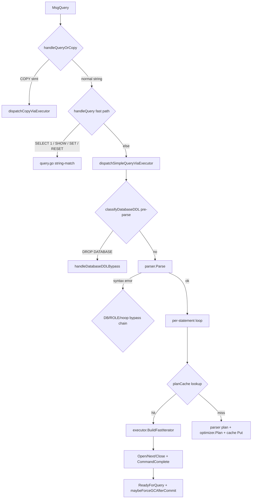
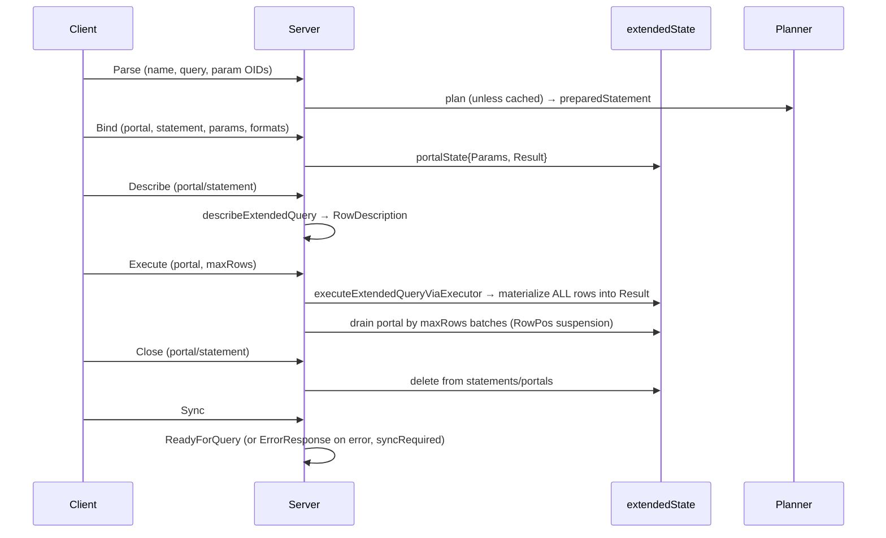
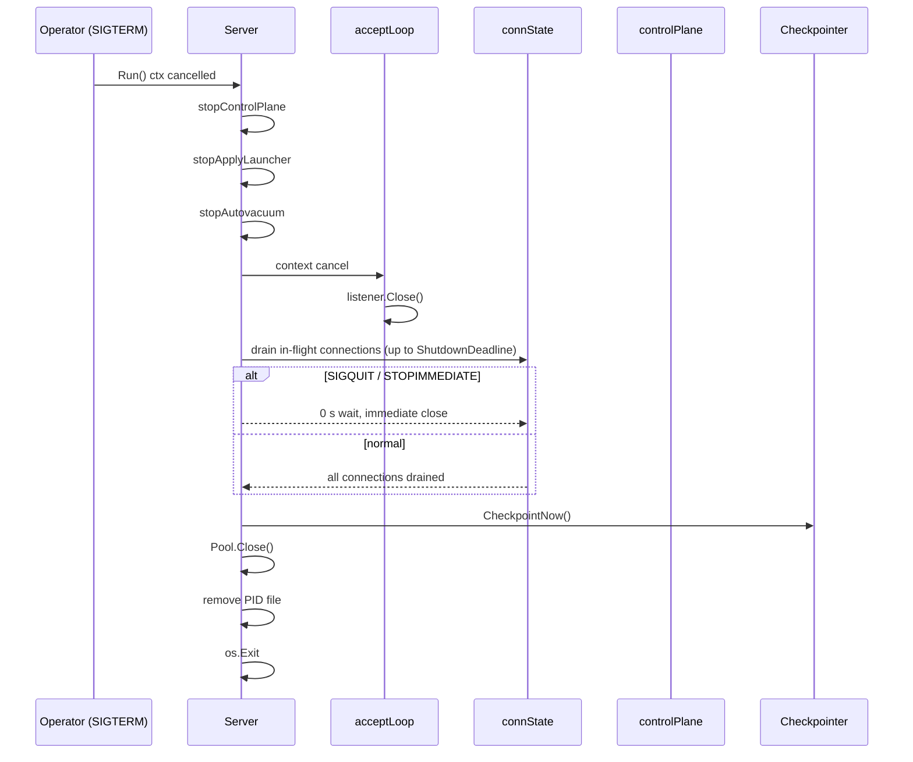
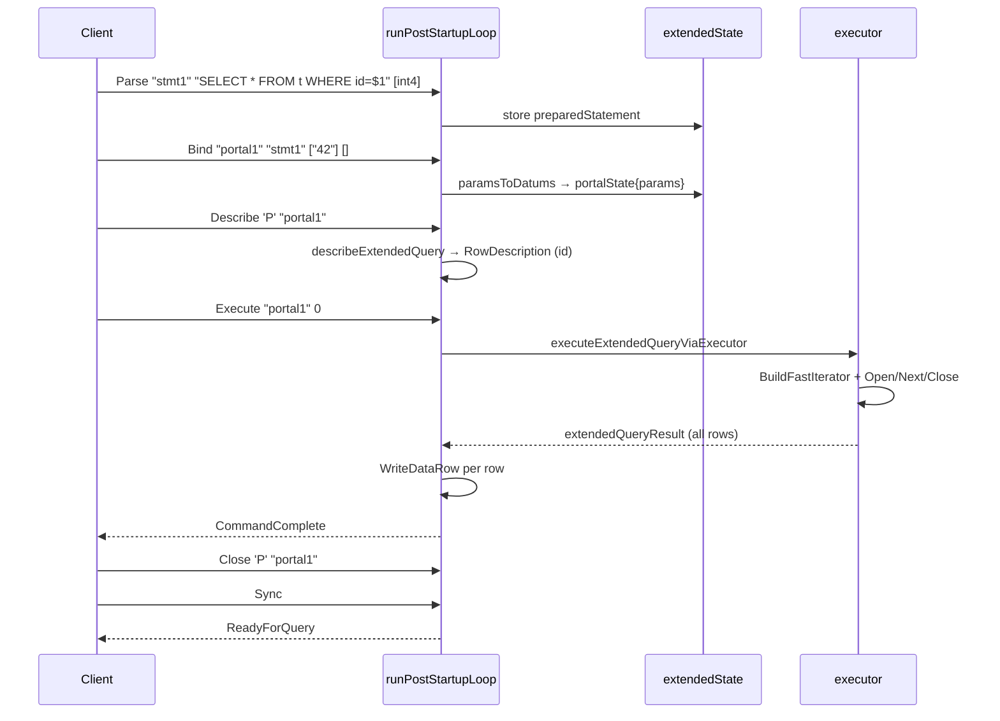

# Module: `internal/postmaster`

The goopg server process: the TCP listener, the per-connection backend
lifecycle, the PostgreSQL v3 wire-protocol frame loop, SQL dispatch (simple +
extended + COPY), and the operator control plane. One goroutine per client
connection (`serveConn`) is the analogue of one PG backend process, owning the
active MVCC transaction/snapshot, pinned buffers, WAL inserts, and the
synchronous-commit flush. The `autovacuum/` subpackage is the ticker-driven
background vacuum/analyze launcher. **16,770 LOC** in the parent package.

## Key Files (by LOC)

| File                 | LOC  | Role |
|----------------------|------|------|
| `dispatch.go`        | 4,453 | Simple-query dispatcher: `dispatchSimpleQueryViaExecutor`, plan cache, auto-commit, per-statement loop, DDL bypasses, GC throttle, `executeOneSimpleStmt`. The largest file — the simple-protocol heartbeat. |
| `database_ddl.go`    | 2,018 | String-prefix DDL bypasses for CREATE/ALTER/DROP DATABASE: `classifyDatabaseDDL`, `handleDatabaseDDLBypass`, `tryHandleDatabaseDDL`, WAL-recording of database registration. |
| `server.go`          | 1,905 | `Server` listener; accept loop, per-conn goroutine, startup/auth handshake, frame loop, control plane, `Config`/`New`/`Run`. |
| `role_ddl.go`        | 1,374 | CREATE/ALTER/DROP ROLE/USER string-prefix bypasses: `tryHandleRoleDDL`, `splitLeadingRoleDDL`, role tracking in catalog. |
| `copy.go`            | 942   | COPY routing: CopyTo stream via `runCopyToStream`; CopyFrom arms `copyInState` and routes `CopyData`/`CopyDone`/`CopyFail` frames; text and CSV EOD detection. |
| `extended.go`        | 934   | Extended-protocol frames: Parse/Bind/Describe/Execute/Close handlers, `extendedState` (statements+portals), `extendedQueryResult` with row materialization, `payloadReader`. |
| `conn_tx.go`         | 857   | `connTxState`: explicit-txn holder, session identity trio, cursors, prepared statements, notify buffer, `OnCommitActions`, prepared-transaction GID. |
| `grant_ddl.go`       | 834   | GRANT/REVOKE DDL handling, privilege checks, role-based access control. |
| `dispatch_extended.go`| 733  | Extended-query executor path: `executeExtendedQueryViaExecutor`, `tryHandleDatabaseOrRoleDDLExtended`, `tryCompatNoopExtended`, `paramsToDatums`. |
| `query.go`           | 698   | Legacy string-match fast paths (`SELECT 1`, `SHOW`, `SET/RESET`, `SET ROLE`/`SESSION AUTHORIZATION`), `writeQueryError`, `setIsSuperuserGUC`. |
| `txn_verb.go`        | 525   | Shared BEGIN/COMMIT/ROLLBACK/SAVEPOINT state machine: `applyTransactionVerb`, `txnVerbOutcome`, 25P01 warning, deferred FK/SSI/DDL-applier sequence. |
| `statement_log.go`   | 385   | `logStatement`/`logDuration` per-statement query logging (`GOOPG_LOG_STATEMENT`, `log_min_duration_statement`). |
| `notify.go`          | 329   | LISTEN/NOTIFY hub: `notifyHub` with `listeners[channel]` set and per-session `pending` FIFO; commit-visibility delivery. |
| `twophase.go`        | 321   | PREPARE TRANSACTION/COMMIT PREPARED/ROLLBACK PREPARED store: prepared-GID registry, 2PC persistence. |
| `plancache.go`       | 175   | Cross-session plan cache: 16 shards × 32 entries = 512 total, FNV-1a shard hash, doorkeeper admission filter, DDL invalidation. |
| `cancel.go`          | 154   | Cancel registry: `CancelBackend`/`pg_cancel_backend`/`pg_terminate_backend` by PID or procNum. |
| `eof_watch.go`       | 133   | Client-EOF watcher: per-query goroutine `recvfrom(MSG_PEEK)` every 500 ms cancels compute-bound queries when the client vanishes. |
| `autovacuum/launcher.go` | 526 | Background autovacuum/autoanalyze launcher with its own Pool/TxnMgr/Catalog handles. |

## Public API

```go
func New(cfg Config) *Server
type Config struct{ Address, ServerVersion string; Logger; Policy auth.Policy;
    UserStore auth.UserStore; Registry *misc.Registry; Catalog catalog.Catalog;
    Pool *storage.Pool; TxnMgr *transam.Manager; LockMgr *lmgr.LockManager;
    Activity *activity.Registry; ShutdownDeadline; HandshakeTimeout; /* … */ }
type Server struct{ /* … */ }
func (s *Server) Run(ctx) error
func (s *Server) Addr() *net.TCPAddr / Ready() <-chan struct{}
func (s *Server) CancelBackend(pid int32) error / TerminateBackend(pid int32) error
func (s *Server) QueueNotify(sess *misc.SessionRegistry, channel, payload string)
func (s *Server) SetForcedGCEnabled(v bool)
func (s *Server) ApplyLauncher() *replication.ApplyLauncher
type Notification struct{ PID uint32; Channel, Payload string }
func NewLauncher(pool, txnMgr, cat) *Launcher   // autovacuum subpackage

// Plan cache
type planCacheKey string
func normalizeCompatSQL(sql string) string
func planCacheKey(sql string, connDBOid uint32) string
func planCacheIsCacheable(node optimizer.Node) bool
```

## Internal structure

### Connection lifecycle (`server.go`)



`Run` binds the listener, sweeps stray temp files, starts the control plane /
apply-launcher / autovacuum, then `acceptLoop` spawns one goroutine per conn
via `serveConn`. `serveConn` runs the handshake, `checkAuth`, role/database/
datconnlimit admission, registers an activity slot, and enters
`runPostStartupLoop`.

Authentication methods: trust (loopback default), md5, SCRAM-SHA-256 (with
`scram_iterations` configurable per role), reject. The auth policy is the
`(conn-type, remote, database, user)` tuple from the StartupMessage; replication
connections skip the database-existence check.

Admission checks in order:
1. Unknown role → FATAL `28000` `role "x" does not exist`.
2. Unknown database → FATAL `3D000` `database "x" does not exist` (skipped for
   replication connections).
3. `datconnlimit = -2` (mid-DROP) → FATAL `55000` `cannot connect to invalid database`.
4. Positive `datconnlimit` exceeded (non-superuser) → FATAL `53300` `too many
   connections for database` (self-inclusive count, matching
   `CountDBConnections`).
5. Proc-slot exhaustion → `57314`-class reject.

### Simple protocol (`dispatch.go`)



The simple-query path parses the entire SQL string; multi-statement batches
split semicolon-wise. Errors abort the run — every later statement in the same
Query message is skipped (upstream "abort-on-error"). The statement loop runs
`parser.Parse → plan-cache lookup → optimizer.Plan → executor.BuildFastIterator
→ Open/Next/Close → CommandComplete`, then a single ReadyForQuery.

The DDL bypass chain (all before real parsing fails):
- `DROP DATABASE` (which HAS parser grammar via `DropCompatStmt`) is
  intercepted *before* `parser.Parse` so the stub arm cannot shadow the real
  catalog-backed DROP.
- `CREATE/ALTER/DROP DATABASE` and `CREATE/ALTER/DROP ROLE` have no parser
  grammar; `handleDatabaseDDLBypass` / `tryHandleRoleDDL` run string-prefix
  matches, update the catalog, and emit a WAL record for crash survival.
- Multi-statement batches starting with role-DDL are peeled and recursed.
- Compat no-op forms (`GRANT`, `SCHEMA`, various no-ops) absorb whole
  statements with `compatNoopCommandTag`.

### Extended protocol (`extended.go` / `dispatch_extended.go`)



- `extendedState` holds `statements` (prepared-statement map) and `portals`
  (portal map). Prepared statements carry name/query/param-count;
  portals carry statement ref + bound params + materialized result + RowPos.
- Executes **materialize all rows** into `extendedQueryResult`, then drain the
  portal with `maxRows` suspension. Out-of-block Executes auto-commit per
  statement (PG parity).
- `paramsToDatums` (dispatch_extended.go) feeds text-format bound params into
  `executor.Context.Params`; binary parameters are rejected at Bind time.
- Extended errors set `syncRequired` so the next Sync emits the error; a
  PARSE-time error inside an explicit transaction aborts the block (25P02).
- The extended path reuses `applyTransactionVerb` from txn_verb.go for
  BEGIN/COMMIT/ROLLBACK — no second implementation (M0132-S2).

### COPY (`copy.go`)

- CopyTo: `runCopyToStream` / `handleCopyToStdoutQuery` stream rows with
  CopyOutResponse + CopyData frames.
- CopyFrom: `handleCopyInFrame` arms a `copyInState` and routes
  `CopyData`/`CopyDone`/`CopyFail`; `consumeExecCopyData` (executor-backed) or
  `consumeTextCopyData` (text-mode) drain the frames; `commitCopyTx` finalizes.
- EOD detection (`isCopyTextEOD`) handles `\.` and `\.\n` text-mode terminators.

### Transaction state machine (`txn_verb.go`)

`applyTransactionVerb` is the single shared BEGIN/COMMIT/ROLLBACK/SAVEPOINT
implementation used by BOTH protocols. It returns a `txnVerbOutcome` (Handled,
Warn, Tag, Err) and each caller renders it in its own protocol shape. Key rules:
- COMMIT in a failed block → ROLLBACK tag.
- COMMIT/ROLLBACK outside a block → 25P01 WARNING, not an error.
- The inline deferred FK/UNIQUE/EXCLUDE checks, SSI pre-commit check, deferred
  DROP INDEX / ATTACH PARTITION / INHERIT / DROP TABLE / DROP FUNCTION
  appliers, and enum-DDL undo run here because this path bypasses
  `transactionOp.execCommit`.
- SAVEPOINT / ROLLBACK TO / RELEASE fall through to the executor (Handled=false).

### LISTEN/NOTIFY (`notify.go`)

`notifyHub` multiplexes all connections in one OS process. Sessions are
identified by their stable `*config.SessionRegistry`. LISTEN registers a
session in `listeners[channel]`; NOTIFY queues into `pending[session]` FIFO;
deliveries become visible only when the notifying transaction COMMITs
(commit-visibility, matching async.c). `bufferNotify`/`notifySavepoint`/
`notifyReleaseSavepoint`/`notifyRollbackToSavepoint` on `connTxState` handle
savepoint scoping. Delivered at command boundary (before ReadyForQuery).

### Plan cache (`plancache.go`)

- 16 shards, each `RWMutex` + `map[string]optimizer.Node` + FIFO `order`.
- Max 32 entries/shard = 512 total.
- Key: `planCacheKey(sql, dbOid)` — `normalizeCompatSQL(sql)` (lowercase,
  whitespace-collapsed, trailing-semicolon stripped) prefixed with the
  connection's effective namespace OID. Matches across sessions with minor
  whitespace differences but NOT across different namespaces (a plan embeds
  resolved `*catalog.Table`/`*catalog.Index` pointers).
- **Doorkeeper admission**: a key earns a slot only on its SECOND Put (one
  atomic `Swap` per Put, lock-free). Marks survive `Invalidate()` — "this SQL
  has been seen before" persists across DDL so hot statements re-admit
  immediately. This was added because under pgbench's simple protocol every
  statement had client-substituted literals, unique keys, all cache misses, and
  a write-lock storm on every Put (66% of remaining mutex delay).
- `Invalidate()` clears all shards atomically after every DDL statement.
- `planCacheIsCacheable` excludes DDL/Transaction/Copy nodes.

### Control plane & shutdown

`startControlPlane` handles operator commands; `stopControlPlane` on shutdown.
Shutdown ladder (`ShutdownDeadline`, default 120 s): drain in-flight
connections after the accept loop exits; `STOPIMMEDIATE` bypasses the deadline
(0 s wait, mirroring SIGQUIT). `reloadConfig` reloads GUCs.

### GC throttling (`dispatch.go`)

`maybeForceGCAfterCommit` is counter-first (no STW in the hot path): the atomic
`queriesWithoutFreeCounter` is evaluated first; `runtime.ReadMemStats` (which
requires a brief STW) only when a round is due. Real `runtime.GC()` +
`debug.FreeOSMemory()` only past `heapReleaseThresholdBytes` (4 GiB HeapInuse)
or every `queriesPerForcedFree` (10,000) queries. Gated by `GOOPG_FORCED_GC`
env (default OFF) — `SetForcedGCEnabled` for tests. The 10,000 counter was
raised from 8 because the original pgbench-8 caused a STW ReadMemStats on every
query and full GC every ~8 queries (43% CPU at c=10 SO).

### autovacuum subpackage

Standalone `Launcher` with its own Pool/TxnMgr/Catalog handles, ticks every
60 s, scans `AllTables()`, calls `vacuum.VacuumWithOptions`/`vacuum.Analyze`.

## Key flow: shutdown sequence



## Dependencies

- **Uses** `catalog`, `executor`, `parser`, `optimizer`, `libpq` (+`auth`),
  `storage` (+`file`, `lmgr`), `access/transam` (+`multixact`, `xlog`,
  `control`), `backup`, `replication`, `postmaster/autovacuum`, `utils/*`,
  `port/gls`. Hands off `parser.Parse → optimizer.Plan → executor.BuildFastIterator`.
- **Used by** `cmd/goopg/main.go`, `internal/replication/*`,
  `internal/backup/basebackup.go`. The executor wires callbacks back into
  `Server` (`CancelBackend`, `QueueNotify`, `PLpgSQLCommitChain`, …).

## Notable patterns / gotchas

- **Per-connection goroutine model** — the client goroutine is the backend; it
  exclusively owns WAL insert + sync-commit flush; checkpointer/walwriter/
  autovacuum are separate goroutines. Pool flush is checkpointer-only (asserted
  via `Pool.OnFlushAll`).

- **Two protocol paths must agree** — simple (`dispatch.go`) and extended
  (`dispatch_extended.go`) are siblings sharing `applyTransactionVerb`,
  `commandTagFor`, the plan cache, and `paramsToDatums`; each has been a silent
  divergence source (M0134-0009 pairs SET ROLE / SET SESSION AUTHORIZATION
  fast-path closures).

- **Parser gap = wire-level DDL bypass** — CREATE/ALTER/DROP DATABASE and ROLE
  have no parser grammar; they are intercepted by string-prefix matching in both
  protocols. Compat no-op forms absorb GRANT/SCHEMA/etc. The bypass chain must
  be replicated in both protocol paths — a missed arm is a silent divergence.

- **Identity trio on `connTxState`** — `LoginUser` / `SessionUser` /
  `NonSuperuserRole` (+`SetRoleIsActive`), mirrored into `ectx` and restored at
  `End()`. `SET SESSION AUTHORIZATION` changes SessionUser AND clears SET ROLE
  (PG parity); `SET ROLE` changes only the effective role, never session_user.

- **Aborted-block (25P02) gates** ahead of every fast path — only COMMIT/
  ROLLBACK/ROLLBACK TO/2PC pass; extended errors set `syncRequired`. A
  PARSE-time error inside an explicit transaction also aborts the block
  (M0134-0155).

- **Extended Executes auto-commit per statement** (PG parity).

- **Materialize-then-drain in extended** — Executes materialize ALL rows into
  `extendedQueryResult` first, then drain the portal by `maxRows`. This is a
  memory-inefficiency vs PG's streaming, but required for `maxRows`
  suspension and re-execution semantics.

- **Package name vs doc comment** — file doc says "Package server…" but the
  package name is `postmaster` (cosmetic mismatch).

- **Oversized frames** — drained to resync the stream, emits `08P01`.

- **Client-EOF watcher** — per-query goroutine `recvfrom(MSG_PEEK)` every
  500 ms cancels compute-bound queries when the client vanishes (never armed
  for replication; x86_64-Linux-only).

- **Doorkeeper plan-cache admission** — the SECOND-sighting rule means a
  repeated statement is cached from its third execution. Marks survive DDL
  invalidation on purpose.

- **procNum is connection-lifetime** — assigned once via `TxnMgr.AcquireConnSlot`
  (not PID-modulo), used for WaitEventStart, pg_stat_activity
  `RegisterAt`, and `gls.SetBackendID` for WAL stripe pick. The
  PID-modulo fallback only serves Manager-less unit harnesses.

- **`datconnlimit` self-inclusive count** — the check registers the backend
  FIRST so `CountByDatName` includes the new connection, matching
  `CountDBConnections`. Superusers are counted but skip the reject check.

- **GC free is opt-in** — the forced-GC trigger ships DISABLED
  (`GOOPG_FORCED_GC` unset). Benchmark runs that want deterministic memory
  return must set it, but the default avoids pgbench STW regressions.

- **NOTIFY commit-visibility** — notifications queue on `pending` but are only
  delivered once the notifying transaction commits; ROLLBACK discards them.
  Savepoint operations (RELEASE/ROLLBACK TO) re-scope buffered notifies.

- **Statement/lock timeouts** — `statement_timeout` and `lock_timeout` are read
  from the `SessionRegistry` at statement start via `sessionStatementTimeout`/
  `sessionLockTimeout` in dispatch.go (1665/1686). A statement that outlives its
  timeout is cancelled via context cancel; the cancel is detected at the next
  `Pin()` call, which returns a context-cancelled error.

- **`executeOneSimpleStmt` is the per-statement bottleneck** — it wraps
  `BuildFastIterator → Open/Next/Close → commandTagFor` and handles plan-cache
  read/write, auto-commit, and result serialization. Every optimization to the
  simple-query path touches this function.

## Extended protocol state machine (`extended.go`)

`extendedState` holds the per-connection prepared-statement and portal maps:

```go
type extendedState struct {
    mu        sync.Mutex
    statements map[string]*preparedStatement  // stmt name → statement
    portals    map[string]*portalState        // portal name → portal
}
```

`preparedStatement` carries `query`, `paramCount`, `node optimizer.Node`,
`nodeFields`, `schema`, `tableOID`, `commandTag`, `commandTagFn`, `ddlSuffix`,
`isDDL`, `isRO`, `isTX`, `isCopy`, `inferredParamTypes`.

`portalState` carries `stmt *preparedStatement`, `params []executor.Datum`,
`result *extendedQueryResult`, `rowPos int`, `maxRows int`, `formatCodes`.

**Parse**: `handleParse` calls `parser.Parse` + `optimizer.Plan` (unless
cached), stores the result as a `preparedStatement`. A PARSE-time error inside
an explicit transaction sets `syncRequired` and aborts the block (25P02).

**Bind**: `handleBind` resolves the statement, coerces parameters, and creates
a `portalState` with `extendedQueryResult`. The portal is stored in `portals`.

**Describe**: `handleDescribe` returns `RowDescription` from the portal's
schema, or `ParameterDescription` from the statement's param count.

**Execute**: `handleExecute` runs `executeExtendedQueryViaExecutor` (which
materializes ALL rows into `extendedQueryResult`), then drains the portal by
`maxRows` batches. `RowPos` tracks the current position for suspension.

## Two-phase commit (`twophase.go`)

`twophase.go` implements `PREPARE TRANSACTION` / `COMMIT PREPARED` /
`ROLLBACK PREPARED`:

- `preparedState` map: `globalGID` → `*preparedTransaction` (with tx, snap,
  xid, preparedTime, tempTables, etc.).
- `PreparedTransactionCount` returns the count for `pg_prepared_xacts`.
- `PrepareTransaction` persists the transaction state to a sidecar file under
  `pg_twophase/` using the `pg_twophase` format.
- `CommitPrepared` / `RollbackPrepared` replay the state from the file.

## Cursor support

`executeFetch` (dispatch.go:4154) materializes a cursor's result into
`cursorCursorEntry` (stored in `connTxState.cursors`), then drains it by
`count` rows. `materializeCursor` calls `executeOneSimpleStmt` with a FETCH
ALL plan, storing the full result. `resolveCurrentOf` resolves `WHERE CURRENT OF`
for UPDATE/DELETE.

## COPY protocol (`copy.go`)

`runCopyToStream` (CopyTo) sends the row data as `CopyData` frames.
`handleCopyInFrame` (CopyFrom) arms `copyInState` and routes:
- `CopyData` → `consumeExecCopyData` (executor-backed path) or
  `consumeTextCopyData` (text-mode, line-oriented).
- `CopyDone` → `commitCopyTx` (validate rows, commit).
- `CopyFail` → `rollbackCopyTx` (discard rows).

`isCopyTextEOD` detects `\.` (backslash-period) at the start of a line as
the text-mode end-of-data delimiter. `isCopyTextEOD` handles both `\.` and
`\.\n` (with optional carriage return).

## Notify buffering (`notify.go`)

`notifyHub` is the singleton hub per `Server`:

```go
type notifyHub struct {
    mu        sync.Mutex
    listeners map[string][]*misc.SessionRegistry  // channel → sessions
    pending   map[*misc.SessionRegistry][]*Notification
}
```

`QueueNotify` enqueues a notification into `pending` for the session.
`bufferNotify`/`notifySavepoint`/`notifyReleaseSavepoint`/`notifyRollbackToSavepoint`
handle savepoint scoping of buffered notifications. `deliverNotifies` scans
`pending` and routes matching listeners. `ConnTxState` carries `pendingNotifications`
for the savepoint scope.

## DDL bypass chain reference

The combined bypass chain used by both simple and extended protocols:

| Statement type | Handler | Covers |
|---|---|---:|
| DROP DATABASE | `handleDatabaseDDLBypass` | Full DROP DATABASE (has parser grammar) |
| CREATE DATABASE | `handleDatabaseDDLBypass` | String-prefix match |
| ALTER DATABASE | `handleDatabaseDDLBypass` | String-prefix match (partial) |
| CREATE ROLE | `tryHandleRoleDDL` | String-prefix match |
| ALTER ROLE | `tryHandleRoleDDL` | String-prefix match |
| DROP ROLE | `tryHandleRoleDDL` | String-prefix match |
| GRANT | `compatNoopCommandTag` | Recognized as no-op |
| SCHEMA | `compatNoopCommandTag` | Recognized as no-op |
| COMMENT | `compatNoopCommandTag` | Recognized as no-op |
| EXTENSION | `compatNoopCommandTag` | Recognized as no-op |
| SECURITY LABEL | `compatNoopCommandTag` | Recognized as no-op |
| TEXT SEARCH | `compatNoopCommandTag` | Recognized as no-op |
| DEFAULT PRIVILEGES | `compatNoopCommandTag` | Recognized as no-op |

## Statement logging (`statement_log.go`)

`logStatement`/`logDuration` implement per-statement query logging:

- `GOOPG_LOG_STATEMENT` env (or `log_statement` GUC) gates whether statements
  are logged at all.
- `log_min_duration_statement` GUC gates duration logging — a statement
  faster than the threshold is not logged.
- The log line format matches PG's: `LOG:  duration: 12.345 ms  statement:
  SELECT ...` plus the client address and database.

`sessionStatsTarget`/`sessionFreezeMinAge`/`sessionSyncCommitMode`/
`sessionAsyncCommit`/`sessionOpportunisticPrune` are the GUC-read helpers in
dispatch.go that bridge `SessionRegistry` values to executor/storage
behavior (stats_target, vacuum_freeze_min_age, synchronous_commit, etc.).

## Server config defaults (`server.go`)

`Config.defaults()` fills in sensible defaults for unset fields:

```go
func (c *Config) defaults() {
    if c.Address == "" { c.Address = "127.0.0.1" }
    if c.ServerVersion == "" { c.ServerVersion = "18.3" }
    if c.ShutdownDeadline == 0 { c.ShutdownDeadline = 120 * time.Second }
    if c.HandshakeTimeout == 0 { c.HandshakeTimeout = 30 * time.Second }
    // ...
}
```

`New(cfg)` wires the `Server` struct: the listener is bound lazily in
`Run`, the apply launcher is created, and the control plane is initialized.

## Cursor support detail

`materializeCursor` runs the cursor's query via `executeOneSimpleStmt` with
a FETCH-ALL plan, collecting all rows into the `cursorEntry.result`. The
result is stored in `connTxState.cursors` keyed by cursor name. `executeFetch`
reads `count` rows from the materialized result, respecting `forward` and
the `RowPos` cursor.

`FETCH ALL` / `FETCH 10` / `FETCH NEXT` / `FETCH FORWARD` / `FETCH BACKWARD`
/ `FETCH ABSOLUTE` / `FETCH RELATIVE` are all routed through `executeFetch`.

## Signal/control-plane handling

The `Server` runs a `controlPlane` goroutine that listens on a Unix-domain
socket (via `transam/control.Listener`). Operator commands:

- `stop` / `stop immediate` — graceful/immediate shutdown.
- `reload` — `reloadConfig` re-reads `postgresql.conf` and applies SIGHUP
  GUCs.
- `status` — returns the server state (started, ready, shutting down).
- `promote` — promote a standby (archive-recovery mode).

`Send(path, cmd, timeout)` in `control/control.go` is how `pg_ctl`-style
clients issue these commands.

## The per-connection goroutine lifecycle

`serveConn(ctx, conn, cfg)` is the connection handler:

1. `handleStartup` — read the StartupMessage, extract params, set up the
   session registry.
2. `checkAuth` — run the auth exchange (trust/md5/scram/reject).
3. `sendStartupReply` — ParameterStatus for each reportable GUC, then
   BackendKeyData, then ReadyForQuery.
4. `runPostStartupLoop` — the frame loop dispatching each message type.
5. On exit: `rollbackOpenTxnOnTeardown`, `cleanupSessionTempObjects`,
   `ReleaseConnSlot`, and unregister the activity slot.

The connection goroutine owns the `executor.Context` (per-statement),
the `connTxState` (per-connection transaction state), the `SessionRegistry`,
and the plan-cache shard access.

## Key flow: extended protocol bind-execute cycle



## Compat no-op absorption

`compatNoopCommandTag(sql)` recognizes a set of SQL statements goopg does not
act on but must not error on, and returns their command tag. The recognized
forms (string-prefix matched in `splitLeadingCompatNoopDDL`):

- `GRANT ...` / `REVOKE ...` (no-op privilege statements absorbed here; real
  GRANT/REVOKE on tables goes through `grant_ddl.go`).
- `COMMENT ON ...` — absorbed as a no-op unless it targets a tracked object.
- `SECURITY LABEL ...` — always a no-op.
- `TEXT SEARCH DICTIONARY/CONFIGURATION ...` — absorbed unless it matches a
  tracked TS object.
- `EXTENSION ...` — absorbed unless it matches a tracked extension.
- `CREATE SCHEMA ...` — handled by `tryHandleDatabaseDDL`'s schema arm.
- `ALTER SYSTEM ...` — absorbed.
- `DISCARD ALL` — absorbed (with a session reset side effect).

`registerCompatNoopSchema` records a no-op `CREATE SCHEMA` in the catalog so
later references to the schema resolve; the schema-qualified mismatch check
(`schemaQualMismatchError`) distinguishes a genuinely-misspelled schema from
a compat no-op that just happens to start with the same name.

The bypass chain must be replicated in BOTH the simple path (dispatch.go) and
the extended path (dispatch_extended.go's `tryCompatNoopExtended`) — a missed
arm is a silent protocol divergence.

## Statement tag rendering

`commandTagFor(node, op, rowCount)` builds the `CommandComplete` tag:

| Plan node | Tag |
|---|---|
| `Insert` | `INSERT 0 <n>` |
| `Update` | `UPDATE <n>` |
| `Delete` | `DELETE <n>` |
| `Select` | `SELECT <n>` |
| `Copy` | `COPY <n>` |
| `DDL` | per-`ddlTag(stmt)` (e.g. `CREATE TABLE`, `ALTER TABLE`) |
| `Transaction` | per-`transactionTag(verb)` (`BEGIN`, `COMMIT`, `ROLLBACK`) |
| `Utility` | per-`utilityTag(stmt)` |
| `Merge` | `MERGE <n>` |

`rowsAffected(op)` extracts the count from a `RowCounter` operator; a
non-counter operator returns 0, so forgetting the `RowCounter` interface
silently emits `INSERT 0 0` instead of `INSERT 0 N`.

## Datum-to-text rendering (`dispatch.go`)

`appendTypedCellText` renders a `Datum` to its wire text form, dispatching on
the catalog `Type`:

- `int2`/`int4`/`int8`/`oid`/`xid`/`cid` → decimal text from `Datum.Int`.
- `float4`/`float8` → `appendFloatText(dst, d, 32)` / `appendFloat8Text`
  (matching PG's `%g`-style float output, including exponent formatting).
- `text`/`varchar`/`bpchar`/`char` → raw bytes.
- `date`/`time`/`timestamp`/`timestamptz` → `appendTimeText` with the
  session DateStyle.
- `numeric` → `FormatNumeric`.
- `bool` → `t`/`f`.
- `bytea` → `\x...` hex (or escape format per `bytea_output`).

`maybeConvertCellsForClientEncoding` applies the client encoding conversion
when `client_encoding != server_encoding`.

## GC counter tuning (`dispatch.go`)

`parseForcedGCEnv` reads `GOOPG_FORCED_GC` from the environment: unset/`0`/
`false`/`off` disables, anything else enables. `maybeForceGCAfterCommit` is
called after every commit:

1. Bump `queriesWithoutFreeCounter` atomically.
2. If `GOOPG_FORCED_GC` is off, return immediately (no STW).
3. Every `queriesPerForcedFree` (10,000) queries, or when
   `runtime.MemStats.HeapInuse > heapReleaseThresholdBytes` (4 GiB), run
   `runtime.GC()` + `debug.FreeOSMemory()`.

The 10,000-counter (raised from 8) avoids the STW `ReadMemStats` + full GC on
every query that caused a 43% CPU regression at pgbench c=10 SO.