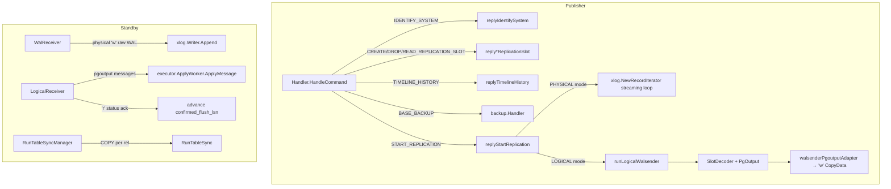
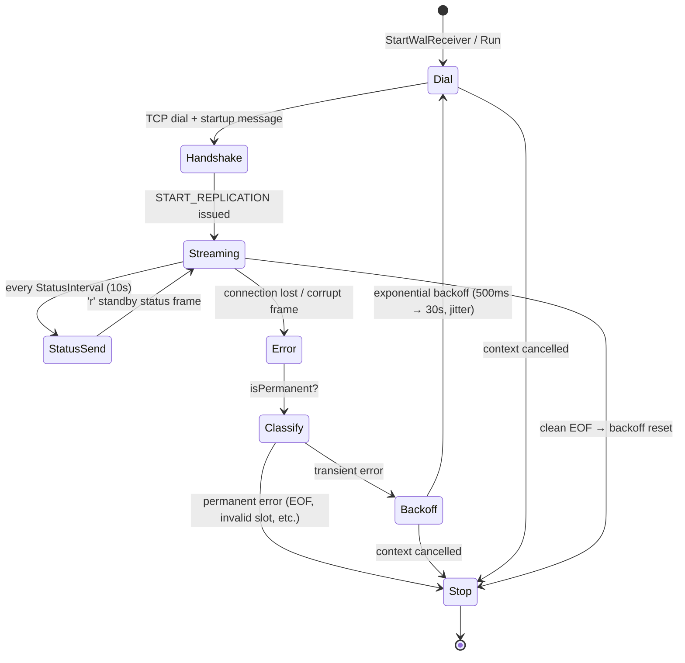
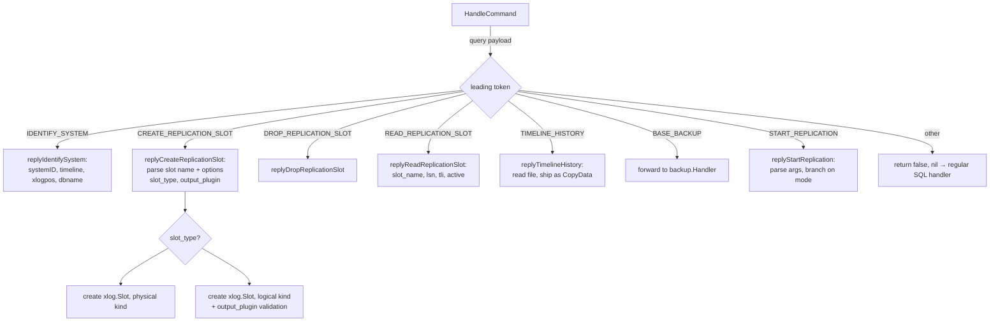
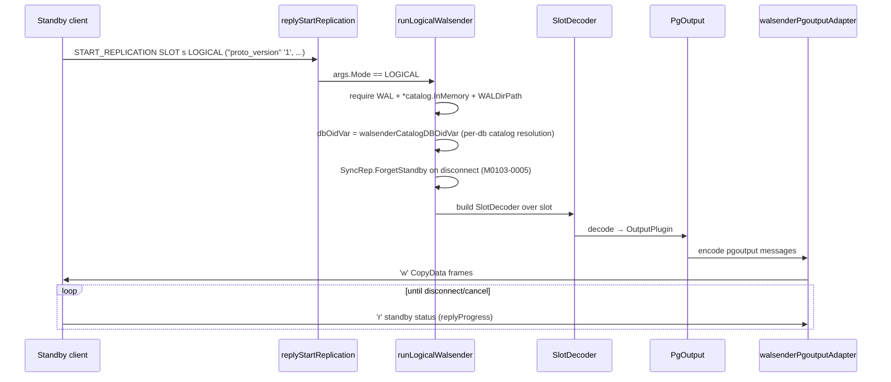
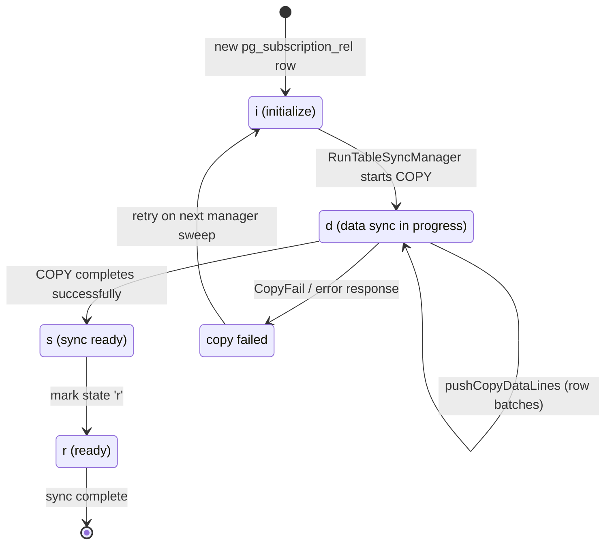
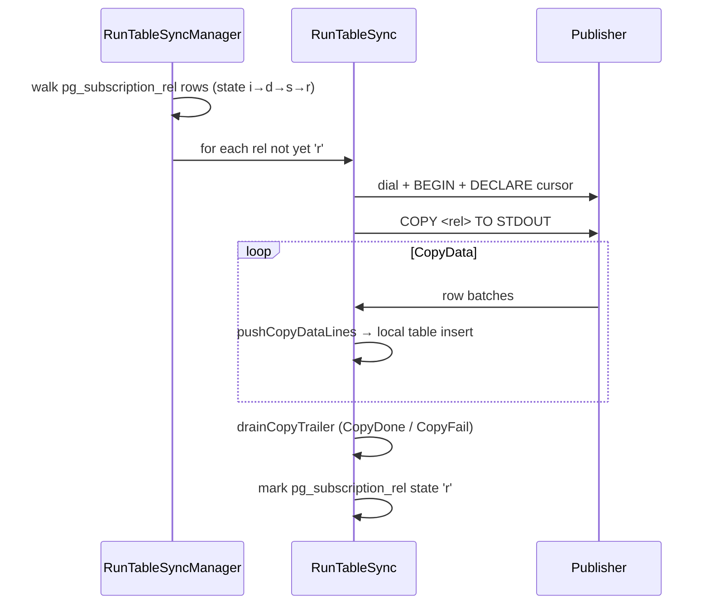
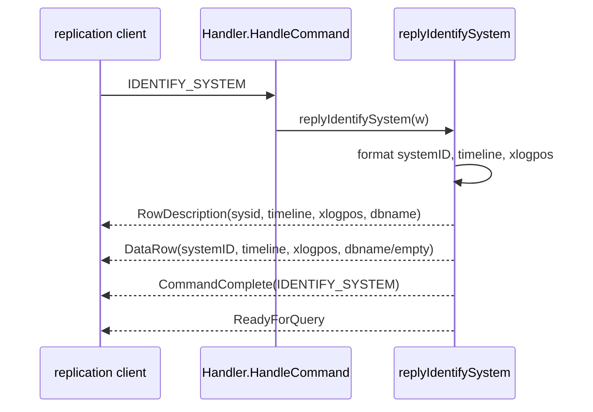
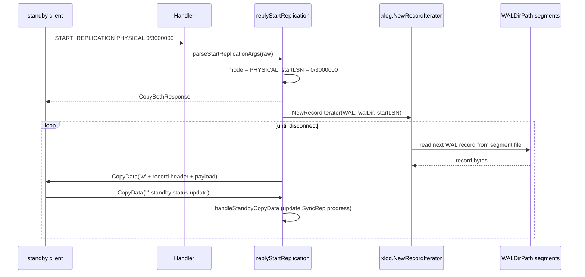
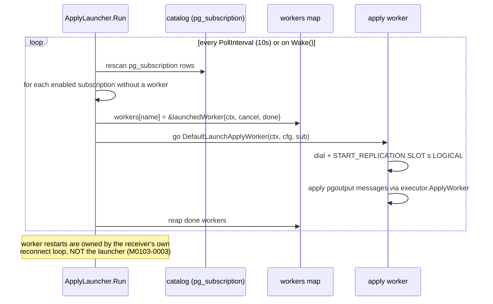

# Module: `internal/replication`

Streaming and logical replication, split publisher/subscriber like upstream PG's
`src/backend/replication/`. The primary side (walsender) dispatches replication
commands (`IDENTIFY_SYSTEM`, slot DDL, `START_REPLICATION`, `TIMELINE_HISTORY`,
`BASE_BACKUP`) and runs a physical WAL streaming loop plus a logical `pgoutput`
arm. The standby side (walreceiver, logicalreceiver) are pure-Go v3 wire clients
with reconnect loops. Logical replication adds subscriber-side initial COPY table
sync and a process-global apply launcher. Package total: **4,019 LOC** across 8
production files.

## Responsibilities

- Physical (streaming) WAL replication — primary sender + standby receiver.
- Logical replication (`pgoutput`) — publisher decode/encode + subscriber apply.
- Replication slots (`CREATE/DROP/READ_REPLICATION_SLOT`), `IDENTIFY_SYSTEM`,
  `TIMELINE_HISTORY`, `BASE_BACKUP` (routed to `internal/backup`).
- Table sync (`pg_subscription_rel` state machine `i→d→s→r`) and the apply
  launcher (one apply worker per enabled subscription).

## Key Files (by LOC)

| File                   | LOC | Role |
|------------------------|-----|------|
| `walsender.go`         | 1,135 | Primary-side command dispatcher (`Handler.HandleCommand` mirrors `exec_replication_command`) + physical streaming loop over `xlog.NewRecordIterator`. Slot DDL, `IDENTIFY_SYSTEM`, `TIMELINE_HISTORY`, `START_REPLICATION` arg/option parsing. |
| `walreceiver.go`       | 696   | Standby physical client: `DialWalReceiver`, handshake, `START_REPLICATION`, append raw WAL into `*xlog.Writer`; reconnect launcher `StartWalReceiver` with backoff; `primary_conninfo` parsing. |
| `logicalreceiver.go`   | 664   | Subscriber logical client: reconnect loop, `START_REPLICATION SLOT … LOGICAL` with `(proto_version, publication_names)` options, pgoutput decode → `executor.ApplyWorker`, LSN acking, `isPermanent` error classifier. |
| `logicalwalsender.go`  | 505   | Logical arm of `START_REPLICATION`: `SlotDecoder` + `PgOutput` → `'w'` CopyData frames via `walsenderPgoutputAdapter`; `publicationFilter` (publication name allow-list). |
| `applylauncher.go`     | 361   | Background reconcile loop (10 s poll / wake channel) spawning one apply worker per enabled `pg_subscription` row. |
| `tablesync.go`         | 328   | One publisher `COPY … TO STDOUT` exchange per relation: `RunTableSync`, `pushCopyDataLines`, `drainCopyTrailer`. |
| `tablesync_manager.go` | 236   | Per-subscription sweep of unsynced rels: `RunTableSyncManager` walks `pg_subscription_rel` rows not yet `'r'`. |
| `replication_util.go`  | 94    | `parseLSN`/`formatLSN`, error summaries. |

## Public API

### Physical walsender

```go
type Config struct{ Logger; Catalog catalog.Catalog; PubSub *catalog.PubSub;
    Slots *xlog.Slots; SyncRep *xlog.SyncRep; WalSenders *xlog.Senders;
    WAL *xlog.Writer; WALDirPath string; WALSegmentSize int64;
    SystemID string; Timeline uint32 }
type WriteQueryErrorFunc func(w *libpq.FrameWriter, code errcodes.Code, msg string,
    extra ...libpq.ErrorField) error
func NewHandler(cfg Config, werr WriteQueryErrorFunc, bb *backup.Handler) *Handler
func (s *Handler) HandleCommand(ctx, r, w, payload, appName, dbName) (bool, error)
```

### Handler methods

```go
func (s *Handler) HandleCommand(ctx context.Context, r *libpq.FrameReader, w *libpq.FrameWriter,
    payload []byte, appName, dbName string) (bool, error)
func (s *Handler) replyIdentifySystem(w *libpq.FrameWriter) error
func (s *Handler) replyCreateReplicationSlot(w *libpq.FrameWriter, args string) error
func (s *Handler) replyDropReplicationSlot(w *libpq.FrameWriter, args string) error
func (s *Handler) replyReadReplicationSlot(w *libpq.FrameWriter, args string) error
func (s *Handler) replyTimelineHistory(w *libpq.FrameWriter, args string) error
func (s *Handler) replyStartReplication(ctx context.Context, r *libpq.FrameReader, w *libpq.FrameWriter,
    raw string, appName, dbName string) error
func (s *Handler) handleStandbyCopyData(slotName string, payload []byte,
    senderHandle *xlog.Sender, syncRep *xlog.SyncRep, appName string) error
func (s *Handler) writeStreamingError(w *libpq.FrameWriter, code errcodes.Code, msg string) error
func (s *Handler) writeQueryError(w *libpq.FrameWriter, code errcodes.Code, msg string,
    extra ...libpq.ErrorField) error
func (s *Handler) runLogicalWalsender(ctx context.Context, r, w, args, appName, dbName) error
```

### Internal helpers

```go
func extractCString(buf []byte) (string, error)
func parseStartReplicationArgs(raw string) (startReplicationArgs, error)
func parseStartReplicationOptions(raw string) (map[string]string, error)
func splitStartReplicationOptionList(raw string) []string
func splitReplicationSlotOptionsBlock(args string) (prefix, opts string, has bool, err error)
func parseReplicationSlotOptions(raw string, kind xlog.SlotKind) error
func isLSNToken(token string) bool
func parseLSN(s string) (uint64, error)
func formatLSN(lsn uint64) string
func splitPublicationNames(raw string) []string
```

### Walreceiver

```go
type WalReceiverConfig struct{ PrimaryAddr, User, SlotName string; StartLSN uint64;
    WAL *xlog.Writer; StatusInterval, DialTimeout time.Duration; /* … */ }
func DialWalReceiver(ctx, cfg) (*WalReceiver, error)
func (r *WalReceiver) Run(ctx) error
func (r *WalReceiver) ApplyLSN() uint64
func (r *WalReceiver) Close() error
func StartWalReceiver(ctx, done chan struct{}, cfg) error   // reconnect-with-backoff launcher
func parsePrimaryConninfo(s string) string
func parsePrimaryConninfoFull(s string) (addr, appName, user, sslmode string)
func checkSSLMode(mode string) error
```

### Logical

```go
func NewLogicalReceiver(cfg LogicalReceiverConfig) *LogicalReceiver
func (r *LogicalReceiver) Run(ctx) error
func (r *LogicalReceiver) ApplyLSN() uint64
func (r *LogicalReceiver) Close() error
func NewApplyLauncher(cfg ApplyLauncherConfig) *ApplyLauncher
func (l *ApplyLauncher) Run(ctx) error / Wake()
func (l *ApplyLauncher) ActiveSubscriptions() []catalog.Subscription
func DefaultLaunchApplyWorker(ctx, cfg, sub) error
func RunTableSync(cfg TableSyncConfig) (int64, error)
func RunTableSyncManager(ctx, TableSyncManagerConfig) ([]TableSyncResult, error)
func isPermanent(err error) bool
func parseSubscriptionConninfo(conninfo string) (addr, appName string)
```

### Constants

```go
const oidInt4 = 23   // pg_type.dat int4 OID for replication result sets
const oidText = 25   // pg_type.dat text OID
const oidBytea = 17  // pg_type.dat bytea OID
const oidInt8 = 20   // pg_type.dat int8 OID (for restart_tli)
```

## Internal structure

### Physical vs logical — the central split



### WAL receiver reconnect loop



### Slot DDL decision tree



### Physical streaming loop

`HandleCommand` peels replication verbs off before the normal SQL dispatcher sees
them. When the input does not match a known replication verb it returns
`(false, nil)` so the regular handler can take it — keeping utility commands like
`SHOW server_version` working for diagnostics on a replication connection.

`START_REPLICATION` argument/option parsing (`parseStartReplicationArgs`,
`parseStartReplicationOptions`, `splitReplicationSlotOptionsBlock`,
`splitStartReplicationOptionList`) accepts the upstream option block syntax
`(...)`, including LSN/kind keywords (`isLSNToken`). The streaming loop ships
raw WAL segments from `WALDirPath`, sized `WALSegmentSize` (default
`xlog.DefaultSegmentSize`).

### Logical walsender



### Logical receiver

`Run` is a reconnect loop: `runOnce` → `dial` (with `DialTimeout`) →
`handshake` (replication-mode startup, `application_name`) →
`startStreaming` (issues `START_REPLICATION SLOT <slot> LOGICAL
("proto_version" '1', "publication_names" 'p1,p2')`) → `streamFrames` →
`handleFrame`/`handleCopyData`. `isPermanent` classifies errors into permanent
(abort the loop) vs transient (retry with `nextBackoff` exponential backoff:
1 s → 30 s with jitter; clean EOF resets backoff). `sendStatus` reports
`applyLSN` for all three fields (write/flush/apply) so `SyncRep` releases at
`remote_apply`.

### Apply launcher

`ApplyLauncher` is one process-global goroutine mirroring upstream's
`ApplyLauncherMain`. Every `PollInterval` (default 10 s) — or immediately on
`Wake()` — it rescans `pg_subscription` (`reconcile`) and spawns one worker per
enabled subscription that doesn't have one, via `LaunchFn` (tests inject a fake;
production uses `DefaultLaunchApplyWorker`). `runWorker` tracks the worker in
`workers map[string]*launchedWorker` (keyed by Subscription.Name); `stopAll`
cancels every in-flight worker and waits for exit. Worker restarts are owned by
the receiver's own reconnect loop, NOT the launcher — the launcher only ensures
a worker exists.

### Table sync state machine



### Table sync (`tablesync.go` / `tablesync_manager.go`)



### `pg_subscription_rel` state machine walkthrough

1. **`i` (initialize)** — the subscription DDL (`CREATE SUBSCRIPTION ... WITH (copy_data = true)`) creates a `pg_subscription_rel` row for each relation with state `'i'`.
2. **`d` (data sync in progress)** — `RunTableSyncManager` selects rows with state != `'r'`. It calls `RunTableSync` for each unsynced relation. `RunTableSync` opens a COPY stream and inserts rows via `pushCopyDataLines`. The state advances to `'d'` at the start of the COPY.
3. **`s` (sync ready)** — the COPY completes successfully. The state is set to `'s'` and the manager advances it to `'r'` (ready).
4. **`r` (ready)** — the relation is fully synced; the manager skips it on subsequent sweeps.
5. **Failure** — a `CopyFail` or error response leaves the state at `'i'` or `'d'`, and the manager retries it on the next sweep.

## Key flow: `IDENTIFY_SYSTEM` response



## Key flow: physical WAL streaming



## Dependencies

- **Used by** `internal/postmaster` (wires `NewApplyLauncher`, `NewHandler`) and `cmd/goopg/standby.go` (`StartWalReceiver`). Direction is **postmaster → replication → backup**; replication must not import postmaster.
- **Uses** `internal/libpq`, `internal/catalog` (`PubSub`), `internal/executor` (`ApplyWorker`), `internal/access/transam/xlog` (`Writer`, `Slots`, `SyncRep`, `SlotDecoder`, `PgOutput`, `RecordIterator`, …), `internal/backup`, `internal/storage`, `internal/utils/misc` + `errcodes`.

## Notable patterns / gotchas

- **LSN off-by-one is load-bearing and repeated** — slot `RestartLSN = WrittenLSN()+1`; walreceiver reconnect sends `WrittenLSN()+1`; the logical adapter invents strictly-increasing synthetic LSNs. A wrong anchor → garbage rmid decode.
- **Raw vs decoded WAL** — the physical receiver detects a verbatim chunk (`EndLSN-StartLSN == len(bytes)`) and uses `AppendRaw`; otherwise re-encodes.
- **No TLS** — `sslmode=require/verify-*` rejected (`checkSSLMode`); `disable/allow/prefer` fall back to plaintext.
- **Status frames** — physical reports write=flush=received, apply via `ApplyLSNFunc`; logical reports `applyLSN` for all three so `SyncRep` releases at `remote_apply`.
- **Reconnect policy** — physical 500 ms → 30 s exponential; logical 1 s → 30 s with jitter; clean EOF resets backoff. `isPermanent` is a fragile string-match classifier that aborts the loop on unrecoverable errors.
- **dbOid threading** — every logical-walsender catalog lookup resolves through `catalog.NamespaceDBOid`; a wrong oid silently drops all DML. The `walsenderCatalogDBOidVar` closure exists precisely so empty/unknown `dbName` falls back deterministically.
- **Sibling-path twins** — encode↔decode pairs (`EncodeWALData` ↔ `DecodeReplicationMessage`), sender twins (physical ↔ `runLogicalWalsender`), receiver twins (`WalReceiver` ↔ `LogicalReceiver`), and duplicated conninfo parsers (`parsePrimaryConninfo` / `parsePrimaryConninfoFull` vs `parseSubscriptionConninfo`) must all change together.
- **`START_REPLICATION` returns (false, nil) for non-replication verbs** — the fall-through contract keeps `SHOW server_version` and other diagnostics alive on a replication connection.
- **Application-name quorum discipline** — `SyncRep.ForgetStandby(appName)` on disconnect (both physical and logical) ensures a dead subscriber no longer counts toward the FIRST/ANY synchronous-quorum. Empty `appName` is harmless (never matches a rule).
- **Launcher restarts are delegated** — the apply launcher does NOT retry failed workers; the receiver's own reconnect loop owns retry policy (M0103-0003), so a worker error is logged and the launcher just spawns a fresh worker on the next reconcile.
- **Table-sync state machine is `pg_subscription_rel`-driven** — sync only advances to `'r'` after the COPY batch fully drains; a `CopyFail` leaves the relation in a retryable state for the next manager sweep.
- **`parsePrimaryConninfo` vs `parsePrimaryConninfoFull`** — the former returns just the address; the latter returns the full parsed tuple (addr, appName, user, sslmode). Both must be kept in sync with `parseSubscriptionConninfo`.
- **Empty `Publications` = all publications** — the logical receiver sends
  `"publication_names" '<comma-joined list>'`; an empty `Publications` list
  means "all visible publications", matching upstream's
  `publication_names`-as-empty fallback (there is no
  `default_publication_names` GUC).
- **Synthetic LSNs for metadata** — the logical walsender assigns strictly-increasing synthetic LSNs to non-WAL messages (relation metadata, type info) so the ack protocol stays monotonic even when no WAL records are being decoded.
- **`StartWalReceiver` launcher config** — `WalReceiverLauncherConfig` wraps `WalReceiverConfig` with `Registry` and `Logger` for GUC-driven `primary_conninfo` re-reads on reconnect; the launcher reads `primary_conninfo`, `primary_slot_name`, `wal_receiver_status_interval`, and `wal_receiver_timeout` from the registry on each reconnect attempt.

## `primary_conninfo` parsing

`parsePrimaryConninfoFull(conninfo)` parses the upstream `primary_conninfo`
GUC string (space-separated `key=value` pairs, values quoted with single
quotes) into `(addr, appName, user, sslmode)`:

| Key | Extracted | Notes |
|---|---|---|
| `host` | addr host part | required |
| `port` | addr port part | required |
| `application_name` | appName | used for `synchronous_standby_names` matching |
| `user` | user | replication role on the primary |
| `sslmode` | sslmode | `disable`/`allow`/`prefer`/`require`/`verify-ca`/`verify-full` |
| `slot_name` | (slot) | handled separately by `primary_slot_name` GUC |

Values are single-quoted (`'host'=127.0.0.1 'port'=5432`). The parser must
handle quoted values containing spaces. A missing `host` or `port` is an
error. `checkSSLMode` rejects `require`/`verify-ca`/`verify-full` (goopg has
no TLS); `disable`/`allow`/`prefer` fall back to plaintext.

## pgoutput message types

The logical walsender decodes WAL into `pgoutput` messages (`SlotDecoder` +
`PgOutput`). Message kinds:

| Message | Type byte | Carries |
|---|---|---|
| Begin | `'B'` | final LSN, commit timestamp, xid |
| Commit | `'C'` | commit LSN, end LSN, commit timestamp |
| Relation | `'R'` | relation OID, namespace, name, replica identity, column list |
| Insert | `'I'` | relation OID, tuple data |
| Update | `'U'` | relation OID, old/new tuple (per replica identity) |
| Delete | `'D'` | relation OID, old tuple |
| Truncate | `'T'` | relation OID(s), cascade/restart options |
| Type | `'Y'` | type OID, namespace, name |
| Origin | `'O'` | origin ID, commit LSN |
| Logical Message | `'M'` | transaction or nontransactional, prefix, content |
| Stream Start/Stop | `'S'`/`'E'` | streaming transaction boundaries |
| Stream Commit | `'c'` | streamed commit |
| Stream Abort | `'x'` | streamed abort |

The `publicationFilter` allow-list gates which of these message kinds pass
based on the subscription's publication names (`allowFlags`/`unionFlags`).

## WalReceiver status protocol

The walreceiver sends `'r'` standby-status CopyData frames every
`wal_receiver_status_interval` (default 10 s):

```
'r' int64be writeLSN  int64be flushLSN  int64be applyLSN
     int64be sendTime  int8  replyRequested
```

- Physical: `writeLSN = flushLSN = received LSN` (all three report the same
  position), unless `ApplyLSNFunc` is supplied (from the replayer), in which
  case `applyLSN` reports the replay position.
- Logical: `applyLSN` is reported for all three fields so `SyncRep` releases
  at `remote_apply`.
- The primary's `handleStandbyCopyData` advances the slot's
  `confirmed_flush_lsn` and releases any synchronous-commit waiters.

## Physical streaming record format

`xlog.NewRecordIterator` walks the WAL from a start LSN. Each shipped record
is wrapped in a `'w'` CopyData payload:

```
'w' int64be startLSN  int64be endLSN  <record bytes>
```

The `startLSN`/`endLSN` delimit the record's byte range. When the standby
receives a chunk where `endLSN - startLSN == len(bytes)`, the chunk is
verbatim raw WAL and uses `AppendRaw`; otherwise it is re-encoded through the
normal `Append` path. This dual path supports both goopg-native walsenders
(which forward decoded records) and real PG walsenders (which forward raw
stream bytes).

## Timeline history

`replyTimelineHistory` ships the requested timeline's `.history` file:

1. Parses the TLI inline — `replyTimelineHistory` tokenizes
   `TIMELINE_HISTORY <tli>` with `strings.Fields` + `strconv.ParseUint`.
2. Reads `<WALDirPath>/<tli>.history` (e.g. `00000002.history`).
3. If found, ships the file contents as a single `CopyData` frame followed by
   `CopyDone`.
4. If missing, ships empty content (the file is optional for a
   single-timeline cluster).

The logical/streaming loop uses the history file to handle TLI switches at
the correct WAL position. `finalizePromotion` (cmd/goopg) appends a history
entry for the old TLI + switch LSN when promoting.

## Replication slot types

| Kind | Value | Created by | Retains |
|---|---|---|---|
| Physical | `physical` | `CREATE_REPLICATION_SLOT s PHYSICAL` | WAL segments between restart_lsn and flush_lsn |
| Logical | `logical` | `CREATE_REPLICATION_SLOT s LOGICAL (plugin 'pgoutput')` | WAL + catalog snapshot for decode |

`parseReplicationSlotOptions` validates the slot name and options; an unknown
output plugin is rejected (`TestReplicationCreateLogicalSlotRejectsUnknownPlugin`).
`replyCreateReplicationSlot` reports `slot_name`, `consistent_point` (a
synthetic `RestartLSN = WrittenLSN()+1`), `snapshot_name` (for logical),
`output_plugin`, and `confirmed_flush_lsn`.

## Apply launcher reconcile loop



## Error classification: `isPermanent`

```go
func isPermanent(err error) bool {
    // String-match classifier: permanent errors are those that a reconnect
    // will never fix — invalid slot name, missing publication, catalog
    // mismatch, permission denied, etc.
}
```

`isPermanent` is a fragile string-match classifier that aborts the receiver
loop on unrecoverable errors. Transient errors (connection reset, primary
restart) retry with exponential backoff. Clean EOF resets the backoff to the
minimum (the primary came back cleanly).

## WalReceiver trimming overlapping data

`TestWalReceiverTrimsOverlappingRawWALData` covers a subtle edge: when the
receiver reconnects, it may receive WAL chunks that overlap with already-
appended bytes (the primary's `START_REPLICATION` may start slightly before
the last flushed position). The receiver trims the overlap before `AppendRaw`
so the WAL writer never sees duplicate bytes:

```go
// if the incoming chunk's startLSN < the writer's current tail,
// slice off the overlapping prefix before appending
```

This mirrors upstream's walreceiver which also has to handle non-aligned
resume positions.

## Logical receiver handshake detail

The logical receiver's `handshake` sends a replication-mode StartupMessage:

```go
startupParams := map[string]string{
    "user":             cfg.User,
    "database":         cfg.Database,
    "replication":      "database",     // logical replication mode
    "application_name": cfg.ApplicationName,
}
```

`replication=database` distinguishes a logical connection (which requires a
database context) from `replication=true` (physical). The primary routes
the former to the logical walsender arm of `START_REPLICATION`.

## SyncRep and remote_apply

`SyncRep` releases synchronous-commit waiters based on the reported apply
position. goopg's receivers report:

- **Physical**: `applyLSN` from `ApplyLSNFunc` (the replayer's position). If
  nil, falls back to the received LSN for all three fields (the v0
  sync-replication-disabled behaviour).
- **Logical**: `applyLSN` for all three fields (write/flush/apply), so
  `synchronous_commit = remote_apply` releases only once the subscriber has
  applied the transaction.

`SyncRep.ForgetStandby(appName)` on disconnect (both physical and logical)
ensures a dead subscriber no longer counts toward the FIRST/ANY synchronous-
quorum. Empty `appName` is harmless (never matches a rule).

## `walsenderCatalogDBOidVar`

The logical walsender resolves catalog lookups against a specific database
OID, because logical decoding is database-scoped (a publication belongs to
one database). The `walsenderCatalogDBOidVar` closure:

```go
// resolves dbName → catalog.NamespaceDBOid; empty/unknown dbName → DefaultDBOid
```

A wrong OID silently drops all DML from the decode stream (the decoder can't
find the relation). The closure exists precisely so empty/unknown `dbName`
falls back deterministically to the default database rather than guessing.
`TestWalsenderCatalogDBOidVar` verifies this behaviour.

## Backoff schedule comparison

| Receiver | Minimum | Maximum | Jitter | Reset |
|---|---|---|---|---|
| Physical (walreceiver) | 500 ms | 30 s | — | clean EOF |
| Logical (logicalreceiver) | 1 s | 30 s | yes | clean EOF |

The physical receiver's `StartWalReceiver` launcher runs a reconnect loop
with exponential backoff. The logical receiver's `nextBackoff` doubles each
failure up to the 30 s cap, adding jitter to avoid thundering-herd reconnects
after a primary restart.