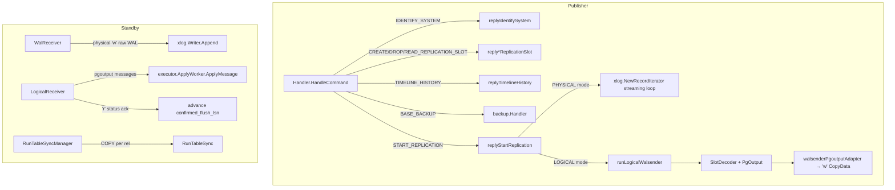
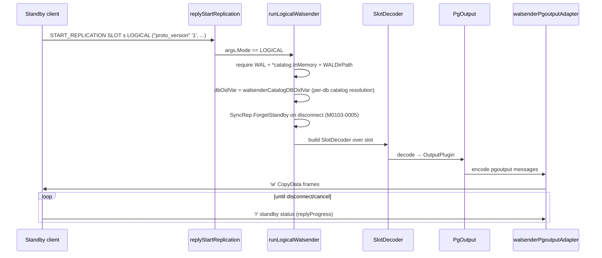
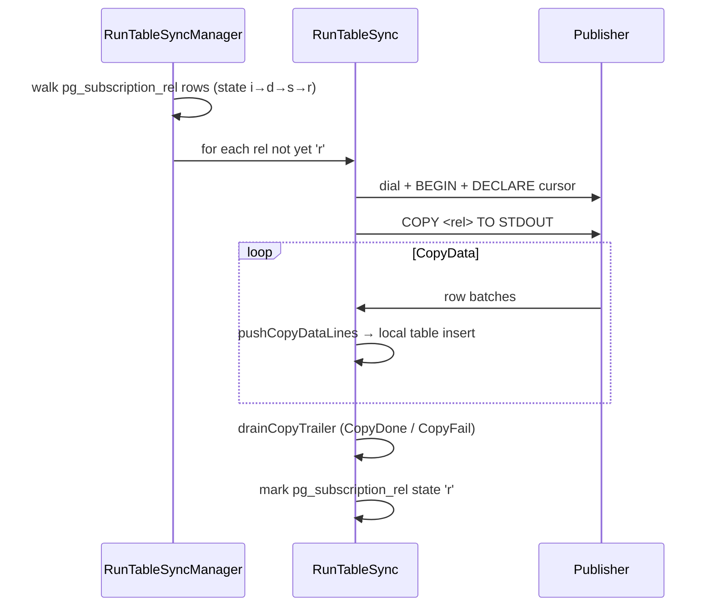

# Module: `internal/replication`

Streaming and logical replication, split publisher/subscriber like upstream PG's
`src/backend/replication/`. The primary side (walsender) dispatches replication
commands (`IDENTIFY_SYSTEM`, slot DDL, `START_REPLICATION`, `TIMELINE_HISTORY`,
`BASE_BACKUP`) and runs a physical WAL streaming loop plus a logical `pgoutput`
arm. The standby side (walreceiver, logicalreceiver) are pure-Go v3 wire clients
with reconnect loops. Logical replication adds subscriber-side initial COPY table
sync and a process-global apply launcher. Package total: **4,019 LOC** across 8
production files.

## Responsibilities

- Physical (streaming) WAL replication — primary sender + standby receiver.
- Logical replication (`pgoutput`) — publisher decode/encode + subscriber apply.
- Replication slots (`CREATE/DROP/READ_REPLICATION_SLOT`), `IDENTIFY_SYSTEM`,
  `TIMELINE_HISTORY`, `BASE_BACKUP` (routed to `internal/backup`).
- Table sync (`pg_subscription_rel` state machine `i→d→s→r`) and the apply
  launcher (one apply worker per enabled subscription).

## Key Files (by LOC)

| File                   | LOC | Role |
|------------------------|-----|------|
| `walsender.go`         | 1,135 | Primary-side command dispatcher (`Handler.HandleCommand` mirrors `exec_replication_command`) + physical streaming loop over `xlog.NewRecordIterator`. Slot DDL, `IDENTIFY_SYSTEM`, `TIMELINE_HISTORY`, `START_REPLICATION` arg/option parsing. |
| `walreceiver.go`       | 696   | Standby physical client: `DialWalReceiver`, handshake, `START_REPLICATION`, append raw WAL into `*xlog.Writer`; reconnect launcher `StartWalReceiver` with backoff; `primary_conninfo` parsing. |
| `logicalreceiver.go`   | 664   | Subscriber logical client: reconnect loop, `START_REPLICATION SLOT … LOGICAL` with `(proto_version, publication_names)` options, pgoutput decode → `executor.ApplyWorker`, LSN acking, `isPermanent` error classifier. |
| `logicalwalsender.go`  | 505   | Logical arm of `START_REPLICATION`: `SlotDecoder` + `PgOutput` → `'w'` CopyData frames via `walsenderPgoutputAdapter`; `publicationFilter` (publication name allow-list). |
| `applylauncher.go`     | 361   | Background reconcile loop (10 s poll / wake channel) spawning one apply worker per enabled `pg_subscription` row. |
| `tablesync.go`         | 328   | One publisher `COPY … TO STDOUT` exchange per relation: `RunTableSync`, `pushCopyDataLines`, `drainCopyTrailer`. |
| `tablesync_manager.go` | 236   | Per-subscription sweep of unsynced rels: `RunTableSyncManager` walks `pg_subscription_rel` rows not yet `'r'`. |
| `replication_util.go`  | 94    | `parseLSN`/`formatLSN`, error summaries. |

## Public API

Physical walsender (`walsender.go`):

```go
type Config struct{ Logger; Catalog catalog.Catalog; PubSub *catalog.PubSub;
    Slots *xlog.Slots; SyncRep *xlog.SyncRep; WalSenders *xlog.Senders;
    WAL *xlog.Writer; WALDirPath string; WALSegmentSize int64;
    SystemID string; Timeline uint32 }
type WriteQueryErrorFunc func(w *libpq.FrameWriter, code errcodes.Code, msg string,
    extra ...libpq.ErrorField) error
func NewHandler(cfg Config, werr WriteQueryErrorFunc, bb *backup.Handler) *Handler
func (s *Handler) HandleCommand(ctx, r, w, payload, appName, dbName) (bool, error)
// plus the reply methods: replyIdentifySystem, replyCreateReplicationSlot,
// replyDropReplicationSlot, replyReadReplicationSlot, replyTimelineHistory,
// replyStartReplication
```

Walreceiver (`walreceiver.go`):

```go
type WalReceiverConfig struct{ PrimaryAddr, User, SlotName string; StartLSN uint64;
    WAL *xlog.Writer; StatusInterval, DialTimeout time.Duration; /* … */ }
func DialWalReceiver(ctx, cfg) (*WalReceiver, error)
func (r *WalReceiver) Run(ctx) error
func (r *WalReceiver) ApplyLSN() uint64
func (r *WalReceiver) Close() error
func StartWalReceiver(ctx, done chan struct{}, cfg) error   // reconnect-with-backoff launcher
func parsePrimaryConninfo(s string) (WalReceiverConfig, error)
func checkSSLMode(mode string) error
```

Logical (`logicalreceiver.go`, `applylauncher.go`, `tablesync*.go`):

```go
func NewLogicalReceiver(cfg LogicalReceiverConfig) *LogicalReceiver
func (r *LogicalReceiver) Run(ctx) error
func (r *LogicalReceiver) ApplyLSN() uint64
func (r *LogicalReceiver) Close() error
func NewApplyLauncher(cfg ApplyLauncherConfig) *ApplyLauncher
func (l *ApplyLauncher) Run(ctx) error / Wake()
func (l *ApplyLauncher) ActiveSubscriptions() []catalog.Subscription
func DefaultLaunchApplyWorker(ctx, cfg, sub) error
func RunTableSync(cfg TableSyncConfig) (int64, error)
func RunTableSyncManager(ctx, TableSyncManagerConfig) ([]TableSyncResult, error)
```

## Internal structure

### Physical vs logical — the central split



The walsender `Handler` dispatches both arms: `replyStartReplication` branches on
`args.Mode` into the physical iterator loop (`xlog.NewRecordIterator`) or
`runLogicalWalsender`. The receivers are twins: `WalReceiver` appends raw WAL
into `*xlog.Writer`; `LogicalReceiver` decodes pgoutput into
`*executor.ApplyWorker`. Both reuse `libpq.DecodeReplicationMessage` /
`EncodeWALData` / `EncodeStandbyStatusUpdate`.

### Physical streaming loop (`walsender.go`)

`HandleCommand` peels replication verbs off before the normal SQL dispatcher sees
them. When the input does not match a known replication verb it returns
`(false, nil)` so the regular handler can take it — keeping utility commands like
`SHOW server_version` working for diagnostics on a replication connection.

`START_REPLICATION` argument/option parsing (`parseStartReplicationArgs`,
`parseStartReplicationOptions`, `splitReplicationSlotOptionsBlock`,
`splitStartReplicationOptionList`) accepts the upstream option block syntax
`(...)`, including LSN/kind keywords (`isLSNToken`). The streaming loop ships
raw WAL segments from `WALDirPath`, sized `WALSegmentSize` (default
`xlog.DefaultSegmentSize`).

### Logical walsender (`logicalwalsender.go`)



Key details:
- Requires `*catalog.InMemory` backing; `*catalog.PubSub` for publication
  membership.
- Every catalog lookup resolves through `catalog.NamespaceDBOid` — empty/unknown
  `dbName` maps to `DefaultDBOid` (`NamespaceDBOid(0)→1`).
- The catalog is snapshotted at session start so the pgoutput stream resolves
  relations against a stable shape.
- A real reg* name renderer is bound so TEXT-mode pgoutput emits a reg* column's
  NAME, not the numeric OID of BINARY mode.
- `publicationFilter` implements the publication-name allow-list
  (`buildPublicationFilter`, `splitPublicationNames`); `allowFlags`/
  `unionFlags` track which message kinds pass.
- Synthetic strictly-increasing LSNs feed non-WAL messages (e.g. relation
  metadata) so the ack protocol stays monotonic.

### Logical receiver (`logicalreceiver.go`)

`Run` is a reconnect loop: `runOnce` → `dial` (with `DialTimeout`) →
`handshake` (replication-mode startup, `application_name`) →
`startStreaming` (issues `START_REPLICATION SLOT <slot> LOGICAL
("proto_version" '1', "publication_names" 'p1,p2')`) → `streamFrames` →
`handleFrame`/`handleCopyData`. `isPermanent` classifies errors into permanent
(abort the loop) vs transient (retry with `nextBackoff` exponential backoff:
1 s → 30 s with jitter; clean EOF resets backoff). `sendStatus` reports
`applyLSN` for all three fields (write/flush/apply) so `SyncRep` releases at
`remote_apply`.

### Apply launcher (`applylauncher.go`)

`ApplyLauncher` is one process-global goroutine mirroring upstream's
`ApplyLauncherMain`. Every `PollInterval` (default 10 s) — or immediately on
`Wake()` — it rescans `pg_subscription` (`reconcile`) and spawns one worker per
enabled subscription that doesn't have one, via `LaunchFn` (tests inject a fake;
production uses `DefaultLaunchApplyWorker`). `runWorker` tracks the worker in
`workers map[string]*launchedWorker` (keyed by Subscription.Name); `stopAll`
cancels every in-flight worker and waits for exit. Worker restarts are owned by
the receiver's own reconnect loop, NOT the launcher — the launcher only ensures
a worker exists.

### Table sync (`tablesync.go` / `tablesync_manager.go`)



`RunTableSyncManager` sweeps `pg_subscription_rel` rows not yet in state `'r'`
and drives one `RunTableSync` COPY per relation. `errFromErrorResponse` converts
an ErrorResponse into a Go error with the SQLSTATE.

## Dependencies

- **Used by** `internal/postmaster` (wires `NewApplyLauncher`, `NewHandler`) and
  `cmd/goopg/standby.go` (`StartWalReceiver`). Direction is **postmaster →
  replication → backup**; replication must not import postmaster.
- **Uses** `internal/libpq`, `internal/catalog` (`PubSub`), `internal/executor`
  (`ApplyWorker`), `internal/access/transam/xlog` (`Writer`, `Slots`, `SyncRep`,
  `SlotDecoder`, `PgOutput`, `RecordIterator`, …), `internal/backup`,
  `internal/storage`, `internal/utils/misc` + `errcodes`.

## Notable patterns / gotchas

- **LSN off-by-one is load-bearing and repeated** — slot `RestartLSN =
  WrittenLSN()+1`; walreceiver reconnect sends `WrittenLSN()+1`; the logical
  adapter invents strictly-increasing synthetic LSNs. A wrong anchor → garbage
  rmid decode.

- **Raw vs decoded WAL** — the physical receiver detects a verbatim chunk
  (`EndLSN-StartLSN == len(bytes)`) and uses `AppendRaw`; otherwise re-encodes.

- **No TLS** — `sslmode=require/verify-*` rejected (`checkSSLMode`);
  `disable/allow/prefer` fall back to plaintext.

- **Status frames** — physical reports write=flush=received, apply via
  `ApplyLSNFunc`; logical reports `applyLSN` for all three so `SyncRep` releases
  at `remote_apply`.

- **Reconnect policy** — physical 500 ms → 30 s exponential; logical 1 s → 30 s
  with jitter; clean EOF resets backoff. `isPermanent` is a fragile
  string-match classifier that aborts the loop on unrecoverable errors.

- **dbOid threading** — every logical-walsender catalog lookup resolves through
  `catalog.NamespaceDBOid`; a wrong oid silently drops all DML. The
  `walsenderCatalogDBOidVar` closure exists precisely so empty/unknown `dbName`
  falls back deterministically.

- **Sibling-path twins** — encode↔decode pairs (`EncodeWALData` ↔
  `DecodeReplicationMessage`), sender twins (physical ↔ `runLogicalWalsender`),
  receiver twins (`WalReceiver` ↔ `LogicalReceiver`), and duplicated conninfo
  parsers (`parsePrimaryConninfo` / `parsePrimaryConninfoFull` vs
  `parseSubscriptionConninfo`) must all change together.

- **`START_REPLICATION` returns (false, nil) for non-replication verbs** — the
  fall-through contract keeps `SHOW server_version` and other diagnostics alive
  on a replication connection.

- **Application-name quorum discipline** — `SyncRep.ForgetStandby(appName)` on
  disconnect (both physical and logical) ensures a dead subscriber no longer
  counts toward the FIRST/ANY synchronous-quorum. Empty `appName` is harmless
  (never matches a rule).

- **Launcher restarts are delegated** — the apply launcher does NOT retry failed
  workers; the receiver's own reconnect loop owns retry policy (M0103-0003), so
  a worker error is logged and the launcher just spawns a fresh worker on the
  next reconcile.

- **Table-sync state machine is `pg_subscription_rel`-driven** — sync only
  advances to `'r'` after the COPY batch fully drains; a `CopyFail` leaves the
  relation in a retryable state for the next manager sweep.