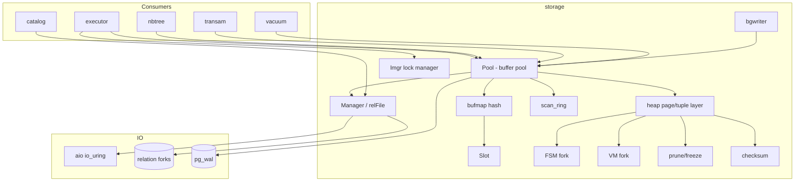
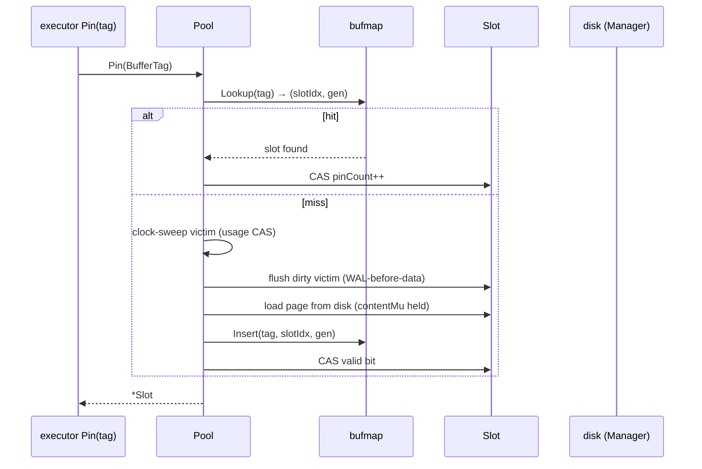
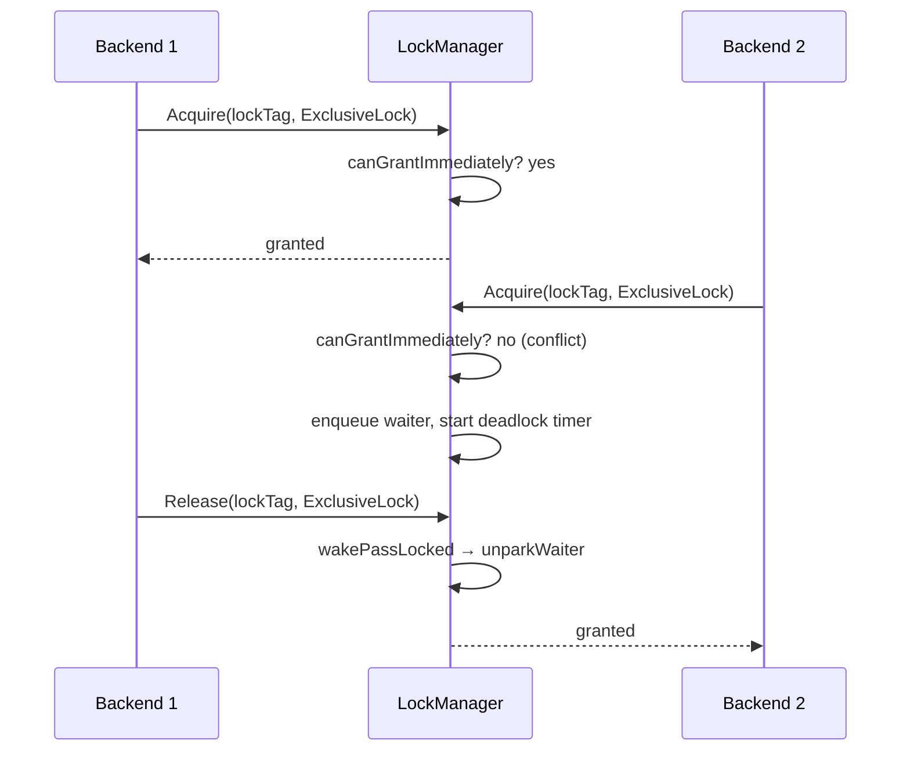
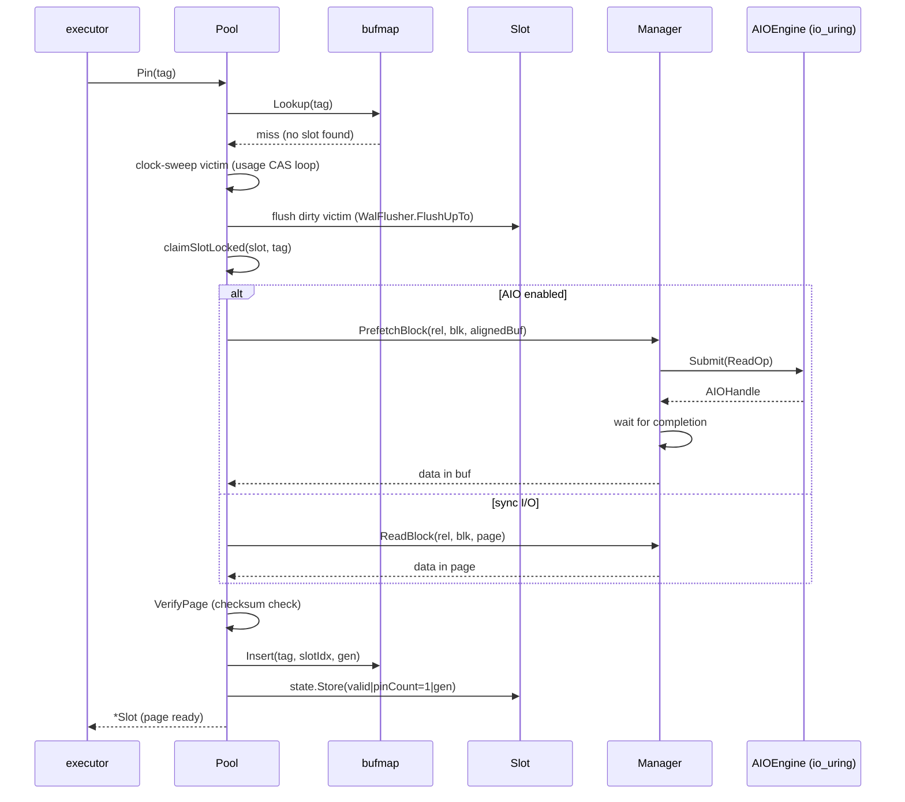
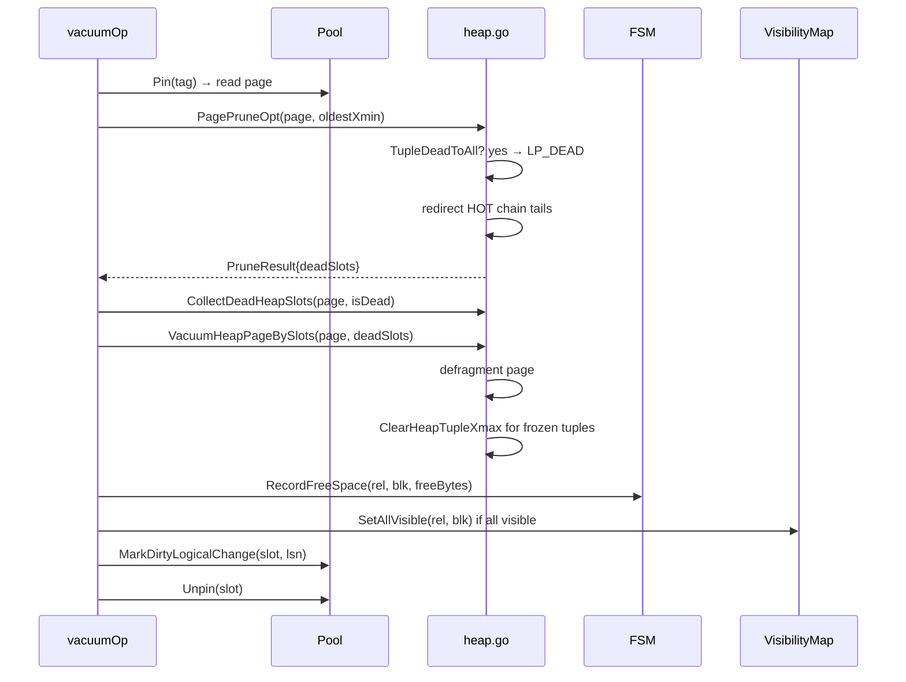
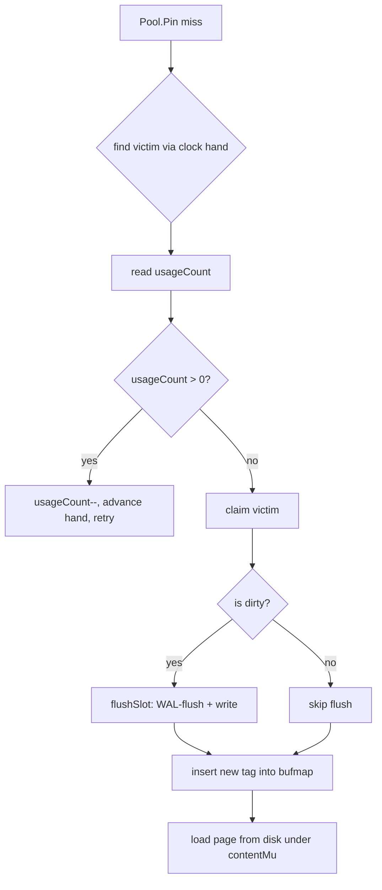

# Module: `internal/storage`

The buffer-manager + storage-manager layer — a faithful Go port of PostgreSQL's
`src/backend/storage/{buffer,smgr,page,lmgr}`. It owns the buffer pool
(lock-free 8 KiB page cache with clock-sweep eviction and WAL-before-data
flushing), the storage manager (one `os.File` per relation fork, with an
optional io_uring AIO seam), the PG-18 byte-identical heap page/tuple layer, the
visibility-map and free-space-map forks, and the lock manager (`lmgr`).



## Key Files

| File | LOC | Role |
|---|---|---|
| `bufpool.go` | 2,813 | `Pool`/`Slot`: lock-free pinning, clock-sweep eviction, `MarkDirty*` family, FPI emission, WAL flush barrier, flush batches, `Log*Func` WAL hooks |
| `heap.go` | 2,362 | Heap tuple marshal/parse, line-pointer ops, `PageAdd/Get/Remove*`, infomask mutators, HOT stamps, WAL-redo helpers (`PageApply*Redo`) |
| `smgr.go` | 1,030 | `Manager`/`relFile`: fork path resolution, read/write/extend/sync, checksums, AIO seam |
| `fsm_fork.go` | 490 | PG-format FSM fork persistence (256-category binary tree), `buildFSMTree`, `ReadFSMFork`, `WriteFSMFork`, `FSMLoadForks` |
| `bufmap.go` | 336 | Lock-free open-addressing tag→slot hash with tombstones + generation counters |
| `vm_fork.go` | 293 | VM fork persistence (`buildVMPage`, `ReadVMFork`, `VMSaveForks`) |
| `prune.go` | 284 | Page prune: `PagePruneOpt`, `PageVacuumPrune`, HOT redirects, LP_DEAD, dead-tuple sweep |
| `page.go` | 237 | `PageHeader` accessors (LSN, flags, free space), `RelFileNode`/`BufferTag`, `InitPage` |
| `vm.go` | 241 | Runtime visibility map: `AllVisible`, `AllFrozen`, `SetAllVisible`, `PageAllVisible`, `CountAllVisible` |
| `pageident_probe.go` | 213 | Page-identity probing (identify a page's contents after read) |
| `fsm.go` | 154 | In-memory FSM: `GetPageWithFreeSpace`, `GetCandidates`, `RecordFreeSpace` |
| `freeze.go` | 152 | Tuple freeze: `PageFreezeOldTuples`, `PageFreezeBySlots` |
| `checksum.go` | 136 | FNV-1a page checksum (`checksum_impl.h` port), `PageChecksum`, `VerifyPage` |
| `io_trace.go` | 119 | I/O tracing for benchmarks |
| `pdlsn_assert.go` | 118 | `GOOPG_PDLSN_ASSERT` runtime guard |
| `linepointer.go` | 110 | Line-pointer / item-ID arithmetic |
| `vm_redo.go` | 109 | VM fork WAL-redo (`VMPageSetBits`, `VMPageClearBits`, `VMBlockForHeapBlock`) |
| `scan_ring.go` | 99 | Bulk-read scan ring (sequential prefetch window) |
| `bgwriter.go` | 97 | Dirty-page background flusher |
| `writeback.go` / `writeback_linux.go` | 88/25 | Dirty-page writeback pacing (io_uring/`O_DIRECT` hints) |
| `arena.go` | 57 | 4 KiB-aligned allocation arena for slot pages |
| `command_id.go` | 23 | Command ID (`CommandId`) type |
| `lmgr/` | — | `lockmgr.go` (8-mode lock manager), `deadlock.go` (wait-for-graph), `fastpath.go`, `lockwait/` |

## Public API

### Buffer pool (`bufpool.go`)

```go
func NewPool(mgr *Manager, cfg PoolConfig) (*Pool, error)
func (p *Pool) Pin(tag BufferTag) (*Slot, error)
func (p *Pool) PinNew(rel RelFileNode) (*Slot, BlockNumber, error)
func (p *Pool) Unpin(s *Slot)
func (p *Pool) MarkDirty(s *Slot) / MarkDirtyWithLSN(...) / MarkDirtyLogicalChange(...)
func (p *Pool) FlushAll() error / FlushRel(rel) error
func (p *Pool) WriteDirtyPages(maxPages int) int
func (p *Pool) NBlocks(rel) (BlockNumber, error) / Exists(rel) bool / RelPath(rel) string
func (p *Pool) BufferCounters() (hit, read, dirtied, written int64)
func (p *Pool) WalCounters() (records, bytes int64)
func (p *Pool) LogChangeRecord(payload []byte) (LSN, error)
func (p *Pool) SetFullPageWrites(on bool) / FullPageWrites() bool
func (p *Pool) RedoRecPtr() uint64 / PublishRedoRecPtr(redo uint64)
func (p *Pool) PublishRedoBarrier(sample func() uint64) uint64
func (p *Pool) SetBtreeRecycleHorizon(fn) / BtreeRecycleHorizon() / Close()
func (p *Pool) EvictionCount() / ExtendCount() / AddReadTimeNanos(n) / AddWriteTimeNanos(n)
func (p *Pool) HasWALFrontier() bool
type WALFlusher interface { FlushUpTo(lsn uint64) error; WalRecords() int64; WalBytes() int64 }
```

WAL hooks (one per record type, defaulting to real `xlog.Writer` wiring at
runtime, no-ops in embedded/test catalogs):

```go
func (p *Pool) LogBtreeSplit() LogBtreeSplitFunc
func (p *Pool) LogPageImage() func(rel, blk, page) (LSN, error)
func (p *Pool) LogHeapInsert() LogHeapInsertFunc
func (p *Pool) LogBtreeInsert() LogBtreeInsertFunc
func (p *Pool) LogHeapDelete() LogHeapDeleteFunc
func (p *Pool) LogHeapLock() LogHeapLockFunc
func (p *Pool) LogHeapVacuum() LogHeapVacuumFunc
func (p *Pool) LogBtreeVacuum() LogBtreeVacuumFunc
func (p *Pool) LogBtreeUnlinkPage() LogBtreeUnlinkPageFunc
func (p *Pool) LogBtreeNewRoot() LogBtreeNewRootFunc
func (p *Pool) LogBtreeMarkPageHalfDead() LogBtreeMarkPageHalfDeadFunc
func (p *Pool) LogHeapFreeze() LogHeapFreezeFunc
func (p *Pool) LogHeapHotUpdate() LogHeapHotUpdateFunc
func (p *Pool) LogHeapUpdate() LogHeapUpdateFunc
func (p *Pool) LogHeapPruneOpt() LogHeapPruneOptFunc
```

### Storage manager (`smgr.go`)

```go
func NewManager(cfg ManagerConfig) *Manager
func (m *Manager) ReadBlock(rel, blk, buf) error
func (m *Manager) WriteBlock(rel, blk, buf) error
func (m *Manager) Extend(rel, buf) (BlockNumber, error)
func (m *Manager) ExtendBatch(rel, buf, n) (BlockNumber, error)
func (m *Manager) NBlocks(rel) (BlockNumber, error)
func (m *Manager) Sync(rel) / SyncAll() / DropRelation(rel) / CloseRelation(rel)
func (m *Manager) TruncateRelation(rel) / TruncateRelationTo(rel, n)
func (m *Manager) PrefetchBlock(rel, blk, buf) (AIOHandle, error)
func (m *Manager) WriteBlockAIO(rel, blk, buf) (AIOHandle, error)
func (m *Manager) SetAIO(eng AIOEngine)
func (m *Manager) RelPath(rel) string / DataDir() string
func (m *Manager) ReleaseForgotten() int
type AIOEngine interface { Submit(op AIOSubmitOp) AIOHandle }
```

### Heap/tuple (`heap.go`)

```go
func NewHeapTuple(xmin, xmax TransactionID, data []byte) HeapTuple
func NewHeapTupleWithNulls(xmin, xmax TransactionID, bitmap, data []byte) HeapTuple
func ParseHeapTuple(raw []byte) (HeapTuple, error)
func PageAddHeapTuple(p Page, t HeapTuple) (uint16, error)
func PageGetHeapTuple(p Page, slot uint16) (HeapTuple, error)
func PageGetHeapTupleInto(p Page, slot uint16, buf []byte) (HeapTuple, []byte, error)
func PageGetHeapTupleNoCopy(p Page, slot uint16) (HeapTuple, error)
func PageRemoveHeapTuple(p Page, slot uint16) error
func PageAddItemRaw(p Page, raw []byte) (uint16, error)
func PageInsertItemRawAt(p Page, slot uint16, raw []byte) (uint16, error)
func PageReplaceItemRaw(p Page, slot uint16, raw []byte) error
func PageSetHeapTupleXmax(p Page, slot uint16, xmax TransactionID) error
func PageSetHeapTupleXmaxCommitted(p Page, slot uint16) error
func PageSetHeapTupleCmax(p Page, slot uint16, cid CommandId, isCombo bool) error
func PageSetHeapTupleKeysUpdated(p Page, slot uint16) error
func PageSetHeapTupleCtid(p Page, slot uint16, ctid ItemPointer) error
func PageSetHeapTupleLockOnly(p Page, slot uint16, xmax TransactionID, lockStrength uint16) error
func PageSetHeapTupleXmaxMulti(p Page, slot uint16, multi TransactionID, ...) error
func PageStampHotOldTuple(p Page, oldSlot uint16, xmax, blk, newSlot) error
func PageStampUpdatedOldTuple(p Page, oldSlot uint16, xmax, blk, newSlot) error
func PageStampHotOldTupleMulti(p Page, oldSlot uint16, ...) error
func PageSetItemIDRedirect(p Page, slot uint16, targetSlot uint16) error
func PageGetItemID(p Page, slot uint16) (ItemID, error)
func PageGetItemRaw(p Page, slot uint16) ([]byte, error)
func PageGetHeapFreeSpace(p Page) int
func HeapInsertTargetFreeSpace(tupleLen, fillfactor int) int
func PageSetHeapTupleMovedPartition(p Page, slot uint16, xmax) error
func PageApplyHeapLockRedo(p Page, slot, xmax, infomaskBits, infomask2Bits, blk) error
func PageApplyHeapDeleteRedo(p Page, slot, xmax, infomaskBits, infomask2Bits, ...) error
func PageApplyHeapUpdateOldRedo(p Page, oldSlot, xmax, infomaskBits, infomask2Bits, ...) error
func VacuumHeapPage(p Page, isDead) (HeapPageVacuumStats, error)
func CollectDeadHeapSlots(p Page, isDead) ([]uint16, error)
func VacuumHeapPageBySlots(p Page, deadSlots []uint16) (HeapPageVacuumStats, error)
```

### Page / tuple basics (`page.go`)

```go
const BlockSize = 8192
const SizeOfPageHeaderData = 24
const InvalidBlockNumber BlockNumber = 0xFFFFFFFF
type LSN uint64
type RelFileNode struct{ DBOid, RelOid uint32; Fork ForkNumber }
type BufferTag struct{ ... }
type Page []byte
func Header(p Page) (PageHeader, error) / MustHeader(p Page) PageHeader
func InitPage(p Page) error / IsNew(p Page) bool
// PageHeader accessors: LSN()/SetLSN(), Checksum()/SetChecksum(),
// Flags(), Lower()/SetLower(), Upper()/SetUpper(), Special(),
// PagesizeVersion(), PruneXID(), FreeSpace()
```

### FSM (`fsm.go`, `fsm_fork.go`)

```go
func NewFSM() *FSM
func (f *FSM) GetPageWithFreeSpace(rel, minFreeBytes) (BlockNumber, bool)
func (f *FSM) GetCandidates(rel, minFreeBytes, n) []BlockNumber
func (f *FSM) RecordFreeSpace(rel, blk, freeBytes) / RecordFreeSpaceForPage(rel, blk, p)
func (f *FSM) DropRelation(rel)
func RelForkPath(dataDir string, rfn RelFileNode) string
func WriteFSMFork(path string, freeSpace []uint16) error
func ReadFSMFork(path string) ([]uint16, error)
func (f *FSM) FSMSaveForks(dataDir, prevKeys) error / FSMLoadForks(dataDir) error
```

### VM (`vm.go`, `vm_fork.go`, `vm_redo.go`)

```go
func NewVisibilityMap() *VisibilityMap
func (v *VisibilityMap) AllVisible(rel, blk) bool / AllFrozen(rel, blk) bool
func (v *VisibilityMap) SetAllVisible(rel, blk) / SetAllFrozen(rel, blk) / ClearBlock(rel, blk)
func (v *VisibilityMap) DropRelation(rel) / CountAllVisible(rel) int32
func PageAllVisible(p Page, horizon TransactionID) bool / PageAllFrozen(p, freezeBelow) bool
func WriteVMFork(path string, masks []uint8) error / ReadVMFork(path) ([]uint8, error)
func VMBlockForHeapBlock(heapBlk) BlockNumber
func VMPageSetBits(p Page, heapBlk, bits) (bool, error) / VMPageClearBits(p, heapBlk, bits) (bool, error)
```

### Prune / freeze (`prune.go`, `freeze.go`)

```go
func PagePruneOpt(p Page, oldestXmin TransactionID) (PruneResult, error)
func PageVacuumPrune(p Page, oldestXmin) (PruneResult, int, error)
func TupleDeadToAll(hdr, oldestXmin) bool
func PageFreezeOldTuples(p Page, freezeBelow) (PageFreezeStats, error)
func PageFreezeBySlots(p Page, frozenSlots []uint16) error
```

### Checksum (`checksum.go`)

```go
func PageChecksum(page []byte, blkno BlockNumber) uint16
func PageSetChecksumCopy(page []byte, blkno BlockNumber) []byte
func VerifyPage(page []byte, blkno BlockNumber) bool
```

### Lock manager (`lmgr/lockmgr.go`)

```go
func New() *LockManager
func (lm *LockManager) Acquire(ctx, b BackendID, t LockTag, m Mode) error
func (lm *LockManager) TryAcquire(b, t, m) error
func (lm *LockManager) AcquireWithTimeout(ctx, b, t, m, timeout) error
func (lm *LockManager) Release(b, t, m) / ReleaseAll(b)
func (lm *LockManager) Holders(t LockTag) map[BackendID]Mask
func (lm *LockManager) Waiters(t LockTag) []Waiter
func (lm *LockManager) AllLocks() []LockHolding
func (lm *LockManager) SetDeadlockTimeout(d)
func ParseMode(name string) (Mode, bool)
func ConflictsWith(m Mode, held Mask) bool
```

## Internal structure

### Buffer pool and slot state

`Pool` owns a 4 KiB-aligned `arena` carved into `BlockSize` slices aliased by
`Slot.page`. Each `Slot` packs `pinCount(22b) | usageCount(8b) | dirty | valid |
ioInflight | gen(15b)` into one atomic word (`statePin`, `stateUsage`,
`stateGen`, `stateValid`, `stateDirty`, `stateIO` accessors in bufpool.go:40–45)
— pin/unpin/usage CAS are fully lock-free. Tag→slot lookup goes through
`bufmap`, a lock-free open-addressing hash table with tombstone slots and
generation counters (ABA defense). The cache-miss path takes `pinMu`, claims a
victim via the clock hand, flushes dirty victims, then reads under `contentMu`.



- `Slot` carries `contentMu` for the page content (readers RLock, writers Lock),
  `pinCount` for pinning, `usageCount` for clock-sweep second chance.
- `evictedImageLSN` is stashed per tag on eviction (`stashEvictedImageLSN`/
  `takeEvictedImageLSN`/`dropEvictedImageLSN`) so the FPI watermark survives
  eviction.
- `slotEventRing` (64 entries) traces pin/unpin/dirty/evict events for
  `dumpSlotEvents` diagnostics.

### bufmap

`bufmap` is a lock-free open-addressing hash over `(key0, key1)` packed from the
tag, with linear probing, tombstone deletion, and a `compact()` pass to keep
probe chains short. `packVal`/`unpackVal` pack slot index + generation into one
64-bit value; ABA is defeated by the generation counter, which increments on
every slot reuse.

```mermaid
flowchart LR
    subgraph bufmap
        BUCKET[bufmapBucket: key0, key1, val]
        HASH[hash(tag) → bucket index]
        PROBE[linear probe chain]
        TOMB[tombstone on delete]
        COMPACT[compact() pass]
    end
    BUCKET --> HASH
    HASH --> PROBE
    PROBE --> TOMB
    TOMB --> COMPACT
```

### FPI / WAL-before-data

`needsImage(s)` decides whether a logged mutation needs a full-page image:
when the page's LSN is before `RedoRecPtr()` (the oldest LSN a checkpoint
could need), the image is emitted so replay has a self-contained page.
`SetFullPageWrites` toggles `full_page_writes`. `PublishRedoRecPtr`/
`PublishRedoBarrier` feed the FPI decision from the checkpointer.

### Heap page / tuple layout

- `SizeOfPageHeaderData = 24`: `pd_lsn` (8, split high-32 at offset 0 / low-32
  at 4), `pd_checksum` (2 at 8), `pd_flags` (2 at 10), `pd_lower` (2 at 12),
  `pd_upper` (2 at 14), `pd_special` (2 at 16), `pd_pagesize_version` (2 at 18),
  `pd_prune_xid` (4 at 20).
- Tuple header 23 bytes (`HeapTupleHeader`): `t_xmin`/`t_xmax`/`t_cid` (12),
  `t_ctid` (6), `t_infomask2` (2), `t_infomask` (2), `t_hoff` (1).
- `DefaultHeapTupleHoff = 24` (aligned), `MovedPartitionsOffsetNumber = 0xFFFD`,
  `IsMovedToAnotherPartition` marks a partitioned-table move.
- ItemID packing (`ItemID` in heap.go:561): `lp_off`(15b) | `lp_flags`(2b) |
  `lp_len`(15b) — the same bit layout as PG's `ItemIdData`.
- HOT chains: `HeapHotUpdated`/`HeapOnlyTuple` infomask2 bits; `PageSetItemIDRedirect`
  redirects the old line pointer to the HOT successor.

### FSM fork format

The PG `fsm_internals.h` binary tree: each leaf carries a 0–255 free-space
category (`fsmSpaceAvailToCat` maps bytes→category with a non-linear table),
and internal nodes hold `max(children)`. `buildFSMTree` assembles the fixed
geometry (256 categories × 32 B per page), written atomically
(temp+rename) and re-loaded at startup by `FSMLoadForks`.

### VM fork

2 bits per heap page (`ALL_VISIBLE` | `ALL_FROZEN`), 8 KiB heap page →
64 bits/byte, so `VMBlockForHeapBlock(heapBlk)` = `heapBlk/8192`. `vm_redo.go`
mutates the on-disk fork directly because recovery runs before `Runtime.VM` is
populated — redo has no in-memory VM to go through.

### Lock manager

`LockManager` holds a `lockState` per `LockTag` with a FIFO waiter queue and a
per-backend deadlock timer. 8 modes (`Mode`), each a bit in a `Mask`
(`ConflictsWith`). `fastpath.go` gives a lock-fastpath for common single-backend
re-acquisition. `deadlock.go` does wait-for-graph detection; `lockwait/`
implements the wait/cancel primitive. `AllLocks` exposes the full table for
pg_locks.



## Key flow: page read (buffer pool miss)



## Dependencies

- **Uses** `internal/access/transam/xlog`, `internal/port/runtimeshim`,
  `internal/utils/activity/stats`, `internal/utils/misc`; `lmgr` uses
  `lmgr/lockwait`.
- **Used by** ~148 files: `executor` (every DML/DDL operator), `access/nbtree`,
  `access/transam`, `access/amcheck`, `catalog`, `commands/vacuum`, `initdb`,
  `postmaster`. Storage does **not** import `aio` — it consumes it via the narrow
  `AIOEngine` interface.

## Notable patterns / gotchas

- **Clock-sweep eviction with second-chance** — dirty-victim flush happens
  *before* `bmDelete`, so a concurrent `Pin(oldTag)` can't race a fresh disk read.
- **WAL-before-data at write time** — `flushSlot` flushes WAL to
  `max(pd_lsn, hintFlushBarrier)` before every data write.
- **FPI storm suppression** — the FPI watermark lives on `Slot.nativeImageLSN`
  (not `pd_lsn`), and `evictedImageLSN` preserves it across eviction; without it
  a hot catalog page re-imaged 19k times in one run (97.5% of WAL).
- **PG byte-compat is load-bearing** — `SizeOfPageHeaderData=24`, `BlockSize=8192`,
  tuple header 23 B, `DefaultHeapTupleHoff=24`, LSN high-32 at offset 0 /
  low-32 at offset 4, FNV-1a checksum with `+1` so zero means "no checksum".
- **FSM fork format** — PG `fsm_internals.h` binary tree (256 categories × 32 B);
  written atomically (temp+rename), re-loaded at startup.
- **VM fork** — 2 bits/heap page (only ALL_VISIBLE is set), redo mutates the
  on-disk fork directly because recovery runs before `Runtime.VM` is populated.
- **`pd_lsn` completeness guard** — plain `MarkDirty` is report-only under
  `GOOPG_PDLSN_ASSERT=1`; every logged mutation must use a stamping variant
  (`MarkDirtyWithLSN`/`MarkDirtyLogicalChange`).
- **Sibling twins to keep in sync** — heap encode ↔ decode; FSM/VM runtime ↔
  fork persistence ↔ redo; `PagePruneOpt` ↔ `PageVacuumPrune`; sync I/O ↔ AIO.
- **`PageGetHeapTupleInto` for zero-copy** — the `Into` variant hands back a
  caller-owned buffer and returns the tuple plus the leftover bytes; consumers
  that retain a tuple across the next `Next()` must copy it out.
- **RelFileNode DBOid routing** — `sharedOrPerDBRelDir` sends `DBOid==0`
  (shared catalogs) to `global/`, other DBs to `base/<dbOid>/`; forks use
  `_fsm`/`_vm`/`_init`/`_main` suffixes (`RelForkPath`).
- **Truncation is fork-aware** — `TruncateRelationTo` truncates the main + FSM
  + VM forks together; the FSM/VM in-memory entries are dropped too
  (`FSM.DropRelation`, `VM.DropRelation`).
- **Writeback pacing** — `writeback_linux.go` uses io_uring/FADV hints to
  avoid dirty-page pile-up under sustained load; the `bgwriter` cooperates with
  the checkpointer's dirty-page budget.
- **Arena alignment** — slot pages come from a 4 KiB-aligned arena so `O_DIRECT`
  reads (which need aligned buffers) work without a bounce copy.
- **Slot state packing is load-bearing** — `pinCount(22b)`, `usageCount(8b)`,
  `gen(15b)`, plus `valid`/`dirty`/`ioInflight` bits pack into one 64-bit word.
  A shift or mask change corrupts the entire atomic state: `statePin`,
  `stateUsage`, `stateGen` accessors must match their `slot*Mask`/`slot*Shift`
  constants exactly.
- **bufmap compact() is O(nSlots)** — called when deletions exceed 25% of
  capacity. A concurrent Insert during compaction reads stale metadata; the
  compaction holds `bufmap.mu` but not the pool lock, so Insert must check
  whether the slot is still valid after the compaction cursors pass it.
- **LockManager 8 modes** — `AccessShareLock`, `RowShareLock`, `RowExclusiveLock`,
  `ShareUpdateExclusiveLock`, `ShareLock`, `ShareRowExclusiveLock`,
  `ExclusiveLock`, `AccessExclusiveLock`. `ConflictsWith(m, held)` checks
  whether `held` (a `Mask` of held modes) conflicts with requested mode `m`.
  The conflict matrix is PG's standard lock table; a wrong bit here produces
  spurious deadlocks or silent data races.

## Slot state packing details

The `Slot` struct uses a single `atomic.Uint64` for the state word. The bit
layout is:

```
bits 0-21:   pinCount (22 bits, max ~4M concurrent pins)
bits 22-29:  usageCount (8 bits, clock-sweep second-chance)
bits 30-31:  flags (valid, dirty, ioInflight — 3 bits)
bits 32-46:  generation (15 bits, ABA defense)
bits 47-63:  reserved
```

The `statePin`, `stateUsage`, `stateGen`, `stateValid`, `stateDirty`, and
`stateIO` accessors extract the relevant bits. `Pin()` CAS-increments
`pinCount`; `Unpin()` CAS-decrements and triggers the clock-sweep at zero.
`contentMu` is an `RWMutex` protecting the page content; readers share the
page via `RLock`/`RUnlock`, writers use `Lock`/`Unlock`.

## Pool configuration (`PoolConfig`)

```go
type PoolConfig struct {
    NBuffers     int   // total buffer slots (default 1024)
    WALFlusher   WALFlusher
    FullPageWrites *bool
    Tracer       *iotrace.Tracer
    Mgr          *Manager
    ArenaSize    int   // 4 KiB-aligned arena size (default 4 MiB)
    ClockSweepInterval int // eviction interval (default 100)
}
```

`NewPool` allocates the arena, initializes `bufmap`, and creates the
`Slot` array. The `WALFlusher` is the durable interface for flushing WAL
before data writes.

## Lock manager internals (`lmgr/lockmgr.go`)

`LockManager` owns a `map[LockTag]*lockState`. Each `lockState` has:

- `held map[BackendID]Mask` — the lock modes each backend currently holds.
- `waiters []Waiter` — FIFO queue of waiters, each with a `context.Context`
  and a `ch chan struct{}` for wakeup.
- `granted Mask` — the union of held modes (fast path for conflict check).

`canGrantImmediately` checks whether the requested mode conflicts with the
`granted` mask. If not, the backend is added to `held` and the mask is
updated. If yes, the backend is enqueued in `waiters` and its context's
`Done()` channel is selected on.

`Release` removes a held mode from `held` and calls `wakePassLocked` to
grant the next compatible waiter(s). `ReleaseAll` removes all held modes for
a backend.

`hasSimpleDeadlock` checks if the current backend already holds a lock that
would prevent the requested mode from being granted (simple deadlock
detection, matching PG's `CheckDeadlock`).

## Deadlock detection (`lmgr/deadlock.go`)

The deadlock detector builds a wait-for-graph from the lock manager's state
and runs cycle detection. `CheckDeadlocksNow()` runs one synchronous pass
(used deterministically by tests), while the timer path
(`runDeadlockCheckFor`) is the `time.AfterFunc` target scheduled by a parked
backend's `Acquire` when its deadlock timeout fires. When a cycle is found,
the firing (youngest) backend is aborted (40P01); soft cycles are resolved by
reordering wait queues instead.

`lockwait/` carries the `lock_timeout` budget through the wait primitives:
`WithTimeout(ctx, d)` attaches the budget, `Timeout(ctx)` reads it back, and
`ErrLockTimeout` is the sentinel error returned when the budget elapses.

## `fastpath.go`

The fastpath lets a weak relation-lock request (`EligibleForFastPath` — every
mode below `ShareUpdateExclusiveLock`) skip the lock manager entirely when no
strong lock is present on the tag's hash bucket. `NoConflictFastPath`
performs that check against a `fastPathStrongBuckets` (1024-entry) strong-lock
counter array (`strongCounts`), reconciled on every strong-lock grant/release
by `syncStrongLocked`. It is used only by the transient
acquire-then-release path, never for locks held to end-of-transaction.

## Buffer pool read/write timing

`AddReadTimeNanos`/`AddWriteTimeNanos` accumulate I/O timing for pg_stat_io
and EXPLAIN (BUFFERS). The counters are exposed via `BufferCounters()`.

## Background writer (`bgwriter.go`)

`Bgwriter` (`NewBgwriter(pool, delay, maxPages)`) is a goroutine that
periodically runs `WriteDirtyPages` to flush a batch of dirty pages — one tick
every `BgwriterDelay` (default 200 ms), at most `BgwriterMaxPages` pages per
tick. The bgwriter cooperates with the checkpointer: the checkpointer
flushes all dirty pages at checkpoint time; the bgwriter flushes continuously
to reduce the checkpoint burst.

## Page identity probe (`pageident_probe.go`)

`PageIdentityProbe` reads a page and identifies its contents by examining
the page header, the opaque area, and the first line pointer. This is used
by the `amcheck` verification functions and by the `pageident` tool for
diagnosing corrupt pages.

## Checksum algorithm (`checksum.go`)

`PageChecksum` implements the FNV-1a 16-bit hash over the page content,
with the checksum field itself zeroed during computation. The algorithm
matches PG's `checksum_impl.h` exactly:

```go
func PageChecksum(page []byte, blkno BlockNumber) uint16 {
    // port of PG's pg_checksum_page
    // uses FNV-1a with seed = blkno + 1 (so zero never appears)
}
```

`VerifyPage` recomputes the checksum and compares it to `pd_checksum`.
Checksums are only verified when `DataChecksumVersion == 1` in pg_control.

## FSM binary tree geometry (`fsm_fork.go`)

The FSM fork is a fixed binary tree:

- Each leaf node covers 1 heap page, with a 0-255 free-space category.
- Each internal node holds `max(left, right)`.
- The tree is stored in blocks of 32 B per node (256 categories).
- `buildFSMTree` constructs the tree from a `[]uint16` of free-space values.
- `GetPageWithFreeSpace` navigates the tree to find a leaf with enough space.

The `fsmSpaceAvailToCat` table maps byte counts to 0-255 categories:

```
0-31 bytes:     category 0
32-63 bytes:    category 1
64-127 bytes:   category 2
128-255 bytes:  category 3
256-511 bytes:  category 4
... geometrically up to ...
BlockSize:      category 255
```

## Key flow: VACUUM page prune



## Commit order and LSN stamping

The `flushSlot` path in the buffer pool ensures WAL-before-data:

1. `MarkDirtyWithLSN(slot, lsn)` records `max(lsn, slot.hintFlushBarrier)`
   as the flush threshold.
2. At write time (`evictVictim` or `FlushAll`), `flushSlot` calls
   `WALFlusher.FlushUpTo(threshold)`.
3. Once the WAL is flushed past the threshold, the data page is written
   to disk via `Manager.WriteBlock` or `WriteBlockAIO`.

The `pd_lsn` on the page is set to the mutation's WAL LSN. On recovery,
replay checks `pd_lsn` against the record's LSN to skip already-applied
records (`GOOPG_PDLSN_ASSERT` validates this invariant).

## Buffer pool eviction details

The clock-sweep eviction algorithm:



The clock hand is a `uint32` index into the slot array. `EvictionCount`
tracks how many times a victim was claimed. The `usageCount` gives every
recently-pinned page a second chance before eviction, preventing thrashing
under scan workloads.

The eviction path takes `pinMu` (a mutex) to serialize victim selection,
then `contentMu` on the victim slot for the disk read. The `bufmap`
insert/delete happens under the same lock, so a concurrent `Pin` for the
same tag either sees the old mapping (and re-pins) or the new one.

## Fork I/O and O_DIRECT

`ManagerConfig` controls whether the storage manager uses `O_DIRECT`:

```go
type ManagerConfig struct {
    DataDir        string
    Checksums      bool   // verify checksums on read
    ODirect        bool   // use O_DIRECT (requires aligned buffers)
    AIO            bool   // enable the io_uring AIO seam
    // ...
}
```

When `ODirect=true`, every read/write uses the 4 KiB-aligned arena pages
directly — no bounce copy. When `AIO=true`, reads/writes are submitted to
the io_uring engine and awaited via `AIOHandle`.

`PrefetchBlock` returns an `AIOHandle` that the caller polls; `WriteBlockAIO`
does the same for writes. `ReleaseForgotten` reclaims handles whose
completion was never awaited.

## `smgr` fork path resolution

`RelForkPath(dataDir, rfn)` resolves a relation fork to its on-disk path:

| Fork | Suffix |
|---|---:|
| `MainFork` | `.rel` (the file itself) |
| `FSMFork` | `_fsm` |
| `VisibilityMapFork` | `_vm` |
| `InitFork` | `_init` |

The directory is `base/<dbOid>/` for per-database relations or `global/`
for shared catalogs (DBOid == 0). The filename is the relfilenode OID with
the fork suffix.

`TruncateRelationTo(rel, nBlocks)` truncates the main fork to `nBlocks`
and the FSM/VM forks to the corresponding block counts.

## Heap page layout constants

The heap page header (`PageHeader`) field offsets:

| Offset | Field | Size |
|---|---:|---:|
| 0 | `pd_lsn` (high 32 bits) | 4 |
| 4 | `pd_lsn` (low 32 bits) | 4 |
| 8 | `pd_checksum` | 2 |
| 10 | `pd_flags` | 2 |
| 12 | `pd_lower` | 2 |
| 14 | `pd_upper` | 2 |
| 16 | `pd_special` | 2 |
| 18 | `pd_pagesize_version` | 2 |
| 20 | `pd_prune_xid` | 4 |

`pd_flags` bits: `PD_HAS_FREE_LINES` (0x0001), `PD_PAGE_FULL` (0x0002),
`PD_ALL_VISIBLE` (0x0004), `PD_VALID_FLAG_BITS` (0x0007).

The tuple header (`HeapTupleHeader`, 23 bytes):

| Offset | Field | Size |
|---|---:|---:|
| 0 | `t_xmin` | 4 |
| 4 | `t_xmax` | 4 |
| 8 | `t_cid` | 4 |
| 12 | `t_ctid` | 6 |
| 18 | `t_infomask2` | 2 |
| 20 | `t_infomask` | 2 |
| 22 | `t_hoff` | 1 |

`t_infomask` bits include `HeapXminCommitted` (0x0100), `HeapXminInvalid`
(0x0200), `HeapXmaxInvalid` (0x0800), `HeapXmaxCommitted` (0x0400),
`HeapHasNull` (0x0001), `HeapHasVarWidth` (0x0002), `HeapHasExternal` (0x0004),
`HeapXmaxIsMulti` (0x1000), `HeapXmaxLockOnly` (0x0080),
`HeapXmaxKeyShrLock` (0x0010), `HeapXmaxExclLock` (0x0040), `HeapComboCID`
(0x0020). **Note: goopg's `HeapXmaxCommitted` (0x0400) and `HeapXmaxInvalid`
(0x0800) are SWAPPED relative to PG's `HEAP_XMAX_COMMITTED` (0x0800) /
`HEAP_XMAX_INVALID` (0x0400)** — this is a deliberate choice (the comments
say "Mirrors PostgreSQL's" but the hex values are reversed). The swap is
consistent throughout the codebase, so goopg-authored pages are self-consistent,
but a PG reader reading a goopg page directly would misinterpret the xmax
status bits. The WAL redo path uses goopg's own constants, not PG's.

`t_infomask2` bits include `HeapHotUpdated` (0x4000), `HeapOnlyTuple` (0x8000),
`HeapKeysUpdated` (0x2000). `HeapNattsMask` (0x07FF) masks the number of
attributes from the low 11 bits.

## Page checksum interplay with hint bits

A page checksum covers the whole 8 KiB. Setting a hint bit (e.g.
`HEAP_XMIN_COMMITTED`) without bumping `pd_lsn` would make the checksum
stale, so hint-bit writes use `MarkDirtyLogicalChange` which records a
logical (non-physical) change and does NOT require a WAL record — the
checksum is recomputed by the writeback path. `pd_lsn` is not bumped for
hint-bit-only changes (matching PG's `MarkBufferDirtyHint`).

## VM fork bit semantics

`vm.go` provides the runtime visibility map:

```go
const (
    VISIBLE_MASK  uint8 = 1 << 0 // ALL_VISIBLE
    FROZEN_MASK   uint8 = 1 << 1 // ALL_FROZEN
)
```

`SetAllVisible(rel, blk)` sets the ALL_VISIBLE bit (and, if the page is also
all-frozen, the ALL_FROZEN bit). `PageAllVisible(p, horizon)` is the page-level
check used by VACUUM to decide whether to set the bit. `CountAllVisible(rel)`
returns the number of all-visible pages (for pg_class.relallvisible).

`vm_redo.go`'s `VMPageSetBits`/`VMPageClearBits` operate on the on-disk VM
fork page directly (recovery has no in-memory VM).

## pg_locks and AllLocks

`AllLocks()` returns `[]LockHolding` for pg_locks:

```go
type LockHolding struct {
    Database OID
    Relation OID
    Page     uint32
    Tuple    uint16
    VirtualXID uint32
    Mode     Mode
    Granted  bool
    PID      int32
    // ...
}
```

The lock manager's `Holders(t)`/`Waiters(t)` are the per-tag views. The
executor builds the pg_locks virtual rows from `AllLocks()`.

## Storage used-by and layering

Storage is a lower-layer dependency used by nearly everything, but it must
NOT import executor/optimizer/catalog. The reverse direction (those packages
import storage) is the rule. The `lmgr` subpackage is further isolated:
it uses only `lockwait` internally and never imports the buffer pool.

The injected function hooks (`SetRelationSizer`, `RelAllVisibleFunc`, etc.)
are declared in catalog but implemented via `SetRelationSizer`-style setters
so catalog can hand the buffer pool a function pointer without an import
cycle.