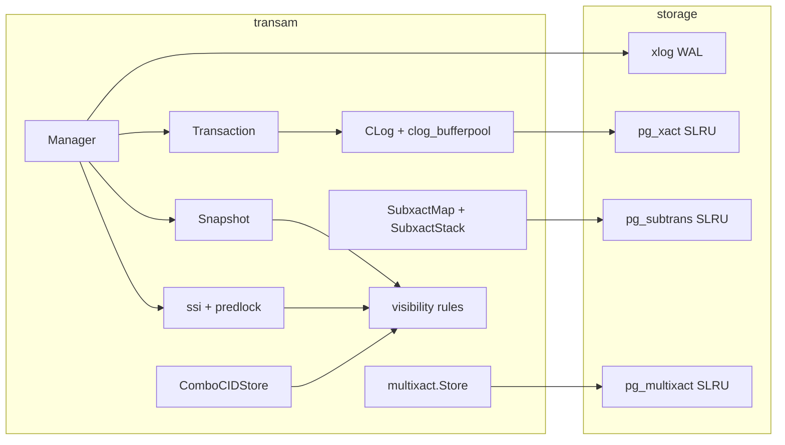
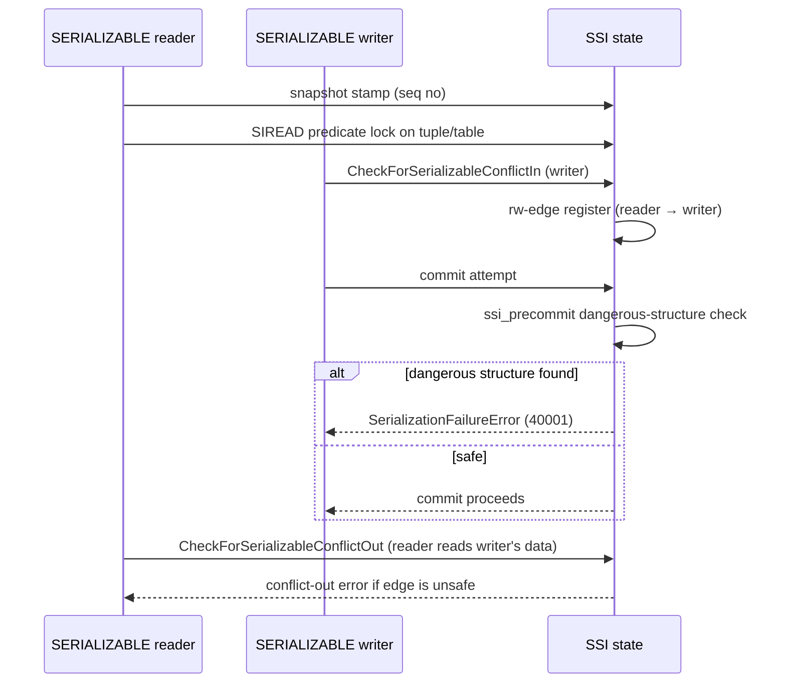

# Module: `internal/access/transam`

The **transaction manager** — MVCC snapshots, transaction-commit log (clog),
sub-transactions, multixact tuple locks, and Serializable Snapshot Isolation
(SSI). It is the Go analogue of PG's `src/backend/access/transam/`
(`clog.c`, `subtrans.c`, `multixact.c`, `predicate.c`, `procarray.c`,
`snapshot.c`, `xact.c`).

The package is where a transaction's XID is assigned, its commit/abort is
recorded durably in clog, and its visibility is computed for every tuple read.
`internal/executor` drives the SQL-level transaction verbs (`BEGIN`/`COMMIT`/
`ROLLBACK`/savepoints) through the `Manager` interface; the WAL layer emits and
replays `XACT_COMMIT`/`XACT_ABORT` records through the same manager.



## Key Files

| File | LOC | Role |
|---|---|---|
| `manager.go` | 1,401 | `Manager`/`Transaction`: XID allocation, snapshot capture/rotation, commit/abort, sub-xid allocation, waiting on other XIDs, `OldestXmin` computation, proc-array-like active-XID tracking, XID classification |
| `clog.go` | 885 | The commit log (`pg_xact`): per-XID 2-bit commit/abort status, async commit batching, `EnablePGSLRUMirror`, `TruncateCLOG` |
| `clog_bufferpool.go` | 511 | The clog SLRU buffer pool (in-memory page cache over the on-disk `pg_xact/` segments) |
| `clog_statuscache.go` | 114 | Per-XID status cache (committed/aborted/in-progress) |
| `ssi_conflict.go` | 819 | SSI conflict detection: `CheckForSerializableConflictOut`, `CheckForSerializableConflictIn`, rw-antidependency edge registration, conflict-out/conflict-in reporting |
| `subxact_visibility.go` | 595 | Visibility that walks parent XIDs: `SubxactMap`, `SeesCommittedXIDWithSubxacts`, `TupleVisibleSubxact`, `IsSelfXID` |
| `predlock.go` | 586 | Predicate-lock substrate (hash-bucket SIREAD locks) |
| `ssi.go` | 489 | SSI state machine: `SerializableXact`, `ssiState`, `registerSerializableLocked`, `stampSerializableSnapshotSeqNo`, `waitForSafeSnapshot` |
| `snapshot.go` | 323 | `Snapshot` struct (xmin/xmax/active-xid lists) + capture + `IsolationLevel` enum |
| `subxact_slru.go` | 309 | The `pg_subtrans` SLRU (durable sub-xid → parent-xid map) |
| `ssi_precommit.go` | 258 | Pre-commit dangerous-structure detection, `SerializationFailureError`, `IsSerializationFailure` |
| `subxact.go` | 223 | Sub-transaction state: `SubTxnId`, `SubTransactionState`, `SubxactStack` (push/release/rollback-to/abort-all) |
| `visibility.go` | 190 | The core `TupleVisible` — xmin/xmax against snapshot, hint-bit fast paths |
| `combocid.go` | 145 | Command-id / combo-cid (cmin/cmax) tracking |
| `procarray.go` | 62 | Active-snapshot/active-XID array for cross-backend visibility |
| `xidgen.go` | 39 | XID counter and wrap-around management |
| `partition_detach_epoch.go` | 38 | Snapshot epoch counter for concurrent `DETACH PARTITION CONCURRENTLY` |
| `multixact/` | — | `multixact.go` (in-memory sets + membership/status), `store.go` (durable `pg_multixact/{offsets,members}` SLRU, `NewStore`/`NewStoreAt`) |
| `control/` | — | pg_control decode/encode (`pgcontrol.go`, `control.go`): DB state, checkpoint LSN, nextXID/nextOid, TLI |

## Public API

```go
func NewManager() *Manager
func (m *Manager) Begin(iso IsolationLevel, procNums ...int32) (Transaction, error)
func (m *Manager) AssignXID(tx Transaction) (storage.TransactionID, error)  // materialize XID lazily
func (t *Transaction) FreshSnapshot() Snapshot     // per-statement snapshot
func (m *Manager) SnapshotFor(tx Transaction) (Snapshot, error)
func (m *Manager) Commit(tx Transaction) error / CommitAsync(tx) error / Rollback(tx) error
func (m *Manager) AllocateSubXid(parentXid) (storage.TransactionID, error)
func (m *Manager) WaitForXID(ctx, xid) error
func (m *Manager) WaitForOlderSlotsToCommit(ctx, selfHandle) error
func (m *Manager) WaitForPinnedSnapshotsToCommit(ctx, selfHandle) error
func (m *Manager) OldestXmin() storage.TransactionID / OldestXminForProc(procNum)
func (m *Manager) NextXID() storage.TransactionID / SetNextXID(xid)
func (m *Manager) ReplayXactCommit(xid) / ReplayXactAbort(xid)   // WAL recovery
func (m *Manager) IsXIDActive(xid) bool / HasAbortedXID(xid) bool
func (m *Manager) ClassifyXID(xid) XidVisibilityStatus
func (m *Manager) AcquireConnSlot() (int32, error) / ReleaseConnSlot(procNum)
func (m *Manager) DetachToDedicatedSlot(tx) (Transaction, error)
func (m *Manager) SetOnTxnEnd(fn func(xid)) / SetXactMarkerLogger(fn)
func (m *Manager) SetCLog(c *CLog) / HasCLog() bool
func (m *Manager) SetCatalogXminSource(fn func() uint64)
func (m *Manager) SetRelcacheInvalPending() / TakeRelcacheInvalPending() bool

// Snapshot
type IsolationLevel int // READ_COMMITTED, REPEATABLE_READ, SERIALIZABLE
func ParseIsolationLevel(v string) (IsolationLevel, error)
type Snapshot struct{ ... }
func (s Snapshot) Clone() Snapshot / WithCLog(c *CLog) Snapshot
func (s Snapshot) HasInProgress(xid) bool / HasAborted(xid) bool
func (s Snapshot) XidIsConcurrent(xid) bool
func (s Snapshot) SeesCommittedXID(xid) bool / SeesCommittedXIDHinted(xid) bool

// CLog
func OpenCLog(path string) (*CLog, error)
func (c *CLog) DidCommit(xid, parentOf) bool
func (c *CLog) GetStatus(xid) TxnStatus
func (c *CLog) SetCommitted(xid) error / SetCommittedWithLSN(xid, lsn) error
func (c *CLog) SetAborted(xid) error / SetSubCommitted(xid) error
func (c *CLog) InitializeAsCommitted(highXID) error
func (c *CLog) MarkUnknownAsAborted(highXID) error
func (c *CLog) TruncateCLOG(oldestXid) error
func (c *CLog) EnablePGSLRUMirror(dir) error / SetFlushWALHook(fn) / SetFsyncDisabled(b)
func (c *CLog) HighestKnownXID() / OldestClogXid() / AdvanceOldestClogXid(xid)
func (c *CLog) FlushAll() error

// Multixact
func NewStore() *Store / NewStoreAt(next MultiXactId) *Store
func (s *Store) Members(mxid) ([]Member, bool)
func (s *Store) Create(m1, m2 Member) (MultiXactId, error)
func (s *Store) CreateFromMembers(members []Member) (MultiXactId, error)
func (s *Store) Expand(mxid, add, live) (MultiXactId, error)
func StatusesConflict(held, req Status) bool
func MembersConflict(members, reqXid, req, isCurrent) bool
func GetUpdateXid(members) (storage.TransactionID, bool)
func HintBits(members) (infomask, infomask2 uint16)

// Subxact
func (s *SubxactStack) Push(name, snap) *SubTransactionState
func (s *SubxactStack) Release(name) ([]*SubTransactionState, error)
func (s *SubxactStack) RollbackTo(name, newSnap) ([]*SubTransactionState, *SubTransactionState, error)
func (s *SubxactStack) AbortAll() []*SubTransactionState
func (m *SubxactMap) Register(subxid, parentXid) / MarkAborted(subxid)
func (m *SubxactMap) Parent(subxid) storage.TransactionID / TopLevelXid(xid)
func (m *SubxactMap) IsAborted(subxid) bool / IsSubxact(xid) bool
func (m *SubxactMap) RestoreFromSLRU() (int, error) / Truncate(oldestXact) error

// SSI
func (m *Manager) CheckForSerializableConflictOut(readerHandle, writerXID) bool
func (m *Manager) CheckForSerializableConflictIn(writerHandle, tag) bool
func (m *Manager) CheckTableForSerializableConflictIn(writerHandle, db, rel) bool
func (m *Manager) RegisterRWConflict(...) / HasRWConflict(from, to) bool
func (m *Manager) SerializableXactCount() int / SerializableXact(handle) *SerializableXact
func (m *Manager) MarkSerializableModes(handle, readOnly, deferrable)
func (m *Manager) waitForSafeSnapshot(handle)
func IsSerializationFailure(err error) bool

// Visibility
func TupleVisible(h storage.HeapTupleHeader, snap Snapshot, currentXID, curcid, combo, mxs) bool
func TupleVisibleSubxact(h, snap, currentXID, r SubxactResolver, curcid, combo, mxs) bool
func SeesCommittedXIDWithSubxacts(snap, xid, r) bool
func IsSelfXID(xid, currentXID, r) bool
```

## Internal structure

### XID lifecycle

`Manager.Begin` creates a `Transaction` with no XID; `AssignXID` materializes
one only at first write (read-only transactions never take an XID — the M0093
read-only commit fast path). `NextXID`/`SetNextXID` are seeded from pg_control
at startup and advanced by WAL replay. `xidgen.go` handles wrap-around.

### Snapshot

`FreshSnapshot`/`SnapshotFor` capture `{xmin, xmax, activeXIDs[]}` from the
proc array; the read-committed per-statement refresh vs RR/Serializable pinned
snapshot is decided here. `Snapshot` carries a `CmdID`/`Curcid` field and the
isolation level, plus a `Seen` cache of resolved XIDs. The `SeesCommittedXID`
family consults the clog; `XidIsConcurrent` checks the active list.

### Clog

A 2-bit status per XID across 32 pages/segment; the buffer pool caches pages,
with an async-commit LSN watermark so `CommitAsync` can defer the durable
write. `TransactionIdDidCommit/Abort` are the visibility backend.
`EnablePGSLRUMirror` writes PG-format SLRU segments (page 32×256 entries);
`TruncateCLOG` reclaims segments past `oldestXid` and resets the truncate
logger. `InitializeAsCommitted`/`MarkUnknownAsAborted` are the recovery-time
seeding functions.

### Sub-transactions

`SubxactStack` manages the savepoint stack (push/release/rollback-to).
`SubxactMap` is the durable sub-xid → parent-xid map persisted to the
`pg_subtrans` SLRU (`subxact_slru.go`); `RestoreFromSLRU` loads it at startup
and `Truncate` reclaims old entries. Beyond a threshold (`SubXactArraySize`),
sub-xids overflow and visibility must fall back to parent-XID checks
(`subxact_visibility.go`).

### Multixact

A MultiXactId is an array of locker XIDs; `store.go` persists
`{offsets, members}` to SLRU so a multi-xmax on disk survives restart.
`NewStoreAt` seeds from pg_control's `nextMulti`. Member statuses encode
lock strength (FOR UPDATE / FOR SHARE / KEY SHARE / NO KEY UPDATE / UPDATE /
DELETE); `StatusesConflict` and `MembersConflict` implement the compatibility
matrix; `HintBits` derives the tuple's infomask hint bits from the members.

### SSI

Predicate locks (hash-bucket + tuple-grain SIREAD), rw-antidependency edges
between in-flight transactions, and pre-commit conflict detection produce
40001 serialization failures on dangerous structures.



`ssi.go` manages the `SerializableXact` registry and `stampSerializableSnapshotSeqNo`
(compare-serializable semantics); `ssi_conflict.go` implements
conflict-out/conflict-in; `ssi_precommit.go` runs the dangerous-structure
detection at COMMIT.

### Visibility rules

`visibility.go` computes, for a tuple header and a snapshot, whether the row is
visible. The fast paths:

1. **Hint-bit fast path** — if `xmin` committed (or bootstrap XID 1) and `xmax`
   invalid, visible.
2. **Self/other current XID** — `xmin == currentXID` and `curcid`/combo-cid
   ordering decide visibility for the current transaction's own writes.
3. **Subxact resolution** — `TupleVisibleSubxact` walks parent XIDs via the
   `SubxactResolver`.
4. **Multixact** — a multi-xmax splits into member XIDs; visibility is
   per-member (any aborted member with an update → the update is not visible).

## Dependencies

- **Used by** — `internal/executor` (every DML/DDL path: snapshot lookup,
  xid stamping, commit/rollback), `internal/storage` (HOT-chain visibility),
  `internal/initdb` (recovery, pg_control), `internal/access/nbtree`
  (visibility during index scans), `internal/postmaster` (transaction verbs).
- **Uses** — `internal/storage` (pages, WAL redone), `internal/access/transam/xlog`
  (WAL emission/replay of commit records), `internal/utils/activity`,
  `internal/utils/misc`, `internal/port/runtimeshim`.

## Notable patterns / gotchas

- **XID wraparound** — XID comparison uses signed arithmetic (`xid - y < 0`
  means "older"), never bare `<`; wrap-around guards (`xidWarnAge`/`xidStopAge`)
  must not be "simplified".
- **Lazy XID** — a read-only transaction has no XID until it writes; every
  "who is the writer" site must tolerate `InvalidTransactionID`.
- **Clog fault-in** — the buffer pool zero-fills a missing/short `pg_xact`
  segment on read (a real PG's `SimpleLruReadPage` hard-errors); used by
  recovery and by a goopg-owned cluster restart.
- **Async commit** — `CommitAsync` returns before the clog segment is durable;
  the LSN watermark + wal-writer flush close the window, and `ReplayXactCommit`
  reconstructs the commit from WAL.
- **Sub-xid overflow** — beyond a threshold (`SubXactArraySize`), sub-xids
  overflow and visibility must fall back to parent-XID checks
  (`subxact_visibility.go`).
- **SSI rw-antidependency discipline** — a tuple read in SERIALIZABLE that a
  concurrent writer later commits against forms an rw-edge; forgetting the
  conflict-out produces a write skew that PG detects (`ssi_precommit.go`).
- **`SeesCommittedXID` vs `SeesCommittedXIDHinted`** — the hinted variant
  trusts tuple hint bits without a clog probe; using it when the hint is stale
  yields a spurious invisibility. Only safe after VACUUM/`SetHintBits` has
  made the hint authoritative.
- **Pinned snapshots** — `WaitForPinnedSnapshotsToCommit`/`WaitForPinnedSnapshotsReleased`
  enforce the rule that a snapshot is pinned for the duration of a statement;
  forgetting to pin lets a concurrent VACUUM recycle a tuple still referenced
  by an in-flight snapshot (`HeapTupleSatisfiesMVCC` equivalent).
- **Clog batching** — `SetCommittedWithLSN` records the commit LSN alongside
  the status so `CommitAsync` can defer the durable clog write to the
  wal-writer's flush point; `SetFlushWALHook` wires the flush barrier.
- **`DetachToDedicatedSlot`** — a transaction performing a long operation
  (e.g., VACUUM) detaches to a dedicated conn slot so it doesn't block other
  backends' slot allocation; the detached handle keeps its XID and snapshot.
- **`ClassifyXID`** — returns a `XidVisibilityStatus` (in-progress/committed/
  aborted/subcommitted/subaborted) used by the executor to decide tuple
  visibility without a full `TupleVisible` walk; it must stay in sync with
  `TupleVisible`'s own status determination.
- **ComboCID** — `ComboCIDStore` collapses (cmin, cmax) pairs so a tuple's
  xmax and cmin/cmax fit in the shared `t_cid` field; forgetting to reset the
  store across statements leaks combo IDs (`ResetComboCIDStore`).