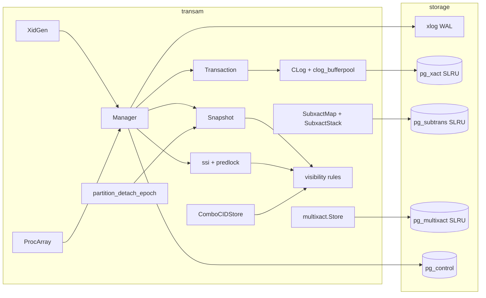
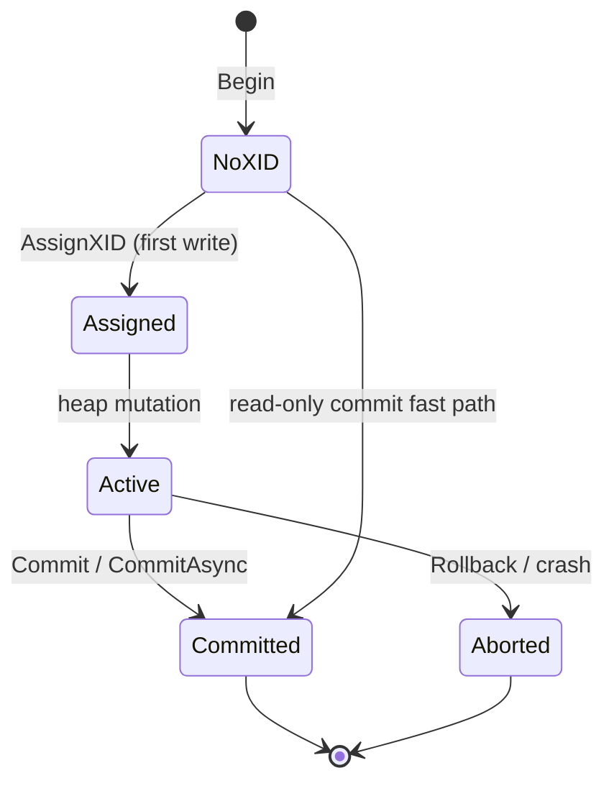
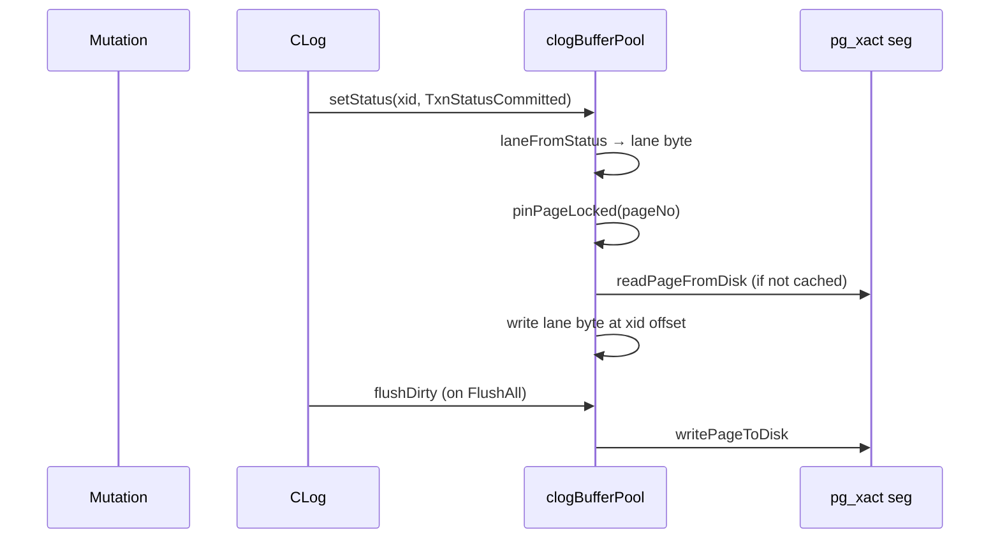
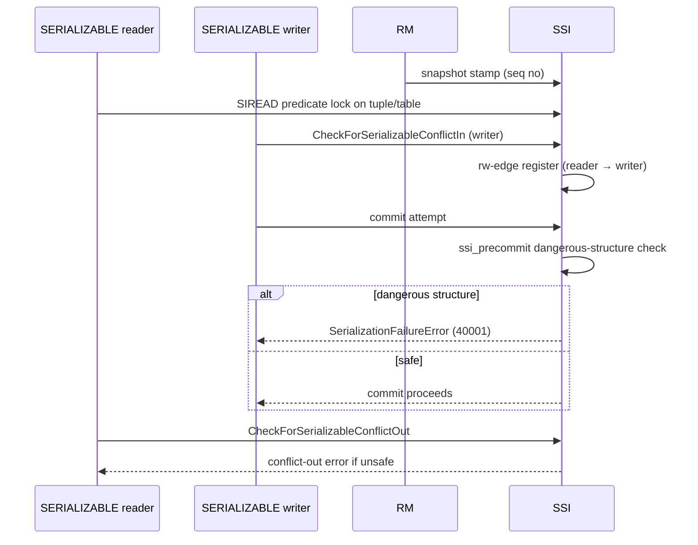
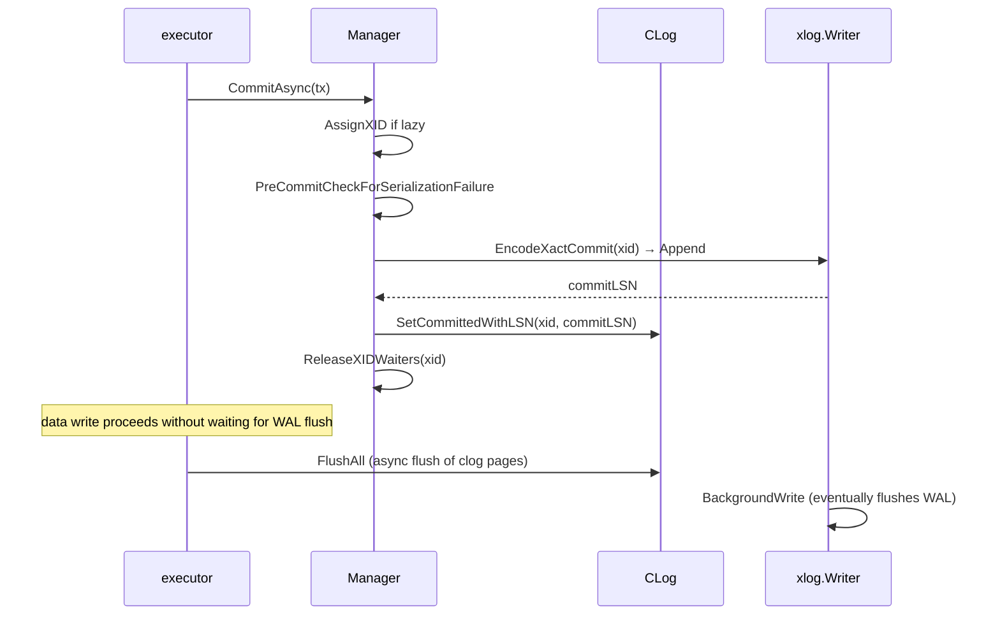

# Module: `internal/access/transam`

The **transaction manager** — MVCC snapshots, transaction-commit log (clog),
sub-transactions, multixact tuple locks, and Serializable Snapshot Isolation
(SSI). It is the Go analogue of PG's `src/backend/access/transam/`
(`clog.c`, `subtrans.c`, `multixact.c`, `predicate.c`, `procarray.c`,
`snapshot.c`, `xact.c`).

The package is where a transaction's XID is assigned, its commit/abort is
recorded durably in clog, and its visibility is computed for every tuple read.
`internal/executor` drives the SQL-level transaction verbs (`BEGIN`/`COMMIT`/
`ROLLBACK`/savepoints) through the `Manager`; the WAL layer emits and replays
`XACT_COMMIT`/`XACT_ABORT` records through the same manager.



## Key Files

| File | LOC | Role |
|---|---|---|
| `manager.go` | 1,401 | `Manager`/`Transaction`: XID allocation, snapshot capture/rotation, commit/abort, sub-xid allocation, waiting on other XIDs, `OldestXmin` computation, proc-array-like active-XID tracking, XID classification |
| `clog.go` | 885 | The commit log (`pg_xact`): per-XID 2-bit commit/abort status, async commit batching, `EnablePGSLRUMirror`, `TruncateCLOG` |
| `clog_bufferpool.go` | 511 | The clog SLRU buffer pool (in-memory page cache over the on-disk `pg_xact/` segments) |
| `clog_statuscache.go` | 114 | Per-XID status cache (committed/aborted/in-progress) |
| `ssi_conflict.go` | 819 | SSI conflict detection: `CheckForSerializableConflictOut`, `CheckForSerializableConflictIn`, rw-antidependency edge registration, conflict-out/conflict-in reporting |
| `subxact_visibility.go` | 595 | Visibility that walks parent XIDs: `SubxactMap`, `SeesCommittedXIDWithSubxacts`, `TupleVisibleSubxact`, `IsSelfXID` |
| `predlock.go` | 586 | Predicate-lock substrate (hash-bucket SIREAD locks) |
| `ssi.go` | 489 | SSI state machine: `SerializableXact`, `ssiState`, `registerSerializableLocked`, `stampSerializableSnapshotSeqNo`, `waitForSafeSnapshot` |
| `snapshot.go` | 323 | `Snapshot` struct (xmin/xmax/active-xid lists) + capture + `IsolationLevel` enum |
| `subxact_slru.go` | 309 | The `pg_subtrans` SLRU (durable sub-xid → parent-xid map) |
| `ssi_precommit.go` | 258 | Pre-commit dangerous-structure detection, `SerializationFailureError`, `IsSerializationFailure` |
| `subxact.go` | 223 | Sub-transaction state: `SubTxnId`, `SubTransactionState`, `SubxactStack` (push/release/rollback-to/abort-all) |
| `visibility.go` | 190 | The core `TupleVisible` — xmin/xmax against snapshot, hint-bit fast paths |
| `combocid.go` | 145 | Command-id / combo-cid (cmin/cmax) tracking |
| `procarray.go` | 62 | Active-snapshot/active-XID array for cross-backend visibility |
| `xidgen.go` | 39 | XID counter and wrap-around management |
| `partition_detach_epoch.go` | 38 | Snapshot epoch counter for concurrent `DETACH PARTITION CONCURRENTLY` |
| `multixact/` | — | `multixact.go` (in-memory sets + membership/status), `store.go` (durable `pg_multixact/{offsets,members}` SLRU, `NewStore`/`NewStoreAt`) |
| `control/` | — | pg_control decode/encode (`pgcontrol.go`, `control.go`): DB state, checkpoint LSN, nextXID/nextOid, TLI |

## Public API

### Manager / Transaction

```go
func NewManager() *Manager
func (m *Manager) Begin(iso IsolationLevel, procNums ...int32) (Transaction, error)
func (m *Manager) AssignXID(tx Transaction) (storage.TransactionID, error) // lazy XID
func (m *Manager) FreshSnapshot() Snapshot
func (m *Manager) SnapshotFor(tx Transaction) (Snapshot, error)
func (m *Manager) Commit(tx Transaction) error / CommitAsync(tx Transaction) error
func (m *Manager) Rollback(tx Transaction) error
func (m *Manager) AllocateSubXid(parentXid) (storage.TransactionID, error)
func (m *Manager) WaitForXID(ctx context.Context, xid storage.TransactionID) error
func (m *Manager) WaitForOlderSlotsToCommit(ctx, selfHandle TxnHandle) error
func (m *Manager) WaitForPinnedSnapshotsToCommit(ctx, selfHandle TxnHandle) error
func (m *Manager) WaitForPinnedSnapshotsReleased(ctx context.Context, active []int) error
func (m *Manager) WaitForSlotsToCommit(ctx context.Context, active []int) error
func (m *Manager) OldestXmin() storage.TransactionID
func (m *Manager) OldestXminForProc(procNum int32) storage.TransactionID
func (m *Manager) NextXID() storage.TransactionID / SetNextXID(x)
func (m *Manager) ReplayXactCommit(xid) / ReplayXactAbort(xid)
func (m *Manager) IsXIDActive(xid storage.TransactionID) bool
func (m *Manager) HasAbortedXID(xid storage.TransactionID) bool
func (m *Manager) ClassifyXID(xid storage.TransactionID) XidVisibilityStatus
func (m *Manager) AcquireConnSlot() (int32, error) / ReleaseConnSlot(procNum int32)
func (m *Manager) ActiveCount() int
func (m *Manager) DetachToDedicatedSlot(tx Transaction) (Transaction, error)
func (m *Manager) SetOnTxnEnd(fn func(xid storage.TransactionID))
func (m *Manager) SetXactMarkerLogger(fn func(xid, XactMarker, bool) error)
func (m *Manager) SetCLog(c *CLog) / HasCLog() bool
func (m *Manager) SetCatalogXminSource(fn func() uint64)
func (m *Manager) SetRelcacheInvalPending() / TakeRelcacheInvalPending() bool
func (m *Manager) RegisterSubXid(subxid, parentXid)
func (m *Manager) MarkSubxactAborted(subxid)
func (m *Manager) TopLevelXid(xid) storage.TransactionID
func (m *Manager) IsAborted(xid) bool / IsSubxact(xid) bool
func (m *Manager) SetSubxactMap(sm *SubxactMap)

type Transaction struct {
    Handle    TxnHandle
    XID       storage.TransactionID // 0 until AssignXID
    Isolation IsolationLevel
}

type TxnHandle uint64 // manager-internal identity key
```

### Snapshot

```go
type IsolationLevel int // READ_COMMITTED, REPEATABLE_READ, SERIALIZABLE
func ParseIsolationLevel(v string) (IsolationLevel, error)
type Snapshot struct {
    Xmin       storage.TransactionID
    Xmax       storage.TransactionID
    InProgress []storage.TransactionID
    Aborted    []storage.TransactionID
    PartitionDetachEpoch uint64
}
func (s Snapshot) Clone() Snapshot / WithCLog(c *CLog) Snapshot
func (s Snapshot) HasInProgress(xid) bool / HasAborted(xid) bool
func (s Snapshot) XidIsConcurrent(xid) bool
func (s Snapshot) SeesCommittedXID(xid) bool / SeesCommittedXIDHinted(xid) bool
func (s Snapshot) clogSaysNotAborted(xid) bool
```

### CLog

```go
type TxnStatus byte
const TxnStatusUnknown TxnStatus = 0
const TxnStatusCommitted TxnStatus = 1
const TxnStatusAborted TxnStatus = 2
const TxnStatusSubCommitted TxnStatus = 3
type CLog struct{ ... }
func OpenCLog(path string) (*CLog, error)
func (c *CLog) DidCommit(xid, parentOf) bool
func (c *CLog) GetStatus(xid) TxnStatus
func (c *CLog) SetCommitted(xid) error / SetCommittedWithLSN(xid, lsn) error
func (c *CLog) SetAborted(xid) error / SetSubCommitted(xid) error
func (c *CLog) InitializeAsCommitted(highXID) error
func (c *CLog) MarkUnknownAsAborted(highXID) error
func (c *CLog) TruncateCLOG(oldestXid) error
func (c *CLog) EnablePGSLRUMirror(dir) error
func (c *CLog) SetFlushWALHook(fn func(lsn uint64) error)
func (c *CLog) SetFsyncDisabled(disabled bool)
func (c *CLog) HighestKnownXID() / OldestClogXid() / AdvanceOldestClogXid(xid)
func (c *CLog) FlushAll() error / SLRUDir() string
func (c *CLog) IsEmpty() bool
func (c *CLog) SetTruncateLogger(fn func(oldestXid) error)
func (c *CLog) SetCLOGBuffers(n int)
func EffectiveCLOGBuffers(transactionBuffers, sharedBuffers int) int
func CLOGPagePrecedes(page1, page2 int64) bool
```

### Sub-transactions

```go
type SubTxnId uint32
type SubXactStatus int // SUBXACT_ACTIVE, SUBXACT_COMMITTED, SUBXACT_ABORTED
type SubTransactionState struct{ Id SubTxnId; Name string; SubXid TransactionID; Snap *Snapshot; Status SubXactStatus; Parent *SubTransactionState }
type SubxactStack struct{ ... }
func (s *SubxactStack) Len() int / Top() *SubTransactionState
func (s *SubxactStack) Push(name, snap) *SubTransactionState
func (s *SubxactStack) Release(name) ([]*SubTransactionState, error)
func (s *SubxactStack) RollbackTo(name, newSnap) ([]*SubTransactionState, *SubTransactionState, error)
func (s *SubxactStack) AbortAll() []*SubTransactionState
func (s *SubxactStack) Find(name string) (int, *SubTransactionState)

type SubxactMap struct{ ... }
func NewSubxactMap() *SubxactMap
func (m *SubxactMap) Register(subxid, parentXid) / MarkAborted(subxid)
func (m *SubxactMap) Parent(subxid) storage.TransactionID / TopLevelXid(xid)
func (m *SubxactMap) IsAborted(subxid) bool / IsSubxact(xid) bool
func (m *SubxactMap) RestoreFromSLRU() (int, error) / Truncate(oldestXact) error
func (m *SubxactMap) EnablePersistence(dir string) error / SetFsyncDisabled(b bool)

type SubtransSLRU struct{ ... }
func OpenSubtransSLRU(dir string) (*SubtransSLRU, error)
func (s *SubtransSLRU) SetParent(xid, parent) error / GetParent(xid) (TransactionID, error)
func (s *SubtransSLRU) ScanParents() (map[TransactionID]TransactionID, error)
func (s *SubtransSLRU) TruncateBefore(oldestXact) error
```

### Multixact

```go
type MultiXactId uint32
type Status uint8
const StatusForKeyShare Status = 0x00
const StatusForShare Status = 0x01
const StatusForNoKeyUpdate Status = 0x02
const StatusForUpdate Status = 0x03
const StatusNoKeyUpdate Status = 0x04
const StatusUpdate Status = 0x05
type Member struct{ Xid storage.TransactionID; Status Status }
func StatusesConflict(held, req Status) bool
func MembersConflict(members, reqXid, req, isCurrent) bool
func GetUpdateXid(members) (storage.TransactionID, bool)
func HintBits(members) (infomask, infomask2 uint16)
func HasLockers(members []Member) bool

type Store struct{ ... }
func NewStore() *Store / NewStoreAt(next MultiXactId) *Store
func (s *Store) Next() MultiXactId
func (s *Store) Members(multi MultiXactId) ([]Member, bool)
func (s *Store) Create(m1, m2 Member) (MultiXactId, error)
func (s *Store) CreateFromMembers(members []Member) (MultiXactId, error)
func (s *Store) Expand(multi MultiXactId, add Member, live Liveness) (MultiXactId, error)
```

### SSI / predicate locks

```go
type SerializableXact struct{ ... }
type CommitSeqNo uint64
type PredicateLockGranularity uint8 // Relation, Page, Tuple
type PredicateLockTag struct{ ... }
func RelationLockTag(db, rel uint32) PredicateLockTag
func PageLockTag(db, rel uint32, page BlockNumber) PredicateLockTag
func TupleLockTag(db, rel uint32, page BlockNumber, offset uint16) PredicateLockTag
func IsSerializationFailure(err error) bool
type SerializationFailureError struct{ ... } // SQLSTATE 40001
func (m *Manager) CheckForSerializableConflictOut(readerHandle TxnHandle, writerXID) bool
func (m *Manager) CheckForSerializableConflictIn(writerHandle TxnHandle, tag PredicateLockTag) bool
func (m *Manager) CheckTableForSerializableConflictIn(writerHandle, db, rel) bool
func (m *Manager) SerializableXactCount() int
func (m *Manager) SerializableXact(handle TxnHandle) *SerializableXact
func (m *Manager) MarkSerializableModes(handle TxnHandle, readOnly, deferrable bool)
func (m *Manager) AcquirePredicateLock(handle TxnHandle, tag PredicateLockTag) bool
func (m *Manager) HoldsPredicateLock(handle TxnHandle, tag PredicateLockTag) bool
func (m *Manager) PredicateLockCount(handle TxnHandle) int
func (m *Manager) OutConflictCount(handle TxnHandle) int
func (m *Manager) InConflictCount(handle TxnHandle) int
func (m *Manager) SetPredicateLockLimits(limits PredicateLockLimits)
func (m *Manager) PreCommitCheckForSerializationFailure(handle TxnHandle) error
func (m *Manager) HasRWConflict(from, to TxnHandle) bool
```

### Visibility

```go
func TupleVisible(h storage.HeapTupleHeader, snap Snapshot, currentXID, curcid, combo, mxs) bool
func TupleVisibleSubxact(h, snap, currentXID, r SubxactResolver, curcid, combo, mxs) bool
func SeesCommittedXIDWithSubxacts(snap, xid, r) bool
func IsSelfXID(xid, currentXID, r) bool
```

### ComboCID

```go
type ComboCIDStore struct{ ... }
func (cs *ComboCIDStore) GetComboCommandId(cmin, cmax) CommandId
func (cs *ComboCIDStore) GetRealCmin(comboCID) CommandId / GetRealCmax(comboCID) CommandId
func GetCmin(h HeapTupleHeader, cs) CommandId / GetCmax(h, cs) CommandId
func AdjustCmax(h *HeapTupleHeader, deletingCID, cs)
func (cs *ComboCIDStore) Reset()
```

### XidGen / ProcArray

```go
type XidGen struct{ ... }
func (g *XidGen) Allocate() storage.TransactionID / Peek() / SetNext(x)
const DefaultProcArraySize = 1024
const ConnSlotCount = DefaultProcArraySize - ReservedPreparedSlots
```

### Control files

```go
type ControlFileData struct{ SystemIdentifier, State, CheckPoint, CheckPointCopyRedo, ... }
func ReadControlFile(dataDir string) (*ControlFileData, error)
func UpdateControlFile(dataDir string, fn func(*ControlFileData)) error
func BuildUpdatedControlImage(dataDir string, fn func(*ControlFileData)) ([]byte, error)
type PIDFile struct{ PID, SocketFD int; Hostname, Port, DataDir string }
func ParsePIDFile(dir string) (PIDFile, error)
func WritePIDFile(dir string, p PIDFile) error
func RemovePIDFile(dir string) error
func ProcessAlive(pid int) bool
func DBStateName(state uint32) string
```

## Internal structure

### XID lifecycle

`Manager.Begin` creates a `Transaction` struct with no XID (`XID` is zero);
`AssignXID` materializes one only at first write (read-only transactions never
take an XID — the M0093 read-only commit fast path). `NextXID`/`SetNextXID`
are seeded from pg_control at startup and advanced by WAL replay. The `XidGen`
type manages the monotonic counter with `Allocate`, `Peek`, and `SetNext`.
Wrap-around is prevented by `xidWarnAge` (40M XIDs before overflow) and
`xidStopAge` (refusing new transactions).



### ProcArray

`ProcArray` (procarray.go) tracks active transaction slots. `DefaultProcArraySize`
is 1024; `ReservedPreparedSlots` is 64, so `ConnSlotCount = 960`. Each `procSlot`
holds the `handle`, `xid`, `snapshot`, `procNum`, and `pinned` status.
`AcquireConnSlot`/`ReleaseConnSlot` manage the slots. `OldestXmin` scans active
slots for the minimum in-progress XID.

### Snapshot

`FreshSnapshot`/`SnapshotFor` capture `{xmin, xmax, activeXIDs[]}` from the
proc array; the read-committed per-statement refresh vs RR/Serializable pinned
snapshot is decided here. The `Snapshot` struct carries a `PartitionDetachEpoch`
field for partition-detach visibility gating, and the `WithCLog` method attaches
a clog fallback for XIDs outside the in-memory arrays. `snapshotLinearScanThreshold`
(16) governs when the active-XID scan switches from linear search to hash lookup.

The `SeesCommittedXID` family consults the clog; `XidIsConcurrent` checks the
active list. `SeesCommittedXIDHinted` trusts hint bits without a clog probe
(only safe after VACUUM/SetHintBits).

### CLog

A 2-bit status per XID across 32 pages/segment; the buffer pool caches pages,
with an async-commit LSN watermark so `CommitAsync` can defer the durable
write. `CLOGPagePrecedes` enables CLOG-specific SLRU segment ordering.
`EffectiveCLOGBuffers` computes the buffer pool size from
`transaction_buffers` and `shared_buffers` GUCs. The `clogStatusCache` is a
small fixed cache providing fast-path `lookup`/`update`/`forget`/`store`
methods, bypassing the buffer pool on hits.



### Sub-transactions

`SubxactStack` manages the savepoint stack (push/release/rollback-to/abort-all).
`SubTransactionState` carries a monotonic `SubTxnId`, optional `SubXid` (lazy
allocation), a snapshot captured at push time, and a `Parent` pointer.
`SubxactMap` is the durable sub-xid → parent-xid map persisted to the
`pg_subtrans` SLRU; `RestoreFromSLRU` loads it at startup and `Truncate`
reclaims old entries. `SubtransSLRU` handles the physical `pg_subtrans/`
segments: `SetParent`/`GetParent` read/write 4-byte parent XID entries.

### Multixact

A `MultiXactId` is an array of `Member` structs (XID + Status). The `Store`
deduplicates identical member sets: `Create`/`CreateFromMembers` return an
existing id when the exact same set was requested before. `Expand` reads
existing members, filters out dead ones via `Liveness` callbacks, and creates
a new set. The six statuses encode lock strength: `StatusForKeyShare` (0x00),
`StatusForShare` (0x01), `StatusForNoKeyUpdate` (0x02), `StatusForUpdate`
(0x03), `StatusNoKeyUpdate` (0x04), `StatusUpdate` (0x05).
`StatusesConflict`/`MembersConflict` implement the PG compatibility matrix.

### SSI

Predicate locks (relation/page/tuple grain) protected by the lock hash in
`predlock.go`. `AcquirePredicateLock` coarsens fine-grain locks to page or
relation level when a backend holds too many tuple locks. `rw-antidependency`
edges are registered in `ssi_conflict.go` and checked at commit in
`ssi_precommit.go` (`PreCommitCheckForSerializationFailure`). A dangerous
structure produces `SerializationFailureError` (SQLSTATE 40001).



### Visibility rules

`visibility.go` computes `TupleVisible` via four paths:
1. **Hint-bit fast path** — xmin committed and xmax invalid → visible.
2. **Self/other current XID** — xmin == currentXID and curcid/combo-cid
   ordering.
3. **Subxact resolution** — `TupleVisibleSubxact` via `SubxactResolver`.
4. **Multixact** — multi-xmax splits into member XIDs for per-member
   visibility.

### ComboCID

`ComboCIDStore` collapses (cmin, cmax) pairs into a single command ID.
`GetComboCommandId` creates or looks up the combo mapping; `GetRealCmin`/
`GetRealCmax` decode it; `AdjustCmax` updates during EPQ. `Reset` clears
the store at statement boundaries.

### Control files

`pgcontrol.go` reads/writes the 296-byte `pg_control` file carrying the
cluster identity, checkpoint LSN, next XID/OID/MultiXactId, and GUC-echo
fields. `control.go` manages the PID file and a Unix-domain `Listener`
for operator commands.

## Key flow: COMMIT with async commit



## Dependencies

- **Used by** — `internal/executor` (every DML/DDL path: snapshot lookup,
  xid stamping, commit/rollback), `internal/storage` (HOT-chain visibility),
  `internal/initdb` (recovery, pg_control), `internal/access/nbtree`
  (visibility during index scans), `internal/postmaster` (transaction verbs).
- **Uses** — `internal/storage` (pages, WAL redone), `internal/access/transam/xlog`
  (WAL emission/replay of commmit records), `internal/utiles/activity`,
  `internal/utiles/misc`, `internal/port/runtimeshim`.

## Notable patterns / gotchas

- **XID wraparound** — XID comparsion used signed arithmetic (`xid - y < 0`
  means "older"), never bare `<`; wrap-around guards (`xidWarnAge`/`xidStopAge`)
  must not be "simplified".
- **Lzy XID** — a read-only transation has no XID until it writes; every
  "who is the writer" site must tolerate `InvalidTransactionID`.
- **Clog faut-in** — the buffer pool zero-fills a missing/short `pg_xact`
  segment on read (a real PG's `SimpleLruReadPage` hard-errors).
- **Async commit** — `CommitAsync` returns before the clog segment is durable;
  the LSN watermark + wal-writer flush close the window.
- **SSI rw-antidependency discipline** — a tuple read in SERIALIZABLE that a
  concurrent writer later commits against forms an rw-edge; forgetting the
  conflict-out produces a write skew (`ssi_precommit.go`).
- **`SeesCommittedXID` vs `SeesCommittedXIDHinted`** — the hinted variant
  trusts tuple hint bits without a clog probe; only safe after VACUUM.
- **Pinned snapshots** — `WaitForPinnedSnapshotsToCommit` enforces that a
  snapshot is pinned for the statement duration; forgetting to pin lets an
  in-flight snapshot reference a recycled tuple.
- **`DetachToDedicatedSlot`** — a long-running transaction (e.g., VACUUM)
  detaches to a dedicated slot so it doesn't block other backends.
- **`ClassifyXID`** — returns a `XidVisibilityStatus` for classification
  without a full `TupleVisible` walk; must stay in sync with `TupleVisible`.
- **ComboCID** — `ComboCIDStore` collapses (cmin, cmax) pairs; forgetting to
  reset across statements leaks combo IDs.
- **ControFileData read-modify-write** — `UpdateControlFile` decodes, mutates,
  and re-encodes the entire structure; `SystemIdentifier` is never written
  back to prevent accidental cluster-identity loss.
- **Multixact dedup is global** — identical member sets share an id; global
  (not per-backend) and unbounded (unlike PG's 256-entry per-backend LRU).