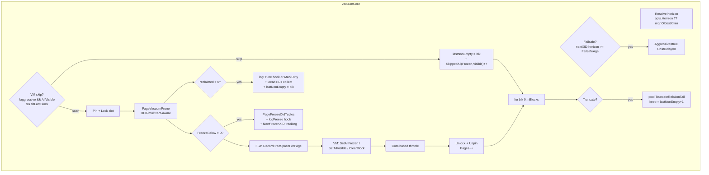
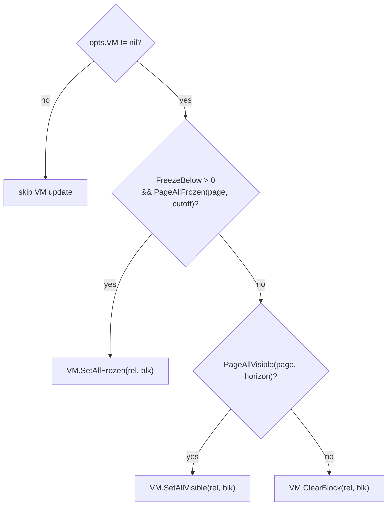
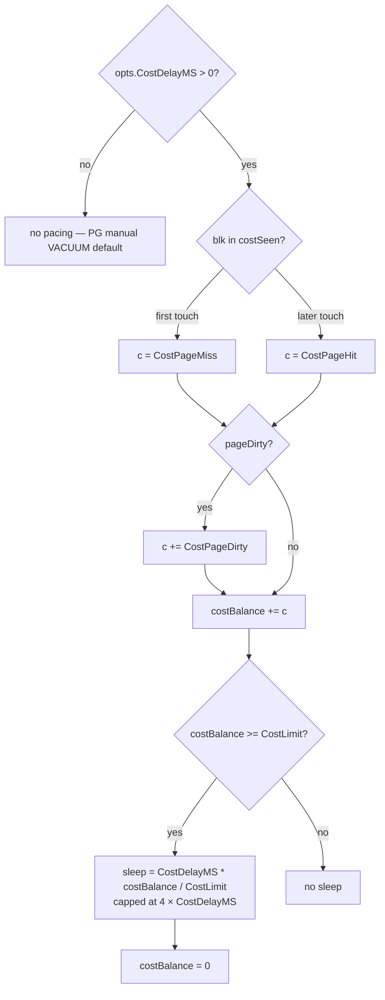
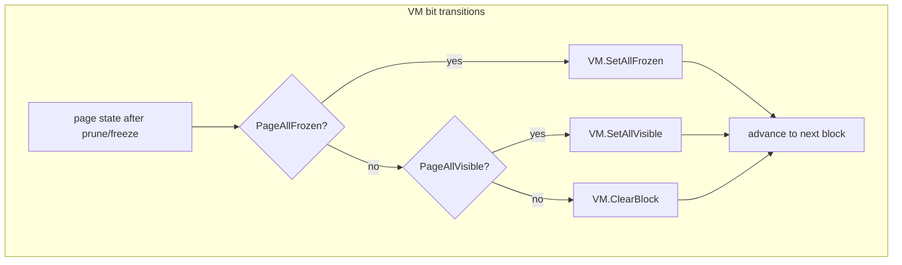
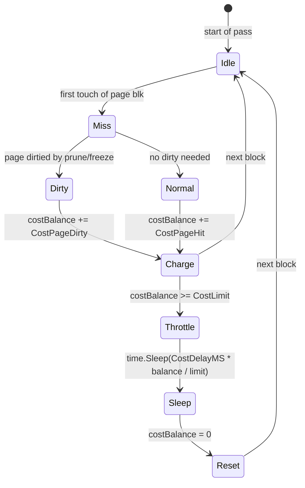

# Module: `internal/commands/vacuum`

The **VACUUM / ANALYZE** command engine — a Go port of PostgreSQL's
`src/backend/commands/vacuum.c` plus the storage-layer dead-tuple reclamation
(`PageVacuumPrune`), tuple freezing, visibility-map updates, and tail
truncation. It is invoked by the executor's `VACUUM`/`ANALYZE` utility
operators and by the autovacuum launcher.

The package is deliberately thin at the command level: the heavy lifting lives
in `internal/storage` (`PageVacuumPrune`, `PageFreezeOldTuples`, VM/FSM fork
updates), and this package drives the per-block loop, the dead-TID collection
for index vacuum, the freeze pass, and the truncation decision. Scope and growth
path are documented in `docs/design/0016-vacuum-and-analyze.md`: v0 reclaims
dead heap tuples at page granularity, returns full-scan ANALYZE statistics, and
provides a REINDEX bridge for B-tree cleanup until per-entry index removal
lands.

## Key Files

| File | LOC | Role |
|---|---|---|
| `vacuum.go` | 398 | Everything: `VacuumWithOptions`, `Vacuum`, `VacuumWithFSM`, `VacuumWithFSMAndVM`, `vacuumCore`, `Analyze`, and the `Stats`/`VacuumOptions`/`AnalyzeStats` structs. |
| `vacuum_test.go` | 468 | Unit suite over a synthetic heap: dead-tuple reclamation, freeze, VM/FSM updates, truncation, cost delays, horizon handling. |
| `lpdead_hook_test.go` | 17 | `TestMain` — installs the permissive `storage.XidCommitted` test hook (synthetic tuples carry literal xids with no clog). |

## Public API

```go
type VacuumOptions struct {
    Aggressive bool; FreezeBelow TransactionID; FailsafeAge int
    CostDelayMS int; CostLimit int; CostPageHit/Miss/Dirty int
    SkipLocked bool; Truncate bool
    FSM *storage.FSM; VM *storage.VisibilityMap
    Horizon TransactionID
    ...
}
type Stats struct {
    Pages, Live, Dead, Frozen int
    DeadTIDs []ItemPointer
    SkippedAllVisible, SkippedAllFrozen int
    OldestXmin, NewFrozenXID TransactionID
    ...
}
type AnalyzeStats struct{ Pages, Rows int; AvgWidth float64 }

func Vacuum(pool *storage.Pool, mgr *transam.Manager, rel storage.RelFileNode, ...) (Stats, error)
func VacuumWithOptions(pool *storage.Pool, mgr *transam.Manager, rel storage.RelFileNode, opts VacuumOptions, ...) (Stats, error)
func VacuumWithFSM(...) / VacuumWithFSMAndVM(...) (Stats, error)
func Analyze(pool *storage.Pool, mgr *transam.Manager, rel storage.RelFileNode, mxs *multixact.Store) (AnalyzeStats, error)
```

### Entry-point matrix

| Function | `VacuumOptions` passed | Feature |
|---|---|---|
| `Vacuum(pool, mgr, rel)` | `VacuumOptions{}` | Core dead-tuple reclamation only |
| `VacuumWithOptions(pool, mgr, rel, opts)` | full `opts` | Everything |
| `VacuumWithFSM(pool, mgr, rel, fsm)` | `{FSM: fsm}` | + free-space map updates (M0046-0003) |
| `VacuumWithFSMAndVM(pool, mgr, rel, fsm, vm)` | `{FSM: fsm, VM: vm}` | + FSM and visibility map (M0046-0004) |

All four funnel into `vacuumCore(pool, mgr, rel, opts)`.

### `Stats` semantics

- `Pages` — blocks visited (skipped blocks count via `SkippedAllVisible`/`SkippedAllFrozen`, not `Pages`).
- `Live` / `Dead` — tuples that survived / were reclaimed this pass (`Dead` counts both `Redirects` and `Unused` slots).
- `Frozen` — tuples whose xmin was rewritten to `FrozenTransactionID`.
- `DeadTIDs` — the (block, offset) pointers of fully-removed `Unused` slots, the input to index vacuum (`M0047-0002`).
- `OldestXmin` — the horizon actually used (resolved, possibly the caller's `opts.Horizon`).
- `NewFrozenXID` — the lowest unfrozen xmin after this pass (0 = all frozen); the caller's input to `pg_class.relfrozenxid`.

### `VacuumOptions` semantics

- `FSM` / `VM` — optional forks updated per page (free-space reuse, index-only scan visibility).
- `CostDelayMS` + `CostLimit`/`CostPageHit`/`CostPageMiss`/`CostPageDirty` — upstream's `vacuum_cost_*` pacing; zero delay disables pacing entirely (PG's default for manual VACUUM).
- `Truncate` — drop trailing all-empty blocks (`vacuum_truncate` GUC / reloption / statement param).
- `FailsafeAge` — when the horizon's XID age reaches it, force aggressive + disable cost delays (upstream `vacuum_failsafe_age`).
- `Aggressive` — force a full scan ignoring VM skips (upstream `DISABLE_PAGE_SKIPPING`; set by anti-wraparound autovacuum and `VACUUM (FREEZE)`).
- `FreezeBelow` — tuple-freeze cutoff (any `xmin < FreezeBelow` rewritten to `FrozenTransactionID`).
- `Horizon` — override the reclamation cutoff (used by the VACUUM operator for TEMPORARY relations).

## Internal structure

### The per-block loop



### `vacuumCore` — the per-block loop

`vacuumCore` iterates heap blocks (`blk` 0..`nBlocks`):

1. **Horizon resolution** — the reclamation cutoff is `opts.Horizon` if set (the VACUUM operator passes the session-local `mgr.OldestXminForProc()` for TEMPORARY relations so a concurrent session's older snapshot does not pin temp rows), else `mgr.OldestXmin()`.
2. **Failsafe escalation** — when `opts.FailsafeAge > 0` and `nextXID - horizon >= FailsafeAge`, the pass becomes aggressive and cost delays drop to zero, so the pass finishes fast and advances relfrozenxid.
3. **VM skip** — a non-aggressive pass skips all-visible blocks (except the last, which is always scanned for truncation decisions); all-frozen skips are counted separately (`SkippedAllFrozen`) so they don't stall relfrozenxid advancement. A skipped block still advances `lastNonEmpty` — it is all-visible, which for a heap page means it holds live tuples.
4. **Dead-tuple reclamation** — `storage.PageVacuumPrune` repacks the page: HOT-chain-aware (dead chain roots become `ItemIDRedirect`), multixact-aware (an updater-bearing multi xmax resolves its updater before the horizon compare). Removed line pointers become `LP_UNUSED`. The old naive "xmax < horizon → remove slot" pass broke HOT chains and treated a raw MultiXactId as an xid (freeze-the-dead spec, M0118-0009).
5. **WAL stamping** — when the pool has a `LogHeapPruneOpt` hook wired (the normal runtime case), each pruned page emits a logical prune redo record via `MarkDirtyChangeRecord`; replay reproduces the same redirects bit-for-bit. Without the hook (test pools), `MarkDirty` falls back to the FPI-on-every-dirty path.
6. **Dead-TID collection** — only the fully-removed (`Unused`) line pointers may carry an index entry that must be cleared; redirected roots keep their index entry valid. HOT-only `Unused` tuples have no index entry, so removing a (nonexistent) entry for their TID is a harmless no-op.
7. **Tuple freezing** — `PageFreezeOldTuples` rewrites old xmin → `FrozenTransactionID` for tuples older than `FreezeBelow`. A `logFrz` WAL hook (`LogHeapFreeze`) records the frozen slots; `MarkDirty` is the fallback. The minimum unfrozen xmin across all pages is tracked into `NewFrozenXID` for relfrozenxid advancement.
8. **FSM / VM updates** — free-space is recorded per page (`FSM.RecordFreeSpaceForPage`); VM bits are set: `ALL_FROZEN` when the freeze pass ran and every live tuple sits at-or-below the cutoff, `ALL_VISIBLE` when every remaining tuple is visible to the horizon, otherwise `ClearBlock`.
9. **Cost-based throttling** — the vacuum-cost family is modelled: per-page cost accumulates (first touch = miss, later touches = hit, dirty pages add dirty cost); when over `CostLimit`, the pass sleeps a proportional slice capped at `4 × CostDelayMS`. `costSeen` tracks which blocks were already touched this pass.
10. **Tail truncation** — when `opts.Truncate`, `keep = lastNonEmpty + 1` is passed to `pool.TruncateRelationTail` (WAL-first emission + invalidation + smgr shrink encapsulated in the pool helper). If `keep < nBlocks`, the tail is dropped; a missing hook (test harnesses) makes truncation a no-op rather than an unsafe shrink.

### VM bit decision flow



### Cost pacing flow



### `storage.PageVacuumPrune` contract (the reclamation engine)

`PageVacuumPrune(page, horizon)` returns `(pr, liveOnPage, err)` where `pr`
carries `Redirects` and `Unused` slot lists:

- Dead HOT-chain roots become `ItemIDRedirect` (so the index entry keeps resolving to the live tip), never removed.
- A multixact xmax that bears an updater resolves to its updater before the horizon compare — a live, only-row-locked tuple is not reclaimed.
- `liveOnPage` is the surviving-tuple count used for `Stats.Live` and the `lastNonEmpty` heuristic (a page with `cnt > 0 || liveOnPage > 0` is non-empty).

### `Analyze`

Walks every block of `rel` with a fresh read-committed snapshot from `mgr`,
counts "currently live" tuples (matching upstream's reltuples definition) and
accumulates average tuple width including the header. A `multixact.Store`
(`mxs`) is threaded from the caller (the autovacuum Launcher's process-shared
store; nil disables the multi path) so an updater-bearing multi xmax resolves to
its updater before the visibility judgement — a live, only-row-locked tuple is
not undercounted as invisible. LP_UNUSED/DEAD/REDIRECT slots are skipped via
`errors.Is(err, storage.ErrUnsupportedItem)`.

```go
// Analyze walkthrough
tx, _ := mgr.Begin(transam.IsolationReadCommitted)   // fresh snapshot
snap, _ := mgr.SnapshotFor(tx)
for blk := 0; blk < nBlocks; blk++ {
    slot, _ := pool.Pin(storage.BufferTag{Rel: rel, Block: blk})
    page := slot.Page()
    if storage.IsNew(page) { continue }               // uninitialized block
    count, _ := storage.PageLinePointerCount(page)
    for s := 1; s <= count; s++ {
        t, err := storage.PageGetHeapTuple(page, s)
        if errors.Is(err, storage.ErrUnsupportedItem) { continue }  // UNUSED/DEAD/REDIRECT
        if !transam.TupleVisible(t.Header, snap, tx.XID, storage.InvalidCommandId, nil, mxs) {
            continue                                    // not visible to this snapshot
        }
        out.Rows++
        totalBytes += int64(t.Header.Hoff + len(t.Data))
    }
}
out.AvgWidth = float64(totalBytes) / float64(out.Rows)
```

### Freeze rules

- `FreezeBelow` is the cutoff: any tuple with `xmin < FreezeBelow` is rewritten to `FrozenTransactionID` (2) so XID wraparound cannot make it invisible.
- `PageAllFrozen(page, cutoff)` gates the `ALL_FROZEN` VM bit; `PageAllVisible` gates `ALL_VISIBLE` (every remaining tuple visible to the horizon).
- `NewFrozenXID` (0 = all frozen) is the caller's input to the `pg_class` `relfrozenxid` update; the `SkippedAllFrozen` counter lets that advance even when whole blocks were skipped.

## Test coverage

| Test function | What it covers |
|---|---|
| `TestVacuumReclaimsDeadTuples` | Basic dead-tuple reclamation + DeadTIDs collection |
| `TestVacuumKeepsLiveBelowOldestXmin` | Live tuples are not removed |
| `TestVacuumReclaimsFreeSpace` | FSM updated after prune |
| `TestAnalyzeReturnsRowCountAndAvgWidth` | Rows + AvgWidth computed over visible tuples |
| `TestVacuumWithOptionsEmitsCanonicalPruneRecord` | Logical prune WAL record shape |
| `TestVacuumWithOptionsDefaultReclaims` | Zero-value options behaves like `Vacuum` |
| `TestVacuumVMSkipAndAllFrozenBits` | VM skip + ALL_FROZEN/ALL_VISIBLE bit setting |
| `TestVacuumTailTruncation` | Truncate drops trailing empty blocks |
| `TestVacuumTailTruncationKeepsVMSkippedBlocks` | lastNonEmpty tracked through skipped blocks |

## Dependencies

- **Used by** — `internal/executor` (VACUUM/ANALYZE utility operators), `internal/postmaster/autovacuum` (autovacuum launcher).
- **Uses** — `internal/storage` (page prune/freeze/VM/FSM, `TruncateRelationTail`, `IsNew`, `PageLinePointerCount`, `PageGetHeapTuple`, `ErrUnsupportedItem`, `BufferTag`, `Pin`/`Unpin`/`Lock`, `MarkDirty`, `MarkDirtyChangeRecord`, `LogHeapPruneOpt`, `LogHeapFreeze`, `PageAllVisible`, `PageAllFrozen`, `FSM.RecordFreeSpaceForPage`, `VisibilityMap.AllVisible/AllFrozen/SetAllFrozen/SetAllVisible/ClearBlock`), `internal/access/transam` (horizon, `OldestXmin`, `OldestXminForProc`, `Begin`, `SnapshotFor`, `TupleVisible`, `IsolationReadCommitted`, `InvalidCommandId`, `InvalidTransactionID`), `internal/access/transam/multixact` (the updater-resolution `Store`), `internal/access/transam/xlog` (WAL logging of prune/freeze via pool hooks).

## Notable patterns / gotchas

- **VM skip ≠ "no live tuples"** — an all-visible block still holds live rows; `lastNonEmpty` must be tracked through the skipped blocks or tail truncation drops live all-visible blocks (data loss). The last block is always scanned.
- **HOT-chain pruning** — never remove a chain root while descendants exist; redirect it (`ItemIDRedirect`) so the index entry keeps resolving to the live tip. The old naive "xmax < horizon → remove slot" pass broke HOT chains and treated a raw MultiXactId as an xid (freeze-the-dead spec, M0118-0009).
- **`SkippedAllFrozen` vs `SkippedAllVisible`** — frozen-only skips count separately so `relfrozenxid` can advance; visible-but-not-frozen skips count against a non-aggressive pass's freeze progress (vacuumlazy.c `skippedallvis` guard). Callers must NOT advance relfrozenxid when `SkippedAllVisible > 0` on a non-aggressive pass.
- **Failsafe** — `FailsafeAge` (XID-age based) forces an aggressive pass and disables cost delays when the cluster approaches wrap-around.
- **Empty-page special case** — uninitialized pages (`storage.IsNew`) are skipped without being counted as scanned (an extension may have allocated the block without writing tuples).
- **Temp-relation horizon** — a plain `mgr.OldestXmin()` pins reclamation of temp-table rows that a concurrent session's older snapshot cannot see; the VACUUM operator passes the session-local horizon via `opts.Horizon` so temp tables are actually reclaimable.
- **Test hook dependency** — the vacuum unit suite constructs synthetic tuples with literal xids and no clog; since C3-S3, `storage.TupleDeadToAll` requires the `XidCommitted` hook (production wires `CLog.DidCommit`), so `TestMain` installs a permissive stub (`lpdead_hook_test.go`).
- **WAL hooks** — the logical prune/freeze redo records are only emitted when the pool's hooks (`LogHeapPruneOpt`, `LogHeapFreeze`) are wired; test pools without WAL degrade to `MarkDirty` (FPI). This keeps the page change durable without a redo log.
- **VACUUM does not touch indexes** — v0 relies on a REINDEX bridge for B-tree cleanup until per-entry index removal (page deletion) lands; only `DeadTIDs` collection prepares the index-vacuum path (M0047-0002).
- **Cost-pacing first touch** — a page's first touch in the pass counts as a `CostPageMiss` (it had to come from disk); later touches as `CostPageHit`; a page that was dirtied adds `CostPageDirty`. The sleep is `CostDelayMS * costBalance / CostLimit`, capped at `4 × CostDelayMS`.
- **Page lock discipline** — the per-page content lock (`slot.Lock()`) is taken before the dead-set scan + repack + `pd_lsn` stamp so concurrent readers/writers can't tear the operation under `MarkDirtyChangeRecord`. The unlock/unpin pair must be balanced on every path, including the error returns.

## Horizon resolution detail

The reclamation cutoff is resolved at the top of `vacuumCore`:

```go
horizon := opts.Horizon
if horizon == storage.InvalidTransactionID {
    horizon = mgr.OldestXmin()
}
```

When `opts.Horizon` is set (the VACUUM operator for TEMPORARY relations), it
overrides the global horizon. This matters because a plain `mgr.OldestXmin()`
considers every backend's oldest snapshot, including a concurrent session that
cannot see the temp table at all — its snapshot would pin temp-table rows
indefinitely. The session-local horizon (`mgr.OldestXminForProc()`) excludes
snapshots from other backends, which is correct for temp tables where only the
owning backend's visibility matters.

## Failsafe escalation detail

The failsafe (upstream `vacuum_failsafe_age`) is checked before the block loop:

```go
if opts.FailsafeAge > 0 && mgr != nil {
    if nextXID := mgr.NextXID(); nextXID > horizon &&
        int64(nextXID-horizon) >= opts.FailsafeAge {
        opts.Aggressive = true
        opts.CostDelayMS = 0
    }
}
```

When the horizon's XID age reaches `FailsafeAge`, the pass becomes aggressive
(no VM skipping) and cost delays drop to zero. This ensures the pass finishes
fast and advances `relfrozenxid`, preventing XID wraparound. The `nextXID >
horizon` guard prevents a vacuum from going aggressive when the horizon is
already ahead of nextXID (e.g. after a wraparound emergency).

## The `vacuumCore` block loop in detail

### VM skip decision

```go
isLastBlock := blk == nBlocks-1
if skipping && opts.VM != nil && !isLastBlock && opts.VM.AllVisible(rel, blk) {
    if opts.VM.AllFrozen(rel, blk) {
        stats.SkippedAllFrozen++
    } else {
        stats.SkippedAllVisible++
    }
    lastNonEmpty = blk  // critical: skipped block still holds live tuples
    continue
}
```

The `isLastBlock` guard is essential: upstream always scans the last block
because it might be the only block with live tuples, and the truncation
decision depends on `lastNonEmpty`. Without it, a relation whose only live
data is in the last block (and that block is all-visible) would be truncated
to zero blocks — data loss.

### Dead-tuple reclamation + WAL logging

```go
pr, liveOnPage, err := storage.PageVacuumPrune(page, horizon)
// ...
reclaimed := len(pr.Redirects) + len(pr.Unused)
if reclaimed > 0 {
    if logPrune != nil {
        err = pool.MarkDirtyChangeRecord(slot, func() (storage.LSN, error) {
            return logPrune(rel, blk, pr.Redirects, pr.Unused)
        })
    } else {
        pool.MarkDirty(slot)
    }
    // DeadTIDs collection: only Unused line pointers
    for _, s := range pr.Unused {
        stats.DeadTIDs = append(stats.DeadTIDs, storage.ItemPointer{Block: blk, Offset: s})
    }
}
```

### Costs

| cost type | When applied | Default value |
|---|---|---|
| `CostPageHit` | Page already seen this pass (read from pool) | 1 |
| `CostPageMiss` | First touch this pass (page came from disk) | 2 |
| `CostPageDirty` | Page was dirtied by this pass | 20 |

The sleep computation:
```go
d := opts.CostDelayMS * costBalance / opts.CostLimit
if d > 4*opts.CostDelayMS {
    d = 4 * opts.CostDelayMS
}
time.Sleep(time.Duration(d) * time.Millisecond)
costBalance = 0
```

### VM bit transitions



## PageVacuumPrune contract

`storage.PageVacuumPrune(page, horizon)` from `internal/storage/prune.go`:

1. Reads the page's line pointer array and every tuple header.
2. For each line pointer:
   - `LP_UNUSED` — already free, skip.
   - `LP_DEAD` — mark as `LP_UNUSED` (reclaimable).
   - `LP_REDIRECT` — keep; the redirect target is a live HOT chain member.
   - `LP_NORMAL` — check tuple's xmax against the horizon:
     - If xmax is a MultiXactId and the multi has an updater, resolve the
       updater XID before comparing against the horizon.
     - If xmax < horizon (the tuple is dead to all running backends), mark
       the line pointer as `LP_UNUSED` unless it is a HOT chain root (in
       which case it becomes `LP_REDIRECT` so the index entry stays valid).
     - If xmax ≥ horizon (the tuple may still be visible), keep it.
3. Returns `PruneResult` with `Redirects` (slot numbers of HOT chain roots
   that became redirects) and `Unused` (slot numbers of fully-removed
   tuples). Also returns `liveOnPage` — the count of surviving tuples.

The HOT-chain-aware behaviour is critical: a dead HOT chain root must not
be removed because the index entry points at it. Instead, it is redirected
to the live chain tip, so the index entry continues to resolve correctly.

## Multixact updater resolution

When a tuple's xmax is a MultiXactId (the `HEAP_XMAX_IS_MULTI` bit is set),
`PageVacuumPrune` cannot compare the raw multi ID against the horizon (a
multi ID is not a transaction ID). Instead:

1. The multi ID is looked up in the `multixact.Store` (threaded from the
   caller) to find the member XIDs.
2. Among the members, the "updater" XID (the one that holds the tuple lock)
   is extracted.
3. The updater XID is compared against the horizon for the reclamation
   decision.
4. If the updater XID is still in progress (the lock is still held), the
   tuple is not reclaimed — even if the multi ID itself is "old".

This prevents live, only-row-locked tuples from being reclaimed as dead.

## Analyze walk-through (code-level)

```go
func Analyze(pool *storage.Pool, mgr *transam.Manager, rel storage.RelFileNode,
    mxs *multixact.Store) (AnalyzeStats, error) {
    tx, _ := mgr.Begin(transam.IsolationReadCommitted)
    defer mgr.Rollback(tx)
    snap, _ := mgr.SnapshotFor(tx)
    nBlocks, _ := pool.NBlocks(rel)
    out := AnalyzeStats{Pages: int(nBlocks)}
    for blk := range nBlocks {
        slot, _ := pool.Pin(storage.BufferTag{Rel: rel, Block: blk})
        page := slot.Page()
        if storage.IsNew(page) { continue }  // extension-allocated block
        count, _ := storage.PageLinePointerCount(page)
        for s := 1; s <= count; s++ {
            t, err := storage.PageGetHeapTuple(page, s)
            if errors.Is(err, storage.ErrUnsupportedItem) { continue }
            // TupleVisible checks xmin, xmax, hint bits, and the multixact
            // updater if mxs is non-nil
            if !transam.TupleVisible(t.Header, snap, tx.XID,
                storage.InvalidCommandId, nil, mxs) {
                continue
            }
            out.Rows++
            totalBytes += int64(t.Header.Hoff + len(t.Data))
        }
        pool.Unpin(slot)
    }
    if out.Rows > 0 { out.AvgWidth = float64(totalBytes) / float64(out.Rows) }
    return out, nil
}
```

## Freeze pass detail

The freeze pass (`storage.PageFreezeOldTuples`) rewrites xmin of tuples older
than `FreezeBelow` to `FrozenTransactionID` (2). It returns:

```go
type FreezeStats struct {
    Frozen        int           // number of tuples frozen
    FrozenSlots   []uint16      // slot numbers of frozen tuples (for WAL)
    MinUnfrozenXID TransactionID // minimum xmin among unfrozen tuples (0 = all frozen)
}
```

`NewFrozenXID` tracking across the pass:
```go
if fs.MinUnfrozenXID != 0 {
    if stats.NewFrozenXID == 0 || fs.MinUnfrozenXID < stats.NewFrozenXID {
        stats.NewFrozenXID = fs.MinUnfrozenXID
    }
}
```

A `NewFrozenXID` of 0 means every tuple on every page was frozen — the
relation's `relfrozenxid` can advance to the current `FreezeBelow` cutoff.
Non-zero means some tuples are still unfrozen, and `relfrozenxid` can only
advance to the minimum unfrozen xmin.

## Cost-pacing state machine



## Default cost values (upstream vacuum_cost_*)

| Cost parameter | Upstream default | Meaning |
|---|---|---|
| `vacuum_cost_page_hit` | 1 | Page found in the buffer pool (already read this pass) |
| `vacuum_cost_page_miss` | 2 | Page read from disk |
| `vacuum_cost_page_dirty` | 20 | Page dirtied by the pass |
| `vacuum_cost_delay` | 0 (disabled) | Sleep delay in ms after exceeding the limit |
| `vacuum_cost_limit` | 200 | Cost balance threshold before sleeping |

Zero delay disables pacing entirely (PG's default for manual VACUUM). The
autovacuum launcher sets non-zero cost limits by default.

## `lastNonEmpty` truncation heuristic

```go
lastNonEmpty := storage.BlockNumber(0)
// ...in the VM-skip path:
lastNonEmpty = blk          // skipped all-visible block still holds live tuples
// ...in the prune path:
if cnt, cerr := storage.PageLinePointerCount(page); cerr == nil && (cnt > 0 || liveOnPage > 0) {
    lastNonEmpty = blk      // page has at least one line pointer or surviving tuple
}
// ...at the end:
if opts.Truncate {
    keep := lastNonEmpty + 1
    if keep < nBlocks {
        _ = pool.TruncateRelationTail(rel, keep)
    }
}
```

The `cnt > 0 || liveOnPage > 0` condition is subtle: a page can have zero
line pointers after pruning but still hold a surviving tuple (the `cnt` check
counts line pointers including redirects, while `liveOnPage` counts actual
tuples). Both must be considered or a fully-pruned-but-nonempty page would be
wrongly truncated away.

## Freeze + VM interaction

The VM `ALL_FROZEN` bit is only set when BOTH conditions hold:
1. The freeze pass ran (`opts.FreezeBelow > 0`).
2. `storage.PageAllFrozen(page, opts.FreezeBelow)` — every live tuple's xmin
   is at-or-below the cutoff.

If the freeze pass is disabled (`FreezeBelow == 0`), the VM falls back to
`ALL_VISIBLE` when `PageAllVisible(page, horizon)`, otherwise `ClearBlock`.
A page with any unfrozen-but-visible tuple gets `ALL_VISIBLE` (index-only
scans can skip the heap fetch) but not `ALL_FROZEN` (anti-wraparound vacuum
must still visit it).

## Error paths in vacuumCore

Every error return inside the block loop releases the page lock and pin
before returning:

```go
slot, err := pool.Pin(storage.BufferTag{Rel: rel, Block: blk})
if err != nil { return stats, err }
page := slot.Page()
slot.Lock()
// ... prune / freeze / WAL-logging ...
// any error path:
slot.Unlock()
pool.Unpin(slot)
return stats, err
```

The early-return structure guarantees the lock/unpin pair is balanced even
when `PageVacuumPrune` or the WAL hooks fail. `stats` is returned alongside
the error so the caller can report partial progress.