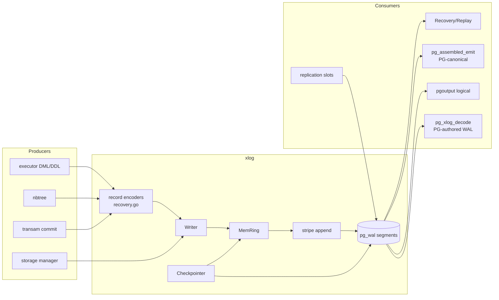
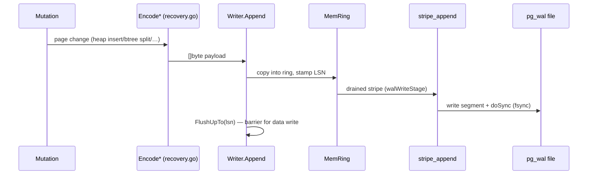
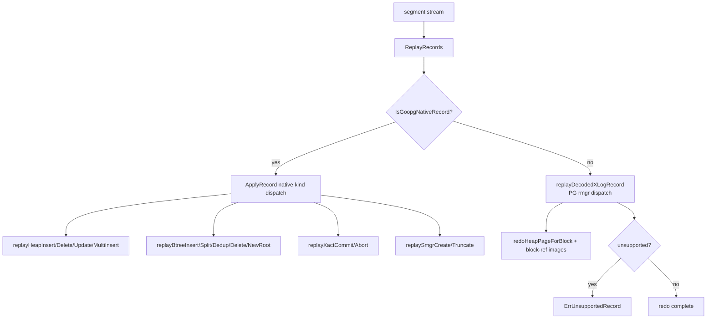
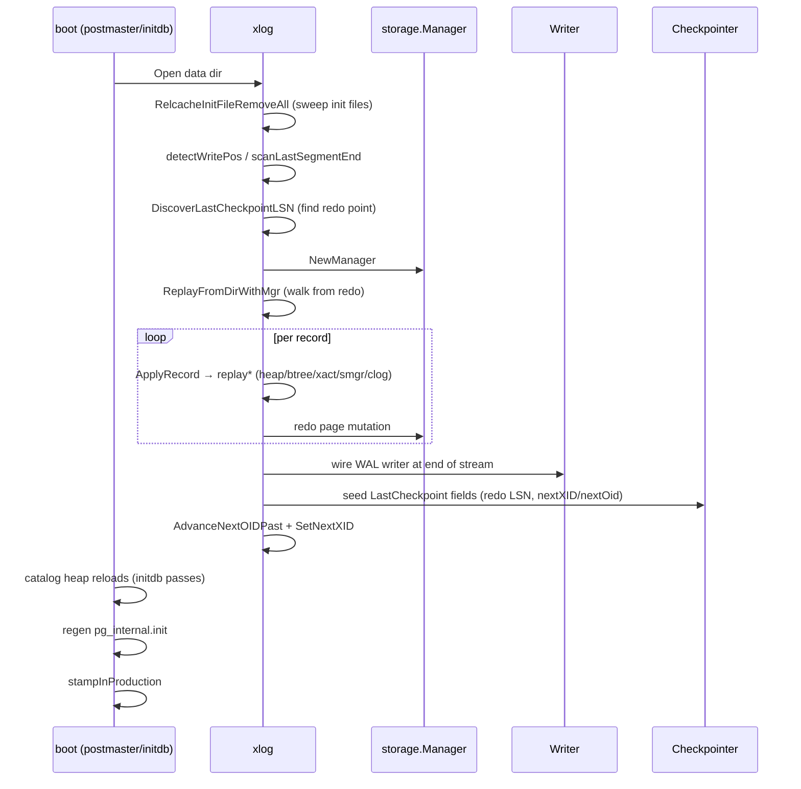
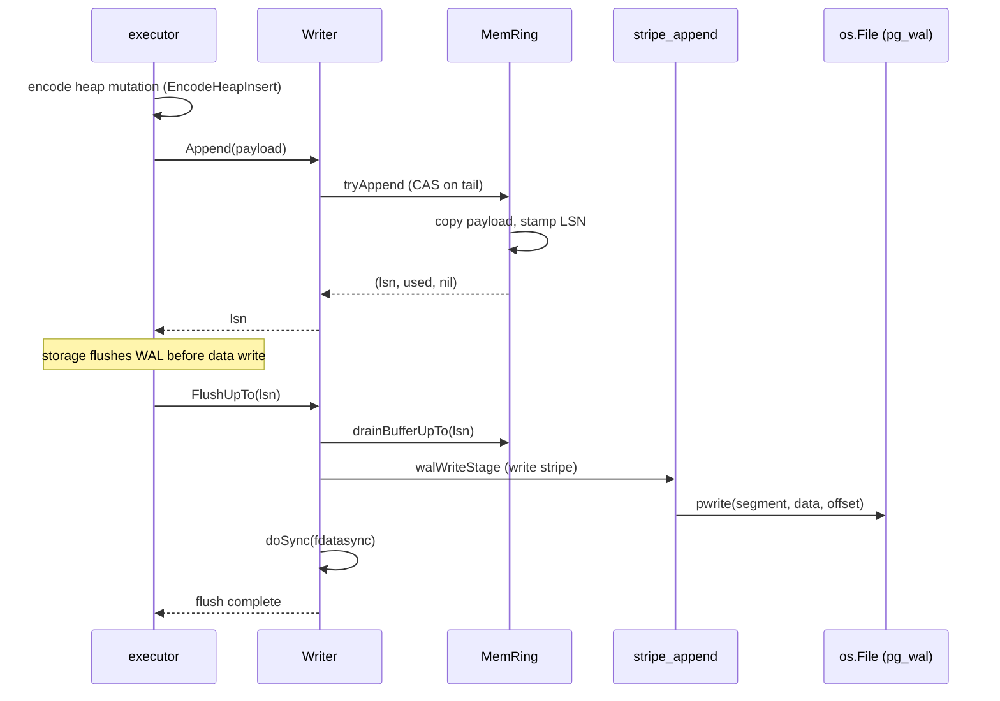
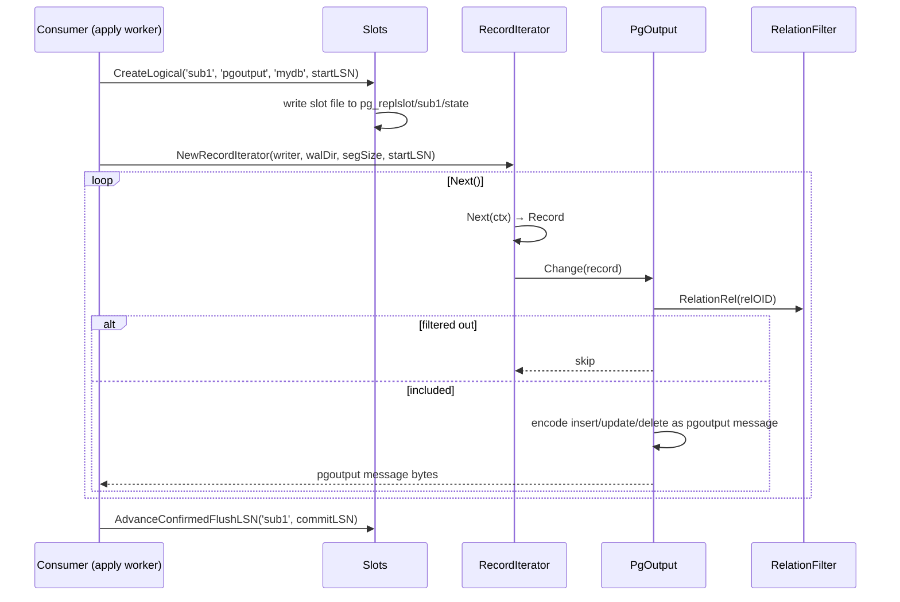
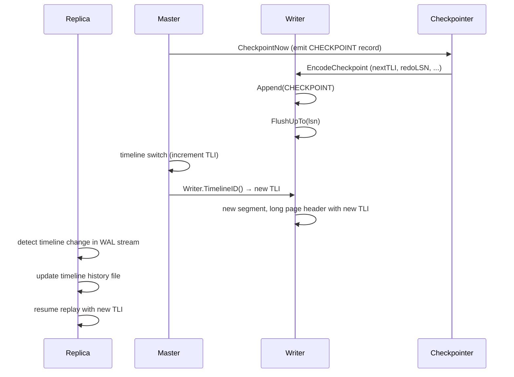

# Module: `internal/access/transam/xlog`

The **write-ahead log** — WAL record encoding, the append/emit path, segment
management, crash recovery / replay, and both physical and logical (pgoutput)
decoding. It is the Go analogue of PG's `src/backend/access/transam/`
(`xlog.c`, `xloginsert.c`, `xlogrecovery.c`, `xlogreader.c`) plus
`src/backend/replication/pgoutput`.

This is the durability spine: every page mutation is encoded as a WAL record,
appended to an in-memory ring buffer, and flushed to `pg_wal` segments ahead of
the data write (WAL-before-data). On restart, the same records are replayed to
reconstruct the cluster state. The same WAL is what a vanilla PG 18.3 standby
consumes for physical replication, and `pgoutput` re-encodes it for logical
replication.



## Key Files

| File | LOC | Role |
|---|---|---|
| `recovery.go` | 6,682 | Record codec (`Encode*`/`Decode*` per record kind) and the redo engine: `ApplyRecord`, `ReplayRecords`, `ReplayRecordsFrom`, per-rmgr `replay*` functions (heap, btree, xact, smgr, clog, tblspc, dbase), checkpoint encode/decode, PG-authored WAL replay |
| `writer.go` | 2,794 | The `Writer`: in-memory WAL ring buffer (`MemRing`), `Append`/`AppendRaw`, commit LSN, `FlushUpTo`, segment preallocation/recycling, `detectWritePos`/`scanLastSegmentEnd`, `RemoveOldSegments` retention |
| `pg_assembled_emit.go` | 1,456 | Encoding PG-canonical records (heap insert/update/delete, xact commit/abort) that a real PG 18.3 can consume |
| `checkpointer.go` | 1,122 | The checkpointer: periodic `CHECKPOINT` records, `CheckPointFields`, dirty-page flush orchestration, FPI watermark, segment-based pacing |
| `reader.go` | 627 | Segment reading: `readStream`, `readStreamFrom`, `readAllPageAware`, `endOfWAL` handling, `durableUnknownRecord` |
| `pg_xlog_decode.go` | 610 | Generic PG WAL-record decode (rmgr dispatch, block-ref decode, FPI handling) used for PG-authored WAL |
| `iterator.go` | 587 | `RecordIterator` over a live WAL stream (`readOneAt`, page-header decode, `parkUntilWake`) |
| `slots.go` | 523 | Replication slots: physical/logical slot persistence (`pg_replslot/`), `AdvanceConfirmedFlushLSN`, `MinRestartLSN`, `MinCatalogXmin` |
| `syncrep.go` | 416 | Synchronous replication: quorum/priority wait for standby acknowledgement |
| `pgoutput_decoder.go` | 399 | The inbound side: decode pgoutput messages for the apply worker |
| `xlog_page.go` | 368 | `XLogPageHeader`/`XLogLongPageHeader` encode/decode + `xlogPageValidator` — the "don't trust recycled segments" check |
| `stripe_append.go` | 362 | Batched stripe append of records into segments |
| `replmon.go` | 351 | Replication monitoring (LSN deltas, lag) |
| `stripe_writer_core.go` | 326 | Core stripe-writer: strip assembly + emit |
| `wal_buffer.go` | 311 | WAL buffer pool: reserved-byte publication, head/base atomics |
| `xlog_record.go` | 281 | `Record` struct and PG `XLogRecord` wire decode |
| `classifier.go` | 264 | Record classification (rmgr/kind/opcode → goopg action) |
| `format.go` | 262 | WAL page/record header structs, `encodeRecordXLog`, `XLogRecord` decode, segment-name formatting |
| `syncrep_parse.go` | 247 | syncrep GUC parsing (quorum/priority syntax) |
| `mem_ring.go` | 240 | The `MemRing` append window + drained pages |
| `mem_ring_concurrent.go` | 198 | Concurrent-safe ring publish (CAS on tail) |
| `subscriber_mon.go` | 224 | Subscriber lag monitoring |
| `retention.go` | 223 | Keep-horizon / segment retention computation |
| `xlog_emit.go` | 219 | Goopg-native record emit helpers |
| `index_am_refusal.go` | 202 | Refusal of unsupported index-AM WAL replay |
| `reorder.go` | 201 | Record reordering for subtransaction-safe replay |
| `stream_replayer.go` | 197 | Streaming replayer (replay while reading) |
| `insert_pos.go` / `insert_pos_publish.go` | 166/111 | Insert-position tracking + publish |
| `reserve_emitted.go` | 189 | Reserved-byte bookkeeping for emitted stripes |
| `xlog_assemble.go` | 189 | PG-canonical record assembly |
| `snapshot.go` | 139 | Catalog snapshot for logical decoding |
| `archive_recovery.go` | 141 | `recovery.signal` archive mode: `restore_command` fetch → replay → promote |
| `decoder.go` | 139 | Logical-decoding input framing |
| `reader_early_end.go` | 137 | Early-end-of-WAL detection |
| `publish_visibility.go` | 133 | Publish-visibility gating (WAL publish ↔ snapshot) |
| `pg_xact_parse.go` | 121 | PG xact record main-data parse |
| `seq_log.go` | 108 | Sequence WAL logging |
| `repllog.go` | 61 | Replication-log entry helpers |
| `rmgr_map.go` | 90 | PG rmgr-ID ↔ name/opcode mapping |
| `timeline_history.go` | 171 | Timeline history file handling |
| `slot_decoder.go` | 154 | Slot-backed logical decoding |
| `slots_pg.go` | 203 | PG-format slot file read/write |
| `archive_restore.go` | 61 | `restore_command` invoke + promote |
| `relmap.go` | 162 | Relation-map WAL records |
| `recovery_cache.go` | 90 | Per-database recovery cache |
| `segment_pad.go` / `segment_pad_emit.go` | 91/204 | Segment zero-padding before reuse |
| `tail_publisher.go` | 180 | WAL tail publishing to subscribers |
| `insertion_tracker.go` | 182 | Insert-position tracking for seek |
| `wal_write_lock.go` | 77 | Write-lock discipline around segment I/O |
| `padded_mutex.go` | 69 | Cache-line-padded mutex (CPU false-sharing guard) |
| `sync_linux.go` / `sync_other.go` | 28/26 | `fdatasync`/`fsync` platform wrappers |

## Public API

```go
// Writer (writer.go)
func NewWriter(cfg Config) (*Writer, error)
func (w *Writer) Append(payload []byte) (lsn uint64, used uint64, err error)
func (w *Writer) AppendRaw(stream []byte) (lsn uint64, used uint64, err error)
func (w *Writer) FlushUpTo(lsn uint64) error
func (w *Writer) WrittenLSN() uint64 / DrainedLSN() uint64
func (w *Writer) WalRecords() int64 / WalBytes() int64
func (w *Writer) RemoveOldSegments(keepLSN uint64) (removed, recycled int, err error)
func (w *Writer) Subscribe(ch chan<- struct{}) / Unsubscribe(ch chan<- struct{})
func (w *Writer) Close() error
func (w *Writer) MemRing() *MemRing
func (w *Writer) TimelineID() uint32 / Format() WALFormatVersion
func (w *Writer) SetCommitDelayUs(us int64) / SetCommitSiblings(n int)
func (w *Writer) SetWalWriterFlushAfter(bytes int64)
func (w *Writer) BackgroundWrite() error
func (w *Writer) PageHeadersEnabled() bool
func (w *Writer) WALBuffersCapacity() int64 / WALBuffersBytesResident() int64
func (w *Writer) WALBuffersOverflowDrainBytes() uint64 / WALBuffersFlushDrainBytes() uint64
func (w *Writer) FsyncCount() int64 / AddFsyncTimeNanos(n int64) / FsyncTimeNanos() int64
func (w *Writer) SegmentsPreallocated() int64 / PreallocatedBytes() int64
func detectWritePos(walDir string, segSize int64, pageHeaders bool) (int64, uint64, error)
func scanLastSegmentEnd(walDir string, segNo uint64, tli uint32, segSize int64, cfgSegSize int64, pageHeaders bool) (int64, uint64, error)

// Recovery (recovery.go)
func ReplayRecords(mgr *storage.Manager, records []Record) (ReplayStats, error)
func ReplayRecordsFrom(mgr *storage.Manager, records []Record, redoLSN uint64) (ReplayStats, error)
func ApplyRecord(mgr *storage.Manager, r Record) (bool, error)   // redo one record
func IsGoopgNativeRecord(r Record) bool
func headerMatchesEmittedKind(r Record) bool
func ExportedReplayStart(records []Record) (int, uint64)
type ReplayStats struct{ /* counts by record kind, total bytes, redo start/end */ }

// Record encoders (recovery.go)
func EncodeHeapInsert(rel, blk, lineSlot, tuple) []byte
func EncodeHeapDelete(rel, blk, lineSlot, xmax, oldTuple) []byte
func EncodeHeapHotUpdate(rel, blk, oldSlot, xmax, tupleBytes) []byte
func EncodeHeapUpdate(p HeapUpdatePayload) []byte
func EncodeHeapMultiInsert(p HeapMultiInsertPayload) []byte
func EncodeHeapPruneOpt(rel, blk, redirects, unused) []byte
func EncodeHeapFreeze(rel, blk, frozenSlots) []byte
func EncodeHeapLock(rel, blk, lineSlot, xmax, lockStrength) []byte
func EncodeHeapVisible(p HeapVisiblePayload) []byte
func EncodeSmgrCreate(rel) []byte / EncodeSmgrTruncate(rel) []byte
func EncodeSmgrTruncateTo(rel, nBlocks) []byte
func EncodeBtreeInsert(rel, blk, offnum, item) []byte
func EncodeBtreeSplit(rel, leftBlk, rightBlk, leftPage, rightPage, sibBlk, sibPage) []byte
func EncodeBtreeVacuum(rel, blk, keptItems, opaqueFlags) []byte
func EncodeBtreeUnlinkPage(p BtreeUnlinkPagePayload) []byte
func EncodeBtreeNewRoot(p BtreeNewRootPayload) []byte
func EncodeBtreeMarkPageHalfDead(p BtreeMarkHalfDeadPayload) []byte
func EncodeBtreeReusePage(p BtreeReusePagePayload) []byte
func EncodeBtreeMetaCleanup(p BtreeMetaCleanupPayload) []byte
func EncodePageImage(rel, blk, page) []byte / DecodePageImage(payload)
func EncodeXactCommit(xid) []byte / EncodeXactAbort(xid) []byte
func EncodeXactAssignment(parentXid, subXids) []byte
func EncodeXactRollbackTo(parentXid, abortedSubXids) []byte
func EncodeXactSubAbort(subXid) []byte
func EncodeClogTruncate(xid) []byte
func EncodeCheckpoint() []byte / EncodeCheckpointCompat(redoLSN0, tli, nextXid, nextOid)
func ProcessCommittedInvalidationMessages(dataDir string, dboid uint32) error

// Reader (reader.go)
func readStream(walDir string, segSize int64) ([]byte, error)
func readStreamFrom(walDir string, segSize int64, firstSegNo uint64) ([]byte, error)
func readAllUncached(walDir string, segmentSize int64) ([]Record, error)
func IsValidWalSegSize(size int64) bool
func liveSegmentRunStart(segNos []uint64) uint64

// Iterator (iterator.go)
func NewRecordIterator(w *Writer, walDir string, segSize int64, startLSN uint64) (*RecordIterator, error)
func (it *RecordIterator) Next(ctx context.Context) (Record, error)
func (it *RecordIterator) NextRaw(ctx context.Context, maxBytes int) (RawChunk, error)
func (it *RecordIterator) AtEndOfWAL() bool
func (it *RecordIterator) Close() error

// Logical decoding (pgoutput.go)
func NewPgOutput(snap *CatalogSnapshot, w io.Writer) *PgOutput
func (p *PgOutput) SetFilter(f RelationFilter)
func (p *PgOutput) Begin(xid, commitLSN) error
func (p *PgOutput) Commit(xid, commitLSN) error
func (p *PgOutput) Change(c Change) error     // relation/insert/update/delete dispatch
type RelationFilter interface{ RelationRel(oid uint32) bool }

// Slots (slots.go)
func OpenSlots(dataDir string) (*Slots, error)
func (s *Slots) Create(name, kind, startLSN) (*Slot, error)
func (s *Slots) CreateLogical(name, plugin, database, startLSN) (*Slot, error)
func (s *Slots) Drop(name) error
func (s *Slots) Get(name) (Slot, error) / List() []Slot
func (s *Slots) AdvanceConfirmedFlushLSN(name, lsn) error
func (s *Slots) SetActive(name, active) error
func (s *Slots) MinRestartLSN() uint64 / MinCatalogXmin() uint64
func (s *Slots) InvalidateLagging(currentLSN, maxKeepBytes) ([]string, error)

// Checkpointer (checkpointer.go)
func NewCheckpointer(flusher DirtyPageFlusher, wal checkpointWAL, cfg CheckpointerConfig) *Checkpointer
func (c *Checkpointer) Run(ctx context.Context) error
func (c *Checkpointer) CheckpointNow() error / CheckpointShutdown() error
func (c *Checkpointer) LastCheckpointLSN() / LastCheckpointRedoLSN() / LastCheckpointRecordLSN() uint64
func (c *Checkpointer) SetInterval(d) / SetMaxWALBytes(b) / SetRetainer(r) / SetCompletionTarget(t)
func (c *Checkpointer) SetNextMultiXactFn(fn func() (next, nextOffset, oldest uint32))

// WAL page format (xlog_page.go, format.go)
func EncodeXLogPageHeader(dst, h) error / DecodeXLogPageHeader(src) (XLogPageHeader, error)
func EncodeXLogLongPageHeader(dst, h) error / DecodeXLogLongPageHeader(src)
func XLogFileName(tli, segno, segSize) string
func ParseXLogFileName(name, segSize) (tli, segno, ok)
func encodeRecordXLog(payload []byte, prev uint64) ([]byte, int, error)
func decodeRecordXLog(stream []byte) ([]byte, int, error)
func classifyXLogRecord(payload []byte) (Rmgr, uint8, uint32)
func FormatSegmentName(segNo uint64) string / FormatSegmentNameTLI(segNo, tli) string
```

## Internal structure

### Append path

An executor/storage mutation calls the record encoder (`recovery.go`'s
`Encode*`), producing a `Record`. `Writer.Append` copies it into the shared
ring buffer (`MemRing`), stamps the LSN, and notifies subscribers. `FlushUpTo`
drains the ring, `xlogWrite`/`walWriteStage`/`walSyncStage` write the segments
and fsync; `commit_delay`/`commit_siblings` throttle the flush.



- `Append` (single record) vs `AppendRaw` (pre-assembled stream) — `AppendRaw`
  bypasses the per-record header wrap, used by the standby/streaming path.
- `mem_ring_concurrent.go` publishes a drained tail with CAS; `tryAppend`/
  `append` are the two insertion paths (`wal_buffer.go` tracks
  reserved bytes against the write frontier).

### Record layout

Each record has a header (`RecordKind` byte + flags + payload length +
`xl_prev` backpointer) and an optional body; `format.go` keeps the wire layout
PG-compatible. For PG-authored WAL the `XLogRecord` header is decoded with
`SizeOfXLogRecord` (24 bytes, the only header-size constant in `format.go`) and
the block-ref trailer. Record kinds cover:

- **heap**: insert, delete, update, multi-insert, hot-update, lock, prune-opt,
  freeze, visible, vacuum (dead-slot list)
- **smgr**: create, truncate, truncate-to
- **btree**: insert, split, vacuum, unlink-page, new-root, mark-page-halfdead,
  reuse-page, meta-cleanup
- **xact**: commit, abort, assignment, rollback-to, sub-abort, marker
- **clog**: truncate
- **checkpoint**: redo LSN + nextXid/nextOid/tli (+ nextMultiXact/nextMultiOffset)
- **misc**: page image (FPI), relation-map change

`classifier.go` maps (rmgr, opcode) → goopg record kind; `rmgr_map.go` maps
PG rmgr IDs ↔ names. `record_kind_rmgr_mapping_test.go` pins the correspondence.

### Recovery / replay

`ReplayRecords` walks the segment stream, `ApplyRecord` dispatches per
`RecordKind` to `replay*` functions that re-run the mutation against
`storage.Manager` pages (heap insert/delete/update/multi-insert, btree
split/insert/dedup/delete, xact commit/abort, smgr create/truncate, clog
zero-page/truncate, tblspc/dbase create/drop, page images). PG-authored WAL
goes through `pg_xlog_decode`'s rmgr dispatch with block-ref/FPI handling.



- `redoHeapPageForBlock` locates/initializes the block before applying
  `XLOG_HEAP_*` records; `reconstructMarshaledTupleFromHeader` rebuilds a heap
  tuple from the record's header + data split (the PG marshaled-tuple layout).
- Subtransactions: `EncodeXactAssignment`/`EncodeXactRollbackTo`/
  `EncodeXactSubAbort` let replay walk parent XIDs; `reorder.go` reorders
  records so subtransaction-abort effects replay in the correct order.
- `ProcessCommittedInvalidationMessages` applies relcache invalidation messages
  committed in a transaction, so a goopg restart invalidates the right
  relations even for PG-authored WAL.

### Checkpointer

The checkpointer goroutine periodically emits a `CHECKPOINT` record embedding
`CheckPointFields` (redo LSN, nextXID/nextOid, timeline) and flushes dirty
buffers, advancing the recovery horizon. Segment-based pacing: the interval and
max-WAL-bytes GUCs are converted into a `checkpointSegments` budget, and a
pacer spreads the dirty-page flush across the checkpoint duration (a
completion target that front-loads or backs off based on WAL volume).
`volumeTriggerFires` forces a checkpoint early when WAL bytes exceed the
threshold. The FPI watermark lives on `Slot.nativeImageLSN` (see storage).

### Slots

`Slots` persists physical/logical replication slots to `pg_replslot/` using the
PG slot-file format (`slots_pg.go`); logical slots track `ConfirmedFlushLSN`
and `MinRestartLSN` so WAL is retained while a consumer lags.
`MinCatalogXmin`/`AdvanceCatalogXmin` guard catalog-tuple WAL (catalog_xmin
slot concept); `InvalidateLagging` drops slots whose restart LSN falls too far
behind. `slot_decoder.go` bridges a logical slot to `PgOutput`.

### WAL page / segment format

The on-disk WAL is a stream of 8 KiB pages (`XLOG_BLCKSZ`), each preceded by an
`XLogPageHeader` (or `XLogLongPageHeader` for the first page of a segment) when
`pageHeaders=true`. Key fields:

- **`XLogPageHeader`**: `xlp_magic` (0xD086), `xlp_info` (flags: first/continuation/overwrite-recovery), `xlp_tli`, `xlp_pageaddr` (the page's LSN address), `xlp_rem_len` (bytes of a record continuing onto this page)
- **`XLogLongPageHeader`**: extends with `xlp_seg_size`, `xlp_xlog_blcksz` — written once per segment
- **`XLogRecord`** (PG-canonical): `xl_tot_len`, `xl_xid`, `xl_prev`, `xl_info` (rmgr|flags), `xl_rmid`, then main data + block-ref array + FPI data
- **Segment naming**: `00000001` (TLI) + `00000000` (log) + `00000001` (seg) + `.00000028.backup` suffixes for backups

goopg-native records (`IsGoopgNativeRecord`) use a compact `RecordKind`-byte
header; PG-authored records use the full `XLogRecord` wire format. The two are
distinguished at read time by `classifyXLogRecord`, and the codec must never
mistake one for the other (`format_mismatch_test.go`).

### Recovery flow (cold start)



The recovery entry points are `ReplayRecords(mgr, records)`,
`ReplayRecordsFrom(mgr, records, redoLSN)`, and
`ReplayFromDirWithMgr(mgr, walDir, segmentSize)`. `ExportedReplayStart` gives a
caller the byte/record offset to resume an interrupted replay.

### Segment lifecycle

`detectWritePos`/`scanLastSegmentEnd` find the real end of WAL (not trusting
recycled segments — `xlog_page.go`'s validator checks `xlp_pageaddr`, TLI, and
segment size, and `isPreallocatedTail` treats a known zero pattern as "not yet
written"). Segments are preallocated by `eagerPreallocSegment` (a background
worker writes the zero fill) and recycled by `recycleSegmentFile` (rename +
rezero, `segment_pad.go`); `RemoveOldSegments` applies the retention horizon
(`retention.go`). `FormatSegmentName`/`FormatSegmentNameTLI` and `parseSegmentName`
handle the `000000010000000000000001` naming scheme.

The Writer's `Config` struct specifies segment size (default 16 MB), WAL
buffers capacity, `pageHeaders` flag (whether to emit PG-format page headers),
and the `SegmentSize` config field. `IsValidWalSegSize` checks that the size is a
power of 2 between 1 MB and 1 GB.

## Key flow: WAL record append and flush



## Dependencies

- **Used by** — `internal/storage` (WAL flush barrier, `WALFlusher`),
  `internal/access/transam` (commit records), `internal/access/nbtree`
  (index WAL), `internal/executor` (DDL/DML WAL via storage),
  `internal/initdb` (WAL bootstrap, recovery), `internal/replication`
  (walsender), `internal/backup`, `internal/postmaster`.
- **Uses** — `internal/storage` (pages, `Manager` for redo), `internal/port/runtimeshim`
  (nanotime), `internal/utils/activity/stats` (counters),
  `internal/utils/misc` (GUCs like `wal_level`, `synchronous_commit`,
  `wal_compression`), `internal/access/transam` (xid visibility during replay).

## Notable patterns / gotchas

- **WAL-before-data** — a page mutation must be WAL-logged (and flushed to the
  record's LSN) before the data page write is made durable; `storage.flushSlot`
  flushes to `max(pd_lsn, hintFlushBarrier)`.
- **`xl_prev` chain** — every record back-points to the previous one; the
  reader/`pg_waldump` validate it. A gap from a recycled segment breaks the
  chain, which `xlog_page.go`'s validator prevents.
- **Record-kind registry** — `RecordKind*` constants in `recovery.go` are the
  goopg-native encoding; `IsGoopgNativeRecord` distinguishes them from
  PG-canonical records. The two codecs must agree with `headerMatchesEmittedKind`.
- **Unsupported PG records** — `unsupportedDecodedXLogOpcode` refuses
  PG-authored records goopg cannot replay (2PC, `HEAP2_REWRITE`, unknown
  opcodes) with `ErrUnsupportedRecord`, so a crash tail never silently "ends"
  early (`durableUnknownRecord`).
- **`endOfWAL` ambiguity** — a torn/zero/CRC-failed tail is end-of-WAL; a
  decodable-but-unhandled record is an error the caller must see (the two were
  once conflated — the S16 data-loss class).
- **PG-identical emission** — `pg_assembled_emit.go` and `pgoutput.go` must
  produce byte-identical output to a real PG 18.3 (a vanilla standby replays
  goopg WAL; a real publisher's pgoutput is decoded by the apply worker).
  `pg_waldump_compat_test.go` and the `*_pg_test.go` files pin this against
  PG-captured record streams.
- **Retention** — never delete a segment still reachable from a standby or
  logical slot (`MinRestartLSN`); `RemoveOldSegments` respects the max
  `MinRestartLSN` across slots.
- **`padded_mutex`** — the WAL append path is a hot contention point; a plain
  mutex sharing a cache line with other writers causes false-sharing
  thrashing. `tryAppend` paths are lock-free CAS where possible.
- **`wal_write_lock`** — segment writes must serialize across goroutines; the
  write lock is taken for the whole write+sync stage so `FlushUpTo` barriers
  hold their LSN ordering.
- **Segment preallocation is eager, not lazy** — `eagerPreallocSegment` zeroes
  a future segment in a background worker so the write path never blocks on
  allocation mid-commit; `predictXLogRecordLen`/`predictEmittedSize`
  reserve the exact bytes a record will occupy before the ring append.
- **The redo path is the second writer** — every `replay*` mutation mutates
  pages the same way the primary path does, including pd_lsn stamping
  (`redoHeapPageForBlock` sets the page LSN to the record's end LSN). A redo
  that skips stamping breaks the `pd_lsn` completeness invariant
  (`GOOPG_PDLSN_ASSERT`).
- **Torn-tail tolerance** — `reader_early_end.go` and the `isPreallocatedTail`
  check distinguish "segment was preallocated but never written" from "record
  was torn"; `drain_safety_stress_test.go` exercises the concurrent drain path.
- **Streaming replay** — `stream_replayer.go` replays records as they arrive
  (for `pg_basebackup`/PITR restore) rather than after a full read; reorder.go
  buffers subtransaction-boundary records so abort effects apply in order.
- **Logical decoding needs a catalog snapshot** — `PgOutput`'s `RelationFilter`
  decides which relations emit; `snapshot.go` freezes a catalog snapshot so
  the decode doesn't race DDL.
- **`AIOEngine` interface** — the Writer can optionally use an io_uring engine
  for async segment writes. The `Config.AIOEngine` field wires it at startup;
  without it, segment writes are synchronous `pwrite` + `fdatasync`.
- **`RemoveOldSegmentsWithEstimate`** — the checkpointer can call
  `RemoveOldSegmentsWithEstimate` with a distance-estimate and completion target
  to pace segment recycling, avoiding a burst of I/O when many segments are freed
  at once.
- **`drainReason` enum** — the drain path records why a buffer drain was
  triggered (overflow, flush, shutdown) via `drainReason` counters for telemetry.

## Record kind constants (`recovery.go`)

The goopg-native record kinds are defined as `RecordKind` constants:

| Kind | Value | Payload |
|---|---:|---|
| `RecordKindHeapInsert` | 0x01 | rel, blk, lineSlot, tuple |
| `RecordKindHeapDelete` | 0x02 | rel, blk, lineSlot, xmax, oldTuple |
| `RecordKindHeapUpdate` | 0x03 | rel, oldBlk, oldSlot, newBlk, newSlot, xmax, tuple |
| `RecordKindHeapHotUpdate` | 0x04 | rel, blk, oldSlot, xmax, tuple |
| `RecordKindHeapMultiInsert` | 0x05 | rel, blk, slots, tuples |
| `RecordKindHeapLock` | 0x06 | rel, blk, lineSlot, xmax, lockStrength |
| `RecordKindHeapPruneOpt` | 0x07 | rel, blk, redirects, unused |
| `RecordKindHeapFreeze` | 0x08 | rel, blk, frozenSlots |
| `RecordKindHeapVisible` | 0x09 | rel, blk, heapBlk |
| `RecordKindHeapVacuum` | 0x0A | rel, blk, deadSlots |
| `RecordKindSmgrCreate` | 0x0B | rel |
| `RecordKindSmgrTruncate` | 0x0C | rel |
| `RecordKindSmgrTruncateTo` | 0x0D | rel, nBlocks |
| `RecordKindBtreeInsert` | 0x0E | rel, blk, offnum, item |
| `RecordKindBtreeSplit` | 0x0F | rel, leftBlk, rightBlk, leftPage, rightPage, sibBlk, sibPage |
| `RecordKindBtreeVacuum` | 0x10 | rel, blk, keptItems, opaqueFlags |
| `RecordKindBtreeUnlinkPage` | 0x11 | rel, blk, leftBlk, rightBlk, btvac |
| `RecordKindBtreeNewRoot` | 0x12 | rel, rootBlk, rootPage, leftChildBlk, metaBlk, metaPage |
| `RecordKindBtreeMarkPageHalfDead` | 0x13 | rel, blk, leftBlk, rightBlk, leftChild, rightChild |
| `RecordKindBtreeReusePage` | 0x14 | rel, blk, lastRecycledXid |
| `RecordKindBtreeMetaCleanup` | 0x15 | rel, blk |
| `RecordKindXactCommit` | 0x16 | xid |
| `RecordKindXactAbort` | 0x17 | xid |
| `RecordKindXactAssignment` | 0x18 | parentXid, subXids |
| `RecordKindXactRollbackTo` | 0x19 | parentXid, abortedSubXids |
| `RecordKindXactSubAbort` | 0x1A | subXid |
| `RecordKindXactMarker` | 0x1B | xid, marker |
| `RecordKindClogTruncate` | 0x1C | xid |
| `RecordKindPageImage` | 0x1D | rel, blk, page |
| `RecordKindCheckpoint` | 0x1E | CheckPointFields |
| `RecordKindCheckpointCompat` | 0x1F | redoLSN, tli, nextXid, nextOid |
| `RecordKindRelmap` | 0x20 | relmap data |
| `RecordKindSeqLog` | 0x21 | seq data |

## PG-canonical emission (`pg_assembled_emit.go`)

When `pageHeaders=true` (the default for PG-compatible WAL), records are
emitted in PG's `XLogRecord` format. The assembly path:

1. `xlog_assemble.go` wraps the raw payload in a PG `XLogRecord` header
   (xl_tot_len, xl_xid, xl_prev, xl_info, xl_rmid).
2. `xlog_emit.go` orchestrates the assembly and passes the result to the
   state's `appendPGCompat` method.
3. The PG header adds 24 bytes per record (for the `XLogRecord` struct) plus
   block-ref arrays when needed.

`pg_assembled_emit.go` provides the per-record-kind encoders that produce
PG-canonical output: `EncodeHeapInsertPG`, `EncodeHeapUpdatePG`,
`EncodeHeapDeletePG`, `EncodeXactCommitPG`, `EncodeXactAbortPG`, etc.

## Writer state machine (`writer.go`)

The `Writer` has a `state` struct for the append path:

```go
type state struct {
    mu         sync.Mutex
    writeLock  paddedMutex  // serializes segment writes
    walFile    *os.File
    segNo      uint64
    segOffset  int64
    tail       uint64   // next LSN to write
    head       uint64   // oldest LSN still in ring
    // ...
}
```

`tryAppend` is the lock-free fast path: it CAS-increments the ring head,
copies the payload, and returns the LSN. If the ring is full, it falls back
to `append`, which acquires the write lock and drains the ring
before retrying.

`append` is the general path: it reserves bytes in the ring, copies the
payload, and publishes the new tail. `appendPGCompat` does the same but
with PG-format headers.

`drainBufferBytes` is called when the ring is full: it writes the reserved
bytes to the current segment, advances the write LSN, and notifies
subscribers. `drainBufferUpTo` drains everything up to a target LSN (used
by `FlushUpTo`).

## Checkpointer pacing (`checkpointer.go`)

The checkpointer uses a completion-target pacer:

```go
type Checkpointer struct {
    interval        time.Duration  // checkpoint_timeout
    maxWALBytes     int64          // max_wal_size
    minWALBytes     int64          // min_wal_size
    completionTarget float64       // checkpoint_completion_target
    // ...
}
```

`Run` ticks every 100 ms. On each tick:
1. Check if `volumeTriggerFires` (WAL bytes > maxWALBytes).
2. If a checkpoint is due, emit a `CHECKPOINT` record.
3. Pace the dirty-page flush across the checkpoint duration:
   `flushBudget = maxPagesToFlush * (currentTime - checkpointStart) /
   (checkpointDuration * completionTarget)`.
4. Call `FlushDirtyPages` with the budget.

`CheckpointNow` is the synchronous path (for `CHECKPOINT` SQL command and
shutdown). It bypasses the pacer and flushes all dirty pages immediately.

## Replication slot persistence (`slots_pg.go`)

Slots are persisted to `pg_replslot/<name>/state` using the PG slot-file
format. The file contains:

```
slot_name|plugin|database|two_phase|failover|wal_level|reserve_lsn|restart_lsn|confirmed_flush|catalog_xmin|...
```

`OpenSlots` reads all slot files from the directory. `Create`/`CreateLogical`
write a new slot file. `Drop` removes the file. `AdvanceConfirmedFlushLSN`
updates the confirmed flush LSN in the slot file atomically.

## SyncRep (`syncrep.go`)

Synchronous replication mode: `SyncRepMode` is `SyncRepOff`, `SyncRepRemoteWrite`,
`SyncRepRemoteFlush`, or `SyncRepRemoteApply`. `syncrep_parse.go` parses the `synchronous_standby_names`
GUC into a list of standby names with quorum/priority syntax.

`WaitForLSN` blocks the committing backend until the standby acknowledges
receipt past the commit LSN. The wait is on a condition variable that the
standby's feedback wakes up.

## Reorder buffer (`reorder.go`)

`reorder.go` reorders WAL records for subtransaction-safe replay. When a
subtransaction commits, its records are released to the replayer in commit
order. When a subtransaction aborts, its records are discarded. This is
essential for consistency: without reordering, a subtransaction's updates
might be replayed before its parent's updates, producing a visible but
inconsistent state.

## Streaming replayer (`stream_replayer.go`)

`StreamReplayer` replays WAL records as they arrive from the master (via
`pg_basebackup` or PITR restore). It reads from the WAL stream, classifies
each record, and calls `ApplyRecord`. The replayer suspends during
transaction boundaries that need reordering.

## Segment preallocation (`segment_pad.go`)

`eagerPreallocSegment` zeroes a future segment (`pg_wal/<tli>/<seg>`) in a
background goroutine. The segment is preallocated before the write path needs
it, so the write path never blocks on `fallocate` or `write(0)`.

`recycleSegmentFile` renames a removed segment to a future segment number
and rezeroes it. `segment_pad.go` handles the zero-padding of recycled
segments.

## Writer Config fields (`writer.go`)

The `Config` struct that `NewWriter` consumes:

```go
type Config struct {
    WalDir        string           // pg_wal directory
    SegmentSize   int64            // default 16MB
    WALBuffers    int64            // in bytes (default 64KB)
    PageHeaders   bool             // emit PG-format page headers
    TimelineID    uint32
    AIOEngine     AIOEngine        // nil = synchronous I/O
    Logger        *slog.Logger
    FlushWALHook  func()           // called after each WAL flush
    // ...
}
```

`SegmentSize` must be a power of 2 between 1 MB and 1 GB (validated by
`IsValidWalSegSize`). `WALBuffers` defaults to 64 KB and is the cap on the
MemRing's reserved space. `PageHeaders=true` produces PG-compatible WAL;
`PageHeaders=false` produces the compact goopg-native format.

## MemRing concurrent access (`mem_ring_concurrent.go`)

The `MemRing` is a circular buffer of `blockSize`-aligned pages. The
concurrent access model:

- `tryAppend` CAS-increments `head` (the reservation pointer). If the
  CAS succeeds, the caller owns the slot and can write the payload.
- `append` is the fallback: it acquires the write lock, drains
  the ring, and retries.
- `drainBufferBytes` is called by the writer goroutine: it advances
  `tail` (the committed pointer) and writes the drained pages to the
  segment file.
- `Subscribe`/`Unsubscribe` allow listeners (e.g., the walwriter goroutine
  and the walsender) to be notified when new data is available.

The lock-free CAS path is the hot path; the mutex path is only hit when the
ring is full and the writer is temporarily blocked on I/O.

## pgoutput logical decoding (`pgoutput.go`)

`PgOutput` implements the pgoutput plugin protocol for logical replication.
The output is a stream of messages consumed by the subscriber:

- `Begin(xid, commitLSN)` — signals the start of a transaction.
- `Change(c Change)` — a relation/insert/update/delete change. The `Change`
  struct carries the relation OID, the operation type, and the old/new tuple
  values.
- `Commit(xid, commitLSN)` — signals the end of a transaction.

`RelationFilter` controls which relations produce changes — called once per
relation per transaction. The filter is set via `SetFilter`.

`slot_decoder.go` bridges a logical slot to `PgOutput`: it reads from the
slot's WAL position, decodes each record, and feeds it to `PgOutput`.

## Key flow: logical replication from slot



## Record kind constants (`recovery.go`)

The goopg-native record kinds are defined as `RecordKind` constants:

| Kind | Value | Payload |
|---|---|---:|
| `RecordKindHeapInsert` | 0x01 | rel, blk, lineSlot, tuple |
| `RecordKindHeapDelete` | 0x02 | rel, blk, lineSlot, xmax, oldTuple |
| `RecordKindHeapUpdate` | 0x03 | rel, oldBlk, oldSlot, newBlk, newSlot, xmax, tuple |
| `RecordKindHeapHotUpdate` | 0x04 | rel, blk, oldSlot, xmax, tuple |
| `RecordKindHeapMultiInsert` | 0x05 | rel, blk, slots, tuples |
| `RecordKindHeapLock` | 0x06 | rel, blk, lineSlot, xmax, lockStrength |
| `RecordKindHeapPruneOpt` | 0x07 | rel, blk, redirects, unused |
| `RecordKindHeapFreeze` | 0x08 | rel, blk, frozenSlots |
| `RecordKindHeapVisible` | 0x09 | rel, blk, heapBlk |
| `RecordKindHeapVacuum` | 0x0A | rel, blk, deadSlots |
| `RecordKindSmgrCreate` | 0x0B | rel |
| `RecordKindSmgrTruncate` | 0x0C | rel |
| `RecordKindSmgrTruncateTo` | 0x0D | rel, nBlocks |
| `RecordKindBtreeInsert` | 0x0E | rel, blk, offnum, item |
| `RecordKindBtreeSplit` | 0x0F | rel, leftBlk, rightBlk, leftPage, rightPage, sibBlk, sibPage |
| `RecordKindBtreeVacuum` | 0x10 | rel, blk, keptItems, opaqueFlags |
| `RecordKindBtreeUnlinkPage` | 0x11 | rel, blk, leftBlk, rightBlk, btvac |
| `RecordKindBtreeNewRoot` | 0x12 | rel, rootBlk, rootPage, leftChildBlk, metaBlk, metaPage |
| `RecordKindBtreeMarkPageHalfDead` | 0x13 | rel, blk, leftBlk, rightBlk, leftChild, rightChild |
| `RecordKindBtreeReusePage` | 0x14 | rel, blk, lastRecycledXid |
| `RecordKindBtreeMetaCleanup` | 0x15 | rel, blk |
| `RecordKindXactCommit` | 0x16 | xid |
| `RecordKindXactAbort` | 0x17 | xid |
| `RecordKindXactAssignment` | 0x18 | parentXid, subXids |
| `RecordKindXactRollbackTo` | 0x19 | parentXid, abortedSubXids |
| `RecordKindXactSubAbort` | 0x1A | subXid |
| `RecordKindXactMarker` | 0x1B | xid, marker |
| `RecordKindClogTruncate` | 0x1C | xid |
| `RecordKindPageImage` | 0x1D | rel, blk, page |
| `RecordKindCheckpoint` | 0x1E | CheckPointFields |
| `RecordKindCheckpointCompat` | 0x1F | redoLSN, tli, nextXid, nextOid |
| `RecordKindRelmap` | 0x20 | relmap data |
| `RecordKindSeqLog` | 0x21 | seq data |

## PG-canonical emission (`pg_assembled_emit.go`)

When `pageHeaders=true` (the default for PG-compatible WAL), records are
emitted in PG's `XLogRecord` format. The assembly path:

1. `xlog_assemble.go` wraps the raw payload in a PG `XLogRecord` header
   (xl_tot_len, xl_xid, xl_prev, xl_info, xl_rmid).
2. `xlog_emit.go` orchestrates the assembly and passes the result to the
   state's `appendPGCompat` method.
3. The PG header adds 24 bytes per record (for the `XLogRecord` struct) plus
   block-ref arrays when needed.

`pg_assembled_emit.go` provides the per-record-kind encoders that produce
PG-canonical output: `EncodeHeapInsertPG`, `EncodeHeapUpdatePG`,
`EncodeHeapDeletePG`, `EncodeXactCommitPG`, `EncodeXactAbortPG`, etc.

## Writer state machine (`writer.go`)

The `Writer` has a `state` struct for the append path:

```go
type state struct {
    mu         sync.Mutex
    writeLock  paddedMutex  // serializes segment writes
    walFile    *os.File
    segNo      uint64
    segOffset  int64
    tail       uint64   // next LSN to write
    head       uint64   // oldest LSN still in ring
    // ...
}
```

`tryAppend` is the lock-free fast path: it CAS-increments the ring head,
copies the payload, and returns the LSN. If the ring is full, it falls back
to `append`, which acquires the write lock and drains the ring
before retrying.

`append` is the general path: it reserves bytes in the ring, copies the
payload, and publishes the new tail. `appendPGCompat` does the same but
with PG-format headers.

`drainBufferBytes` is called when the ring is full: it writes the reserved
bytes to the current segment, advances the write LSN, and notifies
subscribers. `drainBufferUpTo` drains everything up to a target LSN (used
by `FlushUpTo`).

## Checkpointer pacing (`checkpointer.go`)

The checkpointer uses a completion-target pacer:

```go
type Checkpointer struct {
    interval        time.Duration  // checkpoint_timeout
    maxWALBytes     int64          // max_wal_size
    minWALBytes     int64          // min_wal_size
    completionTarget float64       // checkpoint_completion_target
    // ...
}
```

`Run` ticks every 100 ms. On each tick:
1. Check if `volumeTriggerFires` (WAL bytes > maxWALBytes).
2. If a checkpoint is due, emit a `CHECKPOINT` record.
3. Pace the dirty-page flush across the checkpoint duration:
   `flushBudget = maxPagesToFlush * (currentTime - checkpointStart) /
   (checkpointDuration * completionTarget)`.
4. Call `FlushDirtyPages` with the budget.

`CheckpointNow` is the synchronous path (for `CHECKPOINT` SQL command and
shutdown). It bypasses the pacer and flushes all dirty pages immediately.

## Replication slot persistence (`slots_pg.go`)

Slots are persisted to `pg_replslot/<name>/state` using the PG slot-file
format. The file contains:

```
slot_name|plugin|database|two_phase|failover|wal_level|reserve_lsn|restart_lsn|confirmed_flush|catalog_xmin|...
```

`OpenSlots` reads all slot files from the directory. `Create`/`CreateLogical`
write a new slot file. `Drop` removes the file. `AdvanceConfirmedFlushLSN`
updates the confirmed flush LSN in the slot file atomically.

## SyncRep (`syncrep.go`)

Synchronous replication mode: `SyncRepMode` is `SyncRepOff`, `SyncRepRemoteWrite`,
`SyncRepRemoteFlush`, or `SyncRepRemoteApply`. `syncrep_parse.go` parses the `synchronous_standby_names`
GUC into a list of standby names with quorum/priority syntax.

`WaitForLSN` blocks the committing backend until the standby acknowledges
receipt past the commit LSN. The wait is on a condition variable that the
standby's feedback wakes up.

## Reorder buffer (`reorder.go`)

`reorder.go` reorders WAL records for subtransaction-safe replay. When a
subtransaction commits, its records are released to the replayer in commit
order. When a subtransaction aborts, its records are discarded. This is
essential for consistency: without reordering, a subtransaction's updates
might be replayed before its parent's updates, producing a visible but
inconsistent state.

## Streaming replayer (`stream_replayer.go`)

`StreamReplayer` replays WAL records as they arrive from the master (via
`pg_basebackup` or PITR restore). It reads from the WAL stream, classifies
each record, and calls `ApplyRecord`. The replayer suspends during
transaction boundaries that need reordering.

## Segment preallocation (`segment_pad.go`)

`eagerPreallocSegment` zeroes a future segment (`pg_wal/<tli>/<seg>`) in a
background goroutine. The segment is preallocated before the write path needs
it, so the write path never blocks on `fallocate` or `write(0)`.

`recycleSegmentFile` renames a removed segment to a future segment number
and rezeroes it. `segment_pad.go` handles the zero-padding of recycled
segments.

## Key flow: timeline switching

