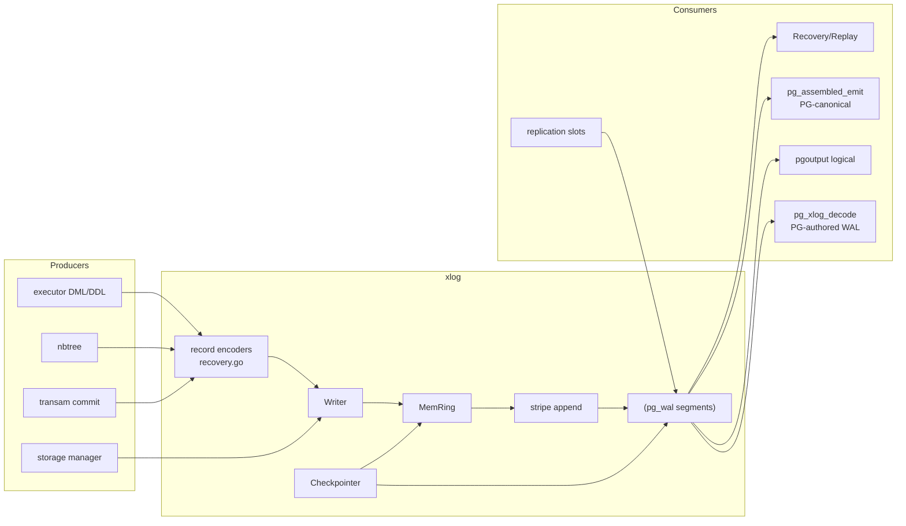
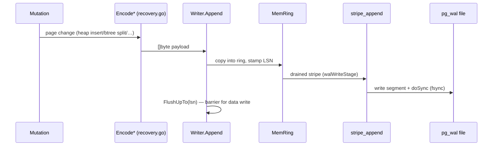
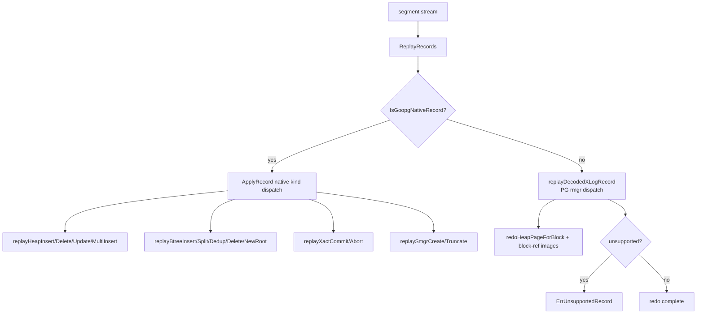
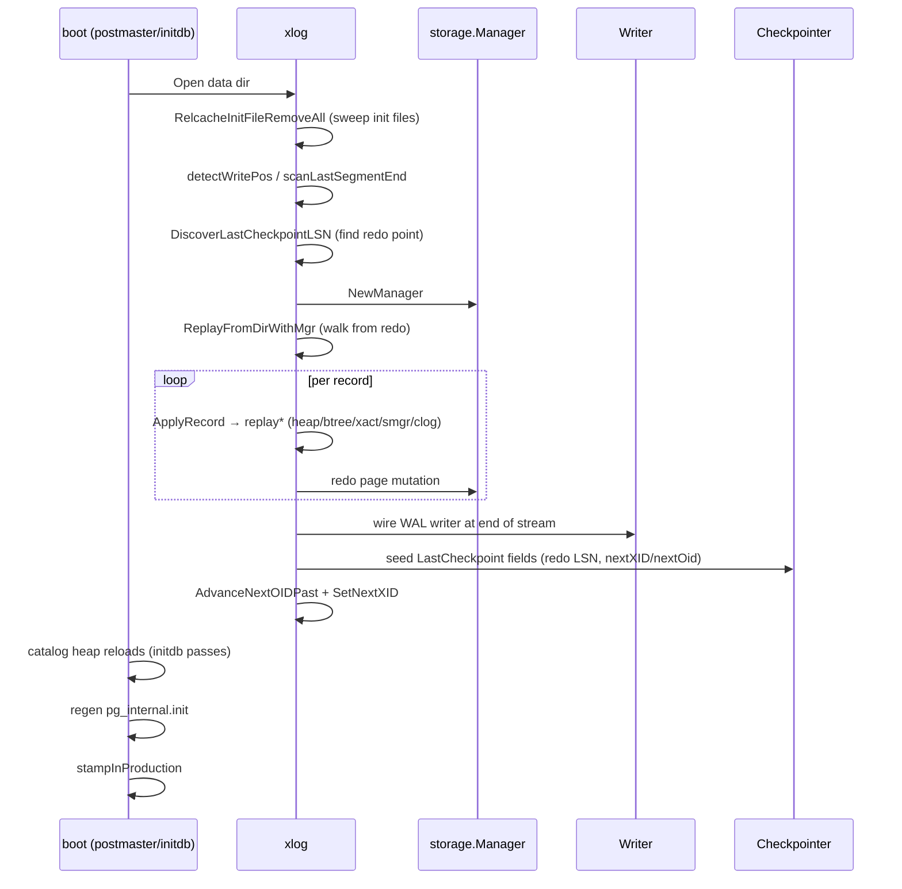
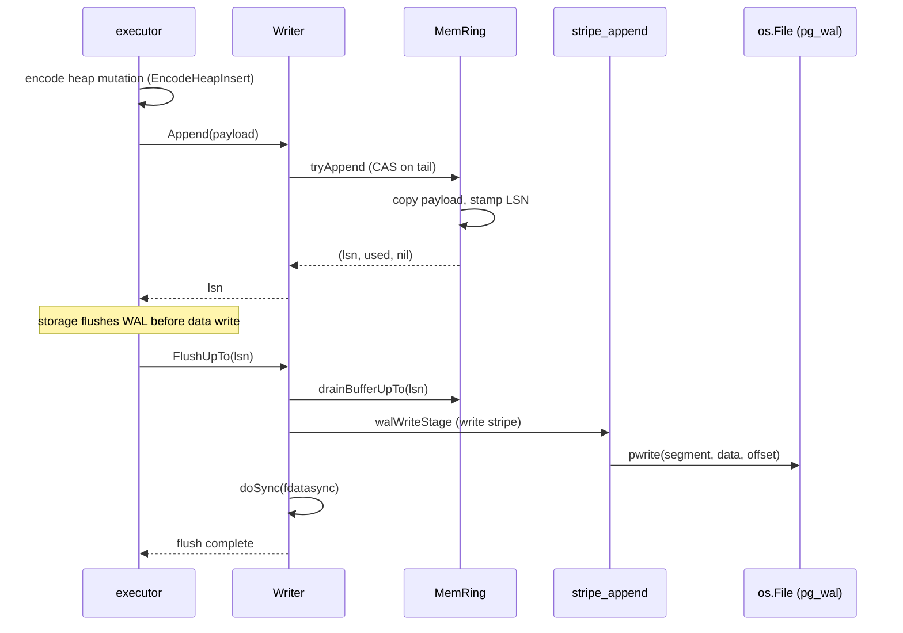
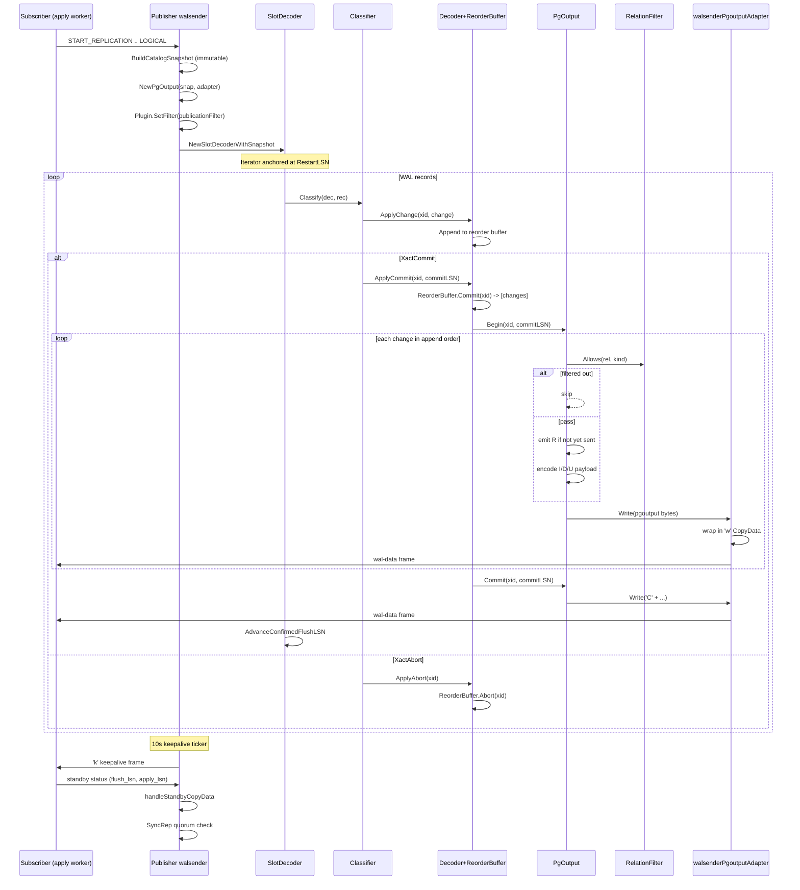
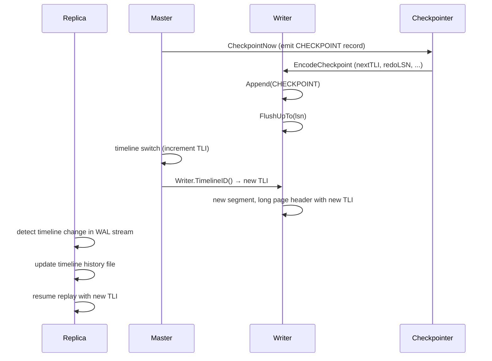

# Module: `internal/access/transam/xlog`

The **write-ahead log** — WAL record encoding, the append/emit path, segment
management, crash recovery / replay, and both physical and logical (pgoutput)
decoding. It is the Go analogue of PG's `src/backend/access/transam/`
(`xlog.c`, `xloginsert.c`, `xlogrecovery.c`, `xlogreader.c`) plus
`src/backend/replication/pgoutput`.

This is the durability spine: every page mutation is encoded as a WAL record,
appended to an in-memory ring buffer, and flushed to `pg_wal` segments ahead of
the data write (WAL-before-data). On restart, the same records are replayed to
reconstruct the cluster state. The same WAL is what a vanilla PG 18.3 standby
consumes for physical replication, and `pgoutput` re-encodes it for logical
replication.



## Key Files

| File | LOC | Role |
|---|---|---|
| `recovery.go` | 6,682 | Record codec (`Encode*`/`Decode*` per record kind) and the redo engine: `ApplyRecord`, `ReplayRecords`, `ReplayRecordsFrom`, per-rmgr `replay*` functions (heap, btree, xact, smgr, clog, tblspc, dbase), checkpoint encode/decode, PG-authored WAL replay |
| `writer.go` | 2,794 | The `Writer`: in-memory WAL ring buffer (`MemRing`), `Append`/`AppendRaw`, commit LSN, `FlushUpTo`, segment preallocation/recycling, `detectWritePos`/`scanLastSegmentEnd`, `RemoveOldSegments` retention |
| `pg_assembled_emit.go` | 1,456 | Encoding PG-canonical records (heap insert/update/delete, xact commit/abort) that a real PG 18.3 can consume |
| `checkpointer.go` | 1,122 | The checkpointer: periodic `CHECKPOINT` records, `CheckPointFields`, dirty-page flush orchestration, FPI watermark, segment-based pacing |
| `reader.go` | 627 | Segment reading: `readStream`, `readStreamFrom`, `readAllPageAware`, `endOfWAL` handling, `durableUnknownRecord` |
| `pg_xlog_decode.go` | 610 | Generic PG WAL-record decode (rmgr dispatch, block-ref decode, FPI handling) used for PG-authored WAL |
| `iterator.go` | 587 | `RecordIterator` over a live WAL stream (`readOneAt`, page-header decode, `parkUntilWake`) |
| `slots.go` | 523 | Replication slots: physical/logical slot persistence (`pg_replslot/`), `AdvanceConfirmedFlushLSN`, `MinRestartLSN`, `MinCatalogXmin` |
| `syncrep.go` | 416 | Synchronous replication: quorum/priority wait for standby acknowledgement |
| `pgoutput_decoder.go` | 399 | The inbound side: decode pgoutput messages for the apply worker |
| `xlog_page.go` | 368 | `XLogPageHeader`/`XLogLongPageHeader` encode/decode + `xlogPageValidator` — the "don't trust recycled segments" check |
| `stripe_append.go` | 362 | Batched stripe append of records into segments |
| `replmon.go` | 351 | Replication monitoring (LSN deltas, lag) |
| `stripe_writer_core.go` | 326 | Core stripe-writer: strip assembly + emit |
| `wal_buffer.go` | 311 | WAL buffer pool: reserved-byte publication, head/base atomics |
| `xlog_record.go` | 281 | `Record` struct and PG `XLogRecord` wire decode |
| `classifier.go` | 264 | Record classification (rmgr/kind/opcode → goopg action) |
| `format.go` | 262 | WAL page/record header structs, `encodeRecordXLog`, `XLogRecord` decode, segment-name formatting |
| `syncrep_parse.go` | 247 | syncrep GUC parsing (quorum/priority syntax) |
| `mem_ring.go` | 240 | The `MemRing` append window + drained pages |
| `mem_ring_concurrent.go` | 198 | Concurrent-safe ring publish (CAS on tail) |
| `subscriber_mon.go` | 224 | Subscriber lag monitoring |
| `retention.go` | 223 | Keep-horizon / segment retention computation |
| `xlog_emit.go` | 219 | Goopg-native record emit helpers |
| `index_am_refusal.go` | 202 | Refusal of unsupported index-AM WAL replay |
| `reorder.go` | 201 | Record reordering for subtransaction-safe replay |
| `stream_replayer.go` | 197 | Streaming replayer (replay while reading) |
| `insert_pos.go` / `insert_pos_publish.go` | 166/111 | Insert-position tracking + publish |
| `reserve_emitted.go` | 189 | Reserved-byte bookkeeping for emitted stripes |
| `xlog_assemble.go` | 189 | PG-canonical record assembly |
| `snapshot.go` | 139 | Catalog snapshot for logical decoding |
| `archive_recovery.go` | 141 | `recovery.signal` archive mode: `restore_command` fetch → replay → promote |
| `decoder.go` | 139 | Logical-decoding input framing |
| `reader_early_end.go` | 137 | Early-end-of-WAL detection |
| `publish_visibility.go` | 133 | Publish-visibility gating (WAL publish ↔ snapshot) |
| `pg_xact_parse.go` | 121 | PG xact record main-data parse |
| `seq_log.go` | 108 | Sequence WAL logging |
| `repllog.go` | 61 | Replication-log entry helpers |
| `rmgr_map.go` | 90 | PG rmgr-ID ↔ name/opcode mapping |
| `timeline_history.go` | 171 | Timeline history file handling |
| `slot_decoder.go` | 154 | Slot-backed logical decoding |
| `slots_pg.go` | 203 | PG-format slot file read/write |
| `archive_restore.go` | 61 | `restore_command` invoke + promote |
| `relmap.go` | 162 | Relation-map WAL records |
| `recovery_cache.go` | 90 | Per-database recovery cache |
| `segment_pad.go` / `segment_pad_emit.go` | 91/204 | Segment zero-padding before reuse |
| `tail_publisher.go` | 180 | WAL tail publishing to subscribers |
| `insertion_tracker.go` | 182 | Insert-position tracking for seek |
| `wal_write_lock.go` | 77 | Write-lock discipline around segment I/O |
| `padded_mutex.go` | 69 | Cache-line-padded mutex (CPU false-sharing guard) |
| `sync_linux.go` / `sync_other.go` | 28/26 | `fdatasync`/`fsync` platform wrappers |

## Public API

```go
// Writer (writer.go)
func NewWriter(cfg Config) (*Writer, error)
func (w *Writer) Append(payload []byte) (lsn uint64, used uint64, err error)
func (w *Writer) AppendRaw(stream []byte) (lsn uint64, used uint64, err error)
func (w *Writer) FlushUpTo(lsn uint64) error
func (w *Writer) WrittenLSN() uint64 / DrainedLSN() uint64
func (w *Writer) WalRecords() int64 / WalBytes() int64
func (w *Writer) RemoveOldSegments(keepLSN uint64) (removed, recycled int, err error)
func (w *Writer) Subscribe(ch chan<- struct{}) / Unsubscribe(ch chan<- struct{})
func (w *Writer) Close() error
func (w *Writer) MemRing() *MemRing
func (w *Writer) TimelineID() uint32 / Format() WALFormatVersion
func (w *Writer) SetCommitDelayUs(us int64) / SetCommitSiblings(n int)
func (w *Writer) SetWalWriterFlushAfter(bytes int64)
func (w *Writer) BackgroundWrite() error
func (w *Writer) PageHeadersEnabled() bool
func (w *Writer) WALBuffersCapacity() int64 / WALBuffersBytesResident() int64
func (w *Writer) WALBuffersOverflowDrainBytes() uint64 / WALBuffersFlushDrainBytes() uint64
func (w *Writer) FsyncCount() int64 / AddFsyncTimeNanos(n int64) / FsyncTimeNanos() int64
func (w *Writer) SegmentsPreallocated() int64 / PreallocatedBytes() int64
func detectWritePos(walDir string, segSize int64, pageHeaders bool) (int64, uint64, error)
func scanLastSegmentEnd(walDir string, segNo uint64, tli uint32, segSize int64, cfgSegSize int64, pageHeaders bool) (int64, uint64, error)

// Recovery (recovery.go)
func ReplayRecords(mgr *storage.Manager, records []Record) (ReplayStats, error)
func ReplayRecordsFrom(mgr *storage.Manager, records []Record, redoLSN uint64) (ReplayStats, error)
func ApplyRecord(mgr *storage.Manager, r Record) (bool, error)   // redo one record
func IsGoopgNativeRecord(r Record) bool
func headerMatchesEmittedKind(r Record) bool
func ExportedReplayStart(records []Record) (int, uint64)
type ReplayStats struct{ /* counts by record kind, total bytes, redo start/end */ }

// Record encoders (recovery.go)
func EncodeHeapInsert(rel, blk, lineSlot, tuple) []byte
func EncodeHeapDelete(rel, blk, lineSlot, xmax, oldTuple) []byte
func EncodeHeapHotUpdate(rel, blk, oldSlot, xmax, tupleBytes) []byte
func EncodeHeapUpdate(p HeapUpdatePayload) []byte
func EncodeHeapMultiInsert(p HeapMultiInsertPayload) []byte
func EncodeHeapPruneOpt(rel, blk, redirects, unused) []byte
func EncodeHeapFreeze(rel, blk, frozenSlots) []byte
func EncodeHeapLock(rel, blk, lineSlot, xmax, lockStrength) []byte
func EncodeHeapVisible(p HeapVisiblePayload) []byte
func EncodeSmgrCreate(rel) []byte / EncodeSmgrTruncate(rel) []byte
func EncodeSmgrTruncateTo(rel, nBlocks) []byte
func EncodeBtreeInsert(rel, blk, offnum, item) []byte
func EncodeBtreeSplit(rel, leftBlk, rightBlk, leftPage, rightPage, sibBlk, sibPage) []byte
func EncodeBtreeVacuum(rel, blk, keptItems, opaqueFlags) []byte
func EncodeBtreeUnlinkPage(p BtreeUnlinkPagePayload) []byte
func EncodeBtreeNewRoot(p BtreeNewRootPayload) []byte
func EncodeBtreeMarkPageHalfDead(p BtreeMarkHalfDeadPayload) []byte
func EncodeBtreeReusePage(p BtreeReusePagePayload) []byte
func EncodeBtreeMetaCleanup(p BtreeMetaCleanupPayload) []byte
func EncodePageImage(rel, blk, page) []byte / DecodePageImage(payload)
func EncodeXactCommit(xid) []byte / EncodeXactAbort(xid) []byte
func EncodeXactAssignment(parentXid, subXids) []byte
func EncodeXactRollbackTo(parentXid, abortedSubXids) []byte
func EncodeXactSubAbort(subXid) []byte
func EncodeClogTruncate(xid) []byte
func EncodeCheckpoint() []byte / EncodeCheckpointCompat(redoLSN0, tli, nextXid, nextOid)
func ProcessCommittedInvalidationMessages(dataDir string, dboid uint32) error

// Reader (reader.go)
func readStream(walDir string, segSize int64) ([]byte, error)
func readStreamFrom(walDir string, segSize int64, firstSegNo uint64) ([]byte, error)
func readAllUncached(walDir string, segmentSize int64) ([]Record, error)
func IsValidWalSegSize(size int64) bool
func liveSegmentRunStart(segNos []uint64) uint64

// Iterator (iterator.go)
func NewRecordIterator(w *Writer, walDir string, segSize int64, startLSN uint64) (*RecordIterator, error)
func (it *RecordIterator) Next(ctx context.Context) (Record, error)
func (it *RecordIterator) NextRaw(ctx context.Context, maxBytes int) (RawChunk, error)
func (it *RecordIterator) AtEndOfWAL() bool
func (it *RecordIterator) Close() error

// Logical decoding (pgoutput.go)
func NewPgOutput(snap *CatalogSnapshot, w io.Writer) *PgOutput
func (p *PgOutput) SetFilter(f RelationFilter)
func (p *PgOutput) Begin(xid, commitLSN) error
func (p *PgOutput) Commit(xid, commitLSN) error
func (p *PgOutput) Change(c Change) error     // relation/insert/update/delete dispatch
type RelationFilter interface{ RelationRel(oid uint32) bool }

// Slots (slots.go)
func OpenSlots(dataDir string) (*Slots, error)
func (s *Slots) Create(name, kind, startLSN) (*Slot, error)
func (s *Slots) CreateLogical(name, plugin, database, startLSN) (*Slot, error)
func (s *Slots) Drop(name) error
func (s *Slots) Get(name) (Slot, error) / List() []Slot
func (s *Slots) AdvanceConfirmedFlushLSN(name, lsn) error
func (s *Slots) SetActive(name, active) error
func (s *Slots) MinRestartLSN() uint64 / MinCatalogXmin() uint64
func (s *Slots) InvalidateLagging(currentLSN, maxKeepBytes) ([]string, error)

// Checkpointer (checkpointer.go)
func NewCheckpointer(flusher DirtyPageFlusher, wal checkpointWAL, cfg CheckpointerConfig) *Checkpointer
func (c *Checkpointer) Run(ctx context.Context) error
func (c *Checkpointer) CheckpointNow() error / CheckpointShutdown() error
func (c *Checkpointer) LastCheckpointLSN() / LastCheckpointRedoLSN() / LastCheckpointRecordLSN() uint64
func (c *Checkpointer) SetInterval(d) / SetMaxWALBytes(b) / SetRetainer(r) / SetCompletionTarget(t)
func (c *Checkpointer) SetNextMultiXactFn(fn func() (next, nextOffset, oldest uint32))

// WAL page format (xlog_page.go, format.go)
func EncodeXLogPageHeader(dst, h) error / DecodeXLogPageHeader(src) (XLogPageHeader, error)
func EncodeXLogLongPageHeader(dst, h) error / DecodeXLogLongPageHeader(src)
func XLogFileName(tli, segno, segSize) string
func ParseXLogFileName(name, segSize) (tli, segno, ok)
func encodeRecordXLog(payload []byte, prev uint64) ([]byte, int, error)
func decodeRecordXLog(stream []byte) ([]byte, int, error)
func classifyXLogRecord(payload []byte) (Rmgr, uint8, uint32)
func FormatSegmentName(segNo uint64) string / FormatSegmentNameTLI(segNo, tli) string
```

## Internal structure

### Append path

An executor/storage mutation calls the record encoder (`recovery.go`'s
`Encode*`), producing a `Record`. `Writer.Append` copies it into the shared
ring buffer (`MemRing`), stamps the LSN, and notifies subscribers. `FlushUpTo`
drains the ring, `xlogWrite`/`walWriteStage`/`walSyncStage` write the segments
and fsync; `commit_delay`/`commit_siblings` throttle the flush.



- `Append` (single record) vs `AppendRaw` (pre-assembled stream) — `AppendRaw`
  bypasses the per-record header wrap, used by the standby/streaming path.
- `mem_ring_concurrent.go` publishes a drained tail with CAS; `tryAppend`/
  `append` are the two insertion paths (`wal_buffer.go` tracks
  reserved bytes against the write frontier).

### Record layout

Each record has a header (`RecordKind` byte + flags + payload length +
`xl_prev` backpointer) and an optional body; `format.go` keeps the wire layout
PG-compatible. For PG-authored WAL the `XLogRecord` header is decoded with
`SizeOfXLogRecord` (24 bytes, the only header-size constant in `format.go`) and
the block-ref trailer. Record kinds cover:

- **heap**: insert, delete, update, multi-insert, hot-update, lock, prune-opt,
  freeze, visible, vacuum (dead-slot list)
- **smgr**: create, truncate, truncate-to
- **btree**: insert, split, vacuum, unlink-page, new-root, mark-page-halfdead,
  reuse-page, meta-cleanup
- **xact**: commit, abort, assignment, rollback-to, sub-abort, marker
- **clog**: truncate
- **checkpoint**: redo LSN + nextXid/nextOid/tli (+ nextMultiXact/nextMultiOffset)
- **misc**: page image (FPI), relation-map change

`classifier.go` maps (rmgr, opcode) → goopg record kind; `rmgr_map.go` maps
PG rmgr IDs ↔ names. `record_kind_rmgr_mapping_test.go` pins the correspondence.

### Recovery / replay

`ReplayRecords` walks the segment stream, `ApplyRecord` dispatches per
`RecordKind` to `replay*` functions that re-run the mutation against
`storage.Manager` pages (heap insert/delete/update/multi-insert, btree
split/insert/dedup/delete, xact commit/abort, smgr create/truncate, clog
zero-page/truncate, tblspc/dbase create/drop, page images). PG-authored WAL
goes through `pg_xlog_decode`'s rmgr dispatch with block-ref/FPI handling.



- `redoHeapPageForBlock` locates/initializes the block before applying
  `XLOG_HEAP_*` records; `reconstructMarshaledTupleFromHeader` rebuilds a heap
  tuple from the record's header + data split (the PG marshaled-tuple layout).
- Subtransactions: `EncodeXactAssignment`/`EncodeXactRollbackTo`/
  `EncodeXactSubAbort` let replay walk parent XIDs; `reorder.go` reorders
  records so subtransaction-abort effects replay in the correct order.
- `ProcessCommittedInvalidationMessages` applies relcache invalidation messages
  committed in a transaction, so a goopg restart invalidates the right
  relations even for PG-authored WAL.

### Checkpointer

The checkpointer goroutine periodically emits a `CHECKPOINT` record embedding
`CheckPointFields` (redo LSN, nextXID/nextOid, timeline) and flushes dirty
buffers, advancing the recovery horizon. Segment-based pacing: the interval and
max-WAL-bytes GUCs are converted into a `checkpointSegments` budget, and a
pacer spreads the dirty-page flush across the checkpoint duration (a
completion target that front-loads or backs off based on WAL volume).
`volumeTriggerFires` forces a checkpoint early when WAL bytes exceed the
threshold. The FPI watermark lives on `Slot.nativeImageLSN` (see storage).

### Slots

`Slots` persists physical/logical replication slots to `pg_replslot/` using the
PG slot-file format (`slots_pg.go`); logical slots track `ConfirmedFlushLSN`
and `MinRestartLSN` so WAL is retained while a consumer lags.
`MinCatalogXmin`/`AdvanceCatalogXmin` guard catalog-tuple WAL (catalog_xmin
slot concept); `InvalidateLagging` drops slots whose restart LSN falls too far
behind. `slot_decoder.go` bridges a logical slot to `PgOutput`.

### WAL page / segment format

The on-disk WAL is a stream of 8 KiB pages (`XLOG_BLCKSZ`), each preceded by an
`XLogPageHeader` (or `XLogLongPageHeader` for the first page of a segment) when
`pageHeaders=true`. Key fields:

- **`XLogPageHeader`**: `xlp_magic` (0xD086), `xlp_info` (flags: first/continuation/overwrite-recovery), `xlp_tli`, `xlp_pageaddr` (the page's LSN address), `xlp_rem_len` (bytes of a record continuing onto this page)
- **`XLogLongPageHeader`**: extends with `xlp_seg_size`, `xlp_xlog_blcksz` — written once per segment
- **`XLogRecord`** (PG-canonical): `xl_tot_len`, `xl_xid`, `xl_prev`, `xl_info` (rmgr|flags), `xl_rmid`, then main data + block-ref array + FPI data
- **Segment naming**: `00000001` (TLI) + `00000000` (log) + `00000001` (seg) + `.00000028.backup` suffixes for backups

goopg-native records (`IsGoopgNativeRecord`) use a compact `RecordKind`-byte
header; PG-authored records use the full `XLogRecord` wire format. The two are
distinguished at read time by `classifyXLogRecord`, and the codec must never
mistake one for the other (`format_mismatch_test.go`).

### Recovery flow (cold start)



The recovery entry points are `ReplayRecords(mgr, records)`,
`ReplayRecordsFrom(mgr, records, redoLSN)`, and
`ReplayFromDirWithMgr(mgr, walDir, segmentSize)`. `ExportedReplayStart` gives a
caller the byte/record offset to resume an interrupted replay.

### Segment lifecycle

`detectWritePos`/`scanLastSegmentEnd` find the real end of WAL (not trusting
recycled segments — `xlog_page.go`'s validator checks `xlp_pageaddr`, TLI, and
segment size, and `isPreallocatedTail` treats a known zero pattern as "not yet
written"). Segments are preallocated by `eagerPreallocSegment` (a background
worker writes the zero fill) and recycled by `recycleSegmentFile` (rename +
rezero, `segment_pad.go`); `RemoveOldSegments` applies the retention horizon
(`retention.go`). `FormatSegmentName`/`FormatSegmentNameTLI` and `parseSegmentName`
handle the `000000010000000000000001` naming scheme.

The Writer's `Config` struct specifies segment size (default 16 MB), WAL
buffers capacity, `pageHeaders` flag (whether to emit PG-format page headers),
and the `SegmentSize` config field. `IsValidWalSegSize` checks that the size is a
power of 2 between 1 MB and 1 GB.

## Key flow: WAL record append and flush



## Dependencies

- **Used by** — `internal/storage` (WAL flush barrier, `WALFlusher`),
  `internal/access/transam` (commit records), `internal/access/nbtree`
  (index WAL), `internal/executor` (DDL/DML WAL via storage),
  `internal/initdb` (WAL bootstrap, recovery), `internal/replication`
  (walsender), `internal/backup`, `internal/postmaster`.
- **Uses** — `internal/storage` (pages, `Manager` for redo), `internal/port/runtimeshim`
  (nanotime), `internal/utils/activity/stats` (counters),
  `internal/utils/misc` (GUCs like `wal_level`, `synchronous_commit`,
  `wal_compression`), `internal/access/transam` (xid visibility during replay).

## Notable patterns / gotchas

- **WAL-before-data** — a page mutation must be WAL-logged (and flushed to the
  record's LSN) before the data page write is made durable; `storage.flushSlot`
  flushes to `max(pd_lsn, hintFlushBarrier)`.
- **`xl_prev` chain** — every record back-points to the previous one; the
  reader/`pg_waldump` validate it. A gap from a recycled segment breaks the
  chain, which `xlog_page.go`'s validator prevents.
- **Record-kind registry** — `RecordKind*` constants in `recovery.go` are the
  goopg-native encoding; `IsGoopgNativeRecord` distinguishes them from
  PG-canonical records. The two codecs must agree with `headerMatchesEmittedKind`.
- **Unsupported PG records** — `unsupportedDecodedXLogOpcode` refuses
  PG-authored records goopg cannot replay (2PC, `HEAP2_REWRITE`, unknown
  opcodes) with `ErrUnsupportedRecord`, so a crash tail never silently "ends"
  early (`durableUnknownRecord`).
- **`endOfWAL` ambiguity** — a torn/zero/CRC-failed tail is end-of-WAL; a
  decodable-but-unhandled record is an error the caller must see (the two were
  once conflated — the S16 data-loss class).
- **PG-identical emission** — `pg_assembled_emit.go` and `pgoutput.go` must
  produce byte-identical output to a real PG 18.3 (a vanilla standby replays
  goopg WAL; a real publisher's pgoutput is decoded by the apply worker).
  `pg_waldump_compat_test.go` and the `*_pg_test.go` files pin this against
  PG-captured record streams.
- **Retention** — never delete a segment still reachable from a standby or
  logical slot (`MinRestartLSN`); `RemoveOldSegments` respects the max
  `MinRestartLSN` across slots.
- **`padded_mutex`** — the WAL append path is a hot contention point; a plain
  mutex sharing a cache line with other writers causes false-sharing
  thrashing. `tryAppend` paths are lock-free CAS where possible.
- **`wal_write_lock`** — segment writes must serialize across goroutines; the
  write lock is taken for the whole write+sync stage so `FlushUpTo` barriers
  hold their LSN ordering.
- **Segment preallocation is eager, not lazy** — `eagerPreallocSegment` zeroes
  a future segment in a background worker so the write path never blocks on
  allocation mid-commit; `predictXLogRecordLen`/`predictEmittedSize`
  reserve the exact bytes a record will occupy before the ring append.
- **The redo path is the second writer** — every `replay*` mutation mutates
  pages the same way the primary path does, including pd_lsn stamping
  (`redoHeapPageForBlock` sets the page LSN to the record's end LSN). A redo
  that skips stamping breaks the `pd_lsn` completeness invariant
  (`GOOPG_PDLSN_ASSERT`).
- **Torn-tail tolerance** — `reader_early_end.go` and the `isPreallocatedTail`
  check distinguish "segment was preallocated but never written" from "record
  was torn"; `drain_safety_stress_test.go` exercises the concurrent drain path.
- **Streaming replay** — `stream_replayer.go` replays records as they arrive
  (for `pg_basebackup`/PITR restore) rather than after a full read; reorder.go
  buffers subtransaction-boundary records so abort effects apply in order.
- **Logical decoding needs a catalog snapshot** — `PgOutput`'s `RelationFilter`
  decides which relations emit; `snapshot.go` freezes a catalog snapshot so
  the decode doesn't race DDL.
- **`AIOEngine` interface** — the Writer can optionally use an io_uring engine
  for async segment writes. The `Config.AIOEngine` field wires it at startup;
  without it, segment writes are synchronous `pwrite` + `fdatasync`.
- **`RemoveOldSegmentsWithEstimate`** — the checkpointer can call
  `RemoveOldSegmentsWithEstimate` with a distance-estimate and completion target
  to pace segment recycling, avoiding a burst of I/O when many segments are freed
  at once.
- **`drainReason` enum** — the drain path records why a buffer drain was
  triggered (overflow, flush, shutdown) via `drainReason` counters for telemetry.

## Record kind constants (`recovery.go`)

The goopg-native record kinds are defined as `RecordKind` constants:

| Kind | Value | Payload |
|---|---:|---|
| `RecordKindHeapInsert` | 0x01 | rel, blk, lineSlot, tuple |
| `RecordKindHeapDelete` | 0x02 | rel, blk, lineSlot, xmax, oldTuple |
| `RecordKindHeapUpdate` | 0x03 | rel, oldBlk, oldSlot, newBlk, newSlot, xmax, tuple |
| `RecordKindHeapHotUpdate` | 0x04 | rel, blk, oldSlot, xmax, tuple |
| `RecordKindHeapMultiInsert` | 0x05 | rel, blk, slots, tuples |
| `RecordKindHeapLock` | 0x06 | rel, blk, lineSlot, xmax, lockStrength |
| `RecordKindHeapPruneOpt` | 0x07 | rel, blk, redirects, unused |
| `RecordKindHeapFreeze` | 0x08 | rel, blk, frozenSlots |
| `RecordKindHeapVisible` | 0x09 | rel, blk, heapBlk |
| `RecordKindHeapVacuum` | 0x0A | rel, blk, deadSlots |
| `RecordKindSmgrCreate` | 0x0B | rel |
| `RecordKindSmgrTruncate` | 0x0C | rel |
| `RecordKindSmgrTruncateTo` | 0x0D | rel, nBlocks |
| `RecordKindBtreeInsert` | 0x0E | rel, blk, offnum, item |
| `RecordKindBtreeSplit` | 0x0F | rel, leftBlk, rightBlk, leftPage, rightPage, sibBlk, sibPage |
| `RecordKindBtreeVacuum` | 0x10 | rel, blk, keptItems, opaqueFlags |
| `RecordKindBtreeUnlinkPage` | 0x11 | rel, blk, leftBlk, rightBlk, btvac |
| `RecordKindBtreeNewRoot` | 0x12 | rel, rootBlk, rootPage, leftChildBlk, metaBlk, metaPage |
| `RecordKindBtreeMarkPageHalfDead` | 0x13 | rel, blk, leftBlk, rightBlk, leftChild, rightChild |
| `RecordKindBtreeReusePage` | 0x14 | rel, blk, lastRecycledXid |
| `RecordKindBtreeMetaCleanup` | 0x15 | rel, blk |
| `RecordKindXactCommit` | 0x16 | xid |
| `RecordKindXactAbort` | 0x17 | xid |
| `RecordKindXactAssignment` | 0x18 | parentXid, subXids |
| `RecordKindXactRollbackTo` | 0x19 | parentXid, abortedSubXids |
| `RecordKindXactSubAbort` | 0x1A | subXid |
| `RecordKindXactMarker` | 0x1B | xid, marker |
| `RecordKindClogTruncate` | 0x1C | xid |
| `RecordKindPageImage` | 0x1D | rel, blk, page |
| `RecordKindCheckpoint` | 0x1E | CheckPointFields |
| `RecordKindCheckpointCompat` | 0x1F | redoLSN, tli, nextXid, nextOid |
| `RecordKindRelmap` | 0x20 | relmap data |
| `RecordKindSeqLog` | 0x21 | seq data |

## PG-canonical emission (`pg_assembled_emit.go`)

When `pageHeaders=true` (the default for PG-compatible WAL), records are
emitted in PG's `XLogRecord` format. The assembly path:

1. `xlog_assemble.go` wraps the raw payload in a PG `XLogRecord` header
   (xl_tot_len, xl_xid, xl_prev, xl_info, xl_rmid).
2. `xlog_emit.go` orchestrates the assembly and passes the result to the
   state's `appendPGCompat` method.
3. The PG header adds 24 bytes per record (for the `XLogRecord` struct) plus
   block-ref arrays when needed.

`pg_assembled_emit.go` provides the per-record-kind encoders that produce
PG-canonical output: `EncodeHeapInsertPG`, `EncodeHeapUpdatePG`,
`EncodeHeapDeletePG`, `EncodeXactCommitPG`, `EncodeXactAbortPG`, etc.

## Writer state machine (`writer.go`)

The `Writer` has a `state` struct for the append path:

```go
type state struct {
    mu         sync.Mutex
    writeLock  paddedMutex  // serializes segment writes
    walFile    *os.File
    segNo      uint64
    segOffset  int64
    tail       uint64   // next LSN to write
    head       uint64   // oldest LSN still in ring
    // ...
}
```

`tryAppend` is the lock-free fast path: it CAS-increments the ring head,
copies the payload, and returns the LSN. If the ring is full, it falls back
to `append`, which acquires the write lock and drains the ring
before retrying.

`append` is the general path: it reserves bytes in the ring, copies the
payload, and publishes the new tail. `appendPGCompat` does the same but
with PG-format headers.

`drainBufferBytes` is called when the ring is full: it writes the reserved
bytes to the current segment, advances the write LSN, and notifies
subscribers. `drainBufferUpTo` drains everything up to a target LSN (used
by `FlushUpTo`).

## Checkpointer (`checkpointer.go`)

The checkpointer is a dedicated goroutine that periodically advances the
recovery horizon by (1) computing and publishing a redo pointer, (2) flushing
every dirty buffer so the data files are consistent as of that pointer, and
(3) writing a durable `CHECKPOINT` record + `pg_control` update. It is the
goopg analogue of PostgreSQL's `checkpointer` process.

### Struct and configuration

```go
type Checkpointer struct {
    interval        time.Duration  // checkpoint_timeout
    maxWALBytes     int64          // max_wal_size
    minWALBytes     int64          // min_wal_size
    completionTarget float64       // checkpoint_completion_target (default 0.9)
    intervalOverrideNS atomic.Int64 // reloaded checkpoint_timeout
    volumeAnchor    atomic.Uint64  // pre-first-checkpoint WrittenLSN anchor
    lastCheckpointStartLSN, lastCheckpointRedoLSN, lastCheckpointLSN atomic.Uint64
    // ...
}
```

Key configuration (`CheckpointerConfig` / `GUCParameters`): `Interval`
(`checkpoint_timeout`, default 5 min), `MaxWALBytes`/`MinWALBytes`
(`max_wal_size`/`min_wal_size`), `CompletionTarget`
(`checkpoint_completion_target`), `SegmentSize`, `VolumeCheckInterval`
(how often the volume trigger polls), `WalLevel`, and `PGCompatCheckpoints`
(whether to emit PG-canonical online checkpoint records). The flusher is any
`DirtyPageFlusher` — in the live server the buffer pool (`Pool`), which also
implements `pacedFlusher` (`FlushAllPaced`) and `dataFileSyncer`
(`SyncAllDataFiles`).

### The `Run` loop

`Run(ctx)` uses a **timer** (not a ticker) so a reloaded `checkpoint_timeout`
is picked up at the next fire via `effectiveInterval()`. Each loop iteration
selects on three channels:

1. **`timer.C`** — a timeout checkpoint is due. Before running, the idle-skip
   check (PG `xlog.c:7005-7019`) compares the writer's `WrittenLSN()` against
   `lastCheckpointStartLSN`; if nothing was written since the last checkpoint
   (and the writer implements `volumeReporter` — true in production — and
   `lastCheckpointStartLSN != 0`), it is a no-op and the timer just resets. Otherwise it calls
   `runCheckpoint(ctx, spread=true, shutdown=false)` — the *scheduled* (spread)
   path.
2. **`volumeC`** — a ticker that only exists when `MaxWALBytes > 0` and the
   writer implements `volumeReporter` (`WrittenLSN()`). On each tick,
   `volumeTriggerFires(vr)` checks whether the distance since the last
   checkpoint's redo exceeds `max_wal_size` in segment terms
   (`elapsedSegmentsNeeded()` = `checkpointSegments - 1`). If it fires, the checkpoint runs at
   **immediate** speed (`spread=false`): `max_wal_size` is a backpressure
   signal, not a cadence knob.
3. **`ctx.Done()`** — return cleanly (shutdown path calls `CheckpointShutdown`
   separately).

Before entering the loop, the volume anchor is seeded from the writer's
`WrittenLSN()` so the first `max_wal_size` window is measured from a real
position; the `OnLoopStart`/`OnLoopEnd` hooks fire only after the anchor is
stored (AI-20260813-005117-008).

### `runCheckpoint` — the core sequence

`runCheckpoint(ctx, spread, shutdown)` performs, in order:

1. **Build the pacer** — `buildPacer(ctx, spread, start)` returns a
   per-buffer delay closure aiming to finish the writeback at
   `start + Interval * CompletionTarget`. It returns `nil` when spreading is
   disabled or the inputs are degenerate, in which case the flush runs at
   immediate speed.
2. **Sample and publish the redo pointer BEFORE the flush** (the
   perf-optimize3-dash/03 ordering that mirrors PG's `CreateCheckPoint`). The
   `computeRedo` closure derives the 0-based redo from the writer's
   `WrittenLSN()` plus the page-header prefix for the next record. When
   `PGCompatCheckpoints && !shutdown`, the redo is instead established by
   **appending an `XLOG_CHECKPOINT_REDO` record** — its start LSN minus one
   becomes the redo pointer, exactly like upstream `CreateCheckPoint`
   (`xlog.c:7087-7099`); PG17+ recovery validates this record at
   `CheckPoint.redo`. The append happens inside the FPI barrier's critical
   section so no torn-page-relevant record can land between the sampled redo
   and the published one.
   `PublishRedoBarrier(sampleRedo)` waits out every in-flight
   FPI-decision→append section before sampling, then publishes the frontier.
3. **Flush dirty pages** — `flushDirty(pacer)` calls `FlushAllPaced(pacer)`
   when the flusher supports it, else `FlushAll()`. The pacer is consulted
   between buffer batches so the writeback is spread across the
   `Interval*CompletionTarget` window.
4. **Flush the CLOG buffer pool** — `FlushCLOGFn` (if wired) drains the
   clog's dirty pages in the same phase; an error here fails the checkpoint
   rather than being swallowed (M0117-0007 Part B).
5. **Sync all data files** — `SyncAllDataFiles()` fdatasyncs every relfile so
   the flushed bytes are durable before the checkpoint LSN advances
   (M0089-0001; without this, a crash between the pwrite and the next OS flush
   could rewind the data files while WAL replay believed them applied).
6. **Record this cycle's redo distance** — `updateCheckPointDistanceEstimate`
   feeds a moving average that `SlotAwareRetainer` consults for
   `XLOGfileslop`-style WAL recycling.
7. **Sample the live counters ONCE** — `nextXid` (from the MVCC manager),
   `nextOid` (from the catalog), timeline, `full_page_writes`, `wal_level`,
   and the multixact counters (`nextMulti`/`nextMultiOffset`/`oldestMulti`),
   all before the record is encoded so the checkpoint record and the
   `pg_control` copy cannot disagree (M0131-S18.3/.4).
8. **Append the checkpoint record** — in PG-compat mode an online checkpoint
   first appends an `XLOG_RUNNING_XACTS` record (`LogStandbySnapshot`
   analogue) so a hot-standby PG recovering from this redo reaches
   `STANDBY_SNAPSHOT_READY`; shutdown checkpoints skip it and stamp
   `oldestActiveXid = InvalidTransactionId`. Then the `CHECKPOINT` record
   itself is appended (`EncodeCheckpointPGFields` with the explicit
   ONLINE/SHUTDOWN opcode) and flushed to its end LSN. The native path uses
   `EncodeCheckpoint`.
9. **Publish the checkpoint LSNs** — `lastCheckpointRedoLSN` (the **redo**
   pointer computed at step 2, stored 1-based) and `lastCheckpointLSN` (the
   checkpoint record's own end LSN) are stored. Recovery and `BASE_BACKUP`
   begin at the redo, not the record, so records in the `(redo, record]`
   window — state the flush may not have captured, e.g. a commit acked
   mid-flush — are still covered.
10. **Update `pg_control`** — `control.UpdateControlFile` writes
    `CheckPoint`, `CheckPointCopyRedo`, the sampled TLI/nextXid/nextOid/
    multixact fields, and sets `State = DB_SHUTDOWNED` (shutdown) or
    `DB_IN_PRODUCTION` (live). External tools (`pg_resetwal`/`pg_rewind`/
    `pg_controldata`) gate on this byte to decide whether recovery is
    required.

### The pacer

`buildPacer` returns `nil` when spreading is disabled (a scheduled checkpoint
with `CompletionTarget <= 0` or `Interval <= 0`). Otherwise it returns a
closure that, given the flush progress `0..1`, sleeps until
`start + CompletionTarget*Interval*progress` — front-loading nothing and
backing off the tail of the writeback so the last buffer lands just before the
completion target. `volumeTriggerFires` (step 2 of `Run`) compares the WAL
distance since the last redo against `checkpointSegments` (= `max_wal_size /
(1 + checkpoint_completion_target) / SegmentSize`); `elapsedSegmentsNeeded`
is its helper (returns `checkpointSegments - 1`, floored at 1) for the
segment math.

### Synchronous paths

- **`CheckpointNow`** — the synchronous path for the `CHECKPOINT` SQL command
  and explicit operator requests. It runs a full checkpoint immediately
  (spread=false) and returns only after the record + pg_control are durable.
- **`CheckpointShutdown`** — the shutdown checkpoint: spread=false,
  shutdown=true, so `State = DB_SHUTDOWNED` and a subsequent startup knows the
  cluster was cleanly stopped. Shutdown checkpoints keep the sampled-frontier
  redo (no `XLOG_CHECKPOINT_REDO` marker), because no WAL may be written
  between a shutdown checkpoint's redo and its record — the record itself
  marks the redo point, mirroring upstream's comment in `xlog.c`.

### Idle-skip and volume semantics

A timeout checkpoint is skipped when the writer's `WrittenLSN()` has not
advanced past `lastCheckpointStartLSN` (nothing new to flush). FORCE,
shutdown, and volume-triggered checkpoints never take this shortcut. The
volume trigger only exists when both `MaxWALBytes > 0` and the writer can
report its written LSN; polling once per second between timeout ticks is
deliberate, since checkpoints take far longer than that.

## Replication slot persistence (`slots_pg.go`)

Slots are persisted to `pg_replslot/<name>/state` using the PG slot-file
format. The file contains:

```
slot_name|plugin|database|two_phase|failover|wal_level|reserve_lsn|restart_lsn|confirmed_flush|catalog_xmin|...
```

`OpenSlots` reads all slot files from the directory. `Create`/`CreateLogical`
write a new slot file. `Drop` removes the file. `AdvanceConfirmedFlushLSN`
updates the confirmed flush LSN in the slot file atomically.

## SyncRep (`syncrep.go`)

Synchronous replication mode: `SyncRepMode` is `SyncRepOff`, `SyncRepRemoteWrite`,
`SyncRepRemoteFlush`, or `SyncRepRemoteApply`. `syncrep_parse.go` parses the `synchronous_standby_names`
GUC into a list of standby names with quorum/priority syntax.

`WaitForLSN` blocks the committing backend until the standby acknowledges
receipt past the commit LSN. The wait is on a condition variable that the
standby's feedback wakes up.

## Reorder buffer (`reorder.go`)

`reorder.go` reorders WAL records for subtransaction-safe replay. When a
subtransaction commits, its records are released to the replayer in commit
order. When a subtransaction aborts, its records are discarded. This is
essential for consistency: without reordering, a subtransaction's updates
might be replayed before its parent's updates, producing a visible but
inconsistent state.

## Streaming replication

Streaming replication is the standby path where WAL is forwarded from the
primary to a live standby as it is written, and applied continuously. It
spans three cooperating pieces: the **walsender** (`internal/replication/
walsender.go`), the **walreceiver** (`internal/replication/walreceiver.go`),
and the **stream replayer** (`stream_replayer.go`). The wire protocol is the
PostgreSQL v3 replication protocol (COPY BOTH mode).

### The walsender side (primary)

`Handler.replyStartReplication` serves the `START_REPLICATION` command:

1. **Parse** — `parseStartReplicationArgs` parses `START_REPLICATION
   PHYSICAL|LOGICAL <startLSN> [SLOT s] [(options)]`. `PHYSICAL` is the
   default when the mode keyword is omitted.
2. **Timeline validation** — a requested TLI must not exceed the current
   timeline (`s.cfg.Timeline`); an older TLI serves WAL up to the switch
   point recorded in the history file, then EOF. TLI > 1 historical reads
   need the segment-naming migration (M0130-S8.3x).
3. **Slot activation** — when a slot name is given, `Slots.SetActive`
   marks it active for the stream and it is cleared on exit.
4. **Enter COPY BOTH** — `WriteCopyBothResponse(0, nil)` hands the
   connection over to streaming mode. LOGICAL mode diverts to
   `runLogicalWalsender` (the `SlotDecoder` + `PgOutput` pipeline); the
   physical path continues here.
5. **Build the iterator** — `xlog.NewRecordIterator(s.cfg.WAL, walDir,
   segSize, args.StartLSN)` walks the WAL from the requested LSN.
6. **Observability** — the walsender registers into the process-wide
   `WalSenders` registry (`pg_stat_replication`); `SyncRep.ForgetStandby`
   removes the standby from the FIRST/ANY quorum on disconnect.
7. **Three cooperating goroutines**:
   - *receive goroutine*: consumes `CopyData`/`CopyDone`/`Terminate`
     frames. `CopyData` payloads are standby status updates decoded by
     `handleStandbyCopyData` (below). `CopyDone` or `Terminate` cancels the
     stream context.
   - *chunk-producer goroutine*: calls `it.NextRaw(streamCtx, XLOGBlockSize)` and sends the chunk on a channel (size 1, one chunk in flight).
   - *main send loop*: receives chunks from the producer goroutine, wraps each in a `'w'` WAL-data frame, writes to the wire, and flushes. A 10 s keepalive
   timer emits a keepalive frame when WAL is idle so the standby can
   advance its progress reporting.

### The `'w'` WAL-data frame and keepalive

Each shipped WAL chunk is wrapped as:

```
'w' int64be startLSN  int64be endLSN  int64be sendTime  <record bytes>
```

(`libpq.EncodeWALData`). When `endLSN - startLSN == len(bytes)` the chunk is
verbatim raw WAL and the standby uses `AppendRaw`; otherwise it is re-encoded
through `Append`. This dual path supports both goopg-native walsenders and
real PG walsenders — both forward raw stream bytes (`it.NextRaw` preserves
page headers and zero padding); the `Append` fallback is triggered only by
the logical walsender path. The keepalive frame (`EncodeKeepalive`) carries
the primary's `WrittenLSN()` and a `reply` flag.

### Standby status updates

`handleStandbyCopyData` decodes each inbound `StandbyStatusUpdate`
(`write/flush/apply` LSNs). On receipt it:

1. **Advances the slot** — `Slots.AdvanceConfirmedFlushLSN(slot, flushLSN)`
   persists the consumer's confirmed-flush position (logical slots).
2. **Updates the sender state** — `senderHandle.ApplyStandbyStatus(...)`
   feeds the `pg_stat_replication` row.
3. **Feeds SyncRep** — `syncRep.UpdateStandbyProgress(appName, write, flush,
   apply)` releases any commit blocked in `WaitForLSN` once the
   acknowledged LSN reaches the commit target. `ForgetStandby` on disconnect
   ensures a dropped standby no longer counts toward a quorum.

### The walreceiver side (standby)

`StartWalReceiver` (internal/replication/walreceiver.go) connects to the
primary, sends a v3 startup message with `replication=true`, drains handshake
frames until `ReadyForQuery`, then sends `START_REPLICATION`, then loops:

1. Receives `'w'` WAL-data frames and `Append`s them into the **local** WAL
   writer, so the received bytes land in the standby's own `pg_wal`.
2. Sends periodic `StandbyStatusUpdate` frames with its write/flush/apply
   LSNs so the primary can advance slot/`pg_stat_replication` state and
   release synchronous commits.
3. Uses exponential-backoff reconnection on failure.
4. Trims overlapping data on reconnect (see replication.md's "WalReceiver
   trimming overlapping data").

### The stream replayer (standby apply)

`StreamReplayer` (stream_replayer.go) drives the same per-record `ApplyRecord`
kernel as crash recovery, but from a live `RecordIterator`:

```go
func NewStreamReplayer(mgr *storage.Manager, baselineLSN uint64) *StreamReplayer
func (sr *StreamReplayer) SetXactReplayHook(fn func(xid storage.TransactionID, committed bool))
func (sr *StreamReplayer) Run(ctx context.Context, iter *RecordIterator) error
func (sr *StreamReplayer) ApplyLSN() uint64
func (sr *StreamReplayer) AtEndOfWAL() bool
```

- The standby's main loop wires the walreceiver (which `Append`s into the
  local writer) and the replayer (which iterates). The iterator wakes on the
  writer's flush subscription, so records are applied as soon as they are
  flushed — unlike crash recovery's read-all-then-apply model.
- `Run(ctx, iter)` pulls records with `iter.Next(ctx)` and applies each via
  `ApplyRecord`. It returns `nil` on clean ctx-cancel or `io.EOF` (writer
  closed); a per-record apply error is returned and the caller decides
  whether to crash or retry (v0 `cmd/goopg start` logs and exits a standby on
  a primary/standby WAL divergence, because that is unrecoverable without a
  fresh base backup).
- **Apply is idempotent via `pd_lsn`**, so restart-resume never needs a
  separate apply cursor — the iterator always starts at the writer's
  `WrittenLSN()` at boot and the previously-applied tail is silently skipped.
- `SetXactReplayHook` wires commit/abort records to the local MVCC manager
  (`ReplayXactCommit`/`ReplayXactAbort`) so replayed tuples become visible to
  standby queries (xmin < snapshot xmax) rather than reading as "future"
  XIDs.
- `ApplyLSN()` reports the last successfully applied LSN; `AtEndOfWAL()`
  reports whether replay has applied every complete record the local writer
  holds and is parked awaiting bytes (the promotion drain uses this as its
  stop condition — `ApplyLSN` can never reach `WrittenLSN` when the received
  stream was cut mid-record).
- The replayer applies records in **arrival order** via `ApplyRecord` — it does
  NOT use `reorder.go` (the reorder buffer belongs to the logical-decoding
  pipeline, `SlotDecoder` + `PgOutput`). Subtransaction-abort handling is done
  by the redo path's `ApplyRecord` itself.

### Streaming vs crash recovery

| Aspect | Crash recovery | Streaming |
|---|---|---|
| Input | read all of `pg_wal`, find last checkpoint, apply tail in one pass | live `RecordIterator` over local writer |
| Trigger | boot (`open` the data dir) | records arrive continuously |
| Apply cursor | none (replay then serve) | `pd_lsn` idempotence; restart starts at `WrittenLSN()` |
| XID visibility | full boot reload | `SetXactReplayHook` → MVCC `ReplayXact*` |
| Errors | fail the start | caller decides crash/retry; divergence ⇒ fresh base backup |

## Segment preallocation (`segment_pad.go`)

`eagerPreallocSegment` zeroes a future segment (`pg_wal/<tli>/<seg>`) in a
background goroutine. The segment is preallocated before the write path needs
it, so the write path never blocks on `fallocate` or `write(0)`.

`recycleSegmentFile` renames a removed segment to a future segment number
and rezeroes it. `segment_pad.go` handles the zero-padding of recycled
segments.

## Writer Config fields (`writer.go`)

The `Config` struct that `NewWriter` consumes:

```go
type Config struct {
    WalDir        string           // pg_wal directory
    SegmentSize   int64            // default 16MB
    WALBuffers    int64            // in bytes (default 64KB)
    PageHeaders   bool             // emit PG-format page headers
    TimelineID    uint32
    AIOEngine     AIOEngine        // nil = synchronous I/O
    Logger        *slog.Logger
    FlushWALHook  func()           // called after each WAL flush
    // ...
}
```

`SegmentSize` must be a power of 2 between 1 MB and 1 GB (validated by
`IsValidWalSegSize`). `WALBuffers` defaults to 64 KB and is the cap on the
MemRing's reserved space. `PageHeaders=true` produces PG-compatible WAL;
`PageHeaders=false` produces the compact goopg-native format.

## MemRing concurrent access (`mem_ring_concurrent.go`)

The `MemRing` is a circular buffer of `blockSize`-aligned pages. The
concurrent access model:

- `tryAppend` CAS-increments `head` (the reservation pointer). If the
  CAS succeeds, the caller owns the slot and can write the payload.
- `append` is the fallback: it acquires the write lock, drains
  the ring, and retries.
- `drainBufferBytes` is called by the writer goroutine: it advances
  `tail` (the committed pointer) and writes the drained pages to the
  segment file.
- `Subscribe`/`Unsubscribe` allow listeners (e.g., the walwriter goroutine
  and the walsender) to be notified when new data is available.

The lock-free CAS path is the hot path; the mutex path is only hit when the
ring is full and the writer is temporarily blocked on I/O.

## Logical replication

Logical replication ships per-row changes from a publisher to subscribers by
decoding WAL records through a pipeline of in-process components. The
publisher side runs in the walsender goroutine; the subscriber side runs in a
separate apply-worker goroutine.

### Publisher-side pipeline

```
WAL segment → RecordIterator → Classify → Decoder → ReorderBuffer → PgOutput → walsenderPgoutputAdapter → 'w' CopyData → subscriber
```

The entry point is `runLogicalWalsender` (`internal/replication/logicalwalsender.go:33`),
invoked by `replyStartReplication` after the CopyBoth handshake when the
client sends `START_REPLICATION ... LOGICAL`. Each stage below is a distinct
file in `internal/access/transam/xlog/`.

### pgoutput wire protocol (`pgoutput.go`)

`PgOutput` implements the `OutputPlugin` interface and emits messages in
upstream's pgoutput v1 byte format. One `PgOutput` is constructed per active
logical slot:

```go
plugin := xlog.NewPgOutput(snap, adapter)
```

Message kinds (mirror `LOGICAL_REP_MSG_*` in upstream `logicalproto.h`):

| kind | constant | payload shape | when |
|---|---|---|---|
| `'B'` | `pgoBegin` | `commitLSN(8) + pgoTimestamp(8) + xid(4)` | per-xact prologue |
| `'C'` | `pgoCommit` | `flags(1)=0 + commitLSN(8) + endLSN(8)=commitLSN + pgoTimestamp(8)` | per-xact epilogue |
| `'R'` | `pgoRelation` | `relOID(4) + schema(NUL) + name(NUL) + replident(1) + ncols(2) + [colFlag(1) + colName(NUL) + typeOID(4) + typmod(4)]*n` | lazily, first Change per session |
| `'I'` | `pgoInsert` | `relOID(4) + 'N' + tupleBody` | row INSERT |
| `'D'` | `pgoDelete` | `relOID(4) + 'O' + oldTupleBody` or `'K' + natts(2)=0` | row DELETE |
| `'U'` | `pgoUpdate` | `relOID(4) + ['O'+oldTupleBody]? + 'N' + newTupleBody` | row UPDATE |

`Begin` (`pgoutput.go:133`) captures commit time via `time.Now()` — v0
doesn't yet stamp xact-end records with the original commit timestamp, so the
plugin uses the current wall clock. Apply workers don't depend on exact
original timestamps.

`Commit` (`pgoutput.go:147`) fixes flags at 0 (documented as "unused").
`commitLSN` = `endLSN` in the encoder; they diverge only once separate
flushed-vs-applied tracking is added.

`Change` (`pgoutput.go:162`) emits `'R'` once per relation per session
(tracked in `emittedRel map[uint32]struct{}`), then the per-row message.
Relations not found in `CatalogSnapshot.Lookup` are skipped (created after
slot start). The filter gates both `'R'` and the row message.

Tuple encoding (`encodePgoTuple`, `pgoutput.go:298`) parses the PG-physical
heap-tuple body using `storage.ParseHeapTuple` and walks each column by type:

- **NULL columns** emit `'n'` (no bytes).
- **Not-null columns** emit `'t' + len(4 BE) + text_value`.
- **Columns beyond stored natts** (ALTER TABLE ADD COLUMN) emit `'n'`
  (NULL) — no byte body (the encoder has no `'u'` status constant; `'u'` is
  only accepted on the decoder side).
- **`bpchar`** values are blank-padded via `catalog.PadBpchar` so the wire matches
  PG's fixed-width semantics.
- **Array columns** (type `IsArray=true`) first detour to `array.RenderTextStyled`
  for the `{el1,el2}` text rendering, then the `'R'` message advertises the
  base-element → array type OID via `catalog.ArrayOIDForBase`.
- **External TOAST pointers** cause a hard error (toasted replication not supported).
- **reg\* columns** (regclass, regproc, etc.) are name-output through `RegOut`
  (a func threaded from `p.snap.RegOut`, bound by the walsender via
  `executor.RegOutRendererVisible`), giving the NAME not the numeric OID.

The timestamp `pgoTimestamp` (`pgoutput.go:645`) uses PostgreSQL's epoch
(2000-01-01 UTC) and counts microseconds: `uint64(t.Sub(pgEpoch).Microseconds())`.

### RelationFilter and publication set

`RelationFilter` (`pgoutput.go:78`) is the `Allows(rel *RelationDef, kind ChangeKind) bool`
interface. `SetFilter` attaches it; nil = pass all.

The publication filter (`publicationFilter` in `logicalwalsender.go:278`) is a
bitset union across the slot's subscribed publications:

- `allowFlags{insert, update, delete}` tracks which publish-* flags are set.
- `allTablesAllowed` is set when ANY publication covers ALL TABLES.
- `byTable` maps `"schema.name"` to the per-table bits.

`buildPublicationFilter` looks up each named publication via
`catalog.PubSub.LookupPublication`, silently skipping unknown names (the lenient
path — upstream rejects them at CREATE SUBSCRIPTION time); ambiguous membership
folds to the most permissive by `unionFlags` — a table passes if any of its
publications grant the action.

### Catalog snapshot (`snapshot.go`)

`CatalogSnapshot` freezes the catalog's relation metadata at slot creation:

- Keyed by `RelOid` (the stable identifier across schema renames) → `*RelationDef`.
- `BuildCatalogSnapshot` calls `catalog.AllTables`, captures `Schema, Name, OID, Columns`.
- The `RegOut` renderer is threaded from the walsender's `executor.RegOutRendererVisible`
  for reg* column output.
- `SlotSnapshot` bundles `Catalog` + MVCC `transam.Snapshot`; the slot decoder's
  `Snapshot` field holds it, but the plugin resolves relations through the
  snapshot it was constructed with (`NewPgOutput`).

A miss from `Lookup` (relation unknown or created after slot creation) causes the
plugin to skip the change silently.

### Classifier (`classifier.go`)

`Classify(dec, rec)` dispatches one WAL record into the `Decoder`:

| record kind | xid source | decoder action |
|---|---|---|
| `RecordKindHeapInsert` | tuple.xmin (bytes 0-3 of heap tuple body) | `ApplyChange(ChangeInsert, newTuple)` |
| `RecordKindHeapHotUpdate` | new-tuple.xmin | `ApplyChange(ChangeUpdate, newTuple, oldTuple=nil)` |
| `RecordKindHeapUpdate` | new-tuple.xmin | `ApplyChange(ChangeUpdate, newTuple)` |
| `RecordKindHeapDelete` | payload xmax | `ApplyChange(ChangeDelete, oldTuple)` |
| `RecordKindXactCommit` | payload xid | `ApplyCommit(xid, rec.EndLSN)` |
| `RecordKindXactAbort` | payload xid | `ApplyAbort(xid)` |
| others (vacuum, btree, pageimage, checkpoint) | — | skip silently |

PG-format records (produced by `initdb`/`open.go`'s xact markers, heap
flipped to PG form) ride through `classifyDecodedXLog` which checks
`r.XLog.Header.Rmid`:

- `RmgrXact + xlogXactCommit/Abort`: reorder buffer commit/abort.
- `RmgrHeap` dispatches via `xlogHeapOpMask` (insert/delete/hot-update) and
  reconstructs the tuple from the block ref's `Data` (heap header + tuple
  bytes), not a page image.

### Decoder and OutputPlugin interface (`decoder.go`)

The `Decoder` sits between the classifier (or the `Classify` function calling
it) and the output plugin:

```go
type OutputPlugin interface {
    Begin(xid storage.TransactionID, commitLSN uint64) error
    Change(c Change) error
    Commit(xid storage.TransactionID, commitLSN uint64) error
}
```

- `ApplyChange(xid, c)` queues `c` in the reorder buffer — no plugin call
  (uncommitted state never reaches the wire).
- `ApplyCommit(xid, commitLSN)` commits the reorder buffer for `xid`, then
  drives the plugin as `Begin → Change* → Commit` in append order. Empty
  xacts (all changes filtered out) return nil.
- `ApplyAbort(xid)` drops the queue, no plugin invoked.
- `Active()` returns the in-flight xact count for observability.
- `OldestBeginLSN()` returns the smallest begin LSN across in-flight xacts,
  used by the publisher to know which WAL must remain readable.

### Reorder buffer (`reorder.go`)

The reorder buffer accumulates per-xact change events:

```go
rb := NewReorderBuffer()
rb.Append(xid, change)        // queue
changes, beginLSN, ok := rb.Commit(xid)  // drain
rb.Abort(xid)                 // drop
n := rb.Active()              // in-flight count
oldest := rb.OldestBeginLSN() // oldest begin
```

- Append records the begin LSN (`c.LSN`) on first append for an xid.
- Invalid transaction IDs are rejected.
- The buffer does not store the commit LSN — the caller (Decoder.ApplyCommit)
  propagates it to the plugin.
- `foldChanges` is called in `Commit`: consecutive `(ChangeDelete, ChangeInsert)`
  pairs on the same rel are folded into a single `ChangeUpdate` so the plugin
  emits `'U'` instead of `'D' + 'I'`.

### SlotDecoder loop (`slot_decoder.go`)

`SlotDecoder` is the long-lived consumer for one logical slot:

```go
dec, err := xlog.NewSlotDecoder(slots, slotName, w, walDir, segSize, plugin)
// or:
dec, err := xlog.NewSlotDecoderWithSnapshot(slots, slotName, w, walDir, segSize, plugin, snap)
```

`Run(ctx)` drives the loop:

1. `iter.Next(ctx)` fetches the next WAL record from `RestartLSN`.
2. `Classify(dec, rec)` dispatches it into the decoder (reorder buffer +
   plugin for commits).
3. On commit, `slots.AdvanceConfirmedFlushLSN(slotName, rec.EndLSN)` updates the
   slot state on disk. This is the "subscriber has applied through here"
   anchor — restart from this LSN never replays a committed-and-acked
   transaction.

`recordIsXactCommit` checks both forms (native `RecordKindXactCommit` at
`rec.Payload[0]` and PG-format via `r.XLog.Header.Rmid`/`Info`) so the slot
advances on every commit regardless of which code path wrote the record.

The `Snapshot` field (from `NewSlotDecoderWithSnapshot`) is the HISTORIC view
frozen at construction. The plugin resolves relations through the snapshot it
was handed at `NewPgOutput` time; the SlotDecoder does not propagate its
`Snapshot` to the plugin.

Error handling:
- `context.Canceled`, `context.DeadlineExceeded`, `io.EOF`, `ErrClosed`:
  graceful shutdown, return directly.
- Classifier errors: abort the run, caller decides whether to re-create the
  `SlotDecoder`.
- Plugin errors: same behavior.

### Publisher-side walsender (`logicalwalsender.go`)

`runLogicalWalsender` (`logicalwalsender.go:33`) is the full pipeline:

1. **Catalog snapshot** via `BuildCatalogSnapshot(im, regOut, dbOid)` — calls
   `catalog.AllTables` + `RegOutRendererVisible`.
2. **PgOutput** via `NewPgOutput(snap, adapter)` — the `walsenderPgoutputAdapter`
   wraps each `Write` in a `'w'` CopyData frame (`libpq.EncodeWALData`).
3. **Publication filter** from the slot's `publication_names` option (parsed by
   `parseStartReplicationArgs`). Empty list / no `PubSub` = pass-all.
4. **SlotDecoder** via `NewSlotDecoderWithSnapshot` — the iterator anchored at the
   slot's current `RestartLSN`.
5. **Receive goroutine** parses standby-status `CopyData` frames and dispatches
   into `handleStandbyCopyData` (slot LSN + `SyncRep`), `CopyDone` / `Terminate`
   cancel the stream.
6. **Decoder goroutine** calls `dec.Run(ctx)` which blocks until shutdown or error.
7. **Keepalive** every 10 s via `adapter.WriteKeepalive(time.Now().UTC)`. Without this,
   the subscriber's `wal_receiver_timeout` (default 60 s) kills the connection
   when no pgoutput message has crossed the wire (common case during quiet
   workloads). The `'k'` frame's `walEnd` is the adapter's last-emitted
   synthetic LSN.
8. **SyncRep register**: `defer s.cfg.SyncRep.ForgetStandby(appName)` on all
   paths — the subscriber's progress report in the "standby status" frame drives
   the `SyncRep` quorum check.

#### `walsenderPgoutputAdapter`

Each `Write(p []byte)` produces one CopyData frame with synthetic LSNs:

```go
startLSN := a.nextLSN
endLSN := a.nextLSN + uint64(len(p)) - 1
a.nextLSN = endLSN + 1
frame := libpq.EncodeWALData(startLSN, endLSN, time.Now().UTC(), p)
```

Empty payloads are dropped (endLSN underflow). `WriteKeepalive` adds a primary-
keepalive `'k'` frame (no reply required) under the same mutex to prevent
interleaving.

### Subscriber-side pipeline

The subscriber (`logicalreceiver.go`, `applylauncher.go`) consumes the `'w'`/
`'k'` CopyData stream, parses each pgoutput message via `DecodeMessage`
(`pgoutput_decoder.go:83`), and dispatches into the `ApplyWorker`.

`DecodedMessage` discriminates kinds: `'B'` (Begin), `'C'` (Commit), `'R'` (Relation),
`'I'` (Insert), `'D'` (Delete), `'T'` (Truncate), `'U'` (Update). Each is dispatched
by `ApplyWorker` to mirror upstream's `apply_handle_*` family in
`postgres/src/backend/replication/logical/applyworker.c`.

### Full pipeline sequence



### Key components summary

| Component | File | Role |
|---|---|---|
| `PgOutput` | `pgoutput.go` | pgoutput v1 wire encoder; implements `OutputPlugin` |
| `RelationFilter` | `pgoutput.go:78` | publication-membership gate |
| `SlotDecoder` | `slot_decoder.go` | per-slot WAL->decoder loop |
| `Classify` | `classifier.go` | WAL record -> xid dispatch into decoder |
| `Decoder` | `decoder.go` | reorder buffer + OutputPlugin orchestration |
| `ReorderBuffer` | `reorder.go` | per-xact change accumulation + commit/abort |
| `CatalogSnapshot` | `snapshot.go` | frozen relation metadata (BuildCatalogSnapshot) |
| `SlotSnapshot` | `snapshot.go:136` | catalog + MVCC bundle for plugin |
| `runLogicalWalsender` | `logicalwalsender.go:33` | publisher (walsender)-side pipeline entry |
| `walsenderPgoutputAdapter` | `logicalwalsender.go:213` | io.Writer that wraps in 'w' CopyData frames |
| `DecodeMessage` | `pgoutput_decoder.go:83` | subscriber-side pgoutput v1 parser |
| `buildPublicationFilter` | `logicalwalsender.go:361` | materializes membership from `PubSub` |
| `publicationFilter` | `logicalwalsender.go:278` | per-table allowFlags business logic |


## Key flow: timeline switching

